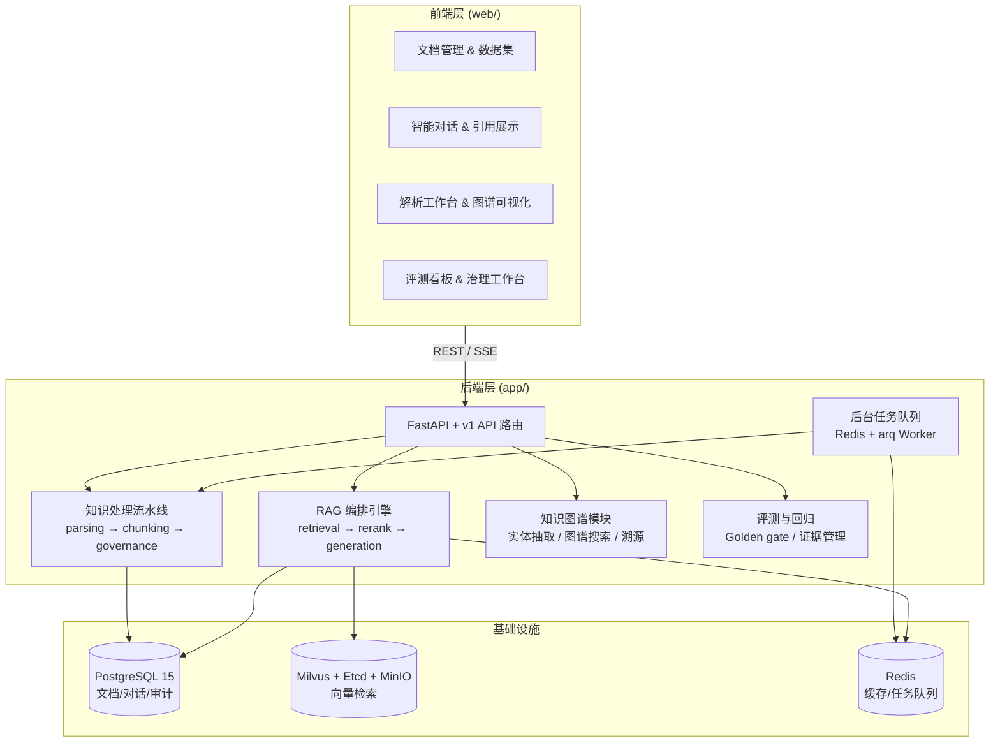
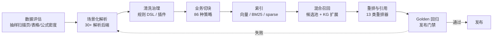

MimirQ 是一个**全栈开源、中文优先的企业 RAG 知识库**，核心定位是「把解析、治理、切块、检索、重排与引用做成可检查、可替换、可回归的知识流水线」[README.md](README.md#L3-L5)。它不是一个「上传文档 → 自动问答」的黑盒：当一次回答出错时，你能沿着流水线逐层定位问题出在解析、治理、切块、召回、重排还是生成环节，并用固定的评测题集证明修复有效。当前稳定版为 v1.0.1，采用 Apache 2.0 协议开源 [README.md](README.md#L56)。

本页是 Wiki 的入口页，面向刚接触仓库的读者：先讲清楚「为什么存在、解决什么问题、整体长什么样」，再给出仓库结构与后续阅读路线。具体操作步骤（启动、配置、解析器选择、界面操作）留待后续页面展开。

## 为什么做 MimirQ：问题的起点

MimirQ 起源于一次真实的政务知识库交付。团队发现，**企业知识库真正难的，不是把文档向量化，而是让错误可定位、策略可替换、质量可回归**。回答出错时，必须能判断：解析是否丢了表格、治理是否漏了规则、切块是否破坏了语义、召回是否漏掉了证据、重排是否排错了、生成是否偏离了引用——把整条链路藏在一个「上传并开始问答」的按钮后面，原型很快，长期交付却难以估算、验收和治理 [README.md](README.md#L36-L38)。

因此 MimirQ 把知识生产组织成一条显式的流水线，而不是一个隐藏的按钮：

> **一条可控的企业知识流水线**
>
> `数据评估` → `场景化解析` → `清洗治理` → `业务切块` → `向量 / 全文索引` → `混合召回` → `重排与引用` → `Golden 回归`

每个阶段都有可检查的输入输出、可替换的策略实现、可回归的质量证据 [README.md](README.md#L42)。MimirQ 并不试图取代所有平台：业务简单、流程稳定、低代码优先的场景直接用 Dify 或 RAGFlow 通常更快；只有当知识链路需要**按业务替换、审计和回归**时，MimirQ 的价值才体现出来——它把知识能力从具体聊天业务中解耦，甚至可以只作为 Dify 的外部知识层存在 [README.md](README.md#L48-L52)。

## 三个关键词：可检查、可回归、可治理

页面标题的三个词不是宣传语，而是仓库设计准则中的三条硬约束。设计准则文档定义了平台的长期边界：**平台是通用 RAG 内核与质量闭环，业务差异通过插件包进入系统**，目标是让每个业务都能用同一套合约完成解析、治理、切块、索引、检索、评测和发布 [rag_platform_design_principles.md](docs/guides/rag_platform_design_principles.md#L1-L8)。

**可检查（Checkable）**：入库链路每个阶段都有明确输入、输出、状态和失败原因——解析只负责把原始文件变成可处理内容，治理阶段清洗与补 metadata，切块阶段保留 provenance 与记录身份，索引阶段只消费标准 chunk，任何写库、写索引、写 KG 的动作都必须是显式命令 [rag_platform_design_principles.md](docs/guides/rag_platform_design_principles.md#L32-L50)。业务字段必须声明在 `metadata_schema.json` 中，按「召回可用、引用可解释、评测可验证」的原则进入 `_indexed_metadata`、`_display_metadata`、`_evaluable_metadata` 等平台视图 [rag_platform_design_principles.md](docs/guides/rag_platform_design_principles.md#L51-L63)。

**可回归（Regressable）**：检索的目标是「问题有答案时，候选证据中出现正确依据」，回答生成不能作为检索质量通过的证据。每个业务插件都应维护 Golden cases，Golden gate 至少覆盖 `hit_at_1`、`hit_at_3`、MRR/NDCG、`expected_metadata_hit_rate`、`effective_context_rate` 与 `noise_rate`，发布条件绑定 dataset、plugin ref、plugin package hash、retrieval profile、thresholds 与生成时间 [rag_platform_design_principles.md](docs/guides/rag_platform_design_principles.md#L76-L101)。任何影响 RAG 质量的改动都必须回答四个问题：是否改变了流水线环节、是否引入业务逻辑到平台、是否有 Golden 证据证明质量未下降、是否有显式回滚路径 [rag_platform_design_principles.md](docs/guides/rag_platform_design_principles.md#L113-L127)。

**可治理（Governable）**：平台只消费标准合约、不理解业务字段含义，业务规则（同义词、记录拆分、字段解释、Golden rules）都放在 `plugins/pipelines/<plugin>/` 中，禁止把地区、部门、产品线等业务语义写入平台运行时代码 [rag_platform_design_principles.md](docs/guides/rag_platform_design_principles.md#L24-L31)。这样业务可以越来越复杂，但核心平台始终通过同一套合约、同一套评测和同一套证据发布。

## 系统架构总览

在深入代码之前，先用一张图建立整体认知。MimirQ 是典型的三层结构：**Next.js 前端**通过 RESTful API / SSE 与 **FastAPI 后端**通信，后端内部再分为解析、切块、治理、RAG 编排等模块，底层依赖 PostgreSQL、Milvus、Redis、MinIO 等基础设施服务。图中的 `app/` 目录即后端核心代码，`web/` 目录即前端应用 [architecture.md](docs/architecture.md#L60-L107)。



技术栈方面：前端为 Next.js（App Router）+ TypeScript + Tailwind/Shadcn；后端为 FastAPI + Python 3.11；向量库默认 Milvus（低资源模式可用 Chroma/FAISS 替代）；关系库为 PostgreSQL；任务队列基于 Redis/arq；模型侧支持 OpenAI 兼容接口与本地部署模型 [architecture.md](docs/architecture.md#L43-L58)。需要特别说明的是，技术栈里的具体版本只是实现细节——MimirQ 的架构重点在于**每一层都暴露可检查的接口**：解析有质量证据、检索有 Trace、生成有逐句引用、评测有回归报告。

## 知识流水线：从原始文件到 Golden 回归

下面这张流程图展示了文档从上传到发布所经历的完整生命周期。理解它有助于后续阅读「文档解析」「切块策略」「数据治理」「入库生命周期」等页面时，始终知道当前模块处于流水线的哪个位置。



这条链路的每一阶段都是「拆分、可审计、可重跑」的：解析只负责把原始文件变成可处理内容；治理阶段清洗、规范化、拆记录并补业务 metadata；切块阶段决定证据粒度并保留 provenance；索引阶段只消费标准 chunk 与 metadata views；KG 阶段只消费 chunk 与插件事件，不能绕过 chunk evidence；Golden gate 在发布前证明检索能拿到答案依据，而不是证明 LLM 能编出答案 [rag_platform_design_principles.md](docs/guides/rag_platform_design_principles.md#L32-L50)。

在代码层面，这条流水线对应 `app/parsing/`（解析框架与解析器工厂）、`app/rag/chunking/`（切块策略）、`app/services/`（治理与入库服务）与 `app/rag/`（检索、重排、KG、评测）等目录。入口 `app/main.py` 负责组装 FastAPI 应用、注册中间件与路由、初始化数据库与任务队列 [app/main.py](app/main.py#L43-L65)。

## 核心能力矩阵

仓库 README 用一张对比表说明 MimirQ 与 Dify、RAGFlow、FastGPT、AnythingLLM、LangChain 的能力差异 [README.md](README.md#L250-L273)。这里只提取 MimirQ 自身的能力维度，作为项目概览：

| 能力维度 | MimirQ 提供的内容 | 代码位置 |
|:---|:---|:---|
| **文档解析** | 约 30 种解析后端：PDF、OCR、版式、表格、公式、VLM（DeepDoc、MinerU、Marker、olmOCR 等） | [app/parsing/parsers/](app/parsing/parsers) |
| **切块策略** | 86 种策略：递归、语义、父子、RAPTOR、Late Chunking、按文档类型定制（法规、PRD、会议纪要等） | [app/rag/chunking/strategies/](app/rag/chunking/strategies) |
| **检索 / 重排** | Milvus / FAISS / Chroma + BM25 / SPLADE / ColBERT / LTR / RRF；13 类重排器 | [app/rag/reranker/](app/rag/reranker) |
| **知识图谱** | 实体、关系、事件抽取；实体消解、社区发现与多跳检索 | [app/rag/kg/](app/rag/kg) |
| **评测 / 治理闭环** | RAGAS、回归门禁、Leaderboard、显著性检验、证据审计 | [app/rag/evaluation/](app/rag/evaluation) |
| **安全 Guard** | InputGuard / OutputGuard、PII / Secret 脱敏、SSRF 逐跳校验 | [app/rag/safety/](app/rag/safety) |
| **企业权限 / 合规** | 文档 ACL + Security Trimming、RBAC、SCIM / SSO / SAML、审计日志 | [app/services/rbac_service.py](app/services/rbac_service.py) |
| **Dify 外部知识库** | 原生兼容 Dify External Knowledge API，可作为独立检索层 | [app/api/v1/integrations_dify.py](app/api/v1/integrations_dify.py) |

数据库层面，仓库用 26 个 Alembic 迁移版本管理 Schema 演进（从基线到索引漂移项），覆盖多租户、KG 关系、文档生命周期、租户群组、SCIM 供应等能力 [alembic/versions/](alembic/versions)。这些数字只是实现广度，核心设计原则是：**每一步都能检查输入输出、追溯引用与版本，并用 Golden 题集守住发布质量** [README.md](README.md#L54)。

## 质量保证体系：把「回归」变成工程习惯

「可回归」在 MimirQ 里不是一句口号，而是落在 `.github/workflows/` 中的 10 个 CI 工作流与 `ci/` 目录下的阈值文件里。CI 主流程在 pull request 与 main 分支推送时运行，包含后端测试、前端测试、Docker 构建与检索门禁等作业 [ci.yml](.github/workflows/ci.yml#L1-L27)。围绕检索质量，仓库还提供多个专门工作流：

| 工作流 / 文件 | 作用 |
|:---|:---|
| [ci.yml](.github/workflows/ci.yml) | 主 CI：lint、测试、构建、检索边界门禁 |
| [rag-quality-gate.yml](.github/workflows/rag-quality-gate.yml) | RAG 质量门禁：用固定 fixture 跑检索基准并产出质量报告 |
| [parsing-proof-sample.yml](.github/workflows/parsing-proof-sample.yml) | 解析证明采样：验证「解析 → 检索」闭环不退化 |
| [parsing-proof-nightly.yml](.github/workflows/parsing-proof-nightly.yml) | 解析证明夜间任务 |
| [perf-nightly.yml](.github/workflows/perf-nightly.yml) | 性能回归：对比串行/并发负载报告 |
| [security.yml](.github/workflows/security.yml) | 依赖审计与安全扫描 |
| [ci/retrieval_thresholds.v2.json](ci/retrieval_thresholds.v2.json) | 检索阈值：Recall / Hit@20 / MRR / NDCG 的最小值 |
| [ci/release_gate_budgets.v1.json](ci/release_gate_budgets.v1.json) | 发布预算：检索 P95 时延、错误率、零命中率与成本上限 |

阈值文件是可读、可评审的 JSON——例如检索阈值文件要求 `retrieval_recall`、`retrieval_hit_at_20`、`retrieval_mrr`、`retrieval_ndcg_at_20` 均为 1.0，并按文件类型与语言分片校验 [retrieval_thresholds.v2.json](ci/retrieval_thresholds.v2.json#L1-L28)；发布预算文件则按 60 分钟与 1440 分钟窗口约束 P95/P99 时延、零命中率与错误率 [release_gate_budgets.v1.json](ci/release_gate_budgets.v1.json#L1-L30)。

本地开发同样有一键自检入口：`make verify` 会跑后端 lint、策略校验、文档链接检查与前端 lint/typecheck [Makefile](Makefile#L573-L583)；`make enterprise-checks` 在此基础上追加后端与前端完整测试套件 [Makefile](Makefile#L584-L591)；`make core-e2e` 则在真实运行中的服务上验证「就绪 → 入库 → 解析 → 检索证据」的最小闭环，不依赖 LLM [Makefile](Makefile#L446-L453)。仓库现有 214 个后端测试文件，覆盖从检索路由到多租户隔离的各类行为。

## 真实场景验证：固定 800 题

「可回归」最直接的证据来自真实政务场景的固定 800 题实测。MimirQ 已用于市级政务智能问答助手，覆盖 7 个区域级 + 1 个市级知识库；2026-07-27 用同一固定 800 题和真实自托管模型复测，五条链路最终均无失败 [README.md](README.md#L277-L281)：

| 链路 | 成功执行 | 准确 / 部分准确 / 证据不足 | 准确率 / 可用率 | 证据覆盖 | 平均 / P95 |
|:---|---:|---:|---:|---:|---:|
| **MimirQ 检索直连** | **800 / 800** | **791 / 9 / 0** | **98.9% / 100%** | **99.5%** | **3.64s / 12.58s** |
| **真实 Embedding + Reranker + LLM** | **800 / 800** | **727 / 73 / 0** | **90.9% / 100%** | **99.7%** | **2.59s / 8.15s** |
| **Dify HTTP → MimirQ** | **800 / 800** | 514 / 223 / 63 | 64.3% / 92.1% | 96.3% | 13.15s / 17.33s |
| **Dify External → MimirQ** | **800 / 800** | 502 / 232 / 66 | 62.7% / 91.7% | **99.7%** | 12.14s / 11.17s / 23.49s |
| **Dify 原生知识库** | **800 / 800** | 309 / 287 / 204 | 38.6% / 74.5% | 83.8% | 13.67s / 29.55s |

直连输出检索证据，其他链路输出生成答案，因此准确率与延迟不是严格同任务横比。值得注意的结论是：Dify HTTP / External 链路的证据覆盖达 96.3% / 99.7%，但答案条款覆盖仅 83.6% / 83.8%，**主要损失在 Dify 生成编排而不是 MimirQ 召回**——这正是「可检查」价值的具体体现：数据证明问题出在生成层，而不是盲目调检索参数 [README.md](README.md#L291)。完整评测口径、历史复测与方法论见 [docs/benchmarks/changzhou_dify.md](docs/benchmarks/changzhou_dify.md#L1-L23)；可公开复现的中文检索基准（MIRACL-zh + CFEVER）见后续文档。

## 仓库结构速览

对于初学者，先记住五个关键目录，其余可随用随查：

```
MimirQ/
├── app/                  # FastAPI 后端核心
│   ├── api/v1/           # API 路由（含 Dify 集成）
│   ├── core/             # 配置、数据库、安全、日志
│   ├── models/           # SQLModel 数据模型
│   ├── parsing/          # 解析框架（工厂、路由、子进程隔离）
│   ├── rag/              # 切块、检索、重排、KG、评测、对话引擎
│   ├── services/         # 176 个业务服务（治理、入库、报告等）
│   └── tasks/            # Redis/arq 后台任务队列
├── web/                  # Next.js 前端（App Router + i18n）
├── docker/               # Docker Compose 与解析器容器
├── alembic/versions/     # 26 个数据库迁移版本
├── ci/                   # 检索阈值、发布预算等 JSON 策略文件
├── .github/workflows/    # 10 个 CI 工作流
├── tests/                # 214 个后端测试文件
└── Makefile              # 所有常用命令的统一入口
```

数据流可简化为两条主线：文档侧「上传 → 解析 → 分块 → Embedding → 存入 Milvus → 构建 BM25 索引 → 更新数据库」；对话侧「提问 → 混合检索（向量 + BM25）→ RAG 引擎编排 → LLM 流式生成 → SSE 返回 → 保存对话记录」[architecture.md](docs/architecture.md#L199-L214)。`Makefile` 是操作枢纽：`make up-web` 一键启动完整栈，`make setup-host` 准备源码开发环境，`make enterprise-checks` 提交前自检 [Makefile](Makefile#L90-L150)。

## 下一步阅读

本页是 Wiki 的起点。建议按以下顺序继续：

1. **先把系统跑起来**：阅读 [快速开始：Docker 一键启动与源码开发模式](2-kuai-su-kai-shi-docker-jian-qi-dong-yu-yuan-ma-kai-fa-mo-shi)，了解两种启动方式的差异。
2. **配置模型服务**：阅读 [环境变量与模型服务接入：LLM、Embedding、Reranker 配置](3-huan-jing-bian-liang-yu-mo-xing-fu-wu-jie-ru-llm-embedding-reranker-pei-zhi)，这是真实知识库闭环的必填项。
3. **按需选择解析器**：阅读 [解析器生态与按需启动：DeepDoc、MinerU、Marker、olmOCR 等 30+ 后端](4-jie-xi-qi-sheng-tai-yu-an-xu-qi-dong-deepdoc-mineru-marker-olmocr-deng-30-hou-duan)，理解 CPU/GPU 场景差异。
4. **跑通用户操作闭环**：阅读 [用户操作指南：数据集、上传解析、切块、检索与引用验证](5-yong-hu-cao-zuo-zhi-nan-shu-ju-ji-shang-chuan-jie-xi-qie-kuai-jian-suo-yu-yin-yong-yan-zheng)。
5. **了解集成方式**：如果已有 Dify 应用，阅读 [Dify 外部知识层接入：作为独立检索层的集成方式](6-dify-wai-bu-zhi-shi-ceng-jie-ru-zuo-wei-du-li-jian-suo-ceng-de-ji-cheng-fang-shi)。
6. **理解质量保障**：阅读 [开发、测试与验证工作流：Makefile 与前后端质量检查](7-kai-fa-ce-shi-yu-yan-zheng-gong-zuo-liu-makefile-yu-qian-hou-duan-zhi-liang-jian-cha)，掌握提交前自检与 CI 门禁。

当你想深入源码时，可以从「深入解析」章节的 [FastAPI 应用骨架与启动生命周期](8-fastapi-ying-yong-gu-jia-yu-qi-dong-sheng-ming-zhou-qi-zhong-jian-jian-pei-zhi-yi-chang-chu-li-yu-yun-xing-shi-qian-yi) 或 [数据模型与 Alembic 迁移体系](9-shu-ju-mo-xing-yu-alembic-qian-yi-ti-xi-26-ge-qian-yi-ban-ben-yu-ji-xian-yan-jin) 开始。记住贯穿全项目的一句话：**每一步都能检查输入输出、追溯引用与版本，并用 Golden 题集守住发布质量**——这是理解 MimirQ 一切设计决策的钥匙。