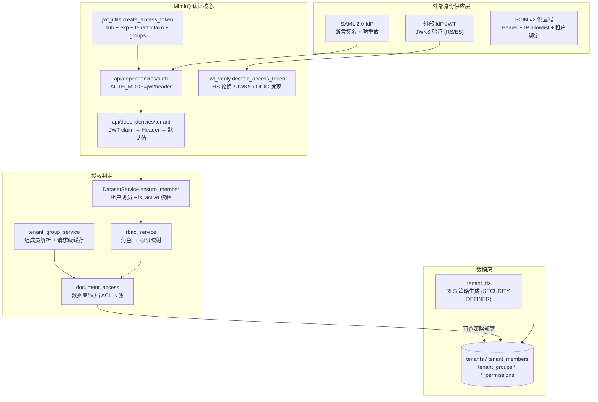

MimirQ 的安全体系围绕「租户隔离」这一第一原则展开：任何数据访问都必须先确定租户上下文，再经过角色判定与资源级 ACL 双重过滤。本页聚焦五层防御机制的实现细节——行级安全（RLS）SQL 策略生成、基于 `tenant_members.role` 的 RBAC 权限矩阵、支持密钥轮换与 JWKS 的 JWT 验证管线、签名校验 + 防重放的 SAML 2.0 断言交换，以及默认关闭、fail-closed 的 SCIM v2 供应端点——并说明它们如何通过审计日志串成可追踪的安全边界。

## 安全架构总览

系统在数据访问路径上依次叠加了四道隔离闸门：**租户上下文解析**（JWT claim 优先，Header 兜底）→ **成员资格校验**（`ensure_member`）→ **角色权限判定**（RBAC 权限矩阵）→ **资源级 ACL**（数据集/文档 allowlist 与组权限）。外部身份供应（SAML/SCIM）则从「身份来源」一侧向该系统注入经过验证的用户、租户绑定与组关系。

Sources: [app/api/dependencies/auth.py](app/api/dependencies/auth.py#L151-L197)、[app/api/dependencies/tenant.py](app/api/dependencies/tenant.py#L62-L107)

## 多租户数据模型与租户上下文解析

租户隔离的存储基座由两张表构成：`tenants` 记录租户本体（名称唯一、状态、套餐），`tenant_members` 以 `(tenant_id, user_id)` 唯一约束记录成员资格，并在企业化演进中补入了 `is_active`（软注销）与 `is_current`（当前租户标记）两个生命周期字段。成员表中的 `user_id` 是字符串类型，与 JWT 的 `sub` claim、SCIM 的 `userName` 直接对齐，避免了跨系统的 ID 转换层。[Sources: [app/models/tenant.py](app/models/tenant.py#L10-L49)、[alembic/versions/0012_scim_provisioning_hardening.py](alembic/versions/0012_scim_provisioning_hardening.py#L20-L34)]

租户上下文的解析遵循严格的优先级链，`get_tenant_id` 依赖先尝试从已验证的 JWT 中读取 `JWT_TENANT_CLAIM` 配置的 claim（如 `tenant_id`），只有 JWT 不可用或未配置该 claim 时才回落到 `X-Tenant-ID` 请求头；在 `ENV=production` 下请求头缺失会直接返回 400，开发环境则允许使用 `DEFAULT_TENANT_ID` 兜底。这一设计的关键安全属性是：**已验证的 JWT 租户绑定优先于客户端自报的 Header**——`test_tenant_dependency_prefers_verified_jwt_tenant.py` 专门验证了即使 `TENANT_PREFER_JWT_TENANT=false`，带租户 claim 的合法 JWT 也会覆盖攻击者伪造的 `X-Tenant-ID`。[Sources: [app/api/dependencies/tenant.py](app/api/dependencies/tenant.py#L28-L107)、[tests/test_tenant_dependency_prefers_verified_jwt_tenant.py](tests/test_tenant_dependency_prefers_verified_jwt_tenant.py#L35-L56)]

防御纵深上还有两道可选闸门：`JWT_ENFORCE_TENANT_HEADER_MATCH=true` 时要求请求头租户与 JWT 租户严格一致，从源头掐断跨租户 Header 欺骗；`TENANT_HEADER_TRUSTED` 则仅供「可信网关已剥离/注入 Header」或单租户部署的明确场景使用，生产环境默认不信任客户端 Header。[Sources: [app/core/config.py](app/core/config.py#L875-L882)、[app/api/dependencies/auth.py](app/api/dependencies/auth.py#L78-L89)]

## 行级安全（RLS）：SQL 策略生成器

`tenant_rls.py` 提供了一个可审计、可注入防护的 RLS 策略生成器：`build_tenant_rls_bundle` 接收租户表、受管表清单与列名，输出一份结构化的 SQL 策略包（schema、函数、策略三部分）。其核心是两个 `SECURITY DEFINER` 函数——`is_admin()` 检查 `auth.uid()` 是否命中租户表中的 admin 角色，`tenant_matches(resource_tenant)` 检查当前会话用户是否属于指定租户——两者均显式 `SET search_path = pg_catalog` 以封死 search_path 劫持向量。[Sources: [app/services/tenant_rls.py](app/services/tenant_rls.py#L48-L67)]

针对每张受管表，生成器输出三类 DDL：`ENABLE ROW LEVEL SECURITY`、`FOR SELECT USING (is_admin() OR tenant_matches(tenant_id))` 的读策略、以及 `FOR ALL ... WITH CHECK` 同条件复用的写策略，实现「管理员全量可见、普通用户仅见本租户」的默认拒绝模型。更值得关注的是其注入防护：所有标识符经双引号转义、字面量经单引号翻倍转义，`test_tenant_rls.py` 用 `DROP TABLE` 注入样例验证了策略名、列名、schema 名与 admin 角色值均被安全引用。该生成器当前作为可选部署制品存在（策略需由具备超级权限的迁移流程执行），是应用层租户过滤之外的数据库层兜底。[Sources: [app/services/tenant_rls.py](app/services/tenant_rls.py#L29-L91)、[tests/test_tenant_rls.py](tests/test_tenant_rls.py#L5-L50)]

## RBAC：角色体系与权限矩阵

角色模型定义在 `UserRoles` 常量中，共六档：`owner`、`admin`、`auditor`、`editor`、`dataset_operator`、`viewer`，其中 `owner/admin` 构成 `ADMIN_ROLES`，`owner/admin/editor/dataset_operator` 构成 `EDIT_ROLES`（数据集与连接器写入 API 的判定依据）。`rbac_service.py` 在此基础上将「租户级管理能力」抽象为细粒度权限常量，并维护一张角色 → 权限的映射表：

| 权限 | 允许角色 | 典型用途 |
|---|---|---|
| `settings.read` / `settings.write` | owner, admin | 租户设置、成员管理、组管理 |
| `observability.read` / `usage.read` | owner, admin | 可观测性与用量面板 |
| `audit.read` | owner, admin, auditor | 审计日志查询 |
| `table_sql.read` | owner, admin, auditor | 表数据 SQL 只读 |
| `lifecycle.manage` | owner, admin | 文档生命周期管理 |
| `feedback_triage.write` | owner, admin, editor, dataset_operator | 反馈分诊 |

Sources: [app/core/constants.py](app/core/constants.py#L221-L239)、[app/services/rbac_service.py](app/services/rbac_service.py#L17-L57)

`ensure_tenant_permission` 是服务层的统一入口：先复用 `DatasetService.ensure_member` 校验成员资格（生产环境非成员直接 403，且 `is_active=false` 的软注销成员同样被拒），再按权限矩阵比对角色，不匹配即抛 403。[Sources: [app/services/rbac_service.py](app/services/rbac_service.py#L79-L95)、[app/services/dataset_service.py](app/services/dataset_service.py#L25-L58)]

管理面 API（`/api/v1/rbac`）在此基础上实现了租户安全的关键约束：修改角色与移除成员均先对全部活跃管理员执行 `SELECT ... FOR UPDATE` 行锁，**禁止降级或移除最后一个管理员**（409 冲突），且移除成员时级联撤销其组会员关系、数据集与文档 allowlist 授权并写入审计事件——保证「删人即全面回收权限」。[Sources: [app/api/v1/rbac.py](app/api/v1/rbac.py#L43-L57)、[app/api/v1/rbac.py](app/api/v1/rbac.py#L109-L241)]

## 资源级 ACL：数据集与文档权限

租户隔离解决「谁能进这个租户」，资源级 ACL 解决「进了之后能看哪些数据」。数据集采用三态权限枚举：`only_me`（仅属主）、`all_team_members`（全租户成员）、`partial_members`（allowlist）。`build_dataset_read_filter` 将直接成员授权表与组授权表（`dataset_group_permissions`）编织进 SQL 谓词——`partial_members` 模式下，`EXISTS` 子查询分别匹配 `dataset_permissions.account_id` 与成员所在组的 `group_id`。[Sources: [app/models/dataset.py](app/models/dataset.py#L17-L72)、[app/services/document_access.py](app/services/document_access.py#L40-L62)]

文档层实现了更细粒度的「security trimming」：`documents.access_mode` 取值为 `inherit`（默认，完全继承数据集权限）、`only_me`、`partial_members`、`all_team_members`。文档的读过滤谓词在数据集权限之上叠加了属主判定与文档级 allowlist（`document_permissions` + `document_group_permissions`），未知模式一律 fail-closed。[Sources: [app/models/document.py](app/models/document.py#L63-L133)、[app/services/document_access.py](app/services/document_access.py#L65-L96)]

组是这套 ACL 与 IdP 之间的桥梁：`tenant_groups` 提供租户内唯一名称与可选 `external_id`（IdP 稳定标识），`tenant_group_members` 记录成员关系；`TenantGroupService.resolve_account_group_ids` 在单次请求内缓存组成员解析结果，避免多轮权限判定重复查库。迁移 0010/0011 为组与组授权建表，0012 则把 `external_id` 收紧为「租户内部分唯一索引」以对齐 IdP 供应语义。[Sources: [app/models/tenant_group.py](app/models/tenant_group.py#L20-L68)、[app/models/group_permissions.py](app/models/group_permissions.py#L16-L65)、[alembic/versions/0010_add_tenant_groups.py](alembic/versions/0010_add_tenant_groups.py#L10-L53)、[alembic/versions/0011_add_group_permissions.py](alembic/versions/0011_add_group_permissions.py#L9-L62)]

## JWT：签发、验证与密钥轮换

MimirQ 自身签发的访问令牌由 `create_access_token` 生成：载荷含 `sub`（用户 ID）、`exp`、`iat`，并可选注入 `iss`、`aud` 与 `JWT_TENANT_CLAIM` 指定的租户 claim；`extra_claims` 机制允许 SAML 交换或组同步把 `groups` 等声明直接嵌入令牌。[Sources: [app/core/jwt_utils.py](app/core/jwt_utils.py#L31-L61)]

验证侧 `decode_access_token` 按算法族分两条路径，核心目标是**密钥轮换不停机**：

| 场景 | 机制 | 关键参数 |
|---|---|---|
| HS*（自签） | 依次尝试 `SECRET_KEY` + `SECRET_KEY_FALLBACKS`（最多 6 个候选）；过期错误立即上抛不再换钥 | `SECRET_KEY_FALLBACKS` |
| RS*/ES*（外部 IdP） | 远程 JWKS 拉取，按 `kid` 匹配；kid 未命中时强制刷新一次以支持 IdP 侧轮换 | `JWT_JWKS_URLS`、`JWT_JWKS_CACHE_TTL_SEC`、`JWT_JWKS_MAX_STALE_SEC` |
| OIDC 发现 | 从 `JWT_ISSUER` 推导 `.well-known/openid-configuration`，校验发现端 `issuer` 一致后取 `jwks_uri` | `JWT_JWKS_DISCOVERY_ENABLED` |

Sources: [app/core/jwt_verify.py](app/core/jwt_verify.py#L53-L77)、[app/core/jwt_verify.py](app/core/jwt_verify.py#L242-L342)、[app/core/jwt_verify.py](app/core/jwt_verify.py#L344-L371)

安全细节上有三处值得注意：JWKS/OIDC 缓存均为带锁的单飞结构（同 URL 并发只拉一次）；刷新失败时允许在 `MAX_STALE_SEC` 有界窗口内使用旧缓存键，超过即 fail-closed；所有外部 HTTP 响应都会走 `_validate_response_url_chain`，强制校验重定向链全程保持 HTTPS（非 localhost），杜绝通过降级到 HTTP 的响应投毒。此外 JWKS 拉取刻意不复用全局 HTTP 客户端池，避免把内部 `X-Request-ID`/`X-Tenant-ID` 头泄露给外部 IdP。[Sources: [app/core/jwt_verify.py](app/core/jwt_verify.py#L24-L51)、[app/core/jwt_verify.py](app/core/jwt_verify.py#L242-L255)]

## SAML SSO：断言验证、防重放与 Bridge

SAML 走「后端验证 + 签发应用 JWT」的收敛模型：浏览器侧的 Next.js ACS 路由只做转发，`POST /api/v1/auth/saml/exchange` 是唯一执行身份映射与令牌签发的组件。IdP 配置由 `SAML_PROVIDERS_JSON` 提供（支持多 provider，缺省时按 `provider_id` 或唯一 provider 解析），每个 provider 绑定 issuer、audience、ACS URL 与 IdP X.509 证书。[Sources: [app/services/saml_service.py](app/services/saml_service.py#L158-L222)、[app/api/v1/auth.py](app/api/v1/auth.py#L137-L160)]

断言验证是多重条件叠加的严格检查链：XML 签名以 IdP 证书验签（`signxml.XMLVerifier`，lxml 解析器显式关闭实体解析与网络访问）；随后依次校验 Response 与 Assertion 的 Issuer、Destination（必须等于配置的 ACS URL）、Status 为 Success、Audience、SubjectConfirmationData 的 Recipient，以及带时钟偏移（默认 60 秒）的 `NotBefore`/`NotOnOrAfter` 时间窗。**只有全部通过才进入防重放环节**——重放键取断言 ID，TTL 为断言过期时间与 `SAML_REPLAY_TTL_SEC`（默认 300 秒）的较大者。[Sources: [app/services/saml_service.py](app/services/saml_service.py#L226-L350)]

防重放与 Bridge 会话是「同构双后端」模式：内存实现用 `threading.Lock` 保护的进程内字典，Redis 实现用 `SET NX EX` 原子占位与 Lua 脚本原子取出即删（`GET` + `DEL` 封装在 `eval` 中）。`SAML_REPLAY_REDIS_ENABLED=true` 是多副本生产部署的硬性要求——多 Pod 场景下内存字典无法提供跨进程防护，Redis 不可用时直接 503 而非降级。Bridge 会话则把已交换的完整会话（token + 用户 + return_to）编码为一次性 code，TTL 取 60 秒与会话剩余寿命的较小值，专用于跨域/跨进程的浏览器侧会话交接。[Sources: [app/services/saml_replay_service.py](app/services/saml_replay_service.py#L13-L63)、[app/services/saml_bridge_service.py](app/services/saml_bridge_service.py#L113-L157)]

身份映射遵循「不自动建号」原则：按 `email_attribute` 解析邮箱 → `UserService.get_by_email`，失败则回退 `NameID`（邮箱形走邮箱查询，否则走用户名查询）；本地无活跃账号即 403。匹配成功后，用户的当前租户被写入 JWT 租户 claim，断言中的 `groups_attribute` 组列表则嵌入 `JWT_GROUPS_CLAIM`，让后续请求的组同步钩子自动接管。SP 元数据（`GET /api/saml/metadata`）支持可选证书宣告与签名（`SAML_SP_METADATA_SIGNED`）。[Sources: [app/services/saml_service.py](app/services/saml_service.py#L102-L155)、[app/services/saml_service.py](app/services/saml_service.py#L352-L403)、[docs/guides/saml_sso.md](docs/guides/saml_sso.md#L13-L48)]

## SCIM 供应：目录对接与生命周期

SCIM v2 端点（`/api/v1/scim/v2`）是身份供应的写入侧，设计原则为「默认关闭、fail-closed、tenant-safe」。启用需同时满足四个条件，任一缺失即拒绝：

| 防护层 | 机制 |
|---|---|
| 功能开关 | `SCIM_ENABLED=false` 时所有端点返回 404 |
| 令牌鉴权 | `SCIM_BEARER_TOKEN` 支持逗号/空格分隔的 active set（平滑轮换），每个令牌可为 raw 或 `sha256:<hex>`，比对用 `hmac.compare_digest` |
| 租户绑定 | 请求头租户必须与 `SCIM_TENANT_ID` 完全一致，令牌不可跨租户使用 |
| IP allowlist | `SCIM_IP_ALLOWLIST_CIDRS` 一旦设置即 fail-closed（无 IP/解析失败/不在范围内 → 403） |

Sources: [app/api/v1/scim.py](app/api/v1/scim.py#L47-L65)、[app/api/v1/scim.py](app/api/v1/scim.py#L169-L215)、[app/core/config.py](app/core/config.py#L924-L944)

端点按「读为主、写显式开启」分层：发现端点（`ServiceProviderConfig`/`Schemas`/`ResourceTypes`）与 `GET /Users`、`GET /Groups` 始终可用；`POST /Users`（默认角色 `viewer`）、`PATCH /Users/{id}`（仅支持 `active` 启停）、`PUT/DELETE /Groups`（`SCIM_GROUPS_MUTATION_ENABLED`）、`PATCH /Groups/{id}`（成员增删，幂等）各自独立开关。SCIM 与内部模型的映射清晰：User `id`/`userName` → `tenant_members.user_id`，`active` → `is_active`；Group `id` → `tenant_groups.id`，`displayName` → `name`，`externalId` → `external_id`（租户内唯一，冲突 409），`members[].value` → `tenant_group_members.user_id`。[Sources: [app/api/v1/scim.py](app/api/v1/scim.py#L228-L310)、[app/api/v1/scim.py](app/api/v1/scim.py#L669-L825)、[docs/guides/scim.md](docs/guides/scim.md#L76-L130)]

注销路径值得一提：`PATCH /Users/{id}` 将 `active` 置 false 时，成员被标记软注销并清除 `is_current`；若开启 `SCIM_DEPROVISION_REVOKE_GROUP_MEMBERSHIPS_ENABLED`，则同时批量删除该用户的全部组会员关系。所有 SCIM 写操作（含每次成员 PATCH 的 add/remove 请求数与实际生效数）都写入审计日志，且审计详情只存 PII 哈希与长度，不落原始用户标识。[Sources: [app/api/v1/scim.py](app/api/v1/scim.py#L745-L825)、[app/api/v1/scim.py](app/api/v1/scim.py#L655-L667)]

## 企业联动：JWT 组同步与自动成员供应

SCIM 解决的是 IdP → MimirQ 的目录推送，而 JWT 组同步解决的是「外部 IdP 签发的令牌内嵌组声明」这一互补场景。`jwt_group_sync_service` 在每次认证请求中按进程内 TTL 节流（默认 60 秒），把 `JWT_GROUPS_CLAIM`（支持 `realm_access.roles` 这类点分路径）解析出的组名以「按名 upsert + 只增不删」的方式写入 `tenant_groups` 与 `tenant_group_members`；组名超长、超量（`JWT_GROUPS_MAX_GROUPS` 上限）均被过滤，日志绝不打印原始组列表。[Sources: [app/services/jwt_group_sync_service.py](app/services/jwt_group_sync_service.py#L26-L57)、[app/services/jwt_group_sync_service.py](app/services/jwt_group_sync_service.py#L88-L190)]

配套的 `tenant_member_provisioning_service` 解决另一缺口：外部 IdP 用户首次访问时 `tenant_members` 尚无行，ACL 判定将失败。开启 `JWT_TENANT_MEMBER_AUTO_PROVISION_ENABLED` 后，认证管线会在持有已验证租户 UUID 的前提下，以默认 `viewer` 角色补建成员行——且明确「租户不存在则不供应」「失败绝不停阻塞认证」，审计同样只存哈希。两个服务都运行在 `asyncio.to_thread` 后台线程中，与主认证路径解耦。[Sources: [app/services/tenant_member_provisioning_service.py](app/services/tenant_member_provisioning_service.py#L28-L101)、[app/api/dependencies/auth.py](app/api/dependencies/auth.py#L100-L144)]

## 审计贯穿与安全测试保障

上述每个安全动作都有对应的 `audit_log_event` 落点：RBAC 成员增删改、组管理、SCIM 的 user/group 生命周期、JWT 自动供应，全部写入追加式的 `audit_logs` 表（租户 ID + 操作者 + action + 资源类型 + 资源 ID + 请求上下文）。这保证了安全边界的每一次收窄与放宽都可追溯——`audit.read` 权限本身也只授予 owner/admin/auditor。[Sources: [app/models/audit_log.py](app/models/audit_log.py#L18-L27)、[app/api/v1/rbac.py](app/api/v1/rbac.py#L222-L235)]

测试体系与实现一一对应：`test_tenant_rls.py` 验证 SQL 注入防护，`test_tenant_dependency_prefers_verified_jwt_tenant.py` 验证 JWT 租户绑定不可被 Header 覆盖，`test_auth_saml_exchange_endpoint.py` 与 `test_saml_replay_service.py` 验证交换与防重放路径，`test_rbac_current_access_endpoint.py` 验证权限矩阵推导，`test_security_boundary_permissions.py`、`test_second_pass_backend_permissions.py` 等则从边界视角验证权限过滤不被绕过。整套体系构成了「身份验证 → 租户绑定 → 角色判定 → 资源过滤 → 审计追踪」的闭环。

## 下一步阅读

- 认证管线的完整启动上下文见 [FastAPI 应用骨架与启动生命周期：中间件、配置、异常处理与运行时迁移](8-fastapi-ying-yong-gu-jia-yu-qi-dong-sheng-ming-zhou-qi-zhong-jian-jian-pei-zhi-yi-chang-chu-li-yu-yun-xing-shi-qian-yi)
- 支撑租户/权限表结构的迁移体系见 [数据模型与 Alembic 迁移体系：26 个迁移版本与基线演进](9-shu-ju-mo-xing-yu-alembic-qian-yi-ti-xi-26-ge-qian-yi-ban-ben-yu-ji-xian-yan-jin)
- 会话级租户隔离如何贯穿对话链路，见 [RAG 对话引擎：引用生成、声明证据映射与忠实度评分](20-rag-dui-hua-yin-qing-yin-yong-sheng-cheng-sheng-ming-zheng-ju-ying-she-yu-zhong-shi-du-ping-fen) 与 [会话记忆与持久化：短期/长期记忆与对话缓存](22-hui-hua-ji-yi-yu-chi-jiu-hua-duan-qi-chang-qi-ji-yi-yu-dui-hua-huan-cun)
- 生产部署中的安全基线见 [部署方案与运维手册：Docker Compose、Helm、备份恢复与演练](29-bu-shu-fang-an-yu-yun-wei-shou-ce-docker-compose-helm-bei-fen-hui-fu-yu-yan-lian)