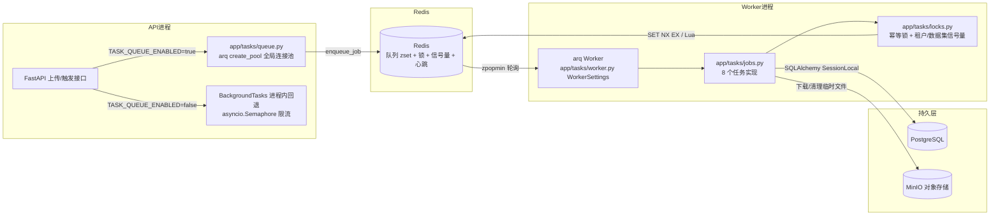
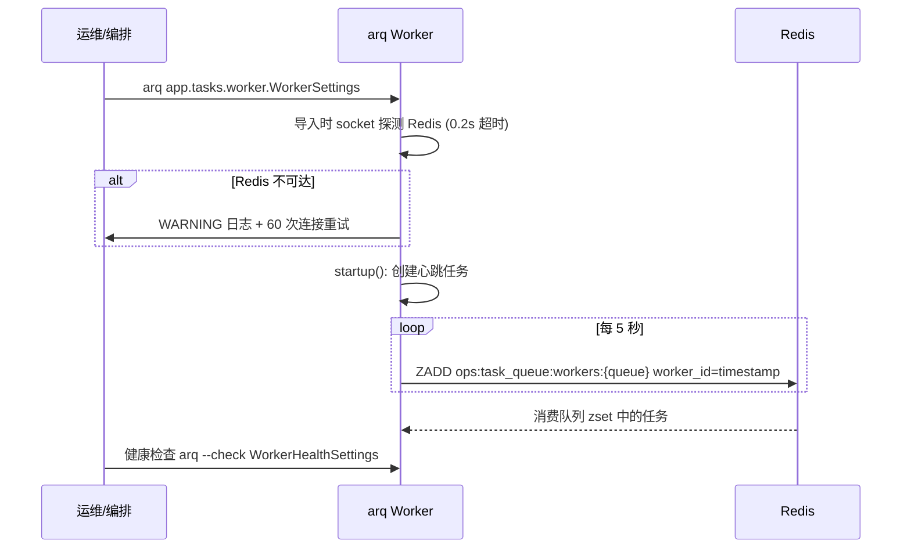
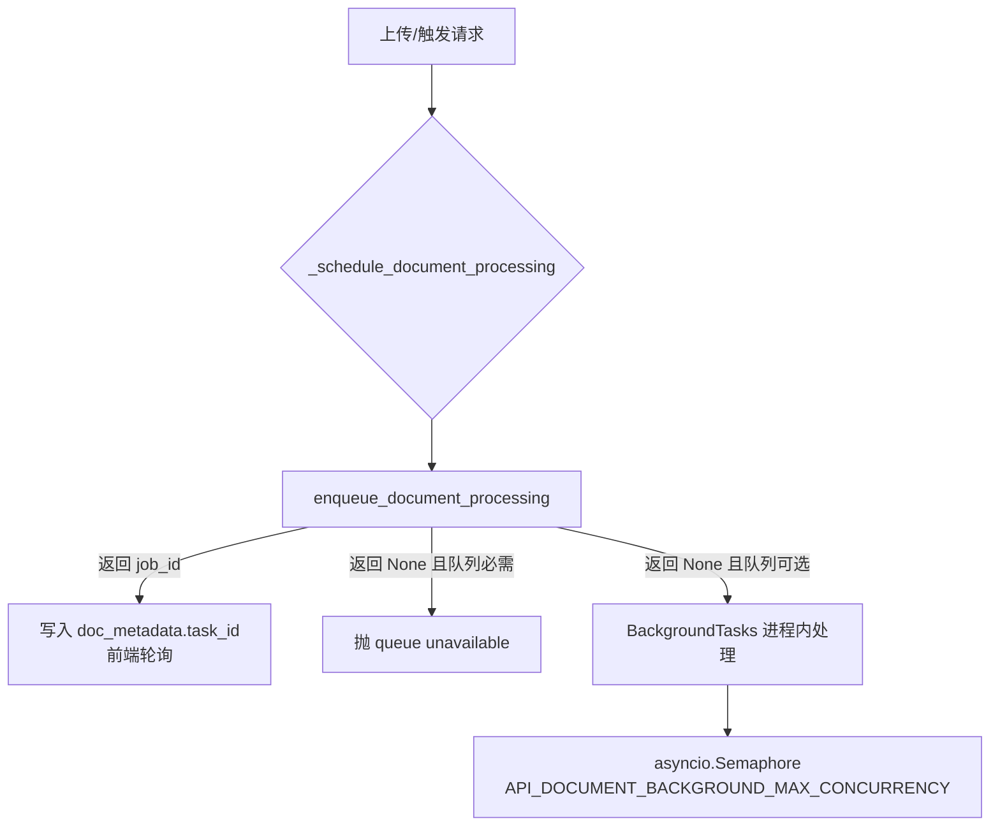

本文深入解析 MimirQ 的后台任务系统：它以 Redis 为消息总线、以 arq 0.27 为队列框架，将文档解析、知识图谱抽取、索引重建等重活从 API 请求路径中剥离，交给独立 Worker 进程异步执行。全文围绕四个核心问题展开：任务如何入队、Worker 如何消费、并发与幂等如何被 Redis 原语保护、以及运维如何观测队列健康。这套体系与页面 [数据模型与 Alembic 迁移体系](9-shu-ju-mo-xing-yu-alembic-qian-yi-ti-xi-26-ge-qian-yi-ban-ben-yu-ji-xian-yan-jin) 中描述的数据库层解耦，又与 [入库生命周期与失败处理](15-ru-ku-sheng-ming-zhou-qi-yu-shi-bai-chu-li-ingestion-runs-si-xin-dui-lie-yu-zhong-shi-ji-zhi) 中的 ingestion runs 状态机相互配合。

## 架构总览：一条从 API 到 Worker 的异步链路

任务队列的动机非常直接：文档解析与 KG 抽取可能耗时数分钟甚至更久，若在 API 请求内同步执行，上传接口会被长任务阻塞，且解析器的 CPU/GPU 密集工作会挤占 Web 服务的响应能力。MimirQ 的选择是：**默认关闭队列（`TASK_QUEUE_ENABLED=false`），由 API 进程内有界并发地处理；开启后则交给独立 arq Worker**，两条路径共享同一套文档处理逻辑，只是调度边界不同。

队列连接的生命周期由 API 进程在启动时统一管理：`init_queue()` 通过 `create_pool` 建立 arq 连接池（仅在 `TASK_QUEUE_ENABLED=true` 时生效），关闭时调用 `close_queue()`；两者都包裹在 FastAPI lifespan 中，失败仅记录 warning 而不阻断启动。API 侧持有的是**单例连接池**（`_queue` 全局变量 + `asyncio.Lock` 双重检查），避免每个请求都新建连接。

Sources: [queue.py](app/tasks/queue.py#L52-L87)、[main.py](app/main.py#L274-L287)、[main.py](app/main.py#L381-L382)

## Worker 启动与生命周期：冷启动容错与心跳

Worker 的入口是 `app/tasks/worker.py` 中的 `WorkerSettings` 类，启动命令为 `arq app.tasks.worker.WorkerSettings`。它做了三层启动保护：

**第一层是 Redis 冷启动探测。** 模块导入时 `_warn_if_redis_unreachable` 会用 0.2 秒超时的 socket 探测 Redis 端口；若不可达，会在 arq 配置日志前以 WARNING 级别输出一条明确提示，避免 Worker 在容器编排中反复崩溃重启（crash loop）而无人知晓。配套的 `conn_timeout=1s`、`conn_retries=60`、`conn_retry_delay=1s` 让 Worker 在 Redis 尚未就绪时耐心重试而非立刻退出。

**第二层是启动/关闭钩子。** `startup` 钩子启动一个 fire-and-forget 的心跳任务：以 `hostname:pid` 作为 worker_id，每 5 秒向 Redis 有序集合 `ops:task_queue:workers:{queue}` 写入一次带时间戳的心跳（score 为 unix 时间），并顺带刷新集合的过期时间。心跳任务被存入 ctx，`shutdown` 钩子负责取消它。这个设计刻意不阻塞 Worker 启动——心跳失败只记 warning。

**第三层是轻量健康检查。** `app/tasks/queue.py` 中的 `WorkerHealthSettings` 只包含 Redis 地址与队列名，**不导入任何任务实现**，因此 `arq --check app.tasks.queue.WorkerHealthSettings` 可以极快地验证队列可达性。它被用于 Docker Compose 的 healthcheck 和 `make worker-check`，测试还专门断言该模块不会连带导入 torch 等重型依赖。

Sources: [worker.py](app/tasks/worker.py#L37-L72)、[worker.py](app/tasks/worker.py#L104-L141)、[queue.py](app/tasks/queue.py#L45-L50)、[test_worker_startup_logs.py](tests/test_worker_startup_logs.py#L9-L39)

## 任务入队：API 侧的双模调度

API 侧通过 `app/tasks/queue.py` 暴露七个入队函数，全部遵循同一契约：**队列启用时返回 arq job_id，禁用时返回 `None`**。调用方据此决定是等待异步结果还是走进程内回退。

以文档处理为例，`documents.py` 的 `_schedule_document_processing` 展示了完整的双模逻辑：先构造确定性 job_id（`doc:{tenant_id}:{document_id}:{pipeline_hash}`）用于 arq 层去重，再调用 `enqueue_document_processing`。若返回 task_id，则将其写入 `doc_metadata["task_id"]` 供前端轮询；若队列不可用且队列是必需模式，则抛出 `document_processing_queue_unavailable` 明确失败；若队列只是可选优化，则回退到 FastAPI `BackgroundTasks` 进程内执行，由 `asyncio.Semaphore`（默认并发 2，`API_DOCUMENT_BACKGROUND_MAX_CONCURRENCY`）限制并发，防止解析器耗尽数据库连接池。

入队函数的另一个细节是 `_resolve_scan_job_handoff`：对于 dataset profile/precheck 扫描任务，入队后**立即回查 arq job 状态**，只有状态处于 `deferred`/`queued`/`in_progress` 才认为入队成功，否则抛出 `TaskEnqueueRejectedError`——这是对"入队即成功"假设的防御性修正，防止任务因序列化失败或 broker 拒绝而悄悄丢失。队列层还维护一个进程内活跃扫描集合（线程安全），用于本实例内的去重提示。

Sources: [queue.py](app/tasks/queue.py#L90-L111)、[queue.py](app/tasks/queue.py#L175-L205)、[documents.py](app/api/v1/documents.py#L1886-L1930)、[documents.py](app/api/v1/documents.py#L234-L261)

## 任务类型：八个注册任务的职责与协调策略

Worker 注册了八个任务，覆盖文档处理、知识图谱、索引、扫描、连接器与证据修复六类场景。每个任务遵循统一的执行骨架：**重新校验租户/文档归属 → 获取租户信号量 → 获取数据集信号量 → 获取幂等锁 → 执行业务逻辑 → 写入结果信封 → finally 释放全部资源**。这个骨架保证了多 Worker 并发下的安全。

| 任务 | 入队函数 | 幂等锁键 | 信号量 kind | 失败语义 |
|---|---|---|---|---|
| `process_document_job` | `enqueue_document_processing` | `lock:doc:{tenant}:{doc}:{pipeline_hash}` | `doc`（租户+数据集两级） | 文档不存在视为完成；重试耗尽后标记文档 failed |
| `extract_kg_job` | `enqueue_kg_extraction` | `lock:kg:{tenant}:{doc}:{pipeline_hash}:{options}` | `kg`（租户+数据集两级） | 文档未完成时 defer=5 秒重试 |
| `rebuild_indexes_job` | `enqueue_rebuild_indexes` | `lock:rebuild:{tenant}:{doc或tenant}` | `rebuild` | 重试耗尽返回失败结果 |
| `dataset_profile_scan_job` | `enqueue_dataset_profile_scan` | `lock:dataset_profile_scan:{tenant}:{dataset}` | `scan` | run 不存在/非 pending 时跳过 |
| `dataset_precheck_scan_job` | `enqueue_dataset_precheck_scan` | `lock:dataset_precheck_scan:{tenant}:{dataset}` | `scan` | 同上 |
| `connector_run_job` | `enqueue_connector_run` | `lock:connector:{tenant}:{run_id}` | `connector` | 不支持的 connector_id 标记 run failed |
| `evidence_reference_sources_repair_job` | `enqueue_evidence_reference_sources_repair` | `lock:evidence_repair:{tenant}:{suite_id}` | `evidence_repair` | suite 不存在返回明确 reason |
| `ping_job` | —（仅 Worker 注册） | 无 | 无 | 队列健康检查专用 |

其中 `process_document_job` 是复杂度的代表：它先把对象存储 URI 解析并下载到租户临时目录（`UPLOAD_DIR/{tenant}/.tmp/`），通过 `run_coroutine_in_thread` 在**独立线程的私有事件循环**中运行同步的 `document_processor.process_document`——这是为了避免阻塞 arq 的事件循环，同时利用 `asyncio.shield` 保证 Worker 取消任务时后台线程不被中途抛弃。执行完毕后无论成功失败都清理临时文件。`extract_kg_job` 则展示了版本化意识：锁键包含 pipeline_hash 与抽取选项指纹，chunk 也会按 pipeline 版本过滤，避免新旧两版 chunk 混合抽取。

Sources: [jobs.py](app/tasks/jobs.py#L535-L599)、[jobs.py](app/tasks/jobs.py#L1197-L1337)、[jobs.py](app/tasks/jobs.py#L1523-L1595)、[worker.py](app/tasks/worker.py#L144-L168)

## 重试语义：arq Retry 与结果信封

任务失败后如何重试，是队列系统的可靠性核心。MimirQ 统一使用 arq 的 `Retry(defer=...)` 异常驱动重试：`locks.py` 的 `get_retry_exc()` 从 arq 解析 Retry 类，若 arq 缺失或版本不匹配会直接抛出 `RuntimeError`——**注释明确说明"静默失败会绕过并发限制"**，因此这里宁可失败也不降级。

重试决策有三个关键分支：

- **Redis 不可用**（`_task_queue_redis_or_retry`）：立即抛 `Retry(defer=30)`，等待协调层恢复；
- **信号量槽位被占**（`tenant_acquire` 返回 None）：抛出带 `_mimirq_semaphore_busy` 标记的 Retry，调用方可通过 `is_semaphore_busy_retry` 区分"并发繁忙"与"协调不可用"两种原因；
- **幂等锁被他人持有**：不重试，直接返回 `ok=true, reason="locked", skipped="locked"` 的结果——因为锁存在即意味着**已有另一个 Worker 在处理同一份工作**，本任务可视为"已完成"。

每次任务结束都会调用 `_job_result` 生成统一结果信封（schema `mimirq.task_job_result.v1`），包含 `job_name`、`ok`、`reason`、`elapsed_sec`、`finished_at`、`progress` 以及可选的租户/文档/数据集作用域字段。这个信封既返回给 arq（记录最终状态），又通过 `_record_job_outcome` 推送给观测服务写入 Redis 近期结果列表。重试次数上限因任务而异：文档与 KG 任务默认 80 次（`TASK_DOCUMENT_JOB_MAX_TRIES`/`TASK_KG_JOB_MAX_TRIES`），这是因为它们可能长时间排在租户信号量之后，需要比通用任务（`TASK_JOB_MAX_TRIES=80`）更宽容的预算；文档任务在重试彻底耗尽时还会调用 `_mark_document_failed_on_exhausted_retry` 把文档状态落库为 failed，形成闭环。

Sources: [jobs.py](app/tasks/jobs.py#L98-L141)、[jobs.py](app/tasks/jobs.py#L165-L199)、[locks.py](app/tasks/locks.py#L68-L85)、[jobs.py](app/tasks/jobs.py#L202-L234)

## Redis 协调原语：幂等锁与带心跳的信号量

`app/tasks/locks.py` 是整套并发安全的地基，包含两类原语：

**幂等锁（Idempotency Lock）** 用 `SET key value NX EX ttl` 实现，value 由 `requested_by:uuid4-hex` 构成，保证"谁持有谁释放"。释放时**不用 GET+DEL 两步**（存在误删他人锁的竞态），而是执行 Lua 脚本 `_COMPARE_DELETE_LUA`：仅当存储值匹配才删除。续租同理使用 `_COMPARE_EXPIRE_LUA`。锁 TTL 由 `task_job_lock_ttl_sec()` 计算，取 `max(最小值 40 分钟, job_timeout + 60 秒)`——略高于任务超时，确保 Worker 崩溃后锁能自然过期，而正常任务不会因锁提前消失被重复执行。锁获取支持 `fail_open`（Redis 故障时放行，默认）与 `fail_closed`（任务队列场景下强制重试）两种策略，由调用方按业务需要选择。

**租户/数据集信号量（Semaphore）** 解决的是"一个租户或数据集独占全部 Worker"的公平性问题。实现上为每个作用域预分配 N 个槽位键（`sem:tenant:{tenant}:{kind}:{slot}`），获取时轮询槽位做 `SET NX EX`，成功即返回 `{key}|{token}` 租约字符串。关键设计是**心跳续租**：信号量 TTL 默认仅 60 秒（`TASK_SEMAPHORE_LEASE_TTL_SEC`），持有时启动一个后台心跳任务，每 `ttl/3`（上限 10 秒）执行一次 Lua 条件续租；Worker 崩溃时心跳停止，槽位 60 秒内自动释放，避免死 Worker 永久占用容量。测试 `test_tenant_acquire_renews_active_lease_past_initial_ttl` 验证了续租能让租约存活超过初始 TTL，`test_release_lock_keeps_replaced_lock` 验证了释放不会误删被他人替换的锁。

| 原语 | Redis 命令 | 原子性保障 | 失败模式 |
|---|---|---|---|
| 幂等锁获取 | `SET NX EX` | 单命令原子 | fail_open 放行 / fail_closed 抛 Retry |
| 幂等锁释放 | Lua `GET==value → DEL` | Lua 脚本原子 | 静默失败（best-effort） |
| 信号量获取 | 槽位 `SET NX EX` | 单命令原子 | 槽满抛 busy Retry |
| 信号量续租 | Lua `GET==token → EXPIRE` | Lua 脚本原子 | 临时故障重试，所有权丢失则停心跳 |

Sources: [locks.py](app/tasks/locks.py#L17-L37)、[locks.py](app/tasks/locks.py#L100-L142)、[locks.py](app/tasks/locks.py#L308-L367)、[test_task_locks.py](tests/test_task_locks.py#L222-L230)、[test_task_locks.py](tests/test_task_locks.py#L363-L383)

## 并发控制模型：租户与数据集的两级限额

Worker 的 `max_jobs=10` 只控制单进程并行任务数，跨 Worker 的公平性由 Redis 信号量决定。MimirQ 设计了**租户级 → 数据集级**的两级限额：

- **租户级**：防止单个租户的任务洪峰淹没所有 Worker。默认文档并发 2、KG 并发 1、连接器 1、证据修复 1（`TASK_TENANT_MAX_CONCURRENCY_DOC/KG/CONNECTOR/EVIDENCE_REPAIR`），`0` 表示不限制；
- **数据集级**：在租户内部进一步防止单个数据集饿死同租户的其他数据集。默认关闭（`TASK_DATASET_MAX_CONCURRENCY_DOC/KG=0`），按需开启。

获取信号量时若槽位暂满，Worker 会先**在进程内等待最多 5 秒**（`TASK_SEMAPHORE_ACQUIRE_WAIT_SEC`），超时后才抛出 Retry 回到队列重新排队——这种"先短等、再退避"的策略减少了无效的队列重试次数。`document_processor` 的 KG 子任务与重建任务也复用同一套信号量体系（kind 分别为 `kg` 与 `rebuild`），因此即使任务由不同入口触发，同一租户的并发总量依然受控。

Sources: [config.py](app/core/config.py#L266-L277)、[locks.py](app/tasks/locks.py#L199-L239)、[locks.py](app/tasks/locks.py#L242-L287)、[jobs.py](app/tasks/jobs.py#L590-L609)

## 可观测性：心跳注册表、结果流与 Prometheus 指标

`app/services/task_queue_observability_service.py` 以 **best-effort（尽力而为）** 为设计铁律：观测链路任何环节失败都静默返回，绝不拖垮核心流程。它从三个维度刻画队列健康：

**Worker 存活**。Worker 心跳写入有序集合 `ops:task_queue:workers:{queue}`，API 进程的轮询器每 10 秒（`TASK_QUEUE_OBSERVABILITY_POLL_INTERVAL_SEC`）用 `ZREMRANGEBYSCORE` 剪除超过 TTL（默认 30 秒）未心跳的成员，再 `ZCARD` 得到活跃 Worker 数。**刻意保持低基数**：不按 Worker 维度打 Prometheus 标签，避免高基数序列拖垮监控系统。

**队列深度**。直接对 arq 队列 zset 做 `ZCARD`，同时用 `PING` 探测 broker 健康。

**近期任务结果**。Worker 每次 `_job_result` 都会把脱敏后的信封 `LPUSH` 进 `ops:task_queue:recent_jobs:{queue}`，随后 `LTRIM` 截断到上限（默认 20 条）并设置 TTL。脱敏规则（`_sanitize_recent_job_outcome`）只保留 job_name、ok、reason、elapsed_sec、作用域 ID 与 progress，**不含任何原始文档内容**，因此可以安全地呈现在管理员面板。

以上数据汇聚成 `TaskQueueObservabilitySnapshot`，通过管理员专属端点 `GET /api/v1/observability/task-queue/snapshot` 暴露，并同步更新五个 Prometheus Gauge：`task_queue_broker_up`、`task_queue_depth`、`task_queue_workers_active`、`last_refresh_timestamp`、`last_refresh_duration_seconds`。轮询器在 `PROMETHEUS_ENABLED=true` 时随 API 生命周期启动/停止。

Sources: [task_queue_observability_service.py](app/services/task_queue_observability_service.py#L31-L58)、[task_queue_observability_service.py](app/services/task_queue_observability_service.py#L147-L201)、[task_queue_observability_service.py](app/services/task_queue_observability_service.py#L225-L282)、[task_queue_observability_service.py](app/services/task_queue_observability_service.py#L396-L441)、[observability.py](app/api/v1/observability.py#L894-L916)

## 部署与运维：三种启动方式与配置要点

队列系统的部署形态随运行模式变化，`Makefile` 与 Docker Compose 提供了统一入口：

| 方式 | 命令 | 适用场景 |
|---|---|---|
| 源码开发 | `make worker`（即 `python -m arq app.tasks.worker.WorkerSettings`） | 本地联调，需同时设 `TASK_QUEUE_ENABLED=true` |
| 健康检查 | `make worker-check`（即 `arq --check app.tasks.queue.WorkerHealthSettings`） | 验证 Redis 可达与队列配置 |
| Docker Compose | `mimirq-worker` 服务，healthcheck 为 `arq --check`，依赖 redis/postgres/milvus 健康 | 生产/集成部署 |

关键配置分为四组：**连接韧性**（`TASK_WORKER_REDIS_CONN_TIMEOUT_SEC=1`、`CONN_RETRIES=60`、`CONN_RETRY_DELAY_SEC=1`）；**执行边界**（`TASK_JOB_TIMEOUT_SEC=1800`、`TASK_WORKER_MAX_JOBS=10`、`allow_abort_jobs=True`）；**协调参数**（`TASK_SEMAPHORE_LEASE_TTL_SEC=60`、`TASK_SEMAPHORE_ACQUIRE_WAIT_SEC=5.0`、`TASK_KG_RETRY_DEFER_SEC=30`）；**并发限额**（前述租户/数据集两级配置）。`TASK_QUEUE_ENABLED_DOCKER=true` 表明 Docker 模式默认启用队列，而源码模式默认关闭、由 `make worker` 显式开启。生产环境多 Worker 扩缩容时，所有实例必须共享同一个 Redis 与队列名，信号量与锁的跨进程语义才成立。

Sources: [Makefile](Makefile#L324-L328)、[docker-compose.yml](docker/docker-compose.yml#L201-L229)、[config.py](app/core/config.py#L229-L282)、[.env.example](.env.example#L72-L93)

## 设计权衡：fail-open 与 fail-closed 的边界

纵观整套系统，可以提炼出三个贯穿始终的设计原则：

**第一，协调层尽力而为，数据层绝不妥协。** Redis 锁与信号量的获取在任务队列场景默认 fail-closed（失败即 Retry，绝不绕过并发限制），因为绕过意味着一个租户可能打满全部 Worker；而可观测性、心跳、缓存等非关键路径全部 fail-open，失败只记日志。`LazyRedisClient` 同样以线程安全懒加载 + 错误抑制支持可选后端特性。

**第二，幂等由"确定性 job_id + 锁"双重保障。** arq 的 `_job_id` 参数可做入队去重，但注释明确指出其行为依赖 arq 版本，因此 Worker 侧仍用 Redis 锁作为最终防线；锁被持有即返回 `ok=true, reason="locked"`，让重试语义对 API 层保持可读。

**第三，观测永远低基数、有界、脱敏。** 心跳注册表不按 Worker 打标签，近期结果列表有长度与 TTL 上限，快照只携带 ID 与 reason code——这是运维面板与生产安全之间的平衡点。

此外，`app/core/async_bridge.py` 提供的 `run_coroutine_in_thread` 是 Worker 线程模型的关键：它把同步的文档处理器放进私有事件循环的独立线程，并用 `asyncio.shield` 保证任务取消时后台工作有始有终——这解释了为什么重活（解析、KG 抽取）不会阻塞 arq 事件循环，也保证了取消语义的干净。与之互补的还有 `app/core/redis_lease.py` 提供的同步租约助手（供 dataset analysis PNG 导出等非 arq 场景复用同一套 Lua 原子操作），体现了协调原语在代码库内的横向复用。

Sources: [async_bridge.py](app/core/async_bridge.py#L38-L68)、[redis_lease.py](app/core/redis_lease.py#L22-L68)、[redis_client.py](app/core/redis_client.py#L8-L72)

---

**延伸阅读**：任务队列承载的文档处理流水线细节见 [文档解析框架](12-wen-dang-jie-xi-kuang-jia-jie-xi-qi-gong-han-hou-duan-lu-you-yu-zi-jin-cheng-ge-chi)；任务状态如何沉淀为 ingestion runs 与死信见 [入库生命周期与失败处理](15-ru-ku-sheng-ming-zhou-qi-yu-shi-bai-chu-li-ingestion-runs-si-xin-dui-lie-yu-zhong-shi-ji-zhi)；队列观测指标与 Prometheus 体系的完整视图见 [可观测性与链路追踪](30-ke-guan-ce-xing-yu-lian-lu-zhui-zong-prometheus-zhi-biao-opentelemetry-yu-phoenix)。