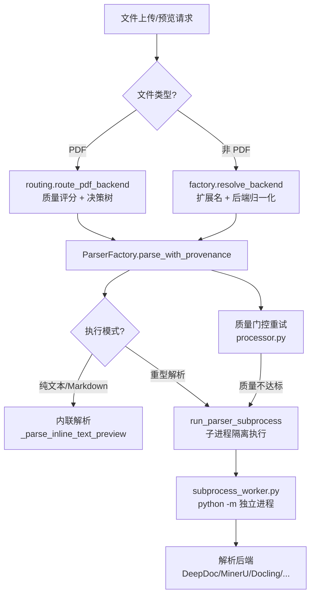
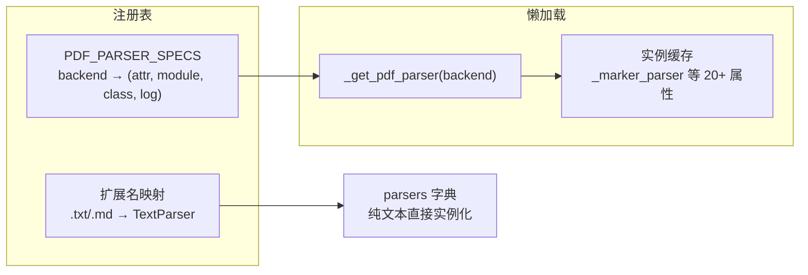
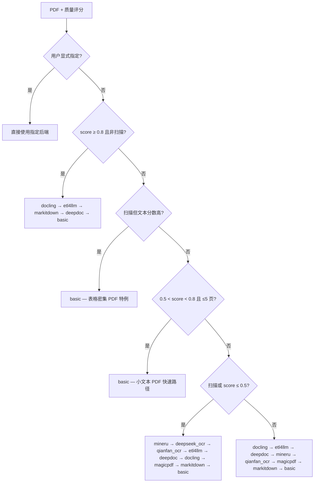
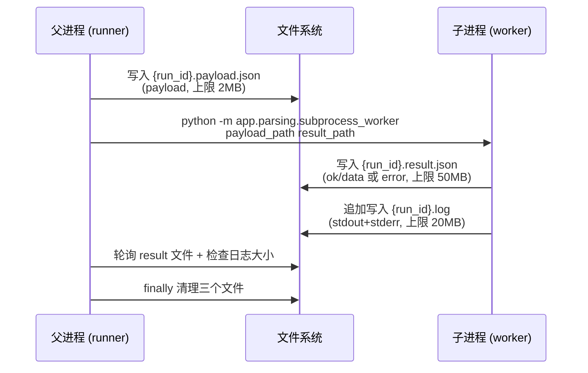
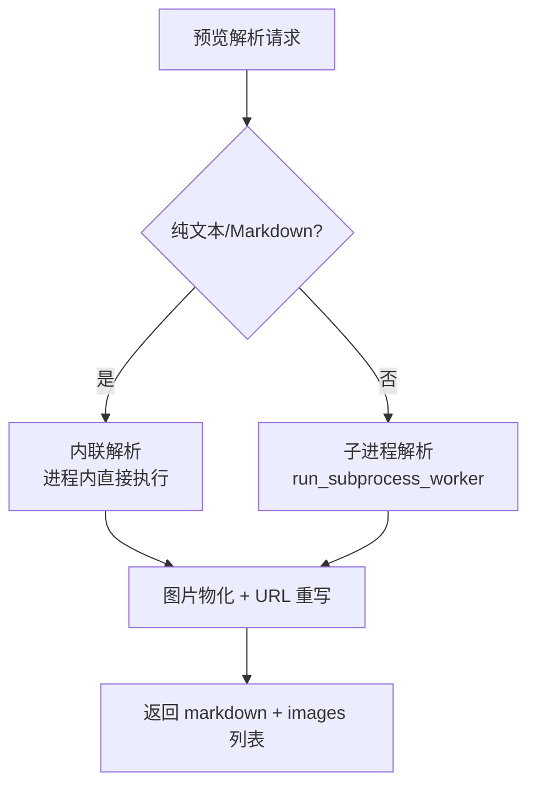
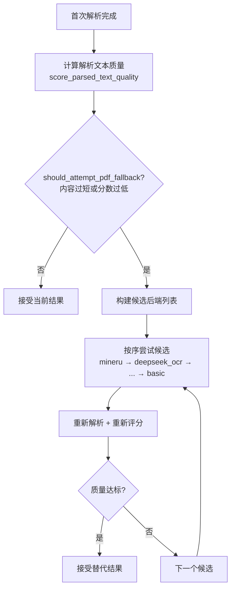

本文档剖析 MimirQ 文档解析框架的三层核心机制：**解析器工厂**（`ParserFactory`）如何按文件类型与后端选择解析器、**PDF 质量路由**（`routing.py`）如何用评分决策树自动选择最合适的解析后端、以及**子进程隔离**（`subprocess_runner.py` + `subprocess_worker.py`）如何让重型解析任务获得真正的可取消性与资源隔离。这三层共同支撑了 30+ 解析后端的按需启动、异常降级与质量门控重试。

## 一、整体架构：从文件到 Document 的三层流水线

解析框架的完整调用链横跨 API 层、服务层与执行层。无论入口是解析工作台（`/api/v1/parsing`）、文档上传后台处理（`/api/v1/documents`）还是流水线预览（`/api/v1/pipeline`），最终都收敛到同一条核心路径：**质量路由 → 工厂选型 → 子进程执行**。



**分层职责**：

| 层次 | 模块 | 核心职责 |
|---|---|---|
| API 层 | `app/api/v1/parsing.py` | 请求接入、后端早期校验、disconnect 检测 |
| 服务层 | `app/parsing/processors/parser_service.py` | 预览解析编排、图片物化与 URL 重写 |
| 流水线层 | `app/parsing/processors/support/stages.py` | 入库解析、解析缓存、质量指标落库 |
| 路由层 | `app/parsing/routing.py` | PDF 质量评分驱动的后端决策 |
| 工厂层 | `app/parsing/factory.py` | 后端归一化、解析器注册、懒加载、回退链 |
| 执行层 | `app/parsing/subprocess_runner.py` + `subprocess_worker.py` | 双进程协议、取消与超时控制 |
| 错误层 | `app/parsing/errors.py` | 类型化错误分类与重试语义 |

Sources: [parsing.py](app/api/v1/parsing.py#L892-L919), [stages.py](app/parsing/processors/support/stages.py#L93-L105), [parser_service.py](app/parsing/processors/parser_service.py#L270-L276)

## 二、解析器工厂：注册、别名归一化与懒加载

`ParserFactory`（[factory.py](app/parsing/factory.py#L98-L99)）是整个框架的中枢，其设计遵循两个核心原则：**按需懒加载重型依赖**、**配置驱动的能力探测**。

### 2.1 工厂初始化与单例

工厂通过线程安全的双重检查锁实现全局单例（[factory.py](app/parsing/factory.py#L1204-L1220)），并通过 `_ParserFactoryProxy` 保持历史导入面 `from app.parsing.factory import parser_factory`（[factory.py](app/parsing/factory.py#L1223-L1229)）。懒初始化避免了在模块导入阶段（例如 OpenAPI 导出时）就加载 PyMuPDF 等重型 PDF 依赖。

### 2.2 后端别名归一化

用户输入的后端名称（来自 UI、环境变量或 API 参数）先经过 `normalize_parser_backend()` 归一化为内部规范名（[backends.py](app/parsing/backends.py#L59-L71)）。别名表覆盖了三种来源的命名差异：

| 用户输入 | 规范名 | 说明 |
|---|---|---|
| `pymupdf` / `fitz` | `basic` | PyMuPDF 基础解析器 |
| `magic-pdf` / `magicpdf` | `magicpdf` | PyPI 包名与 CLI 名差异 |
| `paddle-vl` / `paddleocr-vl` | `paddle_vl` | 连字符与下划线归一化 |
| `col-qwen` / `colpali` | `colpali` | ColPali/ColQwen 共用 |
| `bisheng-unstructured` | `etl4llm` | 向后兼容的废弃别名 |

归一化规则：去空白、转小写、`_` 替换为 `-`，再查别名表（[backends.py](app/parsing/backends.py#L67-L71)）。

### 2.3 解析器注册表与懒加载

工厂维护两套后端注册表：`SUPPORTED_PDF_BACKENDS`（16 个，[factory.py](app/parsing/factory.py#L117-L134)）与 `SUPPORTED_NON_PDF_BACKENDS`（17 个，[factory.py](app/parsing/factory.py#L186)）。PDF 后端的实例化由 `PDF_PARSER_SPECS` 描述性注册表驱动（[factory.py](app/parsing/factory.py#L247-L261)），每个条目声明了缓存属性名、模块路径、类名与初始化日志，通过 `_get_cached_parser()` 统一完成懒加载与缓存（[factory.py](app/parsing/factory.py#L1125-L1138)）。



PDF 后端按能力分三层：**基础层**（`basic`，PyMuPDF）、**结构感知层**（`docling`、`deepdoc`、`mineru`、`magicpdf`）、**外部服务层**（`marker`、`paddle_vl`、`glm_ocr`、`olmocr`、`qianfan_ocr`、`textin`、`deepseek_ocr`、`etl4llm`）。每类外部服务的可用性由 `PDF_SETTING_REQUIREMENTS` 中的环境变量组合校验（[factory.py](app/parsing/factory.py#L188-L232)），例如 `textin` 要求 `TEXTIN_ENABLED=True` 且同时配置 `TEXTIN_APP_ID` 与 `TEXTIN_SECRET_CODE`（[factory.py](app/parsing/factory.py#L214-L221)）。

### 2.4 后端解析与扩展名校验

`resolve_backend()` 按文件类型分流（[factory.py](app/parsing/factory.py#L362-L372)）：PDF 走 `_resolve_pdf_backend`（含 `auto` 的静态优先级决策，[factory.py](app/parsing/factory.py#L468-L481)），非 PDF 走 `_resolve_non_pdf_backend`（[factory.py](app/parsing/factory.py#L374-L389)）。非 PDF 后端有严格的扩展名规则表 `NON_PDF_BACKEND_EXTENSION_RULES`（[factory.py](app/parsing/factory.py#L234-L245)），例如 `excel` 只支持 `.xls/.xlsx`、`email` 只支持 `.eml/.msg`。当用户显式指定的后端不支持当前扩展名时，会降级为 `auto` 自动选择（[factory.py](app/parsing/factory.py#L385-L386)）。

Sources: [factory.py](app/parsing/factory.py#L98-L99), [factory.py](app/parsing/factory.py#L247-L261), [backends.py](app/parsing/backends.py#L10-L56), [factory.py](app/parsing/factory.py#L234-L245)

## 三、后端路由：质量评分驱动的 PDF 决策树

PDF 是解析框架中最复杂的格式——同一份文件可能是文本型（可直接提取）、扫描型（需要 OCR）或混合型。`routing.py` 用**质量评分 + 决策树**取代了静态的"PDF 一律用 X 解析器"策略。

### 3.1 质量评分器

`score_pdf_quality()` 对 PDF 采样前 3 页，从三个维度打分（[scorer.py](app/parsing/quality/scorer.py#L27-L54)）：

| 维度 | 权重 | 评估内容 |
|---|---|---|
| 文本提取质量 | 50% | 文本量、可读性、OCR 噪声、扫描检测 |
| 格式一致性 | 30% | 字体多样性、行距方差、段落结构 |
| 表格完整性 | 20% | 表格检测率、对齐情况 |

最终分数 0-1，判定阈值：`score >= 0.8` 为干净文本型，`score <= 0.5` 疑似扫描件（[scorer.py](app/parsing/quality/scorer.py#L48-L49)）。评分结果还包含 `is_scanned`、`page_count`、`text_quality_score` 等辅助信号，供决策树使用。

### 3.2 决策树规则

`choose_pdf_backend()`（[routing.py](app/parsing/routing.py#L52-L149)）按优先级依次判断：



三个值得注意的设计细节：

1. **表格密集 PDF 特例**：某些表格密集型 PDF 因文本密度低被误判为扫描件，但 PyMuPDF 仍能快速提取有效文本——此时直接走 `basic`，避免先发制人地把它们送入重型 OCR 服务（[routing.py](app/parsing/routing.py#L105-L109)）。
2. **交互式预览快速路径**：小体积、可提取文本的 PDF（0.5-0.8 分、≤5 页）在预览路径上优先 `basic`，避免结构解析器拖慢交互响应（[routing.py](app/parsing/routing.py#L111-L114)）。
3. **可用性预检**：`_magicpdf_available()` 会检查服务模式（`MAGIC_PDF_API_URL`）或 CLI 模式（`magic-pdf` 命令 + 模型目录）两种部署形态（[routing.py](app/parsing/routing.py#L69-L78)）。

`route_pdf_backend()` 是路由的完整入口：先评分（可复用已缓存的评分结果），再决策，返回 `(backend, quality)` 元组（[routing.py](app/parsing/routing.py#L152-L168)）。

Sources: [scorer.py](app/parsing/quality/scorer.py#L27-L54), [routing.py](app/parsing/routing.py#L52-L149), [routing.py](app/parsing/routing.py#L152-L168)

## 四、回退链：异常驱动的降级策略

即使路由决策正确，解析器本身也可能因依赖缺失、服务不可用或文件畸形而失败。工厂内置了**分层回退链**（`_fallback_parse`，[factory.py](app/parsing/factory.py#L828-L869)），按文件类型与失败后端分类降级：

| 失败场景 | 回退顺序 | 说明 |
|---|---|---|
| PDF 高级后端失败 | `basic` | 任意高级后端 → PyMuPDF 基础提取（[factory.py](app/parsing/factory.py#L871-L892)） |
| DOCX 高级后端失败 | `pandoc` → `markitdown` → `docx` | 三级降级，最后用轻量 `DocxParser`（[factory.py](app/parsing/factory.py#L894-L941)） |
| MarkItDown 失败 | 按格式分派专用解析器 | docx/pptx/excel/html/csv/json 各归其位（[factory.py](app/parsing/factory.py#L968-L993)） |
| Pandoc 失败 | `markitdown` → 格式专用解析器 | 双重回退（[factory.py](app/parsing/factory.py#L1081-L1098)） |
| Excel 失败 | `markitdown` | 单一降级（[factory.py](app/parsing/factory.py#L1055-L1079)） |

回退链的执行由 `parse()` 与 `parse_with_provenance()` 两套入口承载。`parse()` 是精简版（[factory.py](app/parsing/factory.py#L714-L760)），`parse_with_provenance()` 则是审计增强版（[factory.py](app/parsing/factory.py#L762-L826)），会记录每次尝试的后端、耗时、文档数与错误信息，并附带 `version: "2"` 的溯源结构：

```python
provenance = {
    "version": "2",
    "file_type": ...,
    "requested_backend": ...,
    "resolved_backend": ...,
    "attempts": [{"backend", "ok", "elapsed_ms", "documents", "selected"}],
    "elapsed_ms": ...,
}
```

这个溯源信息会被写入文档元数据的 `parse_provenance` 字段（[stages.py](app/parsing/processors/support/stages.py#L319-L327)），并在解析工作台 API 中用于诊断"请求后端与最终后端不一致"的场景——此时文档会被标记为失败并附带诊断详情（[parsing.py](app/api/v1/parsing.py#L922-L940)）。

Sources: [factory.py](app/parsing/factory.py#L828-L869), [factory.py](app/parsing/factory.py#L762-L826), [stages.py](app/parsing/processors/support/stages.py#L319-L327)

## 五、子进程隔离：双进程协议与可取消性

### 5.1 设计动机

Docling、Torch 等重型解析器**无法在进程内协作式取消**——一旦开始解析，即使上层任务被中止，解析仍会占用 CPU/内存直至完成。解决方案是让解析在独立子进程中运行，父进程通过终止进程组实现"真正"的取消（[subprocess_worker.py](app/parsing/subprocess_worker.py#L1-L9)）。

### 5.2 文件式 IPC 协议

父子进程之间不通过管道或共享内存通信，而是使用**三个 JSON 文件**：



工作目录为 `{UPLOAD_DIR}/{tenant_id}/.subprocess/`，run_id 为 `uuid4().hex`（[subprocess_runner.py](app/parsing/subprocess_runner.py#L152-L158)）。文件式 IPC 的选择有明确考量：JSON 文件天然支持超大结果集（比管道缓冲区更稳）、便于排障（可直接查看中间产物）、且路径校验更严格。

### 5.3 轮询循环与三类取消源

`run_subprocess_worker()` 以 200ms 间隔轮询（[subprocess_runner.py](app/parsing/subprocess_runner.py#L204-L259)），每轮检查三类取消条件：

| 取消源 | 检测方式 | 触发场景 |
|---|---|---|
| 客户端断开 | `disconnect_check()` | FastAPI `request.is_disconnected`（[parsing.py](app/api/v1/parsing.py#L917)） |
| 任务取消 | `cancel_check()` | 文档状态变为 cancelled（[stages.py](app/parsing/processors/support/stages.py#L124-L127)） |
| 上游中止 | `asyncio.CancelledError` | arq Job.abort 等任务级取消 |

任何取消源触发后，`_terminate_process_group()` 执行**两阶段终止**：先向进程组发送 `SIGTERM`（优雅退出），等待 2 秒宽限期，超时再发 `SIGKILL`（强制终止）（[subprocess_runner.py](app/parsing/subprocess_runner.py#L64-L118)）。关键细节是 `start_new_session=True`（[subprocess_runner.py](app/parsing/subprocess_runner.py#L190)），使子进程成为独立进程组组长，确保 `os.killpg` 能覆盖其所有后代进程。

### 5.4 资源上限防护

| 配置项 | 默认值 | 防护目标 |
|---|---|---|
| `SUBPROCESS_PAYLOAD_MAX_BYTES` | 2 MB | 防止超大 payload 写盘（[subprocess_runner.py](app/parsing/subprocess_runner.py#L161-L174)） |
| `SUBPROCESS_RESULT_MAX_BYTES` | 50 MB | 防止结果文件膨胀（[subprocess_runner.py](app/parsing/subprocess_runner.py#L267-L281)） |
| `SUBPROCESS_LOG_MAX_BYTES` | 20 MB | 防止日志无限增长导致磁盘耗尽（[subprocess_runner.py](app/parsing/subprocess_runner.py#L240-L251)） |

超限会终止进程并抛出带 `log_tail`（最近 16KB 日志）的错误，便于诊断。

### 5.5 Worker 侧的动作分发与安全约束

`subprocess_worker.py` 的 `main()` 解析 payload 中的 `action` 字段并分发（[subprocess_worker.py](app/parsing/subprocess_worker.py#L331-L378)）：

| action | 处理函数 | 用途 |
|---|---|---|
| `parse_documents` | `_parse_documents` | 常规解析（含 PDF 路由、图片物化） |
| `integrated_chunk` | `_integrated_chunk` | 集成管道一体化切块 |
| `pipeline_parse_preview` | `_pipeline_parse_preview` | 流水线预览解析 |
| `sleep` | `_sleep` | 测试专用（验证取消能力） |

Worker 侧有两类关键安全约束：

1. **路径沙箱**：`_safe_worker_io_path()` 强制所有 IO 路径必须位于 `UPLOAD_DIR` 内，防止路径穿越（[subprocess_worker.py](app/parsing/subprocess_worker.py#L66-L73)）。
2. **跨进程图片物化**：PIL.Image 对象无法跨进程 pickle，`_materialize_images_for_ingest()` 将内存中的图片以 JPEG（质量 85）落盘，并在元数据中写入 `image_path` 与 `artifact_dir`（[subprocess_worker.py](app/parsing/subprocess_worker.py#L88-L175)）。父进程后续据此上传 MinIO，实现"无 pickle 的进程间图片传递"。

### 5.6 重试包装器

`run_parser_subprocess()` 在底层 runner 之上增加了**类型化错误分类 + 有界重试 + 指数退避**（[subprocess_runner.py](app/parsing/subprocess_runner.py#L337-L395)）：默认最多 2 次尝试，退避公式 `base * 2^(attempt-1)`（base=0.5s，上限 5s，[subprocess_runner.py](app/parsing/subprocess_runner.py#L316-L334)）。只有 `retryable=True` 的错误才会重试——取消与超时类错误立即抛出，不做无意义重试。

Sources: [subprocess_worker.py](app/parsing/subprocess_worker.py#L1-L9), [subprocess_runner.py](app/parsing/subprocess_runner.py#L135-L175), [subprocess_runner.py](app/parsing/subprocess_runner.py#L204-L259), [subprocess_runner.py](app/parsing/subprocess_runner.py#L64-L118), [subprocess_worker.py](app/parsing/subprocess_worker.py#L331-L378)

## 六、错误分类与重试语义

子进程的错误以 JSON 形式返回父进程（`{"ok": false, "error": {...}}`），随后由 `classify_parser_subprocess_error()` 映射为稳定的类型化异常（[errors.py](app/parsing/errors.py#L46-L79)）。这一层是整个解析框架重试策略的基础：

| 异常类型 | code | retryable | 触发条件 |
|---|---|---|---|
| `ParsingTimeoutError` | `timeout` | ✗ | worker 超时（[errors.py](app/parsing/errors.py#L31-L33)） |
| `ParsingUnsupportedError` | `unsupported` | ✗ | payload/result/log 超限、不支持的文件类型或后端（[errors.py](app/parsing/errors.py#L36-L38)） |
| `ParsingInternalError` | `internal` | ✓ | 其他所有内部失败（[errors.py](app/parsing/errors.py#L41-L43)） |

分类规则设计为**依赖轻量**（模块顶部无重型导入），保证可在解析栈的任何位置安全使用（[errors.py](app/parsing/errors.py#L50-L52)）。重试语义因此清晰：**超时与不支持立即失败，内部错误有限重试**——这与"重型解析器可能偶发 OOM 或依赖加载失败"的现实相匹配，同时避免对配置错误（不支持的后端）做无意义重试。

Sources: [errors.py](app/parsing/errors.py#L14-L28), [errors.py](app/parsing/errors.py#L46-L79)

## 七、服务层编排：预览解析与入库解析的双路径

### 7.1 两条执行路径的分流

`DocumentParserService.parse_for_preview()`（[parser_service.py](app/parsing/processors/parser_service.py#L270-L341)）是预览路径的编排入口，其关键决策是**内联 vs 子进程**：



API 层的 `_should_inline_preview_parse()` 只对 `.md` 与纯文本扩展名启用内联快路径（[parsing.py](app/api/v1/parsing.py#L284-L288)）——这些格式解析成本极低，无需进程隔离。其余格式一律走子进程（[parsing.py](app/api/v1/parsing.py#L905-L919)），其中 PDF 在子进程内部才执行质量路由（因为评分本身可能需要 OCR 验证，属于重型操作）。

### 7.2 入库路径：缓存、子进程与质量指标

入库路径由 `ParsingStage.run()`（[stages.py](app/parsing/processors/support/stages.py#L89-L105)）承载，流程比预览复杂得多：

1. **集成策略分流**：若切块策略属于 `INTEGRATED_PIPELINE_STRATEGIES`，则走 `integrated_chunk` 子进程 action，一次性完成解析+切块（[stages.py](app/parsing/processors/support/stages.py#L109-L171)）。
2. **PDF 质量复用**：若文档元数据已有缓存的 `pdf_quality`，直接复用评分结果避免重复采样（[stages.py](app/parsing/processors/support/stages.py#L180-L203)）。
3. **解析缓存**：启用 `PARSE_CACHE_ENABLED` 时，以 `file_sha256 + resolved_backend + pipeline_hash` 为键查询 MinIO 缓存（[stages.py](app/parsing/processors/support/stages.py#L208-L258)），命中则跳过子进程。
4. **子进程执行**：payload 携带 `mode: "ingest"` 与 `artifact_root`，配合 `cancel_check` 与 30 分钟超时（[stages.py](app/parsing/processors/support/stages.py#L272-L291)）。
5. **质量指标落库**：解析完成后计算解析文本质量、印章摘要、OCR 置信度摘要与制品统计，写入文档元数据（[stages.py](app/parsing/processors/support/stages.py#L331-L375)），并做解析缓存写穿（[stages.py](app/parsing/processors/support/stages.py#L377-L400)）。

### 7.3 图片资产的全链路处理

预览与入库都依赖图片物化，但目标不同：预览路径把本地图片引用重写为 `/api/v1/documents/image/{id}` 的鉴权 URL（[parser_service.py](app/parsing/processors/parser_service.py#L59-L75)），入库路径则把图片落盘供后续 MinIO 上传（[subprocess_worker.py](app/parsing/subprocess_worker.py#L88-L97)）。两者都遵守 `MAX_INLINE_IMAGES` 与 `MAX_INLINE_IMAGE_BYTES` 上限（[parser_service.py](app/parsing/processors/parser_service.py#L88-L90)）。

Sources: [parser_service.py](app/parsing/processors/parser_service.py#L270-L341), [parsing.py](app/api/v1/parsing.py#L284-L288), [stages.py](app/parsing/processors/support/stages.py#L109-L171), [stages.py](app/parsing/processors/support/stages.py#L208-L258)

## 八、质量门控重试：解析完成后的二次机会

子进程返回的文档并非"一锤定音"。`processor.py` 在首次解析完成后，会根据**解析文本质量评分**决定是否用替代后端重新解析（[processor.py](app/parsing/processors/processor.py#L1155-L1163)）。触发条件严格限定：仅当流水线启用了 `parse_fallback_enabled`、文件为 PDF、后端为 `auto` 且非断点/缓存恢复时。



候选列表的构建顺序与 `routing.py` 决策树一致（MinerU → DeepSeek OCR → Qianfan OCR → ETL4LLM → DeepDoc → Docling → MagicPDF → MarkItDown → basic），但会**排除当前已使用的后端**并受 `parse_fallback_max_retries` 上限约束（[processor.py](app/parsing/processors/processor.py#L1204-L1238)）。每次尝试都记录 `from/to/quality_before/quality_after/accepted` 的审计信息（[processor.py](app/parsing/processors/processor.py#L1288-L1296)），确保重试行为完全可追踪。

质量判定标准由 `should_attempt_pdf_fallback()` 统一承载（[routing.py](app/parsing/routing.py#L17-L49)）：硬失败（grade=fail）永远重试、内容过短重试、质量分低于阈值重试。这个函数同时被路由层与门控重试层复用，保证判定逻辑单一来源。

Sources: [processor.py](app/parsing/processors/processor.py#L1155-L1163), [processor.py](app/parsing/processors/processor.py#L1204-L1238), [routing.py](app/parsing/routing.py#L17-L49)

## 九、总结：三层机制的协同关系

解析框架的健壮性来自三个独立机制的**纵深防御**：

1. **路由层预防**：质量评分在解析前就选择最合适的后端，避免"所有 PDF 都用重型 OCR"的资源浪费。
2. **工厂层降级**：解析异常时按格式回退到更轻量的替代后端，保证"总有一条路径能产出文本"。
3. **门控层纠正**：解析完成后用质量指标检验产出，不达标则触发二次解析。

而子进程隔离为这三层提供了执行基础——重型解析可以被真正取消、资源可以被真正回收、错误可以被类型化分类。三者叠加，构成了"可检查、可回归、可治理"解析体系的地基。

### 延伸阅读

本文聚焦解析的执行机制。切块如何消费解析产物请参见 [切块策略体系：86 种策略、父子切块与策略矩阵](13-qie-kuai-ce-lue-ti-xi-86-chong-ce-lue-fu-zi-qie-kuai-yu-ce-lue-ju-zhen)；解析质量如何进入 CI 门禁请参见 [CI 质量门禁：检索阈值、解析证明、查询集健康与发布预算策略](24-ci-zhi-liang-men-jin-jian-suo-yu-zhi-jie-xi-zheng-ming-cha-xun-ji-jian-kang-yu-fa-bu-yu-suan-ce-lue)；解析工作台的前端交互请参见 [解析工作台：PDF 渲染、版面元素编辑与解析对比](28-jie-xi-gong-zuo-tai-pdf-xuan-ran-ban-mian-yuan-su-bian-ji-yu-jie-xi-dui-bi)。