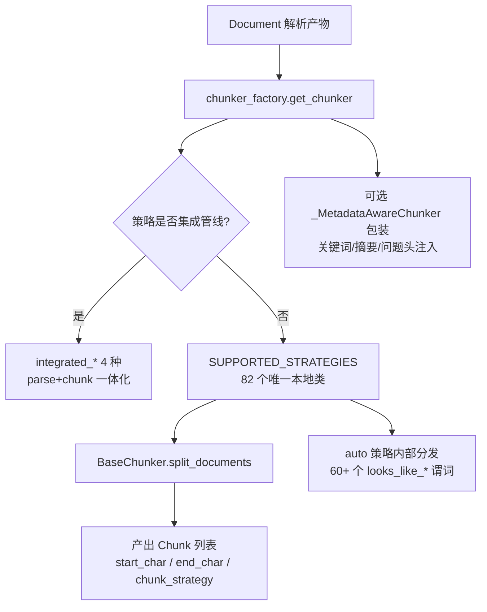
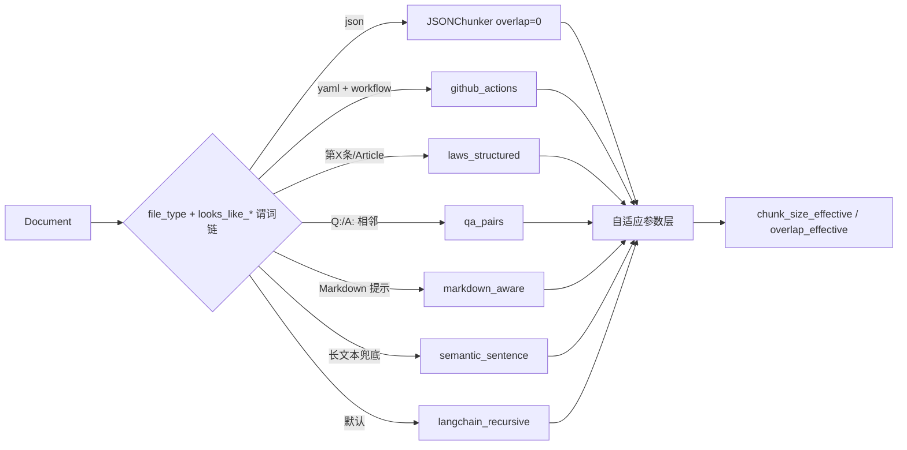
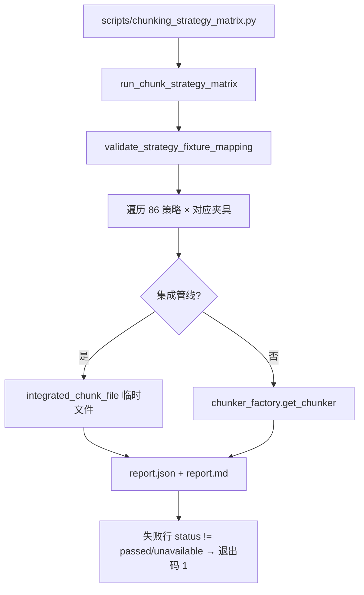

MimirQ 的切块层将"文档 → 检索单元"的转换从单一的 `RecursiveCharacterTextSplitter` 升级为**内容形态感知的策略体系**：后端工厂注册了 86 种可解析策略，前端通过能力接口获得同一份清单，离线侧则用策略矩阵脚本对每种策略做可重复的冒烟验证。本文聚焦该体系的三条主线：**策略注册与别名解析（工厂）**、**内容感知路由（auto）与父子层级切块**、**策略矩阵与质量门禁（离线验证）**。

## 策略体系全景：86 种策略如何构成

切块体系的入口是一个**单一抽象**与**双通道注册表**。所有策略都继承 `BaseChunker`，只需实现 `split_documents(documents) -> list[Document]`，并在产出块的 metadata 中写入 `start_char`、`end_char` 与 `chunk_strategy`，供前端高亮与检索溯源使用。

Sources: [base.py](app/rag/chunking/base.py#L12-L29)

`ChunkerFactory`（模块级单例 `chunker_factory`）持有两个注册表：`SUPPORTED_STRATEGIES`（本地 Python 实现）与 `INTEGRATED_PIPELINE_STRATEGIES`（走集成解析+切块管线的 4 个预设）。"86 种策略"的算术值得精确说明：`SUPPORTED_STRATEGIES` 字典有 **83 个键**，其中 `markdown` 是 `markdown_header` 的显式别名（指向同一个类），因此是 **82 个唯一本地策略类**；加上 4 个集成管线策略（`integrated_naive` / `integrated_book` / `integrated_laws` / `integrated_email`），合计 **86 种唯一策略**。

Sources: [factory.py](app/rag/chunking/factory.py#L261-L353)

工厂同时维护一张**约 200 个别名表**（`STRATEGY_ALIASES`），覆盖英文、中文与常见缩写：`faq`/`qa`/`qna` → `qa_pairs`，`contract`/`policy`/`regulation` → `laws_structured`，`简历`/`履历` → `resume_structured`，`srt`/`vtt` → `subtitles`，`k8s`/`kubernetes`/`manifest` → `yaml_manifest` 等。`resolve_strategy()` 先小写化、再解别名、最后校验注册表，未知策略抛出带完整清单的 `ValueError`；`llama_index` 系策略还受 `LLAMA_INDEX_ENABLED` 开关约束。

Sources: [factory.py](app/rag/chunking/factory.py#L355-L593)

一个值得注意的工程细节：`get_chunker()` 会通过 `inspect.signature` **反射过滤构造参数**——像 `parent_child` 的 `child_ratio`/`min_child_size` 这类策略专属参数被允许透传，而其余策略不会因不认识的 kwargs 崩溃；`chunk_size`/`chunk_overlap` 则是所有策略的通用入口。

Sources: [factory.py](app/rag/chunking/factory.py#L595-L681)

## 策略分类：四组注册表与五档推荐

从推荐视角看，策略被划分为四组（前端分组）与五档推荐等级（后端 `recommendations.py`）。主流程推荐（Mainstream）21 种，包括 `auto`、`langchain_recursive`、`semantic_sentence`、`parent_child`、`markdown_header`、`csv_rows`、`sql_schema`、`laws_structured` 等；实验性 5 种（`agentic_chunker`、`late_chunking`、`late_chunking_jina`、`proposition`、`raptor`）；可选依赖 2 种（LlamaIndex 系）；其余为专项适配或集成预设。前端据此在目录项上打标 `[Mainstream RAG recommended]` 等前缀。

Sources: [recommendations.py](app/rag/chunking/recommendations.py#L2-L53)

| 分组 | 数量 | 代表策略 | 定位 |
| --- | --- | --- | --- |
| 专项预设（preset） | ~60 | `laws_structured`、`openapi_spec`、`docker_compose`、`jira_ticket`、`subtitles` | 识别特定文档格式的结构边界 |
| LangChain 通用（langchain） | ~12 | `langchain_recursive`、`langchain_token`、`parent_child`、`separator` | 通用参数化切分 |
| LlamaIndex（llama_index） | 2 | `llama_index`、`llama_index_hierarchical` | 可选依赖，默认关闭 |
| 集成管线（integrated） | 4 | `integrated_naive`/`book`/`laws`/`email` | 解析+切块一体化的旧管线预设 |

前端 `web/lib/chunk-strategies.ts` 暴露 78 个下拉选项（60 preset + 12 langchain + 2 llama_index + 4 integrated），并附带中文标签、图标、徽标与推荐等级；后端能力接口 `GET /pipeline/capabilities` 则暴露全部 86 种策略的可用性信息，前端据此裁剪展示。两端共享同一份策略语义，但前端是子集——例如 `markdown_hierarchy`、`text_hierarchy` 等后端策略未在前端目录中出现。

Sources: [chunk-strategies.ts](web/lib/chunk-strategies.ts#L26-L105) · [pipeline.py](app/api/v1/pipeline.py#L583-L611)

## auto 策略：内容感知路由与自适应参数

`auto` 是推荐入口，其内部维护一个**按优先级排列的谓词-构建器列表**：`_select()` 逐条执行 `looks_like_*` 轻量启发式（外加 `file_type` 元数据判定），命中即返回对应的专用切块器实例与策略名。判定顺序从"强格式"到"弱格式"：JSON → JSONL → Maven POM → JUnit XML → … → Markdown → transcript → 兜底。整个路由是确定性的、无 LLM 依赖，且每个策略模块都导出配套的 `looks_like_*` 函数供复用。

Sources: [auto.py](app/rag/chunking/strategies/auto.py#L514-L612)

`auto` 的第二个特征是**自适应参数**：`_density_metrics` 对前 5 万字符采样，计算平均行长、行数与非空白占比；平均行长 ≥140 时缩小 20%（密集长行），行数 ≥80 且平均行长 ≤30 时放大 30%（稀疏短行），最终夹紧到 400–1800 字符，并保持 overlap 比例稳定。每次切块都会在 metadata 写入 `chunk_strategy_selected`、`chunk_size_effective`、`adaptive_chunk_reason` 与密度指标，使"为什么这么切"可审计、可回归。

Sources: [auto.py](app/rag/chunking/strategies/auto.py#L86-L168) · [auto.py](app/rag/chunking/strategies/auto.py#L614-L659)

## 父子切块与层级元数据体系

`parent_child` 是检索质量的核心策略：**父块**按 `chunk_size` 生成（大上下文），**子块**按 `child_ratio`（默认 0.5，下限 `min_child_size`=200）从父块内再切（精准召回），子块通过 `parent_id` 回指父块。为支持回归套件、缓存与 trace diff，父子 ID 全部用 `stable_hash` 确定性生成（位置 + 内容哈希，避免重复文本碰撞），并带内容哈希缓存避免重复切分。

Sources: [parent_child.py](app/rag/chunking/strategies/parent_child.py#L21-L63) · [parent_child.py](app/rag/chunking/strategies/parent_child.py#L85-L141)

切块结果携带一套统一的 **hierarchy 元数据**，这是后续层级召回（parent/sibling 扩展、tree-dedup、跨 query 聚合）的基础协议：

| 字段 | 父块 | 子块 | 含义 |
| --- | --- | --- | --- |
| `chunk_role` | `parent` | `child` | 结构角色 |
| `parent_id` | 自身 ID | 父块 ID | 父子关联 |
| `hierarchy_basis` | `parent_child` | `parent_child` | 层级来源 |
| `hierarchy_level` | `parent` | `child` | 层级级别 |
| `hierarchy_node_key` | 父 ID | 子 ID | 节点唯一键 |
| `hierarchy_parent_key` | `None` | 父 ID | 父节点键 |
| `hierarchy_family_key` | 父 ID | 父 ID | 家族（根）键 |
| `hierarchy_sibling_index` / `prev` / `next` | 有 | 有 | 兄弟链 |

兄弟链接由 `utils/hierarchical.py` 的 `apply_sibling_hierarchy_links()` 统一注入；同一工具还提供 `apply_sequence_hierarchy_metadata()`（普通策略补层级元数据）与 `hierarchical_chunk_markdown()`（Markdown 段落→句子两级切分，供 `markdown_hierarchy`/`text_hierarchy` 使用）。

Sources: [parent_child.py](app/rag/chunking/strategies/parent_child.py#L116-L196) · [hierarchical.py](app/rag/chunking/utils/hierarchical.py#L43-L94)

切块产出的语义角色（`roles.py`）独立于结构角色：`ChunkSemanticRole` 枚举 definition/procedure/policy/example/table/code/faq/reference/unknown 九类，`classify_chunk_semantic_role()` 先读已有标注，再按策略名、文档类型、代码栅栏、Markdown 表格、标题关键词（含中文"定义/步骤/流程"等）逐级判定，为重排与治理提供可解释信号。

Sources: [roles.py](app/rag/chunking/roles.py#L21-L30) · [roles.py](app/rag/chunking/roles.py#L135-L200)

## 策略矩阵：全量冒烟与离线质量门禁

策略矩阵是"86 种策略是否都还能跑"的可重复验证。`strategy_matrix.py` 内置约 60 个代表性夹具（法律条款、Q&A、Git log、Terraform plan、SRT 字幕、OpenAPI 等），通过 `STRATEGY_FIXTURE_KEY` 把每种策略映射到最能体现其能力的夹具，并用 `validate_strategy_fixture_mapping()` 强制"注册表与夹具映射完全对齐"（缺一即抛错）。`run_chunk_strategy_matrix()` 遍历全部 86 种策略：本地策略走 `get_chunker().split_documents()`，集成管线策略走 `integrated_chunk_file()`，逐条记录状态、chunk 数、耗时与首块 metadata keys。

Sources: [strategy_matrix.py](app/rag/chunking/strategy_matrix.py#L821-L927) · [strategy_matrix.py](app/rag/chunking/strategy_matrix.py#L946-L1010)

配套的 `scripts/chunking_strategy_matrix.py` 把结果落盘为带时间戳的 `artifacts/chunking-strategy-matrix/<id>/report.json` 与 Markdown 表格，任何失败行（非 passed/unavailable）都会使脚本以非零码退出——可直接接入 CI。另一个离线工具 `scripts/chunking_grid_runner.py` 做**参数网格**扫描：对 `langchain_recursive`/`semantic_sentence`/`sentence_window`/`parent_child` 四种策略 × chunk_size（256/512/1024）× overlap 比例（0/0.1/0.25）全组合评估，并内置 Ilya 对照组的 300/50 配置；每行输出 chunk 数、token 统计与 cliff 率。

Sources: [chunking_strategy_matrix.py](scripts/chunking_strategy_matrix.py#L33-L45) · [chunking_grid_runner.py](scripts/chunking_grid_runner.py#L18-L84)

质量信号由 `quality_scorer.py` 提供：基于 Vectara NAACL 2025 研究设定 100–1000 token 边界（最优 200–512），基于 Anthropic 研究设定 Context Cliff 警戒线（2000 token 警告、2500 token 危险，召回率从 92% 跌至 55%）；`score_chunk_semantic_quality()` 综合信息密度、语义完整性、代词比（自包含度）与前后块 Jaccard 去重风险，产出 `needs_review` 与原因码，全部为无 LLM、PII 安全的启发式评分，供切块预览页与治理工作台消费。

Sources: [quality_scorer.py](app/rag/chunking/quality_scorer.py#L17-L24) · [quality_scorer.py](app/rag/chunking/quality_scorer.py#L121-L173) · [quality_scorer.py](app/rag/chunking/quality_scorer.py#L176-L230)

## 参数透传、预设固话与选型建议

策略参数通过 `chunk_strategy_params` 以 JSON Object 传入（前端校验：最多 30 键、键 ≤80 字符、值仅限原始类型），供企业级微调（如 `parent_child` 的 `child_ratio`）。固化配置则落到 `chunk_presets` 表：租户级/数据集级、JSONB `payload` 声明式存储，不承载可执行代码，配合切块预览页做可视化验证。

Sources: [chunk-strategy-params.ts](web/lib/chunk-strategy-params.ts#L1-L47) · [chunk_preset.py](app/models/chunk_preset.py#L18-L42)

选型的经验法则（与 `docs/guides/chunk_strategies.md` 一致）：通用 Markdown/说明文用 `auto` 或 `langchain_recursive`（600–1500 chars、overlap 10–25%）；带位置标签的 PDF 用 `pdf_layout`；FAQ 用 `qa_pairs`；合同制度用 `laws_structured`；代码/配置/变更用 `smart_code`/`diff_patch`/`kv_config`；需要层级召回时启用 `markdown_hierarchy`/`text_hierarchy`/`parent_child` 并配合 `enable_hierarchy_recall`。**常见反模式**：overlap ≥ chunk_size 会被直接拒绝；chunk 过碎或过大都会劣化召回与引用溯源；解析质量优先于切块调参。

Sources: [chunk_strategies.md](docs/guides/chunk_strategies.md#L7-L47)

## 阅读路径

切块是知识处理流水线的中间环节，建议按以下顺序深入：先看解析框架理解输入形态（[文档解析框架：解析器工厂、后端路由与子进程隔离](12-wen-dang-jie-xi-kuang-jia-jie-xi-qi-gong-han-hou-duan-lu-you-yu-zi-jin-cheng-ge-chi)），再看切块产物如何进入入库生命周期（[入库生命周期与失败处理：ingestion runs、死信队列与重试机制](15-ru-ku-sheng-ming-zhou-qi-yu-shi-bai-chu-li-ingestion-runs-si-xin-dui-lie-yu-zhong-shi-ji-zhi)）；切块质量最终影响检索与引用（[混合检索与融合策略：向量、稀疏检索与 RRF 融合](16-hun-he-jian-suo-yu-rong-he-ce-lue-xiang-liang-xi-shu-jian-suo-yu-rrf-rong-he)、[RAG 对话引擎：引用生成、声明证据映射与忠实度评分](20-rag-dui-hua-yin-qing-yin-yong-sheng-cheng-sheng-ming-zheng-ju-ying-she-yu-zhong-shi-du-ping-fen)）；质量保障侧可衔接 [CI 质量门禁](24-ci-zhi-liang-men-jin-jian-suo-yu-zhi-jie-xi-zheng-ming-cha-xun-ji-jian-kang-yu-fa-bu-yu-suan-ce-lue) 中的解析证明与回归阈值，以及 [评测体系](23-ping-ce-ti-xi-golden-hui-gui-recall-mrr-zhi-biao-yu-800-ti-ji-zhun) 对切块参数的闭环验证。