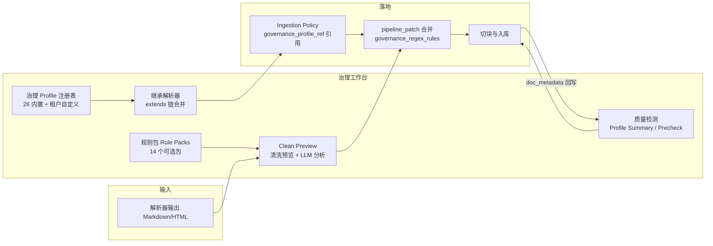

数据治理工作台是知识处理流水线（解析 → 数据治理 → 切块 → 入库）中承上启下的关键环节：上游解析器产出 Markdown/HTML 原始文本，工作台负责在切块与入库之前完成**声明式清洗策略的编排**与**质量信号的量化检测**。整个体系建立在一条铁律之上——治理策略必须是声明式 JSON（pipeline 选项补丁 + 正则清洗规则），**绝不执行任意代码**，从根上规避 RCE 与 ReDoS 风险。该能力由三层构成：治理 Profile（可复用、可继承的策略封装）、清洗规则（默认规则 + 可选规则包 + 自定义正则）、质量检测（入库后数据集画像 + 入库前 Precheck 扫描）。

Sources: [docs/data-governance-profiles.md](docs/data-governance-profiles.md#L1-L19)

## 架构总览：从策略声明到质量闭环

以下 Mermaid 图展示数据治理工作台在整体流水线中的位置与内部模块关系：

链路的关键点在于：Profile 本身不直接执行清洗，而是通过 `pipeline_patch` 将治理选项合并进 `PipelineOptions`、通过 `regex_rules` 注入 `governance_regex_rules`，最终由清洗管线在切块前统一执行；质量检测则双向工作——入库前 Precheck 扫描本地文件夹评估风险，入库后数据集画像基于持久化的 doc 元数据做实时聚合。两条路径共用同一套 `dataset_*_scan_runs` 运行记录模型，保证审计可追溯。

Sources: [app/services/dataset_profile_service.py](app/services/dataset_profile_service.py#L1-L40) · [app/services/ingestion_policy.py](app/services/ingestion_policy.py#L279-L304)

## 治理 Profile：声明式 JSON 脚本与安全边界

### 数据模型与载荷结构

治理 Profile 落库于 `governance_profiles` 表，是带 `tenant_id` 的租户级资源，核心列包括 `key`（可选稳定标识，tenant 内唯一）、`is_system`（内置为 False，内置预设活在代码里）、以及 `payload`（JSONB 存储的声明式载荷）。表上建有 `(tenant_id, name)` 与 `(tenant_id, key)` 复合索引支撑列表与引用查询。基线迁移 `0001_baseline_schema.py` 已包含该表及其索引定义，属于首批落地的 schema。

Sources: [app/models/governance_profile.py](app/models/governance_profile.py#L1-L47) · [alembic/versions/0001_baseline_schema.py](alembic/versions/0001_baseline_schema.py#L133-L148)

`payload` 的 schema 由 `GovernanceProfilePayload` 定义，包含五个字段：

| 字段 | 类型 | 说明 |
|---|---|---|
| `version` | str | 载荷 schema 版本，当前为 `"1"` |
| `extends` | str? | 可选父 Profile 引用（`builtin:<key>` / UUID / tenant key），形成继承链 |
| `input_formats` | list | 建议的预览输入格式，仅允许 `markdown` / `html`，默认 `["markdown"]` |
| `pipeline_patch` | dict | 将被合并进 `PipelineOptions` 的治理选项补丁 |
| `regex_rules` | list | 附加清洗规则（`pattern` / `repl` / `flags`），与默认规则叠加 |
| `processing_scripts` | list | 非执行脚本附件（最多 10 个），仅用于评审/版本化 |

Sources: [app/api/schemas/governance_profile.py](app/api/schemas/governance_profile.py#L38-L62)

### 内置预设：26 个 `builtin:*` 脚本

`get_builtin_governance_profiles()` 在代码中维护 26 个内置预设，按来源场景分群：通用保守（`builtin:kb_default`）、网页 HTML（`builtin:html_web`，显式启用 `web_navigation` 与 `web_cookie_banners` 规则包）、PDF 文本（`builtin:pdf_text`）、制度/手册（`builtin:policy_manual_pdf`）、扫描件 OCR（`builtin:pdf_scanned_ocr`）、代码仓库（`builtin:code_repo`）、结构化数据（`builtin:structured_data`）、聊天导出（`builtin:chat_exports`）、元数据增强（`builtin:metadata_enrich`）、质量门禁隔离（`builtin:quality_gate_quarantine`）、PII/密钥隔离（`builtin:pii_secrets_quarantine`），以及面向行业的中文 A 股年报（`builtin:cn_a_share_annual_report`）、招股书、银行合规报告、保险条款 PDF、电子病历（`builtin:medical_emr`）、政府红头文件（`builtin:government_redhead`）、法律法规、法院判决书，和 SaaS 源（Confluence、SharePoint、Notion、飞书/Lark 文档）等。设计原则是**保守且安全默认**：宁可少删，不可误删正文。内置预设只读，`key` 以 `builtin:` 前缀保留，自定义 Profile 不允许使用该前缀。

Sources: [app/services/governance_profiles.py](app/services/governance_profiles.py#L118-L200) · [app/services/governance_profiles.py](app/services/governance_profiles.py#L709-L720)

### 继承解析：extends 链与有效载荷计算

`payload.extends` 允许自定义 Profile 继承另一 Profile（内置或自定义），解析逻辑在 `resolve_profile_inheritance` 中实现，且保持纯函数（通过注入 `fetch_by_ref` 可单测）。合并规则明确：`pipeline_patch` 按 父 → 子 顺序深合并、子键覆盖父键；`regex_rules` 父在前子在后拼接；`processing_scripts` 拼接后截断到 10 条；`input_formats` 去重保序取并集。解析器内置两道防线：`max_depth=12` 限制继承深度，`seen` 集合检测继承环（抛 `inheritance cycle detected`）。API 侧 `GET /governance-profiles/{ref}/resolved` 返回 `profile`（原始）、`chain`（从根到叶的摘要链）、`effective`（合并后的有效载荷）三元组，供 UI 做"应用前预览"。

Sources: [app/services/governance_profiles_resolver.py](app/services/governance_profiles_resolver.py#L1-L160) · [app/api/v1/pipeline.py](app/api/v1/pipeline.py#L765-L783)

### 服务端强校验：防 RCE 与 ReDoS

上传/导入 Profile 时服务端执行多层校验（`validate_and_normalize_payload` + `validate_regex_rules`）：文件 ≤ 256KB；规则数 ≤ 60；`pattern` ≤ 600 字符、`repl` ≤ 2000 字符；`flags` 仅允许 `IGNORECASE(2) | MULTILINE(8) | DOTALL(16)` 组合；拒绝嵌套量词等灾难性回溯形态（如 `(.*)+`、`([a-z]+)*`）；所有规则先尝试 `re.compile`，编译失败即拒绝。此外 `extends` 引用会做控制字符过滤（拒绝 `\x7f` 与 ASCII < 32），`processing_scripts` 数量上限 10、单脚本内容上限 200KB——脚本**只作为参考模板持久化，入库管道不执行**，这一约束在 schema 注释与端点文档中双重声明。

Sources: [app/services/governance_profiles.py](app/services/governance_profiles.py#L20-L60) · [app/api/schemas/governance_profile.py](app/api/schemas/governance_profile.py#L20-L37) · [app/api/v1/pipeline.py](app/api/v1/pipeline.py#L839-L858)

## 清洗规则体系：默认规则、规则包与自定义正则

### 三层规则来源

清洗规则在 `clean_markdown` 中统一执行，按来源分层叠加：**默认规则**（`DEFAULT_MARKDOWN_RULES`，内置的保守行级规则集，覆盖中英文页眉页脚/页码等常见 PDF 导出噪声）→ **命名规则包**（`GOVERNANCE_RULE_PACKS`，14 个可选包，默认关闭，必须显式启用）→ **自定义正则**（来自 Profile 的 `regex_rules` 或请求级 `rules` 字段）。每条规则通过 `safe_regex_subn` 执行并带超时保护，超时的规则被记录进 `regex_timeout_rules` 而不中断整体清洗。行级变换（去目录、去噪声、软换行合并 `unwrap_lines`、去公共行）在线级过滤阶段完成，随后做规范化。

Sources: [app/rag/preprocessing/cleaning.py](app/rag/preprocessing/cleaning.py#L262-L340) · [app/api/v1/pipeline_support/clean_preview.py](app/api/v1/pipeline_support/clean_preview.py#L201-L228)

### 14 个命名规则包

规则包是"可解释的清洗预设"，全部为锚定行级模式（`(?mi)^...$`），避免误删段落中间内容。完整清单见下表：

| 规则包 | 目标噪声 | 典型匹配 |
|---|---|---|
| `web_cookie_banners` | Cookie 同意横幅 | `We use cookies ...`、`Accept cookies` |
| `web_navigation` | 导航/面包屑 | `Skip to content`、`Home / Docs / ...` |
| `chat_export_noise` | Slack/Teams 导出头尾 | `View in Slack`、时间戳独立行 |
| `email_disclaimer` | 邮件保密声明 | `This email ... intended ...` |
| `pdf_watermark` | PDF 水印 | `DRAFT`、`机密`/`保密`/`仅供内部使用` |
| `confluence_jira_noise` | Confluence 导出 | `Powered by Atlassian Confluence`、`Last updated ...` |
| `wechat_mp_noise` | 公众号复制噪声 | `阅读原文`、`点击上方...关注` |
| `pdf_header_footer_cn` | 中文页码页眉页脚 | `第 3 页 / 共 10 页` |
| `notion_export_noise` | Notion 导出 | `Exported from Notion`、`Created time` |
| `markdown_export_noise` | 通用导出工具头尾 | `Generated by`、`Created with` |
| `cn_finance_report_artifacts` | A 股年报/招股书披露噪声 | 董事承诺声明、`股票代码:` 行 |
| `cn_gov_redhead_artifacts` | 政府公文版记噪声 | `抄送:`、`签发:`、`主题词:` |
| `cn_medical_record_artifacts` | 电子病历展示字段 | `病案号:`、`主管医生:`、`科室:` |
| `feishu_lark_noise` | 飞书/Lark 导出 | `由飞书文档导出`、`协作者:` |

规则包列表通过 `GET /api/v1/governance/rule-packs` 动态暴露给 UI 发现；`list_governance_rule_packs()` 返回排序后的 key 集合。启用方式有三：请求级 `pipeline.governance_rule_packs`、持久化 metadata 的 `pipeline.governance.rule_packs`、或 Profile 的 `payload.pipeline_patch.governance_rule_packs`。

Sources: [app/rag/preprocessing/rule_packs.py](app/rag/preprocessing/rule_packs.py#L1-L195) · [docs/governance-rule-packs.md](docs/governance-rule-packs.md#L1-L147)

### 清洗预览与治理分析

`/clean-preview` 端点提供"应用前验证"：服务端组装 默认规则 + 选中规则包 + 自定义规则，逐条执行并返回 `rule_stats`（每条规则的命中次数与来源标注），同时支持 `strip_frontmatter`、`normalize_tables`、`remove_boilerplate`、`strip_images`、PII/密钥脱敏等格式变换，输出清洗前后 diff。`/governance-analyze` 则在不执行清洗的前提下运行 `analyze_governance` 诊断器——基于启发式信号（控制字符、软换行、公共行、表格、图片密度、大纲占比、低密度等）产出 `GovernanceIssue` 列表，**每条 issue 附带 `suggested_pipeline_patch` 建议补丁**，UI 据此一键生成治理配置。`/clean-rules` 将默认规则集暴露给前端编辑器做增删改。

Sources: [app/api/v1/pipeline_support/clean_preview.py](app/api/v1/pipeline_support/clean_preview.py#L1-L160) · [app/rag/preprocessing/diagnostics.py](app/rag/preprocessing/diagnostics.py#L75-L280) · [app/api/v1/pipeline.py](app/api/v1/pipeline.py#L1471-L1500)

### 重复行学习：从语料中挖掘噪声规则

`/learn-common-lines` 端点支撑"重复行学习"页面（原样板行发现）：从数据集内已持久化的解析内容中抽取文本（可选 `use_original` 使用原文），跨文档聚合反复出现的行，按 `min_docs` / `min_ratio` / `max_line_length` 阈值产出候选行（含签名、样例行、命中文档数与占比）。前端 `buildLineRegexRule` 将样例行转义为 `(?mi)^\s*<body>\s*$` 锚定模式，勾选后写入名为 `common-lines-default` 的自定义 Profile（默认启用 `governance_remove_toc_lines` / `governance_remove_noise_lines` / `governance_unwrap_lines` / `governance_remove_common_lines`）。该页面还从模板库（16 个内置处理脚本模板）选择脚本挂载到 Profile 的 `processing_scripts`——但需再次强调：脚本仅作评审/版本化，不会被执行。

Sources: [app/api/v1/pipeline.py](app/api/v1/pipeline.py#L1408-L1467) · [web/components/governance-common-lines/governance-common-lines-page.tsx](web/components/governance-common-lines/governance-common-lines-page.tsx#L40-L130) · [app/services/governance_processing_scripts.py](app/services/governance_processing_scripts.py#L646-L804)

## Profile 在入库链路中的落地

治理 Profile 通过数据集级 **Ingestion Policy** 接入文档入库：数据集 metadata 中可持久化 `ingestion_policy`，其规则（`IngestionRule`）包含 `governance_profile_ref` 字段；上传文档时按文件名/扩展名匹配规则（`match_ingestion_rule`，首个命中生效），随后 `_rule_pipeline_patch` 执行三步合并：① 解析 Profile 引用得到有效载荷（`resolve_governance_profile_ref` 支持 `builtin:<key>` / UUID / tenant-scoped key 三种引用形式）；② 将有效 `pipeline_patch` 并入补丁字典，并将 `regex_rules` 序列化后注入 `governance_regex_rules` 键；③ 规则自身的 `pipeline_patch` 再覆盖合并（规则优先级高于 Profile）。最终与用户显式管线选项经 `merge_pipeline_options` 合并，`ingestion_meta` 记录 `governance_profile_ref` 与命中规则 ID 供审计。Profile 也支持导出为最小化 Ingestion Policy JSON（`/export-ingestion-policy`），实现"UI 配 Profile → 导出策略 → 导入数据集"的运维闭环。

Sources: [app/services/ingestion_policy.py](app/services/ingestion_policy.py#L190-L304) · [app/api/v1/documents.py](app/api/v1/documents.py#L1511-L1568) · [app/api/v1/pipeline.py](app/api/v1/pipeline.py#L910-L960)

## 质量检测：入库后的数据集画像与入库前的 Precheck

### 实时数据集 Profile 摘要

`compute_dataset_profile_summary` 是质量检测的核心实时入口，设计约束为"只使用持久化的文档统计/metadata，不做重解析"，保证仪表盘读取足够快。其输出 `DatasetProfileSummary` 包含五类信号：

- **分布画像**：文件大小、文本长度（`total_characters`）、每文档 chunk 数与平均 chunk 字符数、chunk 长度/token 分布、覆盖率与重叠浪费百分比（均为百分位 + 直方图双视图），语言混合、页数、解析质量直方图
- **解析溯源**：`parsing_provenance` 聚合各解析后端分布与耗时百分位，`pdf_scan` 统计扫描件/非扫描件/未知三类
- **敏感信号**：`pii_hits_total` 与 `secrets_hits_total`（来自治理阶段统计）
- **可行动发现（findings）**：14 个白名单 finding key，覆盖解析失败、预处理失败、疑似扫描 PDF、低密度、解析质量偏低、印章置信度低、PII/密钥命中、图片密集、chunk 覆盖率低、chunk 质量门槛失败、近重复丢弃、完全重复候选等，每项带 `error/warning/info` 严重度
- **召回风险提示**：`recall_risk_hints` 与 `chunk_targets`（目标检查，pass/warn/fail），基于轻量信号给出非阻断性调参建议

查询层受文档级 ACL 约束（缓存 key 必须包含 `account_id` 以做安全裁剪），并带 3 秒 TTL 进程内缓存，缓存键含 ACL 作用域内最新 `updated_at` 以实现变更自动失效。`apply_finding_filter` 将 finding key 翻译为 JSONB 谓词做下钻文档列表查询。

Sources: [app/api/schemas/dataset_profile.py](app/api/schemas/dataset_profile.py#L1-L200) · [app/services/dataset_profile_service.py](app/services/dataset_profile_service.py#L1-L130) · [app/services/dataset_profile_service.py](app/services/dataset_profile_service.py#L1114-L1300)

### 深度扫描：补齐缺失指标的异步回填

实时摘要依赖的指标若缺失（如 PDF 类型未知、parse_quality 缺失），可通过 `POST /{dataset_id}/profile/scan-runs` 发起**深度扫描**（`kind=deep`），作为 arq 后台任务执行（`TASK_QUEUE_ENABLED=false` 时可内联）。扫描器的职责是 best-effort 回填：从对象存储/MinIO 下载文档（受 `MINIO_ENABLED`/`OBJECT_STORAGE_ENABLED` 开关保护）、对缺失的 `parse_quality`（合并 `pdf_quality` 与 `parsed_text_quality`）、`page_count`（复用解析产物）、`language`（从 `governance_enrichment` 回填，否则 `unknown`）逐项补齐，并落盘持久化摘要。运行记录模型 `dataset_profile_scan_runs` 有 `pending → running → completed | failed | cancelled` 状态机，通过部分唯一索引（`status IN ('pending','running')`）保证每数据集最多一个活跃运行；API 层在创建前先 `_expire_stale_dataset_profile_scan_runs` 清理失联任务，冲突时返回 409。

Sources: [app/models/dataset_profile_scan.py](app/models/dataset_profile_scan.py#L1-L68) · [app/services/dataset_profile_scan_runner.py](app/services/dataset_profile_scan_runner.py#L1-L200) · [app/api/v1/datasets.py](app/api/v1/datasets.py#L2382-L2470)

### 入库前 Precheck：文件夹级风险预评估

与"入库后画像"互补的是**入库前 Precheck 扫描**（`kind=path`）：扫描挂载到后端容器/主机的本地文件夹，计算格式分布、大小/长度直方图、扫描 PDF 检测、PII/密钥命中、近重复/完全重复聚类等客观统计，并把逐文件明细以 JSONL 形式落盘（`uploads/{tenant}/precheck/{run_id}/files.jsonl`），按需下钻。`DatasetPrecheckSummary` 带 `schema_id=mimirq.dataset_precheck_summary.v3` 版本号，额外输出**风险分桶（risk_buckets）、主标签（primary_tag_counts）与推荐处理路径（processing_path_counts）**——例如扫描 PDF → `ocr_or_vlm_path`、表格密集 → `structured_table_path`、解析失败 → `fallback_parser_path`，PII/密钥/近重复命中追加 `manual_review`。分类器 `classify_parse_failure_kind` 将解析失败细分为 legacy 格式、密码保护、损坏不可读三类，便于差异化处理。`build_ingestion_policy_suggestion` 将扫描结论反哺为可直接导入的 Ingestion Policy 建议，形成"扫描 → 建议 → 应用"闭环。运行记录模型与 Profile 深度扫描同构（同一活跃运行唯一约束），并有取消、事件流、样例人工复核、diff 对比与导出等配套端点。

Sources: [app/models/dataset_precheck_scan.py](app/models/dataset_precheck_scan.py#L1-L74) · [app/api/schemas/dataset_precheck.py](app/api/schemas/dataset_precheck.py#L89-L166) · [app/services/dataset_precheck_classification.py](app/services/dataset_precheck_classification.py#L1-L95)

## 前端工作台：四步治理面板与 Profile 管理

### 数据治理面板

前端入口 `web/app/data-governance` 渲染 `DataGovernancePanel`，内含四个标签页，对应治理流水线的四个动作：

| 标签 | 图标色 | 功能 |
|---|---|---|
| `quality` | info | 质量检测：本地启发式检查（空段落、超长段落、控制字符、重复段落）+ 分数徽章 |
| `clean` | teal | 智能清洗：Clean Preview 预览、规则命中统计、LLM 清洗 |
| `annotate` | accent | 数据标注：关键词提取（jieba/TextRank/HanLP）、自动标注 |
| `classify` | orange | 分类归档：目录树与结构预览 |

面板支持从数据集选择、文档解析结果拉取、ZIP 批量上传，并沿"解析 → 数据治理 → 切块 → 入库"工作流编排，顶部 `KnowledgeOpsHero` 展示平均质量分数渐变条。

Sources: [web/app/data-governance/page.tsx](web/app/data-governance/page.tsx#L1-L37) · [web/components/data-governance-panel.tsx](web/components/data-governance-panel.tsx#L1-L200)

### Profile 管理页与编辑器

`/data-governance/profiles` 页面（`GovernanceProfilesPage`）提供完整 CRUD：列表（可切换 `include_builtin` 显示 26 个内置预设）、关键词搜索、JSON 导入（`overwrite` 开关控制按 key 更新）、导出（`.governance-profile.json`）、查看继承解析结果、删除自定义 Profile。`ProfileEditorDrawer` 支持 create/edit/view 三态编辑 `pipeline_patch` 与 `regex_rules`，并可基于现有 Profile 派生新脚本（`buildGovernanceProfileCreateFromExisting`）。数据集页面的"数据集默认管线"也嵌入 `GovernanceProfileSelector` 复用同一套选择逻辑——两个入口共享同一 API 与类型契约。

Sources: [web/components/governance-profiles/governance-profiles-page.tsx](web/components/governance-profiles/governance-profiles-page.tsx#L1-L120) · [docs/data-governance-profiles.md](docs/data-governance-profiles.md#L130-L145)

## 安全与运维要点

- **不可执行原则**：Profile 与 processing_scripts 均为声明式数据，入库管道不执行任何脚本；模板仅作参考代码供客户复制
- **正则安全**：大小/数量/长度/flag 白名单/灾难性回溯形态多重限制，执行时带超时保护
- **租户隔离**：所有 Profile 与扫描运行均以 `tenant_id` 作用域过滤，Profile key 与名称有复合索引约束唯一性
- **审计追溯**：扫描运行记录 `requested_by`、`config`（阈值快照）、`summary`（结果快照）、错误信息与时间戳，导出 JSON/HTML 报告可供分享

Sources: [app/api/schemas/governance_profile.py](app/api/schemas/governance_profile.py#L20-L37) · [app/models/dataset_profile_scan.py](app/models/dataset_profile_scan.py#L20-L45) · [app/api/v1/pipeline.py](app/api/v1/pipeline.py#L614-L640)

## 延伸阅读

本页聚焦"策略声明与质量检测"，相关能力可继续深入：

- 治理规则如何与切块策略衔接：[切块策略体系：86 种策略、父子切块与策略矩阵](13-qie-kuai-ce-lue-ti-xi-86-chong-ce-lue-fu-zi-qie-kuai-yu-ce-lue-ju-zhen)
- Profile 引用的 Ingestion Policy 在入库生命周期中的执行细节：[入库生命周期与失败处理：ingestion runs、死信队列与重试机制](15-ru-ku-sheng-ming-zhou-qi-yu-shi-bai-chu-li-ingestion-runs-si-xin-dui-lie-yu-zhong-shi-ji-zhi)
- 清洗质量对检索的影响与验证门禁：[CI 质量门禁：检索阈值、解析证明、查询集健康与发布预算策略](24-ci-zhi-liang-men-jin-jian-suo-yu-zhi-jie-xi-zheng-ming-cha-xun-ji-jian-kang-yu-fa-bu-yu-suan-ce-lue)
- 治理工作台在解析链路中的上游输入：[文档解析框架：解析器工厂、后端路由与子进程隔离](12-wen-dang-jie-xi-kuang-jia-jie-xi-qi-gong-han-hou-duan-lu-you-yu-zi-jin-cheng-ge-chi)