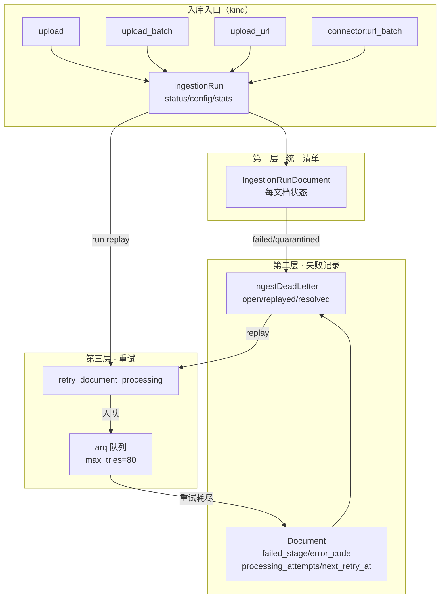
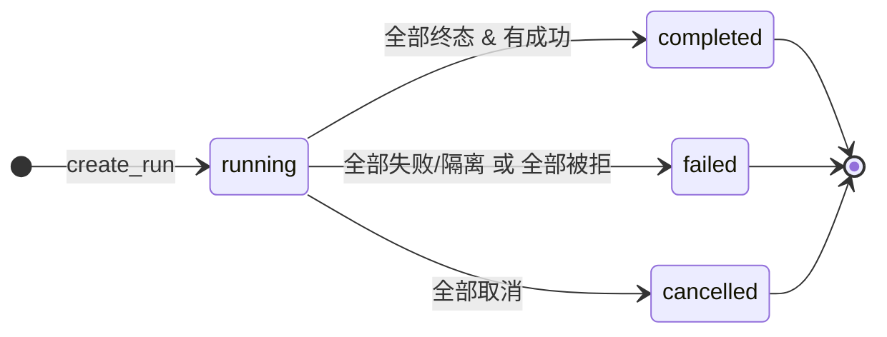
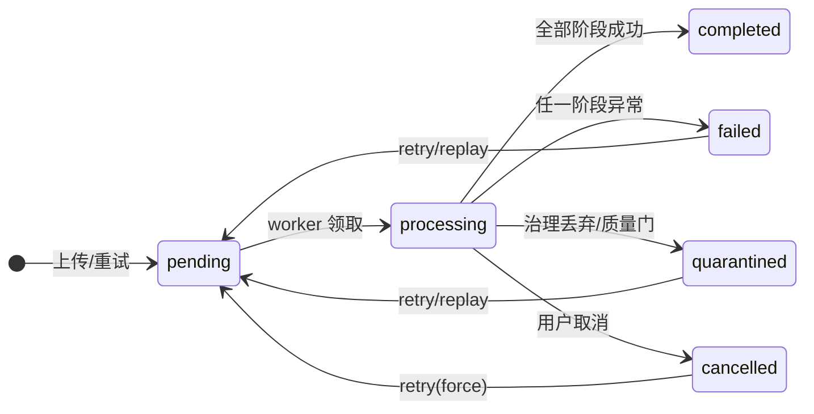

MimirQ 的入库体系由三层结构构成：**统一入库清单（Ingestion Run）**负责回答"这次入库到底发生了什么"；**文档级结构化失败字段 + 死信队列（Dead Letter Queue）**负责回答"哪些文档失败了、失败在哪一步、为什么"；**三层重试机制**（队列级 arq 重试、文档级 retry 端点、死信/运行 replay）负责回答"如何让失败文档重新进入流水线"。这三层共享同一个设计哲学：**可观测性是尽力而为（best-effort）的，绝不允许清单更新或死信写入反过来阻塞入库主流程**——这正是 `IngestionRunService` 文档字符串中明示的设计目标，也是理解整套代码的钥匙。

Sources: [app/services/ingestion_run_service.py](app/services/ingestion_run_service.py#L7-L10)

## 一、总体架构：三层失败处理体系



三层各自的职责边界非常清晰：**清单层**（`ingestion_runs` 与 `ingestion_run_documents`）提供跨入口的 `run_id` 统一视图与统计聚合；**失败记录层**（`ingest_dead_letters` 表）把失败从易失的文档字段沉淀为可查询、可重放的持久化记录；**重试层**则复用同一个 `retry_document_processing` 函数作为唯一出口，确保无论重试从哪个入口发起，行为都一致。这种"单一重试出口"的设计是避免三条重试路径行为漂移的关键。

| 层次 | 载体 | 核心职责 | 写入时机 |
|---|---|---|---|
| 清单层 | `ingestion_runs` / `ingestion_run_documents` | 运行级状态、统计、失败原因聚合 | 创建 run、附加文档、文档状态变更、批量收口 |
| 失败记录层 | `ingest_dead_letters` + 文档结构化字段 | 持久化失败快照、错误码归一化、重试计数 | 处理器将文档置为 failed/quarantined 时 |
| 重试层 | arq 队列 / retry 端点 / replay 端点 | 重新调度处理、清理旧索引、幂等入队 | 队列重试耗尽前、用户手动重试、死信 replay |

Sources: [app/models/ingestion_run.py](app/models/ingestion_run.py#L22-L83) | [app/models/ingest_dead_letter.py](app/models/ingest_dead_letter.py#L12-L43)

## 二、Ingestion Run：统一入库清单

`IngestionRun` 是一个刻意保持轻量的"运行清单（manifest）"模型：它不承载文档内容，只记录**一次入库尝试**的元信息。`kind` 字段标记入口类型（`upload`、`upload_batch`、`upload_url`、`connector:url_batch`、`connector:web_crawl` 等），`config` 保存本次入库的参数快照（文件名、解析器、切块策略、pipeline hash、期望文档数），`stats` 保存有界统计（见下表）。每个 run 通过 `IngestionRunDocument` 与文档建立映射，该映射自带 `(tenant_id, run_id, document_id)` 唯一约束——这是并发幂等的最后一道防线。



Run 级状态机只有四个状态（`pending → running → completed|failed|cancelled`），但判定规则并不简单。`_update_progress_and_finalize_run` 定义了精确的收口逻辑：只有当**终态文档数**（completed + failed + quarantined + cancelled）达到 `completion_target` 时才尝试定稿，而 `completion_target = max(stats.total_documents, config.expected_documents)`——这一设计同时兼容了"先建 run 后加文档"和"先知道预期数量"两种入口。定稿优先级为：全部取消 → `cancelled`；无成功且失败+隔离占满 → `failed`；否则 → `completed`。

| stats 字段 | 含义 | 有界策略 |
|---|---|---|
| `total_documents` | 附加文档总数 | 整数 |
| `status_counts` | 按文档状态聚合的计数 | 仅枚举状态键 |
| `failure_reasons_top` | 失败原因 Top 计数 | 截断到 25 键、保留前 20 |
| `stage_durations_ms_sum` / `stage_durations_docs` | 各阶段耗时累计 | 键截断 64 字符 |
| `pipeline_hash_docs` | pipeline 版本分布 | 键截断 64 字符 |
| `progress` | 完成百分比 | 0–100 钳制 |

`IngestionRunService` 暴露四个核心方法，构成完整的生命周期契约：`create_run` 创建运行并置为 `running`；`add_document` 用 `SELECT FOR UPDATE` 锁住 run 行后附加文档并递增统计；`on_document_status_update` 在文档状态变更时（由处理器回调）增量更新统计，且**冻结已完成 run**——`finished_at` 非空的 run 不再接受文档状态回写，避免重处理污染旧清单；`close_intake` 在批量入口收口时对账实际附加数与预期数，若全部输入被拒则直接判定 run 为 `failed`。

Sources: [app/models/ingestion_run.py](app/models/ingestion_run.py#L34-L46) | [app/services/ingestion_run_service.py](app/services/ingestion_run_service.py#L129-L155) | [app/services/ingestion_run_service.py](app/services/ingestion_run_service.py#L190-L330) | [app/services/ingestion_run_service.py](app/services/ingestion_run_service.py#L341-L470) | [app/services/ingestion_run_service.py](app/services/ingestion_run_service.py#L477-L540)

## 三、文档级生命周期与结构化失败字段

在 run 清单之下，每个文档自身维护独立的处理状态机。`documents` 表的处理相关字段（migration 0015 引入）是失败处理的"第一落点"：`status` 定义八个状态，`current_stage` 标记当前流水线阶段（`parsing | chunking | embedding | vector_write | completed`），而 `failed_stage`、`error_code`、`processing_attempts`、`next_retry_at` 四个字段构成结构化的失败画像。



处理器在每次 `_update_status` 时执行一套固定的副作用序列（processor.py 的 `_update_status` 是失败处理链路的**中枢**）：先做取消保护（用户已取消或 `cancel_requested` 标记存在时拒绝覆盖状态），然后应用状态字段，接着**在 status 为 failed/quarantined 时调用 `record_ingest_dead_letter` 写入死信**，再调整 Prometheus 阶段仪表，最后通知 `IngestionRunService.on_document_status_update` 回写 run 清单。失败信息因此在同一事务边界内同时到达文档、死信表和 run 统计三个位置。

Sources: [app/models/document.py](app/models/document.py#L83-L91) | [alembic/versions/0015_ingest_dead_letters.py](alembic/versions/0015_ingest_dead_letters.py#L14-L16) | [app/parsing/processors/processor.py](app/parsing/processors/processor.py#L2676-L2688) | [app/parsing/processors/processor.py](app/parsing/processors/processor.py#L2800-L2840)

## 四、死信队列：持久化的失败记录

死信队列的表结构（migration 0015 创建）围绕"**一个失败文档一条 open 记录**"设计。`record_ingest_dead_letter` 的核心语义是：同一文档若反复失败，**不新建记录而是复用已有的 open 记录并递增 `retry_count`**——这样隔离队列保持稳定，同时保留了尝试次数。每次写入还会把 `original_payload` 更新为最新快照（document_id、task_id、pipeline_hash），并同步 stamp 文档上的 `failed_stage`、`error_code`、`processing_attempts` 字段。

| 字段 | 说明 | 典型值 |
|---|---|---|
| `status` | 生命周期 | `open` → `replayed` / `resolved` |
| `failed_stage` | 失败阶段 | `preprocess` / `parse` / `chunking` / `embedding` / `vector_write` |
| `error_code` | 归一化错误码 | `parse_failed`、`rate_limited`、`access_denied`… |
| `error_message` | 原始错误（截断 4000 字符） | 仅用于排查 |
| `original_payload` | 失败快照 | `{document_id, task_id, pipeline_hash, stage}` |
| `retry_count` | 累计重试次数 | 从 0 递增 |
| `schema_version` | 记录格式版本 | `mimirq.ingest_dead_letter.v1` |

错误码归一化是死信可聚合性的基础。`normalize_ingest_error_code` 通过别名表把千变万化的异常文本映射为有限的分类键——这是仪表盘和报告能够按错误码聚合的前提，也避免了原始异常串中的路径、URL 等 PII 泄漏到统计面。三个复合索引（`tenant_id+status`、`tenant_id+document_id+status`、`tenant_id+error_code`）分别支撑了"待处理队列视图"、"单文档历史查询"和"错误分类统计"三类典型访问模式。

| 原始文本特征 | 归一化错误码 |
|---|---|
| `timeout` / `timed out` | `timeout` |
| `connection` | `connection_error` |
| `rate limit` / `429` | `rate_limited` |
| `quota` | `quota_exceeded` |
| `permission` / `forbidden` / `401` / `403` | `access_denied` |
| `not found` / `missing` | `not_found` |
| `unsupported` | `unsupported_file` |
| `parse` | `parse_failed` |
| `chunk` | `chunk_failed` |
| `embedding` | `embedding_failed` |
| `vector` | `vector_write_failed` |
| `index` | `index_failed` |

值得注意的是，`quarantined`（隔离）与 `failed`（失败）是两条**并列但语义不同**的失败路径：治理 drop 过滤在 `GOVERNANCE_QUARANTINE_ON_DROP` 开启时把命中文档标记为 `quarantined`，解析质量门也会产生 `quarantined_by_parse_quality`。两者都会触发死信写入，但隔离更接近"有意的质量拦截"而非"意外故障"，因此在 run 判定和仪表盘中分别统计。

Sources: [alembic/versions/0015_ingest_dead_letters.py](alembic/versions/0015_ingest_dead_letters.py#L17-L50) | [app/services/ingest_dead_letter_service.py](app/services/ingest_dead_letter_service.py#L22-L70) | [app/services/ingest_dead_letter_service.py](app/services/ingest_dead_letter_service.py#L85-L163) | [app/parsing/processors/processor.py](app/parsing/processors/processor.py#L1436-L1440) | [app/core/config.py](app/core/config.py#L1919-L1925)

## 五、重试机制：三层重试

```mermaid
sequenceDiagram
    participant U as 用户/运维
    participant API as retry 端点
    participant Q as arq 队列
    participant W as Worker(processor)
    participant DB as PostgreSQL
    participant DL as 死信表

    U->>API: POST /documents/{id}/retry
    API->>API: 校验状态 & 计算 pipeline_hash
    API->>API: 写入 retry_cleanup 元数据
    API->>API: 重置 failed_stage/error_code/next_retry_at
    API->>Q: enqueue (job_id=doc:{tenant}:{doc}:{hash})
    Q->>W: process_document_job
    alt 协调锁/信号量繁忙
        W->>Q: 抛出 Retry (defer 30s)
        Q-->>W: job_try+1 重试
        W-->>DB: 达到 max_tries(80) → 标记 failed
    else 处理异常
        W->>DB: _update_status(failed)
        W->>DL: record_ingest_dead_letter (open)
    end
    U->>DL: GET /documents/dead-letters?status=open
    U->>API: POST /dead-letters/{id}/replay
    API->>API: completed → force=true; failed → force=false
    API->>DL: mark_dead_letter_replayed (replayed)
```

**第一层：队列级 arq 重试。** 文档处理任务（`process_document_job`）在 Redis/arq 上运行，`TASK_DOCUMENT_JOB_MAX_TRIES`（默认 80）控制最大尝试次数。协调类失败（Redis 不可达、租户/数据集信号量繁忙、文档级锁竞争）通过 `_raise_task_retry` 抛出带 `defer` 秒数的重试异常；当 `job_try` 达到上限时，`_mark_document_failed_on_exhausted_retry` 将文档标记为 `failed`，错误信息如 `document_processing_lock_timeout` 会流经 `_update_status` 链路进入死信。任务入队使用确定性 `job_id = doc:{tenant_id}:{document_id}:{pipeline_hash}`，配合 worker 侧的 Redis 幂等锁，保证同一文档+同一 pipeline 不会并发处理。

**第二层：文档级 retry 端点。** `POST /documents/{document_id}/retry` 是全部重试的统一出口（死信 replay 和 run replay 最终都调用它）。它执行一套完备的重置序列：校验状态（`processing` 与不可重试的 `pending` 返回 409，`completed` 需要 `force=true`）、校验文件可重放性、解析 `parser_backend` 覆盖、可选 `skip_if_unchanged` 幂等跳过、写入 `retry_cleanup` 元数据（`scope: pipeline|document` 决定 worker 清理旧索引的范围），然后把文档重置为 `pending` + `current_stage=queued` 并清空四个失败字段。队列不可用时采取 **fail-closed** 策略：将文档标记为 `document_processing_schedule_failed` 并返回 503，而不是静默降级——这保证了失败可见性。

**第三层：死信 replay 与 run replay。** `POST /documents/dead-letters/{id}/replay` 把死信记录转为一次 retry：`completed` 文档以 `force=true` 重放，`failed`/`quarantined` 文档走普通重试，成功后死信标记为 `replayed`。`POST /ingestion/runs/{run_id}/replay` 则创建 `kind="replay"` 的新 run（config 记录 `replay_of`），把原 run 的文档 ID 批量（上限 2000）重新入队——它不重新下载 connector 源，只重放已存储的文件。

| 维度 | 队列级重试 | 文档级 retry | 死信/run replay |
|---|---|---|---|
| 触发方 | arq 运行时自动 | 用户/API 手动 | 运维对失败记录或整次运行的批量操作 |
| 控制参数 | `TASK_DOCUMENT_JOB_MAX_TRIES`（80）、defer 秒 | `force`、`skip_if_unchanged`、`parser_backend` | 复用 retry 端点；`force` 依文档状态自动决定 |
| 失败归宿 | 耗尽后标记 failed → 进死信 | 失败后进死信 | 重放失败重新进死信（复用 open 记录） |
| 幂等手段 | Redis 锁 + 确定性 job_id | 唯一约束 + 行锁 | `mark_dead_letter_replayed` 防止重复重放 |

Sources: [app/tasks/jobs.py](app/tasks/jobs.py#L144-L218) | [app/tasks/jobs.py](app/tasks/jobs.py#L535-L650) | [app/tasks/queue.py](app/tasks/queue.py#L175-L200) | [app/api/v1/document_processing.py](app/api/v1/document_processing.py#L160-L250) | [app/api/v1/document_processing.py](app/api/v1/document_processing.py#L331-L395) | [app/api/v1/document_dead_letters.py](app/api/v1/document_dead_letters.py#L98-L156) | [app/api/v1/ingestion_runs.py](app/api/v1/ingestion_runs.py#L362-L459)

## 六、并发与幂等保护

入库链路是多入口、多 worker 并发写入的，因此并发安全是失败处理正确性的前提。三个关键机制层层递进：

1. **行级锁**：`add_document` 与 `on_document_status_update` 在修改 run 统计前先用 `SELECT FOR UPDATE` 锁定 run 行（`_lock_run_for_update`），保证统计递增不丢更新。
2. **唯一约束兜底**：migration 0024 为 `ingestion_run_documents` 添加 `(tenant_id, run_id, document_id)` 唯一约束，并附带一次**不可逆的数据修复**——按状态优先级（completed > failed > quarantined > cancelled > processing > pending）保留重复行中的最佳记录，删除其余，同时重算受影响 run 的 `stats`。服务层用 `_is_duplicate_run_document_integrity_error` 识别该约束冲突并安静返回，实现"并发附加同一文档不报错"。
3. **Redis 分布式锁**：worker 端 `lock:doc:{tenant}:{document}:{pipeline_hash}` 的 SET NX EX 锁防止同一文档在同一 pipeline 下的重复处理，配合租户级/数据集级信号量控制并发水位。

另一个容易被忽略的保护是**取消语义**：`_status_update_cancel_blocked` 确保长任务完成后不会把用户已取消的文档状态覆盖回去——失败处理不能凌驾于用户意图之上。

Sources: [app/services/ingestion_run_service.py](app/services/ingestion_run_service.py#L104-L122) | [alembic/versions/0024_ingestion_run_document_uniqueness.py](alembic/versions/0024_ingestion_run_document_uniqueness.py#L12-L100) | [app/services/ingestion_run_service.py](app/services/ingestion_run_service.py#L238-L330) | [app/tasks/jobs.py](app/tasks/jobs.py#L552-L576)

## 七、可观测性：指标与 API

失败处理体系的价值最终要通过可观测性兑现。Prometheus 侧（`PROMETHEUS_ENABLED=true` 时启用）暴露三组指标：`ingestion_runs_total` 计数器（按 `status` 与 `kind` 标签）、`ingestion_run_duration_seconds` 直方图（按状态/类型分桶）、`ingestion_processing_stage_total` 仪表（按处理阶段统计当前处理中文档数）。设计红线是 **PII 安全**：指标标签只允许 `status`、`kind`、`stage` 等低基数枚举，绝不携带文件名、路径或 URL。管理端 `ingestion_dashboard_service` 进一步提供按小时/天时间桶的吞吐序列和错误分类统计，错误原因同样经过归一化处理。

API 面则以 `/api/v1/ingestion/runs` 为枢纽提供完整的清单运维能力：列表（按数据集/状态/类型过滤并强制数据集写权限）、详情、JSON/HTML 导出（离线友好 + 最小化审计日志）、双 run 对比（`compare_runs` 输出的增量 diff 直接驱动 UI 展示）。文档侧 `GET /documents/{id}/status` 返回包含 `failed_stage`、`error_code`、`processing_attempts`、`next_retry_at` 的轮询载荷，前端据此渲染处理阶段徽章与失败信息。

| 端点 | 用途 | 权限语义 |
|---|---|---|
| `GET /ingestion/runs` | 运行列表（分页/过滤） | 数据集可写者 |
| `GET /ingestion/runs/{id}` | 运行详情 + 文档映射 | 数据集可写者 |
| `GET /ingestion/runs/{id}/export` / `export-html` | 清单导出 | 同详情 + 审计 |
| `GET /ingestion/runs/{id}/compare/{other}` | 两次运行差异对比 | 同详情 + 审计 |
| `POST /ingestion/runs/{id}/replay` | 整次运行重放 | 数据集可写者 |
| `GET /documents/dead-letters` | 死信列表（默认 `status=open`） | 数据集可读 + 文档 ACL 过滤 |
| `POST /documents/dead-letters/{id}/replay` | 单条死信重放 | 文档可写（lifecycle） |
| `POST /documents/{id}/retry` | 单文档重试 | 文档可写（lifecycle） |

Sources: [app/services/ingestion_prometheus_metrics.py](app/services/ingestion_prometheus_metrics.py#L16-L33) | [app/services/ingestion_prometheus_metrics.py](app/services/ingestion_prometheus_metrics.py#L58-L121) | [app/services/ingestion_dashboard_service.py](app/services/ingestion_dashboard_service.py#L17-L24) | [app/services/ingestion_dashboard_service.py](app/services/ingestion_dashboard_service.py#L90-L140) | [app/api/v1/ingestion_runs.py](app/api/v1/ingestion_runs.py#L95-L360) | [app/api/v1/document_dead_letters.py](app/api/v1/document_dead_letters.py#L31-L94) | [app/api/v1/document_processing.py](app/api/v1/document_processing.py#L29-L44)

## 总结

入库生命周期与失败处理的设计可以用一句话概括：**用"尽力而为"的清单层保证观测不阻塞业务，用"持久化+归一化"的失败层保证错误可聚合可重放，用"单一出口"的重试层保证所有恢复路径行为一致**。migration 0015 与 0024 分别建立了失败记录模型和清单唯一性约束，`IngestionRunService` 与 `IngestDeadLetterService` 承载全部业务语义，处理器、队列 worker 与 API 端点则把三张表编织成一条完整、可审计、可恢复的入库链路。

若想继续深入，建议按以下顺序阅读：任务队列的底层执行细节见 [后台任务队列与 Worker：基于 Redis/arq 的异步任务执行](11-hou-tai-ren-wu-dui-lie-yu-worker-ji-yu-redis-arq-de-yi-bu-ren-wu-zhi-xing)；解析质量门与隔离状态的触发源头见 [数据治理工作台：治理 Profile、清洗规则与质量检测](14-shu-ju-zhi-li-gong-zuo-tai-zhi-li-profile-qing-xi-gui-ze-yu-zhi-liang-jian-ce)；入库策略与解析前预处理的配置面见 [文档解析框架：解析器工厂、后端路由与子进程隔离](12-wen-dang-jie-xi-kuang-jia-jie-xi-qi-gong-han-hou-duan-lu-you-yu-zi-jin-cheng-ge-chi)；指标在运维面的落地方式见 [可观测性与链路追踪：Prometheus 指标、OpenTelemetry 与 Phoenix](30-ke-guan-ce-xing-yu-lian-lu-zhui-zong-prometheus-zhi-biao-opentelemetry-yu-phoenix)。