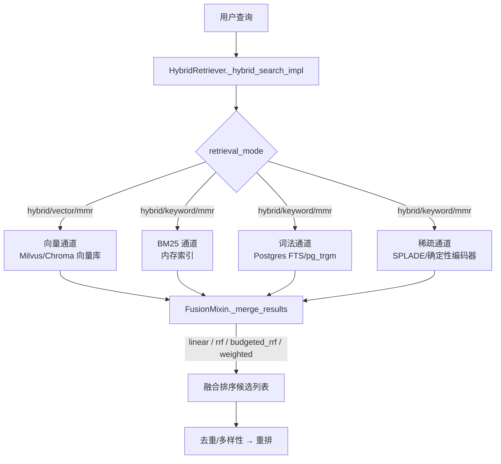

本文解析 MimirQ 检索层的核心机制：如何将四条异构检索通道（向量、BM25、词法数据库、稀疏检索）的输出合并为单一排序列表。不同通道的原始分数不可直接比较——向量余弦相似度与 BM25 词频分数量纲不同，因此融合必须是显式、确定性且可观测的。本文聚焦 `HybridRetriever` 的通道组织、四种融合策略（`linear` / `rrf` / `budgeted_rrf` / `weighted`）的数学语义、预算配额机制，以及融合前后的附加信号与离线评估工具链。

Sources: [retrieval_fusion.md](docs/guides/retrieval_fusion.md#L1-L22)

## 四通道检索架构

`HybridRetriever` 通过 mixin 组合方式继承各通道实现：`Bm25IndexMixin`、`LexicalDBMixin`、`SparseIndexMixin`、`ColbertIndexMixin` 与 `FusionMixin`，类定义于 `app/rag/retriever.py`，mixin 拆分到 `app/rag/retrieval/hybrid/` 包中避免单一文件膨胀。检索模式 `retrieval_mode` 决定通道激活集合：`hybrid`（默认）、`vector`、`keyword`、`mmr` 四种模式。



通道激活条件在 `_hybrid_search_impl` 中显式声明：`want_vector = retrieval_mode in ("hybrid", "vector", "mmr")`；`want_bm25` 同集合；`want_lexical` 额外要求 `LEXICAL_DB_ENABLED`；`want_sparse` 额外要求 `_effective_sparse_enabled()`（默认关闭）。每种模式还具备跨通道兜底：`vector` 模式在向量通道失败时自动降级到 BM25+词法；`keyword` 模式在关键词通道全空时回退到向量。每条通道的启动、成功、失败均被记录到 `_last_channel_metrics`，支撑检索降级可观测性。

Sources: [retriever.py](app/rag/retriever.py#L207-L240)、[retriever.py](app/rag/retriever.py#L1318-L1323)、[retriever.py](app/rag/retriever.py#L1975-L2050)

### 通道分工与特性对比

各通道擅长不同查询形态，这是融合存在的前提：

| 通道 | 实现位置 | 原理 | 擅长场景 | 默认激活 |
|---|---|---|---|---|
| vector（稠密） | `retriever.py` 向量搜索 | Embedding 余弦相似度 | 语义相似、同义改写 | hybrid/vector/mmr |
| bm25（内存稀疏） | `hybrid/bm25_index.py` | 按租户/数据集作用域懒加载的 BM25 索引 | 关键词密集型查询 | hybrid/keyword/mmr |
| lexical_db（词法） | `hybrid/lexical.py` | `websearch_to_tsquery` FTS + `pg_trgm` + CJK 分词 | 编号、代码、精确短语 | hybrid 下仅兜底 |
| sparse（稀疏语义） | `hybrid/sparse_index.py` + `sparse.py` | SPLADE 风格 term expansion | 语义词项扩展 | 默认关闭（`SPARSE_RETRIEVAL_ENABLED=false`） |

BM25 通道维护按 scope key 分层的 LRU 缓存（`_bm25_cache_order`），支持懒构建与缓存版本失效；词法通道在 hybrid 模式下默认仅作安全网（`LEXICAL_DB_HYBRID_FALLBACK_ONLY=True`），当主通道候选数不足 `top_k` 或查询被识别为 CJK 元数据精确锚点时触发。稀疏通道复用 BM25 的作用域文档集作为语料源，编码后的稀疏向量以 gzip JSON 持久化到 `./data/sparse_indexes`，携带语料指纹做一致性校验。

Sources: [bm25_index.py](app/rag/retrieval/hybrid/bm25_index.py#L1442-L1556)、[lexical.py](app/rag/retrieval/hybrid/lexical.py#L449-L580)、[retriever.py](app/rag/retriever.py#L1700-L1796)、[sparse.py](app/rag/retrieval/sparse.py#L452-L530)

## 融合前的归一化与附加信号

`_merge_results` 的第一步是逐通道 min-max 归一化到 `[0,1]`：`norm_score = (score - min) / (max - min)`，通道内空列表直接跳过。归一化后的每个候选按 `_result_key`（`document_id:chunk_index` 优先）去重合并，多通道同时命中的候选取最高归一化分。这一「先归一化、再融合」的设计保证线性与加权策略的分数可加，而 RRF 系策略则在归一化分之上另行计算排名。

归一化过程中可叠加三类附加信号：字段感知召回提升（`RETRIEVAL_FIELD_AWARE_RECALL_ENABLED`，title/heading 命中加成 0.08/0.05）、块类型权重（`RETRIEVAL_CHUNK_TYPE_WEIGHTING_ENABLED`，查询含「表格/公式/代码」等信号时对应块类型加成 0.08）、以及融合后的精确短语加成（`RETRIEVAL_EXACT_PHRASE_RERANK_BOOST=0.35`，查询短语在内容中精确命中时分数上界 1.0）。这些信号均为有界加成，不改变候选集合，只影响排序——与「融合只做排序不做召回」的架构约束一致。

Sources: [fusion.py](app/rag/retrieval/hybrid/fusion.py#L124-L160)、[dedup.py](app/rag/retrieval/hybrid/dedup.py#L53-L64)、[common.py](app/rag/retrieval/hybrid/common.py#L281-L317)、[config.py](app/core/config.py#L1172-L1181)

## 四种融合策略

`_merge_results` 依据 `fusion_strategy` 分派到四个分支。策略来源优先级：请求级 `rag_config.fusion_strategy` → 检索器实例字段 → 全局默认 `RETRIEVAL_FUSION_STRATEGY`（默认 `budgeted_rrf`）。`ChatRAGConfig` 的校验器将别名归一化：`reciprocal_rank_fusion`→`rrf`、`budget_rrf`→`budgeted_rrf`、`weighted_linear`→`weighted`。

```mermaid
flowchart TD
    A[fusion_strategy] -->|linear| L[alpha * vector + (1-alpha) * keyword]
    A -->|rrf| R[Σ 1/(k + rank_channel) 归一化]
    A -->|budgeted_rrf| B[RRF 打分 + 按配额选择 top-k 前缀]
    A -->|weighted| W[归一化分数加权求和]
    B --> B1[配额: vector 50% / bm25+lexical 均分 / sparse 0]
    B --> B2[min_scores 门槛: rank_score >= 阈值]
    B --> B3[按 document_id:chunk_index 去重]
```

Sources: [fusion.py](app/rag/retrieval/hybrid/fusion.py#L222-L223)、[chat.py](app/api/schemas/chat.py#L466-L480)、[config.py](app/core/config.py#L1137-L1140)

### linear（线性混合）

各通道归一化后，若候选同时命中向量与任一关键词通道，融合分为 `alpha * vector + (1-alpha) * keyword`，其中 `keyword_score = max(bm25, lexical, sparse)`；仅命中单一通道时直接采用该通道分数。`alpha` 默认 0.6（`RETRIEVAL_DEFAULT_ALPHA`），请求可覆盖。这是最直观的基线策略，前提是各通道分数已校准且量纲稳定。

### rrf（倒数排名融合）

将每条通道的列表转换为排名（1..N），候选的融合原始分为 `Σ 1/(k + rank_channel)`，`k` 默认 60（`RETRIEVAL_RRF_K`）。该数学形式天然免疫各通道分数量纲差异——通道只贡献排名而非分数。排序后对 `rrf_score_raw` 再做一次 min-max 归一化用于展示，同时保留 `rrf_rank_vector/bm25/lexical/sparse` 与 `rrf_k` 等可观测字段。排序键包含 `_result_key` 作为确定性尾键，保证回归回放（regression replay）的排序稳定。

### budgeted_rrf（配额版 RRF）

MimirQ 的默认策略，针对证据检索的「可见 top-k 前缀需要跨通道覆盖」这一需求设计：先按 RRF 计算全量融合分，再在可见前缀内强制各通道配额，最后按融合分排序前缀并拼接剩余候选。默认配额启发式（无请求级预算时）：vector 约占 `top_k` 的 50%，剩余关键词配额由 bm25 与 lexical 均分，sparse 默认为 0（需显式启用）。每个候选附带 `vector/bm25/lexical/sparse_rank_score`（即该通道内的 `1/rank`，缺失为 0），`fusion_min_scores` 可按通道设置 `rank_score` 门槛截断低排名尾部候选。去重键为 `(document_id, chunk_index)`——多通道重复命中的候选只占一个配额槽位，由融合分最高的通道贡献。

### weighted（显式加权）

对归一化分数做显式加权求和：`score = w_vector*vector + w_bm25*bm25 + w_lexical*lexical + w_sparse*sparse`，权重自动归一化到总和 1，未提供的键视为 0。若权重缺失或全非法，安全回退到 `linear`。该策略的价值在于可离线学习并固化每数据集权重（见下文工具链）。

Sources: [fusion.py](app/rag/retrieval/hybrid/fusion.py#L223-L346)、[fusion.py](app/rag/retrieval/hybrid/fusion.py#L347-L651)、[fusion.py](app/rag/retrieval/hybrid/fusion.py#L652-L822)、[retrieval_fusion.md](docs/guides/retrieval_fusion.md#L24-L137)

### 策略对比

| 维度 | linear | rrf | budgeted_rrf | weighted |
|---|---|---|---|---|
| 分数基础 | 归一化分数 | 排名倒数 | 排名倒数 + 配额 | 归一化分数 |
| 量纲鲁棒性 | 低（需校准） | 高 | 高 | 低（需校准） |
| 前缀覆盖控制 | 无 | 无 | 有（配额+门槛） | 无 |
| 每候选可观测字段 | vector/bm25/lexical/sparse_score | rrf_rank_* | 上述 + rank_score + prefix_rank | vector/bm25/lexical/sparse_score |
| 权重可学习 | 仅 alpha | — | — | 支持（离线拟合） |
| 典型用途 | 基线对比 | 跨通道排序 | 证据检索默认 | 数据集级定制 |

Sources: [retrieval_fusion.md](docs/guides/retrieval_fusion.md#L24-L137)

## 配置与请求覆盖路径

融合参数贯穿三层：全局默认（`app/core/config.py`）→ 检索器实例字段（`HybridRetriever`）→ 请求级 `rag_config`（`ChatRAGConfig`）。`ChatRAGConfig` 对 `fusion_budgets`（int 映射）、`fusion_min_scores`（float 映射，`[0,1]`）、`fusion_weights`（键限 `vector/bm25/lexical/sparse`）均做清洗校验。融合参数随后传入 `_merge_results` 的 `fusion_strategy` / `rrf_k` / `top_k` 参数，`top_k` 同时决定 budgeted_rrf 的前缀长度。

检索 profile（如 `recall50`、`coverage80`、`hybrid_ce`）通过 `apply_retrieval_profile_overrides` 调整 `top_k`、`retrieval_mode`、`score_threshold` 等，但不直接改写融合策略——融合策略由独立字段控制，这使消融实验可以只改 `fusion_strategy` 而保持 profile 不变。示例请求负载：

```json
{
  "query": "PCI-DSS 4.0 requirement 10.4.2",
  "rag_config": {
    "retrieval_profile": "recall50",
    "retrieval_mode": "hybrid",
    "top_k": 50,
    "fusion_strategy": "budgeted_rrf",
    "fusion_budgets": { "vector": 25, "bm25": 10, "lexical": 10, "sparse": 5 },
    "fusion_min_scores": { "lexical": 0.5 }
  }
}
```

Sources: [chat.py](app/api/schemas/chat.py#L338-L357)、[chat.py](app/api/schemas/chat.py#L483-L510)、[retriever.py](app/rag/retriever.py#L2336-L2346)、[retrieval_profiles.py](app/rag/core/retrieval_profiles.py#L84-L110)

## 融合后的排序流水线

融合输出并非最终结果，其后依次经过：插件检索策略钩子（`_apply_plugin_retrieval_policy`）→ 元数据精确锚点后置排序（保护性插入未进入融合列表的精确命中）→ 去重与多样性约束（Jaccard 相似度去重、simhash64 近重复检测、每文档块数上限、最小文档数下限）→ 可选 MMR 多样性重排或外部 reranker。去重与多样性不撤销 budgeted_rrf 的前缀排序——前缀内候选携带 `fusion_budgeted_prefix_rank`，多样性阶段以此为稳定性锚点。真正的重排器体系（Cross-Encoder、ColBERT、LTR）属于独立主题，详见 [重排器体系：Cross-Encoder、ColBERT、LTR、MMR 与混合重排](17-zhong-pai-qi-ti-xi-cross-encoder-colbert-ltr-mmr-yu-hun-he-zhong-pai)。

Sources: [retriever.py](app/rag/retriever.py#L2336-L2400)、[dedup.py](app/rag/retrieval/hybrid/dedup.py#L50-L135)、[test_retrieval_fusion_budgeted_rrf.py](tests/test_retrieval_fusion_budgeted_rrf.py#L107-L130)

## 离线评估与权重学习工具链

融合策略的效果验证依赖三个脚本，构成「评估 → 学习 → 固化」闭环：

- `scripts/eval_retrieval_fusion_offline.py`：在回归用例集上通过 Evidence API 对比融合变体，默认比较 `base`（服务器默认）与 `budgeted_rrf`，支持 JSON 变体矩阵一次跑多组。
- `scripts/learn_fusion_weights_offline.py`：对权重单纯形做网格搜索（`--step 0.2`），目标函数可选 `mrr` / `recall` / `ndcg10` / `hit10` 等，输出最优权重 JSON。
- `scripts/apply_fusion_weights_to_dataset.py`：将学习到的权重固化到数据集 `metadata.rag_defaults`，默认安全模式（需 `--execute`），支持 `--clear` 回滚。

这一闭环与页面 24 的 CI 质量门禁协同：权重学习的目标指标（Recall/MRR）正是回归门禁的评估口径。

Sources: [eval_retrieval_fusion_offline.py](scripts/eval_retrieval_fusion_offline.py#L93-L117)、[learn_fusion_weights_offline.py](scripts/learn_fusion_weights_offline.py#L102-L167)、[retrieval_fusion.md](docs/guides/retrieval_fusion.md#L204-L259)

## 可观测性与契约保障

融合行为通过三类机制保持透明：其一，`_last_channel_metrics` 记录每次检索的通道级明细——attempted/successful/failed 通道、各通道候选数、`fusion_ms` 耗时、budgeted_rrf 的 `budgets` / `picked_by_channel` / `eligible_total`、weighted 的权重哈希；其二，稀疏通道经 `sparse_prometheus_metrics` 暴露 provider/outcome/耗时指标；其三，测试套件固化行为契约——`test_retrieval_fusion_budgeted_rrf.py` 验证配额去重（`d2:0` 双通道命中只占一槽）、`fusion_min_scores` 截断、精确命中加权、多样性不撤销前缀排序等不变量。确定性排序键（`_result_key` 尾键）确保回归回放逐条可复现，这是融合策略可被 CI 门禁评估的前提。

Sources: [retriever.py](app/rag/retriever.py#L2253-L2330)、[sparse_prometheus_metrics.py](app/rag/retrieval/sparse_prometheus_metrics.py#L105-L160)、[test_retrieval_fusion_budgeted_rrf.py](tests/test_retrieval_fusion_budgeted_rrf.py#L27-L71)

## 总结

MimirQ 的混合检索以「显式、确定性、可观测」为设计原则：四条异构通道各自独立召回，`linear` 提供可解释基线，`rrf` 免疫量纲差异，`budgeted_rrf` 用配额机制保证证据检索的可见前缀跨通道覆盖，`weighted` 支撑数据集级权重固化。融合只做排序、不做召回，附加信号全部有界，后置去重与重排不撤销前缀语义。推荐继续阅读 [重排器体系](17-zhong-pai-qi-ti-xi-cross-encoder-colbert-ltr-mmr-yu-hun-he-zhong-pai) 了解融合后的排序深化，或 [检索编排与上下文扩展](18-jian-suo-bian-pai-yu-shang-xia-wen-kuo-zhan-er-ci-zhao-hui-cha-xun-gai-xie-yu-zheng-ju-que-kou-bu-quan) 了解多查询变体与证据缺口补全如何在融合之上叠加。