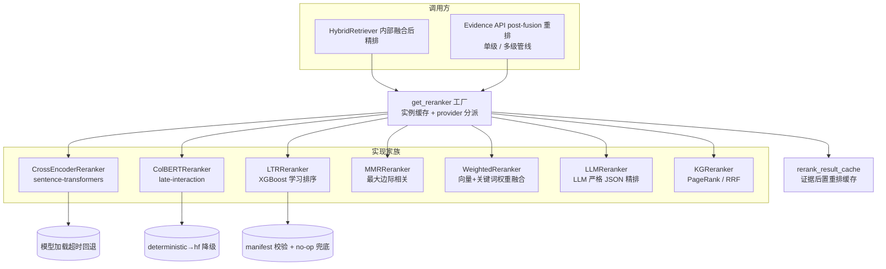

重排（Rerank）位于混合检索融合之后、证据交付之前，是决定 Top-N 证据排序质量的最后一道精排关卡。MimirQ 的重排器体系围绕一个**统一抽象 + 多实现 + 双接入点**的架构展开：`BaseReranker` 定义统一的 `rerank()` 契约，工厂 `get_reranker()` 按 provider 分派到十余种实现，而调用方既可以是 `HybridRetriever` 内部的融合后精排，也可以是 Evidence API 的 post-fusion 后置重排（支持单级与多级管线）。本文按实现家族逐一拆解其算法、工程约束与选型依据。

## 统一架构：抽象、类型与工厂

整套重排器体系建立在三个核心文件之上。`types.py` 定义了贯穿全链路的数据契约：`RerankCandidate` 是携带 `id`、`text` 与任意 `metadata` 的不可变候选条目；`RerankResult` 统一返回 `ordered_ids`（排序后的 ID 序列）、`score_map`（ID 到分数的映射）、可选的 `items`/`clues`（用于图谱类重排器透传证据线索）以及 `elapsed_sec`、`model_used`、`provider` 等遥测字段。`base.py` 则定义了三级类层次：**顶层 `BaseReranker`** 声明同步 `rerank()` 抽象方法并提供一个默认跑线程的 `arerank()` 异步实现；**`APIReranker`** 是远程 HTTP 重排器的基类，内建限流、熔断与分数缓存等工程状态；**`DocumentReranker`** 面向文档级重排（权重融合、父子切块、LLM），其 `rerank()` 默认实现会把 `RerankCandidate` 转换为 `Document` 再调用子类必须实现的 `run()`。`factory.py` 中的 `get_reranker(provider, ...)` 是唯一入口，按 provider 字符串分派到具体实现，并对 API 类与本地类分别维护线程安全的实例缓存（缓存键为参数哈希，避免密钥泄露）。Sources: [types.py](app/rag/reranker/types.py#L1-L51), [base.py](app/rag/reranker/base.py#L1-L110), [base.py](app/rag/reranker/base.py#L768-L832), [factory.py](app/rag/reranker/factory.py#L88-L160)

工厂的 `describe_reranker_provider()` 将每个 provider 标注为 **tier**（`prod` / `experimental` / `offline_only` / `disabled`），这是理解体系成熟度的关键视角：`cross_encoder`、`mmr`、`local_bge_v2_m3`、`ltr`、`weighted`、`parent_child`、`kg_*` 属于 `prod`；`llm`、`openai`、`dashscope` 属于 `experimental`；`colbert` 的 deterministic 模式是 `offline_only`（脚手架，不下载模型），HF 模式才是 `experimental`。`config/rerank_profile.py` 则提供了一个轻量 profile 机制：`sweet_spot` 将搜索 K 下限提到 20，`resolve_rerank_search_k()` 保证重排候选数不小于请求 K 与 profile 的较大者——这为"检索预算"与"重排预算"的解耦提供了配置锚点。Sources: [factory.py](app/rag/reranker/factory.py#L33-L85), [rerank_profile.py](app/rag/config/rerank_profile.py#L1-L29)

## Cross-Encoder：本地精排的"黄金标准"

`CrossEncoderReranker` 是语义精排的默认强基线，基于 sentence-transformers 的 `CrossEncoder` 模型（默认 `BAAI/bge-reranker-v2-m3`）。它有三个值得注意的设计约束。**其一，可选依赖惰性加载**：模块导入时不引入 `sentence_transformers`，模型在首次 `rerank()` 调用时才于后台线程构造，并受 `RERANKER_LOCAL_LOAD_TIMEOUT_SEC` 超时约束——超时未就绪则抛 `TimeoutError` 而非静默降级，避免检索主路径被模型加载阻塞。**其二，防御性分数对齐**：按 `batch_size` 分批调用 `model.predict(pairs)`，并把 numpy 结果归一化为 Python list，若分数数量与 ID 数量不一致则补齐或截断，杜绝排序错位。**其三，字符预算**：`max_chars` 截断每个候选文本，防止超长 chunk 拖垮模型。`local_bge_v2_m3.py` 是该家族的 macOS/GPU 变体：自动探测 MPS（Apple Silicon）→ CUDA → CPU，其余行为完全继承 Cross-Encoder。Sources: [cross_encoder.py](app/rag/reranker/cross_encoder.py#L1-L85), [cross_encoder.py](app/rag/reranker/cross_encoder.py#L86-L200), [local_bge_v2_m3.py](app/rag/reranker/local_bge_v2_m3.py#L1-L32)

## ColBERT：Late-Interaction 的双路径脚手架

`ColBERTReranker` 实现 late-interaction 打分：查询与文档各自被 token 化并编码为 token 级向量矩阵，然后对每个查询 token 取与文档 token 的最大余弦相似度并求和（按查询长度归一化），即 `late_interaction_score()`。其独特之处在于 **embedder 协议化**：`TokenEmbedder` 只是 `encode(tokens) -> np.ndarray` 的协议，仓库提供两种实现——`_DeterministicHashEmbedder` 用 sha256 生成每个 token 的稳定伪随机向量（不下载模型、可回归），`_HFTokenEmbedder` 用 HF/torch 加载真实 ColBERT 模型（如 `colbert-ir/colbertv2.0`）。工厂在 `hf` 路径上执行**就绪检查 + 可选 warmup + 非严格降级**三级保障：若 HF 依赖缺失、模型名缺失或 CUDA 不可用，默认降级为 deterministic（`strict_healthcheck` 开启时则直接报错），且降级实例与原生 deterministic 实例因缓存键包含 provider 而互不合并。HF 路径对 `device`（cpu/cuda/auto）、`batch_size`（1–256）、`max_length`（8–2048）有显式校验。官方文档明确指出：deterministic 是 `offline_only` 的接线脚手架，生产级 ColBERT 召回仍需独立的 ANN 索引体系，当前 production baseline 建议是 `retrieval_profile=hybrid_ce`。Sources: [colbert.py](app/rag/reranker/colbert.py#L1-L200), [colbert.py](app/rag/reranker/colbert.py#L200-L399), [factory.py](app/rag/reranker/factory.py#L216-L310), [reranking_colbert.md](docs/guides/reranking_colbert.md#L1-L60)

## LTR：XGBoost 学习排序与特征规范演进

`LTRReranker` 是体系中唯一**可学习**的精排器，用 XGBoost 把多个检索通道的分数组合成排序函数。其核心是 `LTRFeatureSpec`——一个**顺序必须稳定**的特征元组，训练与推理必须严格一致。v1（默认，15 维）包含 `vector_score`、`bm25_score`、`lexical_score`、`sparse_score`、`base_score` 与 10 个 `role_*` one-hot（标记候选来自 query expansion/KG 注入等来源角色）；v2 追加 7 个低基数 KG 特征（`kg_pagerank`、`kg_shared_events`、`kg_path_length`、`kg_edge_conf_*`、`kg_evidence_anchored`），把知识图谱从"召回扩展"升级为"排序信号"；v3 再追加 6 个融合敏感信号（`field_aware_boost`、`field_signal_title/heading`、`keyword_max_score`、`vector_keyword_gap`、`multi_channel_hits`），其中 `vector_keyword_gap` 显式刻画密集检索与关键词检索的冲突程度。`extract_ltr_features()` 从候选 metadata 提取有序特征向量，全部缺失值以 0.0 兜底。Sources: [ltr.py](app/rag/reranker/ltr.py#L1-L120), [ltr.py](app/rag/reranker/ltr.py#L120-L230), [reranking_ltr.md](docs/guides/reranking_ltr.md#L1-L75)

LTR 的工程护栏体现在三个层面。**模型加载显式化**：`model_path` 必填（否则抛错），工厂在路径为空时回退到 `ltr_model_registry` 的活跃模型解析，避免默认行为漂移。**Manifest 校验**：模型旁挂 `.manifest.json`（schema 固定为 `mimirq.ltr_model_manifest.v1`），校验 feature_schema、feature_names 顺序/数量与可选的 `model_sha256` 内容钉扎，任何不匹配都拒绝加载。**在线推理 no-op 兜底**：`rerank()` 内部捕获全部异常并返回 `stats.ok=False` 的空结果，宁可保持原序也不让精排故障击穿检索。离线侧 `train_ltr_xgboost_model()` 支持 `binary:logistic` 与分组排序目标（`group_sizes` 对应 `rank:` 目标），并对小样本数据集做 `base_score` 收敛处理。配套脚本链 `train_ltr_from_regression_cases.py` → `eval_ltr_offline.py` → `ltr_rollout_gate.py` 构成"证据/反馈 → 训练 → 评估 → gate → 人工激活"的有界灰度工作流。Sources: [ltr.py](app/rag/reranker/ltr.py#L230-L458), [reranking_ltr.md](docs/guides/reranking_ltr.md#L76-L200)

## MMR：以多样性对抗"信息冗余"

`MMRReranker` 不追求纯相关性，而是求解**最大边际相关**：在每一步贪心选择中，用 `mmr_score = lambda_mult × rel - (1 - lambda_mult) × diversity_penalty` 平衡候选与查询的相关性（`rel`）与已选集的最大相似度惩罚。这里相关性与多样性都用 **Jaccard 词集相似度**计算（`tokenize_for_bm25` 分词），因此它不依赖任何模型、完全确定性，适合作为去重与多样性保障的轻量重排。`lambda_mult` 可配置（默认 0.7，来自 `RETRIEVAL_MMR_LAMBDA`）：趋近 1 则纯相关性排序，趋近 0 则纯多样性选择；`RETRIEVAL_MMR_FETCH_K_MULTIPLIER` 控制候选超取倍数以给 MMR 留出取舍空间。`test_mmr_reranker.py` 验证了它的核心行为：在两条高度相似的 MQTT 候选与一条无关但多样的候选之间，`top_n=2` 会选"最相关 + 最多样"，而非"两条相似"。Sources: [mmr.py](app/rag/reranker/mmr.py#L1-L80), [config.py](app/core/config.py#L1131-L1132), [test_mmr_reranker.py](tests/test_mmr_reranker.py#L1-L28)

## 混合重排：权重融合、父子结构与 LLM 精排

"混合重排"在本仓库有两层含义。其一是 `WeightedReranker`（`hybrid.py`）：把**向量余弦相似度**与**关键词 TF-IDF 余弦相似度**按 `Weights` 配置加权求和，权重由 `vector_weight`/`keyword_weight` 控制，并在入口按 `doc_id` 去重、按 `score_threshold` 过滤。其二是 `ParentChildReranker`：按 `parent_id`/`parent_node_id`（或 `document_id:chunk_index`）分组，每组取最高分 child 作为代表，实现"父子切块"下的父级去重——这与切块策略体系中的父子切块直接呼应。`LLMReranker` 则把精排委托给 LLM：构造严格 JSON 输出提示词（`[{"id": "...", "score": 0.0}]`，按分数降序、禁止伪造 ID），解析失败回退原序；其最终分数是 LLM 分与向量锚点分的加权混合 `final = weight × llm_score + (1-weight) × vector_score`，权重支持按 tenant 与 query_type 的映射覆盖（`RERANKER_LLM_WEIGHT_BY_TENANT` / `_BY_QUERY_TYPE`），未命中的候选用 `fallback_score` 兜底。此外还有面向图谱的 `KGReranker`（异步 `arerank_kg()`，策略为 PageRank 或 RRF，详见知识图谱页）与长上下文场景的 `LongContextReranker`（确定性词频打分 + chunk_index 位置加分）。Sources: [hybrid.py](app/rag/reranker/hybrid.py#L1-L225), [parent_child.py](app/rag/reranker/parent_child.py#L1-L73), [llm_based.py](app/rag/reranker/llm_based.py#L1-L200), [llm_based.py](app/rag/reranker/llm_based.py#L200-L399), [kg.py](app/rag/reranker/kg.py#L1-L102), [long_context_rerank.py](app/rag/reranker/long_context_rerank.py#L1-L103)

## 工程化保障：限流、熔断、缓存与分数校准

远程 API 重排器（OpenAI 兼容、DashScope）在 `APIReranker` 基类中内建了完整的**可靠性工程栈**。限流：按 `RERANKER_API_RATE_LIMIT_QPS` 令牌化同步/异步等待；熔断：连续失败达 `RERANKER_API_CIRCUIT_BREAKER_FAILURE_THRESHOLD` 次后打开 `RESET_SEC` 秒，熔断期内直接短路返回空结果并记录 `circuit_open` 指标；重试：对 `RETRYABLE_HTTP_CODES`（408/429/5xx）与网络异常做指数退避重试；并发：`max_concurrency` 信号量限制批并发，`batch_size` 控制单请求文档数。同步路径刻意用 httpx（而非 aiohttp）以规避事件循环冲突——因为 retriever 主链路是同步调用。**分数缓存**分两级：`_ScoreCache` 是进程内 LRU+TTL 的 query×doc 级缓存（`RERANKER_API_CACHE_MAX_ENTRIES` / `TTL_SEC`），`rerank_result_cache.py` 则是 Evidence 后置重排的 PII-safe 缓存（memory/Redis 双后端）——缓存键只含候选 ID 与低基数 metadata 白名单的指纹哈希，不含原文，且带 provider 版本签名与 embedding 空间哈希，防止跨模型版本或向量空间漂移后命中过期结果。Sources: [base.py](app/rag/reranker/base.py#L112-L167), [base.py](app/rag/reranker/base.py#L168-L399), [rerank_result_cache.py](app/rag/reranker/rerank_result_cache.py#L1-L200)

**分数校准**（`_calibrate_post_rerank_prefix`）解决重排器分数与检索分数量纲不可比的问题：对重排前缀内文档做 min-max 归一化后，以 `calibrated = alpha × rerank_norm + (1-alpha) × retrieval_norm` 混合，`alpha` 默认 0.7 可调；校准后的分数写入 `rerank_score_calibrated` 并重排文档。若重排分数不足 2 条则跳过校准（记录 `insufficient_rerank_scores`），避免单点抖动。`test_rerank_score_calibration.py` 验证了当检索分（a=0.95, b=0.20）与重排分（b=0.99, a=0.98）冲突时，低 alpha 会把原序 `a,b` 保持为 `a,b` 而非被重排分带偏——校准本质上是对"重排器与检索器共识度"的可控调节。Sources: [orchestrator.py](app/rag/retrieval/orchestrator.py#L2431-L2580), [test_rerank_score_calibration.py](tests/test_rerank_score_calibration.py#L1-L105)

## 编排接入：双入口与管线模式

重排器有两条接入路径。**路径一（retriever 内部）**：`HybridRetriever` 在 `_hybrid_search()` 融合去重后执行——`mmr` 模式走 `_mmr_rerank`，否则若启用 `enable_weight_rerank` 走 `_weight_rerank`，最后若 `ENABLE_RERANKER=true` 走 `get_reranker(provider).rerank()`。这里有两道预算治理：`candidates_n` 由 `reranker_top_n` 与 `requested_k` 的较大者约束（防超取膨胀成本），以及**条件跳过**（`RERANK_CONDITIONAL_ENABLED`）：当首位分数 ≥ `RERANK_SKIP_THRESHOLD`（0.85）且与次位分差 ≥ `RERANK_SKIP_GAP`（0.15）时判定"高置信"，跳过重排以省时。重排后还会叠加 exact phrase boost 与 metadata 精确锚点加分。Sources: [retriever.py](app/rag/retriever.py#L2400-L2540)

**路径二（Evidence API post-fusion）**：`run_retrieval()` 支持单级与**多级管线**两种模式。管线模式（`EVIDENCE_POST_RERANK_PIPELINE_ENABLED` + JSON 配置）把 `EVIDENCE_POST_RERANK_PIPELINE` 解析为 `[{provider, top_n}]` 序列（最多 4 级），每级 top_n 受前级预算递减约束（`st_n = min(st_n, prev_n)`），级间用 `prev_n` 传递候选窗口；未返回的候选按原序追加到重排前缀之后，保证"精排不丢召回"。缓存集成在每级尝试命中 `rerank_result_cache`，命中级耗时计 0。最终级把 `rerank_score`、`retrieval_score`（保留原始分）、`reranker_provider`、`rerank_model_used` 写入 citation metadata，并输出 `evidence_post_rerank_*` 指标。管线配置解析由 `channel_budget.py` 的 `_safe_post_rerank_pipeline_summary/item` 完成——只保留 `{provider, top_n}` 的低基数摘要，使其可安全嵌入 `retrieval_config_hash` 而不泄漏路径与密钥。Sources: [orchestrator.py](app/rag/retrieval/orchestrator.py#L2580-L2900), [channel_budget.py](app/rag/retrieval/orchestration/channel_budget.py#L1-L60)

## 选型矩阵与建议路径

| Provider | Tier | 依赖/成本 | 适用场景 | 失败行为 |
|---|---|---|---|---|
| `cross_encoder` | prod | sentence-transformers + torch | 语义精排黄金基线 | 加载超时抛错（不静默） |
| `local_bge_v2_m3` | prod | 同上 + MPS/CUDA 探测 | 本地单机精排 | 同 cross_encoder |
| `colbert`(deterministic) | offline_only | 零依赖 | 接线/回归门禁脚手架 | 确定性可复现 |
| `colbert`(hf) | experimental | HF/torch 模型下载 | 真实 late-interaction 实验 | 非严格降级 deterministic |
| `ltr` | prod | xgboost + model_path 必填 | 多通道信号可学习组合 | no-op 保持原序 |
| `mmr` | prod | 零依赖 | 多样性/去冗余 | 确定性贪心 |
| `weighted` | prod | embedding_fn + 关键词表 | 向量×关键词可控融合 | 过滤后排序 |
| `parent_child` | prod | 零依赖 | 父子切块去重 | 每父取最佳子 |
| `llm` | experimental | LLM API 调用 | 深度语义精排实验 | JSON 解析失败回退原序 |
| `kg_pagerank`/`kg_rrf` | prod | 图谱数据 | 图谱证据排序 | 仅异步接口 |

配置侧的关键旋钮集中在 `core/config.py`：总开关 `ENABLE_RERANKER`、`RERANKER_PROVIDER`/`RERANKER_TOP_N`/`RERANKER_MAX_CHARS`（候选预算）、`RERANKER_API_*`（远程工程参数）、`COLBERT_RERANK_*` 与 `LTR_*`（各自家族专属）、`EVIDENCE_POST_RERANK_*`（后置重排与校准）。实践建议：**先以 `hybrid_ce`（混合检索 + cross-encoder）锁定 production baseline，再用离线评估脚本 `eval_rerank_pipeline_offline.py` 对比 ltr/colbert 管线的 MRR/NDCG wins-losses，最后通过回归门禁放行**——因为重排只改善排序不改善召回，若召回本身退化，精排只会掩盖问题。Sources: [config.py](app/core/config.py#L1943-L1988), [config.py](app/core/config.py#L1344-L1356), [config.py](app/core/config.py#L1491-L1517), [reranking_colbert.md](docs/guides/reranking_colbert.md#L61-L113)

**延伸阅读**：重排器消费的候选来自[混合检索与融合策略](16-hun-he-jian-suo-yu-rong-he-ce-lue-xiang-liang-xi-shu-jian-suo-yu-rrf-rong-he)；KG 系重排器的图谱信号细节见[知识图谱](19-zhi-shi-tu-pu-shi-ti-chou-qu-guan-xi-chu-li-tu-pu-sou-suo-yu-su-yuan)；重排后的证据如何映射到引用与忠实度评分见[RAG 对话引擎](20-rag-dui-hua-yin-qing-yin-yong-sheng-cheng-sheng-ming-zheng-ju-ying-she-yu-zhong-shi-du-ping-fen)；MRR/NDCG 评测口径与 Golden 回归见[评测体系](23-ping-ce-ti-xi-golden-hui-gui-recall-mrr-zhi-biao-yu-800-ti-ji-zhun)。