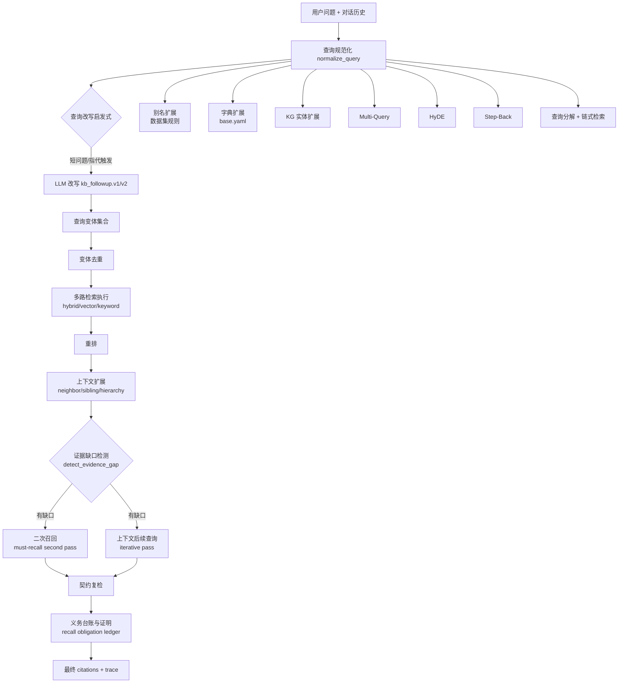
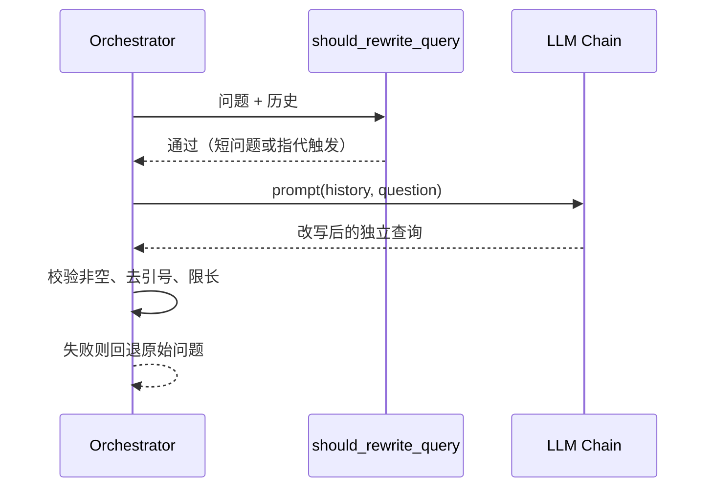
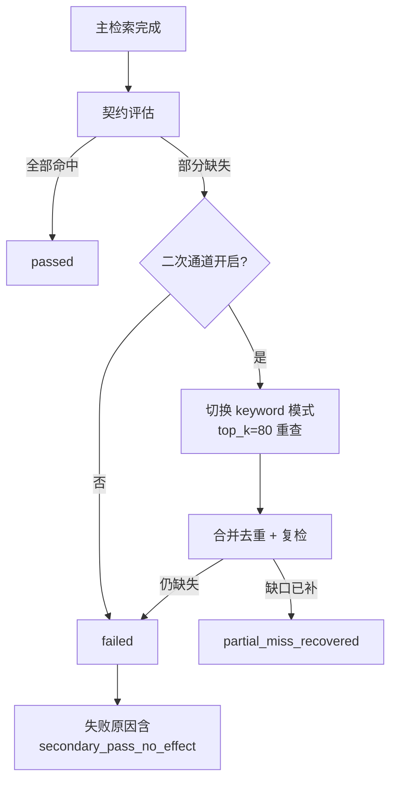
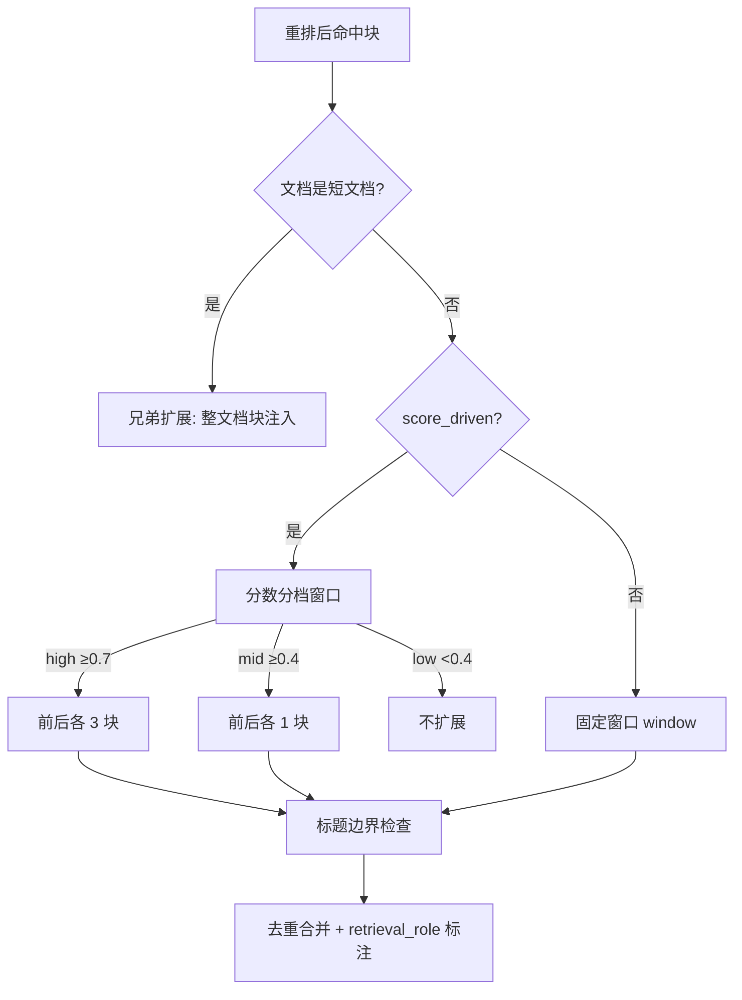

本页深入 MimirQ 检索编排层的完整闭环：从查询改写与变体生成（减少漏召回），到二次召回通道（补齐部分缺失），再到上下文扩展（邻居/兄弟/层级）与证据缺口补全（契约化校验与义务证明）。所有机制以"可控、可审计、有界"为设计前提——不产生组合爆炸、不泄露原始查询、每一步都留下 trace 与 metrics。

## 编排总览：一个查询的三层递进

检索编排的核心入口是 `app/rag/retrieval/orchestrator.py` 中的 `run_retrieval`（4769 行单文件编排器）。整个流水线可抽象为三个递进层次：**改写层**（把原始问题变成一组有界查询变体）、**召回层**（执行多路检索并按契约校验）、**补全层**（对缺口做二次通道、上下文扩展与证据校验）。三层之间共享同一个状态字典 `state`，每层产生的指标与诊断都会写入 `metrics` 与 `retrieval_trace` 供下游观测。

Sources: [orchestrator.py](app/rag/retrieval/orchestrator.py#L602-L680)、[context_expansion.py](app/rag/retrieval/context_expansion.py#L1-L242)

## 查询改写：从"问什么"到"检索什么"

### 对话式查询改写（LLM）

查询改写的目标是解决多轮对话中的指代消解问题——用户说"它""上面提到的"，单独检索必然漏召回。编排器只在满足三个条件时才调用 LLM：`ENABLE_QUERY_REWRITE` 开启、对话历史非空、且 `should_rewrite_query` 启发式通过。`should_rewrite_query` 的规则是：**短问题（≤12 字符）总是改写**（极可能是指代），长问题仅在命中指代触发子串时改写，以此减少不必要的 LLM 调用。

改写策略是**版本化的**：`kb_followup.v1` 与 `kb_followup.v2` 两个模板注册在策略注册表中，v2 额外要求"不得新增事实或假设"。策略 ID 通过 `resolve_query_rewrite_strategy_id` 解析（未知 ID 安全回退到 v1），而 `build_query_rewrite_strategy_spec` 会基于模板内容计算稳定的 `strategy_hash`——即使有人忘记升版本号，模板变更也会体现在哈希中，从而可被评测门禁感知。trace 中只记录低基数的 `strategy_id` 与 `strategy_hash`，**绝不嵌入原始 prompt 文本**（PII 安全）。

改写链使用 `fast` 或 `default` 模型、温度 `QUERY_REWRITE_TEMPERATURE`（默认 0.2），输出长度上限 `QUERY_REWRITE_MAX_CHARS`（默认 120）。任何异常都会回退到原始问题并记录 fallback 日志，保证改写层故障不阻断检索。

Sources: [orchestrator.py](app/rag/retrieval/orchestrator.py#L721-L769)、[query_rewrite_strategy.py](app/rag/core/query_rewrite_strategy.py#L1-L134)、[text.py](app/rag/core/text.py#L480-L493)

### 确定性规范化：查询的"标准形"

在改写之前，所有查询先经过 `app/query/normalize.py` 的 `normalize_query`，它返回规范化文本与**已应用规则清单**（`applied_rules`），使查询规范化本身可审计。规则链共 8 步：NFKC 全半角归一、全角标点到 ASCII 的映射（中文句号→`.`、书名号→引号等）、Windows 路径分隔符→POSIX、数字千分位逗号移除（`1,000`→`1000`）、版本号前缀 `v` 剥离（`v1.2.3`→`1.2.3`）、Unicode 感知的 casefold、单位大小写规范化（`kb/mb/gb/tb` 统一大写）、空白折叠。

Sources: [normalize.py](app/query/normalize.py#L32-L106)

### 确定性变体：别名、字典与 KG 实体

规范化之后是三类**确定性**变体生成，全部遵循"每条生成查询最多应用一条规则"的原则，杜绝笛卡尔积爆炸：

| 变体来源 | 规则载体 | 上限控制 | 去重策略 |
|---|---|---|---|
| 别名扩展 `generate_alias_queries` | 请求/数据集提供的别名字典（如 `单点登录 → SSO`），规则**双向对称**（key↔alias 各成一对） | `max_queries=5`、`max_rules=200`、单查询 400 字符 | ASCII 大小写不敏感、非 ASCII 精确匹配 |
| 字典扩展 `generate_dictionary_expansions` | 内置 `app/query/dictionaries/base.yaml` | 总数 5、每规则最多 1 个变体 | 词边界正则 `(?<![A-Za-z0-9_])`，避免替换标识符子串 |
| KG 实体扩展 | 图谱搜索返回的实体，按 `weight` 排序筛选 | 最多 5 个实体、5 条查询、`min_weight=0.15` | 已出现在原查询中的实体名跳过 |

别名扩展与字典扩展的关键差异在匹配语义：别名扩展对 ASCII 做**子串级**大小写不敏感替换，字典扩展则要求**词边界**匹配（防止 `SSO` 误伤 `SSOAuth` 之类标识符）。KG 实体扩展则走异步 `kg_search`，用线程池桥接协程（`asyncio.run` + `ThreadPoolExecutor`），并对实体类型做排除（`RAG_KG_QUERY_EXPANSION_EXCLUDE_ENTITY_TYPES`，`*` 表示全排除）。

Sources: [query_expansion.py](app/rag/query_expansion.py#L42-L167)、[expand.py](app/query/expand.py#L90-L217)、[orchestrator.py](app/rag/retrieval/orchestrator.py#L1335-L1497)

### LLM 变体：Multi-Query、HyDE 与 Step-Back

三类 LLM 变体共享同一模式：`fast`/`default` 模型 + 专用 prompt + 温度 + 长度上限，异常时静默回退：

- **Multi-Query**（`ENABLE_MULTI_QUERY`）：LLM 生成 `MULTI_QUERY_COUNT`（默认 3，上限 8）个不同角度的子查询，输出需解析为 JSON 数组。
- **HyDE**（`ENABLE_HYDE`）：让 LLM 先写一段假设性回答，再用这段"伪文档"做向量检索（keyword 模式下自动禁用）。输出截断至 `HYDE_MAX_CHARS`。
- **Step-Back**（`ENABLE_STEP_BACK_QUERY`）：生成更抽象的上位问题，帮助召回泛化概念。

所有变体最终汇入 `retrieval_queries` 列表并携带 `kind` 标签（`main`/`alias`/`dict`/`kgq`/`mq`/`hyde`/`step_back`/`subq`/`clause`/`lite_subq`），**按规范化文本去重**（ASCII casefold，非 ASCII 精确）。去重后，除 `main` 和 `hyde` 外的变体查询都以 `enable_reranker=False` 执行——变体通道只负责扩大召回面，重排留给主通道，避免重复计算。

Sources: [orchestrator.py](app/rag/retrieval/orchestrator.py#L1499-L1698)

### 查询分解与链式检索

查询分解（`_decompose_query`）是专门的漏召回补丁：对 60–400 字符的复杂问题，LLM 生成最多 `QUERY_DECOMPOSITION_MAX_SUBQUESTIONS`（默认 3）个子问题。设计上有一个重要细节：**未配置 LLM API Key 时自动使用启发式分解**（`heuristic_decompose_query`），LLM 失败时也回退到启发式，保证无 LLM 环境仍可用。

当 `RAG_DECOMPOSITION_CHAIN_ENABLED` 开启时，子问题不是独立并行检索，而是**链式**执行：第 N 个子问题的查询 = 子问题文本 + 前 3 条发现摘要（`Prior findings:` 块）。`decomposition_chain.py` 中的 `build_chained_query` 将前序检索结果压缩为每步最多 500 字符的"发现"，`summarize_chain_step` 从每条 citation 提取 `source: snippet[:160]`。这使后续子问题能基于前序证据继续深挖，而不是重复检索。链式查询执行时同样禁用重排，且执行后会从 `retrieval_plan` 中移除独立的 `subq` 条目避免重复。

Sources: [orchestrator.py](app/rag/retrieval/orchestrator.py#L445-L557)、[decomposition_chain.py](app/rag/retrieval/decomposition_chain.py#L1-L51)、[orchestrator.py](app/rag/retrieval/orchestrator.py#L1752-L1800)

## 二次召回：契约驱动的补漏通道

### Must-Recall 契约与缺口检测

二次召回不是"多查一次"的蛮力策略，而是**契约驱动**的：调用方（如表格问答、证据门禁）声明 `must_recall_expected_source_keys`（必须命中的来源键，如 `table_id`）与 `must_recall_required_anchor_fields`（citation 必须携带的锚字段，默认 `chunk_id,document_id`）。`RETRIEVAL_CONTRACT_MODE=must_recall_strict` 时契约强制开启。

两个自动推断器降低人工配置成本：`infer_expected_source_keys` 从查询中的**引号词、文件名模式、表名模式**（如 `sales.csv`、`db.table`）以及 metadata filter 中提取预期来源键；`infer_required_anchor_fields` 检测"行/row/主键"意图时追加 `row_source_table` 等字段，检测"sheet/表单"意图时追加 `sheet_name`。推断结果带 `confidence`（多信号源时为 high）与 `reason_codes`，全部写入 trace。

第一次契约评估发生在主检索完成后（`evaluate_required_source_keys` + `evaluate_evidence_anchor_expectations`）。锚字段评估有一个关键过滤：**排除 `hierarchy_` 前缀的 retrieval_role**——层级扩展产生的 citation 不参与锚字段校验，防止纯结构补充的块污染契约结果。若存在缺失（`partial_miss_detected`），触发二次通道。

Sources: [must_recall_auto.py](app/rag/policy/must_recall_auto.py#L53-L134)、[must_recall.py](app/rag/policy/must_recall.py#L1-L155)、[evidence_expectations.py](app/rag/core/evidence_expectations.py#L31-L116)、[orchestrator.py](app/rag/retrieval/orchestrator.py#L3378-L3395)

### 第二次通道：切换模式重查

当部分缺失被检测且 `RETRIEVAL_MUST_RECALL_SECOND_PASS_ENABLED`（默认 true）时，编排器复制当前 retriever 并**切换到契约指定的模式**（默认 `keyword`，因为关键词通道对 `table_id` 等精确标识符最有效），以 `SECOND_PASS_TOP_K`（默认 80）重新执行一次检索，并关闭重排。新增文档按 `_doc_key` 去重合并，然后**重新构建 citations 并复检契约**。

复检结果决定了语义化的状态机：`disabled`（契约未开）→ `passed`（一次通过）→ `partial_miss_recovered`（二次通道补上）→ `failed`（仍缺失）。`build_must_recall_fail_reasons` 额外引入 `secondary_pass_no_effect` 失败原因——二次通道尝试了但没补上缺口，这本身就是一个值得告警的信号。整个过程的前后对比（`before/after_missing_source_keys`、citations 增量）写入 `must_recall_second_pass_diff`，随 proof 一并落 trace。

Sources: [orchestrator.py](app/rag/retrieval/orchestrator.py#L3397-L3540)、[must_recall.py](app/rag/policy/must_recall.py#L102-L155)

### 上下文后续查询：迭代式补漏

`RETRIEVAL_CONTEXTUAL_FOLLOWUP_ENABLED` 提供另一种补漏通道，与 must-recall second pass 是**互补**关系（注释明确"不替代 must-recall strict 语义"）：它是**间隙感知**的迭代控制器，最多 `MAX_HOPS`（默认 1）轮，受 `LATENCY_BUDGET_MS`（默认 500ms）硬约束。

每轮执行：先用当前 docs 构建 citations → `detect_evidence_gap` 检测缺口 → `build_contextual_followup_query` 从**已检索文档的元数据字段**（keywords 权重 1.8、tags 1.6、title 1.4、heading/section 1.3、table_id/source_key 1.2、source 1.0）中提取高频词，叠加缺失 source key 中的词，组装一条有界 follow-up 查询——全程无 LLM 调用、确定性、低方差。中英文 token 用 `_TOKEN_RE` 统一切分（英文字母数字 3–63 字符、中文 2–16 字），配合小规模停用词表。

每轮执行后重新检测缺口，记录 `iterative_pass_hops`（含每轮的 `gap_before`/`gap_after`、query_hash、reason_codes）与 `iterative_pass_reason_codes`（如 `latency_budget_exhausted`、`planner_not_used`）。这与 must-recall second pass 的本质区别：**second pass 是契约失败后的定点补漏（同一查询、换通道）**，**contextual followup 是证据驱动的新查询生成（换查询、迭代逼近）**。

Sources: [contextual_followup.py](app/rag/retrieval/contextual_followup.py#L1-L283)、[orchestrator.py](app/rag/retrieval/orchestrator.py#L3065-L3240)、[evidence_gap.py](app/rag/retrieval/evidence_gap.py#L1-L74)

## 上下文扩展：让孤立的命中块"长出上下文"

### 统一框架：neighbor + sibling

`context_expansion.py` 把三种扩展策略统一在 `expand_ranked_chunk_results` 一个入口下，返回的 meta 包含 `strategy`（`neighbor`/`sibling`/`mixed`）、`added_docs`、`strategies_used` 等字段。它由 `app/rag/retrieval/hybrid/post_process.py` 在检索后处理阶段调用（`_expand_results_with_neighbors`），所需的邻居块通过 `(document_id, chunk_index)` 元组批量查库获取，且**按 pipeline 版本过滤**（`desired_pipeline_by_doc`）——只允许与锚点块同一解析版本的结构补充，防止跨版本串扰。

**邻居扩展**（`neighbor_expand.py`）：以命中块为锚，向 `chunk_index` 前后各取 `window` 个相邻块。两个关键约束：一是**标题边界**——若邻居块与锚点块的 `header_path` 不同则跳过（避免跨章节拼接），二是 `neighbor_of` 元数据标注来源。`score_driven` 模式下窗口按分数分档：`score ≥ high_threshold(0.7)` 用 `high_span(3)`，`≥ mid_threshold(0.4)` 用 `mid_span(1)`，低于中档不扩展——高分命中块更值得展开上下文，低分块则不加戏。

**兄弟扩展**（`sibling_expand.py`）：针对**短文本文档**（`short_doc_ids`，即总块数 ≤ `RAG_CONTEXT_SIBLING_SHORT_DOC_MAX_CHUNKS` 的文档）——这类文档的块往往各自独立成义，一个命中块不足以支撑回答。命中短文档的锚点后，把该文档**全部块**都加入结果（上限 `sibling_max_added`），并标注 `retrieval_role=sibling`。

Sources: [context_expansion.py](app/rag/retrieval/context_expansion.py#L30-L200)、[post_process.py](app/rag/retrieval/hybrid/post_process.py#L600-L701)、[neighbor_expand.py](app/rag/retrieval/neighbor_expand.py#L1-L46)、[sibling_expand.py](app/rag/retrieval/sibling_expand.py#L1-L110)

### 层级扩展：父子链与兄弟链

`hierarchy_expand.py` 处理带层级元数据的文档（`hierarchy_node_key`/`hierarchy_parent_key`/`hierarchy_prev_sibling_key`/`hierarchy_next_sibling_key`）。`expand_hierarchy_context` 采用**按深度逐跳批量拉取**：父链按 hop 逐层推进（每层批量 fetch 所有锚点的父节点，再推进指针），兄弟链按窗口步进，全程只操作 `(document_id, node_key)` 键，**不接触原始查询文本**（PII 安全）。全局上限 `max_added_docs`（默认 120）保护召回面不过度膨胀。

编排器中的调用（`HIERARCHY_RECALL_ENABLED`）带版本感知的 `_fetch_by_key` 回调：直接查 `DocumentChunk` 表，按 `doc_pipeline_key`/`pipeline_hash` 校验与锚点同版本。此外，层级扩展产生的 citation 在锚字段校验中被 `exclude_retrieval_role_prefixes=["hierarchy_"]` 排除——这是刻意的语义设计：层级补充是结构完整性手段，不应被误判为证据缺失。

### rerank-expand-rerank：重排后二次扩展

`app/rag/workflows/rerank_expand_rerank.py` 实现另一种组合模式：第一遍重排 → 对高分候选按分数分档扩展相邻块（复用同一 `expand_reranked_ids_by_score`）→ 对扩展后的候选集合**做第二遍重排**。扩展信息写入 `stats.first_pass_top_ids`/`expanded_candidate_count`/`second_pass=True`，使两遍重排的差异可回溯。该模式与 orchestrator 内联的 context expansion 是互补实现——前者面向候选池级扩展，后者面向文档结构级扩展。

Sources: [hierarchy_expand.py](app/rag/retrieval/hierarchy_expand.py#L1-L394)、[orchestrator.py](app/rag/retrieval/orchestrator.py#L2882-L3038)、[rerank_expand_rerank.py](app/rag/workflows/rerank_expand_rerank.py#L1-L45)

## 证据缺口补全：从"检测"到"证明"

### 缺口检测的语义化编码

`evidence_gap.py` 的 `detect_evidence_gap` 把"证据够不够"编码为可机器判定的三元判断，输出 `mimirq.evidence_gap.v1` schema：

| 缺口类型 | 判定条件 | 严重度 |
|---|---|---|
| `citations_below_min` | citation 总数 < `min_citations` | high |
| `missing_required_source_keys` | 必需来源键缺失（大小写不敏感匹配，从 `table_id`/`row_source_table`/`document_id`/`document_name`/`sheet_name`/`source` 多字段提取） | medium |
| `missing_required_anchor_fields` | 锚字段缺失的 citation 数 > 0（`hierarchy_` 前缀角色跳过） | medium |

`has_gap` 与 `reason_codes` 随后被上下文后续查询消费（`evidence_gap` 参数直接驱动 `build_contextual_followup_query` 的选词），形成"检测→选词→补查→复检"的闭环。

### 义务台账：把"应召回"变成"可证明"

`recall_obligation.py` 提供两层产物。`build_recall_obligation_ledger` 将每个必需来源键与锚字段展开为**逐条义务记录**（`{source_key, status: matched|missing}`、`{field, missing_count}`），并汇总 `required_total`/`matched_total`/`missing_total`/`coverage_ratio`。`build_must_recall_proof` 在其上叠加 `status`（`disabled`/`passed`/`partial_miss_recovered`/`failed`）、`fail_reasons` 与 `second_pass` 明细，形成 `mimirq.must_recall_proof.v1` 不可变证明。这套台账的意义在于：**召回质量不再是模糊的"感觉"，而是每条义务的显式状态机**，可直接接入 CI 门禁与回归套件断言。

Sources: [evidence_gap.py](app/rag/retrieval/evidence_gap.py#L1-L74)、[recall_obligation.py](app/rag/policy/recall_obligation.py#L1-L218)、[orchestrator.py](app/rag/retrieval/orchestrator.py#L3527-L3540)

## 配置速查

以下配置项全部集中在 `app/core/config.py`，均为**默认关闭/保守**（safe-off），开启即改变行为：

| 机制 | 关键开关 | 核心参数（默认值） |
|---|---|---|
| 查询改写 | `ENABLE_QUERY_REWRITE` (False) | `QUERY_REWRITE_STRATEGY=kb_followup.v1`、`TEMPERATURE=0.2`、`MAX_CHARS=120` |
| 变体生成 | `ENABLE_MULTI_QUERY`/`ENABLE_HYDE`/`ENABLE_STEP_BACK_QUERY` (均 False) | `MULTI_QUERY_COUNT=3`（上限 8）、`HYDE_MAX_CHARS` |
| 查询分解 | `ENABLE_QUERY_DECOMPOSITION` (False) | `MAX_SUBQUESTIONS=3`、`MIN_CHARS=60`、`MAX_CHARS=400`、`RAG_DECOMPOSITION_CHAIN_ENABLED` |
| Must-Recall | `RETRIEVAL_CONTRACT_MODE=must_recall_strict` / `RETRIEVAL_MUST_RECALL_DEFAULT_ENABLED` (False) | `REQUIRED_ANCHOR_FIELDS=chunk_id,document_id`、`SECOND_PASS_MODE=keyword`、`SECOND_PASS_TOP_K=80` |
| 上下文后续查询 | `RETRIEVAL_CONTEXTUAL_FOLLOWUP_ENABLED` (False) | `MAX_HOPS=1`、`MAX_TERMS=4`、`LATENCY_BUDGET_MS=500`、`MAX_DOCS=4` |
| 邻居扩展 | `RAG_CONTEXT_NEIGHBOR_WINDOW=0` | `MAX_ADDED=20`、`SCORE_DRIVEN`、`HIGH_THRESHOLD=0.7`、`MID_THRESHOLD=0.4` |
| 兄弟扩展 | `RAG_CONTEXT_SIBLING_EXPAND_ENABLED` (False) | `SHORT_DOC_MAX_CHUNKS=8`、`MAX_ADDED=40` |
| 层级扩展 | `HIERARCHY_RECALL_ENABLED` (False) | `PARENT_DEPTH=0`、`SIBLING_WINDOW=0`、`FAMILY_COLLAPSE=True` |

Sources: [config.py](app/core/config.py#L1185-L1229)、[config.py](app/core/config.py#L1764-L1848)

## 测试与验证锚点

编排层的测试策略覆盖了本页所有机制的关键路径：`tests/test_retrieval_secondary_pass.py` 验证 `partial_miss_recovered` 状态机（vector 主通道漏 `inventory`、keyword 二次通道补上）与 contextual followup 的 hop 诊断；`tests/test_context_expansion_framework.py` 验证 neighbor/sibling 统一框架的混合策略、分数分档窗口（`c19`/`c21` 被正确排除）与层级扩展贯通；`tests/test_query_decomposition_chain.py` 验证链式查询的 `Prior findings` 拼接、LLM 输出的解析去重截断（500 字符截断 + 重复项消除）与指标标记。这些测试共同构成了"改写不失控、补漏可证明、扩展有边界"的行为契约。

Sources: [test_retrieval_secondary_pass.py](tests/test_retrieval_secondary_pass.py#L35-L172)、[test_context_expansion_framework.py](tests/test_context_expansion_framework.py#L20-L219)、[test_query_decomposition_chain.py](tests/test_query_decomposition_chain.py#L13-L161)

## 下一步阅读

检索编排层是混合检索与重排体系的直接消费者，也是知识图谱检索的调用方。建议按以下顺序深入：

- 本页的变体生成与融合结果如何被消化，参见 [混合检索与融合策略：向量、稀疏检索与 RRF 融合](16-hun-he-jian-suo-yu-rong-he-ce-lue-xiang-liang-xi-shu-jian-suo-yu-rrf-rong-he)
- 扩展后的候选如何被精排，参见 [重排器体系：Cross-Encoder、ColBERT、LTR、MMR 与混合重排](17-zhong-pai-qi-ti-xi-cross-encoder-colbert-ltr-mmr-yu-hun-he-zhong-pai)
- KG 实体扩展与图谱搜索的底层实现，参见 [知识图谱：实体抽取、关系处理、图谱搜索与溯源](19-zhi-shi-tu-pu-shi-ti-chou-qu-guan-xi-chu-li-tu-pu-sou-suo-yu-su-yuan)
- 证据缺口与 must-recall proof 如何进入评测与回归门禁，参见 [回归套件与证据管理：回归运行、消融实验与证据胶囊](25-hui-gui-tao-jian-yu-zheng-ju-guan-li-hui-gui-yun-xing-xiao-rong-shi-yan-yu-zheng-ju-xiao-nang)