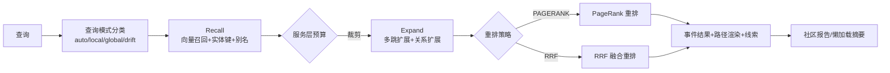

本页深入解析 MimirQ 知识图谱（KG）子系统的完整链路：从文档切块中抽取**事件—实体—关系**三元结构，经过谓词本体治理与实体消歧，到面向查询的**召回—扩展—重排**三段式图谱搜索，最终将可溯源的图谱证据注入 RAG 上下文。整个模块以 `app/rag/kg/` 为内核，通过 `KGEngine` 门面（facade）对外提供 `extract` 与 `search` 两个异步入口，并由 `KG_ENABLED` 环境变量整体开关控制（[pipeline.py](app/rag/kg/pipeline.py#L133-L147)）。

## 数据模型：事件—实体—关系三层结构

KG 的存储模型遵循 **Event（事件）→ Entity（实体）→ Relation（关系）** 的三层抽象，与文档切块一一锚定，这是全链路溯源能力的根基。核心表定义在 [models.py](app/rag/kg/models.py#L29-L273)：

| 表 | 职责 | 关键字段 |
|---|---|---|
| `kg_entities` | 实体节点 | `name`、`type`、`normalized_name`、`vector`（JSON 浮点数组） |
| `kg_source_events` | 事件节点（从切块抽取的语义单元） | `title`、`summary`、`content`、`content_vector`、`document_id`、`chunk_id`、`references` |
| `kg_event_entities` | 事件↔实体关联（带权重与角色） | `weight`（Numeric(5,2)）、`role` |
| `kg_relations` | 实体→实体有向边（三元组） | `predicate`、`predicate_raw`、`confidence`、`subject_entity_id`、`object_entity_id`、`event_id` |
| `kg_entity_aliases` | 人工治理的实体别名（消歧） | `alias`、`normalized_alias`、`canonical_entity_id` |
| `kg_entity_resolution_actions` | 合并/拆分操作的**追加式审计日志** | `action_type`（merge/split/undo）、`status` |
| `kg_entity_redirects` | 合并后旧 ID → 新 ID 的稳定映射 | `from_entity_id`、`to_entity_id` |
| `kg_predicate_ontology` | DB 治理的谓词白名单 | `predicate`、`is_enabled`、`display_name` |

两个设计要点值得注意：其一，`KgSourceEvent` 与 `KgRelation` 均携带 `pipeline_hash` 字段（[models.py](app/rag/kg/models.py#L60-L61)），用于按流水线版本隔离图谱数据——当文档的 `active_pipeline_hash` 变化时，旧版本抽取的边不会污染新检索；其二，`KgRelation` 直接外键引用 `event_id`（`ondelete="SET NULL"`），意味着每条三元组都保留了"从哪个事件来的"证据锚点，这是溯源链的存储基础（[models.py](app/rag/kg/models.py#L126-L131)）。

## 实体抽取：多后端路由与幻觉抑制

### 抽取后端选择

抽取层支持四种后端，由 `KG_EXTRACTION_BACKEND` 或请求级 `extraction_backend` 参数路由（[backend_router.py](app/rag/kg/extraction/backend_router.py#L10-L60)）：

- **llm**（默认）：`EventProcessor` 调用 LLM 按 JSON Schema 抽取事件与实体；
- **heuristic**：无 LLM 的规则抽取器，基于标题短语、CJK 术语、表格/列表结构识别候选实体（[heuristic_extractor.py](app/rag/kg/extraction/heuristic_extractor.py#L13-L37)）；
- **gliner**：GLiNER 零样本 NER 模型，需 `KG_GLINER_ENABLED=true` 且依赖可用；
- **hybrid**：GLiNER 先行、LLM 后审的混合模式。

路由逻辑包含**降级链**：请求 gliner 但未启用/缺依赖时自动回退 llm 并记录 `fallback_reason`；长文档（`KG_EXTRACT_LONG_DOC_MIN_CHUNKS=300`）自动切换到 heuristic 以控制成本（[extractor.py](app/rag/kg/extraction/extractor.py#L550-L573)）。

### 抽取编排

`EventExtractor.extract()` 是编排核心（[extractor.py](app/rag/kg/extraction/extractor.py#L353-L759)），其流程为：

1. **切块预算**：按文档应用 `KG_EXTRACT_MAX_CHUNKS_PER_DOCUMENT` 上限，`head`（取前 N）或 `uniform`（均匀采样）策略，防止长文档垄断抽取（[extractor.py](app/rag/kg/extraction/extractor.py#L118-L172)）；
2. **增量跳过**：`replace_existing` + `skip_unchanged` 时，对内容哈希（SHA-256）与提示词选择器均未变的切块复用既有事件（[extractor.py](app/rag/kg/extraction/extractor.py#L668-L697)）；
3. **并发抽取**：`asyncio.Semaphore` 限流（默认 3 并发），支持每切块超时与重试退避（[extractor.py](app/rag/kg/extraction/extractor.py#L578-L598)）；
4. **上下文窗口**：`KG_EXTRACT_CONTEXT_WINDOW_CHUNKS` 将邻近切块作为 `[Context N]` 前缀注入，帮助跨块实体识别（[processor.py](app/rag/kg/extraction/processor.py#L39-L52)）。

LLM 抽取的 JSON Schema 强制要求 `evidence_quote`——每个实体必须附带原文逐字摘录，LLM 被明确要求"verbatim, no paraphrase"，这是后续确定性证据校验的输入（[processor.py](app/rag/kg/extraction/processor.py#L113-L125)）。

### 实体验证与消歧

抽取完成后可选的 `EntityVerifier` 二次 LLM 通道负责去噪与纠偏：对候选实体做**保留/修正**决策，并输出候选间的 `alias_of` 边建议，全部输出由调用方的确定性证据检查把关（[entity_verifier.py](app/rag/kg/extraction/entity_verifier.py#L1-L130)）。

实体碎片化治理的另一条路径是**别名启发式**（[alias.py](app/rag/kg/extraction/alias.py#L1-L120)）：通过三类保守模式——括号缩写 `Retrieval-Augmented Generation (RAG)`、中文"简称/又称/以下简称"、英文 "aka/also known as"——检测显式别名定义，生成规范化表面形式（剥离尾部括号缩写）与 `alias_of` 边。模块刻意"重精确轻召回"，仅在显式模式上触发，避免误合并。

## 关系处理：谓词本体治理与受约束生成

关系抽取的核心矛盾是 **LLM 自由输出 vs 图谱本体紧凑性**。`RelationProcessor` 的解法是"受约束生成"：先抽取候选实体，再要求 LLM **只能在候选实体集合内**选择主宾语，从根本上压缩幻觉空间（[relation_processor.py](app/rag/kg/extraction/relation_processor.py#L1-L8)）。

谓词治理分两层：

**第一层——归一化**。`normalize_predicate()` 将任意文本规约为 snake_case 键（`"Works With"` → `works_with`），再通过同义词映射表收敛到 21 个 canonical 谓词（`works at`/`employed_by` → `works_for`，`abbreviation_of` → `alias_of`），未映射的落为 `unknown`（[relation_processor.py](app/rag/kg/extraction/relation_processor.py#L24-L90)）。同义词映射是**确定性、零额外 LLM 调用**的，兼顾召回与本体漂移控制。

**第二层——DB 本体**。`KgPredicateOntology` 提供租户级谓词治理：优先采用 DB 中启用的谓词，其次 `KG_RELATION_ALLOWED_PREDICATES` 覆盖，最后回退内置默认表（[ontology.py](app/rag/kg/ontology.py#L48-L76)）。该表可经前端管理界面编辑，实现"UI 可治理、抽取可审计"。

关系质量的量化信号由 [kg_denoiser.py](app/rag/kg/quality/kg_denoiser.py#L18-L95) 提供：统计低置信度（`confidence < 0.30`）、缺失 `references`、缺失 `chunk_id` 的关系数量，作为诊断面板与后续 LLM 三元组反思的前置基线。

## 图谱搜索：召回—扩展—重排三段式

### 查询模式路由

搜索的第一道分诊是**查询模式分类**（auto/local/global/drift），由中英文正则信号驱动：`drift|变化|趋势|同比` → drift；`overall|global|总体|汇总` → global；`which row|主键|这一条` → local（[query_mode.py](app/rag/kg/search/query_mode.py#L11-L31)）。模式决定预算与策略——local 模式收紧事件上限并提高实体权重阈值（`_apply_local_budget`），global 低置信度回退则压缩到 80 事件以内（[query_mode.py](app/rag/kg/search/query_mode.py#L82-L120)）。

方法级路由 `route_kg_search_method` 进一步结合查询复杂度分类器：drift → `drift_search`；structured → `pprank`（个性化 PageRank）；multi_hop → `hybrid`（[method_router.py](app/rag/kg/search/method_router.py#L8-L35)）。

### 三段式管线

`KGSearcher.search()` 组织完整的 **recall → expand → rerank** 管线，并记录每阶段耗时与 SLO 达标情况（[searcher.py](app/rag/kg/search/searcher.py#L167-L349)）：

**召回阶段**：`RecallSearcher` 完成查询向量化 → 实体键匹配（含别名感知）→ 事件检索 → 权重计算，并应用**服务层预算**（`apply_serving_layer_budget`）：按每切块/每文档的事件数上限与分数下限裁剪候选，防止单个长文档主导延迟；drift 模式与全局模式绕过裁剪（[recall.py](app/rag/kg/search/recall.py#L56-L132)）。

**扩展阶段**：`ExpandSearcher` 从种子实体出发做多跳扩展，每跳把 `kg_path` 路径与 hop 数记入 `event_hops`；关系驱动的扩展按谓词先验加权——`alias_of`/`same_as` 权重最高（1.2），`unknown` 谓词直接屏蔽（乘数 0.0），因果类谓词反向权重被压低以防查询漂移（[relation_scoring.py](app/rag/kg/search/relation_scoring.py#L32-L93)）。扩展有硬预算：`KG_SEARCH_MAX_RERANK_CANDIDATES` 上限与 `KG_SEARCH_EXPAND_BUDGET_SEC` 时间预算（[expand.py](app/rag/kg/search/expand.py#L92-L130)）。

**重排阶段**：两种策略——`PAGERANK`（默认）与 `RRF`。RRF 将召回排序与查询余弦相似度排序做倒数排名融合，并叠加短语命中提升（[rrf.py](app/rag/kg/search/ranking/rrf.py#L71-L94)）；local factoid 查询强制切到 RRF 以保精度（[searcher.py](app/rag/kg/search/searcher.py#L86-L90)）。

### 高级搜索算法

- **个性化 PageRank**：`rank_personalized_graph` 以种子实体权重做个性化向量，幂迭代求解后与种子权重 0.7/0.3 混合排序（[pprank.py](app/rag/kg/search/pprank.py#L94-L126)）；
- **Agentic Beam Search**：对种子实体做宽度优先的束搜索路径枚举，受 LLM 调用次数与时间双预算约束（[agentic_beam_search.py](app/rag/kg/search/agentic_beam_search.py#L114-L142)）；
- **漂移搜索**：将查询 token 与社区报告摘要做交集打分，选取最相关社区并展开其实体/事件集合（[drift_search.py](app/rag/kg/search/drift_search.py#L49-L69)）；
- **社区检测**：在**召回子图**上构建实体共现边（非全图），产出多层社区报告与全局总览，特性开关默认关闭以保延迟（[community.py](app/rag/kg/community.py#L1-L140)）；
- **图嵌入**：`WalkHash` 采用确定性 DeepWalk 风格随机游走 + 带符号特征哈希（signed feature hashing），无需 networkx/gensim，CI 可复现，作为向量召回不可用时的结构信号（[graph_embeddings.py](app/rag/kg/search/graph_embeddings.py#L1-L100)）。

### 缓存与版本一致性

KG 搜索缓存默认关闭、显式开启，缓存键以哈希形式绑定（tenant, account, scope, query, config）且**不含明文查询**；关键的是缓存键融合了 `pipeline_fingerprint`——对文档作用域取 `active_pipeline_hash`（回退 `pipeline_hash`）的稳定摘要，任何文档切换流水线版本都会使缓存失效（[pipeline.py](app/rag/kg/pipeline.py#L28-L81)、[cache.py](app/rag/kg/search/cache.py#L32-L70)）。

## 溯源：证据链、路径渲染与版本快照

### 三层溯源锚点

图谱数据的溯源是**多级嵌套**的：三元组 `KgRelation` → 事件 `KgSourceEvent` → 切块/文档。`build_event_entity_provenance` 生成白名单制（allowlist-only）的 JSON 溯源对象，只允许 `document_id`、`chunk_id`、`chunk_index`、`page`、`start_char`、`end_char`、`content_hash` 等受控键，杜绝嵌套内容泄露（[provenance.py](app/rag/kg/provenance.py#L65-L101)）。

### 路径渲染与安全投影

搜索结果的每个事件可附加 `kg_path` 路径渲染——按实体 ID 去重、至多 6 跳、附带名称与类型，并可将匹配社区报告的摘要注入路径上下文（[path_verbalizer.py](app/rag/kg/search/path_verbalizer.py#L93-L100)）。面向引用注入的 `build_kg_path_provenance` 则更严格：**不含名称与描述**（防文档原文泄露），按 (type, entity_id) 确定性排序，限量输出（[provenance.py](app/rag/kg/provenance.py#L104-L160)）。

### 快照与差异审计

KG 快照以 `mimirq.kg_snapshot.v2` 模式导出/导入，每个明细记录用 SHA-256 内容寻址（`props_hash`），diff 逻辑纯函数化、可单测：节点/边的新增、删除、变更均以 props_hash 对比判定，抽样上限 200 条（[snapshot.py](app/rag/kg/snapshot.py#L14-L120)）。这支撑了"流水线版本 A vs B 图谱变化"的回归审计场景，对应 API 的 `/snapshots/diff` 与 `/snapshots/compare` 端点（[routes.py](app/rag/kg/api/routes.py#L1050-L1113)）。

### 实体治理的可逆性

实体合并/拆分操作写入**追加式审计日志** `KgEntityResolutionAction`（merge/split/undo，状态 applied/reverted），并同步维护 `KgEntityRedirect` 映射表保证合并后旧 ID 的 URL 稳定（[models.py](app/rag/kg/models.py#L194-L248)）。合并入口见 [routes.py](app/rag/kg/api/routes.py#L1980-L1981)。

## 前端可视化与运维面

前端图谱视图基于 react-force-graph 2D/3D 渲染，边按类型着色：`entity_relation`（蓝）、`event_entity`（紫）、`entity_entity`（青）（[graph-viewer.tsx](web/components/graph/graph-viewer.tsx#L18-L22)）。类型定义覆盖图谱投影、实体详情、邻居统计与手动导入（[knowledge-graph.ts](web/types/knowledge-graph.ts#L27-L120)）。API 面提供 `/graph`（投影）、`/graph/expand`（展开）、`/graph/search`（节点搜索）、`/graph/export`（GraphML 导出）等端点（[routes.py](app/rag/kg/api/routes.py#L275-L540)）。

## 关键配置一览

核心开关与调优参数集中在 [config.py](app/core/config.py#L2120-L2235)：

| 配置 | 默认 | 作用 |
|---|---|---|
| `KG_ENABLED` / `KG_CHAT_ENABLED` | false | 总开关与对话侧开关 |
| `KG_RELATION_ENABLED` | false | 三元组抽取开关 |
| `KG_EXTRACTION_BACKEND` | llm | 抽取后端（llm/gliner/hybrid/heuristic） |
| `KG_GLINER_ENABLED` | false | GLiNER 零样本抽取 |
| `KG_EXTRACT_MAX_CHUNKS_PER_DOCUMENT` | 120 | 每文档切块预算（head/uniform） |
| `KG_EXTRACT_ENTITY_VERIFY_ENABLED` | false | 实体二次验证通道 |
| `KG_EXTRACT_RELATION_VERIFY_ENABLED` | false | 关系二次验证通道 |
| `KG_SEARCH_GRAPH_EMBEDDINGS_ENABLED` | false | WalkHash 图嵌入召回 |
| `KG_COMMUNITY_ENABLED` | false | 社区检测与全局搜索 |

## 阅读路径

本页是检索与知识图谱章节的核心。建议按以下顺序延伸：

- 图谱检索结果如何融入对话上下文与引用证据：`[RAG 对话引擎：引用生成、声明证据映射与忠实度评分](20-rag-dui-hua-yin-qing-yin-yong-sheng-cheng-sheng-ming-zheng-ju-ying-she-yu-zhong-shi-du-ping-fen)`
- 混合检索与融合策略（KG 之外的向量/稀疏路径）：`[混合检索与融合策略：向量、稀疏检索与 RRF 融合](16-hun-he-jian-suo-yu-rong-he-ce-lue-xiang-liang-xi-shu-jian-suo-yu-rrf-rong-he)`
- 图谱可视化与知识工作台的用户侧体验：`[知识工作台与图谱可视化：检索面板、向量星云与关系图](27-zhi-shi-gong-zuo-tai-yu-tu-pu-ke-shi-hua-jian-suo-mian-ban-xiang-liang-xing-yun-yu-guan-xi-tu)`
- 图谱数据模型对应的迁移版本演进：`[数据模型与 Alembic 迁移体系：26 个迁移版本与基线演进](9-shu-ju-mo-xing-yu-alembic-qian-yi-ti-xi-26-ge-qian-yi-ban-ben-yu-ji-xian-yan-jin)`