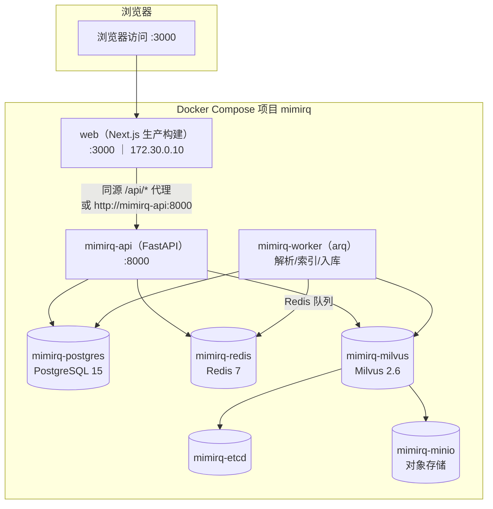
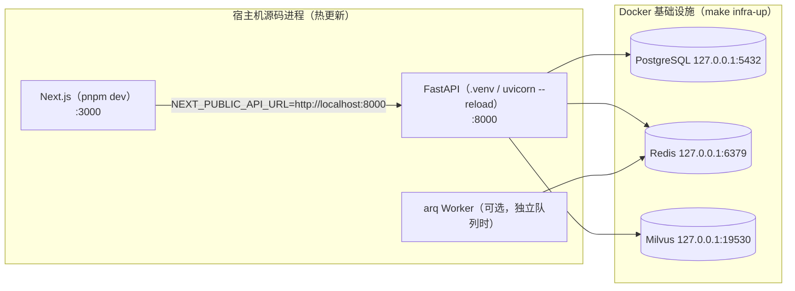
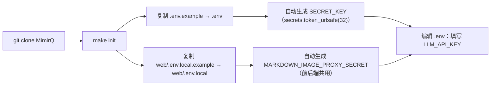
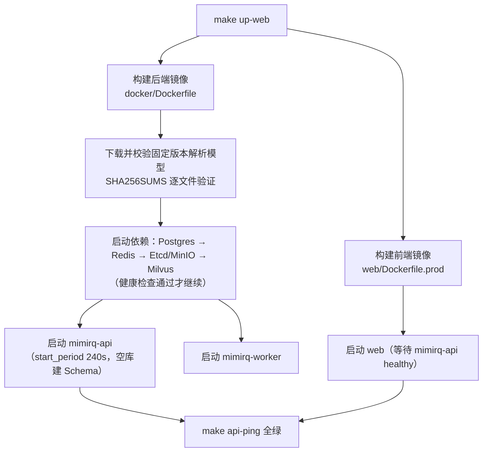
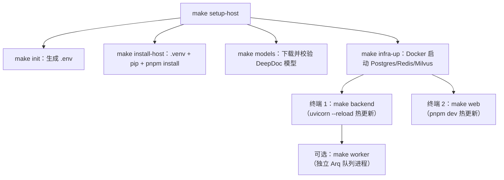

本页是 MimirQ 的**第一条上手路径**：无论你是想"5 分钟内跑起一个完整 RAG 知识库"，还是打算"在本地源码里改代码并热更新调试"，都能在这里找到对应的启动方式、配置要点与验证方法。页面只覆盖"如何启动与运行"，模型服务如何接入、解析器如何按需扩展、Makefile 背后的质量门禁，分别属于后续页面的范畴，文中会给出交叉链接。

MimirQ 提供两条并列的启动主线：**Docker 一键启动**（推荐首次体验与服务器部署，前端、API、Worker 与全部依赖服务都运行在容器中）与**源码开发模式**（FastAPI 跑在 Python `.venv` 中、Next.js 由 pnpm 启动，Docker 只负责 PostgreSQL、Redis、Milvus 等基础设施）。两条主线共用同一个 `.env` 配置体系与同一套 `make` 命令入口，切换成本很低。仓库 README 的前置要求、两种方式的适用场景对比与初始化命令，构成了本页的事实基础（Sources: [README.md](README.md#L114-L155)）。

## 架构总览：一套配置，两种运行拓扑

在动手之前，先建立整体认知。MimirQ 的后端是 FastAPI 应用（入口 `app/main.py`），依赖 PostgreSQL 15（业务数据）、Redis 7（任务队列/缓存/幂等锁）、Milvus 2.6 + Etcd + MinIO（向量检索三件套），后台文档解析与索引由 Arq Worker 消费 Redis 队列执行；前端是 Next.js 应用。Docker 一键启动模式下，这些服务由 `docker/docker-compose.yml` 编排为一个名为 `mimirq` 的 Compose 项目，前端通过 `docker-compose.web.yml` 叠加（Sources: [docker/docker-compose.yml](docker/docker-compose.yml#L165-L227)、[docker/docker-compose.web.yml](docker/docker-compose.web.yml#L10-L47)）。



容器之间通过强制覆盖的环境变量互联：`DATABASE_URL` 指向 `mimirq-postgres:5432`、`MILVUS_HOST` 指向 `mimirq-milvus`、`REDIS_URL` 指向 `mimirq-redis`，不依赖宿主机 `.env` 里的 `localhost` 默认值，这是容器拓扑稳定运行的关键设计（Sources: [docker/docker-compose.yml](docker/docker-compose.yml#L10-L50)）。

源码开发模式则是另一种拓扑：FastAPI 与 Next.js 直接跑在宿主机进程里（热更新），只有基础设施在 Docker 中。`docker-compose.infra.yml` 与主 Compose 的关键差异是**把基础设施端口暴露到宿主机回环地址**（如 `127.0.0.1:5432`、`127.0.0.1:19530`），供宿主机上的 Python 进程直连（Sources: [docker/docker-compose.infra.yml](docker/docker-compose.infra.yml#L1-L36)、[docker/docker-compose.infra.yml](docker/docker-compose.infra.yml#L52-L102)）。



两条主线共用同一套 `.env` 配置与同一批 `make` 目标，`make init` 会为两者准备环境文件——这也是"一套配置、两种拓扑"的根基（Sources: [scripts/init_env.py](scripts/init_env.py#L35-L67)）。

## 前置准备

开始前确认环境满足以下最低要求。Docker 一键启动对宿主机的门槛最低：只需 Docker 与 Compose 插件，外加一个用于生成配置的 Python 3.9+；源码开发模式则要求完整的前端工具链（Sources: [README.md](README.md#L114-L124)）。

| 依赖 | Docker 一键启动 | 源码开发模式 | 说明 |
|:---|:---:|:---:|:---|
| Docker 20.10+ / Compose 2.0+ | 必填 | 仅基础设施 | 所有 Compose 编排均基于 Compose v2 |
| GNU Make | 必填 | 必填 | 统一入口 `make <target>` |
| Python 3.9+ | 仅生成配置 | — | `make init` 调用 `scripts/init_env.py` |
| Python 3.11+ | — | 必填 | 源码含 `match/case` 语法与依赖约束 |
| Node.js 20+ / pnpm 10.26 | — | 必填 | 前端 `pnpm dev` 需要 |
| 硬件 | 4 核 / 16 GB / 50 GB | 同左 | lite 模式可低至 2 核 / 4 GB |

> 若只想快速试跑且机器内存有限，可优先使用 `make up-lite`（Chroma/FAISS 替代 Milvus、免 MinIO），最低可在 2 vCPU / 4 GB RAM 运行，但索引与查询会明显变慢（Sources: [docs/quickstart.md](docs/quickstart.md#L118-L122)）。

## 第一步：初始化配置（make init）

克隆仓库后，第一步永远是执行 `make init`。它调用 `scripts/init_env.py`，以**非破坏性**方式创建两份本地环境文件：从 `.env.example` 复制为根目录 `.env`，从 `web/.env.local.example` 复制为 `web/.env.local`——已存在的文件不会被覆盖，重复执行是安全的（Sources: [Makefile](Makefile#L177-L178)、[scripts/init_env.py](scripts/init_env.py#L35-L67)）。



`init_env.py` 还会在 `SECRET_KEY` 为空时自动填入 32 字节随机值（`secrets.token_urlsafe(32)`），并为前端图片代理在 `.env` 与 `web/.env.local` 中同步生成 `MARKDOWN_IMAGE_PROXY_SECRET`——这两个密钥是启动安全基线的一部分，无需手工编写（Sources: [scripts/init_env.py](scripts/init_env.py#L74-L95)）。

`.env` 是高级配置参考，不需要逐项填写。快速开始一个**真实知识库闭环**时，最少只需要确认 `LLM_API_KEY` 一项；默认配置已指向硅基流动的 `Qwen/Qwen3-32B`（LLM）与 `BAAI/bge-m3`（Embedding），Embedding 与 Reranker 的 Key/Base 留空时会自动复用 LLM 的（Sources: [.env.example](.env.example#L1-L11)、[.env.example](.env.example#L465-L471)、[.env.example](.env.example#L538-L547)）。

| 变量 | 必填 | 默认值 | 说明 |
|:---|:---:|:---|:---|
| `LLM_API_KEY` | 是 | 空 | 默认对话与基础抽取凭证 |
| `LLM_API_BASE` | 否 | `https://api.siliconflow.cn/v1` | OpenAI 兼容端点 |
| `LLM_MODEL` | 否 | `Qwen/Qwen3-32B` | 默认主模型 |
| `EMBEDDING_*` | 否 | 复用 `LLM_*` | 独立 Embedding 服务时分别填写 |
| `ENABLE_RERANKER` | 否 | `false` | 默认关闭，避免额外时延 |
| `INITIAL_ADMIN_EMAIL` / `USERNAME` / `PASSWORD` | 否 | 空 | 首次启动自动创建第一个 `owner` 管理员 |

若希望首次进入系统时**自动拥有第一个本地管理员**，可额外配置 `INITIAL_ADMIN_EMAIL`、`INITIAL_ADMIN_USERNAME` 与 `INITIAL_ADMIN_PASSWORD`（生产环境推荐改用 `INITIAL_ADMIN_PASSWORD_FILE` 指向 Docker secret 文件，与明文密码二选一）。未配置时，首次访问页面需要先手动注册第一个本地账户（Sources: [.env.example](.env.example#L240-L248)、[docs/quickstart.md](docs/quickstart.md#L22-L43)）。

模型服务接入的完整规则——Docker 与宿主机地址差异、独立 Embedding/Reranker、首次管理员初始化——详见 [环境变量与模型服务接入：LLM、Embedding、Reranker 配置](3-huan-jing-bian-liang-yu-mo-xing-fu-wu-jie-ru-llm-embedding-reranker-pei-zhi)。

## 方式一：Docker 一键启动（推荐）

Docker 一键启动是整个仓库"零环境依赖"的入口。从仓库根目录执行：

```bash
make init        # 首次：生成 .env 与 web/.env.local（可重复执行）
make up-web      # 构建镜像并后台启动：基础设施 + API + Worker + Web
make api-ping    # 快速验证后端健康端点
```

`make up-web` 会先执行 `init`，再以 `docker-compose.yml + docker-compose.web.yml` 组合启动完整 Web 栈——注意它**不是"只起前端"**，而是完整栈（Sources: [Makefile](Makefile#L197-L198)、[docs/quickstart.md](docs/quickstart.md#L39-L43)）。启动完成后打开 [http://localhost:3000](http://localhost:3000)；若未配置 `INITIAL_ADMIN_*`，先在页面中创建第一个本地账户（Sources: [README.md](README.md#L146-L155)）。



首次构建有几个值得注意的行为：后端镜像会在**构建阶段**下载并逐文件校验固定版本的 DeepDoc 解析模型（通过 `SHA256SUMS` 清单比对），运行期保持离线；空数据库首次启动时 API 需要数分钟创建初始 Schema，因此 Compose 为 API 设置了 240 秒的 `start_period` 健康检查宽限期（Sources: [docker/Dockerfile](docker/Dockerfile#L92-L108)、[docker/docker-compose.yml](docker/docker-compose.yml#L171-L180)）。如果宿主机代理只监听 Linux 回环地址，先在本机 Docker 配置代理，再运行 `DOCKER_BUILD_NETWORK=host make up-web`（Sources: [docs/quickstart.md](docs/quickstart.md#L45)）。

### 四种 Docker 启动模式对照

同一套 Compose 体系下，按资源与目标提供四种启动模式，均由 `make` 目标封装：

| 模式 | 命令 | 包含服务 | 适用场景 |
|:---|:---|:---|:---|
| 标准后端栈 | `make up` | Postgres + Redis + Etcd + MinIO + Milvus + API + Worker | 仅需 API 与依赖，不启动前端 |
| 完整 Web 栈 | `make up-web` | 标准栈 + Next.js 前端 | **推荐首次启动** |
| 轻量模式 | `make up-lite` | Postgres + Redis + API + Worker（Chroma/FAISS 替代 Milvus，免 MinIO） | 笔记本 / 小内存 / 快速试跑 |
| 检索实验模式 | `make up-retrieval-dev` | Postgres + Redis + API（默认 `LLM_MOCK_ENABLED=true`、确定性 Embedding） | 召回/排序离线对比，无外部模型依赖 |

标准栈的 `docker-compose.yml` 遵循**生产基线**：不暴露 Postgres/Milvus/Redis/MinIO 端口，仅暴露后端 `8000`；数据落在六个命名卷中（`postgres_data`、`etcd_data`、`minio_data`、`milvus_data`、`upload_data`、共享的 `mineru_cache` 模型缓存），并通过 `mimirq-proxy` 网络将 Web 固定在 `172.30.0.10`（Sources: [docker/docker-compose.yml](docker/docker-compose.yml#L229-L250)）。

轻量模式通过 `VECTOR_BACKEND=chroma`、`MINIO_ENABLED=false` 等环境覆盖实现降级，Chroma 持久化路径挂在 `vector_data` 卷上；它保留 Redis 幂等与分布式检索准入能力，但定位是**单机快速体验**，不构成多节点基线（Sources: [docker/docker-compose.lite.yml](docker/docker-compose.lite.yml#L22-L47)、[docker/docker-compose.lite.yml](docker/docker-compose.lite.yml#L77-L134)）。

检索实验模式专为"最小 retrieval 闭环"设计：默认开启 `LLM_MOCK_ENABLED=true` 与 `EMBEDDING_PROVIDER=deterministic_test`，关闭查询改写/多查询/HyDE 等扩展能力，并固定 `SECRET_KEY`，使实验在无外部 API 密钥的情况下可复现。冷启动首次构建约 3-8 分钟，镜像缓存后 20-60 秒即可达到 `api-ping` 全绿（Sources: [docker/docker-compose.retrieval-dev.yml](docker/docker-compose.retrieval-dev.yml#L20-L48)、[docs/quickstart.md](docs/quickstart.md#L118-L122)）。

### 健康检查与启动依赖

Compose 全程使用健康检查串联启动顺序，而不是盲等：Postgres 以 `pg_isready` 探活，Redis 以 `redis-cli ping` 探活，Milvus 依赖 Etcd/MinIO 健康后再探 `9091/healthz`（首次启动给了 90 秒宽限），API 只有在前三者全部 healthy 后才启动，并自探 `/api/v1/health/ready`；Worker 以 `arq --check` 探活。任何一环失败都会阻止下游启动（Sources: [docker/docker-compose.yml](docker/docker-compose.yml#L60-L103)、[docker/docker-compose.yml](docker/docker-compose.yml#L105-L163)、[docker/docker-compose.yml](docker/docker-compose.yml#L202-L227)）。

后端容器的启动命令是 `docker/start_backend.sh`，它用环境变量 `HOST`/`PORT`/`UVICORN_WORKERS`/`FORWARDED_ALLOW_IPS` 参数化调用 `uvicorn app.main:app`；生产多 Worker 场景下 `UVICORN_WORKERS` 默认 1，大于 1 时必须启用 Redis 分布式限流（Sources: [docker/start_backend.sh](docker/start_backend.sh#L1-L19)、[.env.example](.env.example#L89-L91)）。

## 方式二：源码开发模式（Python venv + pip + pnpm）

如果你要修改后端或前端代码、享受热更新调试，使用源码开发模式。它不需要 Conda：FastAPI 运行在项目 `.venv` 中，Next.js 由 pnpm 启动，Docker 只运行基础设施。一条命令完成全部准备：

```bash
make setup-host
```

`make setup-host` 等价于 `init` + `install-host` + `models` + `infra-up`：创建 `.venv` 并安装 `requirements.txt`（pip 额外走 PyTorch CPU 索引）、在 `web/` 执行 `pnpm install`、下载并校验 DeepDoc 模型包、最后以 `docker-compose.infra.yml` 启动基础设施（Sources: [Makefile](Makefile#L180-L192)、[Makefile](Makefile#L246-L247)）。



默认配置下 `TASK_QUEUE_ENABLED=false`，后台文档任务由 **API 进程内有界处理**（`API_DOCUMENT_BACKGROUND_MAX_CONCURRENCY=2`），因此只需两个终端即可完成全栈开发（Sources: [.env.example](.env.example#L65-L68)、[Makefile](Makefile#L318-L330)）：

```bash
# 终端 1：FastAPI（热更新）
make backend

# 终端 2：Next.js（热更新）
make web
```

`make backend` 通过 `uvicorn app.main:app --reload` 启动，监视 `app/` 与 `scripts/` 目录；若宿主机文件监听额度较低且 `uploads/` 较大，改用 `make backend-no-reload` 关闭文件监听（Sources: [Makefile](Makefile#L318-L322)、[main.py](main.py#L18-L27)）。需要独立队列时，在 `.env` 设置 `TASK_QUEUE_ENABLED=true` 并重启 API，再于第三个终端运行 `make worker`（arq Worker），可用 `make worker-check` 验证 Redis 存活标记（Sources: [docs/quickstart.md](docs/quickstart.md#L93)、[Makefile](Makefile#L324-L328)）。

前端开发模式读取 `web/.env.local`，其中 `NEXT_PUBLIC_API_URL=http://localhost:8000` 让浏览器直接访问宿主机 API；若 Next.js 服务器跑在容器中则需改用 `API_INTERNAL_URL` 指向容器内地址（Sources: [web/.env.local.example](web/.env.local.example#L1-L13)）。Docker 一键启动的前端则相反：浏览器地址由 `NEXT_PUBLIC_API_URL_DOCKER=/` 控制（同源 `/api/*` 代理），SSR 容器内地址由 `API_INTERNAL_URL_DOCKER=http://mimirq-api:8000` 控制——不要把 Docker 内部主机名暴露给浏览器（Sources: [docs/quickstart.md](docs/quickstart.md#L116)、[docker/docker-compose.web.yml](docker/docker-compose.web.yml#L14-L42)）。

Windows 用户可以使用 PowerShell 脚本替代 make：`scripts/dev_all.ps1` 在一个新窗口启动前端并前台运行后端，`dev_backend.ps1` 支持 `-NoReload` 开关，`dev_web.ps1` 支持 `-Install` 先安装依赖（Sources: [scripts/dev_all.ps1](scripts/dev_all.ps1#L1-L34)、[scripts/dev_backend.ps1](scripts/dev_backend.ps1#L1-L21)）。

## 启动后验证

无论哪种方式，先跑一条最小验收命令确认后端就绪：

```bash
make api-ping        # 快速可达性检查（/api/v1/health 系列）
```

更完整的验证分三个层次：`make api-ping` 只做快速可达性检查；`make core-e2e` 验证"就绪 → 入库 → 检索"最小闭环（不依赖 LLM，成功后删除临时数据集）；`make verify` 则进入静态质量检查（Python lint、前端 lint/typecheck、文档链接、OpenAPI 契约）。源码模式下前端地址走 `NEXT_PUBLIC_API_URL=http://127.0.0.1:8000 make web-api-ping`（Sources: [Makefile](Makefile#L436-L447)、[Makefile](Makefile#L573-L582)、[docs/quickstart.md](docs/quickstart.md#L104)）。

启动后可直接访问以下地址：

| 服务 | 地址 | 说明 |
|:---|:---|:---|
| 前端 UI | http://localhost:3000 | 需启动 Web（`make up-web` 或 `make web`） |
| API 交互文档 | http://localhost:8000/docs | Swagger UI，OpenAPI 自动生成 |
| 健康检查 | http://localhost:8000/api/v1/health | 存活探针 |
| 就绪探针 | http://localhost:8000/api/v1/health/ready | Compose 健康检查同款端点 |
| 依赖详情 | http://localhost:8000/api/v1/health/details | 需管理员权限 |

首次登录后，可将账号写入本地 `.env` 的 `MIMIRQ_SMOKE_IDENTIFIER` 与 `MIMIRQ_SMOKE_PASSWORD`，再运行 `make core-e2e` 复现 CI 的核心闭环门禁（Sources: [README.md](README.md#L204-L213)、[.env.example](.env.example#L227-L228)）。

## 停止、清理与运维边界

停止与清理命令按"破坏性递增"排列，务必区分使用（Sources: [README.md](README.md#L155)、[Makefile](Makefile#L279-L299)）：

| 命令 | 行为 | 数据影响 |
|:---|:---|:---|
| `make down` | 停止/移除所有 MimirQ Compose 容器与网络 | 保留数据卷与镜像 |
| `make docker-reset` | `down` + 删除命名卷 | **清空全部持久化数据，不可恢复** |
| `make docker-purge` | `docker-reset` + 删除镜像 | 连同镜像一并删除，不可恢复 |
| `make infra-down` | 仅停止基础设施（源码模式结束） | 保留数据卷 |

MimirQ 固定使用独立的 `mimirq` Compose 项目名（`COMPOSE_PROJECT_NAME` 可覆盖），不会把同机 Dify 或其他 Compose 项目误判为本项目；`docker-reset` 与 `docker-purge` 的删除范围是"本项目命名卷/镜像"，精确范围与误删恢复见部署指南（Sources: [docker/docker-compose.yml](docker/docker-compose.yml#L1)、[Makefile](Makefile#L279-L299)）。

## 常见问题排查

| 现象 | 可能原因 | 处理方式 |
|:---|:---|:---|
| 文档上传后一直"处理中" | Embedding 首次加载慢 / Milvus 初次建 Collection | 等待 2-5 分钟；`make logs` 查看 `mimirq-api`；`curl http://localhost:9091/healthz` 查看 Milvus |
| `make api-ping` 不绿 | 依赖服务未健康 / 首次建 Schema 超时 | 检查 Compose 健康检查状态；空库首次启动 API 有 240s 宽限 |
| 前端无法连接后端 | CORS 或地址配置错误 | Docker 模式确认 `NEXT_PUBLIC_API_URL_DOCKER=/`；源码模式确认 `NEXT_PUBLIC_API_URL=http://localhost:8000` |
| 首次构建很慢或失败 | 解析模型下载 / 网络镜像不可达 | 构建期会下载并 SHA256 校验固定模型；代理场景用 `DOCKER_BUILD_NETWORK=host`；可换 `MILVUS_IMAGE`/`PNPM_REGISTRY` 镜像源 |
| AI 回答"没有找到相关资料" | 文档处理中 / 相似度阈值过高 | 确认文档状态为"已完成"；降低 `SIMILARITY_THRESHOLD` |

逐层排查可从 `make diagnostics` 开始——它串起 `api-ping`、`api-check`、`openapi-validate`、`compose-diagnostics` 与 `doctor`，一次性输出 Compose 状态、健康与本地环境体检（Sources: [Makefile](Makefile#L556-L559)、[Makefile](Makefile#L607)）。更完整的运维边界、备份恢复与演练方案见 [部署方案与运维手册](29-bu-shu-fang-an-yu-yun-wei-shou-ce-docker-compose-helm-bei-fen-hui-fu-yu-yan-lian)。

## 下一步：从启动到闭环

启动只是开始。按目录推荐以下阅读顺序：先进入 [环境变量与模型服务接入：LLM、Embedding、Reranker 配置](3-huan-jing-bian-liang-yu-mo-xing-fu-wu-jie-ru-llm-embedding-reranker-pei-zhi) 完成模型服务闭环；再按文档类型决定是否需要 [解析器生态与按需启动](4-jie-xi-qi-sheng-tai-yu-an-xu-qi-dong-deepdoc-mineru-marker-olmocr-deng-30-hou-duan)；随后在 [用户操作指南：数据集、上传解析、切块、检索与引用验证](5-yong-hu-cao-zuo-zhi-nan-shu-ju-ji-shang-chuan-jie-xi-qie-kuai-jian-suo-yu-yin-yong-yan-zheng) 中完成第一个知识库闭环。想深入了解后端启动生命周期，可阅读 [FastAPI 应用骨架与启动生命周期](8-fastapi-ying-yong-gu-jia-yu-qi-dong-sheng-ming-zhou-qi-zhong-jian-jian-pei-zhi-yi-chang-chu-li-yu-yun-xing-shi-qian-yi)；准备进入开发自检节奏时，[开发、测试与验证工作流：Makefile 与前后端质量检查](7-kai-fa-ce-shi-yu-yan-zheng-gong-zuo-liu-makefile-yu-qian-hou-duan-zhi-liang-jian-cha) 会带你走完 `make verify` 与 `make enterprise-checks` 的完整链路。