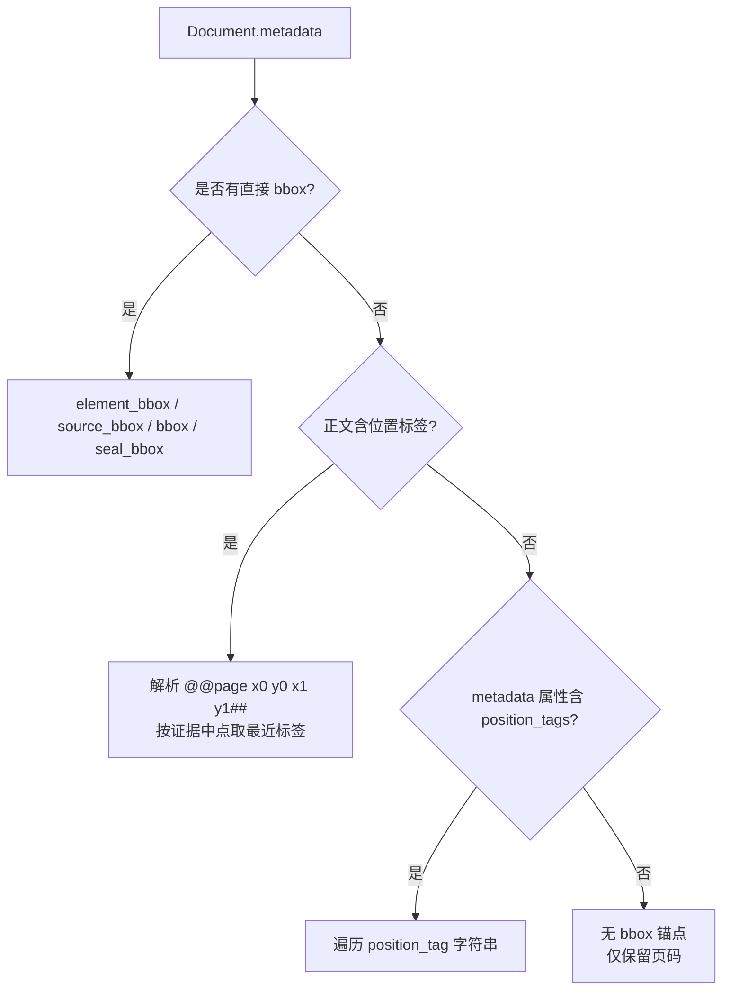

本篇深入解析 MimirQ 对话引擎中「可验证性」三件套的实现：**引用生成**（把检索到的 LangChain Document 转换为结构化 citation 载荷）、**声明证据映射**（把回答切分为原子声明并逐一关联支持片段）与**忠实度评分**（在线的确定性 claim-support-ratio 代理）。三者共同构成回答的可信度闭环——前端可以深链高亮原文、运营可以审计引用完整性、引擎可以在低忠实度时触发校正重试。全文基于 `app/rag/core` 下的 citations / claim_evidence / faithfulness 等模块与 `app/rag/engine.py` 的集成代码，不含推测性描述。

## 一、总体架构：从检索文档到可审计回答

下图展示了对话引擎中引用与证据链路的完整数据流。检索编排器（orchestrator）产出候选文档后，`build_citations_from_docs` 将其转换为结构化引用；回答生成完成后，引擎依次执行声明切分、证据映射、忠实度评分与（可选的）声明级过滤，最后随 `done` 事件下发全部元数据。

```mermaid
flowchart LR
    A[检索编排器<br/>orchestrator] -->|List[Document]| B[build_citations_from_docs<br/>citations.py]
    B --> C[结构化引用 payload<br/>evidence_anchor_hash / citation_hash]
    C --> D[LLM 生成回答]
    D --> E[split_into_claims<br/>text.py]
    E --> F[build_claim_evidence_map<br/>claim_evidence.py]
    E --> G[verify_claim_with_fallback<br/>claim_verifier.py]
    G --> H[compute_faithfulness_score<br/>faithfulness.py]
    H --> I[compute_confidence_score<br/>confidence.py]
    F --> J[render_sentence_citations_*<br/>sentence_citations.py]
    J --> K[回答附注 / 行内改写]
    H -->|score < 阈值| L[Corrective RAG 重试]
    C --> M[build_evidence_capsule<br/>evidence_capsule_builder.py]
```

引用（citations）与证据映射（claim_evidence）是两条独立但互补的产物：引用回答「这段回答来自哪些检索结果」，证据映射回答「这句话具体被哪些片段支持、支持到什么位置」。忠实度评分则是两者的量化汇总，直接喂给置信度评分与校正 RAG 门禁。

Sources: [citations.py](app/rag/core/citations.py#L1177-L1209)、[claim_evidence.py](app/rag/core/claim_evidence.py#L178-L298)、[faithfulness.py](app/rag/core/faithfulness.py#L7-L80)

## 二、引用生成：从检索文档到结构化载荷

### 2.1 上下文提取与位置锚定

`build_citations_from_docs` 是唯一入口，遍历每个检索文档，通过 `_citation_context` 构造一个 `_CitationContext` 数据类，集中完成元数据解析。该上下文包含 30 余个字段：命中类型（hit_type）、边界框（bbox）、页码、证据跨度（evidence_start/end）、层级关系键、检索分数等。位置锚定是引用可深链的关键，有三层提取策略：**直接元数据**（`element_bbox` / `source_bbox` / `bbox` / `seal_bbox`，支持 dict 或四元组列表）、**正文内嵌位置标签**（正则 `@@([^#]+)##`，形如 `@@3 x0 y0 x1 y1##` 的解析器产物）、**元数据属性中的位置标签字符串**（`position_tags` / `position_tag`）。内嵌标签解析时还会结合声明证据跨度计算目标中点，选择距离最近的位置标签，保证高亮区域与引用语义对齐。



Sources: [citations.py](app/rag/core/citations.py#L26-L29)、[citations.py](app/rag/core/citations.py#L62-L75)、[citations.py](app/rag/core/citations.py#L122-L162)、[citations.py](app/rag/core/citations.py#L185-L208)、[citations.py](app/rag/core/citations.py#L779-L817)

### 2.2 引用载荷字段与命中类型

`_base_citation` 组装最终的引用字典（约 60 个字段），可分为五组：**身份锚点**（chunk_id、document_id、dataset_id、start_char/end_char、evidence_start_char/evidence_end_char）、**来源语义**（header_path、policy_clause_id、chunk_strategy、parent_id、hierarchy_family_key）、**检索证据**（vector/bm25/lexical/sparse/colbert/rerank 各分数、reranker_provider、retrieval_mode、retrieval_elapsed_sec）、**知识图谱信号**（kg_pagerank、kg_shared_events、kg_edge_conf_*、kg_evidence_anchored）、**媒体与表格**（img_url、table_id、row_source_*、join_provenance）。

命中类型 `hit_type` 由分数竞争决定：表格角色为 `tag`，图像为 `image`，MMR 模式为 `mmr`；其余场景下 colbert 分最高为 `colbert_ann`，否则比较向量分与 BM25 分得到 `vector` / `keyword` / `hybrid`。引用片段 `chunk_content` 由 `_build_snippet_and_span` 生成：以查询词首次命中点为中心开窗（前 1/3、后 2/3，上限 220 字符），再向两侧扩展到最近的句子边界，保证片段完整可读；无命中时退化为截断前缀。

Sources: [citations.py](app/rag/core/citations.py#L708-L728)、[citations.py](app/rag/core/citations.py#L844-L927)、[citations.py](app/rag/core/citations.py#L347-L381)

### 2.3 哈希锚定与层级合并

每个引用在组装完成后调用 `_apply_hashes` 生成两级哈希：`evidence_anchor_hash` 基于身份锚点字段（document_id、chunk_id、page_number、start_char、end_char、table_id、row_source 等，含 bbox）的稳定 JSON 哈希（16 位）；`citation_hash` 则是整个引用字典的稳定哈希。这两级哈希构成证据胶囊校验链的基础，后续任何字段篡改都会导致胶囊校验失败。

层级父子切块场景下，`_merge_hierarchy_parent_spans` 会做一次后处理：当 `hierarchy_parent` 角色的引用的 `neighbor_of` 指向某个子锚点引用时，将父引用的证据跨度收敛到子锚点区间内，并基于父块原文重新生成片段与匹配词——避免父块大跨度引用稀释定位精度。

Sources: [citations.py](app/rag/core/citations.py#L1097-L1115)、[citations.py](app/rag/core/citations.py#L1125-L1174)、[citations.py](app/rag/core/citations.py#L1204-L1208)

## 三、声明证据映射：确定性的 claim → evidence

### 3.1 声明切分

`split_into_claims`（text.py）将回答拆分为原子声明，采用三层启发式：Markdown 列表项（`-` / `*` / `•`）逐条成为独立声明；编号列表项（`1.` / `1)`）去掉标记后成为声明；普通段落按句子边界（`。！？.!?\n`）切分为多个声明。所有路径受 `max_claims`（默认 24）上界约束，保持顺序、丢弃空项。这一切分同时服务于 claim check、证据映射与忠实度评分，是三个功能共用的基础。

### 3.2 映射算法

`build_claim_evidence_map` 的输出是一个 JSON 安全的列表：每条记录包含 `claim` 与 `evidence` 数组，每个证据元素含 `document_id`、`chunk_id`、`start_char`、`end_char`、`quote`（引文片段）与 `score`。算法流程：先切分声明；对每条声明，若命中不确定性正则（"无法确定"、"insufficient evidence" 等）则视为无证据要求的拒答声明；否则遍历所有证据块，用 `is_claim_supported`（token 重叠 + 矛盾检查，可带 NLI 回退）过滤出支持块，再按「重叠率降序 → 共享 token 数降序 → chunk_id 升序」排序，取前 `max_evidence_per_claim`（默认 2）个。

引文片段 `quote` 由 `_extract_span` 生成：取声明中最长的 12 个 token 作为检索词，在块文本中找最早命中位置，以该位置为中心开窗（240 字符上限）并向两侧扩展到句子边界，首尾自动加省略号；若 `start_char` 存在，则把局部偏移换算为文档级绝对偏移，供前端跳转原文。整个模块的设计约束是「确定性、有界、尽力而为」——不引入额外网络调用，映射不完美时只降级不清零。

Sources: [text.py](app/rag/core/text.py#L551-L630)、[claim_evidence.py](app/rag/core/claim_evidence.py#L1-L12)、[claim_evidence.py](app/rag/core/claim_evidence.py#L22-L27)、[claim_evidence.py](app/rag/core/claim_evidence.py#L91-L137)、[claim_evidence.py](app/rag/core/claim_evidence.py#L218-L298)

## 四、忠实度评分：确定性在线代理

### 4.1 评分定义

`compute_faithfulness_score` 是引擎在线使用的确定性忠实度代理，定义简明：**忠实度 = 受支持声明数 / 总声明数**（0..1）。实现细节：回答为空或切分不出声明时返回 `score=None`；证据文本由检索块 `page_content` 拼接而成，受 `FAITHFULNESS_SCORE_MAX_EVIDENCE_CHARS`（默认 24,000 字符）上限约束；每条声明经 `verify_claim_with_fallback` 验证，仅保留最多 16 条不支持的声明样本用于诊断。返回结构含 `score`、`supported_claims`、`total_claims`、`unsupported_claims` 与 `method="claim_support_ratio"`。

| 返回字段 | 类型 | 语义 |
|---|---|---|
| `score` | float \| None | 支持比例；无声明时为 None |
| `supported_claims` | int | 受支持声明数 |
| `total_claims` | int | 总声明数 |
| `unsupported_claims` | list[str] | 不支持声明样本（最多 16 条，截断 300 字符） |
| `method` | str | 恒为 `claim_support_ratio` |

### 4.2 验证器模式与矛盾检查

`verify_claim` 支持三种模式，由 `RAG_CLAIM_VERIFIER_MODE` 控制：

| 模式 | 重叠判定 | 矛盾检查 | 典型用途 |
|---|---|---|---|
| `token_overlap` | 声明 ≤3 token 需共享 ≥1；≤8 token 需 ≥2 或占比 ≥34%；更长需 ≥2 且占比 ≥20% | 仅记录不否决 | 默认，低延迟基线 |
| `semantic_heuristic` | 同上 | 数字不匹配 / 否定冲突直接判不支持 | 更严格的事实一致性 |
| `strict` | 共享 ≥2 且占比 ≥50% | 同 semantic_heuristic | 高严格门禁场景 |

矛盾检查只在下述两种信号上触发：**数字不匹配**（声明的全部数字集合不是证据数字集合的子集）与**否定冲突**（声明与证据的否定词状态不同且共享 token ≥2）。判定结果通过 `reason_code` 区分：`supported`、`overlap_insufficient`、`contradiction_numeric_mismatch`、`contradiction_negation_conflict`、`contradiction_numeric_and_negation` 等。另有三条安全豁免：空声明视为支持、不确定性措辞（拒答）视为支持、空证据视为不支持。

### 4.3 NLI 回退

当 token 重叠判定为不支持且 `RAG_CLAIM_NLI_VERIFIER_ENABLED=true` 时，`verify_claim_with_fallback` 会调用 `verify_claim_with_nli` 做二次裁决：向 OpenAI 兼容的 chat/completions 端点发送「严格 NLI 分类器」提示词，要求仅返回 `entailment` / `contradiction` / `neutral` 标签（temperature=0）。NLI 结果仅在标签为 entailment/contradiction 时覆盖原判定，neutral 与请求失败均回退到原结果，且诊断中记录 `nli_fallback` 的可用性、标签与 provider 状态。该能力默认关闭，定位为实验性增强，以保证默认行为的确定性。

Sources: [faithfulness.py](app/rag/core/faithfulness.py#L7-L80)、[claim_verifier.py](app/rag/core/claim_verifier.py#L36-L41)、[claim_verifier.py](app/rag/core/claim_verifier.py#L74-L87)、[claim_verifier.py](app/rag/core/claim_verifier.py#L90-L200)、[text.py](app/rag/core/text.py#L681-L726)、[claim_nli_verifier.py](app/rag/core/claim_nli_verifier.py#L67-L200)

## 五、引擎集成：claim check、句子引用与置信度

### 5.1 声明级过滤（claim check）

引擎在生成完成后执行声明级接地过滤，由 `RAG_CLAIM_CHECK_ENABLED` 开启，`RAG_VISIBLE_EVIDENCE_ONLY_ENABLED`（严格接地模式）会强制开启。过滤分两种形态：

- **文本模式**（`claim_check_mode="text"`，非结构化输出）：切分声明后逐条验证，不支持的声明被移除并记录 `reason_code` 与 `contradiction_type`；若全部被移除则回退到「无法回答」消息。由于过滤发生在生成后，该模式下回答必须整体缓冲，会延迟流式首字。
- **结构化模式**（`claim_check_mode="structured"`）：保持 JSON 可解析性，仅清洗自然语言字段，通过 `scrub_structured_output_visible_evidence_only` 完成，并统计 `claims_total` / `claims_removed` / `removed_reasons`。

### 5.2 句子引用渲染

`render_sentence_citations_markdown` 与 `render_sentence_citations_inline` 把 claim_evidence 映射渲染成两种形态，由 `SENTENCE_CITATIONS_INLINE_STYLE` 切换：

| 形态 | 输出示例 | 适用前提 |
|---|---|---|
| `appendix`（默认） | 回答末尾追加 `### Sentence Citations` 小节，每行 `- 声明 [doc:.. \| chunk:.. \| p.N]` | 任何文本回答 |
| `inline` | 回答改写为一行一声明，行尾 `[1](mimirq-citation://evidence?document_id=..&chunk_id=..&page=N)` | 仅当 claim check 模式为 `text`（回答已是声明列表形态）；否则回退 appendix 并记录 `fallback_reason` |

行内引用使用自定义协议 `mimirq-citation://evidence` 深链，前端可据此定位文档、块与页码。两个渲染器共用 `SENTENCE_CITATIONS_INLINE_MAX_ITEMS`（默认 8）与 `MAX_EVIDENCE_PER_CLAIM`（默认 2）上界。

### 5.3 置信度评分与校正联动

`compute_confidence_score` 将忠实度与其他信号加权聚合成单一置信度（0..1）与等级（high/medium/low/unknown）：忠实度权重 0.5、声明覆盖率权重 0.25、检索缺口权重 0.25（无缺口信号时按 0.9 计）。校正 RAG 联动则是：当 `RAG_CORRECTIVE_ENABLED` 且忠实度 < `RAG_CORRECTIVE_MIN_FAITHFULNESS_SCORE`（默认 0.75）时，引擎发出 `quality_warning` 事件（kind=`faithfulness_low`），并触发 recall-first profile 的二次检索重试。`done` 事件中会携带完整的忠实度与置信度元数据：`faithfulness_score`、`faithfulness_supported_claims`、`faithfulness_unsupported_claims`、`confidence_score`、`confidence_band`、`sentence_citations_count` 等，供前端展示与持久化。

Sources: [engine.py](app/rag/engine.py#L3048-L3063)、[engine.py](app/rag/engine.py#L3226-L3263)、[engine.py](app/rag/engine.py#L3342-L3397)、[engine.py](app/rag/engine.py#L3399-L3475)、[engine.py](app/rag/engine.py#L3507-L3525)、[engine.py](app/rag/engine.py#L2415-L2450)、[engine.py](app/rag/engine.py#L2557-L2572)、[sentence_citations.py](app/rag/core/sentence_citations.py#L6-L26)、[sentence_citations.py](app/rag/core/sentence_citations.py#L29-L96)、[sentence_citations.py](app/rag/core/sentence_citations.py#L99-L152)、[confidence.py](app/rag/core/confidence.py#L43-L79)

## 六、证据胶囊与锚点期望：可审计性与门禁

### 6.1 证据胶囊

`build_evidence_capsule` 把一次检索的证据快照打包为可审计、可复现的胶囊，schema 为 `mimirq.evidence_capsule.v1`。内容包含：清洗后的引用列表（仅保留锚点、分数与溯源字段）、`citation_hashes` 清单、must_recall 状态、检索契约（mode/policy/hard_fallback_used）、解析质量风险等级与检索摘要。胶囊具备三级完整性保护：整体 `capsule_hash`（24 位稳定哈希）、每条引用的 `evidence_anchor_hash` + `citation_hash` 链、以及可选的 HMAC-SHA256 签名（`EVIDENCE_CAPSULE_SIGNING_ENABLED`）。`validate_evidence_capsule` 在严格模式下逐一重算哈希比对，任何不匹配都会返回具体失败原因（如 `capsule_hash_mismatch`、`citation_hash_mismatch`、`signature_mismatch`）。证据胶囊是检索门禁（evidence retrieval gate）与回归套件间可移植证据的标准载体。

### 6.2 锚点期望评估

`evaluate_evidence_anchor_expectations` 从另一角度保障引用质量：给定必填锚点字段（默认 `chunk_id`、`document_id`），统计缺失计数、缺失示例与按 `retrieval_role` 前缀跳过的引用，输出 `passed` 布尔值。它常与 must-recall 门禁配合：即使声明被支持，若引用缺失身份锚点，前端仍无法深链定位，因此锚点完整性被单独成门禁检查。

### 6.3 引用覆盖诊断

检索编排侧还提供轻量的 PII 安全覆盖代理：`_coverage_proxy_from_citations` 统计 `citations_total`、`distinct_documents`、`distinct_pipeline_keys`、`distinct_roles` 与 `top_doc_share`（单文档占比），用于快速诊断「所有引用来自同一文档」等覆盖问题；同时 `_diagnose_empty_retrieval` 从检索器调试信息中归因空检索原因（acl、metadata_filter、dataset、pipeline_version、embedding_space、orphaned_vectors 等），配合解析质量风险汇总（低分文档占比、是否触发 reparse 建议）形成完整的引用质量旁路诊断。

Sources: [evidence_capsule_builder.py](app/rag/core/evidence_capsule_builder.py#L29-L87)、[evidence_capsule_builder.py](app/rag/core/evidence_capsule_builder.py#L214-L244)、[evidence_capsule_builder.py](app/rag/core/evidence_capsule_builder.py#L247-L309)、[evidence_expectations.py](app/rag/core/evidence_expectations.py#L40-L109)、[citation_quality.py](app/rag/retrieval/orchestration/citation_quality.py#L46-L68)、[citation_quality.py](app/rag/retrieval/orchestration/citation_quality.py#L122-L139)

## 七、配置矩阵与调优建议

以下配置项共同决定引用与忠实度链路的严格程度与开销：

| 配置项 | 默认值 | 作用 | 调优提示 |
|---|---|---|---|
| `RAG_CLAIM_CHECK_ENABLED` | false | 开启声明级过滤（回答需缓冲） | 追求实时流式时保持关闭 |
| `RAG_VISIBLE_EVIDENCE_ONLY_ENABLED` | false | 严格接地：强制 abstain 门禁与 claim check | 高合规场景开启 |
| `RAG_CLAIM_VERIFIER_MODE` | token_overlap | 验证器严格度 | 事实敏感场景用 `strict` |
| `RAG_CLAIM_VERIFIER_ENABLE_CONTRADICTION_CHECK` | true | 数字/否定矛盾检查开关 | 与 strict 搭配使用 |
| `RAG_CLAIM_NLI_VERIFIER_ENABLED` | false | NLI 模型回退 | 实验性，需配置 provider |
| `FAITHFULNESS_SCORE_ENABLED` | true | 在线忠实度评分开关 | 保持默认开启 |
| `FAITHFULNESS_SCORE_MAX_CLAIMS` | 24 | 声明数上界 | 长回答可上调 |
| `FAITHFULNESS_SCORE_MAX_EVIDENCE_CHARS` | 24000 | 证据文本上界 | 控制延迟与 token 开销 |
| `SENTENCE_CITATIONS_INLINE_ENABLED` | false | 句子引用渲染开关 | 配合 claim check 使用 |
| `SENTENCE_CITATIONS_INLINE_STYLE` | appendix | appendix / inline 形态 | inline 仅适合声明列表回答 |
| `RAG_CORRECTIVE_MIN_FAITHFULNESS_SCORE` | 0.75 | 校正 RAG 触发阈值 | 低于阈值触发二次检索 |

一个推荐的「高可审计」配置组合：`RAG_CLAIM_CHECK_ENABLED=true` + `RAG_CLAIM_VERIFIER_MODE=strict` + `SENTENCE_CITATIONS_INLINE_ENABLED=true`（style=appendix）+ `EVIDENCE_CAPSULE_SIGNING_ENABLED=true`。代价是回答缓冲带来的首字延迟上升，换取每条声明都可定位、可验证、可回放。

Sources: [config.py](app/core/config.py#L1518-L1538)、[config.py](app/core/config.py#L1805-L1815)、[config.py](app/core/config.py#L1820-L1824)

## 八、持久化模型与后续阅读

证据资产（ground-truth 查询 + 人工选择的 reference_sources）由 `EvidenceSuite` / `EvidenceItem` 持久化，支持 `draft → reviewed → approved → archived` 多阶段审批，并为 RAGAS 回归用例提供证据指针。这与对话引擎的在线引用链互补：在线引用回答「这次回答用了什么」，证据库回答「这个查询应该命中什么」，两者在回归评测中对照产生召回与忠实度指标。

建议按目录顺序继续阅读：

- [流式对话与工作流：LangGraph 编排、CRAG、Self-RAG 与多智能体](21-liu-shi-dui-hua-yu-gong-zuo-liu-langgraph-bian-pai-crag-self-rag-yu-duo-zhi-neng-ti)——本篇提到的校正 RAG（CRAG）循环与 Self-RAG 的完整编排在该页展开；
- [检索编排与上下文扩展：二次召回、查询改写与证据缺口补全](18-jian-suo-bian-pai-yu-shang-xia-wen-kuo-zhan-er-ci-zhao-hui-cha-xun-gai-xie-yu-zheng-ju-que-kou-bu-quan)——引用质量代理与空检索诊断的上游来源；
- [评测体系：Golden 回归、Recall/MRR 指标与 800 题基准](23-ping-ce-ti-xi-golden-hui-gui-recall-mrr-zhi-biao-yu-800-ti-ji-zhun)——忠实度评分在离线评测与 RAGAS 适配中的角色；
- [回归套件与证据管理：回归运行、消融实验与证据胶囊](25-hui-gui-tao-jian-yu-zheng-ju-guan-li-hui-gui-yun-xing-xiao-rong-shi-yan-yu-zheng-ju-xiao-nang)——证据胶囊从在线快照到回归回放的完整链路。