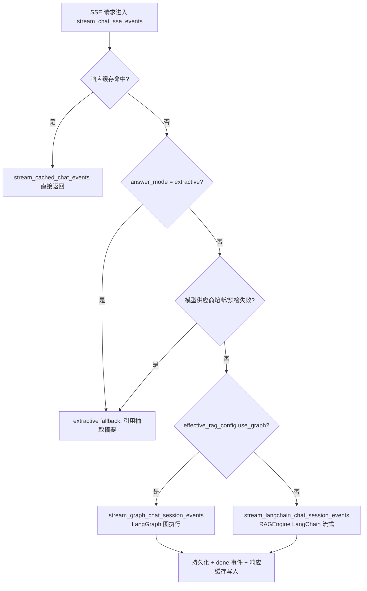
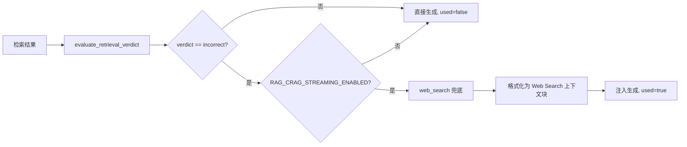

MimirQ 的对话层并非单一线性管线，而是一个**可按配置切换执行路径的编排体系**：默认路径走 `RAGEngine`（LangChain 风格的检索 + 生成），可选的 LangGraph 路径提供带 checkpoint 持久化、任务级重试与流式事件广播的图执行，而面向复杂问题的 Agentic 路径则组合了 CRAG（纠正式检索）、Self-RAG（反思式生成）与多智能体并行分解。本文从代码证据出发，逐层拆解这套三层执行架构：图定义、SSE 流式桥接、纠正/反思/多智能体三条高级路径，以及支撑它们的 checkpointer 与工作流模式工厂。

## 一、架构总览：三层执行路径的切换逻辑

对话请求进入后端后，由 `chat_stream_orchestrator.py` 统一编排。其决策链依次是：响应缓存命中 → 显式 extractive 模式 → 模型供应商熔断 → LLM 预检 → 最终在 **LangGraph 图执行**与 **LangChain 流式执行**之间二选一。`effective_rag_config.use_graph` 是分流开关，为 true 时进入图路径，否则回落至 `RAGEngine` 的 LangChain 流式路径。

熔断与预检机制（`is_model_provider_unavailable_circuit_open`、`preflight_model_provider_fast`、`mark_model_provider_unavailable`）确保 LLM 不可用时自动降级为纯抽取式回答，图执行中的 `RetrievalAdmissionTimeoutError` 会被专门格式化为带 `Retry-After` 的 `SERVICE_UNAVAILABLE` SSE 事件。Sources: [chat_stream_orchestrator.py](app/services/chat_stream_orchestrator.py#L64-L365)

**历史兼容层**：`app/rag/agent.py` 中的 `RAGAgent` 是纯 LangChain 时代的遗留产物，现已退化为 `RAGEngine` 的薄封装（线程安全的懒加载单例），`stream_chat` 直接转发给引擎。这印证了架构重心从"独立 Agent"向"引擎 + 图编排"迁移的演进方向。Sources: [agent.py](app/rag/agent.py#L21-L64)

## 二、LangGraph 流水线：Functional API、状态与节点

`app/rag/pipelines/langgraph.py` 是 LangGraph 实现的**规范所在地**（`app/rag/graph.py` 仅为向后兼容的转发路径）。代码明确标注已重构为 LangGraph 1.0+ Functional API：用 `@entrypoint` 声明工作流入口，用 `@task` 声明可重试、可缓存的任务节点。

### 2.1 状态契约与运行时上下文分离

图状态 `RAGState`（TypedDict）承载超过 80 个字段，涵盖检索参数（`retrieval_mode`、`alpha`、`fusion_strategy`、`reranker_provider`）、查询改写开关（`enable_multi_query`、`enable_hyde`、`enable_query_rewrite`）、输出字段（`docs`、`citations`、`answer`、`metrics`）与审计字段（`route`、`model_used`、`abstain_triggered`）。设计上刻意区分了两类数据：

| 类别 | 载体 | 内容 | 持久化 |
|---|---|---|---|
| 业务状态 | `RAGState` | question、docs、answer、citations、metrics | 随 checkpoint 持久化 |
| 运行时上下文 | `RAGRuntimeContext` | request_id、conversation_id、tenant_id、account_id、cancel_event | 不进入 checkpoint |

`RAGRuntimeContext` 的 `cancel_event`（threading.Event）为断连取消提供了协作式取消通道，而用户身份字段会回填到 `metrics` 中用于审计。Sources: [langgraph.py](app/rag/pipelines/langgraph.py#L71-L169)

### 2.2 任务节点：检索与生成

`retrieve_task` 与 `generate_task` 均以 `@task` 装饰，挂载统一的 `_RAG_TASK_RETRY_POLICY`（`max_attempts = RAG_GRAPH_MAX_RETRIES + 1`，对 ValueError/TypeError/KeyError 不重试）。检索任务额外挂载 `CachePolicy`，其缓存键 `_retrieve_cache_key` 是一个值得注意的安全设计：**缓存键强制包含 account_id、dataset_id 与 embedding space hash**，注释明确写道"retrieval is scoped by ACL and dataset; cache key MUST include account_id/dataset_id to avoid cross-user leakage"，从根源上杜绝了跨租户缓存串读。两个任务都会通过 `get_stream_writer()` 广播 `retrieve_start` / `retrieve_done` / `generate_start` / `generate_done` 事件，并接入 LangSmith tracing。Sources: [langgraph.py](app/rag/pipelines/langgraph.py#L172-L178), [langgraph.py](app/rag/pipelines/langgraph.py#L947-L1097)

### 2.3 图拓扑与子图组合

`build_rag_graph` 构建最小拓扑 `retrieve → generate → END`；当 `LANGGRAPH_USE_SUBGRAPHS` 开启时，`build_rag_graph_subgraphs` 将 retrieve/generate 各自封装为命名子图（`rag_retrieve_subgraph`、`rag_generate_subgraph`），再以"子图即节点"的方式组合。两种构建方式都会 `compile(checkpointer=..., store=...)`，实现跨请求的状态恢复。Sources: [langgraph.py](app/rag/pipelines/langgraph.py#L1290-L1361)

### 2.4 生成后处理链

`_generate_node` 并非简单的 prompt + LLM 调用，而是一条完整的后处理流水线：

1. **PII 脱敏**：`redact_text` 在输入与输出两侧生效
2. **确定性来源识别**：`maybe_build_source_identification_answer` 可在不调用 LLM 的情况下回答来源类问题
3. **声明级校验**（`claim_check_mode`）：文本模式逐条拆分声明并 `verify_claim_with_fallback` 过滤；结构化输出模式则通过 `scrub_structured_output_visible_evidence_only` 仅保留可见证据支持的声明，未通过者整段替换为 `_UNABLE_TO_ANSWER_MESSAGE`
4. **忠实度与置信度**：`compute_faithfulness_score` 计算声明支持率，`compute_confidence_score` 综合忠实度与证据缺口给出置信带
5. **句子级引用**：`render_sentence_citations_inline` / `_markdown` 按 appendix 或 inline 风格注入引用
6. **上下文悬崖检测**：`compute_context_cliff_metrics` 监控 token 逼近阈值的风险

Sources: [langgraph.py](app/rag/pipelines/langgraph.py#L271-L375), [langgraph.py](app/rag/pipelines/langgraph.py#L610-L928)

## 三、SSE 流式桥接：从同步图执行到异步事件流

LangGraph 的 `.stream()` 是阻塞生成器，而 FastAPI 需要异步迭代。`chat_stream_graph.py` 的 `_iterate_sync_in_worker` 解决了这个阻抗失配：通过 `asyncio.to_thread` 将生产者放进独立线程，用 `asyncio.Queue` + `threading.BoundedSemaphore(16)` 做背压限流，`loop.call_soon_threadsafe` 完成跨线程投递，`stop_event` 支持外部取消。这段代码是"同步图 + 异步 API"集成的关键基础设施。

图执行以 `stream_mode=["custom", "values"]` 双通道运行：custom 通道透传节点广播（如 `retrieve_done`），values 通道在每次状态更新时检查 `citations` 与 `answer` 字段，首次出现即触发"一次性发送"（`citations_sent` / `answer_sent` 标志位），答案按 120 字符分块产出 token 事件。完整回答、引用与指标随后写入 `result_holder`，由外层会话函数统一组装 done 事件、写响应缓存并派发持久化。Sources: [chat_stream_graph.py](app/services/chat_stream_graph.py#L25-L82), [chat_stream_graph.py](app/services/chat_stream_graph.py#L222-L306)

## 四、CRAG：纠正式检索的两套实现

MimirQ 中 CRAG（Corrective RAG）存在**两套互补实现**，分别服务于图路径与 Agentic 路径。

### 4.1 图路径：保守的纠正循环

`_run_corrective_loop` 是图入口 `rag_workflow` 的核心执行器，由 `RAG_CORRECTIVE_ENABLED` 门控。其逻辑为：检索结果若触发 abstain（证据弱/为空），则用召回优先的检索 profile 重试；生成后若忠实度低于 `RAG_CORRECTIVE_MIN_FAITHFULNESS_SCORE`（默认 0.75），则再执行一轮"检索 + 生成"。设计上刻意保守：最大尝试数被钳制在 1–3，二次检索只做确定性覆盖（`recall50` profile + 强制 multi-query），并在 metrics 中保留 `corrective_reason_codes`、`corrective_attempts`、`corrective_second_pass` 的 PII 安全摘要供调试。Sources: [langgraph.py](app/rag/pipelines/langgraph.py#L1100-L1217)

### 4.2 Agentic 路径：检索判定 + 网络搜索兜底

`workflows/crag_streaming.py` 提供更接近论文原意的实现：`run_crag_streaming` 先调用 `evaluate_retrieval_verdict` 判定检索结果（`min_citations` 与 `min_top_score` 阈值），当判定为 `incorrect` 且开关 `RAG_CRAG_STREAMING_ENABLED` 开启时，触发 `web_search` 兜底，并将搜索结果格式化为 `[Web Search Fallback | provider=...]` 上下文块注入生成。返回结构包含 `used`、`verdict`、`provider`、`web_result_count`，便于前端展示"网络补充检索"这一中间步骤。Sources: [crag_streaming.py](app/rag/workflows/crag_streaming.py#L42-L91)

## 五、Self-RAG 与 Critic：生成后的反思层

`workflows/self_rag.py` 的 `run_self_rag_reflection` 实现了 Self-RAG 风格的生成后反思：以忠实度评分（`compute_faithfulness_score`）为核心，辅以**问题词命中率判定相关性**、**文本包含关系判定直接支持**，最终输出 `accept` / `revise` 判定与机器可读的 `reason_codes`（`need_retrieval`、`irrelevant_answer`、`unsupported_claims`、`not_useful`），并遵循 `mimirq.self_rag_reflection.v1` 的 schema 版本约定。Sources: [self_rag.py](app/rag/workflows/self_rag.py#L29-L85)

Agentic 路径在生成完成后按开关依次执行两阶段评审：先跑 Self-RAG 反思（`RAG_SELF_RAG_ENABLED`），再跑 Critic 评审（`RAG_CRITIC_ENABLED`，`run_critic_review` 检查引用缺失、声明支持数与风格问题），二者结果均以 `agentic_step` 事件流式上报，最终以 `agentic_self_rag_verdict`、`agentic_critic_*` 等 12 个指标字段沉淀到 metrics。Sources: [rag_agent.py](app/rag/agents/rag_agent.py#L648-L685), [rag_agent.py](app/rag/agents/rag_agent.py#L687-L727)

## 六、多智能体：复杂度路由与并行子代理

`agents/multi_agent.py` 的 `MultiAgentRAGRunner` 是 Agentic 路径的并行扩展。触发条件为 `RAG_MULTI_AGENT_ENABLED` 且规划步骤多于 1 个。其执行分为四阶段：

1. **复杂度评分路由**：`_score_question_complexity` 与 `RAG_AGENTIC_COMPLEXITY_THRESHOLD`（默认 250.0）决定是否进入 agentic 路径，`route` 事件携带判定理由
2. **任务分解**：优先 LLM 分解（`decompose_prompt`，低温度 0.2），失败降级为 `heuristic_decompose_query`，再降级为单查询兜底
3. **并行子代理检索**：`asyncio.create_task` 并发执行 `_run_sub_agent`（每个子代理在独立 DB session 中跑 `run_retrieval`），`asyncio.as_completed` 边完成边上报进度，finally 块兜底取消未完成任务
4. **结果合并**：文档按 `_doc_key` 去重并 `_prefer_doc` 择优，引用按 `document_id|chunk_id|page|source|snippet` 复合键去重、保留高分项

合并后若无文档则输出 abstain 消息，否则以合并上下文流式生成。`agentic_rounds`、`agentic_planned_steps`、`multi_agent_parallel_tasks` 等指标完整记录执行轨迹。Sources: [multi_agent.py](app/rag/agents/multi_agent.py#L106-L176), [multi_agent.py](app/rag/agents/multi_agent.py#L178-L399)

**Agentic 工具层**：单代理路径 `AgenticRAGRunner` 在检索前通过 `_plan_tool_invocations` 做规则式工具规划（数学表达式 → `calculate`、时间类问题 → `get_current_time`、单文档通读 → `get_document_content`），经 MCP 注册表执行，工具结果与检索文档共同组成生成上下文；而 `agents/prebuilt.py` 提供面向 LangGraph `create_react_agent` 的预置封装（`create_rag_agent`、`create_rag_tool_node`、`create_retriever_tool`），保留原生 ReAct 循环的接入能力。Sources: [rag_agent.py](app/rag/agents/rag_agent.py#L305-L370), [prebuilt.py](app/rag/agents/prebuilt.py#L27-L98)

## 七、工作流模式工厂：六种编排原语

`app/rag/workflows/` 提供了独立于 LangGraph 的**模式化工作流抽象**，覆盖论文与工程实践中六种经典编排：

| 模式 | WorkflowMode | 语义 | 典型场景 |
|---|---|---|---|
| Chain | `chain` | 顺序逐步执行 | 标准 retrieve → generate |
| Routing | `routing` | 基于查询分类动态路由 | 简单/复杂问题分流 |
| Parallelization | `parallel` | 并发执行 + 结果聚合 | 多路检索合并 |
| ReAct | `react` | 推理-行动循环 | 工具调用式问答 |
| Planner-Worker | `planner` | 任务分解 + 并行执行 | 多跳复杂查询 |
| Evaluator-Optimizer | `evaluator` | 迭代改进循环 | 生成质量迭代 |

`BaseWorkflow` 定义统一契约（`mode`、`run`、`WorkflowResult`），并通过 `_wrap_agent_middlewares` 在实例层面注入 `AgentMiddlewareChain`（PII、工具日志、代理日志），使所有模式透明获得中间件能力。工厂 `factory.py` 以 `WORKFLOW_REGISTRY` + `MODE_ALIASES` 支持配置驱动选择（默认 `WORKFLOW_MODE = "chain"`）与十余种字符串别名。Sources: [base.py](app/rag/workflows/base.py#L20-L163), [factory.py](app/rag/workflows/factory.py#L27-L53)

## 八、Checkpointer 与状态持久化

图的状态恢复依赖 `app/rag/checkpointer/` 工厂：`CHECKPOINT_BACKEND` 配置决定 `SqliteSaver` 或 `InMemorySaver`（全局单例、线程安全）。其中 `SqliteSaver` 是自研的轻量实现，直接实现 LangGraph `BaseCheckpointSaver` 接口，以 `(thread_id, checkpoint_ns, checkpoint_id)` 为主键存储 checkpoint 与 pending writes，关键工程细节包括：

- **线程本地连接**（`threading.local`）+ `check_same_thread=False`，规避跨线程 sqlite 限制
- **WAL + synchronous=NORMAL** 的并发写优化
- **表前缀白名单校验**（`^[A-Za-z_]\w*$`），从构造期杜绝 SQL 注入
- `time_travel.py` 支持回放历史 checkpoint

在对话场景中，`thread_id` 直接映射 `conversation_id`（无会话时回退为 `rag-{request_id}`），使同一会话的多轮请求共享图状态历史。Sources: [factory.py](app/rag/checkpointer/factory.py#L24-L53), [sqlite.py](app/rag/checkpointer/sqlite.py#L33-L133), [chat_stream_graph.py](app/services/chat_stream_graph.py#L126-L134)

## 九、总结与阅读路径

MimirQ 的流式对话层呈现"**引擎为基、图为选、Agentic 为高级路径**"的三层递进架构：`RAGEngine` 保证默认路径的稳定与低延迟，LangGraph 图路径以 checkpoint 与任务级重试换取可恢复性与可观测性，Agentic 路径则以复杂度路由为门槛，按需启用 CRAG 兜底、Self-RAG 反思与多智能体并行。所有路径共享同一套 SSE 事件协议（`route` / `agentic_step` / `citations` / `token` / `done`）与持久化管线，前端无需感知后端执行引擎的差异。

继续深入可参考：检索编排与二次召回见 [检索编排与上下文扩展：二次召回、查询改写与证据缺口补全](18-jian-suo-bian-pai-yu-shang-xia-wen-kuo-zhan-er-ci-zhao-hui-cha-xun-gai-xie-yu-zheng-ju-que-kou-bu-quan)；引用生成与忠实度评分的完整机制见 [RAG 对话引擎：引用生成、声明证据映射与忠实度评分](20-rag-dui-hua-yin-qing-yin-yong-sheng-cheng-sheng-ming-zheng-ju-ying-she-yu-zhong-shi-du-ping-fen)；对话记忆的持久化与缓存见 [会话记忆与持久化：短期/长期记忆与对话缓存](22-hui-hua-ji-yi-yu-chi-jiu-hua-duan-qi-chang-qi-ji-yi-yu-dui-hua-huan-cun)；Agentic 路径的评测覆盖见 [评测体系：Golden 回归、Recall/MRR 指标与 800 题基准](23-ping-ce-ti-xi-golden-hui-gui-recall-mrr-zhi-biao-yu-800-ti-ji-zhun)。