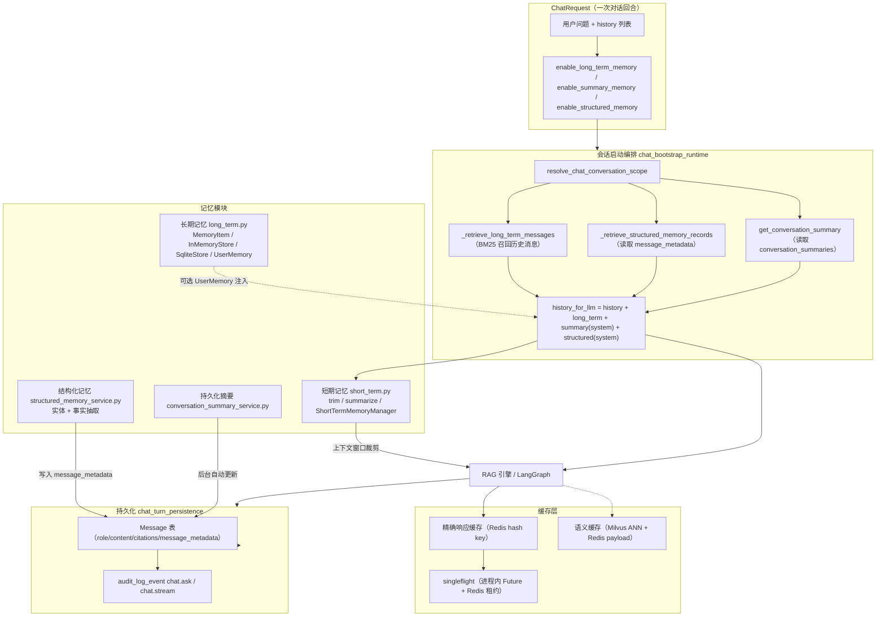
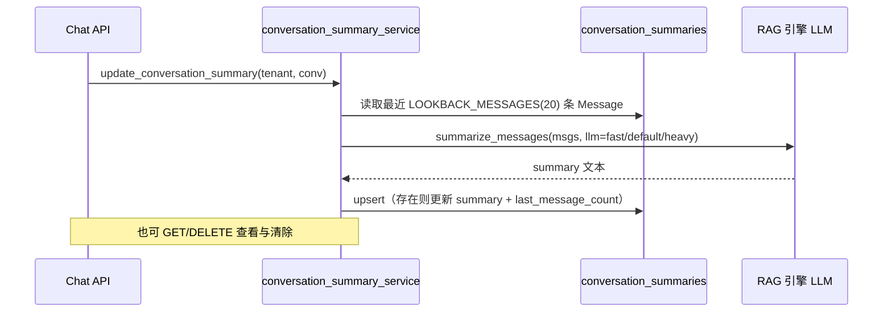

本文解析 MimirQ 的会话记忆体系与持久化链路：从对话窗口内的**短期记忆**（消息裁剪与自动摘要）、跨会话的**长期记忆**（用户偏好/事实存储与 BM25 召回）、**持久化摘要记忆**（conversation_summaries 表）与**结构化记忆**（实体/事实抽取），到消息落库与三层缓存（精确响应缓存、分布式 singleflight、Milvus 语义缓存），最后覆盖 LangGraph checkpointer 与时间旅行调试。这些机制共同决定"模型看到什么历史、系统记住什么事实、重复请求如何被加速"。

## 记忆体系总览

MimirQ 的记忆架构按"时效性 × 存储介质 × 注入位置"三个维度划分。短期记忆在请求内实时处理，不落库；长期记忆与结构化记忆在会话启动时从数据库/存储中召回并注入 system 消息；响应缓存则完全绕过模型，直接复用历史回答。



请求级开关（`enable_long_term_memory`、`enable_summary_memory`、`enable_structured_memory`）默认全部为 `False`，与全局配置（`LONG_TERM_MEMORY_ENABLED` 等）双闸门控制，确保记忆功能默认关闭、按需开启。

Sources: [app/api/schemas/chat.py](app/api/schemas/chat.py#L595-L605) | [app/core/config.py](app/core/config.py#L2357-L2382)

## 短期记忆：上下文窗口的裁剪与自动摘要

短期记忆解决的核心问题是**上下文窗口溢出**：多轮对话累积的消息超过模型 token 上限时，需要裁剪或压缩。`app/rag/memory/short_term.py` 提供三个层次的能力：

- `trim_messages()`：调用 LangChain `trim_messages`，按 `strategy="last"`（保留最近消息）裁剪到 `SHORT_TERM_MEMORY_MAX_TOKENS`（默认 4000）以内，system 消息始终保留。内部先做 dict→BaseMessage 转换，再委托 LangChain，失败时回退到自研 `_fallback_trim`。token 估算采用启发式：CJK 字符约 2 字符/token、英文约 4 字符/token。
- `summarize_messages()`：将消息列表拼接为对话文本，交给 LLM 生成浓缩摘要；无 LLM 或调用失败时退化为截断式摘要。
- `ShortTermMemoryManager`：统一入口。当消息数超过 `SUMMARIZATION_THRESHOLD`（默认 10 条）时，把窗口外的旧消息异步摘要成一条 `SystemMessage` 前缀，再对整体执行裁剪。摘要结果以 `session_id` 或消息哈希为 key 缓存，`clear_cache()` 可显式失效。同步 `process()` 通过 `run_coroutine_sync` 桥接异步摘要，即使事件循环已在运行也不会退化为简单截断（有回归测试守护）。

`SummarizationMiddleware` 将上述能力包装为 LangGraph 中间件（`before_model` / `abefore_model` / `wrap`），对 state 中的 `history` 与 `messages` 两个 key 做预处理。`delete_old_messages()` 则按 `CHAT_HISTORY_WINDOW`（默认 5 轮）保留最近消息。

Sources: [app/rag/memory/short_term.py](app/rag/memory/short_term.py#L20-L26) | [app/rag/memory/short_term.py](app/rag/memory/short_term.py#L66-L120) | [app/rag/memory/short_term.py](app/rag/memory/short_term.py#L252-L340) | [tests/test_short_term_memory_sync_summary.py](tests/test_short_term_memory_sync_summary.py#L1-L88)

一个值得注意的细节：`format_history_text()` 在滚动窗口之外**保留最新一条 system 消息**——这是持久化摘要记忆注入的前提，否则 `CHAT_HISTORY_WINDOW=5` 会把摘要 system 消息一并裁掉。

Sources: [app/rag/core/conversation.py](app/rag/core/conversation.py#L9-L62)

## 长期记忆：用户偏好、事实与跨会话召回

`app/rag/memory/long_term.py` 提供独立的长期记忆存储层，与对话无关，面向"用户偏好/事实"这类跨会话信息：

| 组件 | 说明 |
|---|---|
| `MemoryItem` | 记忆条目：namespace、key、value、memory_type（fact/preference/context）、metadata、expires_at |
| `BaseMemoryStore` | 抽象接口：put/get/search/delete/list/clear |
| `InMemoryStore` | 线程安全的内存实现，重启即失，适合开发测试 |
| `SqliteStore` | 基于 `memory_items` 表的持久化实现，支持过期清理 `cleanup_expired()` |
| `UserMemory` | 高层封装：namespace 为 `user:{tenant_id}:{user_id}`，提供 `set_preference`/`set_fact`/`add_context` 与 `to_context_string()` |

存储后端由 `MEMORY_STORE_TYPE`（memory|sqlite，默认 memory）与 `MEMORY_SQLITE_PATH` 决定，通过单例 `get_memory_store()` 获取。`retrieve_user_memory()` 与 `inject_user_memory_context()` 是面向 RAG 管线的便捷函数——后者作为中间件钩子把用户偏好/事实注入 state 的 `user_context` key。

Sources: [app/rag/memory/long_term.py](app/rag/memory/long_term.py#L55-L115) | [app/rag/memory/long_term.py](app/rag/memory/long_term.py#L192-L270) | [app/rag/memory/long_term.py](app/rag/memory/long_term.py#L455-L610) | [app/rag/memory/long_term.py](app/rag/memory/long_term.py#L630-L700)

**运行时长期记忆召回**（与上面的 UserMemory 存储层不同）在 `app/services/chat_memory_runtime.py` 实现：`_retrieve_long_term_messages()` 取当前会话最近 `LONG_TERM_MEMORY_MAX_MESSAGES`（默认 200）条消息，过滤掉长度小于 `LONG_TERM_MEMORY_MIN_LEN`（默认 20）的短消息，构建 BM25 检索器，以当前问题为 query 召回 top_k 条（`LONG_TERM_MEMORY_TOP_K`，默认 3）作为"记忆增强历史"。标记 `from_long_term: True` 使下游可区分。它只读取不写入，是对 `history` 的补充而非替换。

Sources: [app/services/chat_memory_runtime.py](app/services/chat_memory_runtime.py#L17-L70) | [app/core/config.py](app/core/config.py#L2357-L2360)

## 持久化摘要记忆：conversation_summaries 表

持久化摘要记忆把整段对话压缩成一条紧凑的 system 风格摘要，长期存放在 `conversation_summaries` 表（`tenant_id + conversation_id` 唯一约束），避免每轮都把全部历史塞进 prompt：



`update_conversation_summary()` 按 `created_at` 倒序取最近 `PERSISTENT_SUMMARY_MEMORY_LOOKBACK_MESSAGES`（默认 20）条消息，反转成时间序后调用 `summarize_messages`；LLM 选择顺序为 fast → default → heavy。摘要上限 `PERSISTENT_SUMMARY_MEMORY_MAX_SUMMARY_TOKENS`（默认 500）。`get_conversation_summary()` 供注入读取，`clear_conversation_summary()` 供清除。

该功能由 `PERSISTENT_SUMMARY_MEMORY_ENABLED`（默认 False）总开关控制，`PERSISTENT_SUMMARY_MEMORY_AUTO_UPDATE`（默认 False）决定是否在每轮 assistant turn 后后台自动更新。REST 接口位于 `GET /conversations/{id}/summary`、`POST /conversations/{id}/summary/update`、`DELETE /conversations/{id}/summary`，且 POST 更新接口在功能未启用时返回 400。

Sources: [app/models/conversation_summary.py](app/models/conversation_summary.py#L1-L35) | [app/services/conversation_summary_service.py](app/services/conversation_summary_service.py#L55-L140) | [app/api/v1/chat_conversation_memory.py](app/api/v1/chat_conversation_memory.py#L70-L140) | [app/core/config.py](app/core/config.py#L2377-L2382)

## 结构化记忆：实体与事实的轻量抽取

结构化记忆（Gap 8 的 v1 实现）以"实体 + 事实"两个维度从每轮对话中抽取可复用的结构化信息，**不引入 schema 迁移**——直接写入 `Message.message_metadata` 的 `structured_memory` key（schema 版本 `mimirq.structured_memory.v1`）：

- `extract_entity_tokens()`：确定性启发式抽取（非 NER）——CamelCase/连字符项目名、2-16 个 CJK 字符专有名词、版本号（v0.5.2 风格）；保守过滤 PII（邮箱、URL、6 位以上长数字）与中英文停用词，按频次排序截取 `max_entities`（默认 20）。
- `extract_fact_sentences()`：按句号/感叹号/换行切句，只保留 10-220 字符且包含"我/我们/配置/部署/docker/k8s/tag/branch"等事实型关键词的句子，默认最多 `max_facts`（8）条。
- `build_structured_memory_context()`：聚合多条记录，跨记录统计实体频次、去重事实，生成 `[Structured Memory]` 前缀的注入文本，受 `STRUCTURED_MEMORY_MAX_CONTEXT_CHARS`（默认 1200）截断。

写入路径在 `persist_chat_turn_sync` / `persist_chat_stream_turn_sync` 中：当请求 `enable_structured_memory=true` 且全局 `STRUCTURED_MEMORY_ENABLED=true` 时，对（user_text, assistant_text）执行抽取并塞入 `message_metadata`。读取路径在 `chat_bootstrap_runtime` 中：回看最近 `STRUCTURED_MEMORY_LOOKBACK_MESSAGES`（默认 80）条 assistant 消息的 metadata，聚合后作为 system 消息注入 `history_for_llm` 最前部。所有路径 best-effort，失败绝不阻断对话。

Sources: [app/services/structured_memory_service.py](app/services/structured_memory_service.py#L1-L95) | [app/services/structured_memory_service.py](app/services/structured_memory_service.py#L150-L220) | [app/services/chat_turn_persistence.py](app/services/chat_turn_persistence.py#L78-L110) | [app/core/config.py](app/core/config.py#L2365-L2369)

## 记忆装配：history_for_llm 的组装顺序

所有记忆在 `chat_bootstrap_runtime.py` 中汇合成最终进入模型的 `history_for_llm`，顺序严格固定：

```python
history_for_llm = [m.model_dump() for m in request.history] + long_term_messages   # 1. 请求自带历史 + BM25 长期记忆
if enable_summary_memory and conversation_id:                                      # 2. 持久化摘要（system）
    history_for_llm = [{"role": "system", "content": summary_text}] + history_for_llm
if enable_structured_memory and STRUCTURED_MEMORY_ENABLED:                         # 3. 结构化记忆（system）
    history_for_llm = [{"role": "system", "content": ctx}] + history_for_llm
```

即：**结构化记忆上下文 > 持久化摘要 > 请求历史 + 长期记忆召回**。两种 system 注入都在最前部，而 `format_history_text` 的"保留最新 system 消息"逻辑保证了即使滚动窗口很小，摘要/结构化上下文也不会被裁剪。这个组装发生在 RAG 引擎执行之前，非流式与流式路径共用 `prepare_chat_request_runtime`。

Sources: [app/services/chat_bootstrap_runtime.py](app/services/chat_bootstrap_runtime.py#L330-L395) | [app/services/chat_bootstrap_runtime.py](app/services/chat_bootstrap_runtime.py#L120-L180)

## 持久化：Message 落库与审计

每次对话回合结束后，assistant 回答经 `finalize_chat_response_sync`（非流式）或 `persist_chat_stream_turn_sync` / 后台任务（流式）写入 `messages` 表：

- 消息行：`role="assistant"`、`content` 全文、`citations`（JSONB）、`token_count`（`num_tokens_from_string` 估算）、`message_metadata`（JSONB）。
- `message_metadata` 由 `build_chat_message_metadata()` 构建：包含 `request_id`、`rewritten_query`（改写后查询）、`retrieved_docs`（去重后最多 20 条文档/块信息）、`latency_stats`（各阶段耗时）。
- 结构化记忆抽取结果写入 `message_metadata["structured_memory"]`。
- 每条消息同时写审计日志：非流式 `action="chat.ask"`、流式 `action="chat.stream"`，记录问题、文档数、dataset、cache_hit。
- `_touch_conversation_after_turn()` 刷新 `conversations.updated_at`；流式后台路径还会自增 `message_count`。

流式路径支持 `CHAT_STREAM_PERSIST_IN_BACKGROUND`（默认 False）：开启时持久化放在后台任务（`asyncio.to_thread` 内建独立 SessionLocal），降低 SSE 尾延迟，代价是崩溃可能丢持久化。后台任务完成后若满足条件会继续触发持久化摘要自动更新。

Sources: [app/models/chat.py](app/models/chat.py#L13-L71) | [app/services/chat_turn_persistence.py](app/services/chat_turn_persistence.py#L78-L166) | [app/services/chat_stream_persistence.py](app/services/chat_stream_persistence.py#L40-L80) | [app/services/chat_stream_persistence.py](app/services/chat_stream_persistence.py#L150-L258) | [app/services/chat_persistence.py](app/services/chat_persistence.py#L230-L298)

## 精确响应缓存与 singleflight

对话缓存的第一层是 **Redis 精确匹配缓存**（`chat_response_cache.py` + `chat_cache_runtime.py`），针对"无历史的限定作用域重复请求"：

**缓存 key 的安全性设计**：`build_chat_cache_key()` 对完整请求签名做 SHA-256 摘要，签名包含 `v=1`、tenant_id、account_id、dataset_id、**embedding_space_hash**（绑定当前 embedding provider/model/base_url，防止换模型后命中旧答案）、**corpus_cache_token**（语料变更失效）、doc_scope 哈希、问题原文、rag_config、prompt_config、structured_output/preset、use_graph。key 前缀 `CHAT_RESPONSE_CACHE_PREFIX`（默认 `chat`），形式为 `chat:{tenant_id}:{sha256}`，不泄露敏感内容。

**命中条件与跳过原因**：`prepare_chat_cache_lookup()` 返回 `(enabled, key, skip_reason)`。默认 `CHAT_RESPONSE_CACHE_ENABLED=True`，但 `CHAT_RESPONSE_CACHE_REQUIRE_EMPTY_HISTORY=True` 意味着只要请求带 history、启用长期/结构化记忆或存在长期记忆消息，就返回 `skip_reason="history_not_empty"` 跳过缓存——缓存只服务**无上下文的独立问题**。缺少 doc scope 或 corpus token 同样跳过（`missing_scope` / `missing_corpus_cache_token`）。

**singleflight 去重**：缓存未命中时，相同 key 的并发请求通过两层机制合并为一次 LLM 调用——进程内 `_inflight_response_futures`（asyncio.Future）+ 跨进程 Redis 租约（`try_acquire_redis_lease`，心跳续租 `_maintain_inflight_chat_response_lease`，租约 TTL 60-300 秒）。follower 等待 leader 的 payload（超时 `CHAT_RESPONSE_SINGLEFLIGHT_WAIT_TIMEOUT_SEC`，默认 60 秒，超时抛 `RetrievalAdmissionTimeoutError`）；leader 被取消时 follower 收到 `InflightResponseLeaderCancelledError` 后重新竞争。缓存写入（`set_cached_chat_response`）与租约释放通过后台任务编排，保证"先写缓存、再放租约"。TTL 默认 300 秒，单值上限 `CHAT_RESPONSE_CACHE_MAX_VALUE_BYTES`（200KB）。所有 Redis 操作 fail-open——缓存错误只打日志，绝不阻断对话。

Sources: [app/services/chat_response_cache.py](app/services/chat_response_cache.py#L230-L340) | [app/services/chat_response_cache.py](app/services/chat_response_cache.py#L400-L470) | [app/services/chat_cache_runtime.py](app/services/chat_cache_runtime.py#L120-L165) | [app/core/config.py](app/core/config.py#L304-L309)

## 语义缓存：Milvus ANN + Redis payload

第二层缓存是**语义缓存**（`semantic_cache.py`，默认 `SEMANTIC_CACHE_ENABLED=False`），面向"语义相似但文本不同"的检索请求，缓存检索输出而非最终回答：

- **scope_hash**：与响应缓存类似，绑定 tenant、account、dataset/doc scope、corpus_cache_token、embedding pipeline、behavior_hash、top_k、score_threshold、retrieval_mode、metadata_filter，但**不含原始 query 文本**——查询向量与 payload 分离，Milvus 元数据不存明文 query。
- **vector_id**：`stable_hash(scope_hash + query_hash)`，确定性 ID 支持幂等 upsert。
- **查找流程**：embed_query → Milvus ANN 搜索（服务端按 tenant 下推）→ 客户端二次校验 scope_hash/corpus_token/embedding_space_hash → 按 `SEMANTIC_CACHE_SCORE_THRESHOLD`（默认 0.95）过滤 → 从 Redis 读 payload。过期向量与孤儿向量（有向量无 payload）在查找路径顺带清理（每次最多 4 条）。
- **写入流程**：payload 写入 Redis（TTL 默认 300 秒，上限 400KB），向量 upsert 到 Milvus，`expires_at_epoch` 写入元数据。
- **保留任务**：`run_semantic_cache_retention()` 通过 Milvus maintenance iterator 分页扫描，清理过期向量与无 payload 的 legacy 行，支持 dry_run。

Sources: [app/services/semantic_cache.py](app/services/semantic_cache.py#L100-L145) | [app/services/semantic_cache.py](app/services/semantic_cache.py#L150-L290) | [app/services/semantic_cache.py](app/services/semantic_cache.py#L420-L560) | [app/core/config.py](app/core/config.py#L331-L337)

## Checkpointer 与时间旅行

对话工作流（LangGraph）的**执行状态持久化**由 `app/rag/checkpointer/` 提供，与上文"记忆"正交——它保存的是图执行到哪一步，而非对话内容：

| 组件 | 说明 |
|---|---|
| `factory.get_checkpointer()` | 按 `CHECKPOINT_BACKEND`（memory\|sqlite，默认 memory）返回单例 |
| `MemorySaver` | 进程内线程安全实现，按 thread_id 组织 checkpoint 链，非持久 |
| `SqliteSaver` | LangGraph `BaseCheckpointSaver` 兼容实现，`langgraph_checkpoints` + `langgraph_writes` 两表，WAL 模式，支持 `checkpoint_ns` 命名空间 |
| `TimeTravel` | 包装编译图，提供 `get_history()` / 回放 / fork 修改 state 的调试能力 |

LangGraph 管线在编译时挂载 checkpointer：`graph.compile(checkpointer=checkpointer, store=store)`，Functional API 入口 `@entrypoint(checkpointer=_get_checkpointer(), store=get_langgraph_store())`。流式请求以 `thread_id = conversation_id` 作为图执行线程标识。`get_langgraph_store()` 是未来 LangGraph Store 长期记忆的脚手架（`LANGGRAPH_STORE_ENABLED=False` 默认禁用）。REST 层暴露 `GET /conversations/{id}/checkpoints`（limit/before/include_values 参数）供调试可视化。

Sources: [app/rag/checkpointer/factory.py](app/rag/checkpointer/factory.py#L1-L71) | [app/rag/checkpointer/sqlite.py](app/rag/checkpointer/sqlite.py#L1-L130) | [app/rag/checkpointer/time_travel.py](app/rag/checkpointer/time_travel.py#L1-L120) | [app/rag/pipelines/langgraph.py](app/rag/pipelines/langgraph.py#L935-L944) | [app/rag/pipelines/langgraph.py](app/rag/pipelines/langgraph.py#L1311-L1313) | [app/rag/store/factory.py](app/rag/store/factory.py#L1-L48)

## 配置速查表

| 配置项 | 默认值 | 作用 |
|---|---|---|
| `CHAT_HISTORY_WINDOW` | 5 | 历史窗口轮数 |
| `SHORT_TERM_MEMORY_MAX_TOKENS` | 4000 | 短期记忆 token 上限 |
| `SUMMARIZATION_THRESHOLD` | 10 | 触发自动摘要的消息数 |
| `LONG_TERM_MEMORY_ENABLED` | false | 长期记忆 BM25 召回总开关 |
| `LONG_TERM_MEMORY_TOP_K` | 3 | 长期记忆召回条数 |
| `MEMORY_STORE_TYPE` | memory | UserMemory 存储后端（memory\|sqlite） |
| `STRUCTURED_MEMORY_ENABLED` | false | 结构化记忆总开关 |
| `STRUCTURED_MEMORY_MAX_ENTITIES/MAX_FACTS` | 20 / 8 | 实体与事实上限 |
| `PERSISTENT_SUMMARY_MEMORY_ENABLED` | false | 持久化摘要总开关 |
| `PERSISTENT_SUMMARY_MEMORY_AUTO_UPDATE` | false | 回合后自动更新摘要 |
| `CHAT_RESPONSE_CACHE_ENABLED` | true | 精确响应缓存开关 |
| `CHAT_RESPONSE_CACHE_TTL_SEC` | 300 | 响应缓存 TTL |
| `CHAT_RESPONSE_CACHE_REQUIRE_EMPTY_HISTORY` | true | 仅缓存无历史请求 |
| `SEMANTIC_CACHE_ENABLED` | false | 语义缓存开关 |
| `SEMANTIC_CACHE_SCORE_THRESHOLD` | 0.95 | 语义命中相似度阈值 |
| `CHECKPOINT_BACKEND` | memory | LangGraph checkpointer 后端 |
| `CHAT_STREAM_PERSIST_IN_BACKGROUND` | false | 流式后台持久化 |

Sources: [app/core/config.py](app/core/config.py#L2332-L2404) | [.env.example](.env.example#L1812-L1836)

## 设计要点与下一步阅读

三个关键设计取舍值得注意：**双闸门**（请求级 flag 与全局配置都必须开启，记忆默认全关）；**fail-open**（缓存/结构化记忆/摘要的任何异常都被吞掉，绝不破坏对话主链路）；**存储分层**（对话原文在 Postgres messages 表、摘要与结构化记忆作为派生数据、缓存全在 Redis/Milvus，各有独立失效路径——语料变更通过 corpus_cache_token 与 embedding_space_hash 自动使缓存失效）。

记忆装配发生在 RAG 引擎执行之前，其下游是引擎内部的提示词构造与生成；若要进一步理解记忆如何影响检索与生成，建议按目录顺序继续阅读：

- [RAG 对话引擎：引用生成、声明证据映射与忠实度评分](20-rag-dui-hua-yin-qing-yin-yong-sheng-cheng-sheng-ming-zheng-ju-ying-she-yu-zhong-shi-du-ping-fen)
- [流式对话与工作流：LangGraph 编排、CRAG、Self-RAG 与多智能体](21-liu-shi-dui-hua-yu-gong-zuo-liu-langgraph-bian-pai-crag-self-rag-yu-duo-zhi-neng-ti)
- [数据模型与 Alembic 迁移体系：26 个迁移版本与基线演进](9-shu-ju-mo-xing-yu-alembic-qian-yi-ti-xi-26-ge-qian-yi-ban-ben-yu-ji-xian-yan-jin)
- [多租户与安全边界：行级安全、RBAC、JWT、SAML SSO 与 SCIM 供应](10-duo-zu-hu-yu-an-quan-bian-jie-xing-ji-an-quan-rbac-jwt-saml-sso-yu-scim-gong-ying)