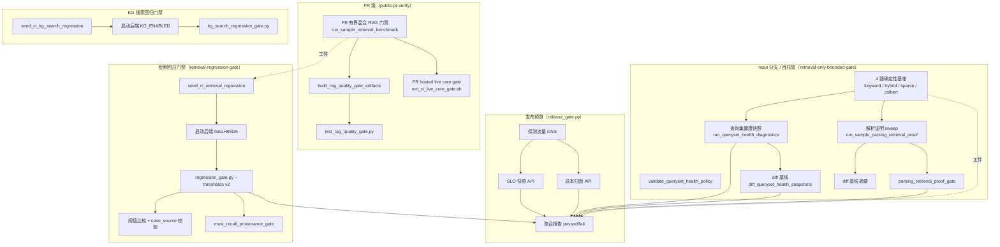
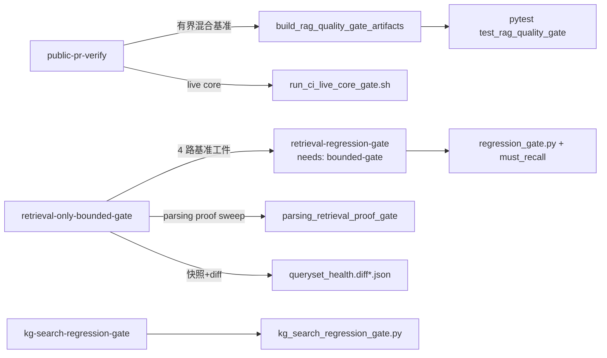

MimirQ 将质量门禁从"单一回归测试"演进为**四道可组合防线**：检索阈值（离线 Golden 回归 + 确定性有界基准）、解析证明（parsing→retrieval 闭环证据）、查询集健康（快照趋势与漂移类检测）、发布预算（SLO + 成本 + 聚合门禁）。每道防线都由**版本化 JSON 策略文件**（`ci/*.v*.json`）与**独立 gate 脚本**（`scripts/*.py`）构成，策略文件以 schema 字段锁定格式演进，gate 脚本以统一退出码契约（0=通过 / 2=门禁失败 / 1=意外错误）接入 GitHub Actions 工作流。本文档逐一拆解四道防线的配置语义、执行逻辑与治理模型。

## 架构总览：四道防线的数据流

门禁分两级执行：**PR 级**只跑轻量有界基准与 live core 冒烟（公开 runner 60 分钟超时），**main 分支级**在自托管 runner 上运行完整四路基准、解析证明、查询集健康快照与回归门禁（`retrieval-only-bounded-gate`、`retrieval-regression-gate`、`kg-search-regression-gate` 三个任务构成依赖链）。Sources: [ci.yml](.github/workflows/ci.yml#L27-L210)、[ci.yml](.github/workflows/ci.yml#L584-L783)、[ci.yml](.github/workflows/ci.yml#L1341-L1627)

## 第一道防线：检索阈值

检索阈值的核心文件是 `ci/retrieval_thresholds.v2.json`，schema 为 `mimirq.thresholds.v2`。它同时承载**两种用途**：一是面向完整回归运行的 v2 结构化阈值（`metrics` + `slices` 双维度），二是面向 CI 确定性基准的四个 `ci_retrieval_only_bounded_gate_*` 子配置（keyword / hybrid / sparse / colbert 各对应一个 fixture，`top_k=5`，阈值全部为 `1.0` 硬性要求）。v2 格式通过 `parse_thresholds_config()` 兼容旧版 v1 的 `{"metric": 0.3}` 扁平写法，并支持 `dataset_id` 防错配守卫——若阈值文件声明的 dataset_id 与运行不一致则直接拒绝。Sources: [retrieval_thresholds.v2.json](ci/retrieval_thresholds.v2.json#L1-L82)、[regression_gate.py](scripts/regression_gate.py#L345-L371)、[regression_gate.py](scripts/regression_gate.py#L1420-L1423)

阈值比较逻辑集中在 `check_thresholds()`：先逐项校验顶层 `metrics`（缺失指标即失败），再遍历 `slices` 中的维度（`file_type`、`language`）与桶（`md/pdf`、`en/zh`），要求运行摘要中存在对应的 `retrieval_slices[dim].buckets[]` 结构，缺失维度或桶同样判失败。这意味着阈值文件不只是数值约束，还**约束了回归运行的输出结构**。`min`/`max` 双向比较均受支持，`abstain_rate` 这类指标用 `max` 语义封顶。Sources: [regression_gate.py](scripts/regression_gate.py#L846-L933)、[retrieval_thresholds.v2.json](ci/retrieval_thresholds.v2.json#L4-L17)

| 门禁类型 | 配置来源 | 关键阈值 | 执行脚本 |
|---|---|---|---|
| 检索回归（完整） | `retrieval_thresholds.v2.json` | recall / hit@20 / MRR / NDCG@20 ≥ 1.0，abstain_rate ≤ 0 | `regression_gate.py` |
| 有界基准（keyword/hybrid/sparse/colbert） | 同文件的 4 个 `ci_retrieval_only_bounded_gate_*` | hit@k / MRR / NDCG@k ≥ 1.0 | `run_sample_retrieval_benchmark.py` |
| KG 搜索回归 | `kg_search_thresholds.v1.json` | baseline_hit_rate / MRR / recall ≥ 1.0 | `kg_search_regression_gate.py` |
| 答案质量（PR 级） | `answer_quality_thresholds.v1.json` | faithfulness_det ≥ 0.15，refusal_correctness ≥ 0.7 | `build_rag_quality_gate_artifacts.py` + pytest |

回归门禁还支持**从运行摘要自动生成阈值**（`--generate-thresholds-out`），将当前运行作为基线固化；`case_source` 溯源机制会将回归用例的来源字段（如 plugin golden 的 `plugin_ref`、`plugin_package_hash`）钉入阈值文件，后续运行若 case 来源漂移则报不匹配——防止"换了一批更简单的题还声称通过"。Sources: [regression_gate.py](scripts/regression_gate.py#L934-L1010)、[regression_gate.py](scripts/regression_gate.py#L1689-L1717)、[kg_search_thresholds.v1.json](ci/kg_search_thresholds.v1.json#L1-L11)、[answer_quality_thresholds.v1.json](ci/answer_quality_thresholds.v1.json#L1-L22)

## 第二道防线：解析证明（Parsing Proof）

解析证明回答一个精确问题：**更强的解析是否在确定性、可审查的层面改善下游检索**。它不是解析质量评测，而是把"解析→切块→检索"串成闭环：用 `tests/fixtures/parsing_retrieval_proof/` 下的 21 个用例（42 条查询）构造 fixture，经批量解析后执行确定性检索，产出 `hit_at_k_mean` 与 `mrr_mean` 两个必选指标，基线要求均为 **1.0**（当前 `parsing_retrieval_proof_summary_baseline.v1.json` 中 21 个 case 全部满分）。用例族覆盖 `document=9`、`layout=3`、`specialty=5`、`table=4`，含跨页表格、水印扫描件、手写倾斜笔记、条形码/QR 等 20 类解析难点。Sources: [parsing_proof_policy.md](docs/guides/parsing_proof_policy.md#L1-L40)、[parsing_retrieval_proof_summary_baseline.v1.json](ci/parsing_retrieval_proof_summary_baseline.v1.json#L1-L44)、[parsing_retrieval_proof_thresholds.v1.json](ci/parsing_retrieval_proof_thresholds.v1.json#L1-L14)

执行编排由 `run_sample_parsing_retrieval_proof.py` 完成：构建批次规格（`build_batch_spec`，默认 `parser_backend=basic`、`top_k=1`、`retrieval_mode=keyword`）→ 批量运行 → 汇总 summary → 门禁评估（`parsing_retrieval_proof_gate.py`，schema 严格校验，缺失必选指标即 `missing_metric` 失败）→ 与基线 diff → 生成 `review.md` 审查文档。整个流水线产出 11 类工件（`parsing_proof_batch.spec.json`、各 case 的 `*.fixture.json`/`*.report.json`、`summary.json`、`gate.json`、`diff.json`、`diff.md`、`review.md`），门禁失败退出码为 2。Sources: [run_sample_parsing_retrieval_proof.py](scripts/run_sample_parsing_retrieval_proof.py#L20-L80)、[parsing_retrieval_proof_gate.py](scripts/parsing_retrieval_proof_gate.py#L18-L148)

解析证明最具设计特色的是**三阶段灰度推广**（staged rollout）：`ci/parsing_retrieval_proof_rollout.v1.json` 定义了 `informational → warn → fail` 三级，当前处于 `informational`（只产出证据不阻塞）。从 informational 提升到 warn 需要满足 `stable_sample_corpus`、`baseline_update_process`、`owner_agreement`、`low_noise_history` 四项要求；从 warn 到 fail 还需追加 `release_surface_reviewable`。配套的 `governance.v1.json` 声明了 owner 角色（parsing / retrieval / release-quality）与推广前置条件，`validate_parsing_retrieval_proof_rollout.py` 在 CI 中强制校验配置合法性——Makefile 的 `verify` 目标会先跑 `check-parsing-proof-governance` 与 `check-parsing-proof-rollout`。Sources: [parsing_retrieval_proof_rollout.v1.json](ci/parsing_retrieval_proof_rollout.v1.json#L1-L30)、[parsing_retrieval_proof_governance.v1.json](ci/parsing_retrieval_proof_governance.v1.json#L1-L27)、[Makefile](Makefile#L563-L577)、[validate_parsing_retrieval_proof_rollout.py](scripts/validate_parsing_retrieval_proof_rollout.py#L20-L48)

## 第三道防线：查询集健康

查询集健康（queryset health）把确定性基准的输出转化为**可对比的历史快照**。策略文件 `ci/queryset_health_policy.v1.json` 定义八个阈值：三个指标跌幅阈值（hit@k / MRR / NDCG 各 0.03）、p95 延迟回归阈值（20ms）、miss 率回归阈值（0.05）、weak hit 率回归阈值（0.08）、weak hit 的 reciprocal rank 判定线（0.2）、hard cases 上限（5）。策略文件经 `validate_queryset_health_policy.py` 严格校验（未知键直接报错、数值域约束），归一化后写入快照。Sources: [queryset_health_policy.v1.json](ci/queryset_health_policy.v1.json#L1-L11)、[queryset_health_service.py](app/services/queryset_health_service.py#L20-L31)、[validate_queryset_health_policy.py](scripts/validate_queryset_health_policy.py#L14-L50)

快照构建的核心在 `app/services/queryset_health_service.py` 的 `build_queryset_health_snapshot()`。它聚合四层信息：**metrics**（汇总指标 + 延迟）、**risk**（逐 case 判定 miss 与 weak hit，按 `(hit_at_k, reciprocal_rank, ndcg, -latency)` 排序选出 top-N hard cases）、**trend**（与上一快照的六项 delta + `policy_changed` 标志）、**degradation_flags**（六类退化标志，任一触发则 `status=degraded`）。快照 schema 为 `mimirq.queryset_health_snapshot.v1`，基线文件（keyword / hybrid / sparse 三个）当前全部为 `healthy` 且 5 个 case 全满分。Sources: [queryset_health_service.py](app/services/queryset_health_service.py#L181-L350)、[queryset_health_snapshot_baseline.v1.json](ci/queryset_health_snapshot_baseline.v1.json#L1-L90)

快照的**趋势对比**由两条路径完成：`run_queryset_health_diagnostics.py` 在构建快照时读取历史 JSONL（`--history`），维护上限 90 条的时序记录；`diff_queryset_health_snapshots.py` 将当前快照与基线 diff，产出三类漂移域——`hard_case_drift`（新增/移除/保留的 hard case ID）、`degradation_flags_drift`、`parse_risk_tail_drift`（解析风险文档集合的增减），外加指标 delta 与策略哈希漂移。这份 diff 正是发布预算门禁中 `queryset_health_diff` 的输入。Sources: [run_queryset_health_diagnostics.py](scripts/run_queryset_health_diagnostics.py#L54-L150)、[diff_queryset_health_snapshots.py](scripts/diff_queryset_health_snapshots.py#L27-L120)、[queryset_health_service.py](app/services/queryset_health_service.py#L352-L391)

## 第四道防线：发布预算

`ci/release_gate_budgets.v1.json` 是发布预算的单一事实来源，`scripts/release_gate.py` 将其与三类运行时信号聚合为一次通过/失败决策。发布门禁的设计约束写在脚本 docstring 中：**只通过 HTTP 访问后端（不碰 DB）、按构造即 PII 安全（消费已脱敏的数值/分类汇总）**。它支持两种运行模式：CI 中先跑检索回归再 `--skip-regression` 用探测流量验证 SLO + 成本预算；staging 中 `--skip-probe` 直接消费已有指标日志。Sources: [release_gate.py](scripts/release_gate.py#L1-L17)、[release_gate_budgets.v1.json](ci/release_gate_budgets.v1.json#L1-L77)

预算文件按五个区域组织，每区都有独立的 `policy`（`fail` 或 `warn`）与阈值：

| 区域 | policy | 关键阈值 | 语义 |
|---|---|---|---|
| `slo` | fail（数据不足也 fail） | 60/1440 分钟窗口：retrieval_p95 ≤ 5s、p99 ≤ 15s、zero_hit_rate ≤ 0.25、error_rate ≤ 0.05；min_rag_trace_count=2 | 检索延迟与命中质量 |
| `cost` | fail | llm_total_tokens_avg ≤ 1500、llm_prompt_tokens_avg ≤ 1450、embed_query_tokens_avg ≤ 80、retrieval_query_count_avg ≤ 2 | 单次对话的 token/查询成本代理 |
| `queryset_health` / `_hybrid` | warn | 仅消费策略元数据（policy_hash、policy_changed） | 区分"质量漂移"与"策略编辑" |
| `queryset_health_diff` / `_hybrid` | **fail** | hard_case_added_count ≤ 0、degradation_flag_added_count ≤ 0、parse_risk_tail_added_count ≤ 0 | 不允许新增 hard case 或退化 |
| `parsing_proof` / `_diff` | warn | hit_at_k_mean ≥ 1.0、mrr_mean ≥ 1.0、failed_case_count ≤ 0；delta ≥ 0 | 解析证明当前仅信息性 |

`release_gate.py` 的每个 `_gate_*` 函数都返回 `(violations, notes, observed)` 三元组，violations 只有在 policy=fail 时才升级为整体失败；`warn` 只写 stderr 警告并保留在报告中。最终报告包含全部区域的 observed 明细、notes 与 violations，同时支持 JSON 与 Markdown 两种输出。退出码契约：0=通过、2=预算违规、1=意外错误（网络/解析）。Sources: [release_gate.py](scripts/release_gate.py#L300-L399)、[release_gate.py](scripts/release_gate.py#L540-L731)、[release_gate.py](scripts/release_gate.py#L1447-L1486)

发布门禁还包含**可选扩展区**：`retrieval_leaderboard` 支持消费 `retrieval_ablation.py` 的 leaderboard 工件，取 top_n 行中 MRR 最高者做阈值比较。此外 `live_core_release_gate.py` 构成独立的运行时防线，验证六类真实行为：ready 探活→主租户上传→证据检索、重复上传幂等（同字节+同 pipeline 得同一 document id）、串行 vs 并发检索吞吐对比、跨租户检索隔离、dataset-analysis PNG 导出的跨实例共享状态、以及 PNG worker 超时后的 failed/worker_lost 状态。`run_ci_live_core_gate.sh` 同时拉起主/备两个 uvicorn 实例（8000/8001）并在 PR 与 docker-build 任务中执行。Sources: [release_gate.py](scripts/release_gate.py#L468-L539)、[live_core_release_gate.py](scripts/live_core_release_gate.py#L1-L60)、[run_ci_live_core_gate.sh](scripts/run_ci_live_core_gate.sh#L1-L85)

## CI 编排与防漂移契约

四道防线在 GitHub Actions 中的编排呈现清晰的**依赖分层**。PR 级 `public-pr-verify` 只跑轻量路径（混合有界基准 + 答案质量工件 + 双实例 live core）；main 分支级 `retrieval-only-bounded-gate` 在自托管 runner 上跑四路确定性基准（keyword / hybrid / sparse / colbert，sparse 与 colbert 用 `deterministic` provider 保证离线可复现）、解析证明 sweep 与门禁、三路查询集健康快照 + 三路 diff（含 sparse）；`retrieval-regression-gate` 依赖 bounded gate 的工件，用真实后端（faiss + BM25 + 离线 reranker + `EMBEDDING_PROVIDER=deterministic_test`）执行 `regression_gate.py`，并追加 `must_recall_provenance_gate`；`kg-search-regression-gate` 独立启动 `KG_ENABLED=true` 后端执行 KG 搜索回归。Sources: [ci.yml](.github/workflows/ci.yml#L584-L783)、[ci.yml](.github/workflows/ci.yml#L1341-L1627)

工作流契约由 `tests/test_ci_workflow_contracts.py` 守护：断言 `retrieval-only-bounded-gate` / `retrieval-regression-gate` / `kg-search-regression-gate` 的超时分钟数、自托管 bootstrap 脚本的固定模式、seed 入口点在 app 导入前完成仓库引导——防止 CI 配置在无人注意时漂移。解析证明另有独立工作流 `parsing-proof-sample.yml`（手动触发）与 `parsing-proof-nightly.yml`（每日 04:00 UTC，即北京时间 12:00）持续监控；`rag-quality-gate.yml` 则将答案质量门禁与解析证明 sweep 打包为可按需触发的组合任务。Sources: [test_ci_workflow_contracts.py](tests/test_ci_workflow_contracts.py#L1-L60)、[parsing-proof-nightly.yml](.github/workflows/parsing-proof-nightly.yml#L1-L65)、[rag-quality-gate.yml](.github/workflows/rag-quality-gate.yml#L1-L93)

## 治理模型与本地使用

四道防线共享同一治理哲学：**策略即代码、证据可审查、推广需审批**。查询集健康与解析证明的策略变更都通过 `policy_hash` 追踪——快照记录 `policy_source`（`policy_json` / `cli_overrides` / 组合）与 `policy_hash`，release gate 在 `trend.policy_changed=true` 时能区分"质量真实退化"与"只是改了阈值"两种信号，避免把策略编辑误报为回归。解析证明的 `rollout.json` 进一步把"informational→warn→fail"的升级条件写成机器可校验的清单。Sources: [queryset_health_service.py](app/services/queryset_health_service.py#L254-L330)、[release_gate.py](scripts/release_gate.py#L540-L590)、[parsing_retrieval_proof_rollout.v1.json](ci/parsing_retrieval_proof_rollout.v1.json#L1-L30)

本地复现入口全部收敛到 Makefile：`make parsing-proof-sample` 一键跑完整解析证明 sweep；`make verify` 会先跑 `check-queryset-health-policy`、`check-parsing-proof-governance`、`check-parsing-proof-rollout` 三个配置校验再进入 lint/typecheck；`make live-core-release-gate` 触发双实例运行时门禁。发布前推荐按 `docs/guides/release_gate.md` 的三步走：先跑检索回归门禁（`--thresholds ci/retrieval_thresholds.v2.json`），再以 `--skip-regression` 消费 SLO/成本信号，最后用 `--budgets ci/release_gate_budgets.v1.json` 聚合所有工件做最终裁决。Sources: [Makefile](Makefile#L419-L425)、[Makefile](Makefile#L563-L577)、[release_gate.md](docs/guides/release_gate.md#L87-L130)

---

**延伸阅读**：检索阈值的运行数据来自 [评测体系：Golden 回归、Recall/MRR 指标与 800 题基准](23-ping-ce-ti-xi-golden-hui-gui-recall-mrr-zhi-biao-yu-800-ti-ji-zhun)；解析证明的工件最终进入 [回归套件与证据管理：回归运行、消融实验与证据胶囊](25-hui-gui-tao-jian-yu-zheng-ju-guan-li-hui-gui-yun-xing-xiao-rong-shi-yan-yu-zheng-ju-xiao-nang)；运行时的 SLO/成本信号来自 [可观测性与链路追踪：Prometheus 指标、OpenTelemetry 与 Phoenix](30-ke-guan-ce-xing-yu-lian-lu-zhui-zong-prometheus-zhi-biao-opentelemetry-yu-phoenix)。