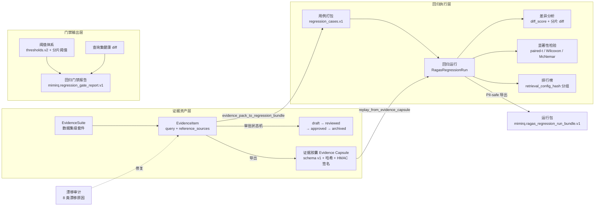
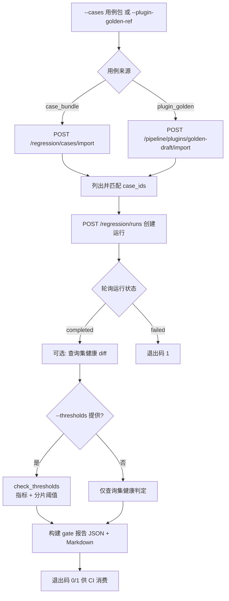

本页深入剖析 MimirQ 质量保证体系中的两条闭环：**回归套件**（用例打包 → 回归运行 → 差异分析 → 门禁判定）与**证据管理**（证据套件 → 证据胶囊 → 漂移审计 → 证据回灌）。这两条链路共享同一套 ground-truth 资产（`reference_sources` 证据指针），将"人工标注的期望答案"转化为"可持续执行的 CI 质量门禁"，并确保每一次检索行为都可复核、可回放、可证明。

## 架构总览：回归与证据的双闭环

从服务层来看，这套体系呈现出"证据生产 → 回归执行 → 差异判定 → 门禁输出"的流水线结构。证据管理侧负责维护**带审批状态机的地面真值资产**（EvidenceSuite/EvidenceItem），回归侧则把这些资产转化为可重复执行的 RAGAS 回归运行，并在运行间做统计显著的差异分析。

两条闭环在此交汇：**证据 → 用例 → 回归 → 门禁**是正向流水线，**回归 → 差异 → 漂移 → 修复**是反向反馈环。核心设计约束贯穿始终——**PII 安全**（默认只导出哈希与长度，不导出原文）与**有界操作**（所有批量操作都有 max_* 上限保护）。

Sources: [evaluation.py](app/models/evaluation.py#L74-L141)、[evidence.py](app/models/evidence.py#L20-L94)

## 数据模型：回归用例、运行与证据实体

### 回归侧：三层结构

回归侧采用"用例 → 运行 → 运行条目"三层模型。`RagasRegressionCase` 是固定问题集，通过 `reference_sources`（文档 ID + 切块 ID 指针）与证据侧共享同一套引用结构；`RagasRegressionRun` 记录一次执行（status、metrics、params、summary 均为 JSONB 快照）；`RagasRegressionItem` 保存每个用例的逐条结果（question、response、scores、meta）。

关键设计是 **`params` 与 `summary` 的 JSONB 快照**：运行参数与聚合指标全部冗余在运行行内，使后续的差异分析、排行榜与门禁判定都无需回放原始请求即可独立工作。`RagasRegressionItem.meta` 字段为消融实验、证据胶囊与 must-recall 溯源信息预留了扩展位。

### 证据侧：审批状态机

`EvidenceSuite` 是数据集级（`dataset_id` 必填）的证据集合，归档采用 `archived_at` 软删除以保审计性。`EvidenceItem` 承载 query + `reference_sources`，并带有**四态审批流**（draft → reviewed → approved → archived），每个状态迁移都记录操作者与时间戳（`reviewed_by/approved_by/archived_by` + 对应时间）。`retrieval_snapshot` 与 `rag_config_snapshot` 是"尽力而为的可复现快照"，`regression_case_id` 字段则把证据条目与回归用例显式关联起来。

| 维度 | 回归侧模型 | 证据侧模型 |
| --- | --- | --- |
| 聚合单元 | RagasRegressionRun（一次执行） | EvidenceSuite（数据集级集合） |
| 明细单元 | RagasRegressionItem（每用例结果） | EvidenceItem（query + 证据指针） |
| 状态 | pending/running/completed/failed | draft/reviewed/approved/archived |
| 关键字段 | params/summary/scores/meta | reference_sources/retrieval_snapshot/regression_case_id |
| 生命周期 | 保留策略清理（有界删除） | 软归档（archived_at） |

Sources: [evaluation.py](app/models/evaluation.py#L74-L141)、[evidence.py](app/models/evidence.py#L20-L94)

## 回归运行生命周期：从用例打包到运行导出

### 用例打包与导入规划

`regression_case_bundle.py` 提供数据集级用例打包（`mimirq.regression_cases.v1`），导出时**刻意省略内部标识符**（case id / tenant id）以增强可移植性，并强制校验所有用例必须属于同一 dataset_id。打包时保留 `reasoning_hops`（最多 20 跳）与 `evidence_chain`（最多 20 项）——这些是多跳检索回归的关键元数据。

导入规划 `plan_case_import` 以 **(dataset_id + question.strip()) 作为稳定主键**做 upsert 决策，返回 created/updated/skipped 三分类计数。一个值得注意的防护：`review_only` 且 `reference_source_mode=local_sample_synthetic` 的本地样例项**禁止导入**，防止合成数据污染生产黄金用例集。

### 运行作用域校验

`regression_run_scope.py` 在创建运行前执行两道防线：`MissingCasesError`（请求的用例不存在）与 `DatasetMismatchError`（用例不属于目标数据集）。这防止了跨数据集混用黄金用例——在 RAG 系统中，跨库引用是检索指标失真的常见来源。

### PII 安全的运行包导出

`regression_run_bundle.py` 的 `export_regression_run_bundle` 是运行结果对外共享的唯一出口，其默认行为值得细读：

- **默认 PII 安全**：只含 question/response 的 `stable_hash` + 字符长度，不含原文
- **引用白名单**：citations 经 `sanitize_citations_for_capture` 清洗，只保留允许列表键（不含 chunk_content / document_name）
- **ID 脱敏**：run_id、tenant_id、dataset_id、case_id 全部以 16 位哈希替代
- **稳定排序**：条目按 case_id_hash + question_hash 排序，保证差异对比的确定性
- **守卫约束**：`include_contexts` 强制要求 `include_text=true`（上下文天然含 PII）

`include_contexts` 的守卫约束体现了"默认安全、显式放开"的纵深防御原则——文本与上下文的导出是逐级授权而非一次到位。

Sources: [regression_case_bundle.py](app/services/regression_case_bundle.py#L44-L91)、[regression_run_scope.py](app/services/regression_run_scope.py#L16-L54)、[regression_run_bundle.py](app/services/regression_run_bundle.py#L53-L158)

## 差异分析与显著性检验：让"变了多少"可计算

### 汇总级 diff 与加权 diff_score

`regression_run_diff.py` 对两个运行的 summary JSONB 做纯函数式对比，输出三层结构：

1. **metric_diffs**：所有可数值化指标的 before/after/delta，按 delta 绝对值降序排列
2. **diff_score**：一个紧凑的加权综合分，权重表 `_DIFF_SCORE_WEIGHTS_V1` 刻意偏向**确定性信号**——`faithfulness_det`（0.35）、`refusal_correctness`（0.25）等无需 LLM 即可计算的指标权重最高，检索类指标（NDCG@10、Recall 各 0.2）次之。关键设计是**只用两边的指标交集**计算，保证 base_score 与 target_score 可比
3. **slice_diffs**：按 file_type、language、directory、access_mode、hit_type、quality、pipeline_hash 七个维度分桶对比——这使差异分析能从"整体指标波动"下沉到"哪个文件类型/语言/质量桶在退化"

### 用例配对统计：三重检验 + Bootstrap + BH 校正

`regression_run_significance.py` 是统计严谨性的核心。它按 case_id 配对两个运行的逐条分数，对每个指标输出：

| 检验方法 | 适用场景 | 实现要点 |
| --- | --- | --- |
| paired t（正态近似） | 连续分数 | z = mean_delta / (stdev/√n)，用 erfc 求双尾 p |
| Wilcoxon 符号秩 | 非正态分布 | n≤15 精确枚举，否则正态近似 |
| McNemar | 二值指标（0/1） | 仅对 0/1 对计算，含连续性校正 |
| Bootstrap CI | 分布未知 | **确定性重采样**（SHA-256 种子），50~5000 次迭代 |
| BH 校正 | 多重比较 | 对全部指标 p 值统一 FDR 校正，`significant = p_bh < 0.05` |

`_deterministic_bootstrap_index` 用 `sha256(metric_key:iteration:offset)` 生成索引，保证同一数据重复运行得到完全相同的置信区间——这是 CI 报告可复现性的根基。每个用例的差异被归类为"改善/退化/无明显变化"（阈值 ±0.05），并输出每用例的逐指标 delta 供人工复核。

Sources: [regression_run_diff.py](app/services/regression_run_diff.py#L43-L120)、[regression_run_significance.py](app/services/regression_run_significance.py#L32-L148)

## 回归门禁：阈值体系与 CI 集成

`scripts/regression_gate.py`（1793 行）是整个回归套件的执行中枢，它把"用例导入 → 运行创建 → 轮询 → 阈值判定 → 报告输出"串成一条 CI 可调用的命令行流水线。

### 阈值体系：v1 扁平与 v2 结构化

阈值配置支持两代格式。`parse_thresholds_config` 兼容 v1 扁平结构（metric → {min,max}）与 v2 结构化（含 `dataset_id`、`case_source` 与分层 slices）。`check_thresholds` 逐指标校验 min/max 边界，并对 `retrieval_slices` 做**分片阈值**——每个维度的每个 bucket 都可独立设定指标边界，缺失分片维度也会被记为失败。

两道防误用护栏值得注意：

1. **thresholds dataset_id 匹配**：阈值文件中的 dataset_id 若与当前运行不一致直接拒绝，防止跨数据集误用基线
2. **case_source 匹配**：`compare_threshold_case_source` 对比阈值文件声明的用例来源与本次实际用例来源，不匹配即失败——确保阈值只对"同源黄金用例"生效

### 基线生成与门禁报告

`generate_thresholds_from_summary` 可从一次基线运行自动生成阈值配置：对每个指标用 `rel_drop`（默认 5%）与 `abs_slack`（默认 2%）计算下界，分片 bucket 少于 `min_slice_items`（默认 5）则跳过，全部值钳制在 [0,1]。生成的配置写入时若已存在会输出 unified diff 并要求 `--gen-force` 覆盖。

门禁报告（`mimirq.regression_gate_report.v1`）聚合三类信号：**阈值判定**（pass/fail/error 三态）、**通道归因**（vector/bm25/lexical/sparse/multi 各渠道引用计数）、**多跳诊断**（路径完整性、顺序一致性、链命中率）。可选接入查询集健康 diff（基线快照 vs 当前快照的退化标志），并渲染为 Markdown 报告供 PR 评论或 CI 摘要使用。

Sources: [regression_gate.py](scripts/regression_gate.py#L846-L900)、[regression_gate.py](scripts/regression_gate.py#L1012-L1108)、[regression_gate.py](scripts/regression_gate.py#L683-L726)

## 消融实验：网格展开与夜间批处理

消融实验是验证"哪个检索配置贡献了哪些效果"的系统化手段，由两层构成：**确定性网格展开**（`regression_run_ablation_batch.py`）与**夜间批处理执行器**（`run_nightly_ablations.py`）。

### 有界笛卡尔网格

`expand_ablation_grid` 将配置网格展开为变体字典列表，硬性约束包括：

- `max_combinations` 默认 50（展开过程中实时截断，超限即报错）
- 禁键保护：`dataset_id`、`case_ids`、`metrics`、`grid`、`max_combinations` 不可作为网格维度
- 值类型白名单：仅 None/str/int/float/bool/dict，排除 list 嵌套的爆炸性组合

### 夜间消融集

`run_nightly_ablations.py` 定义了 8 个工业级默认消融变体，覆盖检索策略空间的关键维度：

| ablation_key | 变更点 | 验证目标 |
| --- | --- | --- |
| baseline | 默认 hybrid + RRF | 对照基准 |
| topk50 | top_k=50 | 召回窗口敏感性 |
| keyword_only / vector_only | 单通道检索 | 通道贡献上限 |
| profile_recall50 | retrieval_profile=recall50 | Profile 覆盖层 |
| fusion_linear | fusion_strategy=linear | 融合策略对比 |
| sparse_budgeted_rrf / sparse_bounded_slice | budgeted_rrf + 稀疏预算 | 稀疏通道预算分配 |

执行器遵守"**默认有界**"原则：默认 retrieval-only 模式（不调用 LLM，成本趋近于零）、`--max-datasets`（默认 10）、`--max-cases`（默认 50）、`--skip-empty-contexts` 默认开启。每个运行在 `params` 中写入 `nightly: true` 与 `ablation_key` 供审计追溯，可用 `--cases` 锁定用例包以保证跨夜可比性，或以 `--dry-run` 先行规划。

Sources: [regression_run_ablation_batch.py](app/services/regression_run_ablation_batch.py#L14-L51)、[run_nightly_ablations.py](scripts/run_nightly_ablations.py#L149-L237)

## 证据管理：套件、覆盖率与吞吐量

### 套件覆盖热力图

`evidence_dashboard.py` 的 `compute_suite_coverage` 把套件内的证据指针按**四个维度**分桶统计（language、file_type、quality_bucket、channel），每桶输出"唯一证据条目数 + 引用指针数"双指标；同时生成 language × file_type 的**覆盖热力图**（z 轴为条目数），帮助识别证据资产的分布盲区——例如某语言覆盖极高但某文件类型缺失。channel 维度通过 `retrieval_snapshot.citations` 的 hit_type 映射（vector/keyword/hybrid/mmr/tag/image/table），低基数归一化保证兼容旧数据。

### 吞吐量与前置时间

`compute_suite_throughput` 计算 7 天窗口内的创建/评审/批准计数，以及三条**前置时间**路径（draft→reviewed、reviewed→approved、draft→approved）的 p50/p90/均值（秒）。这些指标量化了"证据资产的生产效率"——审批流如果长期阻塞在 reviewed 状态，意味着黄金用例的供给跟不上回归需求。

Sources: [evidence_dashboard.py](app/services/evidence_dashboard.py#L87-L154)、[evidence_dashboard.py](app/services/evidence_dashboard.py#L202-L307)

## 证据胶囊：可验证的检索证据快照

证据胶囊（Evidence Capsule）是**单次检索行为的防篡改快照**，由 `app/rag/core/evidence_capsule_builder.py` 构建，schema 为 `mimirq.evidence_capsule.v1`。

### 胶囊结构

一次检索后，`build_evidence_capsule` 将检索结果封装为七段结构：

1. **query_for_retrieval**：检索查询原文
2. **retrieval_summary**：检索模式、配置哈希、引用数、top 相关性、abstain 状态
3. **must_recall**：必召回检查的状态/通过与否/缺失键/锚点字段缺失计数
4. **retrieval_contract**：检索契约模式、策略、硬回退与二次召回使用标记
5. **quality**：解析风险等级/分数/质量门禁拦截状态
6. **citations**：经 `_sanitize_citation` 白名单清洗的引用（仅保留结构性字段，不含内容）
7. **retrieval_trace / query_debug**：可选的检索追踪与调试上下文

### 完整性：双重哈希 + HMAC 签名

胶囊的防篡改设计分三层：

- **evidence_anchor_hash**（16 位）：每个引用的锚点字段（document_id、chunk_id、page_number、chunk_index、start/end_char、table 字段等）的稳定哈希
- **citation_hash**（16 位）：单条清洗后引用的哈希（排除自身 hash 字段后计算）
- **capsule_hash**（24 位）：整个胶囊载荷的哈希（排除 capsule_hash 与 signature 后计算）

`validate_evidence_capsule` 在 strict 模式下逐层校验：先验 capsule_hash，再验每条引用的 anchor_hash 与 citation_hash，最后校验声明的 citation_hashes 列表与实际一致。若开启签名（`EVIDENCE_CAPSULE_SIGNING_ENABLED`），胶囊还会附上 **HMAC-SHA256 签名**（48 位，密钥来自 `EVIDENCE_CAPSULE_SIGNING_SECRET`），验证时 `verify_evidence_capsule_signature` 重算比对，任何字段被篡改都会导致签名失配。

### 存储与租户隔离

`app/api/v1/evidence_capsules.py` 提供胶囊的持久化端点，存储目录为 `./runs/evidence_capsules/{tenant_id}/{capsule_id}.json`。安全模型严格：胶囊 ID 需匹配 `^[A-Za-z0-9][A-Za-z0-9._-]{5,127}$` 正则；写入时使用 `os.O_EXCL` 原子创建防覆盖；读取时强制校验胶囊内嵌的 `tenant_id`/`owner_account_id` 与请求者身份一致，否则 404——租户无法读取其他租户的胶囊。`tests/test_evidence_capsules_tenant_isolation.py` 专门验证了这一隔离边界。

### 回放：从胶囊到检索请求

`scripts/replay_from_evidence_capsule.py` 把胶囊还原为 `mimirq.evidence_replay.v1` 回放请求——从胶囊的 retrieval_trace 的 contract_diagnostics 中提取 must_recall proof（required_source_keys / required_anchor_fields），连同 retrieval_mode、检索契约模式、期望引用哈希一起构造成可重新提交的检索请求。这实现了"**一次证据，无限次复现**"：任何时刻都能用同一胶囊重跑同一检索，验证配置漂移或数据变更是否破坏了当时的证据链。

Sources: [evidence_capsule_builder.py](app/rag/core/evidence_capsule_builder.py#L29-L87)、[evidence_capsule_builder.py](app/rag/core/evidence_capsule_builder.py#L147-L211)、[evidence_capsules.py](app/api/v1/evidence_capsules.py#L59-L103)、[replay_from_evidence_capsule.py](scripts/replay_from_evidence_capsule.py#L21-L99)

## 证据漂移审计与修复：让证据指针保持有效

证据指针（document_id + chunk_id）会因文档重解析、切块重建、流水线升级而失效。漂移审计层负责系统化地发现并修复这些失效指针。

### 八类漂移原因

`evidence_drift_audit.py` 的 `classify_reference_source_drift` 按优先级链式判定，返回 (ok, reason, expected, observed) 四元组：

| 原因常量 | 触发条件 |
| --- | --- |
| document_missing | 文档行不存在 |
| document_dataset_mismatch | 文档不属于证据套件所在数据集（含 legacy NULL） |
| chunk_missing | 切块行不存在 |
| chunk_document_mismatch | 切块不属于其声明文档 |
| chunk_index_mismatch | 声明的 chunk_index 与当前不一致 |
| pipeline_hash_mismatch | 切块元数据的 pipeline_hash 与声明不符 |
| doc_pipeline_key_mismatch | 切块元数据的 doc_pipeline_key 与声明不符 |
| chunk_disabled | 切块已禁用（disabled_at 非空） |

审计服务（`evidence_drift_audit_service.py`）批量拉取文档与切块行（仅投影 id/索引/元数据，**绝不读取 chunk 内容**），聚合漂移率并按四个分片维度（file_type/language/quality_bucket/directory）拆解，输出每桶的漂移原因分布。`include_details` 模式下的明细也只含 ID 与计数，严格遵循 PII 安全红线。

### 有界修复

`evidence_reference_repair_service.py` 提供 best-effort 修复，参数全部有界（max_items ≤ 20000、max_refs_per_item ≤ 500、max_changes ≤ 5000）。关键设计是 **dry-run / apply 双模式**：`apply=False` 时只报告将发生的变化，`apply=True` 才落库。修复时跳过 archived 条目（除非显式包含）与 approved 条目（除非 `allow_approved`），每次变更都写入审计日志（`audit_log_event`）。修复匹配采用 `_select_quote_needle` 从引用中提取 ≥12 字符的中英文连续片段作为 LIKE 搜索针——但该片段仅内部使用，绝不进入 API 响应。

Sources: [evidence_drift_audit.py](app/services/evidence_drift_audit.py#L23-L150)、[evidence_drift_audit_service.py](app/services/evidence_drift_audit_service.py#L26-L199)、[evidence_reference_repair_service.py](app/services/evidence_reference_repair_service.py#L104-L143)

## 证据到回归的闭环：打包、导入与离线门禁

### Evidence Pack → 回归用例

`scripts/evidence_pack_to_regression_bundle.py` 把 UI 中导出的 Evidence Pack JSON（Knowledge → 检索预览）转换为 `mimirq.regression_cases.v1` 用例包，形成"**人工在检索预览中选中正确引用 → 导出为黄金用例**"的低摩擦工作流。转换时优先使用显式 `reference_sources`，缺失时从 `selected_chunk_ids` + citations 重建；引用归一化做 chunk_id 去重、quote 截断（2000 字符上限）与字段类型矫正。

### 离线回归门禁测试

`tests/test_evidence_api_offline_regression_gate.py` 验证了证据 API 的检索门禁可以在**无 LLM 的离线模式**下独立工作——这正是 `evidence_retrieve_gate.py` 存在的理由：主 RAGAS 回归运行器走 LangGraph 检索节点，而证据 API（`POST /api/v1/rag/retrieve`）是下游"证据发现"系统的独立稳定契约，必须能被独立门禁。`compute_retrieval_item_meta` 为每个用例计算 retrieval_recall/MRR/Hit@K 等指标，并内联构建+严格校验证据胶囊，把 `provenance_integrity_passed/status` 写入条目元数据；`build_retrieval_gate_summary` 聚合出 CI 可消费的汇总（含 abstain 率）。

### 排行榜与运行保留

`regression_leaderboard.py` 提供 PII 安全的运行排名：按指定 metric_key 降序排列，并附加 `retrieval_config_hash`（由 `build_retrieval_config_fingerprint` 对检索配置全量指纹化，覆盖模式/融合/重排/稀疏/ColBERT/证据后重排/查询改写等 30+ 维度），使仪表盘可按配置分组对比。`regression_run_retention.py` 提供有界清理：仅删除 completed/failed 且 `finished_at` 早于 cutoff 的运行，`max_delete` 硬上限 5000，先 `plan` 后 `purge` 的模式避免误删。

Sources: [evidence_pack_to_regression_bundle.py](scripts/evidence_pack_to_regression_bundle.py#L74-L193)、[evidence_retrieve_gate.py](app/rag/evaluation/evidence_retrieve_gate.py#L30-L128)、[regression_leaderboard.py](app/services/regression_leaderboard.py#L67-L178)、[regression_run_retention.py](app/services/regression_run_retention.py#L45-L110)

## 设计模式总结

纵观全链，这套体系反复实践了四个可复用的架构模式：

| 模式 | 实例 | 工程价值 |
| --- | --- | --- |
| **PII 默认脱敏** | 运行包导出（哈希+长度）、胶囊引用白名单、审计明细只含 ID | 证据资产可跨团队/跨系统共享而不泄露内容 |
| **有界操作** | max_combinations=50、max_delete≤5000、max_items≤20000 | 防止批量任务在配置错误时造成灾难性影响 |
| **确定性可复现** | Bootstrap 种子化、胶囊双重哈希、stable_json_hash | 同一输入永远产生同一输出，CI 报告可信 |
| **双模式执行** | 修复 apply/dry-run、门禁 --dry-run/--execute、计划/执行分离 | 高风险操作先预览后执行 |

## 延伸阅读

本页处于"质量保证与评测"板块的收尾位置。建议按以下路径延伸：

- 回归门禁依赖的**指标定义与 800 题基准**见 [评测体系：Golden 回归、Recall/MRR 指标与 800 题基准](23-ping-ce-ti-xi-golden-hui-gui-recall-mrr-zhi-biao-yu-800-ti-ji-zhun)
- 门禁脚本集成的**查询集健康、解析证明与发布预算策略**见 [CI 质量门禁：检索阈值、解析证明、查询集健康与发布预算策略](24-ci-zhi-liang-men-jin-jian-suo-yu-zhi-jie-xi-zheng-ming-cha-xun-ji-jian-kang-yu-fa-bu-yu-suan-ce-lue)
- 证据胶囊与 must-recall 机制所依赖的**检索编排与证据缺口补全**见 [检索编排与上下文扩展：二次召回、查询改写与证据缺口补全](18-jian-suo-bian-pai-yu-shang-xia-wen-kuo-zhan-er-ci-zhao-hui-cha-xun-gai-xie-yu-zheng-ju-que-kou-bu-quan)
- 消融实验变更的**混合检索与融合策略**见 [混合检索与融合策略：向量、稀疏检索与 RRF 融合](16-hun-he-jian-suo-yu-rong-he-ce-lue-xiang-liang-xi-shu-jian-suo-yu-rrf-rong-he)
- 前端对证据套件与回归报告的可视化呈现见 [知识工作台与图谱可视化：检索面板、向量星云与关系图](27-zhi-shi-gong-zuo-tai-yu-tu-pu-ke-shi-hua-jian-suo-mian-ban-xiang-liang-xing-yun-yu-guan-xi-tu)