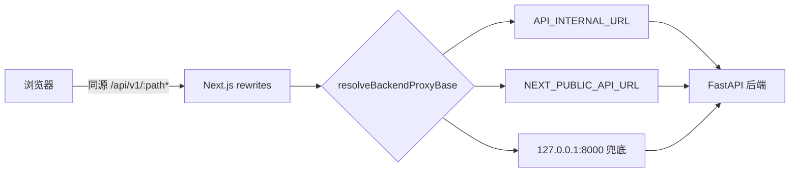
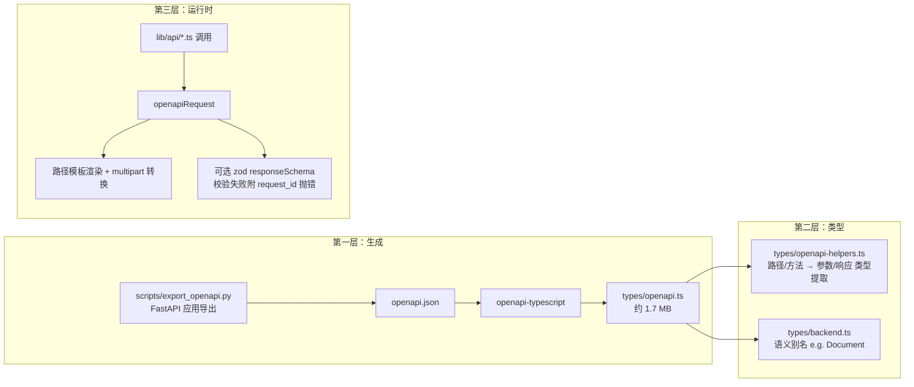

MimirQ 的前端位于 `web/` 目录，是一个基于 **Next.js 16（App Router）+ React 19 + TypeScript** 的单页式企业应用外壳。本页聚焦三条主线：**双路由树如何组织页面**、**next-intl 如何承载仅中文的单语言国际化**、以及**从 OpenAPI 生成类型到运行时校验、再到静态契约检查的三层 API 契约防线**。配套的组件级细节（知识工作台、图谱可视化、解析工作台）分别在目录的其他页面展开。

## 技术栈与目录骨架

前端依赖体系可以划分为四组：渲染层（`next@16.2.11`、`react@19.2.5`、`react-dom`）、国际化（`next-intl@4.13.2`）、数据请求（`axios`、`@tanstack/react-query`、`zod@4.3.6`、`openapi-typescript`）以及可视化/交互（`@xyflow/react`、`react-force-graph-2d/3d`、`echarts`、`monaco-editor`、`pdfjs-dist`、`framer-motion`）。状态管理使用 `zustand`，服务端监控接入 `@sentry/nextjs`。构建与校验脚本统一由 `pnpm` 编排，`verify` 命令串联了 lint、UI 基线检查、类型检查、单测与 API 契约检查五道关卡。

| 关注面 | 关键依赖 | 职责 |
|---|---|---|
| 框架 | next 16.2.11 / react 19.2.5 | App Router、RSC、路由处理器、客户端组件 |
| 国际化 | next-intl 4.13.2 | 路由感知的 locale 解析、消息注入、导航助手 |
| API 客户端 | axios + zod | 拦截器、OIDC 刷新、运行时响应 Schema 校验 |
| 契约生成 | openapi-typescript 7.13.0 | 从后端 OpenAPI 导出生成类型 |
| 测试 | vitest 4.1.3 / playwright 1.59 | 运行时契约单测、e2e 冒烟、源码契约检查 |

Sources: [package.json](web/package.json#L1-L141), [README.md](web/README.md#L1-L167)

`web/app` 下并行存在两棵路由树：`[locale]/`（47 个 `page.tsx`）与根级业务目录（94 个 `page.tsx` 含 `[locale]` 内）。`lib/` 承载 API 客户端、认证、环境解析等核心逻辑；`scripts/` 存放契约检查与开发服务器包装；`types/` 存放由 OpenAPI 生成的类型及语义别名；`i18n/` 是 next-intl 的配置与消息聚合点。

```
web/
├── app/                  # App Router 双路由树
│   ├── [locale]/         #  locale 感知路由（47 页，多为 re-export）
│   ├── api/              #  Route Handlers：markdown-image / oidc / saml
│   ├── layout.tsx        #  根布局（服务端组件）
│   ├── template.tsx      #  客户端模板（页面过渡 + 管线 Provider）
│   └── <feature>/        #  各业务页面实际实现（knowledge、graph、parsing…）
├── i18n/                 # routing.ts / request.ts / navigation.ts / messages
├── lib/
│   ├── api/              #  core.ts + 34 个领域 API 模块
│   ├── openapi-request.ts#  OpenAPI 驱动的运行时请求层
│   └── env.ts            #  API Base URL 双环境解析
├── scripts/              #  api-contract / api-coverage / types-drift / dev-server
└── types/                #  openapi.ts（生成）/ backend.ts / openapi-helpers.ts
```

Sources: [get_dir_structure](web/app), [api-client.ts](web/lib/api-client.ts#L1-L133)

## App Router 双路由树：实现与 locale 分流

MimirQ 采用「**根级实现 + `[locale]` 分流**」的双路由树模式。业务页面的完整实现（含 `page.tsx`、`loading.tsx`、`error.tsx` 及局部组件）全部位于根级目录，例如 `app/knowledge/page.tsx`、`app/datasets/[id]/health/page.tsx`；而 `[locale]` 下的对应页面只是薄薄的 re-export 壳。这既让 next-intl 能感知 locale 段，又避免了在每棵路由树下复制实现。

```ts
// web/app/[locale]/audit/page.tsx —— 整文件只有一行
export { default } from '../../audit/page'
```

Sources: [locale audit page](web/app/[locale]/audit/page.tsx#L1), [locale datasets health page](web/app/[locale]/datasets/[id]/health/page.tsx#L1), [locale home](web/app/[locale]/page.tsx#L1-L2)

路由树的装配由三层文件完成。**根布局** `app/layout.tsx` 是服务端组件：先 `await connection()` 等待请求上下文就绪，再读取 locale 与消息、注入 CSP nonce、解析主题 Cookie 与文档语言/方向，最后以 `NextIntlClientProvider → ThemeProvider → QueryProvider` 的嵌套顺序包裹 `AuthGuard` 与全局 UI（CommandMenu、TaskCenter、SonnerToaster）。**locale 布局** `app/[locale]/layout.tsx` 校验 URL 中的 locale 参数是否在 `routing.locales` 内，不合法即 `notFound()`，合法则调用 `setRequestLocale(locale)` 供服务端组件使用。**模板** `app/template.tsx` 是客户端组件，按 `lib/pipeline-route-scope.ts` 判断当前路径是否需要 `PipelineProviders`，再统一包裹 `PageTransition` 实现路由切换动画。

```mermaid
flowchart TD
    A[浏览器请求 /knowledge] --> B[proxy.ts<br/>CSP nonce 注入]
    B --> C{路由匹配}
    C -->|静态段优先| D[app/knowledge/page.tsx<br/>实现层]
    C -->|locale 段| E[app/[locale]/layout.tsx<br/>校验 locale + setRequestLocale]
    E --> F[app/[locale]/knowledge/page.tsx<br/>re-export 实现]
    D --> G[app/template.tsx<br/>PageTransition + PipelineProviders]
    F --> G
    G --> H[app/layout.tsx<br/>NextIntlClientProvider + QueryProvider + AuthGuard]
    H --> I[渲染页面]
```

Sources: [layout.tsx](web/app/layout.tsx#L1-L104), [locale layout](web/app/[locale]/layout.tsx#L1-L21), [template.tsx](web/app/template.tsx#L1-L19)

根布局还承担了两个容易被忽视的职责：其一，通过 `resolveRequestDocumentSettings` 从请求头推导 `<html lang>` 与 `dir`，为多语言文档渲染提供语义基础；其二，通过 `normalizeSurfaceTheme` 与主题色 Cookie 把服务端主题状态同步到 DOM。这些逻辑与国际化、认证共同构成应用外壳，页面本身只关心业务渲染。

Sources: [layout.tsx](web/app/layout.tsx#L45-L73)

## 国际化：next-intl 的单语言配置与消息管线

尽管 `i18n/messages/` 下只有 `zh-CN` 一个目录，国际化架构仍是完整的三段式：**路由配置 → 请求配置 → 导航助手**。`routing.ts` 通过 `defineRouting` 声明 `locales: ['zh-CN']`、`defaultLocale: 'zh-CN'` 与 `localePrefix: 'never'`——前缀为 `never` 意味着 URL 中不出现 locale 段，`/knowledge` 即知识库页。`request.ts` 的 `getRequestConfig` 在服务端按 `requestLocale` 匹配语言并注入消息对象。`navigation.ts` 基于 `createNavigation(routing)` 导出 `Link`、`useRouter`、`usePathname`、`redirect` 等助手，保证所有导航都经过 locale 感知层。

```ts
// web/i18n/routing.ts —— 单 locale、无前缀
export const routing = defineRouting({
  locales: ['zh-CN'],
  defaultLocale: 'zh-CN',
  localePrefix: 'never',
})
```

Sources: [routing.ts](web/i18n/routing.ts#L1-L10), [request.ts](web/i18n/request.ts#L1-L19), [navigation.ts](web/i18n/navigation.ts#L1-L6)

消息资源按业务域拆分聚合：`zh-CN.ts` 汇总 13 个模块，总量约 3800 行，其中 `chunk-preview.ts`（1061 行）、`knowledge.ts`（513 行）、`governance.ts`（529 行）体量最大，反映解析工作台与知识管理是文案重灾区。页面组件通过 `useTranslations('RouteBoundaries')` 等命名空间读取文案——根加载骨架 `app/loading.tsx` 与 404 页 `app/not-found.tsx` 均采用这一模式，保证任何路由边界都有本地化反馈。客户端导航则统一走 `@/i18n/navigation` 的 `useRouter`，例如登录页 `app/auth/page.tsx` 在认证成功后调用 `router.push('/')`。

| 消息模块 | 行数 | 覆盖业务 |
|---|---|---|
| chunk-preview.ts | 1061 | 切块预览/解析工作台 |
| governance.ts | 529 | 数据治理工作台 |
| knowledge.ts | 513 | 知识库/证据/隔离区 |
| documents.ts | 308 | 文档库/上传 |
| chat.ts | 284 | 对话/引用 |
| 其余 9 模块 | ~1000 | 审计、图谱、评测、报告等 |

Sources: [zh-CN.ts](web/i18n/messages/zh-CN.ts#L1-L32), [common.ts](web/i18n/messages/zh-CN/common.ts#L1-L30), [loading.tsx](web/app/loading.tsx#L1-L66), [not-found.tsx](web/app/not-found.tsx#L1-L35), [auth page](web/app/auth/page.tsx#L1-L30)

## 开发服务器、代理与后端地址解析

前端通过自定义脚本包装 Next.js CLI。`scripts/dev-server.mjs` 将 `next dev` 作为子进程拉起，默认绑定 `127.0.0.1`（`--public` 时绑定 `0.0.0.0`），并在端口被占用时自动顺延最多 20 个端口；`production-server.mjs` 对应 `next start`。`next.config.mjs` 中 `allowedDevOrigins` 会自动收集本机私有网段地址，避免局域网调试时被 Next.js 的 origin 校验拦截。



Sources: [dev-server.mjs](web/scripts/dev-server.mjs#L1-L51), [dev-server-lib.mjs](web/scripts/dev-server-lib.mjs#L1-L98), [next.config.mjs](web/next.config.mjs#L75-L160)

后端地址解析在 `lib/env.ts` 中完成双环境分流：**服务端渲染（SSR）优先使用 `API_INTERNAL_URL`**（Docker 容器间 DNS），**浏览器端使用 `NEXT_PUBLIC_API_URL`**（默认 `http://localhost:8000`）。浏览器环境下还会做 loopback 重写——若页面通过局域网 IP 访问而 API 地址是 `localhost`，会自动把 API host 改为当前页面 host；开发模式下若 API host 是 loopback，则直接返回空串，让请求走同源 `/api/v1` 由 Next rewrites 代理，避免 LAN 客户端直连后端端口。`next.config.mjs` 的 `rewrites()` 因此承担了反向代理职能，把 `/api/v1/:path*` 转发到解析出的后端基址。

Sources: [env.ts](web/lib/env.ts#L1-L75), [frontend_backend_integration.md](docs/guides/frontend_backend_integration.md#L45-L62)

安全头由两层组成：`proxy.ts`（Next.js proxy）为每个页面请求生成 CSP nonce 并注入 `x-nonce` 请求头与 `Content-Security-Policy` 响应头；`next.config.mjs` 的 `headers()` 则统一追加 `Referrer-Policy`、`X-Content-Type-Options`、`X-Frame-Options` 与 `Permissions-Policy`，并在生产环境且非本地开发源时追加 HSTS。`proxy.ts` 的 matcher 排除了 `api`、`_next` 与静态资源，避免影响 API 代理与资源加载。

Sources: [proxy.ts](web/proxy.ts#L1-L49), [next.config.mjs](web/next.config.mjs#L20-L52)

## API 客户端：axios 实例、拦截器与 OIDC 刷新

`web/lib/api/` 下是 34 个领域模块（`datasets.ts`、`documents.ts`、`chat.ts` 等），统一从 `lib/api/core.ts` 导出的 `apiClient`（axios 实例）与 `openapiRequest` 发起请求。`apiClient` 配置了 `baseURL: API_V1_BASE_URL` 与默认 60 秒超时，并在请求拦截器中依次注入：认证头（`getAuthHeaders`）、偏好语言头（`applyPreferredLanguageAxiosHeader`）与 `X-Request-ID`（缺失时自动生成）。

响应拦截器是错误处理的枢纽，其行为可以归纳为一张决策表：

| 状态码 | 行为 |
|---|---|
| 401 | 尝试 OIDC refresh（单飞去重），刷新失败则清会话并跳转 `/auth` |
| 403 / 404 / 422 / 429 / 500 | 按语义输出中文错误日志，429 额外解析 `retry-after` 与限流 scope |
| 非 JSON / HTML 响应 | 判定为反向代理配置错误（`NEXT_PUBLIC_API_URL` 指错），抛出 `ERR_BAD_RESPONSE` |
| 网络层失败（有 request 无 response） | 提示「后端不可达」，附 `request_id` |

其中 401 处理最具工程价值：`handleUnauthorizedApiError` 先确认请求使用的是当前会话 token，再通过 `tryRefreshOidcAccessToken` 换取新 token 后自动重放原请求，且用 `__mimirqOidcRetried` 标记防止死循环；若刷新失败且当前页面不在 `/auth`，则跳转登录。对于非 axios 路径（如流式 SSE 前的探测请求），`lib/authenticated-fetch.ts` 提供 `authenticatedFetch`，用模块级 `inflightOidcRefresh` 实现跨请求的刷新单飞去重。

Sources: [core.ts](web/lib/api/core.ts#L1-L200), [core.ts](web/lib/api/core.ts#L200-L308), [authenticated-fetch.ts](web/lib/authenticated-fetch.ts#L1-L90)

## OpenAPI 契约体系：生成、类型、运行时三层防线

这是前端架构中最具特色的部分：以**后端 OpenAPI Schema 为唯一事实源**，构建三层递进的契约防线。



**第一层（生成）**：`pnpm openapi:export` 调用 `scripts/export-openapi.mjs`，它优先在仓库 `.venv` 中寻找 Python 解释器，执行 `scripts/export_openapi.py` 导出 `openapi.json`，再由 `openapi-typescript` 生成 `types/openapi.ts`（约 1.7 MB，未提交时可通过 `pnpm openapi-types` 重新生成）。**第二层（类型）**：`types/openapi-helpers.ts` 提供 `OpenApiPath`、`OpenApiMethodForPath`、`OpenApiQueryParams`、`OpenApiRequestBody`、`OpenApiOkResponse` 等类型级提取器，让调用点无需手写深层 `paths['/...']['get']['responses'][200]` 索引；`types/backend.ts` 则以 `OpenApiSchema<'DocumentDetail'>` 的形式定义 `Document`、`Dataset` 等 200+ 语义别名，作为业务代码的公共类型面。

Sources: [export-openapi.mjs](web/scripts/export-openapi.mjs#L1-L63), [openapi-helpers.ts](web/types/openapi-helpers.ts#L1-L129), [backend.ts](web/types/backend.ts#L1-L200)

**第三层（运行时）**：`lib/openapi-request.ts` 的 `createOpenApiAxiosClient` 返回类型化的 `openapiRequest`。它在运行时做三件事：其一，将 OpenAPI 路径模板 `/api/v1/datasets/{dataset_id}` 渲染为实际 URL，缺失路径参数直接抛错；其二，`multipart/form-data` 请求体自动转换为 `FormData`（对象字段 JSON 序列化、Blob 原样追加）；其三，当调用方传入 `responseSchema`（zod Schema）时，对响应做 `safeParse`，校验失败则抛出携带 `request_id`、`issues` 与 `status` 的错误对象——这正是「运行时契约校验」的核心。健康检查模块 `health.ts` 为 `HealthResponse` 声明了 zod Schema，解析工作台与对话模块则在 `api-runtime-contracts.test.ts` 中以单测锁定 Schema 的有效/无效样本。

```ts
// web/lib/api/datasets.ts —— 类型化调用示例
async get(datasetId: string): Promise<Dataset> {
  return openapiRequest({
    path: '/api/v1/datasets/{dataset_id}',
    method: 'get',
    pathParams: { dataset_id: datasetId },
  })
}
```

Sources: [openapi-request.ts](web/lib/openapi-request.ts#L1-L244), [datasets.ts](web/lib/api/datasets.ts#L140-L200), [health.ts](web/lib/api/health.ts#L1-L29), [meta.ts](web/lib/api/meta.ts#L1-L17)

从迁移进度看，`openapiRequest` 调用已达 127 处，而旧式 `apiClient` 直接调用仍有 294 处（含 `auth.ts` 的 SAML 文本响应与流式路径），说明契约化改造是渐进式的——`check-api-types-drift.mjs` 的注释明确将 `openapiRequest` 定位为「增量迁移目标」，并要求契约脚本同时理解两种调用形态。

Sources: [api-contract-lib.mjs](web/scripts/api-contract-lib.mjs#L231-L298), [auth.ts](web/lib/api/auth.ts#L1-L45)

## 静态契约校验：三个方向的自动化

`web/scripts/` 下四个校验脚本构成了 `pnpm run api-check`（对应 `make api-check`）的完整内容，它们从三个方向守护前后端一致性：

| 脚本 | 方向 | 断言 |
|---|---|---|
| check-api-contract.mjs | 前端 → 后端 | web 中实际调用的每个 `METHOD /path` 必须存在于后端路由表 |
| check-api-coverage.mjs | 后端 → 前端 | 后端公开路由必须在 `web/lib/api-client.ts` 或 `web/lib/api/*` 中有封装（排除两个服务间回调） |
| check-api-types-drift.mjs | 类型源 | 扫描 `lib/api/*.ts` 中的手写 `type/interface`，`--strict` 模式对比基线（当前 8 个模块、66 个类型） |
| check-internal-routes.mjs | 导航 | 源码中所有字面量 `href` / `router.push` / `window.location.href` 目标必须能匹配到某个 `page.tsx` |

Sources: [check-api-contract.mjs](web/scripts/check-api-contract.mjs#L1-L28), [check-api-coverage.mjs](web/scripts/check-api-coverage.mjs#L1-L40), [check-api-types-drift.mjs](web/scripts/check-api-types-drift.mjs#L1-L131), [check-internal-routes.mjs](web/scripts/check-internal-routes.mjs#L1-L83)

`api-contract-lib.mjs` 是这套脚本的解析内核，其技术含量在于**同时理解两端路由声明语法**。后端侧：解析 `app/api/v1/__init__.py` 的 `include_router(prefix=...)` 得到模块前缀，再进入各模块解析 `@router.get/post/...` 装饰器与子路由嵌套，支持字符串常量前缀与 `routes.extend` 展开。前端侧：用正则识别三种调用形态——`apiClient.get('...')`、`openapiRequest({ path: '...', method: '...' })` 与 `fetch(`${API_V1_BASE_URL}...`)`。路径归一化规则包括剥离 base URL、丢弃 query、把 `${var}` 与 `{var}` 统一折叠为 `{}`、去除尾斜杠，从而让前后端路径能够稳定比对。CI 中该脚本运行于 `pnpm run api-check`，并纳入 `web-test-and-verify` 工作流。

Sources: [api-contract-lib.mjs](web/scripts/api-contract-lib.mjs#L1-L200), [ci.yml](.github/workflows/ci.yml#L310-L340), [package.json](web/package.json#L32-L35)

## 测试保障：源码契约与运行时 Schema 双轨

契约体系之外，前端还以两层测试锁定行为。**源码级**：`api-client.source.test.ts` 不做行为覆盖，而是直接读取 `core.ts` 源码断言结构——例如 `extractRateLimitDetail` 必须从 `api-errors` 复用（禁止重复实现）、健康检查不得暴露 `time` 字段、流式模块必须携带偏好语言头。**运行时级**：`api-runtime-contracts.test.ts` mock 掉 `openapiRequest`，逐一验证 `parsingApi`、`documentApi`、`chatApi`、`ragApi` 传入的 `responseSchema` 能正确接受合法样本、拒绝非法样本，等于把后端响应形状的「最小可接受集合」固化进了前端测试。这两类测试与 `vitest` 覆盖率门禁、Playwright e2e 冒烟（`e2e/document-chat.smoke.spec.ts`）共同构成 `make test-web` 的执行面。

Sources: [api-client.source.test.ts](web/lib/api-client.source.test.ts#L1-L35), [api-runtime-contracts.test.ts](web/lib/api-runtime-contracts.test.ts#L1-L189), [ci.yml](.github/workflows/ci.yml#L194-L208)

## 小结与延伸阅读

至此可以概括 MimirQ 前端的架构原则：**路由双树解耦**（实现与 locale 分流分离）、**国际化单语言但管线完整**（为未来多语言预留三段式配置）、**API 契约三层递进**（OpenAPI 生成类型、类型级提取、运行时 zod 校验与静态脚本兜底）。这套设计的直接收益是：后端路由改名或删除时，`api-check` 在 CI 即可拦截；后端响应字段变更时，zod Schema 会在运行时给出带 `request_id` 的错误，可快速回链到后端 Trace。

继续深入前端的读者，建议按目录顺序阅读：[知识工作台与图谱可视化：检索面板、向量星云与关系图](27-zhi-shi-gong-zuo-tai-yu-tu-pu-ke-shi-hua-jian-suo-mian-ban-xiang-liang-xing-yun-yu-guan-xi-tu)（`web/app/graph` 与 `web/components/graph` 的组件生态）与 [解析工作台：PDF 渲染、版面元素编辑与解析对比](28-jie-xi-gong-zuo-tai-pdf-xuan-ran-ban-mian-yuan-su-bian-ji-yu-jie-xi-dui-bi)（`chunk-preview` 消息资源体量最大的页面）。若想了解前端所对接的后端入口，可回看 [FastAPI 应用骨架与启动生命周期](8-fastapi-ying-yong-gu-jia-yu-qi-dong-sheng-ming-zhou-qi-zhong-jian-jian-pei-zhi-yi-chang-chu-li-yu-yun-xing-shi-qian-yi)。