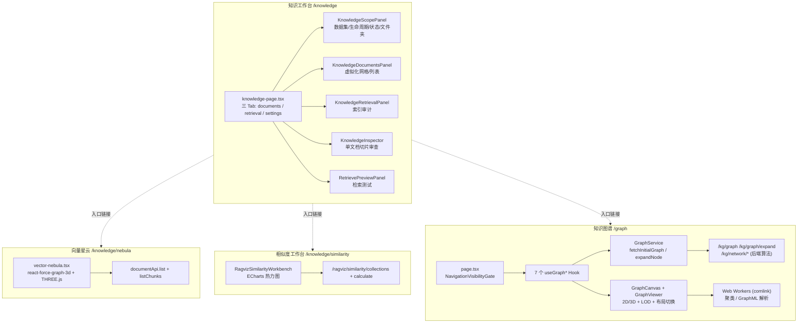

知识工作台（Knowledge Workbench）与图谱可视化（Graph Visualization）是 MimirQ 前端面向"资产治理"与"语义探索"的两大核心界面。前者以文档/数据集为操作对象，提供从入库到检索验证的密集型管理工作台；后者将知识图谱（KG）以可交互的 2D/3D 关系图呈现，并叠加路径分析、网络算法、RAG 可解释性与快照对比能力。本文聚焦前端实现路径——从 `/knowledge` 工作台的三 Tab 布局，到 `/graph` 页面由七个 Hook 组合驱动的图谱画布，再到向量星云（Vector Nebula）与相似度工作台（Similarity Workbench）两条语义可视化支线，并深入剖析前端图算法（BFS 最短路、并查集聚类、四叉树 LOD）与后端网络分析算法的对应关系。

## 一、整体架构：两条语义可视化路径

知识工作台与图谱可视化在前端分为两条并行的数据路径：**资产路径**（围绕文档/chunk 的检索与审查）与**语义路径**（围绕实体/事件/向量相似度的探索）。二者共享 AppFrame 外壳与文档预览面板，但数据源与交互模型完全不同。

两条路径的边界清晰：知识工作台消费文档与索引审计数据，图谱页面消费 KG 事件/实体投影数据。向量星云与相似度工作台则分别以 chunk 内容与 embedding 相似度为数据源，构成"资产 → 语义"的渐进式探索链路。Sources: [knowledge-page.tsx](web/components/knowledge/knowledge-page.tsx#L683-L686)、[graph/page.tsx](web/app/graph/page.tsx#L25-L35)、[similarity/page.tsx](web/app/knowledge/similarity/page.tsx#L1-L20)

## 二、知识工作台：三 Tab 密集管理工作台

`/knowledge` 入口由 `knowledge-page.tsx` 承载，是一个"IDE 风格"的密集型工作台：顶部 Hero 面板展示范围与"采集 → 资产 → 验证"链路，工具栏内嵌 Tab 切换（documents / retrieval / settings）、数据集作用域面板与导入操作入口。所有 UI 状态（活动 Tab、数据集作用域、排序、视图模式等）通过 `parseKnowledgeQueryState` / `serializeKnowledgeQueryState` 与 URL query 双向同步，刷新与分享 URL 均能恢复现场。Sources: [knowledge-page.tsx](web/components/knowledge/knowledge-page.tsx#L117-L150)、[knowledge-page.tsx](web/components/knowledge/knowledge-page.tsx#L160-L195)

### 2.1 文档 Tab：虚拟化网格与批量操作

文档 Tab 使用 `@tanstack/react-virtual` 的 `useVirtualizer` 分别驱动网格视图（按行虚拟化，每行 3 列，行高 280px）与列表视图（按条虚拟化，行高 108px），配合 20 条/页的分页在万级文档规模下保持流畅。数据集作用域变化时自动重置到第一页，滚动容器通过 `useKnowledgeScrollContainer` 哨兵元素统一管理。Sources: [knowledge-page.tsx](web/components/knowledge/knowledge-page.tsx#L300-L335)

### 2.2 检索 Tab：索引审计与检索测试

检索 Tab 的右栏是 `KnowledgeRetrievalPanel`（索引审计面板），主区是 `RetrievePreviewPanel`（检索测试）。审计面板通过 `useIndexAudit` 拉取后端审计结果，展示四个指标卡：向量总数、文档总数、分片总数与索引大小。索引大小并非直接来自后端，而是基于向量数 × 3072 维 × 4 字节/维 × 2.2 存储开销倍率的稳定估算——代码注释明确标注这是"rough estimate"，避免把估算值伪装成精确数据。Sources: [knowledge-retrieval-panel.tsx](web/components/knowledge/knowledge-retrieval-panel.tsx#L88-L101)、[knowledge-retrieval-panel.tsx](web/components/knowledge/knowledge-retrieval-panel.tsx#L112-L150)

| 指标卡 | 数据来源 | 说明 |
|---|---|---|
| 向量总数 | `indexAudit.vector_ids_checked` | 后端索引审计的真实计数 |
| 文档总数 | `indexAudit.active_documents` | 入库文档计数 |
| 分片总数 | `indexAudit.active_chunks` | 检索分片计数 |
| 索引大小 | 估算公式 | 3072 维 × 4B × 2.2 倍开销，非精确值 |

### 2.3 导入操作中枢

工具栏的"导入/创建"按钮通过 `KnowledgeWorkbenchActions` 聚合了五类入口：本地文件上传、URL 导入、URL 批量导入、网页爬取、Jira 项目导入，以及流水线配置对话框。文件上传通过隐藏的 `<input type="file">` 触发，accept 白名单由 `UPLOAD_ACCEPT` 统一定义。Sources: [knowledge-workbench-actions.tsx](web/components/knowledge/knowledge-workbench-actions.tsx#L60-L120)

## 三、向量星云：基于真实 chunk 的 3D 语义集群

向量星云（`/knowledge/nebula`）将"入库切片"以 3D 力导向图呈现，是文档资产到语义空间的可视化桥梁。它的关键设计是**数据真实性**：节点并非演示数据，而是通过 `documentApi.list`（取 24 个 completed 文档）与 `documentApi.listChunks`（前 8 个文档各取 80 个 chunk）实时构建。Sources: [vector-nebula.tsx](web/components/knowledge/vector-nebula.tsx#L180-L200)

### 3.1 确定性布局：哈希驱动的伪随机分布

星云按文档类型（pdf / xlsx / html / default）聚簇，每种类型有独立的视觉样式：

| 文档类型 | 颜色 | 几何体 | 扩散半径 | 密度标签 |
|---|---|---|---|---|
| PDF | `#2563eb` | 二十面体 (icosahedron) | 58 | 版面切片 |
| 表格 | `#10b981` | 八面体 (octahedron) | 42 | 结构切片 |
| HTML | `#f97316` | 十二面体 (dodecahedron) | 46 | 标记切片 |
| 其他 | `#8b5cf6` | 球体 (sphere) | 52 | 通用切片 |

节点在簇内的位置并非随机，而是由 FNV-1a 哈希（`hashString`）对节点 ID 加盐后映射到 `[0, 1)` 再偏移到簇的扩散范围——同一份数据每次渲染位置完全一致，避免力导向模拟导致的"每次打开都不一样"的困惑。簇中心按黄金角（2.399963 rad）在螺旋线上排布，保证多簇时视觉不重叠。Sources: [vector-nebula.tsx](web/components/knowledge/vector-nebula.tsx#L62-L99)、[vector-nebula.tsx](web/components/knowledge/vector-nebula.tsx#L132-L145)

### 3.2 渲染细节：核体 + 辉光 + 链式边

每个节点通过 `nodeThreeObject` 渲染为"核心几何体 + 加法混合辉光球"的双层结构：核心尺寸由 chunk 内容长度映射（0.15–1.0 缩放），辉光透明度由簇样式控制（0.18–0.22），并使用 `THREE.AdditiveBlending` 与 `depthWrite: false` 实现光晕效果。同一文档的连续 chunk 之间生成同色链式边，形成"文档 = 一条星链"的视觉隐喻。点击节点时相机以 1200ms 平滑飞向目标，悬停提示展示所属文档、chunk 序号与前 220 字符内容。Sources: [vector-nebula.tsx](web/components/knowledge/vector-nebula.tsx#L201-L215)、[vector-nebula.tsx](web/components/knowledge/vector-nebula.tsx#L335-L390)

星云还包含一个工程细节：`react-force-graph-3d` 在开发环境会触发 Three.js `THREE.Clock` 弃用警告，组件通过临时替换 `console.warn` 定向过滤该噪声（仅此一条，其余警告照常输出），避免污染控制台调试体验。Sources: [vector-nebula.tsx](web/components/knowledge/vector-nebula.tsx#L14-L40)

## 四、图谱页面：七 Hook 组合驱动的可视化分析台

`/graph` 页面是图谱可视化的主战场，受 `NavigationVisibilityGuard`（moduleKey `knowledgeGraph`）保护。整个页面由七个职责单一的 Hook 组合而成，形成一个清晰的"状态 → 数据 → 展示 → 交互"分层：

| Hook | 职责 | 关键产出 |
|---|---|---|
| `useGraphPageState` | 全页面状态中枢 | scope、graphData、选中节点、模式开关 |
| `useGraphDataLoading` | 数据加载与文件导入 | live KG / trace 回放 / 手动 KG 文件 |
| `useGraphEntityResolution` | 实体解析联动 | 打开详情时自动解析实体/事件 |
| `useGraphDisplayFilters` | 显示过滤 | 搜索、类型/谓词/置信度过滤、高亮集合 |
| `useGraphNodeOperations` | 节点操作 | 展开邻居、删除节点 |
| `useGraphPageActions` | 视图操作 | 缩放、导出 PNG/SVG、全屏 |
| `useGraphInteractionModes` | 交互模式 | 路径 / 连线 / 可解释性模式 |

数据加载使用单调递增 token 丢弃过期响应：当 scope 快速切换时，较早的慢请求不会覆盖较新的结果，这是异步竞态处理的典型模式。Sources: [graph/page.tsx](web/app/graph/page.tsx#L25-L135)、[use-graph-data-loading.ts](web/app/graph/use-graph-data-loading.ts#L100-L120)

### 4.1 GraphService：KG 数据访问门面

前端通过 `GraphService` 静态方法统一访问 KG 数据，核心逻辑在 `fetchInitialGraph` 与 `expandNode`：

- **特性探测**：先调用 `metaApi.details()` 检查 `features.kg_enabled`，KG 未启用时直接返回空图而非报错；
- **空图语义**：后端返回空节点时，前端等待 200ms 后返回空图，让 UI 能清晰呈现"当前范围无结果"而不是误显示演示数据；
- **UUID 校验**：`expandNode` 仅对 UUID 格式的节点 ID 发起后端展开请求，非 UUID（如手动导入的临时节点）直接返回空展开；
- **结构化克隆**：所有响应通过 `structuredClone` 深拷贝，避免库对数据对象就地修改污染缓存。

Sources: [graph-service.ts](web/lib/graph-service.ts#L1-L95)

### 4.2 数据源三通道

图谱数据支持三种来源，由 `dataSource: 'live' | 'file'` 区分：
1. **Live KG**：`kgApi.getGraph` 拉取后端事件/实体投影；
2. **Trace 回放**：上传 RAG trace 文件后通过 `buildGraphFromTrace` 重建推理图谱；
3. **手动 KG 导入**：上传 GraphML/JSON 文件，经 `graph-parser.worker` 解析。

其中 GraphML 解析器（`graph-parser.ts`）基于 DOMParser 读取 XML 的 `key` 声明，将 `d0 → label` 之类的键 ID 映射为语义属性名，并自动将 `label`/`name` 映射为节点显示名。解析与聚类计算都通过 comlink 暴露到 Web Worker，避免大数据量阻塞主线程。Sources: [use-graph-data-loading.ts](web/app/graph/use-graph-data-loading.ts#L25-L60)、[graph-parser.ts](web/lib/graph-parser.ts#L24-L122)、[graph-parser.worker.ts](web/workers/graph-parser.worker.ts#L1-L12)

### 4.3 后端投影：事件为中心的子图构建

后端 `GET /kg/graph` 是前端图谱的数据基座。其核心是**以事件（KgSourceEvent）为中心**的子图投影：先按权限解析可访问文档（`_resolve_allowed_documents`），再加载最多 `max_events` 条事件，最后 `_build_kg_graph_response_from_events` 从事件展开实体节点、事件-实体边、实体-实体共现边（co-occurrence）与关系三元组边（triple）。响应刻意保持轻量，由 `max_events / max_entities / max_links` 上限约束。`/kg/graph/expand` 则对指定节点（事件或实体 ID）做邻域展开，支撑前端的"惰性加载"。Sources: [routes.py](app/rag/kg/api/routes.py#L275-L350)、[routes.py](app/rag/kg/api/routes.py#L352-L430)

## 五、前端图算法：最短路、并查集聚类与四叉树 LOD

图谱页面的交互并非全部依赖后端——若干关键算法在前端本地执行，并针对大图做了分层优化。

### 5.1 BFS 最短路（路径模式）

`findShortestPath` 采用标准 BFS 构建无向邻接表，同时记录每条边的 ID。路径模式（Path Mode）下用户依次点击起点与终点，算法返回 `{ nodeIds, linkIds }`，前端据此高亮路径节点与边。BFS 保证无权图下的最短路最优性，复杂度 O(V + E)。Sources: [graph-algorithms.ts](web/lib/graph-algorithms.ts#L17-L106)

### 5.2 并查集聚类（连通分量）

`computeConnectedComponents` 使用带路径压缩与按秩合并的并查集（Disjoint Set Union）计算连通分量，输出每个节点所属簇、簇数量与簇大小。结果按簇大小降序编号——最大连通分量恒为簇 1。该计算通过 `graph-clustering.worker` 在 Web Worker 中执行，避免主线程卡顿。Sources: [graph-clustering.ts](web/lib/graph-clustering.ts#L27-L107)、[graph-clustering.worker.ts](web/workers/graph-clustering.worker.ts#L1-L13)

### 5.3 四叉树视口 LOD（大图性能）

当图超过 600 节点 / 1200 边阈值时，`graph-viewport-lod.ts` 启用视口层级细节（LOD）机制：

- 节点按屏幕坐标插入四叉树空间索引（分裂阈值 16，最大深度 9）；
- 视口矩形按 0.18 过扫描率外扩后查询可见节点，避免边缘闪烁；
- 支持 `overview / balanced / detail` 三档策略，overview 模式最多渲染 420 节点；
- 高亮节点/边强制可见，保证搜索与路径模式的语义完整性不被裁剪。

Sources: [graph-viewport-lod.ts](web/lib/graph-viewport-lod.ts#L14-L35)、[graph-viewport-lod.ts](web/lib/graph-viewport-lod.ts#L130-L150)、[graph-viewer.tsx](web/components/graph/graph-viewer.tsx#L910-L912)

### 5.4 边装饰：平行边与自环的确定性布局

`decorateLinksForDisplay` 解决知识图谱常见的视觉重叠问题：对同一对端点间的多条边，按"kind::predicate::confidence"语义键稳定排序后，为每条边分配 ±0.25~0.9 的曲率（平行边数量越多曲率越大，但有上限避免不可读）；对自环按 2π/总数 均匀分配旋转角，使多个自环清晰可辨。曲率与旋转角是确定性的——同一数据多次渲染结果一致，不会在重渲染间抖动。Sources: [graph-edge-display.ts](web/lib/graph-edge-display.ts#L85-L137)

## 六、2D/3D 渲染与布局切换

`GraphViewer` 是渲染中枢，按需动态加载 2D（`force-graph-2d-wrapper`）与 3D（`force-graph-3d`）两种引擎，支持三种布局模式：

| LayoutMode | dagMode | 适用场景 |
|---|---|---|
| `force` | 无（力导向） | 一般关系探索，节点自由聚合 |
| `tree` | `td`（自顶向下） | 层级清晰的实体-事件结构 |
| `radial` | `radialout` | 以中心节点辐射的社区视图 |

2D 渲染通过 `nodeVisibility` 与 `linkVisibility` 接入 LOD 裁剪；边标签使用 `linkLabelRenderState` 计算文本位置与角度，并区分路径边、悬停边与强调边。渲染外层包裹 `GraphRenderBoundary` 错误边界——渲染失败时展示降级提示而非白屏，且数据变化（resetKey）后自动尝试恢复。Sources: [graph-viewer.tsx](web/components/graph/graph-viewer.tsx#L927-L960)、[graph-viewer.tsx](web/components/graph/graph-viewer.tsx#L1405-L1411)

3D 引擎基于 `three-spritetext` 生成节点标签精灵，边的宽度由置信度映射（0.75 + c × 2.25），颜色按边的 kind 区分——`entity_relation` 蓝、`event_entity` 紫、`entity_entity` 青。节点颜色则由 `graph-colors.ts` 的语义色板解析：内置 10 组类型色族（人物、机构、地点、法规、材料、时间、服务、联系方式、金额、流程），支持中英文别名匹配，未命中时回退到 24 色调色板的确定性哈希取色。Sources: [graph-colors.ts](web/components/graph/graph-colors.ts#L8-L58)、[force-graph-3d.tsx](web/components/graph/force-graph-3d.tsx#L95-L105)

## 七、网络分析：前端收集边，后端算算法

图谱页面的网络分析面板（`KgNetworkAnalysisPanel`）采用"前端收集边列表，后端执行图算法"的协作模式：前端把当前图的所有边转换为 `{source, target, weight?}` 列表，调用 `/kg/network/*` 系列端点。后端 `network_analysis.py` 在客户端提供的边表上运行算法，与租户数据完全解耦，但仍要求认证防滥用，并以 `_MAX_EDGES = 20_000` 限制输入规模防御 CPU/内存 DoS。Sources: [kg-network-analysis-panel.tsx](web/app/graph/_components/kg-network-analysis-panel.tsx#L80-L100)、[network_analysis.py](app/api/v1/network_analysis.py#L14-L40)

| 端点 | 算法 | 实现要点 |
|---|---|---|
| `/k_hop_neighbors` | BFS 分层遍历 | 按 hop 分层输出邻居，max_hops ≤ 10 |
| `/shortest_path` | BFS 最短路 | 返回节点 ID 路径序列 |
| `/paths_between` | DFS 全路径枚举 | max_hops 剪枝防爆 |
| `/centrality` | 度中心性 / PageRank | PageRank：damping 0.85，40 次迭代 |
| `/community_of` | 标签传播 | 复用 `app.rag.kg.community` 的 label propagation |
| `/connected_component` | 连通分量 | 与前端 DSU 算法互补 |

Sources: [network_analysis.py](app/api/v1/network_analysis.py#L63-L140)、[network_analysis.py](app/api/v1/network_analysis.py#L140-L202)

## 八、可解释性与溯源：从图回到证据

图谱可视化不仅是拓扑展示，还承担 RAG 可解释性职责：

- **RAG 推理过程面板**（`GraphExplainabilityPanel`）：Explain 模式下逐步展示推理链，每步由 `{node, reason}` 构成，当前步绿色高亮、已完成步骤半透明绿、未到步骤灰色，形成时间线化的推理过程可视化。前端通过 `buildHeuristicExplainSteps` 从当前图数据启发式生成步骤序列；
- **边溯源 Tooltip**（`graph-provenance.ts`）：悬停任意边时展示结构化溯源信息——边类型（三元组关系/事件证据/共现）、谓词、置信度、共享事件数、来源文档/事件/chunk/页码/内容哈希。所有文本经 HTML 转义防注入，长 ID 以 `头8位…尾4位` 缩写保持工具提示紧凑；
- **节点详情面板**：实体/事件详情按 kind 分色徽章（实体蓝、事件橙、trace 紫），展示元数据、别名管理与合并建议入口。

Sources: [graph-explainability-panel.tsx](web/app/graph/_components/graph-explainability-panel.tsx#L1-L66)、[graph-provenance.ts](web/lib/graph-provenance.ts#L60-L125)、[graph-node-detail-panel.tsx](web/app/graph/_components/graph-node-detail-panel.tsx#L60-L100)

## 九、相似度工作台：向量空间的矩阵化检视

`/knowledge/similarity` 提供与星云互补的向量检视视角——RAGviz 相似度工作台。它不再用 3D 空间隐喻，而是把 embedding 相似度组织为**可交互热力图矩阵**：

- 用户从相似度集合（collections）中选择 X/Y 轴数据集，后端 `POST /ragviz/similarity/calculate` 计算两两相似度；
- 前端 `similarity-matrix-math.ts` 提供矩阵掩码运算：阈值掩码（相似度区间过滤）、按行/按列 Top-K 掩码、AND/OR 组合掩码——可同时叠加"相似度 ≥ 0.7"与"每行 Top 5"两个条件精确定位高相似区域；
- 支持 viridis 等多种配色方案、差异模式统计与单元格钻取（SelectedHeatmapCell），用于诊断 embedding 质量问题（如不同数据集间的意外高相似）。

Sources: [similarity-matrix-math.ts](web/components/ragviz/similarity/similarity-matrix-math.ts#L1-L120)、[similarity-workbench.tsx](web/components/ragviz/similarity-workbench.tsx#L60-L150)、[ragviz.py](app/api/v1/ragviz.py#L52-L91)

## 十、工程模式总结

纵观知识工作台与图谱可视化，可以提炼出四个可复用的工程模式：

| 模式 | 体现 | 价值 |
|---|---|---|
| 确定性渲染 | 星云哈希布局、平行边曲率、色板哈希取色 | 同数据同视觉，消除渲染抖动 |
| Worker 卸载 | 聚类与 GraphML 解析走 comlink Worker | 大图计算不阻塞主线程 |
| 竞态防护 | 加载 token 丢弃过期响应、错误边界 resetKey | 快速切换不串数据，崩溃可恢复 |
| 前后端算法分工 | BFS/连通分量前端算，PageRank/路径枚举后端算 | 交互即时性 vs 计算规模平衡 |

## 延伸阅读

- 图谱的数据源头与实体抽取流水线详见 [知识图谱：实体抽取、关系处理、图谱搜索与溯源](19-zhi-shi-tu-pu-shi-ti-chou-qu-guan-xi-chu-li-tu-pu-sou-suo-yu-su-yuan)
- 检索面板背后的索引审计与混合检索体系见 [混合检索与融合策略：向量、稀疏检索与 RRF 融合](16-hun-he-jian-suo-yu-rong-he-ce-lue-xiang-liang-xi-shu-jian-suo-yu-rrf-rong-he)
- 可解释性面板关联的引用与证据映射机制见 [RAG 对话引擎：引用生成、声明证据映射与忠实度评分](20-rag-dui-hua-yin-qing-yin-yong-sheng-cheng-sheng-ming-zheng-ju-ying-she-yu-zhong-shi-du-ping-fen)
- 前端整体架构与 API 契约校验见 [Next.js 前端架构：App Router、国际化与 API 契约校验](26-next-js-qian-duan-jia-gou-app-router-guo-ji-hua-yu-api-qi-yue-xiao-yan)
- 解析工作台的 PDF 渲染与版面编辑见 [解析工作台：PDF 渲染、版面元素编辑与解析对比](28-jie-xi-gong-zuo-tai-pdf-xuan-ran-ban-mian-yuan-su-bian-ji-yu-jie-xi-dui-bi)