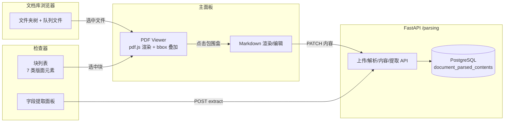
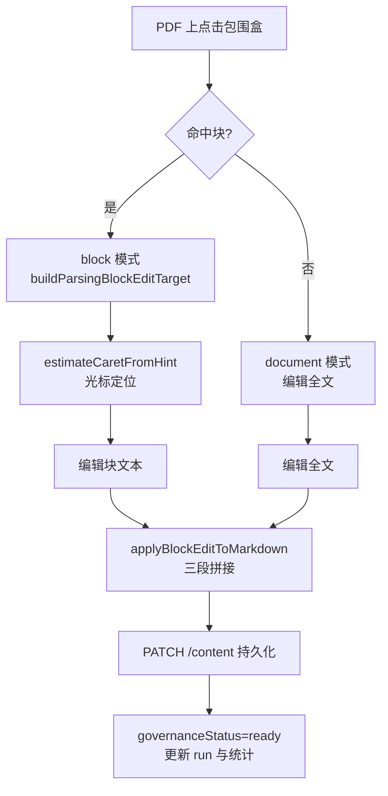

解析工作台（`/parsing`）是 MimirQ 前端中面向解析质量审查与人工校正的核心交互面。它把「PDF 原文渲染 → 版面元素定位 → Markdown 编辑 → 多解析器对比 → 结构化字段提取」串成一条可检查、可回退、可提交治理的闭环。本文聚焦三个主题：基于 pdf.js 的 PDF 渲染与包围盒叠加、基于位置标签的版面元素编辑链路、以及同文件多解析 run 的 A/B 对比机制。

## 页面骨架与三栏数据流

工作台页面在 `web/app/parsing/page.tsx` 中仅做一行转发，真正的编排发生在 `ParsingPage` 组件：它维护本地队列文件（`files`）、从 zustand store 同步的库文件（`libraryFiles`），并通过五个自定义 hook（页面状态、视图状态、库操作、队列操作、运行操作、编辑操作）把状态与动作注入到 `ParsingWorkbenchShell` 中。Shell 负责三栏布局：左侧可折叠的文档库浏览器、中间的 PDF/Markdown 主面板、右侧的块列表/ Markdown 检查器，底部还有解析队列抽屉。左右面板宽度分别持久化在 `mimirq.parsing.leftPanelWidth` 与 `mimirq.parsing.inspectorWidth`（320–560px，默认 410px），刷新后恢复。Sources: [parsing-page.tsx](web/components/parsing/parsing-page.tsx#L17-L20)、[parsing-page.tsx](web/components/parsing/parsing-page.tsx#L185-L283)、[parsing-workbench-shell.tsx](web/components/parsing/parsing-workbench-shell.tsx#L190-L200)

## PDF 渲染管线：可见窗口调度与画布池

`PdfViewer` 是工作台的渲染核心，它通过 `webpackIgnore: true` 动态加载 `/pdfjs/build/pdf.mjs`，绕开 Next.js dev 模式下对 Mozilla ESM bundle 的 webpack 包装（后者会触发 "Object.defineProperty called on non-object" 崩溃），并把 worker 指向 `pdfjs-compat` 目录下的兼容构建。出于同样的稳定性考量，离屏渲染（OffscreenCanvas + comlink worker）被常量 `ENABLE_PDF_OFFSCREEN_RENDER = false` 显式关闭，默认走主线程栅格化。Sources: [pdf-viewer.tsx](web/components/parsing/pdf-viewer.tsx#L63-L82)、[pdf-viewer.tsx](web/components/parsing/pdf-viewer.tsx#L223-L239)

渲染遵循「可见窗口优先」策略：`queueVisiblePdfPageWindow` 在滚动时计算视口上下各 800px 的扩展窗口，只把落在窗口内的页面加入渲染队列；每页渲染失败最多重试 3 次（间隔 150ms），且首屏预渲染前 3 页。为避免大文档撑爆内存，画布池限制最多保留 6 个已渲染页面（`MAX_RETAINED_PAGE_CANVASES = 6`），释放候选按「保留状态 → 距当前页距离 → 页号倒序」排序，当前页、排队中、渲染中的页面不会被释放。PDF 源既可以是本地 `File` 对象，也可以是通过带认证头 fetch 的 `fileUrl`（仅限后端 API 同源地址才会附加 `getAuthHeaders()`）。Sources: [pdf-viewer.tsx](web/components/parsing/pdf-viewer.tsx#L86-L104)、[pdf-render-canvas-pool.ts](web/components/parsing/pdf-render-canvas-pool.ts#L1-L61)、[pdf-viewer.tsx](web/components/parsing/pdf-viewer.tsx#L269-L286)

仓库中还保留了一个完整的离屏渲染 worker（`pdf-page-render.worker.ts`）：它用 comlink 暴露 `initializeDocument` / `attachPageCanvas` / `renderPage` / `releasePage` / `destroy` 五个方法，通过 `WorkerCanvasFactory` 把每个页面栅格化到 `OffscreenCanvas` 上，并维护 `pageRenderTasks` Map 支持按页取消。该实现作为未来启用离屏渲染的备用通道存在，当前主线程渲染路径与其共享同一套页面窗口调度逻辑。Sources: [pdf-page-render.worker.ts](web/workers/pdf-page-render.worker.ts#L90-L128)、[pdf-page-render.worker.ts](web/workers/pdf-page-render.worker.ts#L134-L173)

## 包围盒叠加：坐标空间自适应

版面元素要在 PDF 画布上可视化，核心难点是后端返回的 bbox 坐标空间不统一。`pdf-bbox.ts` 提供了两段式处理：`detectPdfBboxCoordinateSpace` 遍历元素的 position，若任一坐标超出页面基准尺寸则判定为 `normalized-1000`（千分位归一化坐标），否则视为 `absolute`（与页面同单位的绝对坐标）；`computePdfOverlayRect` 则按坐标空间把 position 换算成当前渲染 scale 下的像素矩形。`BboxOverlay` 组件据此在每页 canvas 上叠加透明按钮层：只有激活（active）、悬停（hovered）或 `showAll` 时才会绘制，且激活态带 `ring-4 ring-primary/40` 高亮。点击 overlay 时会把点击位置归一化为 (xRatio, yRatio) 传给 `onClickBlockId`，作为后续文本编辑的光标定位提示。Sources: [pdf-bbox.ts](web/lib/pdf-bbox.ts#L20-L42)、[pdf-bbox.ts](web/lib/pdf-bbox.ts#L44-L82)、[bbox-overlay.tsx](web/components/parsing/bbox-overlay.tsx#L20-L87)

## 版面元素模型：位置标签与七类分类

PDF 渲染与 Markdown 编辑之间的桥梁是嵌入在解析输出中的位置标签。后端在 markdown 中写入形如 `@@{pages} {left} {right} {top} {bottom}##` 的标记（正则 `POSITION_TAG_RE`），前端 `extractBlocksFromMarkdown` 扫描这些标签，把标签前的文本块切分为带 `id` 和 `positions[]` 的 `ParsingBlock`；`stripPositionTags` 则负责生成纯净的展示文本。若相邻标签间无文本，位置会追加到前一个块上，从而实现「一个块对应多个跨页位置」。Sources: [parsing-positions.ts](web/lib/parsing-positions.ts#L26-L58)、[parsing-positions.ts](web/lib/parsing-positions.ts#L131-L195)

每个块随后通过 `classifyParsingBlock` 归类为七种版面类型之一：标题、正文、列表、表格、图片、公式、印章。分类是启发式的——图片靠 Markdown 图片语法或 ``，表格靠竖线行/分隔行，公式靠 `$$` 与 LaTeX 记号表，列表靠 `- * +` 或编号前缀，标题靠单行短文本且无句末标点。每种类型都配有独立的徽章、圆点与 overlay 配色（如表格用绿色、公式用紫色、印章用红色），在左右面板与 PDF 叠加层中保持视觉一致。Sources: [parsing-layout.ts](web/lib/parsing-layout.ts#L3-L80)、[parsing-layout.ts](web/lib/parsing-layout.ts#L124-L137)

| 版面类型 | 判定依据（节选） | 视觉标识 |
|---|---|---|
| 标题 heading | 单行、≤72 字符、无句末标点、≤12 词 | info 蓝 |
| 正文 paragraph | 兜底类型 | 灰 |
| 列表 list | `- * +` 或 `1.` 前缀 | info 蓝 |
| 表格 table | ≥2 行含 `\|` 或 `---` 分隔 | success 绿 |
| 图片 image | `` 或 `<img` | warning 琥珀 |
| 公式 equation | `$$` 或 `\frac` 等记号 | accent 紫 |
| 印章 seal | 后端元素标注 | destructive 红 |

## 版面元素编辑：从点击包围盒到保存 Markdown

编辑链路是工作台最精巧的部分：用户在 PDF 上点击某个包围盒，`PdfViewer` 把点击比率传给 `onClickBlockId`，`use-parsing-editor-actions` 的 `handleStartEdit` 调用 `buildParsingBlockEditTarget`——它先用 `resolveParsingEntryRanges` 在原始 markdown 中定位该块文本的实际字符区间（先精确匹配、失败则用空白折叠的正则匹配），再把点击的 (xRatio, yRatio) 通过 `estimateCaretFromHint` 换算成块内光标位置（多行按行比例、单行按「词边界 + 混合比例」插值）。这样用户点哪里，编辑光标就落在哪里。Sources: [parsing-edit-focus.ts](web/lib/parsing-edit-focus.ts#L81-L112)、[parsing-edit-focus.ts](web/lib/parsing-edit-focus.ts#L132-L155)、[use-parsing-editor-actions.ts](web/components/parsing/use-parsing-editor-actions.ts#L159-L181)

编辑分两种模式：命中块时进入 `block` 模式（只编辑该块文本），否则进入 `document` 模式（编辑全文）。保存时 `applyBlockEditToMarkdown` 用「前缀 + 新内容 + 后缀」三段拼接回写，再通过 `parsingApi.updateContent` 的 `PATCH /parsing/documents/{id}/content` 持久化到后端；本地状态同步更新对应 run 的 `cleanedMarkdown` 与统计信息，并把 `governanceStatus` 置为 `ready` 以标记人工修订完成。此外还提供复制 Markdown 与下载 `.md` 文件两个导出动作。Sources: [parsing-edit-focus.ts](web/lib/parsing-edit-focus.ts#L157-L165)、[use-parsing-editor-actions.ts](web/components/parsing/use-parsing-editor-actions.ts#L189-L199)、[use-parsing-editor-actions.ts](web/components/parsing/use-parsing-editor-actions.ts#L141-L157)

## 解析对比：同文件多 run 的 A/B 审阅

由于同一文件可以用不同解析器后端反复解析，`ParseRun` 以数组形式挂载在 `ParsedFile.runs` 上，每次解析都会生成 `{backend}-{timestamp}` 的 runId。`ParseCompareDialog` 提供 A/B 对比：Base 与 Compare 两个下拉框各选一个 run，文本维度用 `diff` 库的 `createTwoFilesPatch` 生成 unified diff（可选择 Cleaned 或 Raw 原文，超过 300k 字符则跳过计算），结构维度则调用 `diffParsingElements` 做基于签名的元素比对。Sources: [use-parsing-run-actions.ts](web/components/parsing/use-parsing-run-actions.ts#L216-L259)、[parse-compare-dialog.tsx](web/components/parsing/parse-compare-dialog.tsx#L53-L110)、[parse-compare-dialog.tsx](web/components/parsing/parse-compare-dialog.tsx#L83-L90)

元素签名把 `kind | page | pages | visual_kind | 归一化文本 | bbox` 六元组拼成字符串，出现在 Compare 而未出现在 Base 的计为新增，反之计为移除，并按类型聚合。对比面板重点突出高价值差异：新增/移除的印章文本、图像子类（如 chart / qr / barcode / diagram）、公式数量。面板还提供「使用 Base / 使用 Compare」按钮，点击后通过 `onUseRun` 一键把对应 run 切换为当前预览，形成「对比 → 采纳 → 继续编辑」的审阅闭环。Sources: [parsing-element-diff.ts](web/lib/parsing-element-diff.ts#L33-L45)、[parsing-element-diff.ts](web/lib/parsing-element-diff.ts#L51-L104)、[parse-compare-dialog.tsx](web/components/parsing/parse-compare-dialog.tsx#L223-L268)

## 结构化字段提取：以版面元素为证据源

工作台右侧的提取面板（`ParsingExtractPanel`）支持 schema 与 prompt 两种模式，前端会按当前文档的元素构成智能预填默认值——有印章就提取公司名、有公式就提取主公式、有 chart 图片就提取图表说明。提交后调用 `POST /parsing/documents/{id}/extract`，后端 `parsing_extract_service.py` 走三级策略链：优先 `element_match`（按 source_kind / visual_kind 过滤 + 别名命中加分，返回带 bbox 与置信度的证据列表），其次 `markdown_alias_match`（扫描 `别名:` 形式行），最后 `markdown_sentence_match`（按句号切分后找含别名的句子）。每个字段结果都携带 `evidence` 数组，前端可据此回跳到对应元素。Sources: [parsing-extract-panel.tsx](web/components/parsing/parsing-extract-panel.tsx#L27-L100)、[parsing_extract_service.py](app/services/parsing_extract_service.py#L149-L200)、[parsing_extract_service.py](app/services/parsing_extract_service.py#L122-L146)

## 后端 API 与持久化设计

`/parsing` 路由与 `/documents/preview` 的关键区别在于持久化：上传的源文件落盘（本地 uploads 或 MinIO），解析出的 markdown 写入 `document_parsed_contents` 表，重启不丢。权限复用数据集模型——每个用户自动创建一个 `ONLY_ME` 的 "Parsing Workspace" 数据集作为容器，从而免费获得下载/列举的访问控制。质量保障方面，parse 端点会计算 `pdf_quality` 与统一 `quality_gate`（pass/warn/fail 三级），PDF auto 模式在 gate 不达标时按保守候选顺序（mineru → deepseek_ocr → qianfan_ocr → etl4llm → deepdoc → docling → magicpdf → markitdown → basic）做有界回退。Sources: [parsing.py](app/api/v1/parsing.py#L1-L14)、[parsing.py](app/api/v1/parsing.py#L563-L600)、[parsing.py](app/api/v1/parsing.py#L495-L560)

| 端点 | 方法 | 前端调用点 |
|---|---|---|
| `/parsing/documents` | GET | `parsingApi.listDocuments` |
| `/parsing/documents` | POST | `parsingApi.upload`（multipart 上传） |
| `/parsing/documents/{id}/parse` | POST | `parsingApi.parse`（带 AbortSignal 与超时） |
| `/parsing/documents/{id}/content` | GET | `parsingApi.getContent` |
| `/parsing/documents/{id}/content` | PATCH | `parsingApi.updateContent`（编辑保存） |
| `/parsing/documents/{id}/extract` | POST | `parsingApi.extract` |
| `/parsing/documents/{id}` | DELETE | `parsingApi.delete` |

所有响应在前端都经过 zod schema 运行时校验（`ParsingContentResponse`、`ParsingExtractResponse`），并在 `openapiRequest` 中绑定契约。Sources: [parsing.py](app/api/v1/parsing.py#L401-L434)、[parsing.py](app/api/v1/parsing.py#L804-L920)、[parsing.ts](web/lib/api/parsing.ts#L227-L322)

## 状态管理与跨会话恢复

解析工作台的状态管理分两层：内存队列文件（`ParsedFile[]`，含 `runs`、`elements`、`parseDiagnostics`）与库文件（`ParsedFileData[]`，zustand + persist）。store 的持久化键按认证 scope 隔离（`mimirq_parsed_files:{scope}`），切换账号不会串数据；解析出的 markdown 还通过 `saveDocContentToCache` 可靠写入文档内容缓存（最多重试 3 次），供库文件从缓存恢复。库文件与队列文件通过 `libraryId` 关联——上传时先 `POST /documents` 拿到后端 ID，解析中通过 `updateParsedFile` 同步状态，保证工作台与知识库侧状态一致。Sources: [use-parsed-files-store.ts](web/store/use-parsed-files-store.ts#L20-L21)、[use-parsed-files-store.ts](web/store/use-parsed-files-store.ts#L177-L179)、[use-parsing-run-actions.ts](web/components/parsing/use-parsing-run-actions.ts#L98-L200)

## 下一步阅读

- 解析工作台依赖的解析器生态与按需启动机制，见 [解析器生态与按需启动：DeepDoc、MinerU、Marker、olmOCR 等 30+ 后端](4-jie-xi-qi-sheng-tai-yu-an-xu-qi-dong-deepdoc-mineru-marker-olmocr-deng-30-hou-duan)
- 解析产物的质量门禁与回退策略，见 [文档解析框架：解析器工厂、后端路由与子进程隔离](12-wen-dang-jie-xi-kuang-jia-jie-xi-qi-gong-han-hou-duan-lu-you-yu-zi-jin-cheng-ge-chi)
- 编辑后的 Markdown 如何进入切块与检索链路，见 [切块策略体系：86 种策略、父子切块与策略矩阵](13-qie-kuai-ce-lue-ti-xi-86-chong-ce-lue-fu-zi-qie-kuai-yu-ce-lue-ju-zhen)
- 前端整体架构与 API 契约校验机制，见 [Next.js 前端架构：App Router、国际化与 API 契约校验](26-next-js-qian-duan-jia-gou-app-router-guo-ji-hua-yu-api-qi-yue-xiao-yan)