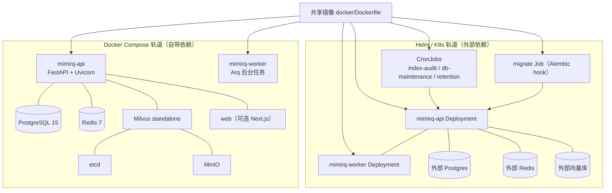
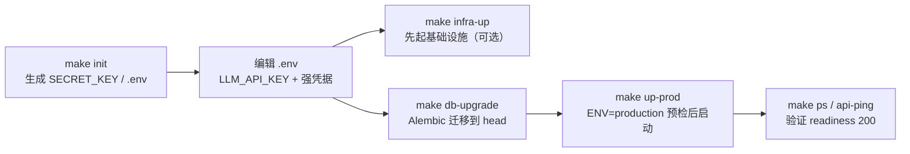
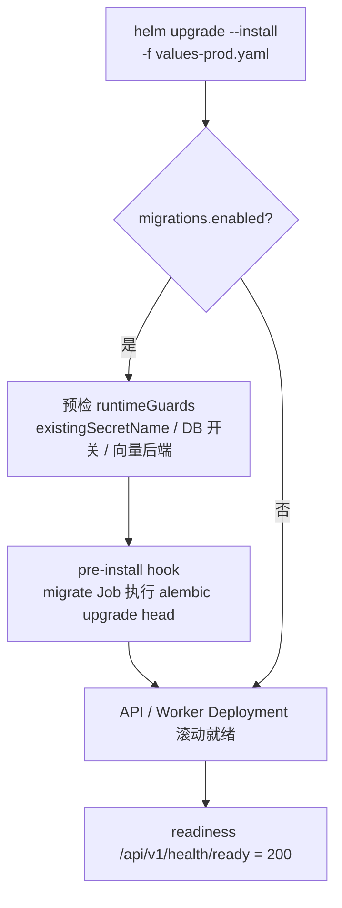
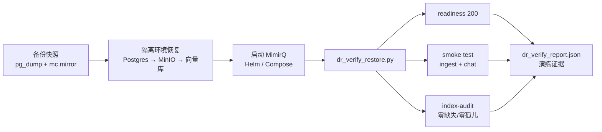

MimirQ 的部署体系由两条轨道构成：**Docker Compose**（单机自包含、开箱即用）与 **Helm / Kubernetes**（面向外部基础设施的多副本生产部署）。两条轨道共享同一镜像与同一套环境变量语义，且都被"备份恢复 → 灾备演练 → 日常运维"的闭环所覆盖。本页聚焦部署拓扑、生产基线、备份策略、恢复演练与运维自动化，帮助你从"能启动"走向"可恢复、可验证、可治理"。

## 部署全景：一条流水线，两条轨道

核心设计原则是：**Compose 负责"自带依赖"，Helm 负责"对接依赖"**。Compose 轨道内置 Postgres / Redis / Milvus（etcd + MinIO）等完整基础设施，适合单机交付、POC 与中小规模部署；Helm Chart 默认不安装任何依赖，只部署 `mimirq-api` 与 `mimirq-worker` 两个工作负载，数据库、向量库、Redis、MinIO 全部依赖外部服务——这是企业 K8s 环境最常见的形态。两条轨道最终都指向同一个 Docker 镜像（`docker/Dockerfile` 构建），因此镜像构建、解析器模型固化、健康检查契约在两条轨道间完全一致。

两条轨道的关键差异如下表所示：

| 维度 | Docker Compose | Helm / Kubernetes |
|:---|:---|:---|
| 依赖管理 | 内置 Postgres / Redis / Milvus / MinIO | 全部外部（自建或云托管） |
| 默认副本数 | API / Worker 各 1 | values 可配，生产基线 2+2 |
| 迁移策略 | `make db-upgrade` 手动执行 | `migrations.enabled=true` 的 pre-install hook Job |
| 多副本安全 | 不适用（单机） | `runtimeGuards` 渲染期 fail-fast 校验 |
| 扩缩容 | 手动 `docker compose scale` | HPA（CPU）+ PDB |
| 网络隔离 | `mimirq-proxy` 专用网段 | NetworkPolicy ingress/egress allowlist |
| 周期任务 | 需外部 cron | 内置 CronJob 模板 |

Sources: [docker_compose.md](docs/deployment/docker_compose.md#L3-L8)、[helm.md](docs/deployment/helm.md#L3-L10)、[Dockerfile](docker/Dockerfile#L59-L76)

## Docker Compose：从一键启动到生产基线

### 五套 Compose 配置的分工

仓库提供多套 Compose 文件，通过 `-f` 叠加与 `--profile` 按需组合，而不是维护多份互不相干的堆栈：

| 配置文件 | 职责 | 典型用途 |
|:---|:---|:---|
| `docker/docker-compose.yml` | 主栈：API + Worker + Postgres/Redis/Milvus/MinIO | 默认开发与生产基线 |
| `docker/docker-compose.lite.yml` | 低资源栈：API + Worker + Postgres/Redis，向量库默认 Chroma | 小内存机器、快速试跑 |
| `docker/docker-compose.infra.yml` | 仅基础设施（暴露 127.0.0.1 端口） | 本地跑后端 + 容器化依赖 |
| `docker/docker-compose.parsers.yml` | 可选解析服务（Marker/olmOCR/MinerU/MagicPDF 等） | `--profile` 按需启用 |
| `docker/docker-compose.web.yml` | Next.js 前端（默认不启动） | `make up-web` / `make up-prod-web` 叠加 |

主栈的 API 与 Worker 只读挂载 `mineru_cache` 到 `/opt/mimirq-model-cache` 复用 MinerU / PDF-Extract-Kit 模型缓存；DeepDoc 轻量模型在镜像构建期从固定 commit 下载并校验，运行时保持离线。Compose 内服务间通信统一使用 `_DOCKER` 后缀变量（如 `MILVUS_HOST_DOCKER=mimirq-milvus`、`REDIS_URL_DOCKER=redis://mimirq-redis:6379/0`），避免依赖宿主机 `.env` 中面向本机的 `localhost` 默认值。日志统一走 `json-file` 驱动并限制 `max-size=10m`、`max-file=3`，防止日志无限增长。

Sources: [docker_compose.md](docs/deployment/docker_compose.md#L3-L19)、[docker-compose.yml](docker/docker-compose.yml#L45-L49)、[docker-compose.yml](docker/docker-compose.yml#L12-L43)、[docker-compose.lite.yml](docker/docker-compose.lite.yml#L20-L39)

### 生产模式：从 make up 到 make up-prod

开发模式只需 `make up`（主栈）或 `make up-lite`（低资源）；生产模式则要求先做配置预检（`prod-preflight` 加载 `app.core.config`），再以 `ENV=production` 启动。生产基线在 `.env` 中至少要满足：`ENV=production`、`AUTH_MODE=jwt`、强 `SECRET_KEY`（长度 ≥ 32）、`MIMIRQ_DB_CREATE_ALL_ON_STARTUP=false`、`MIMIRQ_DB_RUNTIME_MIGRATIONS_ENABLED=false`，并在启动前单独执行 `make db-upgrade`。上传幂等（`UPLOAD_DEDUP_ENABLED`）与 Redis 分布式检索准入（`RAG_RETRIEVAL_DISTRIBUTED_ADMISSION_ENABLED`，默认并发 3）在 Compose 中默认开启，属于生产基线而非可选项。

首个管理员引导支持两条路径：无人值守部署使用 `INITIAL_ADMIN_EMAIL` + `INITIAL_ADMIN_USERNAME` + `INITIAL_ADMIN_PASSWORD`（或 `INITIAL_ADMIN_PASSWORD_FILE` 密码文件）；手工首登则保留 `INITIAL_REGISTRATION_TOKEN`（支持 `sha256:<hex>` 摘要），通过 `X-Bootstrap-Token` 头调用 `/api/v1/auth/register`。生产环境密码文件应通过 Compose override 或 Docker secret 挂载进容器，避免明文留在 `.env`。多实例必须使用完全相同的 `INITIAL_ADMIN_*`，且自动引导成功后会成为默认租户 owner，重启不会重置密码。

Sources: [docker_compose.md](docs/deployment/docker_compose.md#L126-L176)、[Makefile](Makefile#L236-L244)、[Makefile](Makefile#L567-L568)、[.env.example](.env.example#L21-L25)、[.env.example](.env.example#L236-L247)

### 数据卷与生命周期管理

主栈声明 7 个命名卷：`postgres_data`（元数据）、`etcd_data` / `minio_data` / `milvus_data`（Milvus 三件套）、`upload_data`（上传文件，容器内 `/data/uploads`）、`mineru_cache`（解析模型缓存）；lite 栈另有 `vector_data`（Chroma 持久化）。清理命令按破坏程度分三档：

| 目的 | 命令 | 容器/网络 | 数据卷 | 镜像 |
|:---|:---|:---:|:---:|:---:|
| 暂停并保留数据 | `make down` | 删除 | 保留 | 保留 |
| 清空数据后重建 | `make docker-reset` | 删除 | 删除 | 保留 |
| 完全重新拉取/构建 | `make docker-purge` | 删除 | 删除 | 删除 |

三个目标都只处理当前 `COMPOSE_PROJECT_NAME`（固定为 `mimirq`）对应的项目，不会使用 `--remove-orphans` 扫描未声明的服务，也不会删除 `.env`、源码或执行全局 `docker system prune`——这是与旧版"项目名继承目录名 `docker`"及同机 Dify 共存时的资源隔离边界。若曾用 lite / retrieval-dev 变体启动，`make down` 会依次覆盖完整、lite、retrieval-dev 三套配置，避免遗漏。

Sources: [docker_compose.md](docs/deployment/docker_compose.md#L193-L258)、[docker-compose.yml](docker/docker-compose.yml#L231-L250)、[Makefile](Makefile#L279-L298)

## Helm / Kubernetes：面向外部基础设施的最小 Chart

### Chart 结构概览

Chart 位于 `deploy/helm/mimirq`，只渲染 API 与 Worker 两个工作负载，配套 20 余个模板：`deployment-api.yaml` / `deployment-worker.yaml`（探针、卷、安全上下文）、`job-migrate.yaml`（Alembic hook）、`hpa.yaml` / `pdb.yaml`（弹性与可用性）、`networkpolicy.yaml`（网络隔离）、`secret.yaml` / `serviceaccount.yaml` / `service.yaml` / `ingress.yaml`（接入层）、`servicemonitor.yaml` / `prometheusrule.yaml` / `grafana-dashboard-configmap.yaml`（可观测）、以及 6 个 CronJob 模板（周期巡检与维护）。`values.schema.json` 提供渲染期 schema 校验，`validate-runtime.yaml` 负责多副本安全边界断言。

Sources: [Chart.yaml](deploy/helm/mimirq/Chart.yaml#L1-L7)、[values.yaml](deploy/helm/mimirq/values.yaml#L1-L6)

### 部署前置与 Secret 策略

前置条件：Kubernetes 1.22+、Helm 3.x，以及外部 Postgres（必需）、Redis（建议）、向量库、MinIO（可选）。Chart 的 readiness 探针使用 `GET /api/v1/health/ready`——依赖可用且数据库位于当前镜像 Alembic head 时返回 200，否则 503，保证 schema 不兼容的 Pod 不会接流量。

Secret 管理遵循"**集群外创建，Chart 内引用**"：强烈建议用 Vault / KMS / External Secrets Operator 创建 Secret，再在 values 中通过 `existingSecretName` 引用。当 `existingSecretName` 为空时 Chart 才会自建 Secret（默认值面向开发）。由于 Helm 无法读取外部 Secret 的内容，多副本安全校验依赖 `runtimeGuards` 提示值（`environment`、`vectorBackend`、`minioEnabled`、`dbCreateAllOnStartup` 等），因此生产 values 必须让 `runtimeGuards` 与外部 Secret 实际内容保持一致。

Sources: [helm.md](docs/deployment/helm.md#L18-L76)、[values.yaml](deploy/helm/mimirq/values.yaml#L14-L16)、[values.yaml](deploy/helm/mimirq/values.yaml#L123-L135)、[NOTES.txt](deploy/helm/mimirq/templates/NOTES.txt#L1-L32)

### values 覆盖与迁移 Job

生产基线直接复制 `deploy/helm/mimirq/examples/values-prod.yaml`，再按需叠加 `values-hardened.yaml`。生产 values 的要点：

- API / Worker 均设 `replicas: 2`，`extraEnv` 显式关闭 `DB_CREATE_ALL_ON_STARTUP` 与 `DB_RUNTIME_MIGRATIONS_ENABLED`，开启 `RATE_LIMIT_REDIS_ENABLED`、`UPLOAD_DEDUP_ENABLED`、`RAG_RETRIEVAL_DISTRIBUTED_ADMISSION_ENABLED`（并发保守 3）；多副本 API 建议关闭内存 BM25（`BM25_INDEX_ENABLED=false`），改用 Postgres 词法检索，避免每个 Pod 重建同一份内存索引。
- `migrations.enabled=true` 时渲染期强制校验：必须设置 `existingSecretName`（pre-install hook 早于 Chart 管理的 Secret 创建）、必须关闭两个 DB 启动开关、多副本不得使用 `faiss/chroma`、本地文档存储时 uploads PVC 必须含 `ReadWriteMany`。
- 迁移 Job 以 `helm.sh/hook: pre-install,pre-upgrade` 挂载，命令为 `python scripts/alembic_cli.py -c alembic.ini upgrade head`，带 `backoffLimit=1`、`activeDeadlineSeconds=1800`、`ttlSecondsAfterFinished=300`。

Sources: [helm.md](docs/deployment/helm.md#L194-L223)、[values-prod.yaml](deploy/helm/mimirq/examples/values-prod.yaml#L35-L75)、[validate-runtime.yaml](deploy/helm/mimirq/templates/validate-runtime.yaml#L23-L53)、[job-migrate.yaml](deploy/helm/mimirq/templates/job-migrate.yaml#L1-L16)

### 弹性、可用性与安全加固

弹性维度：`api.autoscaling` / `worker.autoscaling` 生成基于 CPU 利用率（默认 80%）的 HPA；`pdb` 支持 `minAvailable` / `maxUnavailable` 二选一，避免节点维护时同时摘掉所有副本。安全维度：Chart 默认 `security.hardened=true`（非 root、drop ALL capabilities、seccomp RuntimeDefault），默认 `automountServiceAccountToken=false`（不挂载 K8s API token），`readOnlyRootFilesystem` 有意不默认开启（部分本地向量后端会在 /app 下写数据），如需开启可配合 `tmpEmptyDir`。NetworkPolicy 开启后 API 默认允许同 namespace ingress、Worker 拒绝 ingress；egress 仅当 `egress.restrict=true` 才进入 allowlist 模式，生产建议补全 Postgres/Redis/Milvus/MinIO 与 LLM 出口的精确规则。

Sources: [values.yaml](deploy/helm/mimirq/values.yaml#L26-L62)、[values.yaml](deploy/helm/mimirq/values.yaml#L161-L173)、[values.yaml](deploy/helm/mimirq/values.yaml#L246-L281)、[hpa.yaml](deploy/helm/mimirq/templates/hpa.yaml#L1-L46)、[pdb.yaml](deploy/helm/mimirq/templates/pdb.yaml#L1-L38)、[helm.md](docs/deployment/helm.md#L238-L300)

### 周期运维 CronJobs

Chart 内置一组可选的 CronJob，把"健康巡检/合规审查/维护"固化为运维自动化：`cronjobs.indexAudit`（每日索引一致性巡检）、`evidenceDriftAudit`（证据引用漂移巡检）、`accessReviewSummary`（每日访问审查汇总）、`semanticCacheRetention`（语义缓存清理）、`dbMaintenance`（VACUUM/ANALYZE + 审计日志 retention）。这些任务默认 PII-safe（只写计数/ID）、有界（`maxDatasets` / `maxCheckIds` / `maxScan` / `maxDelete` 上限）、结果写入 audit log 可追溯。推荐先 `execute=false` 验证再切换执行；Cron 时间由 K8s control-plane 时区（通常 UTC）解释。

Sources: [helm.md](docs/deployment/helm.md#L304-L355)、[values-periodic-audits.yaml](deploy/helm/mimirq/examples/values-periodic-audits.yaml#L8-L34)、[cronjob-index-audit.yaml](deploy/helm/mimirq/templates/cronjob-index-audit.yaml#L40-L60)、[cronjob-db-maintenance.yaml](deploy/helm/mimirq/templates/cronjob-db-maintenance.yaml#L44-L80)

## 备份与恢复：先定策略，再谈工具

备份的起点不是工具，而是**明确哪些数据必须原样恢复、哪些可以恢复后重算**。MimirQ 的备份面覆盖三类数据：Postgres（元数据/审计/评估结果）、MinIO（文档/图片对象）、向量库（Milvus / Chroma，取决于 `VECTOR_BACKEND`）。文档提供两种策略：

| 策略 | 备份范围 | 适用场景 | 风险 |
|:---|:---|:---|:---|
| A：向量库可重建（推荐默认） | Postgres + MinIO | 中等规模、可接受重建时间 | 大规模重建索引导致 RTO 变长 |
| B：全量备份 | Postgres + MinIO + 向量库 | 数据量大、RTO 严格 | 向量备份/恢复复杂，必须演练验证 |

Postgres 备份建议使用 **custom format** 的 `pg_dump -Fc -Z 6`（可并行恢复、可压缩），恢复时用 `pg_restore --no-owner --no-privileges`；生产用只读专用账号，备份文件加密后存对象存储 + KMS。MinIO 使用 `mc mirror --overwrite --remove --md5` 做双向镜像，恢复即回放。向量库的策略差异最大：Milvus 优先在 DR/staging 验证"备份文件 → 新集群恢复 → index-audit 通过"，没有成熟备份链路时采用策略 A（恢复后 re-ingest / re-embed 重建）；Chroma 一般靠持久化卷快照。

Sources: [backup_restore.md](docs/deployment/backup_restore.md#L9-L43)、[backup_restore.md](docs/deployment/backup_restore.md#L45-L106)、[backup_restore.md](docs/deployment/backup_restore.md#L109-L135)

## 灾备演练与依赖故障演练

### 恢复验证自动化：dr_verify_restore.py

"备份能做"不等于"恢复可用"，因此仓库提供 `scripts/dr_verify_restore.py` 把恢复验证做成可重复的自动化闭环。它按顺序执行三段检查：① `GET /api/v1/health/ready`（无鉴权）；② `scripts/smoke_test.py`（端到端 ingest + chat，PII-safe 合成数据，输出 JSON report）；③ 对 smoke dataset（或 `--dataset-id` 指定数据集）执行 index-audit（admin-only），校验 `vector_id_missing`、`vector_ids_missing_in_backend`、`milvus_orphan_ids_sample_count` 均为 0。脚本默认 PII-safe：不打印 token，smoke 命令以脱敏形式写入报告；最终输出单行 JSON（适合 CI/日志采集），非零退出码即演练失败。

最小调用（JWT 模式）为 `MIMIRQ_DR_ADMIN_TOKEN` + `--tenant-id` + `--base-url` + `--out`；仅验证生产数据集可加 `--skip-smoke --dataset-id <uuid>`。演练必须遵守安全边界：**不在生产做破坏性演练**，环境隔离（独立 namespace / DB / bucket），写入动作显式标注。

Sources: [dr_drill.md](docs/deployment/dr_drill.md#L14-L130)、[dr_verify_restore.py](scripts/dr_verify_restore.py#L1-L16)、[dr_verify_restore.py](scripts/dr_verify_restore.py#L78-L87)、[dr_verify_restore.py](scripts/dr_verify_restore.py#L185-L312)

### 依赖故障演练（Chaos）

`docs/deployment/chaos_tests.md` 定义了三类可控的依赖故障场景，验证系统在故障时**正确降级而非假成功**、告警能及时暴露、恢复后能回到健康状态：Redis 故障（`scripts/chaos_dependency_outage.py` 注入，窗口建议 60-180s，`concurrencyPolicy=Forbid`）、MinIO 故障（scale down 或网络阻断）、Milvus 故障（向量检索不可用）。每个场景都要求先记录基线快照（readiness、rag-metrics/summary、config/snapshot），恢复后跑 `dr_verify_restore.py` 闭环验证。演练结果至少沉淀：时间/参与人/环境、备份版本标识、`dr_verify_report.json`、发现的问题与 follow-up issue。

Sources: [chaos_tests.md](docs/deployment/chaos_tests.md#L9-L47)、[chaos_tests.md](docs/deployment/chaos_tests.md#L50-L110)、[dr_drill.md](docs/deployment/dr_drill.md#L133-L141)

## 日常运维：维护任务、告警与事故响应

### 数据库维护与 Retention

运维自动化统一入口是 `scripts/run_db_maintenance_jobs.py`：Postgres `VACUUM` / `ANALYZE`（幂等、默认 dry-run、支持 `--table` allowlist 防误操作、非 Postgres 环境自动 skip）、审计日志 / regression runs retention（按 tenant 维度 bounded delete）。知识资产 retention（documents/chunks/KG/vector/object）使用独立的 `scripts/run_retention_jobs.py --knowledge-assets`，语义缓存 retention（Milvus 行 + Redis payload）使用同一 runner 的 `--semantic-cache`——它们会操作数据库以外的存储，刻意不混入纯 DB maintenance。Helm 侧对应 `cronjobs.dbMaintenance`（建议周日低峰、`concurrencyPolicy=Forbid`）与 `cronjobs.semanticCacheRetention`（仅 `SEMANTIC_CACHE_ENABLED=true` 时启用）。

Sources: [db_maintenance.md](docs/deployment/db_maintenance.md#L3-L41)、[db_maintenance.md](docs/deployment/db_maintenance.md#L43-L88)、[db_maintenance.md](docs/deployment/db_maintenance.md#L90-L144)

### 告警映射与事故响应

Runbook 提供"**告警 → 定位路径 → 止血手段**"的快速映射：`MimirQHighHttp5xxRate` 先看 readiness 与依赖、`MimirQTaskQueueNoWorkersButHasBacklog` 优先恢复 worker 消费能力、`MimirQHighRagZeroHitRate` 先跑 index-audit 检查索引滞后、`MimirQHighHttp429Ratio` 看 `Retry-After` 与 `detail.scope` 区分限流来源。配套的 PrometheusRule 与 Grafana Dashboard 模板位于 `docs/ops/templates/`，Helm 可通过 `prometheus.prometheusRule.enabled` 与 `grafana.dashboard.enabled` 一键安装；这些阈值是 baseline 默认值，生产需按 SLO 调参。事故响应遵循"先止血，再定位，再验证修复"，拿到异常 `request_id` 时优先用 `scripts/incident_bundle.py` 导出 PII-safe 的 trace bundle + 脱敏配置快照。

Sources: [runbook.md](docs/deployment/runbook.md#L8-L57)、[runbook.md](docs/deployment/runbook.md#L59-L73)、[incident_response_cookbook.md](docs/deployment/incident_response_cookbook.md#L29-L67)、[incident_response_cookbook.md](docs/deployment/incident_response_cookbook.md#L73-L89)

## 下一步

- 环境变量与模型服务的完整规则（LLM / Embedding / Reranker 分离部署、`_DOCKER` 变量语义）见 [环境变量与模型服务接入：LLM、Embedding、Reranker 配置](3-huan-jing-bian-liang-yu-mo-xing-fu-wu-jie-ru-llm-embedding-reranker-pei-zhi)
- 解析器服务的按需启动（`--profile` 组合、GPU 资源分配）见 [解析器生态与按需启动：DeepDoc、MinerU、Marker、olmOCR 等 30+ 后端](4-jie-xi-qi-sheng-tai-yu-an-xu-qi-dong-deepdoc-mineru-marker-olmocr-deng-30-hou-duan)
- 迁移版本基线演进与 Alembic 体系见 [数据模型与 Alembic 迁移体系：26 个迁移版本与基线演进](9-shu-ju-mo-xing-yu-alembic-qian-yi-ti-xi-26-ge-qian-yi-ban-ben-yu-ji-xian-yan-jin)
- 指标采集、链路追踪与 Grafana 面板的完整说明见 [可观测性与链路追踪：Prometheus 指标、OpenTelemetry 与 Phoenix](30-ke-guan-ce-xing-yu-lian-lu-zhui-zong-prometheus-zhi-biao-opentelemetry-yu-phoenix)
- 发布预算与质量门禁的运维衔接见 [CI 质量门禁：检索阈值、解析证明、查询集健康与发布预算策略](24-ci-zhi-liang-men-jin-jian-suo-yu-zhi-jie-xi-zheng-ming-cha-xun-ji-jian-kang-yu-fa-bu-yu-suan-ce-lue)