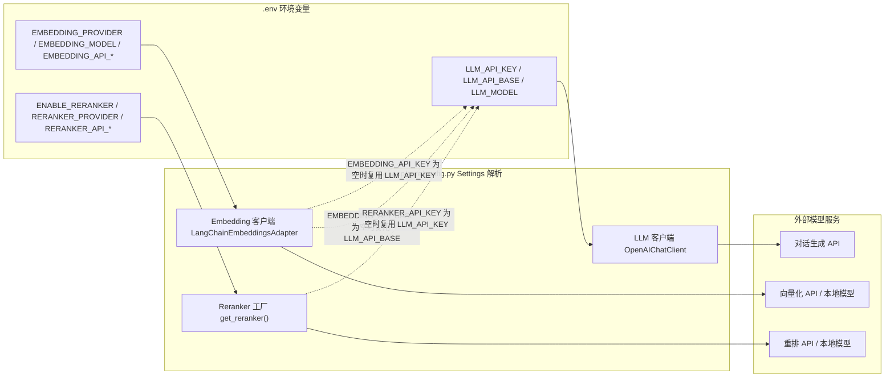

MimirQ 通过 `.env` 环境变量驱动三类外部模型服务：**LLM**（对话与文本生成）、**Embedding**（向量化）、**Reranker**（检索结果重排序）。本页面向初学者说明如何用最少的配置让三类服务连通、它们之间如何复用密钥与地址、以及有哪些可选的工程化调优参数。完整变量模板见仓库根目录的 [.env.example](.env.example)。

## 环境变量体系：一份 `.env` 承载全部模型接入

MimirQ 的配置入口是仓库根目录的 `.env` 文件。`.env.example` 按功能划分为 11 个分组，与模型服务直接相关的是 **05｜大模型、HTTP 客户端与 Embedding**（LLM 与向量化）和 **08｜数据治理、解析回退与重排**（Reranker 与证据重排）([.env.example](.env.example#L458-L462))([.env.example](.env.example#L1363-L1367))。后端启动时由 `app/core/config.py` 中的 `Settings` 类统一读取这些变量，并支持通过 pydantic 的 `AliasChoices` 兼容 `OPENAI_API_KEY`、`OPENAI_BASE_URL`、`OPENAI_MODEL` 等旧命名([app/core/config.py](app/core/config.py#L371-L375))。



生成本地配置的方式很简单：克隆仓库后执行 `make init`（或 `python scripts/init_env.py`），它只创建缺失的 `.env` 与 `web/.env.local` 并填充随机密钥，不会覆盖已有值；真实密钥不要提交到仓库([docs/guides/model_services.md](docs/guides/model_services.md#L7-L15))。没有配置任何模型 Key 时进程仍可启动，但聊天、向量化或入库会失败——模型 Key 不是进程存活检查的必要条件([docs/guides/model_services.md](docs/guides/model_services.md#L5))。

## LLM 配置：一个 Key 打通对话闭环

LLM 是 MimirQ 的"默认对话与基础抽取凭证"。最简配置只需填写 `LLM_API_KEY`，因为默认值已经指向硅基流动的 OpenAI 兼容接口：`LLM_API_BASE=https://api.siliconflow.cn/v1`、`LLM_MODEL=Qwen/Qwen3-32B`([.env.example](.env.example#L464-L471))。`.env.example` 顶部注释明确写道："真实知识库闭环先填写 LLM_API_KEY"([.env.example](.env.example#L9))。

```dotenv
LLM_API_KEY=<your-siliconflow-api-key>
```

核心 LLM 变量如下([.env.example](.env.example#L464-L498))：

| 变量 | 默认值 | 说明 |
|:---|:---|:---|
| `LLM_API_KEY` | 空 | 必填；不配置时模型调用不可用 |
| `LLM_API_BASE` | `https://api.siliconflow.cn/v1` | OpenAI 兼容 Base URL |
| `LLM_MODEL` | `Qwen/Qwen3-32B` | 默认主模型 |
| `LLM_MODEL_FAST` | 空 | 低成本/低延迟模型（可选） |
| `LLM_MODEL_HEAVY` | 空 | 复杂问题高质量模型（可选） |
| `ENABLE_DYNAMIC_MODEL_ROUTING` | `false` | 按问题复杂度自动选模型 |
| `MODEL_COMPLEXITY_THRESHOLD` | `160` | 超过该字符数走 heavy 模型 |
| `LLM_TEMPERATURE` | `0.7` | 采样温度（0-1） |
| `LLM_TIMEOUT` | `60` | API 请求超时（秒） |
| `LLM_MAX_RETRIES` | `3` | 最大重试次数 |
| `LLM_USE_POOLED_ASYNC_HTTP_CLIENT` | `false` | 高并发时复用池化异步客户端 |

`LLM_MODEL_FAST` 与 `LLM_MODEL_HEAVY` 用于动态路由：启用 `ENABLE_DYNAMIC_MODEL_ROUTING` 后，路由逻辑根据问题复杂度阈值选择 heavy 或 fast 模型([app/rag/engine_support/llm_routing.py](app/rag/engine_support/llm_routing.py#L95-L98))([app/rag/engine_support/llm_routing.py](app/rag/engine_support/llm_routing.py#L164-L179))。此外还支持可选的多供应商回退链：设置 `LLM_FALLBACK_ENABLED=true` 并用 JSON 列表或逗号分隔指定 `LLM_FALLBACK_MODELS`，当主供应商发生网络错误、超时、429 或 5xx 时可自动切换到备用模型([app/core/config.py](app/core/config.py#L408-L411))([app/rag/llm/factory.py](app/rag/llm/factory.py#L274-L318))。

LLM 客户端基于 `langchain_openai.ChatOpenAI` 封装，读取 `LLM_API_KEY`、`LLM_API_BASE`、`LLM_MODEL` 等配置；若缺少 api_key 或 model 会抛出 `ConfigError`([app/rag/llm/factory.py](app/rag/llm/factory.py#L66-L74))。`LLM_TIMEOUT` 同时作用于 httpx 客户端与 ChatOpenAI 的超时设置，`LLM_MAX_RETRIES` 传递给 ChatOpenAI 的重试参数([app/rag/llm/factory.py](app/rag/llm/factory.py#L88-L97))。

## Embedding 配置：四种供应商与 Key/Base 复用规则

Embedding 用于把切块后的文档与用户查询转化为向量。默认 `EMBEDDING_PROVIDER=openai_compatible`、`EMBEDDING_MODEL=BAAI/bge-m3`；**`EMBEDDING_API_KEY` 留空时复用 `LLM_API_KEY`，`EMBEDDING_API_BASE` 留空时复用 `LLM_API_BASE`**——这是最省事的做法，也是 `.env.example` 顶部"快速开始"注释建议的路径([.env.example](.env.example#L536-L547))。

| 变量 | 默认值 | 说明 |
|:---|:---|:---|
| `EMBEDDING_PROVIDER` | `openai_compatible` | `openai_compatible` / `local` / `dashscope` / `ollama` / `deterministic_test` |
| `EMBEDDING_MODEL` | `BAAI/bge-m3` | 模型名称 |
| `EMBEDDING_API_KEY` | 空 | 与 LLM 相同可留空 |
| `EMBEDDING_API_BASE` | 空 | 留空复用 `LLM_API_BASE` |
| `EMBEDDING_API_BATCH_SIZE` | `64` | 单次请求批量大小 |
| `EMBEDDING_API_MAX_CONCURRENCY` | `3` | 最大并发 |
| `EMBEDDING_API_MAX_RETRIES` | `3` | 失败重试次数 |
| `EMBEDDING_API_TIMEOUT_SEC` | `60.0` | 请求超时（秒） |
| `EMBEDDING_LANGUAGE_ROUTING_ENABLED` | `false` | 按语言路由到不同模型 |
| `EMBEDDING_CACHE_ENABLED` | `true` | Redis 向量缓存 |

`openai_compatible` 是最通用的路径，任何遵循 OpenAI embeddings 请求/响应格式的服务（OpenAI、SiliconFlow、DashScope 兼容模式、OpenRouter、本地 vLLM、ModelScope）都可用([app/rag/embedding/providers/openai.py](app/rag/embedding/providers/openai.py#L1-L11))。供应商别名由 `EmbeddingProviders.PROVIDER_MAP` 定义：`openai` 会被规范化为 `openai_compatible`([app/core/constants.py](app/core/constants.py#L151-L173))。`dashscope` 走专用实现，`ollama` 走本地 Ollama 服务，`local` 走 sentence-transformers 本地模型，`deterministic_test` 仅供离线集成测试、不具备生产语义检索质量([.env.example](.env.example#L536-L538))。

默认模型注册表中预置了 17 个模型 ID（含 siliconflow、ollama、vllm、dashscope、openai、modelscope、local 等前缀），维度从 256 到 3072 不等([app/rag/embedding/config.py](app/rag/embedding/config.py#L45-L165))。向量化时还会对向量做 L2 归一化，并通过 `current_embedding_space_hash` 计算"embedding 空间指纹"（由 provider/model/base_url 决定），该指纹用于 Redis 向量缓存的键空间隔离——**更换 embedding 模型或端点后，旧缓存向量不会被误用**([app/rag/embedding/utils.py](app/rag/embedding/utils.py#L77-L108))。

**重要约束**：修改 Embedding 模型、供应商或向量维度后，必须重新向量化已有知识库，不能在同一索引中混用不同 Embedding space([docs/guides/model_services.md](docs/guides/model_services.md#L57))。生产环境如需平滑迁移，可使用 shadow embedding 配置（`EMBEDDING_SHADOW_*`）实现蓝绿双写([app/core/config.py](app/core/config.py#L499-L509))。

## Reranker 配置：默认关闭，按需开启

Reranker 对检索到的候选结果重排序以提升质量，但会引入额外时延，因此**默认关闭**。启用只需两行：

```dotenv
ENABLE_RERANKER=true
RERANKER_PROVIDER=openai
```

`RERANKER_PROVIDER` 支持多种实现（见下表），默认值在 `.env.example` 中是 `openai`（硅基流动 OpenAI 兼容接口），代码中的默认值则是 `llm`（基于 LLM 打分）([.env.example](.env.example#L1522-L1526))([app/core/config.py](app/core/config.py#L1944))。**注意 `RERANKER_API_BASE` 是完整的 rerank 请求端点**（如 `https://api.siliconflow.cn/v1/rerank`），不是普通 `/v1` Base URL；`RERANKER_API_KEY` 留空时复用 `LLM_API_KEY`([docs/guides/model_services.md](docs/guides/model_services.md#L31))。

| 变量 | 默认值 | 说明 |
|:---|:---|:---|
| `ENABLE_RERANKER` | `false` | 全局总开关 |
| `RERANKER_PROVIDER` | `openai` | `openai` / `dashscope` / `llm` / `ltr` / `colbert` / `cross_encoder` / `long_context` / `mmr` / `kg_pagerank` / `kg_rrf` / `local_bge_v2_m3` / `parent_child` / `weighted` / `none` |
| `RERANKER_MODEL` | `BAAI/bge-reranker-v2-m3` | 模型名称 |
| `RERANKER_API_KEY` | 空 | 留空复用 `LLM_API_KEY` |
| `RERANKER_API_BASE` | 硅基流动 rerank 端点 | 完整请求 URL |
| `RERANKER_TOP_N` | `20` | 候选数量（越大越慢） |
| `RERANKER_MAX_CHARS` | `800` | 单条候选最大字符数 |
| `RERANKER_API_BATCH_SIZE` | `32` | 单次请求批量 |
| `RERANKER_API_MAX_CONCURRENCY` | `4` | 最大并发 |
| `RERANKER_API_RATE_LIMIT_QPS` | `0` | QPS 限流（0 关闭） |
| `RERANKER_API_CIRCUIT_BREAKER_FAILURE_THRESHOLD` | `5` | 熔断连续失败阈值 |
| `RERANKER_API_CACHE_ENABLED` | `true` | 进程内内存缓存 |
| `LTR_MODEL_PATH` | 空 | LTR 本地模型路径 |

各类 provider 的实例化统一由 `get_reranker()` 工厂完成，并带进程内缓存（API 型按 provider/model/base_url/key 做 SHA-256 键去重，本地型按模型路径/设备等参数缓存）([app/rag/reranker/factory.py](app/rag/reranker/factory.py#L60-L88))：

- **API 型**（`openai`、`dashscope`）：走 HTTP 请求，内置限流、熔断、重试与打分缓存，对应 `RERANKER_API_*` 系列参数([app/rag/reranker/base.py](app/rag/reranker/base.py#L136-L199))；
- **LLM 型**（`llm`）：让 LLM 输出严格 JSON 分数，再与向量分数加权融合（`RERANKER_LLM_WEIGHT=0.7` 控制权重），解析失败时回退原始顺序([app/rag/reranker/llm_based.py](app/rag/reranker/llm_based.py#L1-L12))；
- **本地型**（`cross_encoder`、`local_bge_v2_m3`、`ltr`、`colbert`、`long_context`、`mmr`）：加载本地模型或算法，`RERANKER_LOCAL_LOAD_TIMEOUT_SEC=2.0` 限制首次加载等待时间，避免在线请求卡在模型下载([.env.example](.env.example#L1546-L1547))；
- **图谱型**（`kg_pagerank`、`kg_rrf`）与**结构型**（`parent_child`、`weighted`）用于知识图谱与父子切块场景([app/rag/reranker/factory.py](app/rag/reranker/factory.py#L456-L465))。

`RERANK_PROFILE` 变量可以引用预置的检索预算配置（如 `sweet_spot` 会把粗排 K 提升到 20），通过 `resolve_rerank_search_k` 在请求层生效([app/config/rerank_profile.py](app/config/rerank_profile.py#L11-L28))。

## 三种服务的接入速查表

如果 LLM、Embedding、Reranker 使用不同的独立服务，必须分别填写对应地址、Key 与模型([docs/guides/model_services.md](docs/guides/model_services.md#L33-L53))：

```dotenv
# Chat / generation：OpenAI-compatible Base URL
LLM_API_BASE=https://llm.example.com/v1
LLM_API_KEY=<llm-key>
LLM_MODEL=<chat-model>

# Embedding：OpenAI-compatible Base URL
EMBEDDING_PROVIDER=openai_compatible
EMBEDDING_API_BASE=https://embedding.example.com/v1
EMBEDDING_API_KEY=<embedding-key>
EMBEDDING_MODEL=<embedding-model>

# Reranker：完整 rerank 请求 URL，不是普通 /v1 Base URL
ENABLE_RERANKER=true
RERANKER_PROVIDER=openai
RERANKER_API_BASE=https://reranker.example.com/rerank
RERANKER_API_KEY=<reranker-key>
RERANKER_MODEL=<reranker-model>
```

| 接入场景 | 最少配置 | 默认值 |
|:---|:---|:---|
| 只做对话闭环 | `LLM_API_KEY` | 硅基流动 `Qwen/Qwen3-32B` |
| 对话 + 向量化 | `LLM_API_KEY` | Embedding 复用 Key/Base，`BAAI/bge-m3` |
| 对话 + 向量化 + 重排 | `LLM_API_KEY` + `ENABLE_RERANKER=true` | Reranker 复用 Key，`bge-reranker-v2-m3` |
| 完全本地（Ollama） | `EMBEDDING_PROVIDER=ollama` | `http://localhost:11434/api/embed` |
| 离线测试 | `EMBEDDING_PROVIDER=deterministic_test` | 无真实语义质量 |

主机源码模式与 Docker 一键启动在访问模型服务时的地址有差异：当前主机上的服务在 Docker 中要使用 `http://host.docker.internal:<port>/v1`，且 Linux Docker 默认不保证解析该主机名，需改用局域网 IP 或在 Compose override 中配置 `host.docker.internal:host-gateway`([docs/guides/model_services.md](docs/guides/model_services.md#L59-L67))。

## 启动验证与常见误区

`/api/v1/health/ready` 只验证数据库、向量库、Redis、MinIO 等运行依赖，**不代表外部模型已经连通**。首次部署应登录 Web、上传小文档、等待向量化完成，并执行一次带引用的检索或问答；启用 Reranker 时同时检查上游没有 401、403 或超时([docs/guides/model_services.md](docs/guides/model_services.md#L120))。另外记住两条关键规则：

1. **模型 ID 必须与供应商实际暴露的名称一致**——写错模型名是最常见的 404 原因([docs/guides/model_services.md](docs/guides/model_services.md#L56))；
2. **Embedding 空间不可混用**——更换模型/供应商/维度后必须重建索引，向量相似度跨空间无意义([app/rag/embedding/utils.py](app/rag/embedding/utils.py#L77-L89))。

环境加载遵循标准优先级：进程环境变量 > `.env` 文件 > 代码默认值。`app/core/env.py` 中的 `is_production_env()` 依据 `ENV=prod|production` 判断生产环境，影响部分安全校验分支([app/core/env.py](app/core/env.py#L4-L5))。生产部署建议完整阅读 [快速开始：Docker 一键启动与源码开发模式](2-kuai-su-kai-shi-docker-jian-qi-dong-yu-yuan-ma-kai-fa-mo-shi) 与 [部署方案与运维手册](29-bu-shu-fang-an-yu-yun-wei-shou-ce-docker-compose-helm-bei-fen-hui-fu-yu-yan-lian)；接入后想验证效果可进入 [RAG 对话引擎：引用生成、声明证据映射与忠实度评分](20-rag-dui-hua-yin-qing-yin-yong-sheng-cheng-sheng-ming-zheng-ju-ying-she-yu-zhong-shi-du-ping-fen) 了解重排与检索如何协同。