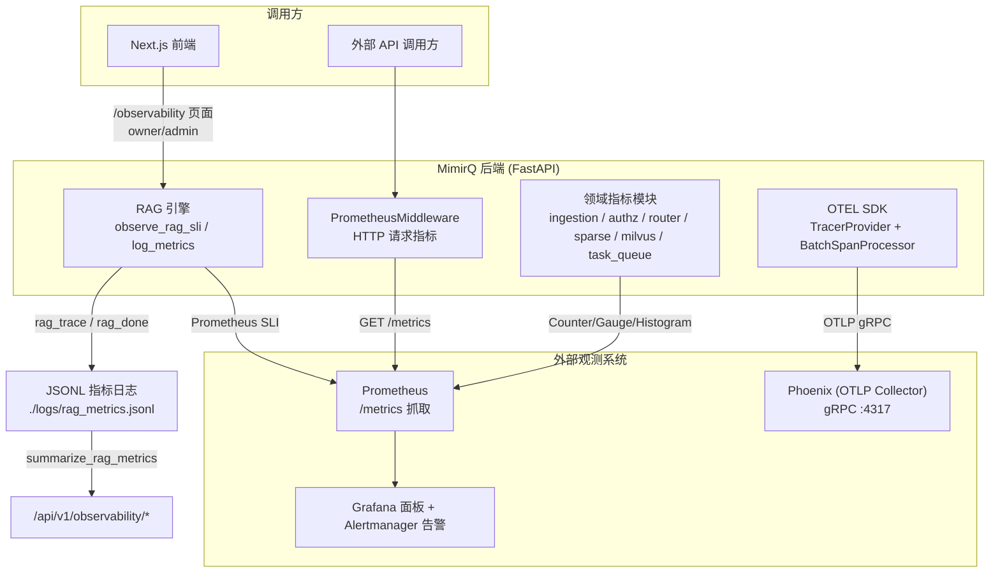
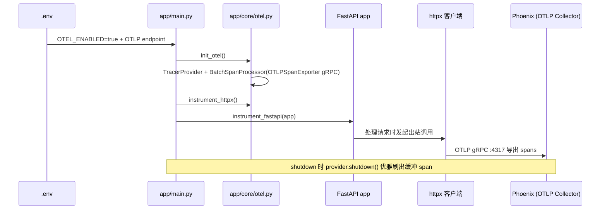
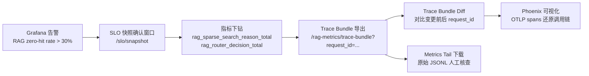

MimirQ 的可观测性不是单一产品，而是一套**三层互补**的体系：Prometheus 指标负责"持续量化"（吞吐、延迟、错误率、队列深度），OpenTelemetry 负责"单请求链路"（FastAPI 入站 → httpx 出站 → OTLP Collector），JSONL 指标日志则承担"业务级可解释性"（每次 RAG 问答的检索配置、引用数、成本归因、证据定位）。三者共享同一套设计约束：**可选启用、PII 安全、低基数标签、best-effort 降级**。本文从代码验证出发，梳理每一层的实现机制、相互协作方式与生产部署路径。

## 三层可观测性体系总览

后端的观测入口统一收敛在三个配置开关上：`PROMETHEUS_ENABLED`（暴露 `/metrics`）、`OTEL_ENABLED`（导出分布式 trace）、`ENABLE_METRICS_LOG`（写 JSONL 指标日志）。它们在启动生命周期中的挂载点各不相同：OTEL 在模块导入阶段初始化并 instrument httpx，Prometheus 中间件在 FastAPI app 构建阶段注册，指标日志则在 RAG 引擎每次问答完成时异步写入。Sources: [app/core/otel.py](app/core/otel.py#L14-L60)、[app/main.py](app/main.py#L165-L175)、[app/main.py](app/main.py#L503-L515)

三条数据通道在语义上正交：Prometheus 回答"**系统现在健康吗**"（5xx 比例、RAG 检索 p95、零命中率、队列积压）；OTEL 回答"**这次请求经过了哪些组件、耗时分布在哪**"（FastAPI 路由 span、httpx 出站调用）；JSONL 日志回答"**这次问答的检索配置与质量表现如何**"（引用数、检索模式、重排耗时、成本归因）。三者通过 `request_id` 关联——HTTP 中间件生成的 `X-Request-ID` 同时被写入 JSONL 记录，并可作为 Phoenix 中 trace 的关联键。Sources: [app/services/metrics_logger.py](app/services/metrics_logger.py#L26-L56)、[app/api/v1/observability.py](app/api/v1/observability.py#L1-L40)

## Prometheus 指标体系

### HTTP 请求指标与 ASGI 中间件

`app/core/metrics.py` 定义了三个核心指标原语：`http_requests_total`（Counter，标签 method/path/status）、`http_request_duration_seconds`（Histogram，标签 method/path）、`http_requests_in_progress`（Gauge）。`PrometheusMiddleware` 在 ASGI 层拦截请求，用 `time.monotonic()` 计时，并通过 `send_wrapper` 捕获响应状态码。**基数控制是这一层的核心设计**：进行中的请求统一使用 `__all__` 哨兵标签（避免对每个原始路径产生时序），完成的请求优先取 Starlette route 模板（如 `/api/v1/chat/stream`），未匹配路由折叠为 `__unmatched__`。测试 `test_prometheus_middleware.py` 明确验证了这两条行为：`/items/{uuid4()}` 这类高基数路径不会进入 `HTTP_REQUESTS_IN_PROGRESS` 标签，404 未匹配路径统一收敛到单个时序。Sources: [app/core/metrics.py](app/core/metrics.py#L11-L90)、[tests/test_prometheus_middleware.py](tests/test_prometheus_middleware.py#L17-L67)

中间件注册时通过 `exclude_paths` 排除了 `/metrics`、`/health`、`/docs`、`/openapi.json` 等自观测路径，避免指标端点自我计数造成噪声；`/metrics` 端点本身是独立 router（`GET /metrics`），返回 `generate_latest()` 的 Prometheus 文本格式。在生产部署中，Helm 的 ServiceMonitor 以 30s 间隔抓取 API 服务的 `http` 端口 `/metrics` 路径。Sources: [app/main.py](app/main.py#L503-L515)、[app/api/v1/metrics.py](app/api/v1/metrics.py#L1-L26)、[deploy/helm/mimirq/templates/servicemonitor.yaml](deploy/helm/mimirq/templates/servicemonitor.yaml#L1-L24)

### 领域指标模块：从 RAG 到基础设施的 8 个观测面

除 HTTP 层外，代码库按业务域拆分了多个独立指标模块，每个模块遵循相同的设计契约：**PII 安全（不以租户/文档/查询为标签）、低基数（标签值域有穷）、可选启用（内部先检查 `PROMETHEUS_ENABLED`）**。以下是完整清单：

| 模块 | 核心指标 | 标签维度 | 观测对象 |
|---|---|---|---|
| `app/rag/metrics_sli.py` | `rag_zero_hit_total` / `rag_errors_total` / `rag_citations_count` / `rag_retrieval_elapsed_seconds` / `rag_rerank_elapsed_seconds` | tenant_id / dataset_id（默认折叠为 `all`） | RAG 问答全链路 SLI |
| `app/services/ingestion_prometheus_metrics.py` | `ingestion_runs_total` / `ingestion_run_duration_seconds` / `ingestion_processing_stage_total` | status / kind / stage | 入库运行生命周期 |
| `app/services/router_prometheus_metrics.py` | `rag_router_decision_total` | level / decision / used | 确定性路由层决策 |
| `app/services/authz_prometheus_metrics.py` | `authz_group_permission_total` | resource / action / result | 组级权限校验 |
| `app/services/connector_acl_prometheus_metrics.py` | `connector_acl_apply_total` / `connector_acl_apply_errors_total` | connector_id / mode / shape | 连接器 ACL 应用 |
| `app/rag/retrieval/sparse_prometheus_metrics.py` | `rag_sparse_search_total` / `rag_sparse_search_duration_seconds` / `rag_sparse_index_*` | provider / outcome / reason / kind | SPLADE 稀疏检索与索引 |
| `app/storage/vector/milvus_prometheus_metrics.py` | `vector_milvus_write_compat_fallback_total` / `vector_milvus_search_expr_fallback_total` | dropped_fields / has_metadata_expr | Milvus 兼容性降级 |
| `app/services/task_queue_observability_service.py` | `task_queue_broker_up` / `task_queue_depth` / `task_queue_workers_active` | queue | Redis/arq 任务队列 |

Sources: [app/rag/metrics_sli.py](app/rag/metrics_sli.py#L1-L102)、[app/services/ingestion_prometheus_metrics.py](app/services/ingestion_prometheus_metrics.py#L1-L129)、[app/services/router_prometheus_metrics.py](app/services/router_prometheus_metrics.py#L1-L25)、[app/services/authz_prometheus_metrics.py](app/services/authz_prometheus_metrics.py#L1-L59)、[app/services/connector_acl_prometheus_metrics.py](app/services/connector_acl_prometheus_metrics.py#L1-L119)

### RAG SLI 指标：可调的高基数标签开关

RAG SLI 是唯一可能引入高基数标签的模块，因此设计上做了显式开关：`PROMETHEUS_RAG_LABEL_TENANT_ID` 与 `PROMETHEUS_RAG_LABEL_DATASET_ID` 默认关闭。关闭时标签值全部折叠为 `all`，时序数量保持在个位数；开启后每个租户/数据集产生独立时序，适用于多租户 SaaS 场景的成本与质量拆分。`observe_rag_sli` 在 RAG 引擎完成一次问答后调用，同时观察引用数直方图、检索耗时直方图、重排耗时直方图，并在 `citations_count==0` 时递增零命中计数器、在存在检索错误时递增错误计数器——这些正是 Grafana 面板与告警规则的核心数据源。Sources: [app/rag/metrics_sli.py](app/rag/metrics_sli.py#L20-L102)、[app/rag/engine.py](app/rag/engine.py#L3625-L3650)

### SLO 快照与 PromQL 查询

`app/services/slo_snapshot_service.py` 实现了双数据源 SLO 快照：配置 `PROMETHEUS_QUERY_BASE_URL` 时优先通过 Prometheus HTTP API 执行 PromQL（`/api/v1/query`），否则回退到 JSONL 日志聚合。快照覆盖 1 小时与 24 小时两个窗口，输出 `rag_trace_count`、`retrieval_p95/p99`、`zero_hit_rate`、`error_rate` 五个纯数值字段（PII-safe by construction）。其 PromQL 写法值得注意：零命中率与错误率都以 `rag_retrieval_elapsed_seconds_count`（直方图 counter）为分母而非 `rag_citations_count_count`，确保与 SLI 观测口径一致；p95/p99 则用 `histogram_quantile` 配合 `sum(rate(..._bucket)) by (le)` 跨实例聚合。Sources: [app/services/slo_snapshot_service.py](app/services/slo_snapshot_service.py#L1-L189)

### Grafana 面板与告警规则

Helm chart 内置了三件套交付物：`grafana-dashboard-mimirq.json`（Ops Overview 面板，12 个面板覆盖 HTTP RPS/5xx/p95、RAG 检索 p95/错误率/零命中率、Evidence 延迟、Ingestion 失败、任务队列深度/活跃 worker/broker 状态）、`prometheusrule.yaml`（PrometheusRule CRD，5 组告警）、`grafana-dashboard-configmap.yaml`（Grafana sidecar 兼容的 ConfigMap）。告警阈值体现了明确的运维语义：5xx 比例 >5% 持续 10 分钟告警、RAG 检索 p99 >6s 为 critical、零命中率 >30% 持续 20 分钟告警、`task_queue_depth > 0` 且 `workers_active < 1` 为 critical（积压但无 worker）。这些规则与指标定义一一对应，属于"代码即监控配置"的实践。Sources: [deploy/helm/mimirq/files/grafana-dashboard-mimirq.json](deploy/helm/mimirq/files/grafana-dashboard-mimirq.json#L1-L130)、[deploy/helm/mimirq/templates/prometheusrule.yaml](deploy/helm/mimirq/templates/prometheusrule.yaml#L1-L180)、[deploy/helm/mimirq/templates/grafana-dashboard-configmap.yaml](deploy/helm/mimirq/templates/grafana-dashboard-configmap.yaml#L1-L30)

## JSONL 指标日志：业务级可解释性层

### 非阻塞写入器与上下文绑定

`app/services/metrics_logger.py` 实现了与 Prometheus 正交的第二层观测：JSONL 指标日志。写入路径经过三层防护：**contextvars 上下文绑定**（`metrics_context` 将 `request_id`/`tenant_id`/`conversation_id`/`account_id` 绑定到当前异步任务，工具/工作流代码无需逐层传递即可关联）、**后台线程 + 有界队列**（队列上限 2000，满则丢弃并计数，每 0.5s 或 100 条批量落盘，主请求路径零阻塞）、**PII 剥离与脱敏**（见下文）。`log_metrics` 在 `ENABLE_METRICS_LOG=false` 时是空操作，热路径调用成本可忽略。Sources: [app/services/metrics_logger.py](app/services/metrics_logger.py#L26-L77)、[app/services/metrics_logger.py](app/services/metrics_logger.py#L399-L500)

### PII 安全：文本剥离的强保证

`METRICS_LOG_INCLUDE_TEXT` 默认 `false` 时，`_strip_text_fields_for_metrics` 对 `rag_trace` 事件执行**更强的保证**（区别于 `PII_REDACTION_ENABLED` 的 best-effort 脱敏）：`question` 与 `query_for_retrieval` 被移除，仅保留 SHA-256 前 16 位哈希与字符数（`question_hash` / `question_chars`），用于慢查询排序与去重关联；`citations` 数组则按 `_CITATION_SAFE_KEYS` 白名单过滤——只保留 `chunk_id`、`document_id`、`page_number`、各类分数与耗时数值，文档原文片段与 `extra_text` 等字段全部丢弃。测试 `test_observability_trace_bundle.py` 验证了 `SHOULD_NOT_LEAK` 文本不会出现在导出结果中。Sources: [app/services/metrics_logger.py](app/services/metrics_logger.py#L200-L296)、[tests/test_observability_trace_bundle.py](tests/test_observability_trace_bundle.py#L60-L120)

### 事件类型与聚合 API

JSONL 日志中的事件类型覆盖了完整业务面：`rag_trace`（RAG 引擎在问答结束时写入的完整检索快照，含 retrieval 配置、引用、成本归因、claim_check、faithfulness）、`rag_done`（生成阶段完成事件，含模型路由与 token 计量）、`frontend_web_vital` / `frontend_traces`（前端通过 `reportFrontendTrace` 上报的 LCP/CLS/INP 等 Web Vitals 与页面性能事件）、`online_eval`（在线采样评测）。`/api/v1/observability/*` 聚合端点全部限定 owner/admin 权限，且读取侧采用**有界 tail 读取**——`_read_jsonl_tail` 只读文件尾部 `max_bytes`（默认 5MB），避免大文件全量扫描。Sources: [app/rag/engine.py](app/rag/engine.py#L2595-L2620)、[app/rag/engine.py](app/rag/engine.py#L2893-L2900)、[web/lib/frontend-trace.ts](web/lib/frontend-trace.ts#L1-L51)、[app/services/rag_metrics_dashboard.py](app/services/rag_metrics_dashboard.py#L80-L150)

### Trace Bundle：单请求级证据导出

`RagTraceBundle` 是 JSONL 层最强大的调试工具：给定一个 `request_id`，`build_rag_trace_bundle` 从指标日志中聚合该请求的全部记录（`rag_trace` + `rag_done`），导出结构化摘要——检索模式、profile、top_k、alpha、重排配置、引用数、模型路由、检索错误类型分布。`build_rag_trace_bundle_diff` 进一步支持**两次请求的逐字段 diff**（19 个关键字段，数值字段附带 delta），用于 A/B 验证配置变更对检索质量的影响。前端 `/observability` 页面提供对应操作入口，Ops 面板支持一键下载 metrics tail 原始 JSONL。Sources: [app/services/rag_metrics_dashboard.py](app/services/rag_metrics_dashboard.py#L1564-L1760)、[app/api/v1/observability.py](app/api/v1/observability.py#L782-L840)、[web/components/observability/observability-ops-panel.tsx](web/components/observability/observability-ops-panel.tsx#L1-L120)

## OpenTelemetry 链路追踪与 Phoenix

### 初始化流程与依赖

`app/core/otel.py` 是 OTEL 的唯一入口，遵循"可选 + best-effort"原则：`OTEL_ENABLED=false` 时直接返回，依赖缺失时捕获异常并记录 warning 降级。启用后执行三步：创建 `TracerProvider`（`service.name` 取自 `OTEL_SERVICE_NAME`，默认 `mimirq`）、挂载 `OTLPSpanExporter`（**gRPC 协议**，endpoint/headers/timeout 均可配置）、通过 `BatchSpanProcessor` 异步批量导出。`instrument_httpx` 与 `instrument_fastapi` 分别在模块导入阶段与 app 构建后调用，自动为所有 FastAPI 路由与 httpx 出站请求生成 span。依赖锁定在 requirements.txt：`opentelemetry-api/sdk/exporter-otlp-proto-grpc 1.40.0` + `instrumentation-fastapi/httpx 0.61b0`。Sources: [app/core/otel.py](app/core/otel.py#L14-L101)、[app/main.py](app/main.py#L173-L176)、[app/main.py](app/main.py#L460-L460)、[requirements.txt](requirements.txt#L111-L119)

### Phoenix 适配器：从 JSONL 到 span 的转换层

`app/services/phoenix_adapter.py` 提供了一条**不依赖 OTEL SDK 也能进入 Phoenix 的路径**：`build_phoenix_trace_payload` 将 `RagTraceBundle`（JSONL 层产物）转换为 Phoenix 兼容的 span 结构——从 `rag_trace` 事件提取 `retrieval` span（mode/profile/top_k/elapsed/citations_count 属性），从 `rag_done` 提取 `generation` span（route/model/context_tokens 属性），输出 schema 标记为 `mimirq.phoenix_adapter.v1`。这使得运维可以在不开启 `OTEL_ENABLED` 的情况下，将单次请求的检索质量数据导入 Phoenix 进行可视化对比，与 OTEL 自动 instrumentation 形成互补。Sources: [app/services/phoenix_adapter.py](app/services/phoenix_adapter.py#L1-L60)

### 本地运行与协议注意点

官方推荐的本地启动方式是 `docker run -p 6006:6006 -p 4317:4317 arizephoenix/phoenix:latest`，UI 在 6006、OTLP gRPC 在 4317。两个已知的集成陷阱：**Phoenix Cloud 可能仅支持 HTTP/protobuf 收集**（当前 exporter 是 gRPC），需要中间加 OpenTelemetry Collector 做协议转换；**容器网络内必须使用服务名而非 localhost** 指向 collector。`OTEL_EXPORTER_OTLP_HEADERS` 支持 `k1=v1,k2=v2` 格式透传认证头。Sources: [docs/guides/otel_phoenix.md](docs/guides/otel_phoenix.md#L1-L62)、[.env.example](.env.example#L1934-L1961)

## 三层协同：一次故障排查的完整路径

三层观测并非孤立存在，生产排查通常沿"指标发现 → 日志定位 → trace 还原"的路径递进。以一个"检索质量下降"的典型场景为例：

每一步都有对应的代码支撑：告警由 PrometheusRule 定义；SLO 快照区分 Prometheus 与 JSONL 两个数据源；指标下钻依赖各领域模块的低基数标签；Trace Bundle 与 Diff 提供单请求级证据；Phoenix 负责跨组件调用链可视化。需要强调的是，`request_id` 是贯穿三层的关联键——HTTP 层的 `X-Request-ID` 被 JSONL 记录携带，也被 OTEL span 的语义约定捕获，这使得从聚合告警一路下钻到单次请求成为可能。Sources: [app/api/v1/observability.py](app/api/v1/observability.py#L894-L940)、[app/services/rag_metrics_dashboard.py](app/services/rag_metrics_dashboard.py#L1736-L1760)

## 配置总览

| 配置项 | 默认值 | 作用域 | 说明 |
|---|---|---|---|
| `PROMETHEUS_ENABLED` | `false` | 指标 | 启用 `/metrics` 端点与 PrometheusMiddleware |
| `PROMETHEUS_RAG_LABEL_TENANT_ID` / `PROMETHEUS_RAG_LABEL_DATASET_ID` | `false` | 指标 | 开启 RAG SLI 的租户/数据集高基数标签 |
| `PROMETHEUS_QUERY_BASE_URL` / `PROMETHEUS_QUERY_TIMEOUT_SEC` | 空 / 3.0 | 指标 | SLO 快照的 Prometheus HTTP API 地址 |
| `OTEL_ENABLED` | `false` | 追踪 | 启用 OTLP 导出与 FastAPI/httpx instrumentation |
| `OTEL_SERVICE_NAME` | `mimirq` | 追踪 | trace 的 service.name 资源属性 |
| `OTEL_EXPORTER_OTLP_ENDPOINT` / `_HEADERS` / `_TIMEOUT_SEC` | 空 / 空 / 10 | 追踪 | OTLP gRPC 导出目标与认证 |
| `ENABLE_METRICS_LOG` / `METRICS_LOG_PATH` | `false` / `./logs/rag_metrics.jsonl` | 日志 | JSONL 指标日志开关与路径 |
| `METRICS_LOG_INCLUDE_TEXT` | `false` | 日志 | 是否保留原始 question/query 文本（默认仅哈希） |
| `PII_REDACTION_ENABLED` | 视环境 | 日志 | JSONL 写入前的 best-effort 脱敏 |

Sources: [.env.example](.env.example#L1934-L1961)、[app/core/config.py](app/core/config.py#L455-L476)、[app/core/config.py](app/core/config.py#L1706-L1722)

## 延伸阅读

- 三层观测都依赖应用骨架的正确挂载顺序，参见 [FastAPI 应用骨架与启动生命周期：中间件、配置、异常处理与运行时迁移](8-fastapi-ying-yong-gu-jia-yu-qi-dong-sheng-ming-zhou-qi-zhong-jian-jian-pei-zhi-yi-chang-chu-li-yu-yun-xing-shi-qian-yi)
- 任务队列指标依赖 worker 心跳与 Redis 观测服务，参见 [后台任务队列与 Worker：基于 Redis/arq 的异步任务执行](11-hou-tai-ren-wu-dui-lie-yu-worker-ji-yu-redis-arq-de-yi-bu-ren-wu-zhi-xing)
- `rag_trace` 事件携带的检索配置哈希与引用数据，其生产源头在 [RAG 对话引擎：引用生成、声明证据映射与忠实度评分](20-rag-dui-hua-yin-qing-yin-yong-sheng-cheng-sheng-ming-zheng-ju-ying-she-yu-zhong-shi-du-ping-fen)
- SLO 快照与 CI 质量门禁共享同一套指标口径，参见 [CI 质量门禁：检索阈值、解析证明、查询集健康与发布预算策略](24-ci-zhi-liang-men-jin-jian-suo-yu-zhi-jie-xi-zheng-ming-cha-xun-ji-jian-kang-yu-fa-bu-yu-suan-ce-lue)
- 前端 `/observability` 页面与指标上报客户端属于 [Next.js 前端架构：App Router、国际化与 API 契约校验](26-next-js-qian-duan-jia-gou-app-router-guo-ji-hua-yu-api-qi-yue-xiao-yan) 的一部分
- 完整的 Helm 部署、ServiceMonitor 与 Grafana 交付物参见 [部署方案与运维手册：Docker Compose、Helm、备份恢复与演练](29-bu-shu-fang-an-yu-yun-wei-shou-ce-docker-compose-helm-bei-fen-hui-fu-yu-yan-lian)