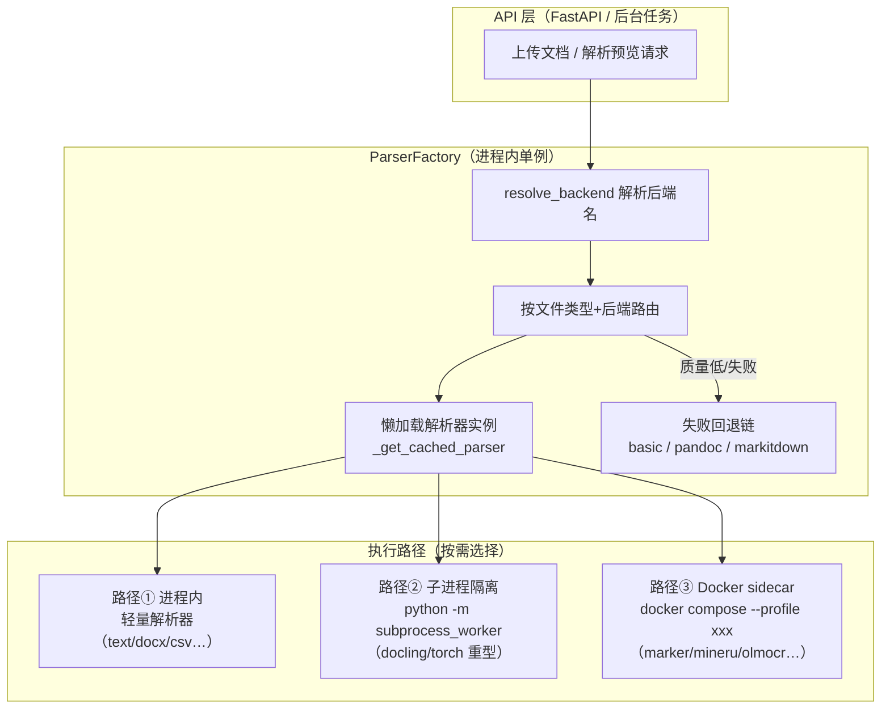
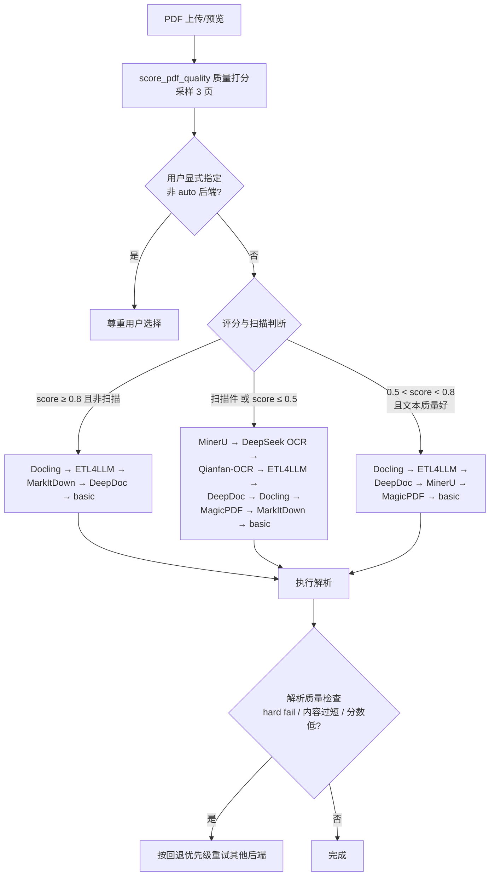

MimirQ 的文档解析层不是一个「单一解析器」，而是一个**可插拔的解析器生态系统**：仓库内提供了 30+ 种解析后端，覆盖从纯文本到扫描件、从 Office 文档到音视频的全格式范围。更关键的是，这些后端遵循「**按需启动**」原则——默认启动时只加载轻量内置解析器，重型解析器要么在**第一次被真正调用时才懒加载**，要么以**独立 Docker 容器（sidecar）**的形式按 profile 单独拉起，要么以**子进程隔离**方式运行以便随时被取消。本文带你理解这个生态的组成、分层结构与启用方式。

Sources: [factory.py](app/parsing/factory.py#L714-L797) · [subprocess_runner.py](app/parsing/subprocess_runner.py#L135-L200)

## 解析器生态全景：四种形态的 30+ 后端

要理解这 30+ 后端，先看它们被组织在 `app/parsing/parsers/` 目录下的四类形态——**内置轻量**、**本地重型（进程内）**、**外部容器服务（sidecar）** 与 **在线 API**。这个分类决定了它们占用的资源、启动方式与适用场景。

| 形态 | 代表后端 | 资源占用 | 启动方式 | 典型场景 |
|---|---|---|---|---|
| 内置轻量 | `basic`（PyMuPDF）、`text`、`markdown`、`docx`、`excel`、`pptx`、`html`、`csv`、`json`、`email`、`image`、`audio`、`video` | 低，随主后端常驻 | 进程内，首次调用时懒加载 | 文本型 PDF、Office 文档、网页、音视频 |
| 本地重型（进程内） | `deepdoc`、`docling`、`magicpdf`（本地 CLI 模式）、`markitdown`、`pandoc` | 中高，含 ONNX/torch 模型 | 进程内懒加载；`docling` 等走子进程隔离 | 结构感知解析、扫描件、复杂版面 |
| 外部容器服务（sidecar） | `marker`、`paddle_vl`、`mineru`、`mineru-vlm`、`olmocr`、`magicpdf`（服务模式）、`etl4llm`、`qianfanocr` | 高，独立容器 + GPU | `docker compose --profile xxx` 按需拉起 | 重型 OCR/版面解析，避免污染主镜像 |
| 在线 API | `mineru`（在线）、`textin`（xParse）、`deepseek_ocr`（SiliconFlow）、`glm_ocr`、`qianfan_ocr`（上游视觉） | 低（仅网络请求） | 配置 API Key/URL 即用 | 不想自建 GPU 服务的场景 |

单看 PDF 格式，`ParserFactory.SUPPORTED_PDF_BACKENDS` 就列出了 16 种可选后端：`auto`、`basic`、`marker`、`paddle_vl`、`glm_ocr`、`olmocr`、`qianfan_ocr`、`textin`、`mineru`、`deepdoc`、`deepseek_ocr`、`etl4llm`、`markitdown`、`docling`、`magicpdf`、`colpali`；再加上非 PDF 的 `pandoc`、`excel`、`docx`、`pptx`、`html`、`csv`、`json`、`email`、`image`、`audio`、`video` 等专用后端与 `text`/`markdown` 直通解析器，总数超过 30。前端解析工作台的选择器也完整呈现了这一清单（含自动选择、基础解析、结构化、OCR、API 等分类标签）。

Sources: [factory.py](app/parsing/factory.py#L101-L132) · [parser-options.ts](web/lib/parser-options.ts#L18-L114) · [parser-options.ts](web/lib/parser-options.ts#L116-L172)

## 按需启动的核心架构：三段式隔离

「按需启动」不是一句口号，而是由三层机制共同保证的架构设计。理解下面这张图，就理解了整个解析层的骨架：

**第一层：进程内懒加载单例。** `ParserFactory` 在模块级别不导入任何重型 PDF 依赖——`app.parsing.parsers` 包声明「Keep package import lightweight」，高级解析器全部通过 `_LAZY_EXPORTS` 延迟暴露。工厂实例本身也由 `get_parser_factory()` 以「双重检查锁」的单例方式创建，避免在导出 OpenAPI 等纯元数据流程中意外拉起 PyMuPDF。每个具体解析器（`_marker_parser`、`_mineru_parser`、`_deepdoc_parser` 等）初始值都是 `None`，只有在 `_get_cached_parser()` 被调用时才会 `importlib.import_module` 并实例化一次，之后缓存复用。这意味着：**启用 30 个后端 ≠ 启动时加载 30 个解析器**，未用到的解析器连代码都不会被导入。

**第二层：子进程隔离。** 对于 `docling` 这类基于 torch、无法在进程内协作式取消的重型解析器，`run_subprocess_worker()` 会以 `python -m app.parsing.subprocess_worker <payload> <result>` 启动一个独立 Python 进程：调用方把 payload 写入上传目录下的 JSON 文件，子进程解析后写回结果。子进程以 `start_new_session=True` 启动，取消时对整组进程发 SIGTERM、宽限期后升级为 SIGKILL——断连、任务取消、`asyncio.CancelledError` 三种取消源都能真正终止解析，而不是让 GPU 任务残留。

**第三层：Docker sidecar 按 profile 拉起。** 重型 OCR/版面服务（Marker、MinerU、olmOCR、MagicPDF、PaddleOCR-VL、Qianfan-OCR、ETL4LLM）全部定义在独立的 `docker/docker-compose.parsers.yml` 中，使用 Docker Compose 的 `profiles` 机制。默认 `docker compose up` 不会启动它们任何一个；只有显式指定 `--profile marker` 之类的参数时才构建并运行对应容器。主后端镜像因此保持轻量，OCR/torch/vllm 等重依赖被隔离在 sidecar 中。

Sources: [parsers/__init__.py](app/parsing/parsers/__init__.py#L1-L34) · [factory.py](app/parsing/factory.py#L268-L290) · [factory.py](app/parsing/factory.py#L1125-L1139) · [factory.py](app/parsing/factory.py#L1208-L1223) · [subprocess_worker.py](app/parsing/subprocess_worker.py#L1-L14) · [subprocess_runner.py](app/parsing/subprocess_runner.py#L64-L105)

## 后端身份：别名归一化与统一命名

30+ 后端来自不同的开源项目与商业 API，命名五花八门（`magic-pdf` vs `magicpdf`、`pymupdf` vs `basic`、`bisheng-unstructured` vs `etl4llm`……）。`app/parsing/backends.py` 专门解决这个问题：一张 `_BACKEND_ALIASES` 别名表把所有 UI/环境变量/用户输入中的常见写法映射到**内部规范名**。例如 `pymupdf`/`fitz` → `basic`，`magic-pdf`/`magic_pdf` → `magicpdf`，`paddleocr-vl`/`paddleocrvl` → `paddle_vl`，`bisheng-unstructured`/`bisheng` → `etl4llm`（兼容旧名）。`normalize_parser_backend()` 会先把输入转小写、把下划线替换为连字符，再查表；查不到就原样返回。前端 `parser-options.ts` 里的 `normalizeParserValue()` 也实现了同一套别名逻辑，保证前后端对同一后端名的理解一致。

这套规范名的意义在于：**用户无论从哪个入口（解析工作台选择器、上传 API 的 `parser_backend` 参数、系统设置里的默认解析器）指定后端，最终都会落到同一个规范标识符上**，路由与配置校验因此只需面向规范名编写。

Sources: [backends.py](app/parsing/backends.py#L10-L62) · [backends.py](app/parsing/backends.py#L64-L72) · [parser-options.ts](web/lib/parser-options.ts#L178-L200)

## 自动路由与质量回退：PDF 怎么选解析器

当用户选择 `auto`（或未指定后端）时，系统不会盲目猜测，而是走一条**「先打分、再路由」**的确定性决策链。`route_pdf_backend()` 调用 `score_pdf_quality()` 对 PDF 采样 3 页做质量评估（文本可提取性、是否扫描件、页面数、文本质量分），然后把质量画像交给 `choose_pdf_backend()` 决策：

决策优先级里藏着一个重要的工程取舍：**高分文本型 PDF 优先走轻量结构化解析（Docling/MarkItDown），只有扫描件或低分文档才动用重型 OCR 服务（MinerU/DeepSeek-OCR 等）**，避免为纯文本 PDF 白白付出 GPU 解析成本。`should_attempt_pdf_fallback()` 则定义了「什么时候该重试」的三条硬规则：质量等级为 `fail` 必重试、内容字符数低于阈值必重试、解析分数低于阈值必重试。重试时会沿着 `PDF_ADVANCED_FALLBACK_BACKENDS` 列表逐级降级，最终兜底到 `basic`（PyMuPDF 纯文本提取）。每次解析的尝试记录（后端、耗时、成败、错误类型）都会被写入 provenance 元数据，供后续审计与质量观测使用。

Sources: [routing.py](app/parsing/routing.py#L17-L50) · [routing.py](app/parsing/routing.py#L52-L146) · [routing.py](app/parsing/routing.py#L152-L172) · [factory.py](app/parsing/factory.py#L101-L116) · [factory.py](app/parsing/factory.py#L762-L800)

## DeepDoc：默认开启的结构化解析内核

在 `.env.example` 中，`DEFAULT_PARSER_BACKEND=deepdoc` 且 `DEEPDOC_ENABLED=true`——DeepDoc 是系统**默认解析后端**，也是唯一随仓库内置完整模型资源的解析器。它不是一个外部服务，而是 `app/deepdoc/` 目录下的本地解析内核：`parser/` 子目录提供 PDF、DOCX、Excel、PPT、HTML、JSON、Markdown、TXT、MinerU 适配、Docling 适配等解析实现；`vision/` 子目录提供版面识别（layout_recognizer）、OCR（ocr/t_ocr）、表格结构识别（table_structure_recognizer）等视觉算子。

DeepDoc 的小模型体系由 `config/parsing_small_models.yaml` 注册表管理：8 类任务（layout、table_detection、table_structure、ocr_detection、ocr_recognition、document_orientation、document_rectification、textline_orientation）各自有默认模型与可选模型。默认模型是**随仓库捆绑的 ONNX 模型**（`app/deepdoc/resources/models/`，CPU 可跑），可选模型则是 HuggingFace 上的重型模型（如 `microsoft/table-transformer-*`、`PaddlePaddle/SLANeXt`、`PaddlePaddle/PP-DocLayoutV3`，多为 GPU 优先）。`SmallModelRuntime.resolve()` 负责按任务解析模型状态，并在解析结果元数据中报告每个任务的可用性。

DeepDoc 的价值不止于「解析」：`DeepDocParser` 在 `parse()` 中串联了一整套**文档增强管线**——重复页眉页脚移除、阅读顺序修复、章节树构建、表格规范化（Markdown/HTML/CSV 三种渲染）、水印检测与抑制、印章识别、图表/公式区域检测、图表标题关联、跨页表格链接等。每个解析结果都会附带 `mimirq.deepdoc_profile.v1` 结构画像（各阶段耗时、文档/章节/媒体数量、小模型可用性汇总、OCR 识别画像），让「这次解析质量如何」变得可观测。

Sources: [.env.example](.env.example#L1217) · [.env.example](.env.example#L1265) · [deepdoc_parser.py](app/parsing/parsers/deepdoc_parser.py#L89-L115) · [deepdoc_parser.py](app/parsing/parsers/deepdoc_parser.py#L174-L200) · [deepdoc_parser.py](app/parsing/parsers/deepdoc_parser.py#L293-L330) · [parsing_small_models.yaml](config/parsing_small_models.yaml#L1-L24) · [parsing_small_models.yaml](config/parsing_small_models.yaml#L119-L169) · [parsing_small_models.yaml](config/parsing_small_models.yaml#L218-L236)

## Docker Compose 按需拉起外部解析服务

对于 Marker、MinerU、olmOCR 这类重型解析器，最推荐的启动方式是使用 `docker/docker-compose.parsers.yml` 中预置的 sidecar 服务。该文件通过 Compose `profiles` 机制把每个服务隔离成独立开关，Makefile 也提供了对应的 `make up-<name>` 一键目标：

| Make 目标 | Compose profile | 容器服务 | 默认端口（宿主机） | 是否需要 GPU | 对应环境变量 |
|---|---|---|---|---|---|
| `make up-etl4llm` | `etl4llm` | `mimirq-etl4llm`（Bisheng Unstructured 镜像） | 10001 | 否 | `ETL4LLM_ENABLED` + `ETL4LLM_API_URL` |
| `make up-marker` | `marker` | `mimirq-marker` | 2080 | 否（CPU 可跑） | `MARKER_ENABLED` + `MARKER_API_URL` |
| `make up-paddlevl` | `paddlevl` | `mimirq-paddlevl`（PaddleOCR doc_parser v1.5） | 9030 | 是（约 8.2 GiB） | `PADDLE_VL_ENABLED` + `PADDLE_VL_API_URL` |
| `make up-mineru` | `mineru` | `mimirq-mineru-models`（一次性模型预热） + `mimirq-mineru` | 30001 → 容器 8000 | 是 | `MINERU_ENABLED` + `MINERU_LOCAL_SERVER_URL` |
| `make up-mineru-vlm` | `mineru` + `mineru-vlm` | 追加 `mimirq-mineru-vlm`（vLLM 服务） | 30002 → 容器 30000 | 是（显存建议 0.45） | `MINERU_BACKEND=vlm-http-client` + `MINERU_VL_SERVER` |
| `make up-olmocr` | `olmocr` | `mimirq-olmocr` | 2085 | 是（约 43.7 GiB，48G 单卡独占） | `OLMOCR_ENABLED` + `OLMOCR_API_URL` |
| `make up-magicpdf` | `magicpdf` | `mimirq-magicpdf` | 2095 | 是（可切 CPU） | `MAGIC_PDF_ENABLED` + `MAGIC_PDF_API_URL` |
| `make up-qianfanocr` | `qianfanocr` | `mimirq-qianfanocr`（轻量编排容器） | 2090 | 否（上游推理承担） | `QIANFAN_OCR_ENABLED` + `QIANFAN_OCR_API_URL` |

几个值得注意的工程细节：MinerU 的 `mimirq-mineru-models` 是一次性容器，专门在首次部署时预热共享模型缓存卷（`mineru_cache`），正式服务通过 `depends_on: condition: service_completed_successfully` 等待其完成后才启动；MagicPDF 服务默认**只读复用** MinerU 的模型缓存卷（`mineru_cache:/opt/mimirq-model-cache:ro`），避免重复下载 PDF-Extract-Kit 模型；olmOCR 默认 `GPU_MEMORY_UTILIZATION=0.35`，专门为与 MinerU/PaddleVL 共享单张 48GB 显卡的场景做了显存预算。所有服务都带 `/health` 健康检查，Compose 会基于健康状态管理容器生命周期。

Sources: [docker-compose.parsers.yml](docker/docker-compose.parsers.yml#L15-L34) · [docker-compose.parsers.yml](docker/docker-compose.parsers.yml#L36-L53) · [docker-compose.parsers.yml](docker/docker-compose.parsers.yml#L55-L84) · [docker-compose.parsers.yml](docker/docker-compose.parsers.yml#L103-L159) · [docker-compose.parsers.yml](docker/docker-compose.parsers.yml#L169-L205) · [docker-compose.parsers.yml](docker/docker-compose.parsers.yml#L222-L259) · [docker-compose.parsers.yml](docker/docker-compose.parsers.yml#L277-L306) · [docker-compose.parsers.yml](docker/docker-compose.parsers.yml#L325-L343) · [Makefile](Makefile#L206-L229)

## 启用一个后端的完整流程

对初学者来说，「启用一个解析后端」遵循统一的四步模式，以 Marker 为例：

**第一步：拉起 sidecar 服务。** `make up-marker`（等价于 `docker compose -f docker/docker-compose.yml -f docker/docker-compose.parsers.yml --profile marker up -d --build`）。这一步是可选的——如果你的后端是纯在线 API（如 TextIn、DeepSeek-OCR），直接跳到第二步。

**第二步：在 `.env` 中开启开关并填必填配置。** 每个后端的配置都遵循「`<NAME>_ENABLED=true` + 必填字段」的约定。`ParserFactory.PDF_SETTING_REQUIREMENTS` 集中定义了每个 PDF 后端的开关名与必填项：Marker 需要 `MARKER_API_URL`，TextIn 需要 `TEXTIN_APP_ID` 与 `TEXTIN_SECRET_CODE`，DeepSeek-OCR 需要 `SILICONFLOW_API_KEY`，MinerU 需要 `MINERU_API_TOKEN`（在线）或 `MINERU_LOCAL_SERVER_URL`（本地）二选一。

**第三步：重启后端服务**，让配置生效。

**第四步：在三种入口之一使用它。** 解析工作台手动选择解析器、上传 API 指定 `parser_backend=<name>`、或把系统设置的 `DEFAULT_PARSER_BACKEND` 切换为该后端。`_validate_pdf_setting_requirements()` 会在运行时校验开关与必填配置，未启用或缺失配置会抛出带明确提示的 `ValueError`（例如「Marker parser is not enabled. Please set MARKER_ENABLED=True and configure MARKER_API_URL.」），而不是静默失败。

| 后端 | 启用开关 | 必填配置 | 额外可选配置 |
|---|---|---|---|
| DeepDoc | `DEEPDOC_ENABLED=true`（默认） | 无（模型随仓库捆绑） | `SEAL_RECOGNITION_ENABLED` 等增强开关 |
| Docling | `DOCLING_ENABLED=true`（默认） | 无 | `DOCLING_OCR_ENABLED`、`DOCLING_TABLE_MODE` |
| MarkItDown | `MARKITDOWN_ENABLED=true`（默认） | 无 | `MARKITDOWN_USE_PLUGINS` |
| MinerU | `MINERU_ENABLED=true` | `MINERU_API_TOKEN` 或 `MINERU_LOCAL_SERVER_URL` | `MINERU_BACKEND`、`MINERU_MODEL_SOURCE`、`MINERU_VL_SERVER` |
| MagicPDF | `MAGIC_PDF_ENABLED=true` | `MAGIC_PDF_API_URL`（服务模式）或 CLI+模型目录 | `MAGIC_PDF_DEVICE_MODE`、`MAGIC_PDF_METHOD` |
| olmOCR | `OLMOCR_ENABLED=true` | `OLMOCR_API_URL` | `OLMOCR_GPU_MEMORY_UTILIZATION`、`OLMOCR_MAX_CONCURRENT_JOBS` |
| TextIn | `TEXTIN_ENABLED=true` | `TEXTIN_APP_ID`、`TEXTIN_SECRET_CODE` | `TEXTIN_PARSE_MODE`、`TEXTIN_TABLE_FLAVOR` |
| DeepSeek-OCR | `DEEPSEEK_OCR_ENABLED=true` | `SILICONFLOW_API_KEY` | `DEEPSEEK_OCR_CONCURRENCY`、`DEEPSEEK_OCR_PDF_DPI` |

Sources: [factory.py](app/parsing/factory.py#L188-L246) · [factory.py](app/parsing/factory.py#L486-L515) · [.env.example](.env.example#L998-L1058) · [.env.example](.env.example#L1096-L1214) · [.env.example](.env.example#L1286-L1349)

## 状态检查与排障

配置完成后，`make parser-status`（等价于 `python scripts/check_parsers.py`）会输出一份**每个后端的开关状态与配置完整性报告**——这是排查「为什么我选了 Marker 却走了 basic」的第一站。脚本逐项检查：内置 `basic` 恒为 on；DeepDoc 检查 `app.deepdoc.parser` 能否导入；各外部服务检查开关与必填配置；MinerU 还会解析 API Token 的 JWT 过期时间（`api_token expired at ...`）；Pandoc/LibreOffice 检查 CLI 是否在 PATH 中；MagicPDF 区分「服务模式已配置」与「本地 CLI + 模型目录」两种就绪状态。

常见的三类问题与对应解法：

| 现象 | 原因 | 排查方向 |
|---|---|---|
| 指定了后端但解析仍走 `basic` | 后端开关未开启或必填配置缺失 | `make parser-status` 看该后端状态；按提示补 `_ENABLED=true` 与必填字段 |
| 容器起来了但解析超时 | sidecar 健康检查未通过 / GPU 不可用 / 模型未预热 | 检查 `docker compose ps` 健康状态；MagicPDF 确认 `MAGIC_PDF_DEVICE_MODE=cuda`；MinerU 确认 `mimirq-mineru-models` 一次性容器已成功完成 |
| Docker 内网地址不通 | 后端跑在宿主机、sidecar 在容器网络，或反之 | 参考 `service_url_fallback.py` 的双地址候选机制（服务主机名 ↔ `127.0.0.1`），按部署形态选用 `mimirq-xxx` 主机名或 `localhost:端口` |

另外，`app/services/parse_cache.py` 提供了可选的解析缓存（默认关闭）：以 `sha256(文件) + 解析后端 + 配置哈希` 为键，把逐页 Markdown 结果存到 MinIO 并施加 TTL，避免对相同输入重复跑昂贵的解析后端。它遵循「安全默认」原则——显式启用才会生效，且缓存故障绝不影响入库主流程。

Sources: [check_parsers.py](scripts/check_parsers.py#L95-L130) · [check_parsers.py](scripts/check_parsers.py#L140-L198) · [Makefile](Makefile#L363-L364) · [service_url_fallback.py](app/parsing/parsers/service_url_fallback.py#L1-L48) · [parse_cache.py](app/services/parse_cache.py#L1-L40)

## 阅读路线建议

解析器生态是「知识处理流水线」的入口。读完本页后，推荐按以下顺序深入：

- **想知道解析器工厂、路由与子进程隔离的完整实现** → [文档解析框架：解析器工厂、后端路由与子进程隔离](12-wen-dang-jie-xi-kuang-jia-jie-xi-qi-gong-han-hou-duan-lu-you-yu-zi-jin-cheng-ge-chi)（深入解析板块）
- **想知道解析之后文档如何被切块** → [切块策略体系：86 种策略、父子切块与策略矩阵](13-qie-kuai-ce-lue-ti-xi-86-chong-ce-lue-fu-zi-qie-kuai-yu-ce-lue-ju-zhen)
- **想知道解析结果如何在界面上被人工编辑与对比** → [解析工作台：PDF 渲染、版面元素编辑与解析对比](28-jie-xi-gong-zuo-tai-pdf-xuan-ran-ban-mian-yuan-su-bian-ji-yu-jie-xi-dui-bi)
- **想从用户视角走一遍「上传 → 解析 → 切块 → 检索」全流程** → [用户操作指南：数据集、上传解析、切块、检索与引用验证](5-yong-hu-cao-zuo-zhi-nan-shu-ju-ji-shang-chuan-jie-xi-qie-kuai-jian-suo-yu-yin-yong-yan-zheng)
- **想了解 Docker Compose 整体部署（含解析器 profile 的编排关系）** → [部署方案与运维手册：Docker Compose、Helm、备份恢复与演练](29-bu-shu-fang-an-yu-yun-wei-shou-ce-docker-compose-helm-bei-fen-hui-fu-yu-yan-lian)