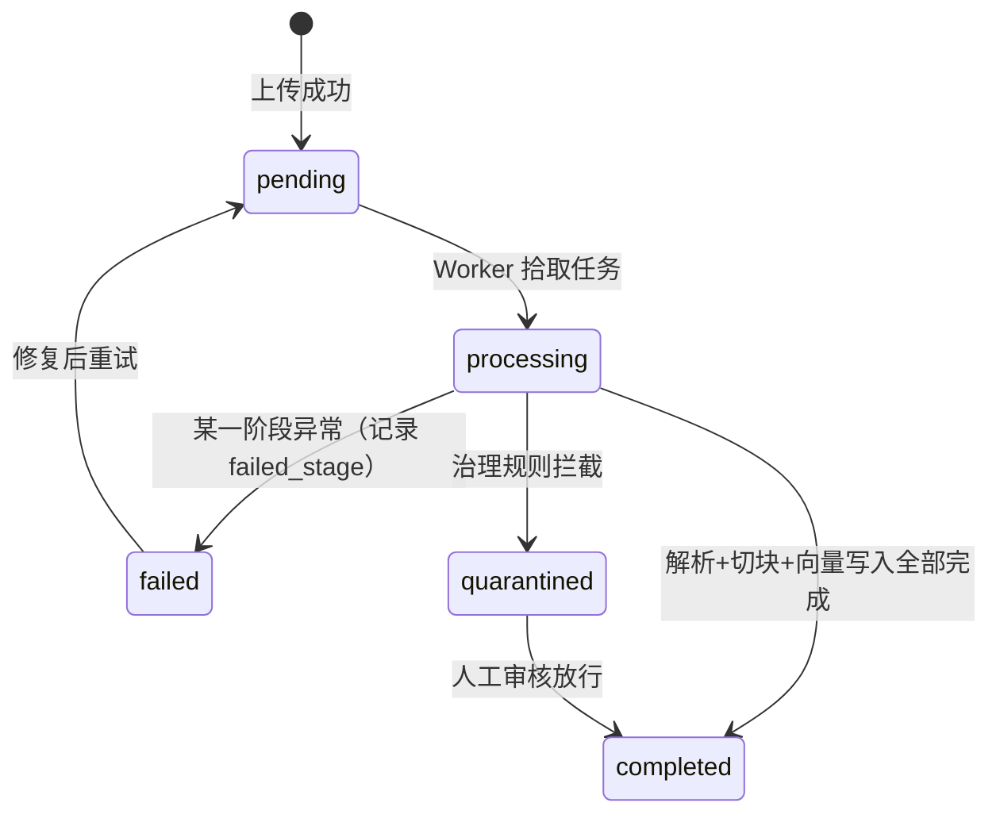

本页面向第一次上手 MimirQ 的开发者与知识库运营人员，讲解一条完整的用户操作链路：**创建数据集 → 上传文件并解析 → 选择切块策略 → 验证检索 → 在问答中核对引用**。与架构类页面不同，这里不展开内部实现，只回答"在页面上点什么、每个选项意味着什么、如何判断结果是否正确"。启动服务与模型配置请先阅读 [快速开始：Docker 一键启动与源码开发模式](2-kuai-su-kai-shi-docker-jian-qi-dong-yu-yuan-ma-kai-fa-mo-shi) 与 [环境变量与模型服务接入：LLM、Embedding、Reranker 配置](3-huan-jing-bian-liang-yu-mo-xing-fu-wu-jie-ru-llm-embedding-reranker-pei-zhi)。

## 一、从文件到可验证答案：全流程总览

MimirQ 把"知识库建设"拆成五个可独立验收的环节。**数据集**是权限、索引与检索范围的边界；**上传解析**把原始文件变成结构化 Markdown；**切块**把解析结果切成可检索的最小单元；**检索**验证系统能否找到正确证据；**引用验证**确认 LLM 生成的答案能回到具体文件与原文片段。每一步都有独立页面和独立验收标准，任何一环失败都不应该靠修改提示词来掩盖。

```mermaid
flowchart LR
    A[1. 创建数据集<br/>/datasets] --> B[2. 上传与解析<br/>/knowledge/ingestion]
    B --> C[3. 切块与索引<br/>/chunk-preview 验证]
    C --> D[4. 检索测试<br/>/knowledge 检索页]
    D --> E[5. 带引用问答<br/>/ 首页对话]
    E --> F[核对"来源与证据"]
    F -- 证据缺失或错误 --> D
    F -- 通过验收 --> G[进入评测与反馈闭环]
```

这个闭环与 [RAG 对话引擎：引用生成、声明证据映射与忠实度评分](20-rag-dui-hua-yin-qing-yin-yong-sheng-cheng-sheng-ming-zheng-ju-ying-she-yu-zhong-shi-du-ping-fen) 描述的引擎行为一一对应：检索产出候选文档，引擎将其组装为带证据起止位置的引用对象，再交给 LLM 生成回答。操作者只需要记住一条主线：**先确认检索能找到证据，再确认回答引用了证据**。

Sources: [docs/user_guide.md](docs/user_guide.md#L15-L33)、[app/api/v1/retrieval_explain.py](app/api/v1/retrieval_explain.py#L105-L130)

## 二、第一步：创建与配置数据集

数据集是 MimirQ 中最基础的资源容器。打开 `/datasets` 页面，点击"新建数据集"按钮，填写名称、说明，然后选择访问范围即可创建。每个数据集在数据库中对应一条记录，核心字段包括名称、描述、**权限枚举**（`permission`）与可选的 JSONB 元数据（用于存放解析器、切块等管线默认值）。租户内数据集名称不允许重复，这是为了避免同名知识库造成混淆。

Sources: [app/models/dataset.py](app/models/dataset.py#L20-L60)、[web/components/datasets/create-dataset-button.tsx](web/components/datasets/create-dataset-button.tsx#L1-L28)

### 访问范围怎么选

创建对话框中的"访问范围"对应后端 `DatasetPermissionEnum` 的三种取值。**默认 `all_team_members` 允许租户内所有成员读取**，适合团队共享知识库；敏感资料应改用 `only_me`（仅创建者可读）或 `partial_members`（创建者 + 成员/组白名单）。`partial_members` 的白名单成员与用户组分别在 `/settings/rbac` 和 `/settings/groups` 中维护。

| 权限值 | 界面标签 | 读取范围 | 典型场景 |
|:---|:---|:---|:---|
| `all_team_members` | 全员 | 租户内所有成员 | 团队共享的公共知识库 |
| `only_me` | 仅自己 | 仅数据集创建者 | 草稿、私有笔记 |
| `partial_members` | 部分成员 | 创建者 + 白名单成员/组 | 跨部门受限共享 |

权限规则默认 fail-closed：未在允许列表中的账号即使知道数据集 ID 也无法读取。文档层面还可叠加文档级 ACL（`only_me` / `partial_members` / `all_team_members`），形成"数据集权限 × 文档权限"的双层过滤。

Sources: [app/models/dataset.py](app/models/dataset.py#L9-L18)、[web/components/datasets/datasets-page.tsx](web/components/datasets/datasets-page.tsx#L63-L82)、[app/models/document.py](app/models/document.py#L34-L44)

### 数据集级管线默认值

创建或编辑数据集时，可以同时设置**管线默认值**（`dataset_metadata`），例如默认解析器（`default_parser_backend`）与默认切块策略（`default_chunk_strategy`）。上传文档时，如果请求没有显式指定解析器或切块策略，系统会按"数据集默认值 → 全局默认值"的顺序回退。这保证了同一个数据集内的文档使用一致的解析与切块口径，是后续评测可复现的前提。

Sources: [app/api/v1/document_upload.py](app/api/v1/document_upload.py#L690-L726)

## 三、第二步：上传文件并解析

### 3.1 三种上传入口

上传入口统一在入库工作台 `/knowledge/ingestion`，页面支持拖拽文件、选择本地文件，也可以切换到预检模式（`precheck_first`）。后端提供三个对应的 HTTP 接口：单文件上传 `POST /documents/upload`、URL 导入 `POST /documents/upload-url`、批量上传 `POST /documents/upload-batch`（批量默认并发 5）。上传表单的核心字段只有五个：`parser_backend`（解析器后端）、`chunk_strategy`（切块策略）、`pipeline`（管线选项 JSON）、`dataset_id`（目标数据集）、`user_metadata`（用户自定义元数据）。

Sources: [app/api/v1/documents.py](app/api/v1/documents.py#L2520-L2537)、[app/api/v1/document_upload.py](app/api/v1/document_upload.py#L1074-L1103)

### 3.2 支持哪些文件格式

后端通过 `ALLOWED_EXTENSIONS` 配置白名单控制可上传类型，覆盖办公文档（`.pdf`、`.doc/.docx`、`.ppt/.pptx`、`.xls/.xlsx`、`.csv`）、标记文本（`.md`、`.rst`、`.adoc`、`.tex`）、结构化数据（`.json`、`.jsonl`、`.xml`、`.sql`、`.yaml`、`.toml`）以及常见代码文件（`.py`、`.ts`、`.go`、`.java` 等）。前端上传组件使用同一份扩展名清单（`UPLOAD_ALLOWED_EXTENSIONS`），因此页面上传与 API 上传的格式约束是一致的。不在白名单内的扩展名会被直接拒绝并返回 400。

Sources: [app/core/config.py](app/core/config.py#L691-L697)、[web/lib/upload-extensions.ts](web/lib/upload-extensions.ts#L1-L80)

### 3.3 解析器怎么选

上传表单中的 `parser_backend` 决定用什么引擎把原始文件转成结构化文本。默认值是 `auto`（自动路由），回退到数据集默认值后再回退到全局默认。常用选项包括：内置 DeepDoc（常规 PDF/Office/文本，无需额外容器）、Marker（PDF 转 Markdown、无 GPU 场景）、MinerU pipeline（表格/公式/图片密集的 PDF）、PaddleOCR-VL（扫描件与复杂版面，需要 GPU），以及 Qianfan-OCR / TextIn 等外部视觉 OCR。**解析器选型直接影响后续切块质量**：例如 `pdf_layout` 切块策略依赖解析结果中的位置标签（`@@page\tl\tr\tt\tb##`），只有能输出版面坐标的解析器才能配合使用。

Sources: [app/core/config.py](app/core/config.py#L1989-L1990)、[docs/user_guide.md](docs/user_guide.md#L210-L222)、[docs/guides/chunk_strategies.md](docs/guides/chunk_strategies.md#L5-L14)

### 3.4 文档状态与处理阶段

上传后文档进入异步处理流水线。数据库中的 `status` 字段记录生命周期：`pending`（等待处理）→ `processing`（处理中）→ `completed`（完成）| `failed`（失败）| `quarantined`（被治理规则拦截）| `cancelled`（取消）| `deleting`（删除中）；`current_stage` 则记录当前处理子阶段：`parsing` → `chunking` → `embedding` → `vector_write` → `completed`。失败时还会记录 `failed_stage`、`error_code`、`error_message` 与 `processing_attempts`。



在 `/knowledge` 页面可以按状态、生命周期（active/archived/disabled）、文件类型、关键词过滤文档列表，文档列表接口 `GET /documents` 支持这些过滤参数。**不要把 `processing` 当成异常**——它实际包含 `pending` 与 `processing` 两种内部状态；长期停留在 `processing` 才是需要排查的信号（优先检查 Worker、Redis 与解析器容器）。

Sources: [app/models/document.py](app/models/document.py#L66-L87)、[app/api/v1/document_listing.py](app/api/v1/document_listing.py#L73-L140)

## 四、第三步：切块与索引

### 4.1 切块策略速查

切块把解析后的文本切成可检索、可引用的最小单元（`DocumentChunk`，记录 `chunk_index`、`content`、`page_number`、`start_char`、`end_char` 等位置信息）。系统内置 80+ 种注册策略，从通用递归切块到面向特定文档类型的结构化切块一应俱全。对初学者，先按文档类型选择策略，不要一上来就调参：

| 文档类型 | 推荐起点 | 说明 |
|:---|:---|:---|
| 通用 Markdown / 说明文 / 制度 | `auto` 或 `langchain_recursive` | `chunk_size` 600-1500，`chunk_overlap` 10-25% |
| 版式 PDF（含位置标签） | `pdf_layout` | 按版面块聚合，保留 bbox 用于 PDF 高亮 |
| 标题层级清晰的 Markdown | `markdown_outline` / `markdown_header` | 优先按标题边界切分，保留 `header_path` |
| FAQ / 问答对 | `qa_pairs` / `qa_markdown` | 保证每组问答不被拆散 |
| 合同 / 法律 / 制度条款 | `laws_structured` | 按条款结构切分 |
| 会议纪要 / 访谈 | `transcript` / `meeting_minutes` | 保留发言轮次上下文 |
| 需要严格控制上下文长度 | `langchain_token` | 按 token 计，256-1024 |

两个核心参数：`chunk_size`（目标块大小，字符或 token）与 `chunk_overlap`（相邻块重叠量）。常见反模式包括 `overlap >= chunk_size`（被直接拒绝）、块过小（召回噪声上升、引用溯源变差）、块过大（单块包含多个主题）。更完整的策略矩阵与调参细节属于 [切块策略体系：86 种策略、父子切块与策略矩阵](13-qie-kuai-ce-lue-ti-xi-86-chong-ce-lue-fu-zi-qie-kuai-yu-ce-lue-ju-zhen) 的主题，本页只讲操作路径。

Sources: [docs/guides/chunk_strategies.md](docs/guides/chunk_strategies.md#L1-L53)、[app/models/document.py](app/models/document.py#L120-L145)、[app/rag/chunking/factory.py](app/rag/chunking/factory.py#L261-L266)

### 4.2 用切块预览验证边界

正式入库前，建议在 `/chunk-preview` 页面上传样本文件，可视化验证切块边界。工作台按"解析 → 切块 → 复核/预览"三步组织：左侧选择策略与参数，中间查看原始文档，右侧查看生成的切片列表（每条显示序号、页码、字符数）。你可以并排对比两种策略（A/B 比较），检查标题、段落、表格或父子块是否被错误拆开。**切块预览只用于试验参数**，正式资产仍应从入库页面提交，确保解析结果与切块策略一起写入数据集。

Sources: [web/app/chunk-preview/page.tsx](web/app/chunk-preview/page.tsx#L1-L25)、[web/components/chunk-preview/components/workbench/index.tsx](web/components/chunk-preview/components/workbench/index.tsx#L51-L100)、[web/components/chunk-preview/components/workbench/index.tsx](web/components/chunk-preview/components/workbench/index.tsx#L25-L48)

### 4.3 把常用配置固化为切块预设

如果团队反复使用同一套"策略 + 参数"，可以保存为**切块预设**（ChunkPreset）。预设是租户级模板，字段包括名称、描述与声明式参数负载（`payload`，纯 JSON，不包含可执行代码），可选绑定到某个数据集。预设接口提供完整的增删改查（`POST/GET/PATCH/DELETE /chunk-presets`），创建后可在上传或切块预览时一键复用，减少反复试错。

Sources: [app/models/chunk_preset.py](app/models/chunk_preset.py#L17-L43)、[app/api/v1/chunk_presets.py](app/api/v1/chunk_presets.py#L1-L100)

### 4.4 管线选项：索引哪些通道

上传表单中的 `pipeline` 选项控制入库时构建哪些索引通道，常见开关包括：`chunk_vector_enabled`（向量索引）、`bm25_index_enabled`（稀疏/关键词索引）、`kg_enabled`（知识图谱）、`event_vector_enabled` / `entity_vector_enabled`（KG 事件/实体向量）、`governance_enabled`（治理清洗）。界面提供三档预设：**自定义**（保持当前配置）、**Economical 省成本**（关闭治理/去重/KG，适合大规模导入）、**High-quality 高质量**（开启治理与上下文前缀，召回更稳）。初学者建议先用默认或 high-quality 预设；切换 Embedding 供应商或向量维度后必须重建已有索引。

Sources: [web/components/pipeline-options-panel.tsx](web/components/pipeline-options-panel.tsx#L62-L100)

## 五、第四步：检索测试

### 5.1 在知识库页面验证检索

打开 `/knowledge`，选择目标数据集后切换到"检索"页签，输入一个**能在测试文档中唯一命中的短语或业务问题**，系统会返回命中的 Chunk 列表。检索预览面板展示每条候选的文档来源、综合分（`relevance_score`）、向量分（`vector_score`）、关键词分（`bm25_score`）、重排分（`rerank_score`）与命中类型（`hit_type`），并支持点击定位到原文。这一步只验证"能否找到证据"，不涉及 LLM 生成。

Sources: [web/components/knowledge/knowledge-page.tsx](web/components/knowledge/knowledge-page.tsx#L67-L120)、[web/components/rag/retrieve-preview-panel.tsx](web/components/rag/retrieve-preview-panel.tsx#L1-L100)

### 5.2 检索接口与可解释输出

检索预览与证据检索走同一套后端逻辑：`POST /rag/retrieve` 返回带引用的证据响应；`POST /rag/retrieve-preview` 返回更细的预览结构。如果想深入诊断某条查询的召回/重排行为，可以使用 `POST /retrieval/explain`——它只执行检索、不调用 LLM，返回查询改写后的检索语句、各检索通道的候选数量、重排结果、阶段耗时与检索 Trace。请求支持通过 `dataset_id` 或 `document_ids` 限定范围，并可通过 `rag_config.retrieval_profile` 选择预设（如 `hybrid_ce` 生产基线、`recall20` 召回优先、`expanded` 层级召回扩展）。

Sources: [app/api/v1/rag.py](app/api/v1/rag.py#L440-L441)、[app/api/v1/rag.py](app/api/v1/rag.py#L966-L967)、[app/api/v1/retrieval_explain.py](app/api/v1/retrieval_explain.py#L37-L78)、[app/rag/retrieval/orchestrator.py](app/rag/retrieval/orchestrator.py#L602-L680)

### 5.3 检索为空时的排查顺序

检索结果为空时，按以下顺序排查，**不要先修改 LLM 提示词**：① 文档状态是否为 `completed`（未完成不会进入索引）；② 是否真的生成了 Chunk（`chunk_count` 是否为 0）；③ 数据集范围是否正确（提问时是否选中了目标数据集）；④ 权限是否可达（数据集权限 + 文档 ACL）；⑤ Embedding runtime 是否可用。检索流程的通道细节（向量、BM25、RRF 融合、重排）分别属于 [混合检索与融合策略](16-hun-he-jian-suo-yu-rong-he-ce-lue-xiang-liang-xi-shu-jian-suo-yu-rrf-rong-he) 与 [重排器体系](17-zhong-pai-qi-ti-xi-cross-encoder-colbert-ltr-mmr-yu-hun-he-zhong-pai) 的范畴。

Sources: [docs/user_guide.md](docs/user_guide.md#L88-L97)、[app/api/v1/document_listing.py](app/api/v1/document_listing.py#L73-L108)

## 六、第五步：带引用问答与证据验证

### 6.1 在首页发起问答

回到首页 `/`，选择目标数据集后提问。后端流式返回三类关键事件：`citations`（引用列表，在生成回答之前先发出）、`token`（流式文本）、`done`（完成）。**引用先于回答生成**，这意味着每条回答都绑定了一组在检索阶段就已确定的证据。前端把引用渲染为可点击的卡片与内联锚点（`mimirq-citation://` 协议链接），点击可打开证据查看器或定位到原文位置。

Sources: [app/rag/engine.py](app/rag/engine.py#L1958-L1992)、[web/components/chat/message-item.tsx](web/components/chat/message-item.tsx#L34-L120)

### 6.2 一条引用包含哪些信息

每条引用的数据结构（`Citation`）远不止"文件名 + 链接"，它包含四类信息：**身份**（`document_id`、`document_name`、`chunk_id`、`chunk_index`）、**位置**（`page_number`、`start_char`/`end_char`、证据级 `evidence_start_char`/`evidence_end_char`、PDF 版面 `bbox`）、**分数**（`relevance_score`、`vector_score`、`bm25_score`、`rerank_score`、`hit_type`）与**可选增强**（`header_path`、`chunk_role`、`retrieval_role`、图片字段 `has_image`/`img_url`）。证据级起止字符（`evidence_*`）用于精确圈定支撑某句话的原文片段，是"引用可验证"的关键。

Sources: [app/api/schemas/chat.py](app/api/schemas/chat.py#L146-L195)

### 6.3 引用如何从检索文档构建

后端 `build_citations_from_docs` 把检索返回的候选文档逐一转换为引用对象：提取页面号、位置标签 bbox、查询词匹配窗口、命中类型与媒体字段，并合并层级父子块跨度。若开启了严格证据跨度模式（`RAG_EVIDENCE_REQUIRE_SPANS_ENABLED`），缺少有效 `evidence_start_char`/`evidence_end_char` 的引用会被过滤掉，确保每条引用都能定位到原文片段。

Sources: [app/rag/core/citations.py](app/rag/core/citations.py#L1177-L1210)、[app/rag/engine.py](app/rag/engine.py#L1958-L1987)

### 6.4 证据不足时的拒答行为

系统可以配置"证据不足即拒答"（abstain）策略：当引用数量低于 `RAG_ABSTAIN_MIN_CITATIONS` 或最高相关度低于 `RAG_ABSTAIN_MIN_TOP_RELEVANCE_SCORE` 时，引擎拒绝生成回答并给出原因（如 `citations_lt_min`、`top_relevance_lt_min`）。对使用者来说，**拒答不是错误**，而是"检索没有找到足够证据"的正常信号——此时应回到检索测试环节排查，而不是反复重试同一个问题。回答下方还会展示"来源与证据"面板，按声明（claim）分组列出支撑证据；`no_evidence` 标记表示该声明没有找到支撑片段。

Sources: [app/rag/engine.py](app/rag/engine.py#L2009-L2028)、[app/rag/core/sentence_citations.py](app/rag/core/sentence_citations.py#L29-L147)

### 6.5 证据查看器与三类证据形态

点击引用卡片会打开证据查看器。前端根据引用元数据自动推断证据形态：**文本**（默认）、**表格**（`hit_type=table` 或 `chunk_role` 含 table）、**图片**（`has_image` 或 `hit_type=image`），标题显示"Evidence · 文档名 · P.页码"。图片证据通过 MinIO 路径（`{tenant_id}:{dataset_id}:{document_id}:{chunk_index}`）加载并展示。引用卡片上还会显示综合分与重排/向量/关键词各通道分数，帮助判断该条证据的强度。

Sources: [web/components/evidence/evidence-viewer-dialog.tsx](web/components/evidence/evidence-viewer-dialog.tsx#L1-L100)、[web/components/chat/message-item.tsx](web/components/chat/message-item.tsx#L180-L250)

### 6.6 把验证过的证据沉淀为评测资产

在 `/datasets/{id}/evidence` 页面，可以把验证过的"查询 + 人工选定的参考来源"整理为证据套件（EvidenceSuite）与证据项（EvidenceItem）。证据项状态流为 `draft → reviewed → approved → archived`，包含查询、期望答案、参考来源、检索快照与 RAG 配置快照。经批准的证据项可同步为回归用例，形成"线上反馈 → 证据复核 → 回归"的闭环。这一步把本页的"手动验证"升级为可自动化的质量资产，后续衔接 [评测体系：Golden 回归、Recall/MRR 指标与 800 题基准](23-ping-ce-ti-xi-golden-hui-gui-recall-mrr-zhi-biao-yu-800-ti-ji-zhun)。

Sources: [app/models/evidence.py](app/models/evidence.py#L52-L95)、[app/api/v1/evidence.py](app/api/v1/evidence.py#L473-L504)、[app/api/v1/evidence.py](app/api/v1/evidence.py#L1238-L1281)

## 七、验收标准与常见问题

### 7.1 最小闭环验收清单

跑通第一个知识库后，用下面的清单逐项验收。**只有回答文本而没有可核对的引用，不算完成闭环**——回答必须能回到具体文件、页码与证据片段。

| 检查项 | 通过条件 | 在哪里看 |
|:---|:---|:---|
| 数据集 | 创建成功且权限符合预期 | `/datasets` |
| 文档 | 状态为 `completed`，`chunk_count > 0` | `/knowledge` 文档列表 |
| 解析 | 解析内容可见，无乱码或结构丢失 | `/parsing` 或文档详情 |
| 切块 | 标题/段落/表格边界未被拆散 | `/chunk-preview` |
| 检索 | 唯一短语能命中正确 Chunk | `/knowledge` 检索页签 |
| 引用 | "来源与证据"定位到正确文件与原文 | 首页问答回答下方 |

Sources: [docs/user_guide.md](docs/user_guide.md#L98-L106)、[app/models/document.py](app/models/document.py#L66-L78)

### 7.2 常见问题速查

| 现象 | 首先检查 | 下一步 |
|:---|:---|:---|
| 上传被拒（400） | 文件扩展名是否在白名单内 | 查看 `ALLOWED_EXTENSIONS` 配置 |
| 文档长期 `processing` | Worker、Redis、解析器容器、`error_message` | 查看 [入库生命周期与失败处理](15-ru-ku-sheng-ming-zhou-qi-yu-shi-bai-chu-li-ingestion-runs-si-xin-dui-lie-yu-zhong-shi-ji-zhi) |
| `completed` 但检索为空 | Chunk 是否生成、数据集范围、ACL、Embedding runtime | 查看本页 5.3 节排查顺序 |
| 检索正确但答案错误 | Prompt、上下文裁剪、LLM 输出与引用 | 查看 [RAG 对话引擎](20-rag-dui-hua-yin-qing-yin-yong-sheng-cheng-sheng-ming-zheng-ju-ying-she-yu-zhong-shi-du-ping-fen) |
| 引用缺少证据片段 | 解析器是否输出位置信息、切块是否过碎 | 查看 [切块策略体系](13-qie-kuai-ce-lue-ti-xi-86-chong-ce-lue-fu-zi-qie-kuai-yu-ce-lue-ju-zhen) |
| 表格/图片证据丢失 | 解析器选型、多模态入库 | 查看 [解析器生态](4-jie-xi-qi-sheng-tai-yu-an-xu-qi-dong-deepdoc-mineru-marker-olmocr-deng-30-hou-duan) |
| 403 拒绝访问 | 租户、角色、数据集权限、文档 ACL | 查看 [多租户与安全边界](10-duo-zu-hu-yu-an-quan-bian-jie-xing-ji-an-quan-rbac-jwt-saml-sso-yu-scim-gong-ying) |

每次报错都保留页面显示的 `request_id`，它是跨 API、Worker、模型服务日志关联排查的唯一标识。

Sources: [docs/user_guide.md](docs/user_guide.md#L322-L341)

### 7.3 继续深入

- 想让检索更准：阅读 [混合检索与融合策略](16-hun-he-jian-suo-yu-rong-he-ce-lue-xiang-liang-xi-shu-jian-suo-yu-rrf-rong-he) 与 [重排器体系](17-zhong-pai-qi-ti-xi-cross-encoder-colbert-ltr-mmr-yu-hun-he-zhong-pai)
- 想让入库更稳：阅读 [入库生命周期与失败处理](15-ru-ku-sheng-ming-zhou-qi-yu-shi-bai-chu-li-ingestion-runs-si-xin-dui-lie-yu-zhong-shi-ji-zhi) 与 [数据治理工作台](14-shu-ju-zhi-li-gong-zuo-tai-zhi-li-profile-qing-xi-gui-ze-yu-zhi-liang-jian-ce)
- 想用可视化面板管理检索：阅读 [知识工作台与图谱可视化](27-zhi-shi-gong-zuo-tai-yu-tu-pu-ke-shi-hua-jian-suo-mian-ban-xiang-liang-xing-yun-yu-guan-xi-tu)
- 想把验证自动化：从 6.6 节证据套件开始，进入 [评测体系](23-ping-ce-ti-xi-golden-hui-gui-recall-mrr-zhi-biao-yu-800-ti-ji-zhun)