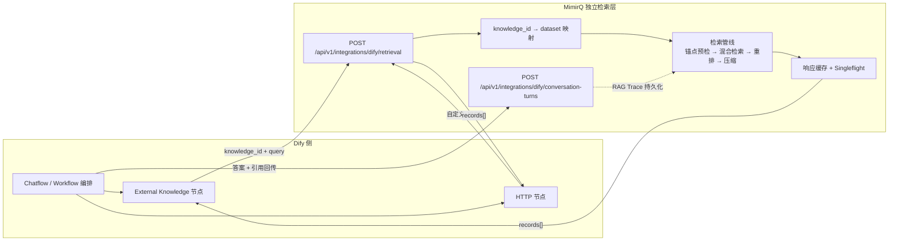
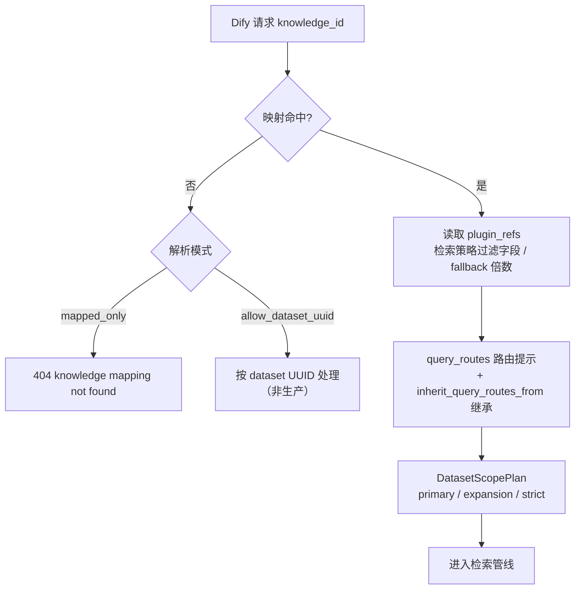

本文面向需要把 MimirQ 作为 Dify「外部知识层」接入的开发者，说明两种集成方式（External Knowledge API 与 Workflow HTTP 节点）的架构、协议、配置与运维门禁。MimirQ 不重复实现 Dify 的工作流画布与生成编排，而是把文档治理、切块、混合检索、重排、权限过滤与证据返回作为独立检索层暴露给 Dify——Dify 负责对话编排与答案生成，MimirQ 负责「检索什么、返回什么证据」。

## 集成方式总览：两种接入路径与一个回传端点

MimirQ 对 Dify 的接入分为两条主路径，外加一个可选的证据回传端点。第一种是 **External Knowledge API**：在 Dify 控制台的知识库中配置外部知识 API 端点，Dify 知识检索节点以 `knowledge_id` 发起检索，MimirQ 返回 Dify 兼容的 `records` 结构；Dify 负责路由与生成，MimirQ 负责检索与证据。第二种是 **Workflow HTTP 节点**：在 Dify 工作流中用 HTTP 节点直接调用 MimirQ 检索端点，适合需要自定义请求构造、区域路由或多知识库合并的场景。两条路径最终都落到同一个 `/api/v1/integrations/dify/retrieval` 适配器，保证检索行为一致。

路由挂载点为 `app/api/v1/__init__.py` 中的 `router.include_router(integrations_dify.router, prefix="/integrations/dify")`，因此完整路径为 `/api/v1/integrations/dify/retrieval` 与 `/api/v1/integrations/dify/conversation-turns`（前端 API 客户端同样以 `/integrations/dify/retrieval` 调用）。适配器模块的文档字符串明确其职责：Dify 以 `knowledge_id` 调用端点，MimirQ 将其映射到数据集，运行现有检索管线并返回 Dify 记录。Sources: [app/api/v1/__init__.py](app/api/v1/__init__.py#L37-L96)、[app/api/v1/integrations_dify.py](app/api/v1/integrations_dify.py#L1-L8)、[web/lib/api/dify.ts](web/lib/api/dify.ts#L1-L17)

仓库 README 对这两种方式给出了定位：**External Knowledge API** 由 Dify 负责编排与生成、MimirQ 负责文档治理/检索/重排/权限过滤/证据返回；**Workflow HTTP 节点**由 Dify 负责自定义路由与参数、MimirQ 按指定知识范围返回证据和 Trace。Sources: [README.md](README.md#L217-L222)

## 请求 / 响应协议：Dify External Knowledge API 契约

适配器实现的是 Dify 标准外部知识库协议。请求体 `DifyExternalKnowledgeRequest` 携带 `knowledge_id`（最短 1 字符）、`query`（受 `RETRIEVAL_QUERY_MAX_CHARS` 限制）与 `retrieval_setting`（`top_k` 1–200、`score_threshold` 0–1）。在此基础上，MimirQ 扩展了若干可选字段：`latency_profile`（"fast" 低延迟模式）、KG 辅助开关（`enable_kg_query_expansion` / `enable_kg_chunk_injection` / `enable_kg_chunk_boost`）、`metadata_condition` 元数据过滤，以及用于 RAG Trace 关联的 `conversation_id` / `request_id` / `source_conversation_id` / `source_message_id` / `source_run_id` / `dify_*` 系列字段——这些字段在 Dify 标准负载中可省略，省略时走环境变量默认值。响应体 `DifyExternalKnowledgeResponse` 只包含 `records` 数组，每个 `DifyExternalKnowledgeRecord` 是 `content` / `score` / `title` / `metadata` 四元组，与 Dify 外部知识库的返回约定一致。Sources: [app/api/v1/integrations_dify.py](app/api/v1/integrations_dify.py#L956-L1057)

身份认证在 `_require_dify_actor` 中完成：端点未启用时返回 404；`DIFY_EXTERNAL_KNOWLEDGE_API_KEYS` 未配置时返回 503；`Authorization: Bearer <token>` 缺失或与任一配置 token 不匹配时返回 401。token 支持明文或 `sha256:<hex>` 摘要形式（`_token_matches` 用 `hmac.compare_digest` 做常数时间比较）；租户 ID 由 `DIFY_EXTERNAL_KNOWLEDGE_TENANT_ID` 指定，生产环境缺失即 503，非生产可回退到 `TENANT_HEADER` 请求头或 `DEFAULT_TENANT_ID`；检索内部使用 `DIFY_EXTERNAL_KNOWLEDGE_ACCOUNT_ID` 指定的服务账号（默认 `system:dify`），该账号需具备目标数据集读取权限。Sources: [app/api/v1/integrations_dify.py](app/api/v1/integrations_dify.py#L1899-L1961)、[.env.example](.env.example#L1850-L1859)

请求处理全程记录脱敏诊断日志：客户端 IP、`knowledge_id` 与查询文本均以 SHA-256 摘要（前 16 位）输出，日志中不出现明文 IP、knowledge_id 或 query，`top_k` / `dataset_count` / `citation_count` / `record_count` 等计数完整保留。Sources: [app/api/v1/integrations_dify.py](app/api/v1/integrations_dify.py#L6980-L7040)、[tests/test_dify_external_knowledge_adapter.py](tests/test_dify_external_knowledge_adapter.py#L649-L733)

## knowledge_id 解析与数据集范围规划

`knowledge_id` 到数据集的映射通过 `DIFY_EXTERNAL_KNOWLEDGE_MAP_JSON` 配置，默认解析模式为 `mapped_only`：只允许命中映射中的 key，未映射的 `knowledge_id` 在生产环境一律 404。映射项支持多种形态：单个 dataset UUID 字符串、`dataset_ids` 数组，以及高级声明——`plugin_refs` 声明该知识库绑定的检索策略插件（影响 `filter_fields` 白名单与 fallback 候选倍数），`inherit_query_routes_from` 复用其他映射的 `query_routes` 实现路由继承。非生产环境可切换 `allow_dataset_uuid` 模式，允许未映射的 `knowledge_id` 直接按 dataset UUID 处理。Sources: [app/api/v1/integrations_dify.py](app/api/v1/integrations_dify.py#L2431-L2508)、[.env.example](.env.example#L1864-L1869)

范围规划器 `_plan_query_dataset_scope` 区分主范围（primary）、扩展范围（expansion）与严格范围（strict）：非 strict route 只作为召回 hint 不会过滤聚合知识库，strict route 才作为硬范围。映射中声明的 `plugin_refs` 会驱动检索策略：`_resolve_knowledge_policy_filter_fields` 汇总各插件的 `filter_fields` 作为元数据过滤白名单，`_resolve_knowledge_policy_fallback_multiplier` 取各插件的 fallback 候选倍数最大值放大内部候选窗口。Sources: [app/api/v1/integrations_dify.py](app/api/v1/integrations_dify.py#L2266-L2340)、[.env.example](.env.example#L1885-L1887)

## 检索管线：候选放大、锚点预检、混合检索与压缩

适配器的核心设计是「**对外小窗口、对内大候选**」：Dify 请求的 `top_k` 默认上限 5（`DIFY_EXTERNAL_KNOWLEDGE_TOP_K_MAX`），但内部候选窗口通过 `_resolve_internal_candidate_top_k` 放大——最小值 20、乘以 4 倍、上限 50，目的是在重排前保留足够的正确内容召回空间。检索通过 `_retrieve_dataset_citations` 复用 `app.api.v1.rag.retrieve_evidence`（与 MimirQ 自己的证据检索 API 同一实现），以 `ChatRAGConfig` 传入 `retrieval_mode`（hybrid / fast 时为 vector）、`enable_reranker`、`metadata_filter`、KG 扩展/注入/提升开关与词法 DB 兜底开关。Sources: [app/api/v1/integrations_dify.py](app/api/v1/integrations_dify.py#L588-L600)、[app/api/v1/integrations_dify.py](app/api/v1/integrations_dify.py#L6440-L6560)

| 检索阶段 | 机制 | 配置项 |
|:---|:---|:---|
| 元数据锚点预检 | 基于 `question` / `service_name` / `aliases` / `district` 等锚点字段的 DB 快速命中，总预算 1500ms | `DIFY_EXTERNAL_KNOWLEDGE_METADATA_ANCHOR_TOTAL_BUDGET_MS` |
| 主范围检索 | 走 `retrieve_evidence` 混合检索（向量 + BM25），可带 KG 扩展 | `DIFY_EXTERNAL_KNOWLEDGE_PRIMARY_MIN_RECORDS` / `PRIMARY_MIN_TOP_SCORE` |
| 混合意图补充 | "另外/同时/分别" 等复合意图拆分子查询，多路召回合并后统一重排 | `DIFY_EXTERNAL_KNOWLEDGE_MIXED_INTENT_*` |
| 最终重排 | 对缺失重排分数的记录用配置的 reranker 补跑 | `DIFY_EXTERNAL_KNOWLEDGE_RERANKER_ENABLED` / `RERANKER_*` |
| 高置信压缩 | TOP1 明显强、后续分数断崖时少返回低相关噪音块 | `COMPACT_HIGH_CONFIDENCE_ENABLED` / `COMPACT_MIN_TOP_SCORE` / `COMPACT_RELATIVE_SCORE_FLOOR` |
| Fast 低延迟模式 | 禁用 fallback/rerank 昂贵分支，候选≤3、响应≤2、内容限长 | `latency_profile: "fast"` + `FAST_*` 配置组 |

检索结果通过 `_citation_to_dify_record` 转换为 Dify 记录：从 citation 中提取 `content`、`title`（缺省 "Untitled"）、`score`，并把 `dataset_id`、chunk 元数据、rerank 分数（`rerank_score` / `reranker_provider` / `rerank_model_used`）写入 `metadata`，最后追加答案高亮片段（`Answer highlights` 前缀）。`_records_from_citations` 负责在需要时从数据库加载完整 chunk 内容（slot 字段水合），保证返回给 Dify 的 content 是完整可用的证据文本而非截断片段。Sources: [app/api/v1/integrations_dify.py](app/api/v1/integrations_dify.py#L5306-L5428)、[app/api/v1/integrations_dify.py](app/api/v1/integrations_dify.py#L3897-L3900)

KG 在 Dify 适配器中的定位是「辅助而非直接回答」：`DIFY_EXTERNAL_KNOWLEDGE_KG_QUERY_EXPANSION_ENABLED` 扩展查询、`KG_CHUNK_INJECTION_ENABLED` 注入 KG 关联 chunk、`KG_CHUNK_BOOST_ENABLED` 提升 KG 命中 chunk 排序，且生效前提是 `KG_ENABLED=true` 与 `KG_CHAT_ENABLED=true`。fast 模式下 KG 辅助全部关闭。Sources: [.env.example](.env.example#L1914-L1919)、[app/api/v1/integrations_dify.py](app/api/v1/integrations_dify.py#L6975-L6995)

## 高并发防护：响应缓存、Singleflight 与启动预热

适配器内置三层并发防护。第一层是**短时响应缓存**（`_DifyResponseCache`，LRU + TTL），进程内 OrderedDict 缓存与 Redis 兜底（`mimirq.dify_external_response_cache.redis.v1` schema）结合，缓存键由租户、knowledge_id、查询、检索设置、范围计划与语料 token（`corpus_token`，随索引变更失效）共同构成，避免索引更新后命中陈旧结果。第二层是 **Singleflight**：`_acquire_or_wait_for_inflight_response` 合并尚未完成的同键并发/重试请求，follower 等待 leader 结果而非复制检索；等待超时（默认 60s）返回带 `Retry-After` 的 503，分布式 lease 通过 Redis 实现跨实例合并。Sources: [app/api/v1/integrations_dify.py](app/api/v1/integrations_dify.py#L653-L717)、[app/api/v1/integrations_dify.py](app/api/v1/integrations_dify.py#L734-L900)、[.env.example](.env.example#L1890-L1895)

第三层是**启动预热**：`start_dify_external_knowledge_warmup` 在应用启动时以 fire-and-forget 方式调度（`app/main.py` 启动生命周期内调用），按 knowledge map 的 key 逐个运行内部检索，把冷启动成本（实测同类首请求可达 97.77 秒）提前消化；预热状态暴露在健康检查中，`DIFY_EXTERNAL_KNOWLEDGE_WARMUP_REQUIRED_FOR_READY=true` 时 readiness 会等待预热完成（一次实测中约 190 秒后从 503 转为 200），预热 lease 通过 Redis 分布式互斥保证多副本只预热一次。Sources: [app/api/v1/integrations_dify.py](app/api/v1/integrations_dify.py#L6620-L6700)、[app/main.py](app/main.py#L357-L359)、[app/api/v1/health.py](app/api/v1/health.py#L184-L202)

## 证据回传与可观测性：conversation-turns 与 RAG Trace

`POST /api/v1/integrations/dify/conversation-turns` 允许 Dify 工作流在生成完成后把答案、引用与会话标识回传 MimirQ。请求体携带 `query`、`answer`、`citations[]`、`metadata` 与可选的 `conversation_id` / `trace_request_id` / `source_*` / `dify_*` 标识；服务端自动创建或复用会话（`_ensure_dify_trace_conversation`），以 `dify_conversation_id` 维度加行锁（`_lock_dify_conversation_turn_scope`）防止同会话并发写入冲突，返回 `conversation_id` / `user_message_id` / `assistant_message_id` 及 `reused_user_message` 标志。这样 Dify 链路的每次检索与生成都能在 MimirQ 的 History RAG Trace 面板中还原查询、引用与重排过程，形成跨系统审计闭环。Sources: [app/api/v1/integrations_dify.py](app/api/v1/integrations_dify.py#L1654-L1700)、[app/api/v1/integrations_dify.py](app/api/v1/integrations_dify.py#L6911-L6938)

## 配置清单：最小启用与生产建议

| 配置项 | 默认值 | 说明 |
|:---|:---|:---|
| `DIFY_EXTERNAL_KNOWLEDGE_ENABLED` | `false` | 总开关；关闭时端点返回 404 |
| `DIFY_EXTERNAL_KNOWLEDGE_API_KEYS` | 空 | Bearer token，多值逗号分隔；生产建议 `sha256:<hex>` |
| `DIFY_EXTERNAL_KNOWLEDGE_TENANT_ID` | 空 | 无租户头时使用的租户；生产必填 |
| `DIFY_EXTERNAL_KNOWLEDGE_ACCOUNT_ID` | `system:dify` | 内部服务账号，需数据集读取权限 |
| `DIFY_EXTERNAL_KNOWLEDGE_MAP_JSON` | 空 | knowledge_id → 数据集映射，支持 `plugin_refs` / `inherit_query_routes_from` |
| `DIFY_EXTERNAL_KNOWLEDGE_RESOLUTION_MODE` | `mapped_only` | 生产默认只允许映射命中 |
| `DIFY_EXTERNAL_KNOWLEDGE_TOP_K_MAX` | `5` | 对外单次检索最大记录数 |
| `DIFY_EXTERNAL_KNOWLEDGE_INTERNAL_TOP_K_*` | `20 / 4 / 50` | 内部候选窗口（最小/倍数/最大） |
| `DIFY_EXTERNAL_KNOWLEDGE_RESPONSE_CACHE_*` | 开 / 30s / 512 | 短时响应缓存 |
| `DIFY_EXTERNAL_KNOWLEDGE_SINGLEFLIGHT_ENABLED` | `true` | 同键并发合并 |
| `DIFY_EXTERNAL_KNOWLEDGE_WARMUP_*` | 开 / 60s / 非必需 | 启动预热与 readiness 门禁 |
| `DIFY_EXTERNAL_KNOWLEDGE_*_KG_*` | 全部 `false` | KG 查询扩展/注入/提升辅助开关 |

Sources: [.env.example](.env.example#L1850-L1919)

## 运维质量门禁：探针、全量门禁与 800 题基准

仓库为 Dify 集成提供了从「边界诊断」到「全量回归」的脚本链。**边界探针** `changzhou_gov_dify_external_knowledge_probe.py` 是只读诊断：对同一组 golden 用例分别请求 Dify 外部知识命中测试与 MimirQ 直连检索，产出 `boundary.verdict`——`dify_external_boundary_ok` 表示端点配置、本地直连、Dify 命中测试三者全部通过；若 Dify 运行时为空而 MimirQ 直连正常，判定为 `dify_runtime_empty_but_mimirq_direct_ok`，精确定位空结果来自 Dify 一侧还是 MimirQ 一侧。推荐流程是 `make dify-console-login` 刷新控制台 storage state 后执行 `make changzhou-dify-external-probe`。Sources: [scripts/changzhou_gov_dify_external_knowledge_probe.py](scripts/changzhou_gov_dify_external_knowledge_probe.py#L1-L10)、[scripts/changzhou_gov_dify_external_knowledge_probe.py](scripts/changzhou_gov_dify_external_knowledge_probe.py#L329-L377)、[scripts/README.md](scripts/README.md#L78-L89)

**全量门禁** `changzhou_gov_dify_full_gate.py` 串联知识图谱预检、生成答案、直接评测与工作流 Trace；`make changzhou-dify-readiness-gate` 再叠加 knowledge map 预检与控制台 token 检查，产出 `/tmp/changzhou_gov_dify_readiness_summary.json`。工作流侧由 `changzhou_gov_dify_workflow_lint.py` 静态检查 Dify 工作流中的 HTTP 节点（确认 URL 含 `/api/v1/integrations/dify/retrieval`、无 prompt 模板泄漏、无 HTTP JSON 模板体、答案覆盖提示词合规），`changzhou_gov_dify_workflow_sync.py` 默认 dry-run 安全同步草稿（先备份当前草稿、lint 目标、差异报告，`--apply` 才写远端）。Sources: [scripts/changzhou_gov_dify_workflow_lint.py](scripts/changzhou_gov_dify_workflow_lint.py#L630-L640)、[scripts/changzhou_gov_dify_workflow_sync.py](scripts/changzhou_gov_dify_workflow_sync.py#L1-L10)、[scripts/README.md](scripts/README.md#L90-L96)

实测基准（`docs/benchmarks/changzhou_dify.md`，2026-07-27，固定 800 题、真实自托管模型 `bge-m3` + `bge-reranker-large` + `Qwen3-30B-A3B`）显示：Dify External → MimirQ 链路 800/800 成功，证据条款覆盖 99.7%、错误证据率仅 2.7%；而 Dify 原生知识库错误证据率高达 79.3%、证据覆盖仅 83.8%。结论明确指向——接入 MimirQ 后证据质量大幅领先原生知识库，剩余准确率损失（答案条款覆盖 83.8%）主要来自 Dify 生成编排而非 MimirQ 召回。`dify_3way_benchmark.py` 以确定性证据条款评分（不用 LLM judge）实现同题集多链路对比，产物不含任何 App API key。Sources: [docs/benchmarks/changzhou_dify.md](docs/benchmarks/changzhou_dify.md#L1-L10)、[scripts/dify_3way_benchmark.py](scripts/dify_3way_benchmark.py#L1-L12)

## 前端配置入口

Web 端在系统设置中提供 Dify 集成配置面板（`dify-integration-section.tsx`）：可视化编辑 knowledge map（自动生成 `kb_<slug>` 形式的 knowledge_id）、展示端点 URL、管理 API key 与数据集绑定，并把配置写入系统设置。前端 API 客户端 `web/lib/api/dify.ts` 导出类型化的 `difyExternalKnowledgeApi.retrieve(payload)`，直接调用 `/integrations/dify/retrieval`。Sources: [web/app/settings/_sections/dify-integration-section.tsx](web/app/settings/_sections/dify-integration-section.tsx#L1-L100)、[web/lib/api/dify.ts](web/lib/api/dify.ts#L1-L17)

## 下一步阅读

- 检索层的底层能力见 [混合检索与融合策略：向量、稀疏检索与 RRF 融合](16-hun-he-jian-suo-yu-rong-he-ce-lue-xiang-liang-xi-shu-jian-suo-yu-rrf-rong-he) 与 [重排器体系：Cross-Encoder、ColBERT、LTR、MMR 与混合重排](17-zhong-pai-qi-ti-xi-cross-encoder-colbert-ltr-mmr-yu-hun-he-zhong-pai)
- 证据与引用链路见 [RAG 对话引擎：引用生成、声明证据映射与忠实度评分](20-rag-dui-hua-yin-qing-yin-yong-sheng-cheng-sheng-ming-zheng-ju-ying-she-yu-zhong-shi-du-ping-fen)
- 集成质量保障见 [CI 质量门禁：检索阈值、解析证明、查询集健康与发布预算策略](24-ci-zhi-liang-men-jin-jian-suo-yu-zhi-jie-xi-zheng-ming-cha-xun-ji-jian-kang-yu-fa-bu-yu-suan-ce-lue)
- 部署与运维见 [部署方案与运维手册：Docker Compose、Helm、备份恢复与演练](29-bu-shu-fang-an-yu-yun-wei-shou-ce-docker-compose-helm-bei-fen-hui-fu-yu-yan-lian)
- 环境变量整体配置见 [环境变量与模型服务接入：LLM、Embedding、Reranker 配置](3-huan-jing-bian-liang-yu-mo-xing-fu-wu-jie-ru-llm-embedding-reranker-pei-zhi)