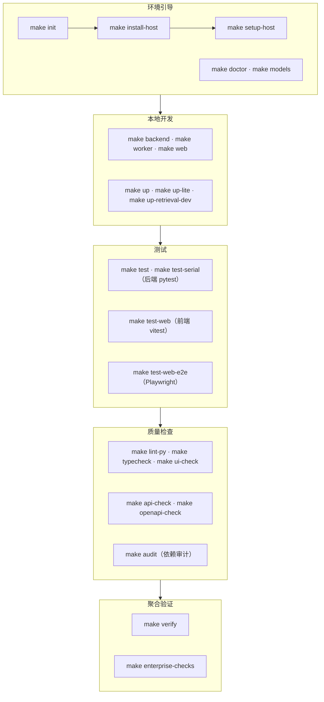
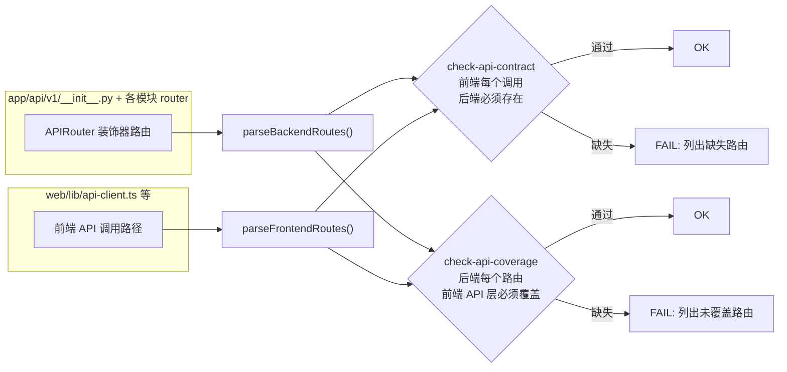

MimirQ 的开发体验建立在一个核心前提上：**所有开发、测试与验证动作都有唯一的命令入口**。根目录的 `Makefile` 定义了 100 余个目标（target），覆盖环境引导、本地开发、单元测试、静态检查、API 契约校验、依赖审计与聚合验证；而前端质量检查链则内嵌在 `web/package.json` 的 pnpm scripts 中，通过 Makefile 透传调用。本文档以 Makefile 为主线，剖析这条从"克隆仓库"到"通过 CI 门禁"的完整链路，并重点解释前后端各自的检查项与三层 API 契约校验机制。

## 工作流总览：Makefile 的五层命令体系

`make help` 本身就是一个自文档化的命令目录：它把全部目标按用途分组打印，并在末尾展开插件注入的帮助目标（`PLUGIN_HELP_TARGETS`）[Makefile](Makefile#L77-L174)。这种分层设计意味着开发者只需记住少量高频命令（`make up`、`make test`、`make verify`），其余目标随时可通过 `make help` 检索。

Sources: [Makefile](Makefile#L77-L174)

## Makefile 的设计骨架：环境选择、跨平台与插件扩展

Makefile 的第一个设计决策是**优先使用项目虚拟环境**。变量 `PY` 默认指向 `python3`，但只要检测到 `.venv/bin/python`（Windows 下为 `.venv/Scripts/python.exe`）存在，就自动切换为 venv 解释器——缺失的包会在项目环境中直接报错，而不会静默回退到全局工具链。`HOST_PYTHON ?= python3.11` 则用于创建 venv 的宿主解释器，确保本地后端满足 Python 3.11+ 的最低要求 [Makefile](Makefile#L3-L16) [doctor.py](scripts/doctor.py#L73-L82)。

第二个决策是**跨平台兼容**。`make verify` 中使用的 `PYTHONPYCACHEPREFIX=/tmp/mimirq-pycache` 是 POSIX 专属语法，因此 Makefile 在 Windows 下单独定义了不带该前缀的 `COMPILEALL_VERIFY` 变体；`scripts/init_env.py` 与 `scripts/doctor.py` 同样做了 Windows 编码（GBK/CP936 vs UTF-8）与换行符（CRLF）的防御性处理 [Makefile](Makefile#L18-L22) [doctor.py](scripts/doctor.py#L10-L29)。

第三个决策是**通过 `-include` 支持可选插件**。核心 Makefile 通过 `-include $(wildcard ...)` 引入 `plugins/pipelines/changzhou-gov-service-knowledge/` 下的插件 Makefile，并约定插件专属的变量（如 `CHANGZHOU_DIFY_APP_ID`）与目标（如 `changzhou-dify-external-probe`）必须留在插件文件中，不得污染核心 Makefile。这一边界由 `tests/test_makefile_plugin_boundaries.py` 以断言形式固化，防止核心目标与插件默认值发生耦合 [Makefile](Makefile#L73-L75) [test_makefile_plugin_boundaries.py](tests/test_makefile_plugin_boundaries.py#L11-L40)。

Sources: [Makefile](Makefile#L3-L22), [test_makefile_plugin_boundaries.py](tests/test_makefile_plugin_boundaries.py#L11-L40), [doctor.py](scripts/doctor.py#L65-L131)

## 环境引导：init、install-host、setup-host 与 doctor

环境引导是工作流的第一层。`make init` 调用 `scripts/init_env.py`：以非破坏方式从 `.env.example` 生成 `.env`、从 `web/.env.local.example` 生成 `web/.env.local`（已存在则跳过），并自动填充空的 `SECRET_KEY` 与 `MARKDOWN_IMAGE_PROXY_SECRET`（后者同时写入前后端两份 env 文件，保证图片代理的签名密钥一致）[Makefile](Makefile#L176-L178) [init_env.py](scripts/init_env.py#L45-L76) [init_env.py](scripts/init_env.py#L100-L109)。

`make install-host` 完成真正的依赖装配：创建 `.venv` → 升级 pip/setuptools/wheel → 从 PyTorch CPU 索引安装 `requirements.txt` → `pip check` 校验依赖一致性 → `cd web && pnpm install`。注意这里刻意将 `requirements.txt`（运行时依赖）与 `requirements-dev.txt`（开发/CI 工具链）分层：容器镜像只安装前者，本地与 CI 安装后者，后者通过 `-r requirements.txt` 透传前者 [Makefile](Makefile#L180-L185) [requirements-dev.txt](requirements-dev.txt#L1-L12)。

`make setup-host` 是 `init + install-host + models + infra-up` 的组合目标，适合从零搭建完整开发环境；`make doctor` 则提供环境体检：检查 Python/Node/pnpm/Docker 版本、关键文件是否存在、Docker daemon 是否运行，并提示 `core.autocrlf` 等容易引发噪音 diff 的配置 [Makefile](Makefile#L187-L192) [doctor.py](scripts/doctor.py#L84-L131)。

| 目标 | 作用 | 幂等性 |
| --- | --- | --- |
| `make init` | 生成 `.env` 与 `web/.env.local`，填充缺失密钥 | 非破坏，已存在则跳过 |
| `make install-host` | 创建 venv 并安装前后端依赖 | 可重复执行 |
| `make setup-host` | init + install-host + models + infra-up | 组合目标 |
| `make doctor` | 环境体检并给出修复提示 | 只读 |

Sources: [Makefile](Makefile#L176-L192), [init_env.py](scripts/init_env.py#L45-L109), [doctor.py](scripts/doctor.py#L65-L131)

## 本地开发循环：backend、worker、web 与容器编排

环境就绪后，开发循环有两种形态：**源码模式**与**容器模式**。源码模式下，`make backend` 用 uvicorn 以 `--reload` 启动 FastAPI 应用（监听 8000 端口，热重载范围限定在 `app` 与 `scripts`，并排除 `web/node_modules` 等噪音目录），`make worker` 以 arq 启动后台任务 worker，`make web` 则以 `pnpm dev` 启动 Next.js 开发服务器 [Makefile](Makefile#L318-L331)。

容器模式下，Makefile 通过一组 `COMPOSE_*` 变量封装了 docker compose 的 compose 文件组合与项目名（`COMPOSE_PROJECT_NAME ?= mimirq`），并提供分级启动策略：`make up` 启动完整后端栈，`make up-lite` 使用 Chroma 替代 Milvus/Minio 的最小栈，`make up-retrieval-dev` 仅启动 postgres + redis + API 的检索专用栈（不含解析器服务），`make up-marker` / `make up-mineru` 等则通过 compose profile 按需叠加解析器容器 [Makefile](Makefile#L24-L33) [Makefile](Makefile#L194-L228)。生产启动前还会执行 `prod-preflight`，以 `ENV=production` 预加载配置，提前暴露配置错误 [Makefile](Makefile#L236-L244)。

Sources: [Makefile](Makefile#L24-L33), [Makefile](Makefile#L194-L244), [Makefile](Makefile#L318-L331)

## 后端质量检查：Ruff、pytest 与编译校验

后端检查以 `make lint-py`（Ruff）与 `make test`（pytest）为核心。`ruff.toml` 采用保守但高信号的规则集：`E4/E7/E9`（语法与潜在 bug）、`F`（pyflakes 未定义/未使用）、`I`（isort 导入排序），加上 `B` 系（bugbear 子集）、`N`（命名规范）与 `T201`（禁止 print），行宽 120，目标 Python 3.11；同时通过 `per-file-ignores` 为 `app/api/v1/**`、`app/rag/**`、`app/services/**` 等放宽 `BLE001`（裸 except），为 `scripts/**` 放宽 `T201`——说明这些目录允许防御性兜底捕获与 CLI 输出，但核心业务代码仍受严格约束 [ruff.toml](ruff.toml#L1-L34) [Makefile](Makefile#L474-L475)。

`make test` 通过 `pytest-xdist` 的 `-n auto` 并行执行全部后端测试；`make test-serial` 提供串行逃生通道，便于调试并发导致的偶发失败。`pytest.ini` 的 `filterwarnings` 只屏蔽确指的第三方弃用告警（torch、pynvml、Milvus、Click 等），刻意保留项目自身的告警可读性 [Makefile](Makefile#L333-L339) [pytest.ini](pytest.ini#L1-L21)。此外 `make verify` 末尾会执行 `compileall` 全量编译 `app` 目录，以字节码级验证语法完整性——这是"导入链可运行"之外的第二道防线 [Makefile](Makefile#L573-L582)。

容器环境则使用 `make lint-py-docker` 与 `make compileall-docker`：前者明确不把 Ruff 装进运行时镜像，而是复用宿主机工具链；后者在运行中的 `mimirq-api` 容器内执行 compileall [Makefile](Makefile#L477-L482)。

Sources: [ruff.toml](ruff.toml#L1-L34), [pytest.ini](pytest.ini#L1-L21), [Makefile](Makefile#L333-L339), [Makefile](Makefile#L474-L482), [Makefile](Makefile#L573-L582)

## 前端质量检查：lint、typecheck、ui-check 与单测

前端检查链全部收敛在 `web/package.json` 的 `verify` 脚本中：`lint`（ESLint）→ `ui-check` → `typecheck`（tsc --noEmit）→ `test`（vitest）→ `api-check`。Makefile 侧提供 `make typecheck`、`make ui-check`、`make test-web` 等透传目标，使前后端命令风格统一 [web/package.json](web/package.json#L6-L39) [Makefile](Makefile#L341-L344) [Makefile](Makefile#L468-L472)。

`ui-check` 是这套体系里最独特的检查：它由五个 Node 脚本串联，分别守护设计系统与可访问性约束——`check-design-tokens.mjs` 禁止重新引入绕过 token 体系的硬编码样式（`bg-white`、`text-cyan-*`、Tailwind 渐变等 10 条规则）；`check-native-dialogs.mjs` 防止用原生 dialog 替代设计组件；`check-theme-contrast.mjs` 校验主题对比度；`check-internal-routes.mjs` 与 `check-interactive-controls.mjs` 分别守护内部路由与交互控件的可访问性 [web/package.json](web/package.json#L32) [check-design-tokens.mjs](web/scripts/check-design-tokens.mjs#L48-L99)。

单测方面，`vitest.config.ts` 默认运行 `**/*.test.{ts,tsx}`（当前 75 个文件），覆盖 components、app、hooks、lib 四类源码；`vitest.critical.config.ts` 进一步对安全与通信关键模块（auth-headers、sse-reader、tenant-permissions、openapi-request 等 8 个文件）设定覆盖率门槛（statements ≥ 55%、branches ≥ 35%、functions ≥ 50%、lines ≥ 55%）[web/vitest.config.ts](web/vitest.config.ts#L1-L32) [web/vitest.critical.config.ts](web/vitest.critical.config.ts#L9-L40)。浏览器端则由 Playwright 承担：`make test-web-e2e` 跑完整 e2e，`make test-management-smoke` / `make test-core-browser-smoke` 提供管理面与核心链路的定向 smoke [Makefile](Makefile#L346-L354) [playwright.config.ts](web/playwright.config.ts#L30-L69)。

| 检查项 | 命令 | 守护目标 |
| --- | --- | --- |
| ESLint | `pnpm run lint` | 代码风格与 React/Next 规则 |
| TypeScript | `pnpm run typecheck` | 类型安全（tsc --noEmit） |
| 设计 token | `check-design-tokens.mjs` | 禁止硬编码白/青色等绕过 token 的样式 |
| 原生对话框 | `check-native-dialogs.mjs` | 统一使用设计系统对话框 |
| 主题对比度 | `check-theme-contrast.mjs` | 可访问性对比度 |
| 内部路由 | `check-internal-routes.mjs` | 路由命名规范 |
| 交互控件 | `check-interactive-controls.mjs` | 交互控件的可访问性 |
| 单元/集成测试 | `vitest run` | 行为测试 + 关键模块覆盖率门槛 |

Sources: [web/package.json](web/package.json#L6-L39), [check-design-tokens.mjs](web/scripts/check-design-tokens.mjs#L48-L99), [web/vitest.critical.config.ts](web/vitest.critical.config.ts#L9-L40), [playwright.config.ts](web/playwright.config.ts#L30-L69)

## 前后端契约校验：api-check 与 OpenAPI 流水线

前后端契约是 MimirQ 质量体系中最具特色的部分，`make api-check` 依次执行三个方向互补的检查，核心解析逻辑统一收敛在 `web/scripts/api-contract-lib.mjs`：

第一层 `check-api-contract.mjs` 保证**前端发起的每个 HTTP 调用在后端都有对应路由**——它静态解析 `app/api/v1/__init__.py` 中的 `include_router` 前缀链与各模块的 `@router.get/post/...` 装饰器，再与前端路由做规范化匹配（统一 `/api/v1` 前缀、模板变量、尾斜杠）[check-api-contract.mjs](web/scripts/check-api-contract.mjs#L1-L28) [api-contract-lib.mjs](web/scripts/api-contract-lib.mjs#L14-L29)。第二层 `check-api-coverage.mjs` 方向相反：保证**后端每个路由都被前端 API 层覆盖**（仅豁免 SAML bridge 等纯服务间回调），防止后端新端点无人消费 [check-api-coverage.mjs](web/scripts/check-api-coverage.mjs#L1-L40)。第三层 `check-api-types-drift.mjs --strict` 以基线文件对比生成的 `web/types/openapi.ts` 与当前 OpenAPI 导出，杜绝前后端类型漂移 [web/package.json](web/package.json#L33-L34)。

与之配套的 OpenAPI 流水线形成闭环：`make openapi-export` 从 FastAPI 导出 `web/openapi.json` → `make openapi-types` 生成 `web/types/openapi.ts` → `make openapi-validate` 校验产物 → `make openapi-check` 强制重生成并校验（CI 中直接运行）[Makefile](Makefile#L510-L523)。此外 `make api-ping` 快速探测后端健康端点，`make api-smoke` 对运行中的后端做全量 OpenAPI 端点冒烟 [Makefile](Makefile#L436-L443)。

Sources: [check-api-contract.mjs](web/scripts/check-api-contract.mjs#L1-L28), [check-api-coverage.mjs](web/scripts/check-api-coverage.mjs#L1-L40), [api-contract-lib.mjs](web/scripts/api-contract-lib.mjs#L14-L198), [Makefile](Makefile#L431-L443), [Makefile](Makefile#L510-L523)

## 聚合验证与测试资产：verify、enterprise-checks 与 test-matrix

`make verify` 是本地最接近 CI 门禁的聚合目标：Python lint → 三类策略 JSON 校验（queryset health、parsing-proof governance、parsing-proof rollout）→ API 契约检查 → 文档链接检查 → Web lint → Web typecheck → 后端 compileall。`make enterprise-checks` 在其之上追加后端测试、前端测试与测试矩阵生成，是"CI 等价"的完整验证 [Makefile](Makefile#L573-L588)。

| 目标 | 内容 | 适用场景 |
| --- | --- | --- |
| `make verify` | lint-py + 策略校验 + api-check + 文档链接 + web lint/typecheck + compileall | 提交前快速自检 |
| `make enterprise-checks` | verify + test + test-web + test-matrix | 合并前的完整验证 |
| `make verify-docker` | api-check + web lint/ui-check/typecheck + 容器内 ruff + 容器内 compileall | Docker 运行时验证 |
| `make diagnostics` | api-ping + api-check + openapi-validate + compose-diagnostics + doctor | 运维排障 |

`make test-matrix` 生成全栈测试清单：它以 `web/openapi.json` 为后端路由事实源，扫描 `web/app` 目录的 `page.tsx` 推导前端页面路由，再统计后端 pytest 文件、前端 vitest 行为测试、source-contract 测试（`.source.test.` / `.entry.test.` 命名）与 Playwright 规格，输出 JSON/Markdown 双格式清单 [Makefile](Makefile#L356-L358) [generate_test_coverage_matrix.py](scripts/generate_test_coverage_matrix.py#L8-L10) [generate_test_coverage_matrix.py](scripts/generate_test_coverage_matrix.py#L128-L149)。`tests/test_test_inventory_contract.py` 同时固化关键回归文件清单，防止测试资产被误删 [test_test_inventory_contract.py](tests/test_test_inventory_contract.py#L9-L24)。

Sources: [Makefile](Makefile#L556-L588), [generate_test_coverage_matrix.py](scripts/generate_test_coverage_matrix.py#L128-L149), [test_test_inventory_contract.py](tests/test_test_inventory_contract.py#L9-L24)

## 本地命令与 CI 的一致性：同样的命令，双重的执行

这套工作流的关键设计是**本地 Makefile 目标与 CI workflow 命令严格同源**。`lint-fast.yml` 只做三件事：`ruff check app tests scripts main.py`、`pnpm run lint`、`pnpm run typecheck`——与 `make lint-py` 和前端 scripts 完全一致，10 分钟超时保证快速反馈 [lint-fast.yml](.github/workflows/lint-fast.yml#L26-L78)。主 CI 的 `public-pr-verify`（PR 触发，GitHub 托管）则按序执行 `make openapi-check`、docker compose 配置校验、Helm lint/template、`make test`（LLM mock 环境）、数据库迁移集成测试、`make verify`、`make test-web`、前端生产构建与 Playwright 浏览器 smoke [ci.yml](.github/workflows/ci.yml#L28-L208)；非 PR 分支（main）的 `test-and-verify` / `web-test-and-verify` 在自托管 runner 上进一步追加关键覆盖率门禁、完整 e2e 与 Docker 镜像构建 [ci.yml](.github/workflows/ci.yml#L210-L348)。依赖安全由 `security.yml` 每周定时执行 `make audit-py`（pip-audit，含显式豁免清单）、`make audit-web`（pnpm audit + 策略解析）、`make audit-docs`（npm audit）[security.yml](.github/workflows/security.yml#L47-L106) [Makefile](Makefile#L490-L508)。

因此，开发者的心理模型可以简化为一句口号：**在本地跑 `make verify` 与 `make enterprise-checks` 通过，CI 就会通过**。文档与 API 的同步也有专门守护：`handbook-matrix.yml` 强制 `fe-be-matrix.mdx` 在 API 变更后重新生成并提交，`docs-site.yml` 校验 Docusaurus 手册的构建与文档链接 [handbook-matrix.yml](.github/workflows/handbook-matrix.yml#L30-L35) [docs-site.yml](.github/workflows/docs-site.yml#L22-L30)。至于检索质量、解析证明、查询集健康与发布预算等更深的 CI 质量门禁，属于另一层话题，详见 [CI 质量门禁：检索阈值、解析证明、查询集健康与发布预算策略](24-ci-zhi-liang-men-jin-jian-suo-yu-zhi-jie-xi-zheng-ming-cha-xun-ji-jian-kang-yu-fa-bu-yu-suan-ce-lue)。

Sources: [lint-fast.yml](.github/workflows/lint-fast.yml#L26-L78), [ci.yml](.github/workflows/ci.yml#L28-L208), [security.yml](.github/workflows/security.yml#L47-L106), [handbook-matrix.yml](.github/workflows/handbook-matrix.yml#L30-L35)

## 阅读路径建议

本文档是快速开始系列的收尾页，接下来可按兴趣选择深入方向：若想理解 Makefile 驱动的应用是如何启动的，阅读 [FastAPI 应用骨架与启动生命周期](8-fastapi-ying-yong-gu-jia-yu-qi-dong-sheng-ming-zhou-qi-zhong-jian-jian-pei-zhi-yi-chang-chu-li-yu-yun-xing-shi-qian-yi)；若关注前端架构与 API 契约校验在运行时如何落地，阅读 [Next.js 前端架构](26-next-js-qian-duan-jia-gou-app-router-guo-ji-hua-yu-api-qi-yue-xiao-yan)；若想了解 CI 中更严格的质量门禁体系，阅读 [CI 质量门禁](24-ci-zhi-liang-men-jin-jian-suo-yu-zhi-jie-xi-zheng-ming-cha-xun-ji-jian-kang-yu-fa-bu-yu-suan-ce-lue)；若对测试基准本身感兴趣，可进一步阅读 [评测体系：Golden 回归、Recall/MRR 指标与 800 题基准](23-ping-ce-ti-xi-golden-hui-gui-recall-mrr-zhi-biao-yu-800-ti-ji-zhun) 与 [回归套件与证据管理](25-hui-gui-tao-jian-yu-zheng-ju-guan-li-hui-gui-yun-xing-xiao-rong-shi-yan-yu-zheng-ju-xiao-nang)。