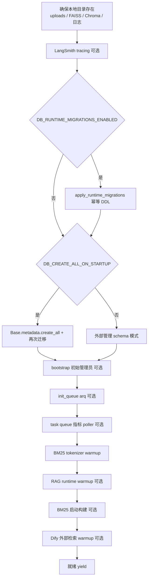

本文深入剖析 MimirQ 后端的 FastAPI 应用骨架：从进程启动入口、配置加载与验证、中间件栈的注册与执行顺序、统一异常处理，到 lifespan 启动/关闭序列与运行时迁移机制。目标读者是希望理解"应用如何从零启动到就绪"以及"请求如何穿越中间件栈"的中级开发者。

## 一、架构总览：双层入口与启动阶段划分

MimirQ 采用 **双入口设计**：仓库根目录的 `main.py` 是本地开发 CLI（负责 uvicorn 启动与 reload 配置），`app/main.py` 才是真正的 FastAPI 应用定义与组装现场。这种分层让容器生产部署（`docker/start_backend.sh` 直接 `uvicorn app.main:app`）与本地开发（`make backend`）共享同一个应用对象，仅差异化启动参数。

```mermaid
flowchart TD
    A[进程启动] --> B{入口选择}
    B -->|本地开发| C[main.py CLI\nchdir 到仓库根\nuvicorn reload 配置]
    B -->|容器/生产| D[uvicorn app.main:app\n--workers N]
    C --> E[app/main.py 模块级执行]
    D --> E
    E --> F[ensure_local_no_proxy\nwarnings 过滤]
    F --> G[configure_logging\ninit_sentry\ninit_otel]
    G --> H[Settings() 实例化\nPydantic 验证 + 生产收紧]
    H --> I[FastAPI 应用创建\nlifespan 注册]
    I --> J[中间件栈组装\nCORS 最外层]
    J --> K[路由注册 + 异常处理器]
    K --> L{lifespan 启动}
    L --> M[目录创建 → 运行时迁移\ncreate_all → 初始管理员]
    M --> N[任务队列 → tokenizer/BM25\nwarmup → Dify warmup]
    N --> O[就绪，yield 进入服务期]
```

关键点在于：**配置实例化（`Settings()`）发生在模块导入时**（`app/core/config.py` 末尾的 `settings = Settings()`），而**数据库与业务初始化发生在 lifespan 内**。这意味着配置验证失败会在进程启动早期以 ImportError/ValueError 形式直接中断，而不是在请求到达时才暴露。

## 二、启动入口与模块加载序列

根目录 `main.py` 是本地开发入口，它先将工作目录切换到仓库根（保证 `.env`、`./uploads` 等相对路径稳定解析），再以 `"app.main:app"` 为目标启动 uvicorn，并配置 reload 目录（`app/`、`scripts/`）与排除目录（`web/node_modules`、`uploads` 等）。一个值得注意的健壮性细节：当 `OSError` 表明 inotify 文件监视上限（`MaxFilesWatch`）被触发时，它会自动回退到 `WATCHFILES_FORCE_POLLING=1` 的轮询模式，避免容器/CI 环境因 watch 限制导致开发工作流不可用。

Sources: [main.py](main.py#L25-L96)

`app/main.py` 的模块级代码执行顺序本身就是一个"启动协议"：

1. **`ensure_local_no_proxy()`**：在导入任何 HTTP 客户端之前，将 `localhost`、`127.0.0.1`、`::1` 合并进 `NO_PROXY`/`no_proxy` 环境变量，确保本地基础设施调用（Milvus、MinIO、Redis）不会被全局代理劫持。
2. **warnings 过滤**：静默第三方库的弃用告警（pkg_resources、pynvml），避免本地开发时噪音刷屏。
3. **`import app.models._all`**：在应用组装前强制导入全部 ORM 模型，确保 `Base.metadata` 完整——这是 `create_all` 与 Alembic autogenerate 的前提。
4. **`configure_logging`**：根据 `LOG_FORMAT`（plain/json）配置进程级日志；JSON 模式下会安装自定义 `record_factory`，让每条日志自动携带 `request_id`、`tenant_id`、`user_id`、`route` 与 OTel trace/span 上下文。
5. **`init_sentry` / `init_otel`**：均为可选能力，且统一被 `_OPENAPI_EXPORT_MODE` 门控——当 `MIMIRQ_OPENAPI_EXPORT=1`（OpenAPI 导出工具链）时跳过所有副作用初始化。

Sources: [app/main.py](app/main.py#L13-L37)、[app/main.py](app/main.py#L43-L65)、[app/main.py](app/main.py#L162-L174)、[app/core/logging_config.py](app/core/logging_config.py#L149-L205)、[app/core/local_proxy.py](app/core/local_proxy.py#L23-L28)

此外，`app/__init__.py` 在包导入时预加载 conda 环境下的 `libstdc++.so.6`（解决某些科学计算依赖的 ABI 问题），并为兼容性兜底 langchain 的 `verbose`/`debug`/`llm_cache` 全局属性。版本号 `__version__ = "1.0.1"` 也在此定义并被 FastAPI 应用引用。

Sources: [app/__init__.py](app/__init__.py#L13-L45)

## 三、配置体系：Pydantic Settings 与生产环境自动收紧

配置中心是 `app/core/config.py` 中的 `Settings` 类（基于 `pydantic-settings`），**所有配置项均可通过环境变量或仓库根目录 `.env` 覆盖**，且 `case_sensitive=True`、`extra="ignore"`。数据库连接池、安全密钥、LLM/Embedding 提供商、RAG 管道参数、存储后端等数百项配置集中于此，是全项目的"配置事实源"。

一个重要的工程决策是 **验证逻辑从 Settings 类中拆分为独立模块** `config_validation.py`：`Settings.validate_settings`（`@model_validator(mode="after")`）按固定顺序调用约 30 个验证段，而 `config.py` 在导入时将共享辅助函数与常量注入 `config_validation` 模块——这样 `config_validation` 保持为依赖树的叶子节点（不 import 任何 app 内部模块），避免循环导入。

Sources: [app/core/config.py](app/core/config.py#L158-L185)、[app/core/config.py](app/core/config.py#L2473-L2503)、[app/core/config_validation.py](app/core/config_validation.py#L1-L39)

配置验证不只是"格式校验"，更承担**安全边界职责**。生产环境（`ENV=production`）下会自动执行一系列收紧策略：

| 验证段 | 生产环境行为 | 目的 |
|---|---|---|
| `validate_production_api_surface` | `DB_CREATE_ALL_ON_STARTUP`、`DB_RUNTIME_MIGRATIONS_ENABLED` 强制为 false（或显式设为 true 则报错）；默认关闭 `/docs`、`/openapi.json` | 强制使用 Alembic 确定性迁移，缩小 API 暴露面 |
| `validate_trusted_hosts` | `ALLOWED_HOSTS` 必填且不允许 `*` | Host 头注入防护 |
| `validate_cors` | `CORS_ORIGINS` 必填、不允许 `*`/`null`/localhost 源；`CORS_ALLOW_CREDENTIALS` 默认关闭 | 防止凭据型 CORS 误配 |
| `validate_uvicorn_workers_and_distributed_limits` | 多 worker 时要求 `RATE_LIMIT_REDIS_ENABLED` + `REDIS_URL`、`BM25_LAZY_BUILD_ENABLED=true` | 多进程下限流与索引必须分布式 |
| `validate_auth_mode_and_jwt_claims` | `AUTH_MODE=header` 不被允许 | 生产禁用可伪造的身份头 |

Sources: [app/core/config_validation.py](app/core/config_validation.py#L40-L148)

另一个值得注意的设计是 **测试与 OpenAPI 导出路径的"封闭性"**：`_should_disable_repo_env_file()` 检测 `MIMIRQ_OPENAPI_EXPORT=1`、pytest 进程等信号后禁用 `.env` 加载，保证 CI 与文档生成不受开发者本地 `.env` 污染。

Sources: [app/core/config.py](app/core/config.py#L87-L103)、[app/core/config.py](app/core/config.py#L2461-L2471)

## 四、中间件栈：注册顺序、执行顺序与各层职责

`app/main.py` 在应用创建后按特定顺序注册了约 10 层中间件。**Starlette 中最后添加的中间件位于最外层（最先处理请求）**，因此代码中的注册顺序与请求执行顺序相反。CORS 被刻意放在最后注册，从而包裹限流与安全错误响应，避免浏览器把 429/403 显示为不透明的 CORS 失败。

```mermaid
flowchart LR
    subgraph 请求处理顺序（外层 → 内层）
        A[CORSMiddleware] --> B[RequestIDMiddleware]
        B --> C[ResponseHeaderSanitizer]
        C --> D[SecurityHeaders]
        D --> E[ProcessTime]
        E --> F[Prometheus 可选]
        F --> G[GZip]
        G --> H[RateLimit 可选]
        H --> I[BodySizeLimit]
        I --> J[TrustedHost 生产可选]
        J --> K[FastAPI 路由/异常处理器]
    end
```

| 中间件 | 注册位置 | 核心职责 | 关键参数/开关 |
|---|---|---|---|
| `CORSMiddleware` | 最后注册（最外层） | 跨域；非生产环境自动扩展 localhost/IP/端口别名 | `CORS_ORIGINS`、`CORS_ALLOW_CREDENTIALS`、`CORS_EXPOSE_HEADERS` |
| `RequestIDMiddleware` | 倒数第二 | 规范化/生成 `X-Request-ID`，绑定 contextvars 日志上下文与 request.state | 正则白名单防注入，非法值回退 UUID |
| `ResponseHeaderSanitizerMiddleware` | 固定 | 剥离 `Server`、`X-Powered-By` 等指纹头 | 可配置 strip 列表 |
| `SecurityHeadersMiddleware` | 条件（默认开） | `X-Content-Type-Options`、`X-Frame-Options`、`Referrer-Policy`、HSTS 等 | `SECURITY_HEADERS_*` 系列 |
| `ProcessTimeMiddleware` | 固定 | `X-Process-Time-Ms` 与 `Server-Timing` 头 | `SERVER_TIMING_ENABLED` |
| `PrometheusMiddleware` | 条件（`PROMETHEUS_ENABLED`） | 按 method/path/status 计数与耗时直方图 | 排除 `/metrics`、`/health` 等路径 |
| `GZipMiddleware` | 条件（默认开） | 响应压缩；Starlette 自动排除 SSE 事件流 | `GZIP_MIN_SIZE`、`GZIP_COMPRESS_LEVEL` |
| `RateLimitMiddleware` | 条件（默认开） | 令牌桶限流（进程内或 Redis 分布式）；chat 端点单独更严配额 | `RATE_LIMIT_*`、chat_prefixes=`/api/v1/chat/stream` |
| `BodySizeLimitMiddleware` | 固定 | 请求体硬上限（Content-Length 预检 + 流式计数双重防护），413 拒绝 | `REQUEST_MAX_BODY_BYTES` |
| `TrustedHostMiddleware` | 仅生产 | Host 头白名单 | `ALLOWED_HOSTS`、`TRUSTED_HOSTS_ENABLED` |

Sources: [app/main.py](app/main.py#L463-L575)、[app/api/middleware/request_id.py](app/api/middleware/request_id.py#L22-L63)、[app/api/middleware/body_size_limit.py](app/api/middleware/body_size_limit.py#L15-L59)

中间件实现上有两个值得学习的模式：

**RequestID 的上下文传播**。`RequestIDMiddleware` 同时做三件事：将规范化后的 ID 写入 `request.state.request_id`；通过 `bind_request_context` 把 `request_id/tenant_id/user_id/route` 写入 contextvars（结构化日志自动携带）；通过 `bind_request_state` 把 `request.state` 暴露给深层服务层。安全细节：`AUTH_MODE=jwt` 下 **不信任** 可伪造的 `X-User-ID` 头参与日志上下文，仅在 `header` 模式（仅限开发）下使用。

Sources: [app/api/middleware/request_id.py](app/api/middleware/request_id.py#L35-L63)、[app/core/request_state.py](app/core/request_state.py#L11-L33)

**限流器的双后端抽象**。`RateLimiter` 是进程内令牌桶（`time.monotonic()` 防时钟跳变，带 60s 清理）；`RedisRateLimiter` 用 Lua 脚本实现原子令牌桶，跨进程共享，且 **fail-open**（Redis 不可用时放行请求，避免把基础设施故障放大为全站不可用）。限流 key 的优先级是 JWT subject（或 header 模式的 X-User-ID）→ tenant_id → client IP；`/health`、文档页、文档图片预览等高扇出路径被排除。

Sources: [app/api/middleware/rate_limit.py](app/api/middleware/rate_limit.py#L29-L104)、[app/api/middleware/rate_limit.py](app/api/middleware/rate_limit.py#L147-L227)、[app/api/middleware/rate_limit.py](app/api/middleware/rate_limit.py#L320-L399)

## 五、统一异常处理：结构化错误与安全脱敏

MimirQ 通过 `register_exception_handlers` 注册四类异常处理器，所有错误响应统一为 `ErrorResponse` 结构：`error`（机器可读错误码）、`message`（人类可读信息）、`detail`（可选结构化详情）、`request_id`（关联追踪）、`hint`（可选用户操作建议）。

| 处理器 | 捕获类型 | 行为要点 |
|---|---|---|
| `mimirq_exception_handler` | `MimirQError`（业务异常基类） | 按 `error_code` 映射；`RateLimitError` 携带 `retry_after` |
| `http_exception_handler` | `HTTPException` | 状态码→错误码映射表；**5xx 一律替换为通用消息**，防止泄露内部细节 |
| `request_validation_exception_handler` | `RequestValidationError` | `_sanitize_json` 递归净化 Pydantic v2 错误中的非 JSON 可序列化对象，保证渲染不崩溃 |
| `unhandled_exception_handler` | `Exception` | 记录完整 traceback（含 request_id），对外返回通用 500 |

`hint` 推导是这套体系的亮点：`_derive_hint` 优先使用 detail 中显式传入的 `hint`/`hint_key`，再对 legacy 字符串型 HTTPException 做启发式匹配（413→"文件过大"、429→"被限流"、timeout→"尝试更小文件"等），将运维可操作建议直接送达客户端。

Sources: [app/core/exceptions.py](app/core/exceptions.py#L23-L71)、[app/core/exceptions.py](app/core/exceptions.py#L108-L141)、[app/core/exceptions.py](app/core/exceptions.py#L225-L349)

## 六、Lifespan 启动序列：从目录到就绪

`lifespan` 上下文管理器是启动生命周期的核心（`app/main.py` L201-L363）。启动阶段按依赖关系严格排序：



各阶段的关键设计：

**目录预创建**（L208-L235）：上传目录、表存储目录、FAISS/Chroma 持久化目录、指标日志目录按需 `mkdir(parents=True)`，全部 best-effort（失败仅告警不阻断启动）。

**数据库初始化**（L244-L262）：这是"双轨迁移策略"的落点——若 `DB_RUNTIME_MIGRATIONS_ENABLED` 为真，先执行幂等运行时迁移；若 `DB_CREATE_ALL_ON_STARTUP` 为真，再执行 `create_all` 并再次迁移。生产环境通过配置验证强制两者关闭，schema 由 Alembic 外部管理（`make db-upgrade`）。

**初始管理员引导**（L264-L272）：当配置了 `INITIAL_ADMIN_EMAIL/USERNAME/PASSWORD(_FILE)` 时，以 `SELECT ... FOR UPDATE` 行锁保证并发副本下只引导一次；与既有身份冲突时**拒绝自动提权**并抛 `InitialAdminBootstrapError` 阻断启动。

Sources: [app/main.py](app/main.py#L201-L272)、[app/services/initial_admin_service.py](app/services/initial_admin_service.py#L129-L190)

**预热阶段**（L275-L361）：任务队列（arq）连接按 `TASK_QUEUE_ENABLED` 可选建立；`_warmup_retrieval_tokenizer()` 将 BM25 tokenizer 在就绪前完成进程内初始化，避免新副本的第一个并发请求串行化；BM25 启动构建按租户流式（`yield_per(2000)`）分批执行并受 `BM25_STARTUP_BUILD_MAX_CHUNKS` 上限保护；Dify 外部检索 warmup 为 fire-and-forget 调度。

Sources: [app/main.py](app/main.py#L275-L361)、[app/tasks/queue.py](app/tasks/queue.py#L52-L78)

## 七、Lifespan 关闭序列：逆序资源回收

关闭阶段（L365-L391）遵循"先依赖后基础"的逆序回收：关闭 HTTP 客户端池（`close_http_client_pool`）→ 停止任务队列指标 poller → 关闭 arq 队列连接 → `engine.dispose()` 释放数据库连接池 → `shutdown_otel()` 冲刷 span。每一步都 best-effort，任何一步失败仅记录 warning，保证关闭流程总能走完。

Sources: [app/main.py](app/main.py#L365-L391)、[app/core/http_client.py](app/core/http_client.py#L431-L438)、[app/core/otel.py](app/core/otel.py#L88-L100)

## 八、运行时迁移：幂等 DDL 与 Alembic 的关系

`app/core/migrations.py` 的 `apply_runtime_migrations` 是"兼容层"而非"迁移主力"：它**仅在 PostgreSQL 方言下执行**，且所有语句都是 `ADD COLUMN IF NOT EXISTS`、`CREATE INDEX IF NOT EXISTS`、`CREATE TABLE IF NOT EXISTS` 形式的幂等操作。典型场景是让**较老版本的数据库在新代码下仍可启动**：

- **多租户兼容**：为 14 张 legacy 表统一补 `tenant_id` 列，并用 `DEFAULT_TENANT_ID` 回填存量行、加 `NOT NULL` 约束（`_tenant_id_migrations`）。
- **检索加速**：启用 `pg_trgm` 扩展并创建 GIN 表达式索引（`to_tsvector('simple', content)`、`gin_trgm_ops`），与 `HybridRetriever._search_lexical_db` 的查询形态精确匹配；同时镜像 Alembic 0017/0018 的 Dify metadata anchor 索引。
- **生命周期字段**：文档级 ACL（`owner_id`/`access_mode`）、治理生命周期（`lifecycle_owner`/`review_due_at` 等）、死信队列表 `ingest_dead_letters` 及其索引。
- **复合外键**：`(tenant_id, dataset_id) → datasets(tenant_id, id)` 的组合 FK 与配套唯一索引（best-effort，legacy 数据不一致时允许失败）。

Sources: [app/core/migrations.py](app/core/migrations.py#L37-L67)、[app/core/migrations.py](app/core/migrations.py#L213-L259)、[app/core/migrations.py](app/core/migrations.py#L296-L339)

与 Alembic 的关系需要明确：Alembic（`alembic/versions/` 下 26 个版本）是**确定性、可审计**的升级路径，生产部署应通过 `make db-upgrade` 在带外执行；运行时迁移只是启动期的"安全网"。健康检查 `check_database(require_schema_current=True)` 会对比 `alembic_version` 与 `_expected_alembic_heads()`，在 readiness 探测中暴露 schema 过期状态——这是"可检查、可回归"理念在启动层的体现。

Sources: [app/core/health_checks.py](app/core/health_checks.py#L32-L96)

## 九、可观测性集成与 OpenAPI 导出模式

可观测性三件套均为**可选且互不阻塞**：Sentry（`SENTRY_DSN` 存在时启用，集成 FastAPI + SQLAlchemy，默认 `send_default_pii=False`）；OpenTelemetry（`OTEL_ENABLED` 时初始化 TracerProvider + OTLP 导出器，对 httpx 与 FastAPI 插桩，并在关闭时冲刷）；Prometheus（`PROMETHEUS_ENABLED` 时注册 `/metrics` 路由与中间件，计数/直方图/在途 gauge 三类指标）。结构化日志的 `record_factory` 还能自动把 OTel 当前 span 的 trace_id/span_id 写入每条日志，实现日志-链路关联。

Sources: [app/core/sentry.py](app/core/sentry.py#L15-L35)、[app/core/otel.py](app/core/otel.py#L18-L85)、[app/core/metrics.py](app/core/metrics.py#L13-L89)

OpenAPI 导出模式（`MIMIRQ_OPENAPI_EXPORT=1`）是 CI 工具链的关键：`scripts/export_openapi.py` 设置该变量后导入 `app.main`，跳过 Sentry/OTel/数据库等副作用，仅生成规范；`custom_openapi` 还会递归修补 `dict[str, Any]` 型 schema 的 `additionalProperties: true`，避免 `openapi-typescript` 生成不可用的 `Record<string, never>` 类型——这是前后端类型契约稳定的基础（详见 [Next.js 前端架构：App Router、国际化与 API 契约校验](26-next-js-qian-duan-jia-gou-app-router-guo-ji-hua-yu-api-qi-yue-xiao-yan)）。

Sources: [app/main.py](app/main.py#L68-L71)、[app/main.py](app/main.py#L413-L457)、[scripts/export_openapi.py](scripts/export_openapi.py#L19-L31)

## 十、总结与阅读建议

MimirQ 的 FastAPI 骨架体现了"**启动即验证、失败即暴露**"的工程哲学：配置验证在导入期完成安全收紧，lifespan 按依赖序完成资源初始化与预热，中间件栈以 CORS 为最外层保证错误可读，异常体系统一结构化且对 5xx 脱敏。生产环境通过验证层强制关闭应用管理 schema，把确定性迁移交给 Alembic，同时保留运行时迁移作为 legacy 兼容安全网。

建议的后续阅读路径：
- 深入数据层演进，请阅读 [数据模型与 Alembic 迁移体系：26 个迁移版本与基线演进](9-shu-ju-mo-xing-yu-alembic-qian-yi-ti-xi-26-ge-qian-yi-ban-ben-yu-ji-xian-yan-jin)
- 理解多租户安全边界的实现，请阅读 [多租户与安全边界：行级安全、RBAC、JWT、SAML SSO 与 SCIM 供应](10-duo-zu-hu-yu-an-quan-bian-jie-xing-ji-an-quan-rbac-jwt-saml-sso-yu-scim-gong-ying)
- 任务队列与 worker 如何消费 API 侧入队的作业，请阅读 [后台任务队列与 Worker：基于 Redis/arq 的异步任务执行](11-hou-tai-ren-wu-dui-lie-yu-worker-ji-yu-redis-arq-de-yi-bu-ren-wu-zhi-xing)
- 指标与追踪如何在部署层落地，请阅读 [可观测性与链路追踪：Prometheus 指标、OpenTelemetry 与 Phoenix](30-ke-guan-ce-xing-yu-lian-lu-zhui-zong-prometheus-zhi-biao-opentelemetry-yu-phoenix)