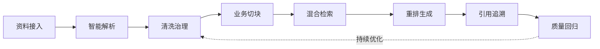
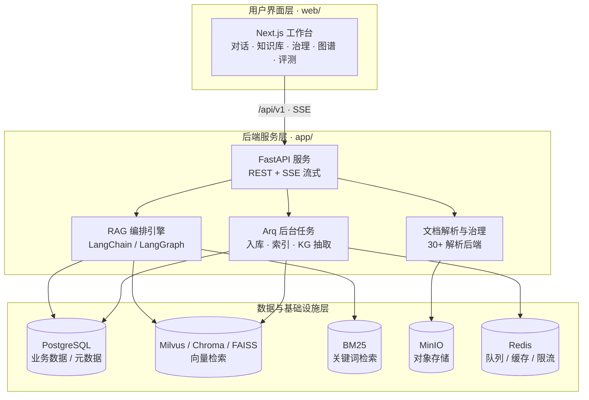

本页是本知识库的第一站，面向第一次接触该项目的开发者。你将了解到：这个平台解决什么问题、知识如何从"一堆文档"变成"可信答案"、系统由哪些部分组成，以及应该按照什么顺序继续阅读后续章节。

## 这是一个怎样的平台

**见外传媒知识库**（英文品牌 **SEEWAY 见外**，仓库内部代号 **MimirQ**）是一套面向企业的**知识运营平台**。它的定位是一句话可以概括的：**"让分散在文档里的知识，成为可检索、可验证、可持续运营的企业能力"**。它不是一个单纯的问答入口，而是一套完整的工作台——从资料入库、解析治理，到检索生成、引用追溯与质量评测，让每一份知识都有来源，让每一次回答都有依据。

平台的三类使用者对应三条不同的使用路径：**知识库运营人员**负责上传、解析、治理和验证文档；**企业知识使用者**主要通过对话检索知识；**租户管理员**负责模型、权限和运行状态配置。产品成功的标准是：使用者能快速找到可验证的证据，运营人员能定位知识质量问题，管理员能清晰完成配置而不被低频选项淹没。

Sources: [README.md](README.md#L5-L6) · [PRODUCT.md](PRODUCT.md#L9-L15)

为什么企业需要这样一套平台？因为企业拥有大量文档，却常常缺少让知识持续发挥价值的机制：资料分散在不同系统，复杂版式难以准确解析，检索结果无法解释，回答质量也缺少稳定的验收标准。平台把文档处理、数据治理、知识检索、智能回答和质量回归连接成清晰的业务链路，让团队可以回答三个关键问题：**知识从哪里来**（来源、版本、权限和处理记录完整留痕）、**答案为什么可信**（回答可以回到具体文档、页码和原文证据）、**效果如何持续提升**（解析、切块、召回、重排和生成均可检查、评测与优化）。

Sources: [README.md](README.md#L31-L50)

## 从文档到可信答案：知识业务闭环

平台围绕企业知识的完整生命周期设计。理解这条业务闭环，是理解整个系统的关键——所有模块都服务于这条链路中的某一个环节：



这条链路的每个阶段都有明确的平台能力和业务结果：

| 阶段 | 平台能力 | 业务结果 |
|:---|:---|:---|
| **资料接入** | 文件上传、URL 导入、连接器、批量任务 | 将多来源内容集中进入统一知识空间 |
| **解析与治理** | OCR、版面与表格解析、规则清洗、质量检测、隔离审核 | 减少脏数据和错误结构对后续问答的影响 |
| **切块与索引** | 章节、语义、父子等多类策略，支持预览与版本管理 | 让知识单元更符合真实业务语义 |
| **检索与生成** | 向量、全文、稀疏检索与多路融合重排 | 在正确的数据范围内找到更相关的证据 |
| **引用与评测** | 来源引用、检索 Trace、Golden 题集与回归指标 | 让结果可以验收，让优化有据可依 |

Sources: [README.md](README.md#L51-L66) · [docs/user_guide.md](docs/user_guide.md#L3-L19)

值得注意的是，链路末尾的**质量回归会反哺到清洗治理环节**——这正是"运营"二字的含义：知识入库不是一次性上传，而是一个可以评测、可以反馈、可以持续改进的循环。关于每个阶段的深入讲解，可分别参考本目录中"文档处理与知识入库""检索、重排与问答生成""评测与持续优化"等章节。

## 六大核心能力

平台的六大核心能力共同支撑上面的业务闭环，这里按从"入"到"用"再到"管"的顺序列出：

| 能力 | 一句话说明 | 典型场景 |
|:---|:---|:---|
| **企业级文档处理** | 支持 PDF、Office、图片、网页与结构化文本，可按文档特征选择 30+ 种解析后端 | 扫描件、表格、公式、复杂版式 |
| **可运营的数据治理** | 质量检测、清洗规则、治理画像、异常隔离、文档版本与重新处理 | 入库质量管控与历史数据维护 |
| **面向中文场景的混合检索** | 向量 + BM25 为基础，可组合稀疏检索、融合排序与多类重排器，且可查看 Trace | 召回/排序问题定位 |
| **带证据的智能问答** | 回答与来源证据同屏呈现，保留数据集范围、引用片段与历史记录 | 需要核对原始材料的业务问答 |
| **可回归的质量评测** | Golden 题集、Recall、MRR、RAGAS、运行记录与对比报告，构成发布门禁 | 每次调参后的标准复验 |
| **组织权限与运行保障** | 多租户、RBAC、数据集 ACL、文档级 ACL、审计、SSO/SAML/SCIM | 从团队试用到企业部署 |

Sources: [README.md](README.md#L67-L94)

需要说明的是：仓库当前覆盖 30 个解析后端、86 种切块策略和 13 类重排器，这些数字用于说明**可组合范围**，实际项目应根据资料类型、质量目标和基础设施条件选择最合适的链路，而不是全部启用。

Sources: [README.md](README.md#L67-L94) · [docs/guides/rag_platform_design_principles.md](docs/guides/rag_platform_design_principles.md#L5-L23)

## 系统架构一览

从技术架构看，系统分为三层：**用户界面层**（Next.js 前端工作台）、**后端服务层**（FastAPI + RAG 编排引擎 + 文档解析 + 后台任务）、**数据与基础设施层**（关系库、向量库、对象存储与 Redis）。前端通过 REST API 与 SSE 流式事件与后端通信，对话流式输出即依赖 SSE 通道：



对应的技术选型汇总如下：

| 层级 | 技术选型 | 说明 |
|:---|:---|:---|
| **前端** | Next.js (App Router) + React + TypeScript + Tailwind CSS | 现代 React 框架与设计系统，辅以 Radix 组件与 Zustand 状态管理 |
| **后端** | FastAPI + Python 3.11+ | 高性能异步 API 框架 |
| **AI 编排** | LangChain / LangGraph + OpenAI 兼容接口 | 检索、重排、对话生成与工作流编排 |
| **关系数据库** | PostgreSQL 15 | 文档、对话、权限等业务数据持久化 |
| **向量数据库** | Milvus 2.6（标准模式）/ Chroma、FAISS（轻量模式） | 向量检索 |
| **关键词检索** | BM25 | 与向量检索构成混合检索 |
| **对象存储** | MinIO | S3 兼容，保存源文档与图片资产 |
| **任务队列** | Arq + Redis | 异步文档处理、KG 抽取等后台作业 |
| **部署运维** | Docker Compose、Helm/Kubernetes、Prometheus 生态 | 从单机到集群的部署与可观测性 |

Sources: [docs/architecture.md](docs/architecture.md#L3-L58) · [web/package.json](web/package.json#L1-L30)

## 仓库结构速览

仓库采用"前端、后端、部署、文档"分层的经典布局。对于初学者，先记住下面几个顶层目录的职责即可：

```
MimirQ/
├── app/            # FastAPI 后端：api（路由）、core（配置）、models（ORM）、
│                   #   services（业务逻辑）、parsing（解析）、rag（检索/生成）、
│                   #   connectors（多源接入）、storage（存储）、tasks（任务）
├── web/            # Next.js 前端：app（页面）、components（组件）、hooks、
│                   #   lib（API 客户端与工具）、store（状态）、i18n（国际化）
├── docker/         # Dockerfile 与 docker-compose 部署编排
├── deploy/helm/    # Kubernetes Helm Chart
├── alembic/        # 数据库迁移（26 个版本）
├── plugins/        # 业务插件流水线（平台中立，业务逻辑放插件）
├── tests/          # 后端测试（215+ 个测试文件）
├── scripts/        # 运维、评测与 CI 工具脚本
├── docs/           # 项目文档中心
├── Makefile        # 常用开发/部署命令
└── .env.example    # 完整环境变量模板
```

Sources: [docs/architecture.md](docs/architecture.md#L60-L107) · [docs/backend_structure.md](docs/backend_structure.md#L6-L28)

两条重要的设计约定值得从一开始就记住：其一，`app/` 内的 API、检索、索引与评测代码保持**业务中立**，业务规则通过 `plugins/pipelines/<plugin>/` 进入系统；其二，入库链路必须**可拆分、可审计、可重跑**——解析、治理、切块、索引、KG、门禁、发布每个阶段都有明确的输入、输出、状态与失败原因。

Sources: [docs/guides/rag_platform_design_principles.md](docs/guides/rag_platform_design_principles.md#L24-L50)

## 部署形态与快速体验

项目提供四种部署形态，覆盖从个人笔记本到企业集群的不同场景。标准完整栈在 Docker Compose 下运行 8 个容器（Web、API、Worker、PostgreSQL、Milvus、Etcd、MinIO、Redis），轻量模式则去掉 Milvus 与 MinIO，改用 Chroma/FAISS 本地向量库以降低资源占用：

| 部署方式 | 入口命令 | 适合场景 |
|:---|:---|:---|
| **完整 Web 栈** | `make up-web` | 首次体验、团队试用、服务器部署（8 容器） |
| **轻量模式** | `make up-lite` | 笔记本、小内存机器、快速试跑（Chroma/FAISS） |
| **源码开发** | `make setup-host` + `make backend` + `make web` | 前后端开发与热更新调试 |
| **Helm / Kubernetes** | [部署文档](docs/deployment/helm.md) | 集群化生产部署 |

Sources: [README.md](README.md#L166-L214) · [docker/docker-compose.yml](docker/docker-compose.yml#L56-L259) · [docker/docker-compose.lite.yml](docker/docker-compose.lite.yml#L1-L34) · [Makefile](Makefile#L77-L120)

推荐的体验路径是：克隆仓库 → `make init`（生成 `.env` 与安全密钥）→ 在 `.env` 中至少填写 `LLM_API_KEY` → `make up-web` → 打开 http://localhost:3000。默认配置使用硅基流动的 `Qwen/Qwen3-32B` 与 `BAAI/bge-m3`，一个 Key 即可同时驱动 LLM 与 Embedding；若未配置首个管理员，可在页面注册第一个本地账户。启动完成后，Web 工作台位于 3000 端口，Swagger API 文档位于 8000 端口的 `/docs`。

Sources: [README.md](README.md#L174-L203) · [docs/quickstart.md](docs/quickstart.md#L3-L45) · [docs/guides/model_services.md](docs/guides/model_services.md#L10-L33)

平台已经在固定 800 题、真实自托管模型和多知识库场景下完成完整复测（2026-07-27）：800/800 全部成功执行，准确率 98.9%，证据覆盖率 99.5%。需要强调的是，该结果用于验证指定数据、模型与配置下的知识链路，**不代表所有业务场景的固定效果**；测试方法与完整指标记录在真实场景验证报告中。

Sources: [README.md](README.md#L138-L147)

## 设计原则：平台中立与证据可追溯

理解平台的三个设计原则，有助于后续阅读各模块文档时抓住重点：

1. **平台中立，插件承载业务**：平台只消费标准合约，不理解业务字段含义；业务规则、同义词、评测样例等全部放入插件包。
2. **证据与状态必须可追溯**：内部 API、数据结构和可观测性链路是系统约束，用户界面可以重组但不能隐藏必要的证据和状态。
3. **检索先验证，生成后评判**：回答生成不能作为检索质量通过的证据——Golden Gate 在发布前证明"检索能拿到答案依据"，而不是"LLM 能编出答案"。

Sources: [PRODUCT.md](PRODUCT.md#L17-L19) · [PRODUCT.md](PRODUCT.md#L44-L49) · [docs/guides/rag_platform_design_principles.md](docs/guides/rag_platform_design_principles.md#L24-L31) · [docs/guides/rag_platform_design_principles.md](docs/guides/rag_platform_design_principles.md#L76-L89)

## 下一步阅读路径

本页只负责建立全局印象。按照入门顺序，建议继续阅读：

1. **[快速启动与首次体验](2-kuai-su-qi-dong-yu-shou-ci-ti-yan)**——把系统真正跑起来，完成第一个知识库闭环，建立动手体验。
2. **[部署方式选择：完整栈、轻量与源码开发](3-bu-shu-fang-shi-xuan-ze-wan-zheng-zhan-qing-liang-yu-yuan-ma-kai-fa)**——根据你的机器条件选择最合适的部署形态。
3. **[模型服务与首次管理员配置](4-mo-xing-fu-wu-yu-shou-ci-guan-li-yuan-pei-zhi)**——配置 LLM、Embedding、Reranker 与首个管理员账号。

对系统内部机制感兴趣的读者，可以在跑通闭环后进入"深入解析"章节，从 **[总体架构与技术栈](5-zong-ti-jia-gou-yu-ji-zhu-zhan)** 开始，逐步了解 API 分层、数据模型、文档处理流水线、混合检索与 RAG 对话引擎等主题。每一篇文档都聚焦一个可独立阅读的主题，你可以按照目录顺序，也可以按需跳读。