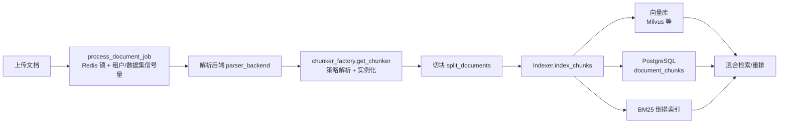
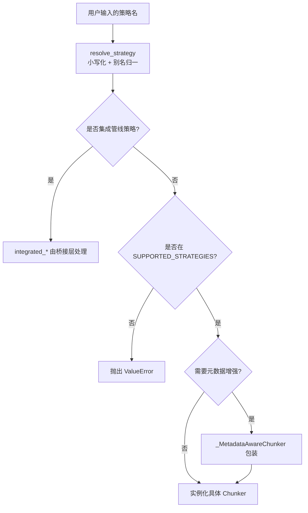
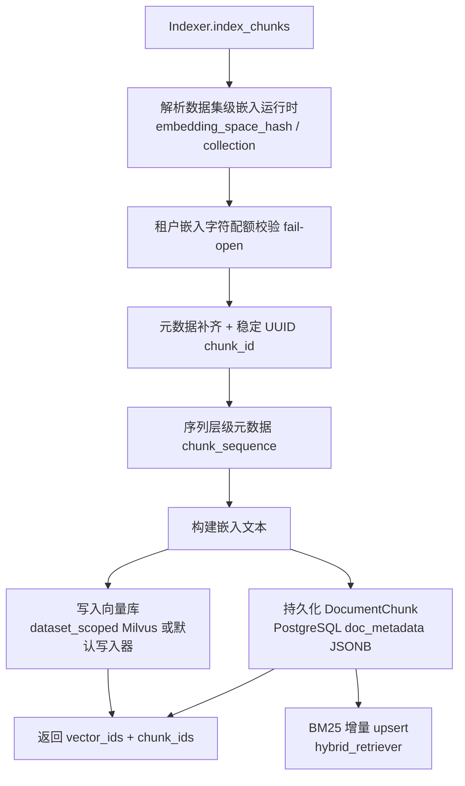

本篇聚焦 MimirQ 的文档处理流水线中「切块（Chunking）」与「索引构建（Indexing）」两个环节：前者负责把解析后的长文本切成语义完整、边界合理的块；后者负责为每个块构建向量嵌入、BM25 倒排索引并持久化到关系库，形成可供检索层消费的多路索引。阅读本篇前建议先了解 [解析后端与文档处理流水线](9-jie-xi-hou-duan-yu-wen-dang-chu-li-liu-shui-xian)，本篇是「文档处理与知识入库」阶段的第二环。

## 切块与索引在整体流水线中的位置

文档从上传到可检索，走的是「解析 → 切块 → 索引」三段式任务。后台任务 `process_document_job` 在获得文档锁、租户信号量与数据集信号量之后，将 `parser_backend` 与 `chunk_strategy` 从文档元数据中取出，委托给 `document_processor.process_document` 在独立线程中执行完整流程。切块器由 `chunker_factory` 统一创建，索引器则统一走 `Indexer` 服务。



任务执行入口见 `app/tasks/jobs.py`（锁与信号量 L577-L672、委托处理 L844）；`document_processor.process_document` 中解析流水线配置 `pipeline_effective` 并据此构建索引选项（L612-L617）。

Sources: [jobs.py](app/tasks/jobs.py#L535-L672), [jobs.py](app/tasks/jobs.py#L833-L873), [processor.py](app/parsing/processors/processor.py#L612-L617)

## 切块策略体系：工厂、别名与两级策略域

切块能力由一个单例 `ChunkerFactory` 统一管理（`app/rag/chunking/factory.py`）。`SUPPORTED_STRATEGIES` 注册了约一百种本地策略类（L261-L346），覆盖通用文本、Markdown、代码、配置、DevOps 清单、业务文档等形态；另有 `INTEGRATED_PIPELINE_STRATEGIES` 四个策略（`integrated_naive`、`integrated_book`、`integrated_laws`、`integrated_email`）走的是第三方集成管线（L348-L353），它们不通过本地 `get_chunker` 实例化，而是由集成桥接层处理。`STRATEGY_ALIASES` 提供了面向用户的中英文别名映射，例如 `faq`/`qa` → `qa_pairs`、`sop`/`procedure`/`workflow` → `sop_steps`、`contract`/`policy` → `laws_structured`、`简历`/`履历` → `resume_structured`（L355-L558）。



`resolve_strategy` 以 `settings.DEFAULT_CHUNK_STRATEGY`（默认 `langchain_recursive`）作为兜底，并对 LlamaIndex 系策略做开关校验（L560-L593）。`get_chunker` 在实例化时会通过 `inspect.signature` 过滤策略专属 kwargs（例如 `parent_child` 的 `child_ratio`、`min_child_size`），避免把企业级调参参数传给不接受的切块器（L637-L667）；若开启了 `enrich_document_metadata` 或 `inject_metadata_header`，则用 `_MetadataAwareChunker` 包装内层切块器，在切块前做文档级元数据增强、在切块后把「摘要/关键词/问题」注入块首（L110-L172）。

Sources: [factory.py](app/rag/chunking/factory.py#L261-L353), [factory.py](app/rag/chunking/factory.py#L560-L693), [config.py](app/core/config.py#L1990)

### 策略分类速览

| 类别 | 代表策略 | 边界依据 |
| --- | --- | --- |
| 通用兜底 | `langchain_recursive`、`langchain_token`、`separator` | 字符数 + 分隔符优先级 |
| 语义边界 | `semantic_sentence`、`sentence_window`、`proposition` | 句号/问号/叹号，中英文兼容 |
| 层级结构 | `parent_child`、`markdown_hierarchy`、`text_hierarchy`、`book_structured` | 父子两级、标题层级 |
| Markdown/文档 | `markdown_aware`、`markdown_header`、`markdown_table`、`markdown_frontmatter` | 标题、表格行、YAML frontmatter |
| 代码/配置 | `code`、`smart_code`、`json`、`yaml_manifest`、`toml_config`、`sql_schema` | AST/块/语句边界 |
| DevOps 清单 | `dockerfile`、`docker_compose`、`github_actions`、`gitlab_ci`、`ansible_playbook`、`terraform_plan` | stage/service/job/play/change 块 |
| 业务文档 | `qa_pairs`、`sop_steps`、`glossary`、`resume_structured`、`laws_structured`、`paper`、`postmortem_report` | 条目/步骤/条款/章节语义 |

Sources: [factory.py](app/rag/chunking/factory.py#L175-L259), [factory.py](app/rag/chunking/factory.py#L261-L346)

## Auto 策略与自适应切块参数

`AutoChunker`（`app/rag/chunking/strategies/auto.py`）是面向「不关心策略细节」用户的智能默认：对每个文档独立选择策略。`_select` 内部维护了一条约 80 个谓词的判定链（L526-L601），依次检测 CSV、JSONL、OpenAPI、Git 提交日志、diff、字幕、日志、堆栈、HTTP 追踪、YAML 族、聊天记录、QA 对、SOP、术语表、会议纪要、法律条款、论文、书籍、大纲、RST/AsciiDoc/LaTeX/Org-mode/MediaWiki、HTML 等格式；命中即返回对应切块器与策略名。未命中任何结构特征时，长文本（长度 ≥ max(chunk_size*2, 1200)）走 `semantic_sentence` 以减少断句，其余回退 `langchain_recursive`（L607-L612）。

自适应参数 `_adaptive_chunk_params`（L114-L168）在基础 `chunk_size` 上按文档类型与文本密度做保守调整：PDF 且策略为通用型时放大 10% 以保留段落上下文；平均行长大致 ≥140 的密集文本缩小到 0.8 倍；平均行长短且行数多的稀疏文本放大到 1.3 倍；最终钳制在 400–1800 字符区间，并按基础比例折算 overlap。密度指标由 `_density_metrics` 在最多 5 万字符样本上确定性计算（L86-L111）。切块完成后，Auto 策略会在每个块的元数据中写入 `chunk_strategy_auto`、`chunk_strategy_selected`、`chunk_size_effective`、`adaptive_chunk_reason`、`adaptive_density` 等字段（L646-L657），便于后续质量门禁与检索诊断回溯。

Sources: [auto.py](app/rag/chunking/strategies/auto.py#L86-L168), [auto.py](app/rag/chunking/strategies/auto.py#L514-L659)

## 三个核心通用切块器

**递归字符切块（`langchain_recursive`）** 是系统默认策略。其分隔符序列针对中英文做了优化：`["\n\n", "\n", "。", "！", "？", ".", "!", "?", " ", ""]`，中文句读优先级高于英文标点，空格兜底（L19）。切块时通过 `add_start_index` 记录 `start_char`/`end_char` 字符偏移，供前端高亮与证据引用使用（L53-L58）；遇到 HTML 表格时把整个 `<table>` 作为原子块保留，避免拆散表格结构（L46-L98）。

**语义句切块（`semantic_sentence`）** 用中英文句界正则 `[^。！？.!?\n]+[。！？.!?\n]?` 切分句子，再聚合到目标大小（L27-L35）。实现上会预先提取围栏代码块（```...```）与 Markdown 列表项区间并加以保护，确保代码与列表不被句子边界切断（L44-L100）。

**父子两级切块（`parent_child`）** 构建两层结构：父块使用完整 `chunk_size` 提供上下文，子块尺寸为 `max(chunk_size * child_ratio, min_child_size)`（默认 child_ratio=0.5、min_child_size=200），子块 overlap 也按比例折算（L31-L63）。父块 ID 由位置与内容哈希共同决定（`stable_hash`），保证跨运行稳定，便于回归题集、缓存与 trace diff（L116-L120）。

Sources: [recursive.py](app/rag/chunking/strategies/recursive.py#L15-L118), [semantic.py](app/rag/chunking/strategies/semantic.py#L27-L100), [parent_child.py](app/rag/chunking/strategies/parent_child.py#L21-L120)

## 切块预设（Chunk Presets）

`ChunkPreset` 模型（`app/models/chunk_preset.py`）为切块配置提供可复用的租户级模板：`payload` 以 JSONB 存储声明式配置（不包含可执行代码），支持按数据集可选作用域（`dataset_id`），并通过外键约束保证 `dataset_id` 与 `tenant_id` 同属一个租户（L18-L42）。预设服务于切块预览 UI 与入库调优流程，是「策略 + 参数」组合在团队内沉淀与复用的载体。

Sources: [chunk_preset.py](app/models/chunk_preset.py#L18-L42)

## 索引构建流水线：向量 + 关系库 + BM25 三路写入

索引的核心是 `Indexer`（`app/services/indexer.py` L918 起）。`index_chunks`（L1315-L1561）按以下顺序执行：先加载文档所属数据集，解析**数据集级嵌入运行时**（embedding 供应商、模型、向量集合名、空间哈希），未命中时抛出明确异常（L1330-L1371）；随后做**租户嵌入字符配额**校验，配额服务不可用时 fail-open（L1376-L1395）；接着为每个块补齐 `tenant_id`、`document_id`、`embedding_space_hash`、`vector_collection_name`、`source`、`file_type`、`document_title` 等元数据，并生成稳定的 UUID `chunk_id` 供跨系统关联（L1409-L1447）；再按 `chunk_sequence` 应用序列层级元数据（L1449-L1454）；最后分别完成嵌入文本构造、向量写入、PostgreSQL 持久化与 BM25 增量更新。



`IndexingOptions`（`app/types/indexing.py` L32-L47）以可空布尔开关控制各索引通道与嵌入增强：`chunk_vector_enabled`、`bm25_index_enabled`、`event_vector_enabled`、`entity_vector_enabled`、`embedding_context_prefix_enabled`、`embedding_contextual_retrieval_enabled`（含 `lazy_mode`）以及 `embedding_field_aware_enabled`。`ChunkInput`（L50-L56）携带内容、元数据与页码/字符偏移，是切块结果进入索引层的标准载体。

向量写入由 `_index_chunk_vectors` 路由（L2342-L2373）：当启用数据集级向量且后端为 Milvus 时走 `_write_dataset_scoped_chunk_vectors`，否则走默认写入器；向量关闭时返回等长 `None` 列表。`_persist_document_chunks`（L2375-L2429）把每个块落为 `DocumentChunk` 行，记录 `chunk_index`、`page_number`、`start_char`、`end_char`、`doc_metadata`（JSONB）与 `vector_id`。`_update_bm25_for_chunks`（L2431-L2469）将同一批块构造为 LangChain Document 后交给 `hybrid_retriever.upsert_bm25_documents` 做增量更新。

Sources: [indexer.py](app/services/indexer.py#L1315-L1561), [indexer.py](app/services/indexer.py#L2342-L2469), [indexing.py](app/types/indexing.py#L20-L64)

## 嵌入文本的构建：从干净内容到检索优化文本

索引层刻意区分「展示内容」与「检索文本」：存入库的 `content` 保持解析后的干净正文，而用于嵌入与 BM25 的文本可叠加结构上下文。`_chunk_index_content`（L396-L422）优先采用业务插件提供的 `_retrieval_text`（含标签/别名/结构化字段），否则回退到正文，再拼接由元数据派生的检索前缀，最后经 `normalize_query` 统一归一化（记录 `retrieval_normalization_rules`，并把原始展示内容存到 `_retrieval_display_content` 元数据）。三种嵌入增强开关依次为：

1. **上下文前缀（`embedding_context_prefix_enabled`）**：`_build_embedding_text`（L437-L462）把 `header_path`/`outline_path_str` 等章节路径截断到 180 字符内，以 `[Section] 标题\n` 形式前置到嵌入文本，缓解「无上下文碎片」问题；对 image/table 类块自动跳过（`_should_prefix_embedding` L425-L434）。
2. **上下文检索前缀（`embedding_contextual_retrieval_enabled`）**：由 `contextual_enrichment.build_context_prefix`（`app/rag/chunking/contextual_enrichment.py` L131-L195）确定性生成——不调用 LLM，按文本 CJK 占比（≥12%）自动切换中英文模板，产出「本文档《标题》的摘录。章节：X。关键词：Y。」式前缀，整体限制在 240 字符内保持嵌入稳定；`lazy_mode` 下仅对携带显式增强触发的块生效（L1469-L1486）。
3. **字段感知嵌入（`embedding_field_aware_enabled`）**：对每个块额外写入 `[Title]` 与 `[Heading]` 两路向量，`chunk_id` 以 `:title`/`:heading` 后缀区分以避免与主向量 ID 冲突，检索时再折叠回规范块 UUID（L1492-L1513）。

Sources: [indexer.py](app/services/indexer.py#L396-L462), [indexer.py](app/services/indexer.py#L1469-L1513), [contextual_enrichment.py](app/rag/chunking/contextual_enrichment.py#L131-L195)

## 索引生命周期：删除、重建与并发约束

索引层同时负责删除与重建。`delete_chunk_indexes`（L1772 起）支持按 `tenant_id + document_id` 清理，并可指定 `strict` 模式；`rebuild_chunk_indexes`（L2071 起）与 `rebuild_tenant`（L1302-L1313）支持按租户/文档集合批量重建，被后台重建任务调用（`jobs.py` L1595）。值得注意的工程约束：`index_chunks_async` 被显式禁用（L1563-L1586），原因是共享 SQLAlchemy Session 跨线程不安全，异步场景应走任务队列管线而不是 `asyncio.to_thread` 并发写库——这一决策体现了索引层对数据一致性的优先级。

Sources: [indexer.py](app/services/indexer.py#L1270-L1313), [indexer.py](app/services/indexer.py#L1563-L1586), [jobs.py](app/tasks/jobs.py#L1595)

## 与上下游模块的衔接

切块策略与索引构建的配置入口分散在上游 API 层：上传接口以表单接收 `chunk_strategy`（默认取 `settings.DEFAULT_CHUNK_STRATEGY`），并依次被数据集默认策略与入库策略规则覆盖，最终连同 `pipeline_hash` 一起写入文档元数据，保证同一文档的多次入库可追溯（`document_upload.py` L581-L590、L678-L719、L806-L831）。切块预览接口则提供「所见即所得」的试切能力，支持 `separator` 自定义分隔符、小块合并与 `max_chunks` 截断（`document_chunk_preview.py` L586-L672）。`strategy_matrix.py` 内置各策略的典型样本与验证矩阵，用于回归保障每种策略都能产出合法块。

后续可继续阅读 [数据治理画像与入库质量门禁](12-shu-ju-zhi-li-hua-xiang-yu-ru-ku-zhi-liang-men-jin) 了解切块质量如何被评分与拦截，或跳至 [混合检索与多路融合排序](14-hun-he-jian-suo-yu-duo-lu-rong-he-pai-xu) 查看这些索引在检索阶段如何被消费。