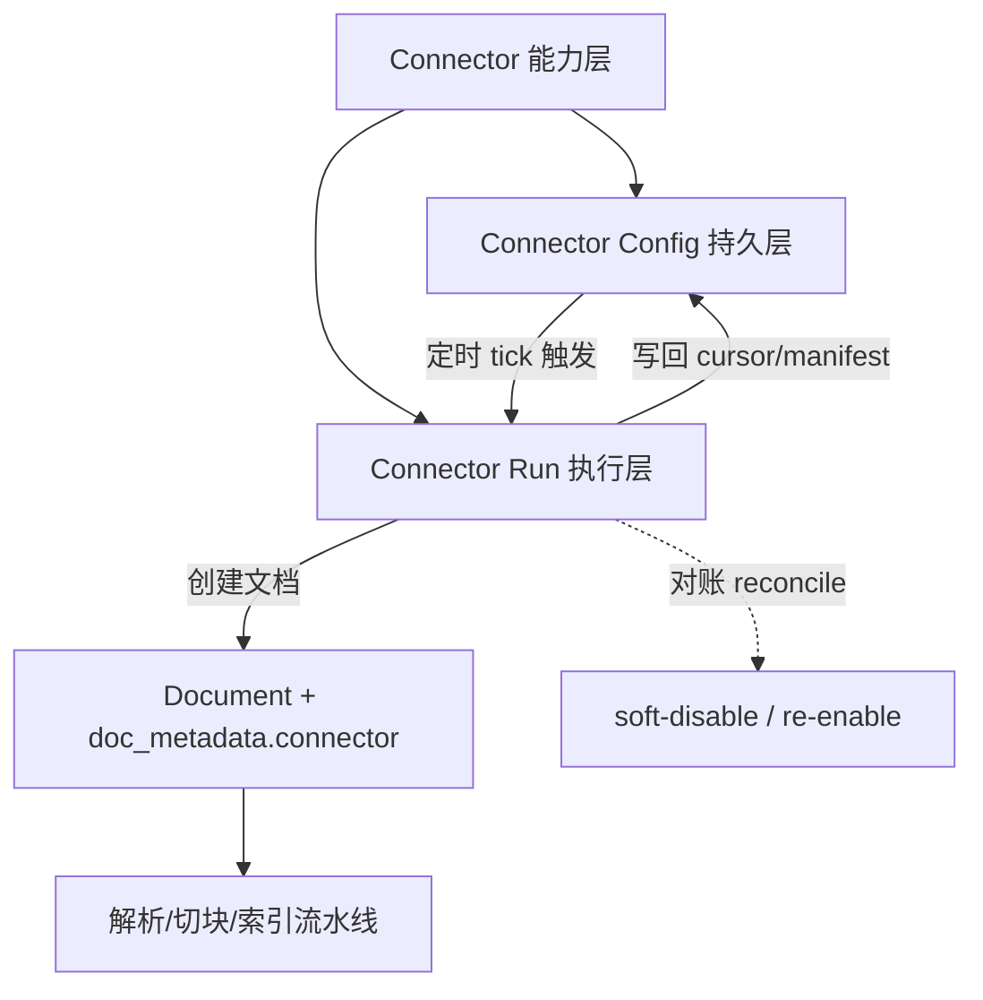
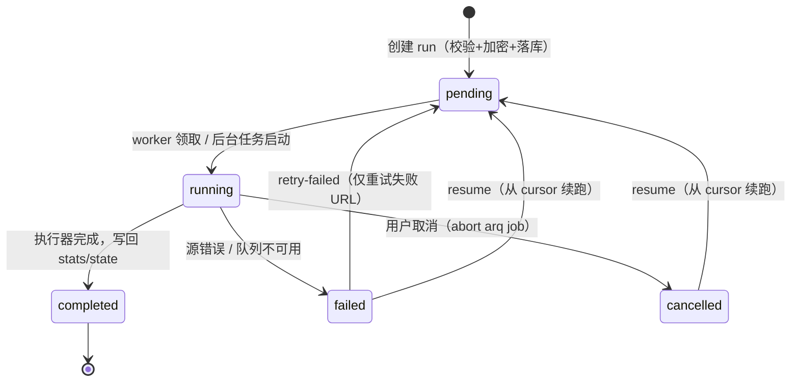

连接器（Connector）是 MimirQ 面向"多源数据接入"的统一抽象层：它将从外部数据源批量导入文档的过程，封装为**可追踪、可取消、可重试、可增量同步**的 Connector Run。本文深入解析连接器体系的三层抽象、Run 生命周期、增量状态持久化、对账机制、定时调度与安全边界，帮助读者理解一条 URL 或一张数据库表如何被安全、可审计地接入知识库。

## 核心抽象：Connector / Config / Run 三层模型

连接器体系围绕三个层次展开，职责边界清晰：

- **Connector**：一个导入器的能力定义（如 `web_crawl`、`github_repo`、`jira_project`）。后端内置两类注册表：一类是运行时类注册表（用于连通性测试与统一接口），另一类是静态能力声明注册表（用于描述增量、续跑、对账等语义）。
- **Connector Config**：可选的"持久化配置 + 定时任务"，绑定到具体 dataset，可保存 cursor/manifest 等跨 run 状态，实现周期性增量同步。
- **Connector Run**：一次实际执行。记录状态、统计、错误与产出的 document_ids，是整个体系的可观测性锚点。

运行时接口定义在 `ConnectorBase` 抽象基类中：`connect` 准备运行时状态、`fetch_documents` 以异步迭代器产出规范化文档、`test_connection` 做尽力而为的连通性探测、`supported_file_types` 声明可产出的文件类型。规范化产物 `RawDocument` 统一携带 `source_ref`、`content`、`metadata`，让下游解析流水线无需感知源系统差异；`ConnectionTestResult` 则承载探测结果与诊断详情。

Sources: [base.py](app/connectors/base.py#L11-L34) · [types.py](app/connectors/types.py#L8-L26) · [registry.py](app/connectors/registry.py#L17-L46)

## 双重注册机制：类注册表与能力声明表

连接器体系存在两套并行的注册数据，理解其分工是掌握架构的关键：

| 注册表 | 载体 | 作用 | 示例 |
|---|---|---|---|
| 运行时类注册表 | `ConnectorRegistry`（装饰器注入） | 提供 `test_connection` 等类级实现，目前 DB Catalog 连接器使用 | `@registry.register("mysql_catalog")` |
| 静态能力声明表 | `CONNECTOR_REGISTRY`（`ConnectorDefinition`） | 声明 `supports_incremental` / `supports_resume` / `supports_full_reconcile` / `sync_cursor_kind` / `state_keys` | `web_crawl`、`jira_project` 等 9 个条目 |

执行器分发表 `_CONNECTOR_EXECUTOR_NAMES` 将 `connector_id` 惰性映射到 `app.api.v1.connectors` 模块中的 `_execute_*_run` 函数——队列 worker 因此无需在模块初始化期导入 API 路由，保持依赖单向且延迟。

Sources: [connector_registry.py](app/services/connector_registry.py#L17-L103) · [connector_run_executor.py](app/services/connector_run_executor.py#L8-L50) · [catalog_connectors.py](app/connectors/db/catalog_connectors.py#L82-L144)

## 数据模型：Run 与 Config 的持久化

三张核心表构成连接器体系的持久化基座，均在 `0001_baseline_schema` 迁移中建立：

- **`connector_runs`**：一次执行。`connector_id` 标识类型（如 `url_batch`），`config` 为 JSONB 加密后的配置，`stats` 记录增量统计与失败明细，`status` 状态机为 `pending → running → completed / failed / cancelled`，并可选关联 `task_id` 以支持队列任务中止。
- **`connector_run_documents`**：Run 到 Document 的映射表，记录 `source_ref`（如 URL）与每个产出文档的处理状态，实现"一次 run 产出哪些文档"的可追溯查询。
- **`connector_configs`**：持久化的可复用配置，含 `enabled`、`schedule_cron`、`config` 与跨 run 的 `state`，以及 `last_run_at` / `last_error` 供调度与运维观测。

三者均通过复合外键 `(tenant_id, dataset_id)` 级联到数据集，确保租户隔离与数据集的删除级联。文档侧通过 `doc_metadata.connector` 对象（含 `connector_id`、`run_id`、`config_id`、`source_ref`）建立"文档 ← 连接器"的身份溯源，这是后续对账与 ACL 增量同步的基础。

Sources: [connector.py](app/models/connector.py#L24-L76) · [connector_config.py](app/models/connector_config.py#L18-L49) · [0001_baseline_schema.py](alembic/versions/0001_baseline_schema.py#L442-L483) · [connectors_artifacts.py](app/api/v1/connectors_artifacts.py#L25-L56)

## Run 生命周期：从创建到执行的完整链路

Run 的创建与执行采用"先持久化、后调度"的可靠模式。创建端点 `POST /api/v1/connectors/runs` 依次完成：按 `connector_id` 选择对应 Pydantic 配置模型校验、加密敏感字段、校验引用的租户组存在性、落库为 `pending` 状态，最后二选一进入执行通道——若启用任务队列则入队 `connector_run_job`，否则通过 `BackgroundTasks` 直接调度执行器。

队列路径中，worker 会先获取租户级并发信号量（`TASK_TENANT_MAX_CONCURRENCY_CONNECTOR`）与 Redis 分布式锁（`lock:connector:{tenant_id}:{run_id}`），既防止同租户连接器任务过度并发，也保证同一 run 不被重复执行；若锁被占用则直接跳过并返回 `locked` 状态。无队列部署时则退化到进程内 `BackgroundTasks`，保证轻量环境同样可用。

针对失败/取消的 run，系统提供三种补救路径：

| 端点 | 语义 | 适用连接器 |
|---|---|---|
| `POST /runs/{id}/retry-failed` | 仅提取失败 URL 重建 run（`stats.failed_urls` / `errors` 中提取） | `url_batch`、`web_crawl`（重建为 `url_batch`） |
| `POST /runs/{id}/resume` | 从已持久化的 cursor 切片剩余条目续跑 | 声明 `supports_resume=true` 的连接器 |
| `POST /runs/{id}/cancel` | 置为 `cancelled` 并尽力 abort 队列任务 | 全部 |

`resume` 与 `retry-failed` 都会创建全新的 run（`stats` 中记录 `resume_of` / `retry_of` 溯源），而非原地修改原 run，从而保留完整审计历史。

Sources: [connectors_runs.py](app/api/v1/connectors_runs.py#L469-L523) · [connectors_runs.py](app/api/v1/connectors_runs.py#L598-L702) · [connectors_runs.py](app/api/v1/connectors_runs.py#L705-L729) · [jobs.py](app/tasks/jobs.py#L409-L527) · [queue.py](app/tasks/queue.py#L320-L341)

## 增量同步与状态持久化：cursor / watermark / manifest 三态模型

连接器体系区分两个容易混淆的能力维度：

- **`supports_resume`**：解决"这个 run 还没做完"——从失败/取消点继续，基于 offset cursor。
- **`supports_incremental`**：解决"源系统已经同步到哪里"——跨 run 表达源侧进度，后续 run 自动只处理 changed/new 项，甚至出现 no-op rerun。

持久化状态由 `connector_sync_state` 服务统一构建，形成稳定、可审计的 envelope：`state_schema_version`（当前 v2）、`state_revision`（单调递增）、`state_recorded_at`、`state_audit`（有界历史，默认保留最近 10 次，记录 revision、run_id、status 与被更新的 state keys）。顶层同时保留 connector 专属字段，执行器可直接读取。

根据 `sync_cursor_kind`，状态快照会归一化为三类子结构：

| cursor 类型 | 字段 | 语义 | 代表连接器 |
|---|---|---|---|
| `offset` | `cursor` | 已处理的条目序号，支持切片续跑 | `url_batch`、`web_crawl`、`github_repo`、`drive_files`、`minio_bucket` |
| `timestamp` | `last_modified` + `last_modified_ids` | 源侧更新时间游标（watermark），附带边界 ID 防漏 | `confluence_space`、`jira_project` |
| `source_manifest` | `source_manifest` | path → 稳定 sync token 映射（如 `etag`、`blob_sha`、`body_sha256`），判定 changed/new | 全部增量连接器 |

`build_saved_state_snapshot` 在每次 run 结束后将 stats 中的 cursor/manifest/totals 合并进既有 state，同时递增 revision 并追加审计条目；`_build_state_sync_payload` 则产出供运维消费的规范化 `state_sync` 摘要（schema 版本、能力位、cursor/watermark/manifest 归一化视图、最近成功 run 标记）。

Sources: [connector_sync_state.py](app/services/connector_sync_state.py#L12-L13) · [connector_sync_state.py](app/services/connector_sync_state.py#L198-L242) · [connector_sync_state.py](app/services/connector_sync_state.py#L245-L318)

## 对账机制：从 manifest 到 soft-disable

增量同步之外，连接器体系还提供**全量对账（reconcile）**能力，解决"源侧已删除的对象"问题。对账服务 `plan_connector_reconcile` 以文档身份元数据（`doc_metadata.connector` 中的 `connector_id` / `config_id` / `source_ref`）与期望的 source refs 集合（来自 `source_manifest` keys）做差集分析，将文档分为四类：

- **stale**：历史存在但本次源侧缺失 → 执行 **soft-disable**（置 `disabled_at`，非 hard delete）
- **reenable**：曾禁用但重新出现在源侧 → 恢复可用
- **missing**：期望存在但本地未找到 → 记录样本供排查
- **active**：双侧一致

对账只作用于**由同一 connector + config 创建的文档**（通过身份元数据过滤），绝不会误伤手工上传或其他连接器写入的文档。`reconcile` 支持 `apply=false` 的 dry-run 模式，返回 `documents_scanned`、`stale_source_refs`、`disabled_documents` 等统计与抽样列表，便于运维先行评估再落地。

Sources: [connector_reconcile_service.py](app/services/connector_reconcile_service.py#L32-L52) · [connector_reconcile_service.py](app/services/connector_reconcile_service.py#L55-L82) · [connector_reconcile_service.py](app/services/connector_reconcile_service.py#L85-L168) · [connectors_acl.py](app/api/v1/connectors_acl.py#L209-L259)

## 定时调度：cron 驱动与窗口认领

对于需要周期性增量同步的场景，`ConnectorConfig.schedule_cron` 配合调度 tick 端点实现定时触发。`POST /api/v1/connectors/scheduled/tick` 的处理流程具备严格的并发安全设计：

1. **到期判定**：基于 cron 表达式与 `last_run_at` 计算是否到期；
2. **权限复核**：确认 config 绑定 dataset 当前账号仍可写；
3. **窗口认领（乐观锁）**：以 `last_run_at` 作为版本条件执行原子 UPDATE，行数归零则说明已被其他 worker 认领，直接跳过——防止分布式重复触发；
4. **执行与回滚**：入队成功后推进 `last_run_at`；若队列不可用（503），回滚窗口并保留 `last_error`，等待下一轮重试。

定时 run 的 config 会自动注入 `_state`（取自 config 的持久化 state），使增量连接器在调度场景下天然携带上次同步进度。若全局开关未开启（如 `URL_INGEST_ENABLED=false`），调度会直接标记 run 失败并记录 `url_ingest_disabled` / `db_catalog_disabled` 错误码。

Sources: [connectors_schedules.py](app/api/v1/connectors_schedules.py#L45-L100) · [connectors_schedules.py](app/api/v1/connectors_schedules.py#L102-L194)

## 安全边界：SSRF、出口策略、密钥加密与 ACL 继承

多源接入天然面临"向外部系统发起网络请求 + 存储凭据 + 继承源权限"三重安全挑战，MimirQ 分别给出对应控制：

**URL/抓取类连接器的 SSRF 防护。** `url_batch`、`web_crawl`、`github_repo`、`drive_files`、`minio_bucket`、`confluence_space`、`jira_project` 复用 URL ingest 的校验逻辑：仅允许 http/https、默认禁止私网/回环/链路本地地址、默认不跟随重定向、限制下载大小与超时。预检端点 `POST /api/v1/connectors/validate` 会对 URL 候选做有界连通性检查（最多 3 个样本，fail-open 仅告警），避免 run 创建后才失败。

**DB 连接器的出口策略。** `mysql_catalog` / `sqlserver_catalog` 在创建与连通性测试时都会经过 `validate_db_connector_config`：解析主机 DNS 得到全部地址后，先匹配 `CONNECTOR_DB_EGRESS_ALLOW_CIDRS` 白名单，未命中则按 metadata 网络（169.254.169.254 等云元数据端点）、回环、链路本地、私网等类别拦截并报错，杜绝数据库凭据被用于内网横向探测。

**凭据加密与脱敏。** 连接器配置中的敏感字段（顶层 `password` 与 `auth` 下的 `cookie` / `token` / `password`）在落库前用基于 `SECRET_KEY` 派生的 Fernet 密钥加密（前缀 `enc:v1:`），API 响应统一脱敏为 `<redacted>`；`SECRET_KEY_FALLBACKS` 支持密钥轮换后的旧密文回退解密。

**源权限继承（Source ACL → Document ACL）。** 连接器可配置 `source_acl`，将源系统主体（GitHub team、Jira security level、Drive 权限等）归一化为 source principal key，再通过 `tenant_groups.external_id` 映射到租户组，最终写入文档 ACL 的 `partial_group_list`。映射采用 **fail-closed** 策略：无映射主体时回退到 `fallback_mode`（默认 owner-only），宁可收紧不放宽。

Sources: [connector_egress_policy.py](app/services/connector_egress_policy.py#L7-L12) · [connector_egress_policy.py](app/services/connector_egress_policy.py#L81-L111) · [secrets.py](app/core/secrets.py#L61-L163) · [connector_source_acl_mapping.py](app/services/connector_source_acl_mapping.py#L18-L72) · [connectors_validation.py](app/api/v1/connectors_validation.py#L103-L200)

## 内置连接器清单

当前内置 9 个连接器，能力矩阵如下：

| connector_id | 中文名 | 增量 | 续跑 | 全量对账 | cursor 类型 | 备注 |
|---|---|---|---|---|---|---|
| `url_batch` | URL 批量导入 | ✅ | ✅ | — | offset | URL 级轻量增量与断点续跑 |
| `web_crawl` | 网站抓取 | ✅ | ✅ | ✅ | offset + manifest | 内容感知 token（body_sha256） |
| `github_repo` | GitHub Repo 导入 | ✅ | ✅ | ✅ | offset + manifest | blob SHA manifest，removed path 剪枝 |
| `drive_files` | Google Drive 文件导入 | ✅ | ✅ | ✅ | offset + manifest | version/modifiedTime/file_id token |
| `minio_bucket` | MinIO/S3 Bucket 导入 | ✅ | ✅ | ✅ | offset + manifest + scope hash | scope 变化重置 manifest |
| `confluence_space` | Confluence Space 导入 | ✅ | — | ✅ | timestamp | `last_modified` cursor |
| `jira_project` | Jira Project 导入 | ✅ | — | ✅ | timestamp | 默认 `jira_ticket` chunker |
| `mysql_catalog` | MySQL Catalog 导入 | ✅ | ✅ | ✅ | manifest | 目录/安全画像，可选行级 sidecar |
| `sqlserver_catalog` | SQLServer Catalog 导入 | ✅ | ✅ | ✅ | manifest | 同上 |

所有 URL 类连接器共享同一套 run API 与通用入库字段（`parser_backend`、`chunk_strategy`、`pipeline`、`access`、`source_acl`），使配置心智与文件上传、单条 URL 导入保持一致。各连接器的完整配置示例与增量语义详见仓库内既有指南 [docs/guides/connectors.md](docs/guides/connectors.md)、[web_crawl.md](docs/guides/web_crawl.md) 与 [url_ingest.md](docs/guides/url_ingest.md)。

Sources: [connector_registry.py](app/services/connector_registry.py#L17-L103) · [connectors_runs.py](app/api/v1/connectors_runs.py#L38-L71) · [connectors_db_catalog.py](app/api/v1/connectors_db_catalog.py#L365)

## 前端集成与运维入口

前端通过 `connectorApi` 客户端（OpenAPI 驱动）封装全部连接器端点，知识库工作台以对话框形式提供导入入口（如 URL 批量导入对话框，支持 URL 解析、ACL 模式选择与解析器/切块策略偏好注入）。`useConnectorRuns` hook 负责 run 列表的查询、取消、重试失败项与续跑操作，并与文档列表联动刷新——run 创建成功后立即触发文档重载。

Run 详情响应包含 `stats`、`error_message`、`acl_summary`（仅计数、不含成员 ID 的隐私安全摘要）与 `documents` 产出清单，支撑任务中心式的运维视图。对于 DB Catalog 类连接器，run 还会产出 schema 文档与可选的 `dbrows` 行级 sidecar 文档，供数据形态理解与 TAG 召回使用。

Sources: [connectors.ts](web/lib/api/connectors.ts#L21-L124) · [use-connector-runs.ts](web/hooks/use-connector-runs.ts#L34-L152) · [knowledge-url-batch-dialog.tsx](web/components/knowledge/import/knowledge-url-batch-dialog.tsx#L106-L174) · [connector.py](app/api/schemas/connector.py#L521-L635)

## 阅读延伸

连接器处于"数据接入"枢纽位置，与周边体系紧密耦合：

- 文档入库后的处理链路参见 [文档处理流水线](9-jie-xi-hou-duan-yu-wen-dang-chu-li-liu-shui-xian) 与 [切块策略与索引构建](10-qie-kuai-ce-lue-yu-suo-yin-gou-jian)；
- 连接器产出的文档受文档级 ACL 约束，权限模型详见 [多租户、RBAC 与文档级 ACL](8-duo-zu-hu-rbac-yu-wen-dang-ji-acl)；
- 增量 run 的调度执行依赖 [任务队列与后台作业](25-ren-wu-dui-lie-yu-hou-tai-zuo-ye)，安全控制细节见 [安全加固：JWT、PII 与限流](27-an-quan-jia-gu-jwt-pii-yu-xian-liu)；
- 前端入口的完整组织方式参见 [前端架构与核心页面组织](21-qian-duan-jia-gou-yu-he-xin-ye-mian-zu-zhi)。