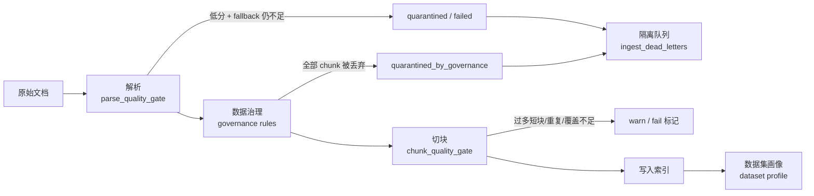
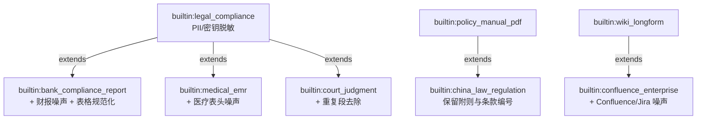
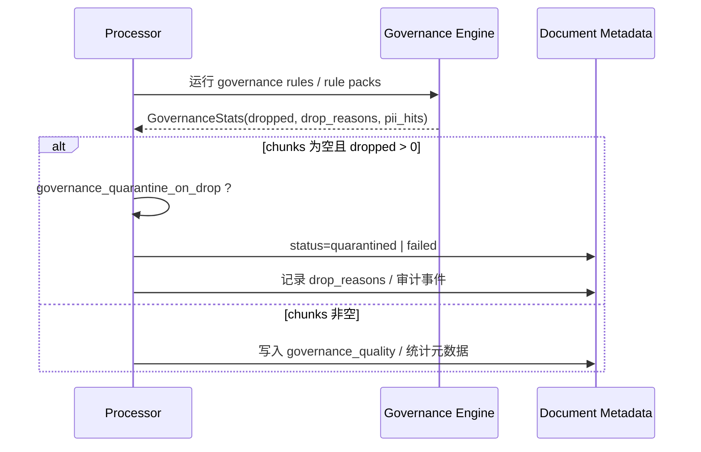

MimirQ 的"文档处理与知识入库"链路并非一次性解析入库，而是在**解析 → 数据治理 → 切块 → 入库**的每个阶段都设置了可观测、可干预的质量控制点。本文围绕两条主线展开：一是**治理预设（Governance Profiles）**——用声明式 JSON 统一管理清洗策略；二是**入库质量门禁（Quality Gates）**——在解析、治理、切块、写入前逐层把关；最后落到**数据治理画像（Dataset Profile）**——把分散在文档元数据中的质量信号聚合为数据集级健康视图。

Sources: [data-governance-profiles.md](docs/data-governance-profiles.md#L1-L9), [page.tsx](web/app/data-governance/page.tsx#L1-L6)

## 治理链路全景

治理与门禁贯穿入库的四个阶段，每层失败都有明确的处置路径（失败 / 隔离 / 继续）：

各门禁的判定产物（`parse_quality`、`governance_quality`、`chunk_quality_gate`、`governance_pii_hits` 等）最终都会写入文档 `doc_metadata`，成为数据集画像聚合的信号源——这是"画像"与"门禁"形成闭环的关键设计：门禁产生数据，画像消费数据，画像反过来指导门禁参数调整。

Sources: [processor.py](app/parsing/processors/processor.py#L1378-L1442), [processor.py](app/parsing/processors/processor.py#L1639-L1715), [dataset_profile_service.py](app/services/dataset_profile_service.py#L548-L565)

## 治理预设：声明式 JSON 脚本

治理预设的本质是一个**声明式 JSON 对象**，用于批量套用一组 `pipeline_patch` 管线选项、附加一组 Regex 清洗规则，并可选启用内置规则包（rule packs）。它**不允许**携带任何可执行代码，从设计上规避了上传脚本带来的 RCE 风险。

Sources: [data-governance-profiles.md](docs/data-governance-profiles.md#L1-L7)

### 数据模型与安全边界

自定义 Profile 存储在 `governance_profiles` 表中，以租户为隔离边界；内置预设（`builtin:*`）则常驻代码，不落库。`payload` 使用 JSONB 存储完整配置。

| 维度 | 约束 | 说明 |
|---|---|---|
| 文件大小 | ≤ 256KB | 服务端强校验 |
| 规则数量 | ≤ 60 | `MAX_PROFILE_RULES` |
| pattern 长度 | ≤ 600 | `MAX_PROFILE_RULE_PATTERN` |
| flags | 仅 IGNORECASE / MULTILINE / DOTALL | `DEFAULT_ALLOWED_FLAG_BITS` |
| 继承深度 | ≤ 12 层 | 解析器防环 |
| key 格式 | `[a-zA-Z0-9][a-zA-Z0-9_.:\-]{0,99}` | 且禁止 `builtin:` 前缀 |
| processing_scripts | ≤ 10 条 | 仅作模板展示，管道不执行 |

服务端在 `validate_and_normalize_payload` 中统一完成字段清洗：`input_formats` 只接受 `markdown` / `html`，正则规则会经过 `re.compile` 预编译验证，嵌套量词等灾难性回溯形态（如 `(.*)+`）会被拒绝。

Sources: [governance_profile.py](app/models/governance_profile.py#L21-L47), [governance_profiles.py](app/services/governance_profiles.py#L17-L20), [governance_profiles.py](app/services/governance_profiles.py#L59-L91), [data-governance-profiles.md](docs/data-governance-profiles.md#L57-L67)

### 内置预设矩阵

`get_builtin_governance_profiles()` 注册了约 26 个内置预设，按场景可分为六类。它们遵循"保守、安全默认"原则，通过 `governance_*` 开关组合出针对性清洗策略：

| 类别 | 典型预设 | 核心策略 |
|---|---|---|
| 通用 | `builtin:kb_default` | 去目录/噪声、合并软换行、去重页眉页脚 |
| 网页 | `builtin:html_web` | 样板移除、URL 去追踪参、段落去重（min_occurrences=3） |
| PDF | `builtin:pdf_text` / `builtin:pdf_scanned_ocr` | 断行修复、表格规范化；扫描件开启解析兜底 |
| 合规 | `builtin:legal_compliance` / `builtin:pii_secrets_quarantine` | PII 匿名化、密钥脱敏；命中即隔离 |
| 质量门禁 | `builtin:quality_gate_quarantine` | 大纲-only / 低密度过滤 → 隔离队列 |
| 行业 | `builtin:cn_a_share_annual_report` / `builtin:medical_emr` / `builtin:government_redhead` 等 | 财报噪声、PHI 脱敏、红头公文保留章节 |

内置预设之间还支持**继承（extends）**：`bank_compliance_report` 继承 `legal_compliance`、`china_law_regulation` 继承 `policy_manual_pdf`、`confluence_enterprise` 继承 `wiki_longform` 等，避免行业预设重复声明通用清洗逻辑。

Sources: [governance_profiles.py](app/services/governance_profiles.py#L118-L127), [governance_profiles.py](app/services/governance_profiles.py#L128-L207), [governance_profiles.py](app/services/governance_profiles.py#L227-L391), [governance_profiles.py](app/services/governance_profiles.py#L416-L608), [ingestion-policy.md](docs/ingestion-policy.md#L129-L156)

### 继承解析与生效策略

`resolve_profile_inheritance` 将继承链解析为"生效载荷"：`pipeline_patch` 按**父 → 子**顺序合并（子键覆盖父键），`regex_rules` 拼接（父在前、子在后），`input_formats` 按序去重取并集。解析器是纯函数，通过注入 `fetch_by_ref` 实现可单测；对循环引用与超深链直接抛错，避免死循环。

在入库侧，`ingestion_policy.py` 的 `resolve_governance_profile_ref` 进一步把解析结果转换为 `pipeline_patch` 与 `regex_rules` 两个生效产物，合并进实际执行的 PipelineOptions——Profile 本身不参与运行时，只负责产出配置。

Sources: [governance_profiles_resolver.py](app/services/governance_profiles_resolver.py#L59-L126), [ingestion_policy.py](app/services/ingestion_policy.py#L273-L294)

## 入库质量门禁

门禁分为四层，按执行顺序排列：**解析质量门禁 → 治理丢弃 → 切块质量门禁 → 入库前 POC 扫描**。前两层决定文档是否"进得来"，后两层决定内容是否"存得好"。

### 解析质量门禁（Parse Quality Gate）

`evaluate_parse_quality_gate` 综合解析分数、OCR 置信度、表格结构置信度、水印移除比例、阅读顺序稳定性等信号给出判定。默认阈值：解析分 ≥ 0.65 为通过、< 0.55 直接失败、OCR 置信度 ≥ 0.70、表格结构置信度 ≥ 0.60。

在 processor 中，该门禁**保守地限定在 PDF + auto 后端**场景：当 `parse_fallback_enabled` 开启且兜底后仍低于 `parse_fallback_min_content_chars` / `parse_fallback_min_parse_score` 时，文档被置为 `quarantined`（若 `governance_quarantine_on_drop`）或 `failed`，并写入 `error_message` 与审计日志，而不是把垃圾内容送进索引。

统一的解析质量分 `score_document_parse_quality` 是门禁的基础信号，它按信号可得性加权：PDF 分 + 文本密度 + 阅读顺序（0.6/0.25/0.15），并对替换字符（乱码强信号，最高 0.5 罚分）与印章置信度（最高 0.3 罚分）做惩罚修正。

Sources: [parse_quality_gate.py](app/parsing/processors/parse_quality_gate.py#L117-L130), [processor.py](app/parsing/processors/processor.py#L1378-L1442), [document_quality.py](app/parsing/quality/document_quality.py#L46-L120), [text_quality.py](app/parsing/quality/text_quality.py#L40-L59)

### 治理丢弃与隔离

治理阶段运行正则清洗 + 规则包后，若全部 chunk 被丢弃（如 `drop_outline_only` / `drop_low_density` 命中、PII/Secrets 超阈值），处理器依据 `governance_quarantine_on_drop` 决定终态：`quarantined_by_governance` 或 `filtered_by_governance`。`drop_reasons`、`pii_hits_total`、`secrets_hits_total` 会写入审计详情，便于人工复核后调整阈值。

同时，失败的入库任务会通过 `record_ingest_dead_letter` 进入持久化死信队列（`ingest_dead_letters`），错误码会被归一化（timeout / rate_limited / parse_failed 等别名映射），同一文档的重复失败复用 open 记录并递增 `retry_count`，保持隔离队列稳定。

Sources: [processor.py](app/parsing/processors/processor.py#L1639-L1715), [ingest_dead_letter.py](app/models/ingest_dead_letter.py#L11-L43), [ingest_dead_letter_service.py](app/services/ingest_dead_letter_service.py#L44-L120)

### 切块质量门禁（Chunk Quality Gate）

`compute_chunk_quality_gate` 是共享逻辑，同时服务切块预览 API、入库期审计元数据与离线评测。它基于切块统计产出三类产物：**gate**（pass / warn / fail + 原因条目）、**recommendations**（建议列表）、**patches**（可直接应用的参数补丁）。

| 信号 | 阈值 | 严重度 | 典型建议 |
|---|---|---|---|
| coverage_ratio < 0.90 | error | 内容可能被意外丢弃 | 检查 parser_backend 与治理设置 |
| 短块占比 > 0.60 | error | 碎片化严重 | 增大 chunk_size 或换结构感知策略 |
| 重复块占比 > 0.40 | error | 重复噪声 | 启用 `governance_drop_duplicate_paragraphs` |
| overlap waste > 0.60 | warning | 向量成本浪费 | 降低 chunk_overlap（附自动补丁） |
| 总块数 > 10,000 | warning | 延迟与成本风险 | 增大 chunk_size（附自动补丁） |

终态判定为：存在任一 error 原因 → `fail`；有 warning → `warn`；否则 `pass`。有意思的设计是 `patches` 会给出**可一键应用的参数建议**（如把 overlap 降到 chunk_size 的 15%），把门禁从"报错"升级为"给出修复动作"。此外还有逐 chunk 粒度的 `score_chunk_quality`（0-1 分 + good/ok/bad 分级），用于噪声/样板检测，可存入元数据供检索侧使用。

Sources: [chunk_quality_gate.py](app/services/chunk_quality_gate.py#L16-L34), [chunk_quality_gate.py](app/services/chunk_quality_gate.py#L107-L290), [chunk_quality_scoring.py](app/services/chunk_quality_scoring.py#L41-L67)

### 入库前 POC 扫描

`evaluate_ingest_pre_poc_quality_gate` 在正式入库前对文本类文件采样（默认 200KB），检测 PII 与密钥命中数。三种模式：`off` 完全跳过、`warn` 仅记录、`strict` 在 PII/密钥超阈值时**直接阻断**（`blocked=true`）。输出包含格式分布、长度分布与命中明细，供批量迁移前的健康评估使用。

Sources: [ingest_pre_poc_quality_gate.py](app/services/ingest_pre_poc_quality_gate.py#L29-L109)

## 数据治理画像：数据集级健康视图

画像系统由三条路径组成：**实时画像摘要**（轻量聚合元数据）、**深度扫描**（后台任务回填缺失指标）、**发现项下钻**（可操作的文档清单）。

### 实时画像与发现项

`compute_dataset_profile_summary` 在请求时对数据集内文档做快速聚合（3 秒进程内缓存），产出：状态/类型分布、文本长度/文件大小/页数/块数分位数（P25-P99）、语言桶、目录桶、质量桶（tiny / outline_heavy / low_density / mid_density / high_density）、解析后端分布与回退统计、PII/Secrets 命中总量。

画像的"体检报告"由 `FINDING_KEY_REASONS` 定义，共 14 类发现项，全部来自门禁写入的元数据：

| 发现项 | 严重度 | 信号来源 |
|---|---|---|
| parse_failed / preprocess_failed | error | 文档状态 |
| pdf_scanned / pdf_unknown | warning / info | pdf_quality 元数据 |
| low_density / parse_low_quality | warning | 文本密度 / 统一解析分 |
| pii / secrets | warning | governance_pii_hits / governance_secrets_hits |
| chunk_coverage_low / chunk_quality_fail | warning | chunk_coverage / chunk_quality_gate |
| seal_low_confidence | warning | seal_summary 印章置信度 |
| image_heavy / near_dedup / exact_dup | info | 图片数 / near_dedup / file_sha256 |

所有聚合遵循**文档级 ACL 安全裁剪**：查询先校验数据集可读，再叠加 DocumentPermission / TenantGroupMember 权限过滤，保证画像视图不会泄露越权文档的统计信息。

Sources: [dataset_profile_service.py](app/services/dataset_profile_service.py#L66-L145), [dataset_profile_service.py](app/services/dataset_profile_service.py#L376-L549), [dataset_profile_service.py](app/services/dataset_profile_service.py#L308-L373), [dataset_profile_utils.py](app/services/dataset_profile_utils.py#L91-L120)

### 深度扫描与 API 面

深度扫描（`DatasetProfileScanRun`，kind=deep）作为后台任务回填缺失指标：统一解析质量分、稳定 page_count、文件 SHA256、切块长度/Token 直方图等。同一数据集仅允许一个 pending/running 扫描（部分唯一索引保证），避免并发扫描放大资源消耗。

| API | 用途 |
|---|---|
| `GET /{dataset_id}/profile/summary` | 实时画像摘要 |
| `GET /{dataset_id}/health` | 健康仪表盘（复用摘要 + 入库状态汇总） |
| `GET /{dataset_id}/profile/findings/{finding_key}` | 发现项下钻文档清单 |
| `GET /{dataset_id}/profile/buckets/documents` | 按维度/桶列出文档（支持内容预览） |
| `POST /{dataset_id}/profile/scan-runs` | 创建深度扫描（409 若已有活跃扫描） |

Sources: [dataset_profile_scan.py](app/models/dataset_profile_scan.py#L19-L67), [datasets.py](app/api/v1/datasets.py#L2268-L2430), [dataset_profile_scan_runner.py](app/services/dataset_profile_scan_runner.py#L1-L9)

### 前端工作台

前端"数据治理"页面（`web/app/data-governance`）把整条链路可视化：`data-cleaner`（智能清洗）、`data-classifier`（分类）、`data-annotator`（标注）、`quality-checker`（质量检查）四个组件对应治理工作台的核心功能区；`governance-profiles` 目录承载预设的浏览、导入导出与编辑器；`governance-common-lines`（重复行学习）从既有文档中挖掘样板行，供用户沉淀为新的清洗规则。治理预设支持在**数据治理工作台**与**数据集默认管线**两处应用。

Sources: [data-governance-profiles.md](docs/data-governance-profiles.md#L136-L145), [page.tsx](web/app/data-governance/page.tsx#L1-L30)

## 小结：闭环的治理体系

MimirQ 的治理体系可以概括为一句：**门禁产生可审计的质量数据，画像消费这些数据形成决策依据，预设把决策沉淀为可复用的声明式配置**。`governance_profiles` 表存自定义预设、`builtin:*` 代码内建预设、继承解析器把两者统一为生效配置；解析/治理/切块三层门禁各自产出结构化元数据；画像服务聚合这些元数据为数据集健康视图与发现项清单，最终反哺预设调优——形成可持续迭代的治理闭环。

## 继续阅读

- 治理预设的完整字段说明与安全限制：[数据治理画像与入库质量门禁](12-shu-ju-zhi-li-hua-xiang-yu-ru-ku-zhi-liang-men-jin)（本文）
- 规则包（rule packs）的完整清单与启用方式：[数据治理画像与入库质量门禁](12-shu-ju-zhi-li-hua-xiang-yu-ru-ku-zhi-liang-men-jin)
- 前置的解析与切块环节：[解析后端与文档处理流水线](9-jie-xi-hou-duan-yu-wen-dang-chu-li-liu-shui-xian)、[切块策略与索引构建](10-qie-kuai-ce-lue-yu-suo-yin-gou-jian)
- 质量门禁在评测与发布链路的延伸：[评测体系：指标、题集与 RAGAS](18-ping-ce-ti-xi-zhi-biao-ti-ji-yu-ragas)、[回归门禁与发布质量卡口](19-hui-gui-men-jin-yu-fa-bu-zhi-liang-qia-kou)
- 治理可视化前端：[文档查看、图谱与治理可视化](23-wen-dang-cha-kan-tu-pu-yu-zhi-li-ke-shi-hua)