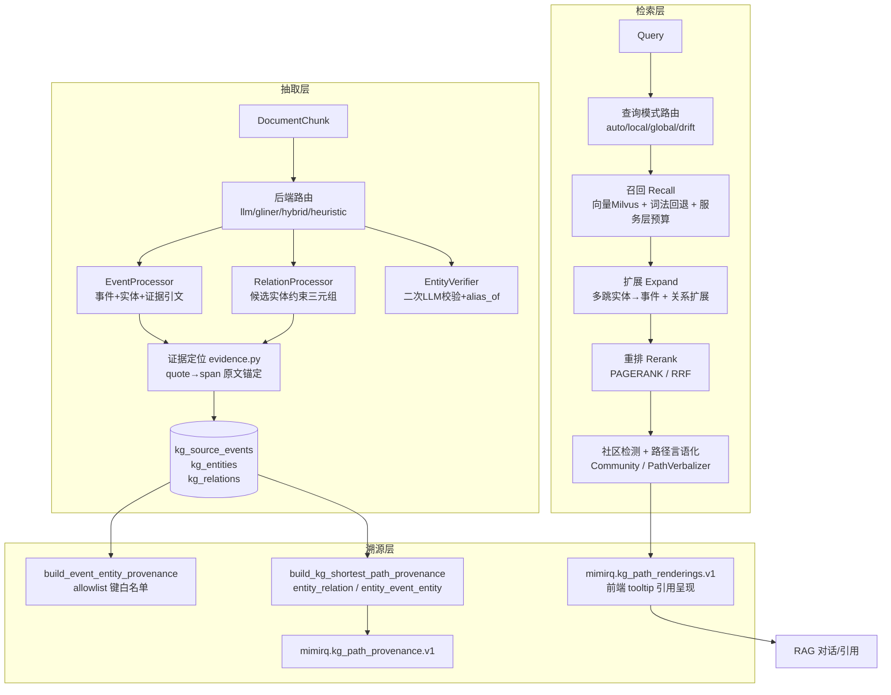

MimirQ 的知识图谱（KG）子系统是一个以**事件（Event）—实体（Entity）**为核心结构的可插拔模块，由 `KG_ENABLED` 统一开关控制。它覆盖三条完整链路：**抽取**（从文档切块中经 LLM 提取结构化事件与三元组）、**检索**（召回→扩展→重排三段式图谱搜索，含 local/global/drift 查询模式路由）、**溯源**（将每条图谱边锚定到原文证据，并为 RAG 引用生成 PII 安全的路径载荷）。入口是统一的 `KGEngine` 门面，组合 `EventExtractor`（抽取）与 `KGSearcher`（检索）两个组件，架构上刻意保持模块自洽、可通过配置项独立启停。

Sources: [engine/core.py](app/rag/kg/engine/core.py#L1-L93), [pipeline.py](app/rag/kg/pipeline.py#L1-L160), [models.py](app/rag/kg/models.py#L26-L200)

## 抽取：从切块到结构化事件与三元组

抽取层将非结构化文本转化为三类图数据：**源事件**（`KgSourceEvent`，含 title/summary/content 与向量）、**实体**（`KgEntity`，含 name/type/normalized_name 与向量）、**关系**（`KgRelation`，subject→predicate→object 三元组，携带 confidence、qualifiers、references）。事件与实体之间通过 `KgEventEntity` 联结表承载 weight 与 role。所有表均以 `tenant_id` 隔离，关系与事件通过 `document_id`/`chunk_id`/`event_id` 三重外键锚定来源，`pipeline_hash` 字段则用于版本化隔离（见下文）。这一模型在迁移 `0002_add_kg_relations` 中落地，并为每条关系建立了 subject/object/predicate 索引以支撑图谱搜索。

### 抽取后端路由与降级链

`resolve_extraction_backend` 支持四种后端：`llm`（默认，结构化 JSON Schema 输出）、`gliner`（本地 GLiNER 序列标注）、`hybrid`（GLiNER 粗筛 + LLM 精修）、`heuristic`（无 LLM 的启发式抽取，用于超长文档预算控制）。降级是显式且可观测的：请求 gliner/hybrid 但 `KG_GLINER_ENABLED=false` 或依赖缺失时，记录 `fallback_reason` 并回退到 LLM。此外，当文档切块数达到 `KG_EXTRACT_LONG_DOC_MIN_CHUNKS`（默认 300）时，自动切换到 `KG_EXTRACT_LONG_DOC_BACKEND`（默认 heuristic），避免超长文档耗尽 LLM 预算。

Sources: [backend_router.py](app/rag/kg/extraction/backend_router.py#L1-L60), [extractor.py](app/rag/kg/extraction/extractor.py#L580-L640), [config.py](app/core/config.py#L2139-L2153)

### 事件抽取：证据优先的 JSON Schema 约束

`EventProcessor.extract_from_sections` 是核心抽取逻辑：将目标切块与至多 20 个上下文切块拼接，通过 `chat_with_schema` 强制 LLM 输出符合 JSON Schema 的事件数组。每条事件包含 title、summary 与实体列表；每个实体必须附带 `evidence_quote`（**原文逐字引用的证据句**）与 `source_span`（source + start_char + end_char 的字符区间）。Prompt 明确要求"evidence_quote MUST be copied verbatim (no paraphrase)"——这是整个溯源体系的第一层锚点：没有证据引文，实体边就无法落库。抽取采用 `temperature=0.2` 的低随机性，并通过 `asyncio.Semaphore` 控制并发（默认 3），支持每切块超时与重试。

Sources: [processor.py](app/rag/kg/extraction/processor.py#L20-L130), [extractor.py](app/rag/kg/extraction/extractor.py#L640-L700)

### 关系抽取：候选约束 + 谓词归一化

关系抽取的设计目标是**降低幻觉**：`RelationProcessor` 不开放生成实体，而是将已抽取实体以稳定本地 ID（E1、E2…）构建候选表注入 prompt，强制 subject_id/object_id 必须选自候选集，从源头杜绝虚构节点。谓词层实现两级归一化：`_normalize_predicate_key` 将 "Works With"→"works_with" 等表面形式规整为 snake_case；`normalize_predicate` 再做同义词映射（works_at→works_for、located_at→located_in、aka/简称→alias_of），使存储本体保持紧凑。若谓词不在允许列表（本体论 allowlist）内，则降级为 "unknown" 并保留 `predicate_raw` 原始值供审计。每条关系同样强制 `evidence_quote` 必须同时覆盖 subject 与 object 表面形式。

Sources: [relation_processor.py](app/rag/kg/extraction/relation_processor.py#L1-L266)

### 本体论治理与二次校验

谓词允许列表采用 **DB 治理优先**的三级优先级：`kg_predicate_ontology` 表中租户启用的谓词 > 配置 `KG_RELATION_ALLOWED_PREDICATES` > 抽取器内置默认。设计刻意 **fail-open**：DB 表读取失败时返回空列表并回退，保证向后兼容的抽取行为不因治理表异常而中断。抽取完成后可选的 `EntityVerifier` 是第二个 LLM 校验 pass，用于剔除噪声实体（提升 precision）、修正类型/描述，并在候选之间生成 `alias_of` 边以减少实体碎片化——所有输出仍受调用方确定性证据检查门控。

Sources: [ontology.py](app/rag/kg/ontology.py#L1-L76), [entity_verifier.py](app/rag/kg/extraction/entity_verifier.py#L1-L100), [models.py](app/rag/kg/models.py#L185-L230)

### 证据定位与增量抽取

证据模块 `evidence.py` 是"原文锚定"的确定性实现：`find_evidence_span` 依次尝试精确子串匹配 → 空白弹性正则匹配 → ASCII 大小写不敏感回退，找到后将 span 扩展到句边界形成可读证据窗口，并标记证据来源（`quote`=显式引文 / `mention`=提及扩展）。抽取管道支持增量语义：`KG_EXTRACT_SKIP_UNCHANGED_CHUNKS` 开启时，以 `content_hash` + prompt 选择器（template_id/key/ab_experiment）双重指纹判断切块是否未变，未变则直接复用既有事件，避免重复调用 LLM。`replace_existing` 与 `prune_orphan_entities` 默认开启，保证重复抽取不产生重复边、删除事件后不残留无关联实体。

Sources: [evidence.py](app/rag/kg/extraction/evidence.py#L1-L100), [extractor.py](app/rag/kg/extraction/extractor.py#L216-L243), [config.py](app/core/config.py#L2166-L2204)

## 检索：召回 → 扩展 → 重排 三段式图谱搜索

`KGSearcher.search` 是统一入口，内部按 **recall → expand → rerank** 严格三段执行，全程记录耗时与 SLO 指标，并支持全局超时（`KG_SEARCH_TIMEOUT_SEC`）与扩展预算（`KG_SEARCH_EXPAND_BUDGET_SEC`）。返回结构包含 events（已渲染路径）、entities、clues（推理线索）、stats（含 query_mode 决策与 timing）与可选的 community_reports。

Sources: [searcher.py](app/rag/kg/search/searcher.py#L145-L478), [config.py](app/core/config.py#L2251-L2256)

### 查询模式路由：local / global / drift

`query_mode.py` 是确定性分类器（非 LLM），通过三组正则识别查询意图：`drift`（变化/趋势/同比/环比/versus）、`global`（总体/全局/汇总/overview/distribution）、`local`（具体/主键/这一条/exact/id=）。每种模式施加**差异化预算**：local 收紧事件上限（40）并提高实体权重阈值（+0.05 bonus）以聚焦精确记录；global 扩大覆盖（最少 120 事件、40 实体）；drift 进一步扩大（最少 140 事件）以降低漏召回。数据集级搜索无 document_ids 时，若查询呈事实型（which/what/who…）则归类为 `dataset_factoid_scope` 的 local 模式——这是知识库问答（如 Dify 外部知识）的典型形态。模式决策随响应返回 `query.mode / reason_codes / confidence`，供诊断与回归门禁使用。

Sources: [query_mode.py](app/rag/kg/search/query_mode.py#L1-L140), [config.py](app/core/config.py#L2270-L2277)

### 召回：向量为主、词法回退、服务层预算

`RecallSearcher` 组装多路召回：实体与事件向量存于 Milvus（`kg_entities`/`kg_events` 集合），`EntityRepository.search_similar` 按租户表达式过滤并返回相似度；无向量环境降级到 `search_lexical`——DB 词法查询，**只返回查询词中出现的实体名**，且先施加 dataset/document 作用域再打分，保守且防漂移。召回结果随后经过**服务层预算**（`apply_serving_layer_budget`）：按 score 排序后，每个 chunk 最多保留 `KG_SEARCH_SERVING_MAX_EVENTS_PER_CHUNK`（2）条、每个文档最多 80 条、低于 `min_score` 丢弃——这是防止单个长文档或噪声切块主导正常 RAG 延迟的关键节制器。drift 模式与 global/drift 模式码会旁路该预算以保覆盖。数据集级搜索强制要求 `account_id`，通过 `_allowed_document_ids_for_dataset` 做文档级 ACL 裁剪后才进入召回。

Sources: [recall.py](app/rag/kg/search/recall.py#L1-L140), [repository.py](app/rag/kg/repository.py#L457-L590), [config.py](app/core/config.py#L2280-L2284)

### 扩展：多跳邻居与关系边扩散

`ExpandSearcher._expand_sync` 实现多跳扩展：从召回的关键实体出发，逐跳抓取关联事件与邻居实体，跳数上限 `max_hops`（默认 2），每跳事件上限 60。关系扩展（`relation_expansion_enabled`）通过 `RelationRepository.list_relations_for_entities` 拉取种子实体的关系边，施加置信度下限（`min_confidence`，默认 0.5）、邻居数上限（20）、边数上限（500），邻居权重按 `NEIGHBOR_WEIGHT_FACTOR`（0.7）衰减，并基于置信度分桶（low<0.4 / mid<0.7 / high）调节。扩展结果携带 `event_hops`（每事件的跳数估计）作为下游重排信号——跳数越少通常越相关。显式空文档作用域绝不放宽到租户级全图搜索（返回空结果），防止越权。

Sources: [expand.py](app/rag/kg/search/expand.py#L1-L150), [config.py](app/core/config.py#L2317-L2331)

### 重排：个性化 PageRank 与 RRF

重排策略二选一：`PAGERANK`（默认）基于事件-实体二分图运行**个性化 PageRank**——以召回实体权重为个性化向量，幂迭代（damping 0.85，最多 50 轮）后按 `0.7×PPR + 0.3×个性化分数` 混合排序；`RRF`（Reciprocal Rank Fusion，k=60）则用于 dataset_factoid 局部场景。`_effective_rerank_strategy` 根据 query_mode 决策动态切换。扩展阶段可被跳过（如 local_factoid 精确性优先、低置信度 global 预算控制、recall 预算耗尽），跳过的原因记录到 stats 供回归分析。

Sources: [config.py](app/rag/kg/search/config.py#L1-L89), [pprank.py](app/rag/kg/search/pprank.py#L1-L126), [searcher.py](app/rag/kg/search/searcher.py#L210-L260)

### 社区检测与全局摘要（GraphRAG 风格）

社区检测是特性开关默认关闭的"global search"增强：`community.py` 在**查询的召回子图**上构建实体共现图（边权=共享事件数，`min_edge_weight` 默认 2），运行标签传播（25 轮）划分至多 12 个社区，为每个社区生成报告并为全部事件生成全局摘要（上限 3200 字符）。设计约束刻意与重型图算法（networkx/igraph）解耦：零外部依赖、确定性排序、仅作用于召回子图以控制延迟并规避 ACL/版本化陷阱。可选的 `_apply_lazy_community_summaries` 按查询对 Top-3 社区做查询感知摘要，带 TTL 缓存（默认 24h）。高级检索算法家族还包括：`agentic_beam_search`（带预算的束搜索）、`drift_search`（token 级社区报告打分）、`subqrag`（子查询规划）、`graph_embeddings`（WalkHash 类 node2vec 图嵌入召回）与 `snapshot_router`（时间快照路由），由 `method_router` 依据复杂度分类器与 KG 模式选择。

Sources: [community.py](app/rag/kg/community.py#L1-L120), [searcher.py](app/rag/kg/search/searcher.py#L310-L420), [method_router.py](app/rag/kg/search/method_router.py#L1-L34), [config.py](app/core/config.py#L2290-L2308)

## 溯源：从证据引文到引用路径

溯源是 MimirQ KG 区别于纯图谱存储的核心价值，分三层实现：**证据锚定**（抽取期）、**路径载荷**（检索期）、**前端呈现**（展示期）。

### 证据锚定：allowlist 键白名单

`provenance.py` 刻意保持轻依赖，供索引层与 API 层共用。`build_event_entity_provenance` 为每条 event→entity 边生成 JSON 安全的溯源字典，仅允许 9 个白名单键（document_id、chunk_id、chunk_index、page、start_char、end_char、content_len、chunk_key、content_hash、source），UUID 统一字符串化、字符串截断到 200 字符——**不泄露任意嵌套内容**。证据来源（quote/mention）与字符区间最终持久化于 `kg_event_entities.extra_data` 与 `kg_relations.references`。

Sources: [provenance.py](app/rag/kg/provenance.py#L1-L80), [evidence.py](app/rag/kg/extraction/evidence.py#L10-L30)

### 路径载荷：最短路径溯源

`build_kg_shortest_path_provenance` 为每个证据事件生成 `mimirq.kg_path_provenance.v1` 载荷，连接两个关键实体，取两种形态之一：**entity_relation**（1 跳，直接关系边，含 relation_id、predicate、confidence_bucket、evidence_source 与 doc/chunk/event 引用）或 **entity_event_entity**（2 跳，共享事件桥接，含两段 event_entity 边）。设计上节点**只含 entity_id 与 type，不含 name/description**——测试明确断言 `name: "Secret Tool Name"` 不会出现在输出中，防止文档文本经图谱路径泄露。排序确定（type, entity_id）保证跨运行 diff 稳定，长度受 `max_entities` 上界约束。置信度分桶（<0.4 low / <0.7 mid / ≥0.7 high）为下游提供粗粒度的可信度信号。

Sources: [provenance.py](app/rag/kg/provenance.py#L130-L367), [test_kg_shortest_path_provenance.py](tests/test_kg_shortest_path_provenance.py#L1-L105), [test_kg_path_provenance.py](tests/test_kg_path_provenance.py#L1-L32)

### 引用呈现：路径言语化

检索末端 `path_verbalizer.py` 将图路径转化为人类可读的 `mimirq.kg_path_renderings.v1`：`path_string`（"实体A [Type] -> 实体B [Type] -> 事件标题"）、`verbalized_triples`（"X (Type) contributes evidence for event…"）、`graph_prompt`（供 LLM 引用的节点/边 JSON）与 `reasoning_chain`（查询→路径→事件摘要的推理链）。匹配的社区摘要可附加为 `community_context`。前端 `graph-provenance.ts` 进一步将三类边（`entity_relation` 三元组、`event_entity` 证据、`entity_entity` 共现）渲染为 tooltip，展示置信度、document/event/chunk 短 ID、chunk_index、页码与 content_hash，全部经 HTML 转义防注入。

Sources: [path_verbalizer.py](app/rag/kg/search/path_verbalizer.py#L1-L199), [graph-provenance.ts](web/lib/graph-provenance.ts#L1-L124)

### 版本快照与差异审计

KG 支持对同一文档在不同 `pipeline_hash`（解析/切块/治理配置版本）下的图谱做快照与 diff：`snapshot.py` 定义 `mimirq.kg_snapshot.v2` / `mimirq.kg_snapshot_diff.v2` 结构，以 `canonical_json_hash`（sha256 规范序列化）做内容寻址，按 id 对齐后输出新增/删除/变更记录（样本上限 200）。这为解析器升级、切块策略调整的图谱影响评估提供了确定性的回归基线。API 层提供 `GET /kg/snapshots/export`、`POST /kg/snapshots/diff`、`GET /kg/snapshots/compare` 端点。

Sources: [snapshot.py](app/rag/kg/snapshot.py#L1-L100), [routes.py](app/rag/kg/api/routes.py#L1050-L1112)

## 关键配置总览

| 配置项 | 默认值 | 作用域 |
|---|---|---|
| `KG_ENABLED` / `KG_CHAT_ENABLED` | false | 总开关与对话注入开关 |
| `KG_RELATION_ENABLED` / `KG_SKILL_ENABLED` | false | 三元组与技能边抽取开关 |
| `KG_EXTRACTION_BACKEND` | llm | 抽取后端：llm/gliner/hybrid/heuristic |
| `KG_EXTRACT_EVIDENCE_REQUIRED` | true | 无原文证据引文不落库 |
| `KG_EXTRACT_ENTITY_VERIFY_ENABLED` | false | 二次 LLM 实体验证 |
| `KG_EXTRACT_MAX_CONCURRENCY` | 3 | 抽取并发上限 |
| `KG_EXTRACT_MAX_CHUNKS_PER_DOCUMENT` | 120 | 每文档切块预算（uniform 策略） |
| `KG_SEARCH_QUERY_MODE_DEFAULT` | auto | 查询模式默认值 |
| `KG_SEARCH_RELATION_EXPANSION_ENABLED` | false | 关系边多跳扩展开关 |
| `KG_SEARCH_SERVING_MAX_EVENTS_PER_CHUNK` | 2 | 每切块事件上限（延迟节制） |
| `KG_COMMUNITY_ENABLED` | false | 社区检测/全局摘要开关 |
| `KG_SEARCH_GRAPH_EMBEDDINGS_ENABLED` | false | WalkHash 图嵌入召回开关 |
| `KG_SEARCH_RELATION_CONF_BUCKET_*` | 0.4 / 0.7 | 置信度分桶阈值 |

Sources: [config.py](app/core/config.py#L2120-L2331)

## API 端点摘要

| 端点 | 用途 |
|---|---|
| `POST /kg/documents/{document_id}/extract` | 触发抽取（async 入队 / sync 直跑，支持 pipeline_hash 版本指定） |
| `GET /kg/graph` / `GET /kg/graph/expand` / `GET /kg/graph/search` | 图谱投影、邻居扩展、节点搜索 |
| `POST /kg/search` | 三段式图谱搜索（事件列表 + entities + clues + stats） |
| `GET /kg/events/{event_id}` / `GET /kg/entities/{entity_id}` | 事件/实体详情（受文档权限约束） |
| `POST /kg/entities/merge` / `POST /kg/entities/split` | 实体解析治理（合并/拆分，带追加式审计日志） |
| `POST /kg/imports` / `GET /kg/imports/preview` | 治理式外部图谱导入与预览 |
| `GET /kg/snapshots/export` / `POST /kg/snapshots/diff` | 版本快照导出与差异审计 |
| `GET /kg/graph/export` | GraphML 导出（支持 gzip） |

搜索端点强制语义：显式 document_ids 必须通过 ACL 过滤（无权限文档直接返回 `no_accessible_documents`）；dataset 级搜索需 `account_id` 并通过 `assert_dataset_readable`；租户不匹配返回 400、超时返回 504。实体合并操作受 `KgEntityResolutionAction` 追加式日志保护，支持 undo 回滚。

Sources: [routes.py](app/rag/kg/api/routes.py#L2488-L2549), [routes.py](app/rag/kg/api/routes.py#L737-L760), [models.py](app/rag/kg/models.py#L200-L273)

## 设计要点与阅读建议

KG 子系统的架构精髓可概括为三点：**证据优先**（每一条边必须有原文引文锚点，否则不落库，从源头抑制幻觉边与检索漂移）、**预算治理**（抽取期每文档切块预算、检索期服务层每切块/文档事件上限、扩展期置信度与邻居上限，三重节制保证图谱不拖垮 RAG 延迟）、**PII 安全溯源**（路径载荷只含 ID 与类型，名称/描述永不外泄，键白名单 + 确定性排序 + 长度上界）。若需继续深入，建议按以下顺序阅读关联页面：

- 检索结果如何注入对话与引用呈现，见 [引用、证据与可解释性机制](17-yin-yong-zheng-ju-yu-ke-jie-shi-xing-ji-zhi)
- 图谱搜索与混合检索的融合关系，见 [混合检索与多路融合排序](14-hun-he-jian-suo-yu-duo-lu-rong-he-pai-xu)
- 抽取结果如何随解析/切块流水线联动，见 [解析后端与文档处理流水线](9-jie-xi-hou-duan-yu-wen-dang-chu-li-liu-shui-xian)
- 图谱前端可视化与治理界面，见 [文档查看、图谱与治理可视化](23-wen-dang-cha-kan-tu-pu-yu-zhi-li-ke-shi-hua)
- KG 检索质量的回归门禁，见 [回归门禁与发布质量卡口](19-hui-gui-men-jin-yu-fa-bu-zhi-liang-qia-kou)