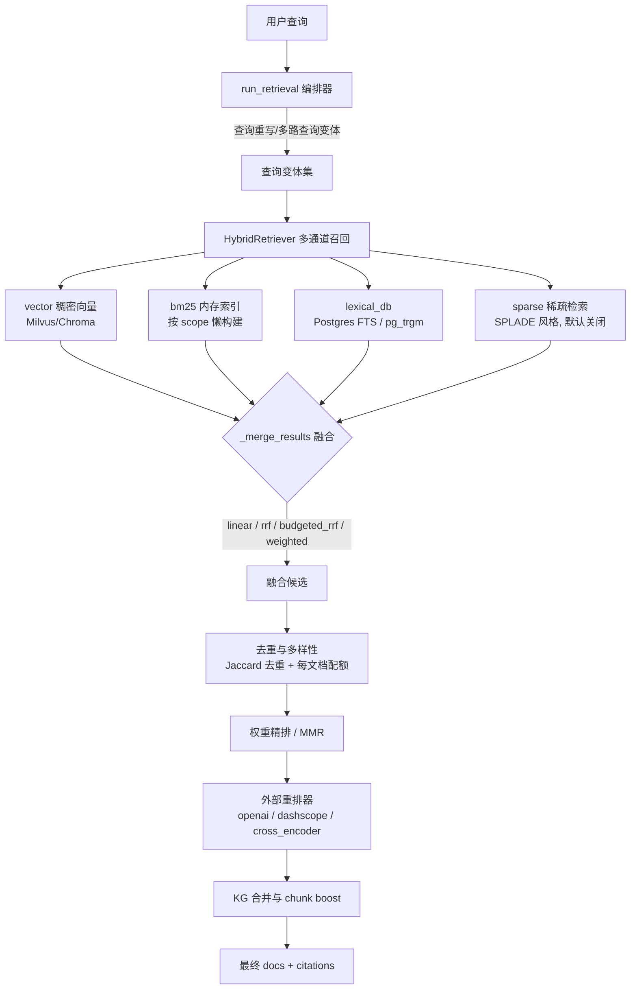
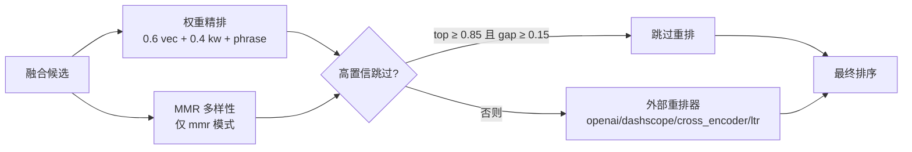

MimirQ 的检索层以「多路召回 → 通道融合 → 去重与多样性控制 → 精排」为骨架，将稠密向量、词法 BM25、数据库词法检索、可选的稀疏语义检索以及知识图谱信号统一收敛为一份可观测、可回放的候选排序。本页聚焦于 `HybridRetriever` 与检索编排器的融合机制：四种通道级融合策略的数学语义、融合后的精排信号、去重约束，以及编排层的查询变体 RRF 与 KG 提升。重排器体系的完整细节见 [重排器体系与 LTR 排序学习](15-zhong-pai-qi-ti-xi-yu-ltr-pai-xu-xue-xi)，知识图谱检索见 [知识图谱：抽取、检索与溯源](13-zhi-shi-tu-pu-chou-qu-jian-suo-yu-su-yuan)。

## 检索管线总览

整条检索链路分为两层：`HybridRetriever` 负责通道级召回与融合，`run_retrieval` 编排器负责在更高维度组织查询变体、KG 注入与最终精排。`HybridRetriever` 通过 mixin 组合了 BM25 索引、去重多样性、融合、词法 DB、后处理、稀疏索引与 ColBERT 索引七类能力，其类级默认参数直接映射 `app/core/config.py` 中的全局配置（如 `k=5`、`alpha=0.6`、`fusion_strategy="budgeted_rrf"`）。



Sources: [retriever.py](app/rag/retriever.py#L207-L330)、[config.py](app/core/config.py#L1131-L1141)、[orchestrator.py](app/rag/retrieval/orchestrator.py#L602-L620)

## 多路召回通道

`_hybrid_search_impl` 是通道编排的核心：每个通道独立执行、独立计时、独立记录成功/失败状态，任意通道异常不会中断整体检索，最终通过 `channel_metrics` 将降级原因暴露到调试与监控链路。通道的启停由 `retrieval_mode`（`hybrid | vector | keyword | mmr`）与各通道开关共同决定，候选量按 `fetch_k = top_k * 2`（MMR 模式下为 `top_k * mmr_fetch_k_multiplier`）过采样，为后续去重与重排预留余量。

| 通道 | 实现载体 | 默认状态 | 典型优势 |
|---|---|---|---|
| `vector` | Milvus/Chroma 稠密检索，支持多运行时分片 | 开 | 语义相似、同义改写 |
| `bm25` | 内存 BM25 索引，按租户/scope 懒构建 + LRU 淘汰 | 开 | 关键词精确命中 |
| `lexical_db` | Postgres FTS / pg_trgm 持久化检索 | 混合模式下仅作回退 | 代码、编号、精确短语 |
| `sparse` | SPLADE 风格稀疏向量（`deterministic` 或 `splade` provider） | 关（`SPARSE_RETRIEVAL_ENABLED=False`） | 词项扩展 / 语义词法 |
| `colbert` | ColBERT ANN 晚交互检索 | 关，仅向量通道空结果时兜底 | 多向量表示 |
| `colpali` | ColPali 视觉检索，按查询模态路由 | 关 | 图片类查询 |

一个值得注意的工程决策是 `lexical_db` 的定位：混合模式下它默认作为「召回安全网」而非并行通道，仅当主通道（vector + bm25）候选数不足 `top_k`、或查询形似元数据锚点（如 CJK 元数据精确匹配）时才触发，避免在大数据集上为每条查询承担 pg_trgm 的固定开销。sparse 通道与 colbert 通道的索引均支持持久化与增量 upsert，且通过 corpus fingerprint 判断是否需要重建。

Sources: [retriever.py](app/rag/retriever.py#L1111-L1260)、[retriever.py](app/rag/retriever.py#L1626-L1820)、[config.py](app/core/config.py#L1301-L1309)、[sparse_index.py](app/rag/retrieval/hybrid/sparse_index.py#L191-L254)

## 通道级融合策略

所有通道结果汇入 `FusionMixin._merge_results`，其执行序为：先对每个通道做 min-max 归一化（并在此阶段附加 field-aware boost 与 chunk 类型 boost），再按 `fusion_strategy` 分派到四种融合算法。归一化以通道内 `(score - min) / (max - min)` 将原始分数映射到 `[0,1]`，跨通道分数因此可比——这是 `linear` 与 `weighted` 的前提。融合后统一执行 metadata 合并（多通道命中间取并集、空值补全）与精确短语 boost。

```mermaid
flowchart LR
    subgraph 归一化
        N1[vector min-max]
        N2[bm25 min-max]
        N3[lexical min-max]
        N4[sparse min-max]
    end
    N1 --> STRAT{融合策略}
    N2 --> STRAT
    N3 --> STRAT
    N4 --> STRAT
    STRAT -->|linear| L[alpha*vec + (1-alpha)*max(keyword)]
    STRAT -->|rrf| R[Σ 1/(k + rank_ch)]
    STRAT -->|budgeted_rrf| B[RRF 打分 + 前缀配额]
    STRAT -->|weighted| W[Σ w_ch * norm_score_ch]
```

| 策略 | 融合公式 | 适用场景 | 可观测字段 |
|---|---|---|---|
| `linear` | `alpha·v + (1−alpha)·max(b, l, s)` | 分数已校准的基线 | `vector_score`、`bm25_score` |
| `rrf` | `Σ 1/(k + rank_ch)`，k 默认 60，输出 min-max 归一 | 各通道分数尺度差异大 | `rrf_score_raw`、`rrf_rank_*` |
| `budgeted_rrf`（默认） | RRF 打分 + 可见 top-k 前缀内强制跨通道配额 | 证据检索需要跨通道覆盖 | 额外 `*_rank_score`、`fusion_budgeted_prefix_rank` |
| `weighted` | `Σ w_ch·norm_score_ch`，权重归一化，缺省回退 linear | 显式通道权重调优 | `fusion_weighted.weights` + 权重 hash |

**RRF 与预算化 RRF**：`rrf` 将每个通道的候选按分数降序转换为名次，`1/(k+rank)` 累加得到融合分，随后 min-max 归一化。`budgeted_rrf` 在其上增加了一层配额控制：按 `fusion_budgets`（默认 `vector≈50%`、bm25/lexical 平分剩余、sparse=0）从各通道按名次挑选候选填入 top-k 前缀——已被其他通道选中的候选会跳过（配额不浪费在重复项上），`fusion_min_scores` 则用 `1/rank` 作为该通道的准入阈值，把低置信度的尾部候选挡在前缀之外。测试用例验证了配额语义：`top_k=4` 时默认配额 vector=2/bm25=1/lexical=1，d2 同时出现在 vector 与 bm25 中，bm25 槽位会跳过它改选 d4，保证前缀内四个候选来自三个不同通道。前缀内仍按融合分排序，未选中的剩余候选追加在后。

**加权融合与离线学习**：`weighted` 要求显式 `fusion_weights`，权重缺失或非法时安全回退为 `linear`。权重可通过 `scripts/learn_fusion_weights_offline.py` 离线网格搜索（目标如 MRR），再用 `scripts/apply_fusion_weights_to_dataset.py` 持久化到 `datasets.metadata.rag_defaults`，实现「离线学习、线上套用、可回滚」的闭环。

Sources: [fusion.py](app/rag/retrieval/hybrid/fusion.py#L20-L120)、[fusion.py](app/rag/retrieval/hybrid/fusion.py#L222-L380)、[fusion.py](app/rag/retrieval/hybrid/fusion.py#L400-L620)、[fusion.py](app/rag/retrieval/hybrid/fusion.py#L620-L800)、[test_retrieval_fusion_budgeted_rrf.py](tests/test_retrieval_fusion_budgeted_rrf.py#L22-L70)、[retrieval_fusion.md](docs/guides/retrieval_fusion.md#L30-L130)

## 融合后的精排信号

融合排序并非终点。`_merge_results` 之后，检索器依次叠加三类「不改变候选集合、只调整排序」的信号，使精确匹配的候选在语义相似但未命中关键词的候选之上：

- **精确短语 boost**：`query_phrase_match` 计算查询与内容的短语匹配度，`score = min(1.0, current + phrase_score × 0.35)`，`RETRIEVAL_EXACT_PHRASE_RERANK_BOOST` 控制力度；命中片段写入 `exact_phrase_matches`（最多 4 条）供可解释性展示。
- **元数据锚点匹配**：查询若命中 chunk 元数据视图（`evaluable`/`display`/`indexed`）中的字段值，生成 `metadata_exact_match_score` 并提升排序；该信号专门服务「查询即业务编号/条款号」的证据类场景。
- **field-aware 与 chunk 类型 boost**：向量通道内，来自标题/标题级辅助 embedding 的候选获得 `RETRIEVAL_FIELD_AWARE_TITLE_BOOST`（默认 0.08）等增量；查询含「表格/公式/代码」等信号时，对应 chunk 类型获得 `RETRIEVAL_CHUNK_TYPE_MATCH_BOOST`（默认 0.08）。两者默认关闭，属于检索画像可选的召回增强。

上述信号统一注入 `_last_channel_metrics` 供调试端点与 trace 消费，且刻意只记录低基数数值（如 boost 统计、信号分布），不携带查询文本，符合 PII 最小化原则。

Sources: [common.py](app/rag/retrieval/hybrid/common.py#L270-L318)、[fusion.py](app/rag/retrieval/hybrid/fusion.py#L60-L130)、[config.py](app/core/config.py#L1170-L1180)

## 去重与多样性控制

`DedupDiversityMixin._deduplicate_results` 在融合后执行，是「精度优先于召回」的显式取舍。其约束体系分三层：

| 约束 | 默认值 | 机制 |
|---|---|---|
| Jaccard 近重复去重 | 阈值 0.92，最多比较 50 个 | 词袋 Jaccard 相似度，超阈值丢弃后到者 |
| 每文档 chunk 上限 | `RETRIEVAL_MAX_CHUNKS_PER_DOC=3` | 单文档最多保留 N 个 chunk |
| 每记录身份/每页上限 | 记录 2、页 0（关） | 基于 `_record_identity` 元数据与 page 元数据 |

结果键 `_result_key` 以 `(document_id, chunk_index)` 或 chunk_id 为身份，融合阶段与去重阶段共用同一身份定义，保证配额统计与去重语义一致。层级召回开启时还会按 `hierarchy_family_key` 做家族折叠，将同一文档族的候选收敛。所有裁剪效果以纯数值形式记录在 `_last_diversity_caps`，供回归比对。

Sources: [dedup.py](app/rag/retrieval/hybrid/dedup.py#L50-L120)、[dedup.py](app/rag/retrieval/hybrid/dedup.py#L457-L470)、[config.py](app/core/config.py#L1143-L1155)

## 重排层：从轻量加权到外部模型

融合 + 去重后的候选按 `retrieval_mode` 走三级重排，顺序执行、逐级覆盖 `score`：

1. **MMR 多样性重排**（仅 `mmr` 模式）：`lambda·rel(query,doc) − (1−lambda)·max sim(doc, selected)`，`lambda` 默认 0.7；实现用词袋 Jaccard 近似文档相似度，无额外依赖，候选池按 `mmr_fetch_k_multiplier=4` 过采样。
2. **权重精排**（`enable_weight_rerank`，默认开）：对融合结果用查询与文档的 TF-IDF 余弦作为关键词分，`final = 0.6·vector_score + 0.4·keyword_score + phrase_boost`。
3. **外部重排器**（`enable_reranker`，默认关）：经 `get_reranker(provider)` 工厂创建，候选数为 `reranker_top_n`（默认 20，受 `requested_k` 下限约束），重排后 `score = min(1.0, rerank_score + phrase_boost + metadata_boost)`。`RERANK_CONDITIONAL_ENABLED` 开启时，若首名分数 ≥0.85 且与次名差距 ≥0.15，判定为高置信而跳过重排以省成本。

重排器工厂覆盖 API 型（`openai`、`dashscope`）、文档型（`weighted`、`parent_child`、`kg_pagerank`、`kg_rrf`）、本地型（`cross_encoder`、`local_bge_v2_m3`、`colbert`、`mmr`）与 `ltr`（XGBoost 排序学习），API 重排器内置限速、熔断与分数缓存。重排结果缓存（`rerank_result_cache.py`）以候选指纹 + provider 签名做键，支持 Redis 与内存 TTL 双后端。



Sources: [retriever.py](app/rag/retriever.py#L2398-L2560)、[fusion.py](app/rag/retrieval/hybrid/fusion.py#L840-L963)、[factory.py](app/rag/reranker/factory.py#L60-L200)、[types.py](app/rag/reranker/types.py#L12-L45)、[config.py](app/core/config.py#L1943-L1988)

## 编排层：查询变体融合与 KG 注入

`run_retrieval` 将检索器提升到「查询变体 × KG 证据」的维度。其工作流为：查询重写（可选）→ 行业规则扩展 → 多查询分解（轻量子查询 / HyDE / 分解链）→ 对每个变体独立调用检索器 → 变体结果 RRF 融合 → KG 搜索合并 → KG chunk boost → 证据后重排。**两层 RRF 是嵌套关系**：通道级融合在检索器内部，查询变体级融合在编排层，`fuse_docs_rrf` 用同一 `RETRIEVAL_RRF_K=60` 但对每个变体按 `1/(k+rank)` 累加，且以「跨查询命中次数」作为 tie-breaker——多查询一致命中的候选优先。退化情形（所有候选同分）被显式处理为满分 1.0，避免 min-max 归一化抹平信号。

KG 的接入方式体现了「证据融合」的设计意图：KG 搜索结果按 `(document_id, chunk_index)` 与主检索文档合并，`kg_pagerank` 取两者最大值，`kg_path`、`kg_shared_events` 等溯源元数据补全进主文档；`RAG_KG_CHUNK_BOOST_ENABLED` 开启时，`_apply_kg_chunk_boost` 以权重 0.25、最多提升 3 个候选的方式将 KG 高置信 chunk 前移。KG 结果可被查询扩展与 chunk 注入复用（`kg_result_cached`），避免重复图谱检索。

Sources: [orchestrator.py](app/rag/retrieval/orchestrator.py#L1686-L1990)、[doc_utils.py](app/rag/engine_support/doc_utils.py#L95-L181)、[kg_merge_boost.py](app/rag/retrieval/orchestration/kg_merge_boost.py#L1-L120)、[orchestrator.py](app/rag/retrieval/orchestrator.py#L2390-L2440)

## 缓存与可观测性

检索链路在三个位置设置了缓存，全部「best-effort」且带明确的跳过原因：

- **检索候选精确缓存**（Redis）：键由租户、账户、数据集、pipeline（embedding space hash）、语料 token、行为 hash、查询、top_k 等构成，任何 scope 缺失即跳过。
- **语义缓存**（Milvus ANN + Redis payload）：仅在单 embedding 运行时作用域下启用，避免跨向量空间误命中。
- **分布式 singleflight**：同键并发请求合并为一次真实检索，避免缓存击穿；超时抛出 `RetrievalAdmissionTimeoutError`。

观测侧，每次检索产出 `_last_channel_metrics`（各通道耗时、候选数、降级原因）、`_last_diversity_caps`、`_last_bm25_status` 与稀疏 provider 状态，全部为 PII 安全数值；编排层则输出 `retrieval_trace`（含 `query_variant_fusion.strategy`、RRF 参数、per-query 明细），供检索回归与 [回归门禁与发布质量卡口](19-hui-gui-men-jin-yu-fa-bu-zhi-liang-qia-kou) 消费。

Sources: [retriever.py](app/rag/retriever.py#L1350-L1550)、[retrieval_candidate_cache.py](app/rag/retrieval_candidate_cache.py#L94-L230)、[orchestrator.py](app/rag/retrieval/orchestrator.py#L4482-L4500)

## 配置速查

| 配置项 | 默认值 | 作用域 |
|---|---|---|
| `RETRIEVAL_FUSION_STRATEGY` | `budgeted_rrf` | 全局融合策略，可被请求级 `rag_config` 覆盖 |
| `RETRIEVAL_DEFAULT_ALPHA` | `0.6` | linear 融合的稠密-关键词混合比 |
| `RETRIEVAL_RRF_K` | `60` | RRF 平滑常数，通道级与变体级共用 |
| `RETRIEVAL_MMR_LAMBDA` | `0.7` | MMR 相关性与多样性平衡 |
| `RETRIEVAL_DEDUP_JACCARD_THRESHOLD` | `0.92` | 近重复去重阈值 |
| `SPARSE_RETRIEVAL_ENABLED` | `False` | 稀疏通道总开关 |
| `RETRIEVAL_EXACT_PHRASE_RERANK_BOOST` | `0.35` | 精确短语提升力度 |
| `ENABLE_RERANKER` / `RERANKER_PROVIDER` | `False` / `llm` | 外部重排总开关与默认 provider |
| `RERANK_CONDITIONAL_ENABLED` | `False` | 高置信跳过重排 |

Sources: [config.py](app/core/config.py#L1131-L1141)、[config.py](app/core/config.py#L1301-L1309)、[config.py](app/core/config.py#L1943-L1988)

## 下一步

融合策略的取舍本质是「通道覆盖 vs 排序置信」的平衡：`budgeted_rrf` 用配额保证证据检索的跨通道覆盖，`weighted` 允许离线学习的显式权重，`rrf` 则是最纯粹的秩融合基线。若需深入重排器内部（LTR 特征、ColBERT 晚交互、API 重排器工程化），进入 [重排器体系与 LTR 排序学习](15-zhong-pai-qi-ti-xi-yu-ltr-pai-xu-xue-xi)；若关心融合效果如何被评测体系度量，参见 [评测体系：指标、题集与 RAGAS](18-ping-ce-ti-xi-zhi-biao-ti-ji-yu-ragas)。