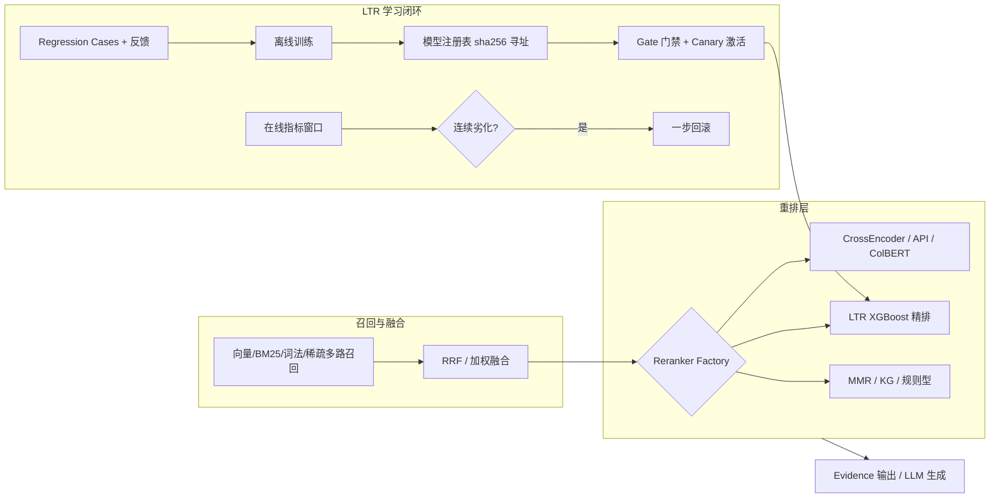
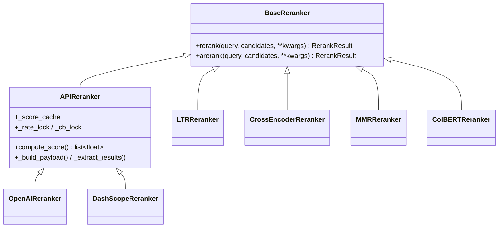
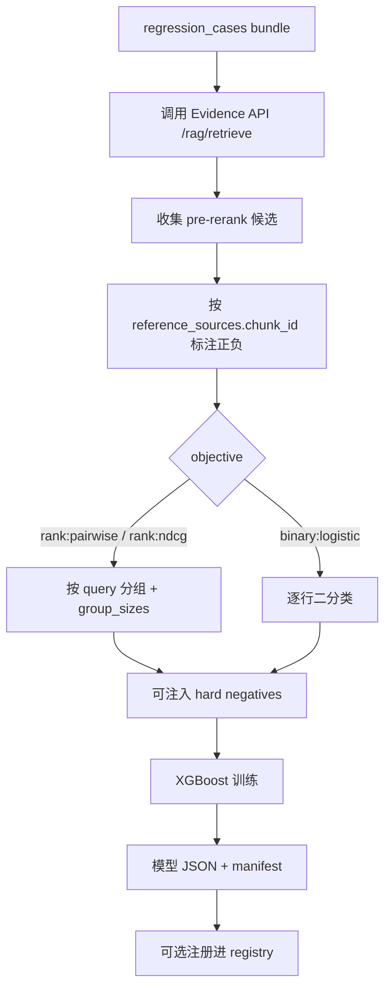
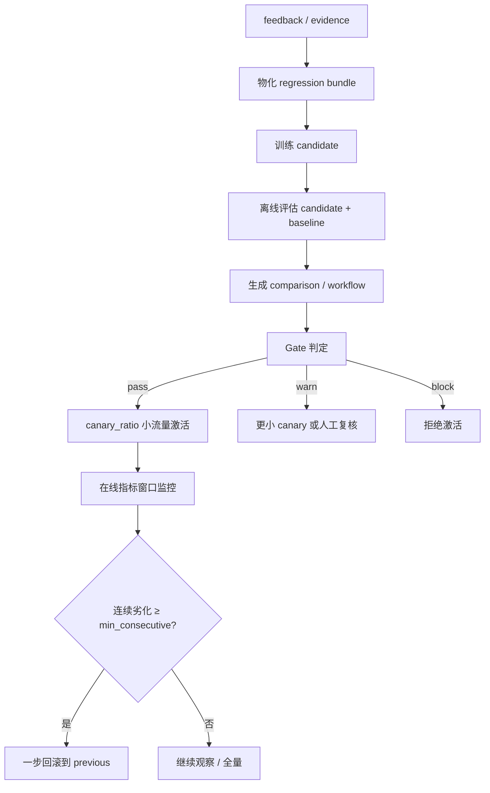

本文深入解析 MimirQ 的重排（Rerank）体系：从统一的重排器抽象与工厂，到基于 XGBoost 的 Learning-to-Rank（LTR）排序学习、模型注册表、受控发布与在线回滚。面向进阶开发者，聚焦于「多路召回之后、最终排序之前」这一精排阶段的架构设计与工程化保障。内容与[混合检索与多路融合排序](14-hun-he-jian-suo-yu-duo-lu-rong-he-pai-xu)（召回侧）及[引用、证据与可解释性机制](17-yin-yong-zheng-ju-yu-ke-jie-shi-xing-ji-zhi)（输出侧）衔接，但不覆盖对话生成与评测体系本身。

## 一、体系总览：重排器在 RAG 流水线中的位置

重排器是检索流水线中「召回 → 融合 → 精排 → 输出」四段式结构的第三环。MimirQ 将重排器抽象为统一接口，并围绕它构建了三条能力轴：**多策略 Provider**（从无状态的确定性算法到本地模型再到远程 API）、**LTR 排序学习闭环**（离线训练 → 注册 → 门禁 → 金丝雀 → 回滚）、**工程化保障**（限流、熔断、缓存、分数校准与失败兜底）。

其中 LTR 链路与召回侧共享候选携带的特征（`vector_score`、`bm25_score` 等），由候选 `metadata` 透传到重排器，构成「可学习排序函数」的输入。注册表以内容寻址（sha256）存储模型工件，激活记录持久化于 `active.json`，从而支持重启后恢复与一步回滚。Sources: [factory.py](app/rag/reranker/factory.py#L1-L16)、[ltr_model_registry.py](app/services/ltr_model_registry.py#L1-L10)

## 二、统一抽象：RerankCandidate、RerankResult 与 BaseReranker

重排器的核心契约由三个类型定义：`RerankCandidate`（候选，携带 `id`、`text` 与特征 `metadata`）、`RerankResult`（输出 `ordered_ids`、`score_map`，以及可选的 `clues`、`stats`、`model_used`、`provider` 遥测字段）、`BaseReranker`（抽象基类，定义同步 `rerank()` 与默认异步 `arerank()`）。`APIReranker` 进一步封装远程 API 型重排器的公共工程状态——限流、熔断、分数缓存与会话管理。Sources: [types.py](app/rag/reranker/types.py#L8-L41)、[base.py](app/rag/reranker/base.py#L96-L126)

`APIReranker` 同时提供同步（httpx）与异步（aiohttp）两条打分路径：异步路径通过 `asyncio.gather` + 信号量控制并发，同步路径使用 `ThreadPoolExecutor`，二者共享相同的批量切分、重试与限流逻辑。`compute_score` 输出可按 `normalize=True` 经 sigmoid（`1/(1+e^{-x})`）压缩到 (0,1) 区间，为下游分数融合提供统一量纲。Sources: [base.py](app/rag/reranker/base.py#L231-L330)、[base.py](app/rag/reranker/base.py#L380-L478)、[base.py](app/rag/reranker/base.py#L88)

## 三、工厂与 Provider 矩阵：按 tier 分级的策略注册

`get_reranker(provider, ...)` 是唯一创建入口，按 provider 字符串分派到具体实现，并提供两套缓存：**API 型缓存**（键为模型、base_url、api_key、超时等参数的 sha256 摘要）与**本地型缓存**（键为模型路径、feature spec 等）。`describe_reranker_provider()` 将 provider 归一化为 tier，供配置层与遥测层做能力声明。

| Provider | Tier | 类型 | 关键特性 |
|---|---|---|---|
| `cross_encoder` / `local_bge_v2_m3` | prod | 本地模型 | 懒加载、后台线程加载、超时保护 |
| `long_context` | prod | 本地模型 | 长文本确定性评分 |
| `mmr` | prod | 确定性算法 | λ 权衡相关性与多样性（Jaccard） |
| `ltr` / `xgboost_ltr` | prod | 本地 XGBoost | 显式 model_path，manifest 校验 |
| `weighted` / `parent_child` / `kg_pagerank` / `kg_rrf` | prod | 规则/图算法 | 权重融合、父子文档、图谱 PageRank/RRF |
| `openai` / `dashscope` / `llm` | experimental | 远程 API | 重试、限流、熔断、分数缓存 |
| `colbert` | offline_only / experimental | 晚期交互 | deterministic 模式零依赖；hf 模式可降级 |

默认模型为 `BAAI/bge-reranker-v2-m3`；`kg_pagerank`/`kg_rrf` 内部委托给知识图谱搜索层的 `RerankPageRankSearcher`/`RerankRRFSearcher`（异步接口 `arerank_kg`）；未知 provider 直接抛错，旧接口 `get_rag_reranker()` 已标记弃用。Sources: [factory.py](app/rag/reranker/factory.py#L17-L75)、[factory.py](app/rag/reranker/factory.py#L118-L200)、[factory.py](app/rag/reranker/factory.py#L278-L341)、[factory.py](app/rag/reranker/factory.py#L399-L432)、[kg.py](app/rag/reranker/kg.py#L11-L50)

## 四、工程化保障：限流、熔断、缓存与条件跳过

重排器是延迟与成本的敏感点，因此 `APIReranker` 内置了完整的可靠性设施：

- **重试与退避**：可重试状态码集合为 `{408, 429, 500, 502, 503, 504}`，指数退避 `backoff * 2^attempt`；
- **令牌限流**：按 `RERANKER_API_RATE_LIMIT_QPS` 做进程内间隔限流，同步/异步双实现；
- **熔断**：连续失败达到 `RERANKER_API_CIRCUIT_BREAKER_FAILURE_THRESHOLD`（默认 5 次）后打开，`RESET_SEC`（60s）后试探恢复，熔断时 `rerank` 直接返回 `skipped` 结果而非抛错；
- **分数缓存**：`_ScoreCache` 为 LRU + TTL 结构（默认 2000 条目、3600 秒），键为 query 与 document 的 sha256，避免 UI 刷新与重试造成重复计费；
- **批处理**：默认 batch=32、max_concurrency=4、单候选截断 `RERANKER_MAX_CHARS=800`。Sources: [base.py](app/rag/reranker/base.py#L17-L31)、[base.py](app/rag/reranker/base.py#L33-L95)、[base.py](app/rag/reranker/base.py#L479-L560)、[config.py](app/core/config.py#L1961-L1985)

在 **retriever 内联重排**路径上，还提供了「条件跳过」优化：当 `RERANK_CONDITIONAL_ENABLED` 开启且 top-1 分数 ≥ `RERANK_SKIP_THRESHOLD`（0.85）、与第二名分差 ≥ `RERANK_SKIP_GAP`（0.15）时，判定为高置信度命中，直接跳过重排以节省成本。候选数 `candidates_n` 以 `requested_k` 为治理基准（而非过取的 `search_k`），防止过取放大重排开销。重排后的最终分 = `min(1.0, rerank_score + phrase_boost + metadata_boost)`，保留原始分数为 `retrieval_score` 并存 `rerank_score` 供溯源。任何异常均 fail-open：保留融合结果并记录 `reranker_error`，不阻断检索。Sources: [retriever.py](app/rag/retriever.py#L2426-L2560)、[config.py](app/core/config.py#L1963-L1964)

## 五、LTR 特征体系：v1 → v2 → v3 的递进信号

LTR 的核心假设是「多路召回的分数 + 来源角色 + 图谱信号 + 融合敏感性信号」可以被一个可学习的排序函数组合。`LTRFeatureSpec` 以**冻结的特征顺序**定义输入向量，训练与推理必须严格一致——这是 manifest 校验的第一道防线。

| Spec | 新增特征 | 信号意图 |
|---|---|---|
| v1（默认） | `vector_score`、`bm25_score`、`lexical_score`、`sparse_score`、`base_score`、`role_*` one-hot（main/alias/dict/clause/mq/subq/hyde/kgq/kg/tag） | 多路分数 + 召回来源角色（query 扩展、KG 注入等） |
| v2（可选） | `kg_pagerank`、`kg_shared_events`、`kg_path_length`、`kg_edge_conf_low/mid/high`、`kg_evidence_anchored` | 把 KG 从「召回扩展」提升为「排序信号」；低基数、不含 scope 标识 |
| v3（可选） | `field_aware_boost`、`field_signal_title/heading`、`keyword_max_score`、`vector_keyword_gap`、`multi_channel_hits` | 字段感知召回提示、稠密-关键词分歧度、通道支持数 |

`build_ltr_feature_spec_fingerprint()` 生成带版本与哈希的指纹，用于跨环境比较训练/评估工件，防止特征顺序或数量漂移。`extract_ltr_features()` 从候选 `metadata` 中按 spec 顺序组装向量（缺失值补 0）。v1 保持默认，以保证既有模型工件兼容；升级 spec 必须同时更新训练与推理侧并锁定回归测试。Sources: [ltr.py](app/rag/reranker/ltr.py#L31-L126)、[ltr.py](app/rag/reranker/ltr.py#L130-L197)、[docs/guides/reranking_ltr.md](docs/guides/reranking_ltr.md#L7-L39)

## 六、模型工件与 manifest 校验：fail-closed 的加载语义

`LTRReranker` 的加载遵循 **显式模型路径 + 清单强校验** 原则：`model_path` 必填（不设置则不改默认行为），sidecar manifest（`<model>.manifest.json` 或显式 `manifest_path`）必须满足 `mimirq.ltr_model_manifest.v1` schema，且逐项核对 `feature_schema` 与 `feature_names`（顺序与数量）。若 manifest 含 `model_sha256`，加载时对模型字节重新计算摘要并比对，防止工件被篡改。通过校验后，`model_id` 以 `sha256:<前12位>` 形式暴露给遥测，避免泄露完整路径。

推理侧为双保险：预测异常时返回 `ordered_ids=[]` 且 `stats.ok=False` 的空结果——线上重排失败是 no-op 而非破坏检索。模型采用 `binary:logistic`（二分类）或 `rank:pairwise`/`rank:ndcg`（按 query 分组的排序目标，经 `set_group` 传入 DMatrix），训练参数中 `min_child_weight=0` 以支持小样本测试，`base_score` 由训练标签均值推导并夹在 `[1e-6, 1-1e-6]`，避免全正样本时逻辑损失失效。Sources: [ltr.py](app/rag/reranker/ltr.py#L201-L260)、[ltr.py](app/rag/reranker/ltr.py#L270-L370)、[ltr.py](app/rag/reranker/ltr.py#L372-L458)

## 七、离线训练与评估：从 Regression Cases 到模型

训练脚本 `train_ltr_from_regression_cases.py` 构成「回归用例 → 候选采集 → 标注 → 特征化 → 训练」的确定性流水线。关键设计是**默认关闭召回侧内置重排器**（`enable_reranker=False`），收集 pre-rerank 候选，避免「用重排训练重排」的污染；标注规则为 `chunk_id ∈ reference_sources.chunk_id → 正样本`。

训练侧支持 `--hard-negatives-per-case`（默认 10）与 `--hard-negatives-jsonl`（`mimirq.hard_negatives.v1`，按 `query_hash` 键控，不存原始查询），ranking 目标要求每组至少一个正样本且组规模 ≥ 2。manifest 携带训练统计（`cases_total/used/missed`、`rows_pos/neg/hard_neg`、`group_count`、`data_hash`）与 lineage（`cases_sha256`、`pipeline_hashes`、`retrieval_config` 指纹、`hard_negatives_sha256`），全程 PII-safe。Sources: [train_ltr_from_regression_cases.py](scripts/train_ltr_from_regression_cases.py#L320-L380)、[train_ltr_from_regression_cases.py](scripts/train_ltr_from_regression_cases.py#L410-L519)、[train_ltr_from_regression_cases.py](scripts/train_ltr_from_regression_cases.py#L616-L677)

离线评估 `eval_ltr_offline.py` 独立于后端 LTR 启用状态：用 Evidence API 生成候选，本地加载模型重排，以二值相关性（chunk_id 匹配）计算 **Hit@K、MRR@K、Recall@K、NDCG@K**，输出 baseline（召回原始序）与 LTR 的逐指标对比摘要，同样写入 lineage。Hard negative 挖掘器从 trace 中提取「排在首个正样本之前且不在 reference_sources 中的候选」作为 near-miss 负样本，并按文档级上限（每文档 2 条）防过拟合。Sources: [eval_ltr_offline.py](scripts/eval_ltr_offline.py#L190-L226)、[hard_negative_mining.py](app/rag/evaluation/hard_negative_mining.py#L91-L205)

## 八、模型注册表：内容寻址、激活与一步回滚

`ltr_model_registry` 是文件型版本化注册表，位于 `UPLOAD_DIR/.ltr_registry`。**模型 ID 即 sha256(model_bytes)**，保证确定性；激活必须携带通过校验的 manifest，fail-closed。`active.json` 持久化 `current_model_id`/`previous_model_id`/`activated_at`/`activated_by`，激活同时回写运行时 settings（`LTR_MODEL_PATH`、`LTR_MODEL_MANIFEST_PATH`、`LTR_FEATURE_SPEC_VERSION`），使工厂在下次解析时自动加载新模型。`resolve_active_model_paths()` 让激活状态跨进程重启保持，无需改 .env。

| 操作 | 语义 | 安全性 |
|---|---|---|
| `register_model` | 内容寻址写入 model.xgb.json + manifest.json + meta.json，原子替换 | manifest 强校验；路径约束在 registry 根内 |
| `activate_model` | 写 active.json + 更新运行时 settings | 无 manifest 拒绝激活 |
| `rollback_active_model` | 交换 current/previous，保留一步历史 | fail-closed（无 previous 即抛错） |
| `apply_canary_activation` | 带 canary 元数据激活，ratio ∈ [0.01, 0.5] | 越界拒绝；流量分流由调用方执行 |

API 层（`/api/v1/ltr`）提供 `GET /models`、`POST /models/register`（双文件上传）、`POST /models/activate`、`POST /models/rollback`，均要求 RBAC `SETTINGS_READ`/`SETTINGS_WRITE` 权限并写审计日志（`ltr_model.register/activate/rollback`，仅哈希与低基数元数据）。Sources: [ltr_model_registry.py](app/services/ltr_model_registry.py#L246-L338)、[ltr_model_registry.py](app/services/ltr_model_registry.py#L408-L478)、[ltr_model_registry.py](app/services/ltr_model_registry.py#L480-L555)、[ltr.py](app/api/v1/ltr.py#L73-L171)、[ltr.py](app/api/v1/ltr.py#L186-L230)

## 九、受控发布：Gate 门禁 → Canary 金丝雀 → 在线回滚

LTR 的发布不是「训练即上线」，而是显式的五段受控流程：**物化用例 → 训练候选 → 离线对比 → 门禁判定 → 人工/受限激活**。`prepare_ltr_rollout.py` 把反馈（`MessageFeedback`）与已批准证据（`EvidenceSuite`）物化为 `mimirq.regression_cases.v1`，训练候选模型并跑双份评估（candidate vs 当前 active 模型；无 active 时 vs 检索 baseline），产出 `comparison.json` 与 `workflow.json`，但**绝不自动激活**。

Gate 阈值默认要求 `delta.hit/mrr/recall/ndcg ≥ 0` 且 `cases_used ≥ 1`；策略画像 `pass`（0 项失败，canary 0.2）/ `warn`（1 项失败，canary 0.05）/ `block`（不限失败，canary 0）。`ltr_rollout_gate.py` 以退出码 0/3/2 表达 pass/fail/参数错误，便于 CI 集成。在线回滚触发器 `evaluate_online_rollback_trigger()` 从指标窗口列表尾部数连续劣化窗口（默认 `delta.mrr ≤ -0.02` 连续 3 个），建议接入告警面板而非单窗口触发；`ltr_online_rollback_daemon.py` 实现可落盘的守护式回滚。Sources: [ltr_rollout_workflow.py](app/services/ltr_rollout_workflow.py#L22-L39)、[ltr_rollout_workflow.py](app/services/ltr_rollout_workflow.py#L453-L512)、[ltr_rollout_workflow.py](app/services/ltr_rollout_workflow.py#L516-L568)、[ltr_model_registry.py](app/services/ltr_model_registry.py#L557-L598)

## 十、融合权重学习：与混合检索的闭环

重排体系与[混合检索与多路融合排序](14-hun-he-jian-suo-yu-duo-lu-rong-he-pai-xu)的衔接点之一是融合权重学习服务。它从 `rag_trace` / `training_export_row` 中解析四通道（vector/bm25/lexical/sparse）的每候选分数，以 `reference_sources` 判定正负引用，按通道正负均值差（separation）归一化出建议权重；样本不足或分离度为零时回退默认权重 `{vector:0.4, bm25:0.2, lexical:0.2, sparse:0.2}`。同时输出观测摘要（融合策略直方图、RRF k 直方图、通道覆盖、LTR 训练就绪行数），供数据团队判断 LTR 训练数据成熟度。Sources: [fusion_weight_learning_service.py](app/services/fusion_weight_learning_service.py#L120-L200)、[fusion_weight_learning_service.py](app/services/fusion_weight_learning_service.py#L200-L232)

## 十一、集成点：Retriever 内联、Evidence 后置精排与检索画像

重排器存在两条主要挂载路径，且都受检索画像（profile）治理：

**1. Retriever 内联重排**：`retriever.invoke()` 在融合后、截断前执行（见第四节），由 `reranker_provider` 配置驱动。检索画像 `fast`（纯向量、关闭重排）、`balanced`（hybrid，默认 cross_encoder，top 20）、`quality`/`hybrid_ce`（hybrid，top ≥ 40/20）等通过 `_configured_reranker_provider()` 保留部署侧选择的后端，未显式指定时回退 `cross_encoder`。

**2. Evidence 后置精排**：`orchestrator.py` 在最终候选列表上提供独立的 post-fusion rerank，默认 provider 为 `ltr`（`EVIDENCE_POST_RERANK_TOP_N=30`）。支持**流水线模式**（`EVIDENCE_POST_RERANK_PIPELINE` 定义按阶段裁剪的多级精排）与**分数校准**（`EVIDENCE_POST_RERANK_SCORE_CALIBRATION_ENABLED` + `ALPHA=0.7`）：对 retrieval_score 与 rerank_score 分别做 min-max 归一化后加权 `α·rr_norm + (1-α)·base_norm`，重排后写入 `rerank_score_calibrated`。

后置精排结果由 `rerank_result_cache` 缓存：候选指纹仅取白名单元数据（分数、`retrieval_role`、KG 特征），query 与租户 ID 只做哈希不落盘；缓存键的 provider 签名对 LTR 包含 `LTR_MODEL_PATH`/`LTR_MODEL_MANIFEST_PATH`/`LTR_FEATURE_SPEC_VERSION`——模型切换自动失效缓存，防止旧模型结果泄漏。Sources: [retrieval_profiles.py](app/rag/core/retrieval_profiles.py#L76-L83)、[retrieval_profiles.py](app/rag/core/retrieval_profiles.py#L128-L197)、[orchestrator.py](app/rag/retrieval/orchestrator.py#L2430-L2473)、[orchestrator.py](app/rag/retrieval/orchestrator.py#L2473-L2570)、[rerank_result_cache.py](app/rag/rerank_result_cache.py#L42-L70)、[rerank_result_cache.py](app/rag/rerank_result_cache.py#L146-L200)、[config.py](app/core/config.py#L1491-L1517)

## 十二、安全、可观测性与当前差距

**安全设计**：注册表路径约束在 `.ltr_registry` 根内（`_safe_registry_path` 防目录穿越）；模型 ID 强制 sha256 十六进制；manifest 训练元数据白名单化；缓存与指纹全程不含原始 query/正文；API 端点受 RBAC 与审计保护。**可观测性**：每次重排写入 `rerank_meta`（provider、candidates_n、elapsed、skip_reason、error）到通道指标；API 型重排器输出 `event=reranker_api` 指标日志（query_hash、缓存命中率、限流 QPS、熔断状态）；LTR 推理暴露 `model_used=sha256:<12>` 与 manifest 快照。

**当前差距**（需额外工程）：更强的 hard negative 挖掘（跨 run/跨版本自动挖掘）、更细粒度的 rollout 编排（审批流、多波次 canary）、完整 A/B 分流与线上指标自动回写。推荐的生产闭环是 nightly cron 串联「挖掘 hard negatives → 训练 → gate → canary → 回滚守护 → 保留三份可审计 manifest」。Sources: [ltr_model_registry.py](app/services/ltr_model_registry.py#L55-L77)、[base.py](app/rag/reranker/base.py#L600-L678)、[docs/guides/reranking_ltr.md](docs/guides/reranking_ltr.md#L210-L280)

## 下一步阅读

- 召回侧信号从何而来：[混合检索与多路融合排序](14-hun-he-jian-suo-yu-duo-lu-rong-he-pai-xu)
- 精排结果如何进入引用与证据输出：[引用、证据与可解释性机制](17-yin-yong-zheng-ju-yu-ke-jie-shi-xing-ji-zhi)
- 评测指标与题集如何为 LTR 提供回归用例：[评测体系：指标、题集与 RAGAS](18-ping-ce-ti-xi-zhi-biao-ti-ji-yu-ragas)
- 发布质量卡口如何约束 LTR 上线：[回归门禁与发布质量卡口](19-hui-gui-men-jin-yu-fa-bu-zhi-liang-qia-kou)
- 反馈如何回流为训练数据：[反馈闭环与在线评测](20-fan-kui-bi-huan-yu-zai-xian-ping-ce)