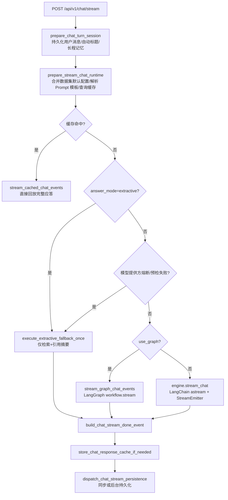
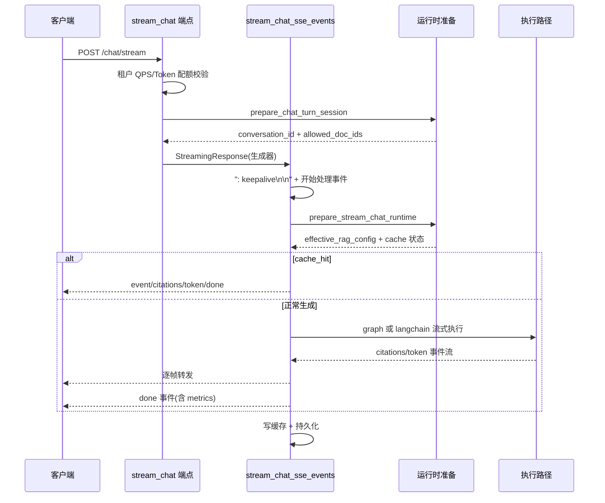
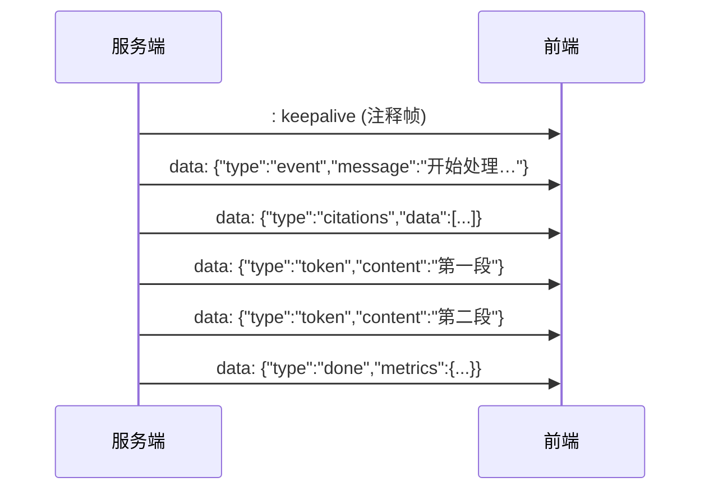
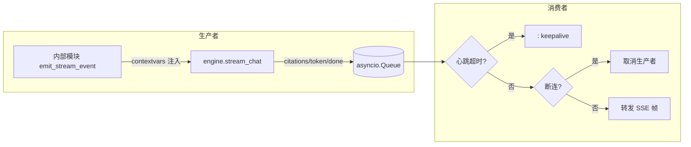
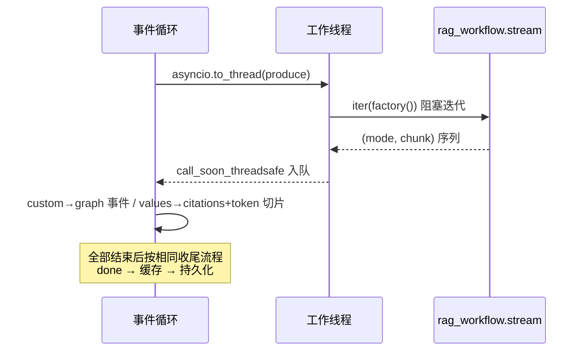
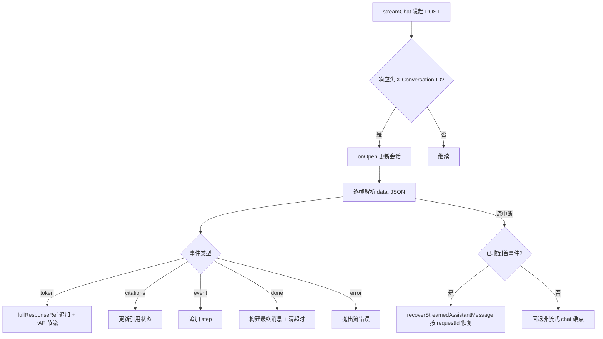

本文深入解析 MimirQ 的对话引擎执行链路与 SSE 流式输出机制。范围覆盖 `POST /api/v1/chat/stream` 端点到前端渲染的完整数据通路：双执行路径（LangChain 引擎与 LangGraph）、运行时准备与缓存、并发准入、抽取式降级、流式持久化，以及前端的 SSE 解析与渲染策略。假设读者已理解混合检索与重排流程（参见 [混合检索与多路融合排序](14-hun-he-jian-suo-yu-duo-lu-rong-he-pai-xu)），本文将聚焦"检索结果如何被组织成对话并逐 token 推送给客户端"。

## 一、总体架构：双执行路径与统一 SSE 出口

对话引擎在服务端存在两条可切换的执行路径，但对外暴露完全一致的事件流协议。架构核心是 `stream_chat_sse_events` 编排器——它负责运行时准备、缓存命中判定、路径选择、异常降级与持久化派发，是整条链路的"总开关"。

端点层与编排器的职责边界清晰：`stream_chat` 仅负责构建 `StreamingResponse`、设置 SSE 响应头（`Cache-Control: no-cache`、`X-Accel-Buffering: no`）、生成稳定 `assistant_message_id`，随后将控制权完全交给编排器异步生成器。所有 SSE 帧在编排器内部以 `data: {json}\n\n` 形式产出。

Sources: [chat.py](app/api/v1/chat.py#L567-L648)、[chat_stream_orchestrator.py](app/services/chat_stream_orchestrator.py#L64-L113)

## 二、SSE 协议与事件类型

服务端统一输出 `text/event-stream`，每个数据帧为一个 JSON 对象，经 `json.dumps(ensure_ascii=False)` 序列化。协议包含五种核心事件类型，加上可选的 `graph` 与 `status`/`retrieval_info` 扩展事件：

| 事件类型 | 数据载荷 | 语义 | 前端处理 |
|---|---|---|---|
| `event` | `{message}` | 阶段提示（"开始处理…"、"缓存命中…"、TAG 尝试提示） | 追加 step 列表 |
| `citations` | 引用数组（document_id/document_name/chunk_content/relevance_score） | 检索命中的证据列表，全流只发一次 | 更新引用状态 |
| `token` | `{content}` | 增量文本块（引擎逐 token 或 120 字符分块） | 追加到响应缓冲 |
| `done` | `{assistant_message_id, conversation_id, total_tokens, citations_count, model_used, route, retrieval_mode, metrics, structured_data}` | 生成结束，携带完整元数据 | 构建最终 assistant 消息 |
| `error` | `{message, conversation_id, status_code?, error_code?, retry_after_sec?}` | 处理失败，非生产环境附带脱敏详情 | 抛出错误并走恢复路径 |
| `graph` | 任意自定义负载 | LangGraph `custom` 模式节点事件 | 透传展示 |
| `status` / `retrieval_info` | `{stage, state}` / `{attempt, query_count, docs_count}` | 生成阶段状态与检索进度（受开关控制，默认关闭） | 展示进度 |

协议设计的两个关键点：其一，`request_id` 贯穿每个事件帧，客户端可据此与 `X-Request-ID` 响应头关联；其二，`done` 事件由 `build_chat_stream_done_event` 统一构建，保证流式与非流式（`/chat` 非流式端点）返回的元数据结构一致。`total_tokens` 使用 `num_tokens_from_string` 对完整应答做事后估算，而非累加流式片段，避免分块边界造成统计偏差。

Sources: [chat_stream_common.py](app/services/chat_stream_common.py#L52-L88)、[chat_stream_orchestrator.py](app/services/chat_stream_orchestrator.py#L98-L101)、[chat.py](app/api/v1/chat.py#L622-L647)

## 三、运行时准备：作用域解析、配置合并与缓存查询

流式请求在进入生成路径之前，要经过两层运行时准备，全部由 `chat_bootstrap_runtime.py` 承担。

第一层 `prepare_chat_turn_session` 完成对话轮次级的准备：调用 `resolve_chat_conversation_scope` 校验会话存在性、解析 `conversation_id`/`scope_dataset_id`/`allowed_doc_ids`（文档 ACL 与数据集归属在此收敛）；随后**同步持久化用户消息**（`role="user"`，含 token 计数）、自动生成会话标题、按需检索长程记忆消息，并提交事务。这一设计保证用户消息在任何生成失败场景下都已落库，客户端可基于 `X-Conversation-ID` 恢复上下文。

第二层 `prepare_stream_chat_runtime` 完成请求级配置解析，产出 `effective_rag_config`——这是整条链路的"事实来源"：
- 若请求未显式携带 `rag_config`，则从 `scope_dataset_id`（或由文档集合反推的唯一数据集）加载数据集级 `rag_defaults`，通过 `merge_rag_config_with_dataset_defaults` 合并，并记录被覆盖的字段清单（`dataset_rag_defaults_applied_fields`）；
- 继而解析 Prompt 模板：优先级为请求显式模板 → 数据集默认 → 全局默认，同时支持 AB 实验键（`prompt_ab_experiment_key`）；
- 最后执行缓存查询 `prepare_chat_cache_lookup`：缓存默认要求空历史（`CHAT_RESPONSE_CACHE_REQUIRE_EMPTY_HISTORY`），缓存键由 `resolve_chat_response_cache_key` 依据租户、账号、数据集、文档集合、问题、RAG 配置与 Prompt 配置联合哈希生成——**账号/数据集必须参与键计算**，否则可能发生跨用户缓存泄漏。

缓存命中时，`stream_cached_chat_events` 直接将 `full_response` 与 `citations_data` 回放为事件流（同样按 120 字符分块产出 token），并携带 `cache_hit=True` 的指标注解。

Sources: [chat_bootstrap_runtime.py](app/services/chat_bootstrap_runtime.py#L89-L155)、[chat_bootstrap_runtime.py](app/services/chat_bootstrap_runtime.py#L158-L200)、[chat_cache_runtime.py](app/services/chat_cache_runtime.py#L131-L167)、[chat_stream_common.py](app/services/chat_stream_common.py#L198-L213)

## 四、LangChain 流式执行：队列解耦与 StreamEmitter

默认执行路径由 `RAGEngine.stream_chat`（`app/rag/engine.py`，约 4000 行）驱动，它本身就是一个异步生成器，产出 `citations/token/done/error` 事件。LangChain 模式的关键设计是**消费者-生产者解耦**：

`stream_langchain_chat_session_events` 创建 `asyncio.Queue`，将 `engine.stream_chat` 封装进独立的生产者 task（`produce_langchain_stream_events`），消费者循环负责心跳、断连检测与事件转发。生产者在调用引擎前通过 `bind_stream_emitter` 将 `StreamEmitter` 绑定到 contextvars——这是解决"深层服务层如何上报进度"的机制：检索、重排等内部模块无需把队列参数层层透传，直接调用 `emit_stream_event(type, data, dedupe_key=...)` 即可注入事件流，`dedupe_keys` 集合可抑制多子查询场景下重复的进度消息。

消费者循环的关键行为：
- **心跳**：`CHAT_STREAM_HEARTBEAT_SEC`（默认 10 秒）内无事件则产出 `: keepalive\n\n` 注释帧，防止代理/网关超时断开长连接；
- **断连检测**：`CHAT_STREAM_CANCEL_ON_DISCONNECT` 开启时，每轮循环调用 `http_request.is_disconnected()`，检测到断连即取消生产者并终止；
- **事件汇聚**：`citations` 事件快照保存、`token` 事件追加到 `response_parts`、`error` 事件转为异常抛出、`done` 事件注入 `assistant_message_id` 并注解缓存指标。

引擎内部的检索阶段同样体现并发控制：多查询/HyDE 展开后的检索计划通过 `RETRIEVAL_QUERY_PARALLELISM` 控制并行度（`asyncio.Semaphore`），每个检索调用经 `run_blocking_retrieval_call` 包装以接入准入控制；多路结果先做 RRF 融合，再按 `MULTI_QUERY_DIVERSIFY_BUDGET` 做多样性裁剪（保证主查询与扩展查询的比例）。生成阶段使用 `chain.astream(generation_inputs)` 逐 token 产出，若启用 PII 脱敏则先缓冲 `PII_STREAM_HOLDBACK_CHARS`（默认 128 字符）再释放，避免脱敏边界被截断；多模态图片场景下则切换至 `stream_vision_chat_completions_tokens` 直连视觉模型流式接口。

Sources: [chat_stream_langchain.py](app/services/chat_stream_langchain.py#L42-L147)、[chat_stream_langchain.py](app/services/chat_stream_langchain.py#L205-L291)、[stream_events.py](app/core/stream_events.py#L19-L54)、[stream_events.py](app/core/stream_events.py#L56-L93)、[engine.py](app/rag/engine.py#L1440-L1524)、[engine.py](app/rag/engine.py#L3195-L3208)

## 五、LangGraph 流式执行：worker 线程与 custom 模式

当 `effective_rag_config.use_graph` 为真时，走 LangGraph 路径。其核心难点在于 `rag_workflow.stream` 是**同步阻塞生成器**，不能直接在事件循环上运行。解决方案是 `_iterate_sync_in_worker`：将同步生成器放入 `asyncio.to_thread` 线程中迭代，通过线程安全的 `BoundedSemaphore`（默认 16 槽）控制背压，产出经 `loop.call_soon_threadsafe` 送入 asyncio 队列，同时接受一个 `threading.Event` 作为取消信号——该信号与请求生命周期绑定，客户端断连时通过 `graph_cancel_event` 中断工作线程。

图执行使用 `stream_mode=["custom", "values"]` 双模式：
- `custom` 模式捕获图中节点通过 LangGraph `get_stream_writer` 写入的自定义事件，原样包装为 `{"type": "graph", "data": chunk}` 转发；
- `values` 模式在每个超步后返回完整状态快照，用于渐进式提取 `citations` 与 `answer`——首次出现 `citations` 键即发送引用事件并置位 `citations_sent`（保证只发一次），首次出现 `answer` 键即将答案按 120 字符切块发送 token 事件。

图路径与 LangChain 路径在收尾阶段完全一致：组装 `done` 事件、写入响应缓存（`store_chat_response_cache_if_needed`）、记录完成指标、派发持久化。结构化输出模式下，图路径会额外对完整答案执行 `parse_json_from_text` 解析，并将解析元数据（`structured_parse_ok`/`structured_parse_method`）写入指标。

Sources: [chat_stream_graph.py](app/services/chat_stream_graph.py#L25-L83)、[chat_stream_graph.py](app/services/chat_stream_graph.py#L103-L239)、[chat_stream_graph.py](app/services/chat_stream_graph.py#L233-L306)、[chat_stream_graph.py](app/services/chat_stream_graph.py#L309-L399)

## 六、降级路径：抽取式回退与模型熔断

对话引擎对模型服务不可用具备多级降级能力，全部实现在 `chat_execution_runtime.py`，编排器在多个决策点触发：

1. **显式抽取模式**：`answer_mode == "extractive"` 时直接走抽取式回退，不尝试任何 LLM 调用；
2. **进程内熔断**：`is_model_provider_unavailable_circuit_open()` 检查——一旦模型提供方被标记不可用，`mark_model_provider_unavailable` 打开一个 300 秒 TTL 的进程内熔断，后续请求直接降级，避免反复慢失败；
3. **快速预检**：`preflight_model_provider_fast` 向 OpenAI 兼容端点发起 1.5 秒超时的冒烟请求（`max_tokens=1`），依据响应码（400/401/402/403/408/409/429/5xx）或错误特征串判定可用性，可用性结果缓存 60 秒；
4. **流中错误回退**：LangChain/LangGraph 执行过程中抛出匹配 `_MODEL_PROVIDER_UNAVAILABLE_MARKERS`（欠费、限流、认证失败、连接超时等 19 类特征）的异常时，先打开熔断再转入抽取式回退。

抽取式回退（`execute_extractive_fallback_once`）本质是"检索即答案"：复用 `build_rag_state` 构建状态（非显式模式下强制 `top_k ≤ 6`、关闭重排与多查询扩展以控制成本），执行 `run_retrieval` 后从引用中构建摘要式答案（`build_extractive_fallback_answer`），并将 `generation_fallback_used/kind/reason` 写入指标。降级事件流以 "模型服务不可用，已切换为引用抽取摘要…" 开场，随后照常输出 citations/token/done，客户端无需感知差异。

检索准入超时（`RetrievalAdmissionTimeoutError`）是独立于模型故障的降级分支：编排器捕获后输出 `SERVICE_UNAVAILABLE` 错误事件并携带 `Retry-After` 头建议，提示客户端重试。

Sources: [chat_execution_runtime.py](app/services/chat_execution_runtime.py#L46-L108)、[chat_execution_runtime.py](app/services/chat_execution_runtime.py#L111-L165)、[chat_execution_runtime.py](app/services/chat_execution_runtime.py#L563-L718)、[chat_stream_orchestrator.py](app/services/chat_stream_orchestrator.py#L211-L295)、[chat_stream_orchestrator.py](app/services/chat_stream_orchestrator.py#L346-L365)

## 七、并发准入控制：本地信号量与分布式租约

流式对话中的检索调用是同步阻塞操作，直接运行在事件循环上会卡死整个进程。`rag_runtime_limiter.py` 提供两层保护：

- **本地门控**：`threading.BoundedSemaphore` 按 `RAG_RETRIEVAL_OFFLOAD_MAX_CONCURRENCY` 限制同步检索调用的并发度，所有检索调用通过 `run_blocking_retrieval_call_with_managed_session` 切换到独立 worker 数据库会话执行，避免请求线程与异步请求共享 `Session`；
- **分布式准入**：`RAG_RETRIEVAL_DISTRIBUTED_ADMISSION_ENABLED` 开启时，通过 Redis 租约（`try_acquire_redis_lease`）在多实例间抢占有限槽位，心跳线程续约防止租约过期，Redis 不可用时自动降级为本地门控。

准入等待超时（`RAG_RETRIEVAL_ADMISSION_TIMEOUT_SEC`，默认 15 秒）抛出 `RetrievalAdmissionTimeoutError`，在编排器与 API 层被统一格式化为 `SERVICE_UNAVAILABLE` SSE 事件。这一机制在 [任务队列与后台作业](25-ren-wu-dui-lie-yu-hou-tai-zuo-ye) 与 [可观测性：指标、追踪与日志](26-ke-guan-ce-xing-zhi-biao-zhui-zong-yu-ri-zhi) 中有更完整的论述。

Sources: [rag_runtime_limiter.py](app/services/rag_runtime_limiter.py#L52-L160)、[chat_stream_orchestrator.py](app/services/chat_stream_orchestrator.py#L43-L61)、[chat.py](app/api/v1/chat.py#L119-L142)

## 八、流式持久化：同步提交与后台派发

流式收尾的持久化由 `dispatch_chat_stream_persistence` 统一派发，行为受 `CHAT_STREAM_PERSIST_IN_BACKGROUND`（默认 `False`）控制：

- **同步模式**：在当前请求会话内直接持久化 assistant 消息——构造 `Message`（含 citations、token 计数、`build_chat_message_metadata` 打包的指标与原始问题）、写入审计日志（`action="chat.stream"`，含问题摘要、文档数与数据集 ID）、触摸会话更新时间；若启用摘要记忆且请求携带 `enable_summary_memory`，则额外派发后台任务自动更新会话摘要；
- **后台模式**：将整个持久化协程交给 `_spawn_background_task` 执行——该 runner 持有强引用防止 task 被 GC 回收，完成回调中统一吞掉异常并记录警告。

结构化记忆（`enable_structured_memory`）在持久化阶段同步抽取实体与事实（上限分别为 20 与 8），写入 `message_metadata["structured_memory"]`，抽取失败仅记 debug 日志不阻断主流程。持久化与缓存写入的顺序有讲究：先 `store_chat_response_cache_if_needed`（仅在 `cache_eligible` 且非命中且内容非空时写），再派发持久化，保证下游重放（如 [引用、证据与可解释性机制](17-yin-yong-zheng-ju-yu-ke-jie-shi-xing-ji-zhi) 中的证据胶囊）能拿到一致的完整数据。

Sources: [chat_stream_persistence.py](app/services/chat_stream_persistence.py#L29-L64)、[chat_stream_persistence.py](app/services/chat_stream_persistence.py#L66-L120)、[chat.py](app/api/v1/chat.py#L145-L167)、[chat_cache_runtime.py](app/services/chat_cache_runtime.py#L58-L81)

## 九、前端消费：SSE 解析、rAF 渲染与断流恢复

前端流式链路（`use-chat-stream.ts` + `web/lib/api/chat.ts`）与后端协议严格对应，且具备独立于服务端的健壮性设计。

**传输层**：`streamChat` 以 `POST` + `Accept: text/event-stream` 发起请求（SSE 通常为 GET，此处为携带复杂请求体的 POST 变体），从响应头读取后端 `X-Request-ID` 与 `X-Conversation-ID` 触发 `onOpen` 回调。`readSseDataStrings` 用 `TextDecoder` 流式解码，`createSseDataParser` 按 `\n\n` 分块、提取 `data:` 行（兼容 `\r\n`），逐条回调 JSON 字符串。

**状态管理**：`useChatStream` 采用"缓冲 + rAF 节流"渲染模型——token 事件追加到 `fullResponseRef`，通过 `requestAnimationFrame` 合并帧内多次更新（`scheduleCurrentResponseUpdate`），避免高频 token 触发布局抖动；`renderedResponseLengthRef` 追踪已渲染长度用于诊断。citations 与步骤（step）分别由独立 ref 维护，`done` 事件一次性构建最终 assistant 消息。

**超时与恢复**：`armTimeout` 采用两段式——首事件前用 `API_TIMEOUT_MS`（短超时），收到首个事件后切换到 `API_LONG_TIMEOUT_MS`（长超时，长生成任务不受初始超时限制）。流中断且已收到部分 token 时，调用 `recoverStreamedAssistantMessage` 按 `requestId` 从后端恢复完整消息；若 SSE 完全不可用（未收到任何事件），自动回退到非流式 `chatApi.chat` 端点，保证功能可用性。用户主动停止（`stopGeneration` → `controller.abort()`）时，已流出的部分答案被保留为带 `message_metadata.stopped=true` 的 assistant 消息，而非静默丢弃。

Sources: [chat.ts](web/lib/api/chat.ts#L100-L162)、[sse-reader.ts](web/lib/sse-reader.ts#L3-L36)、[sse.ts](web/lib/sse.ts#L1-L36)、[use-chat-stream.ts](web/hooks/use-chat-stream.ts#L135-L146)、[use-chat-stream.ts](web/hooks/use-chat-stream.ts#L169-L302)、[use-chat-stream.ts](web/hooks/use-chat-stream.ts#L304-L349)

## 十、关键配置项

流式链路的行为全部可由环境变量控制，以下是影响对话引擎的核心开关：

| 配置项 | 默认值 | 作用 |
|---|---|---|
| `CHAT_STREAM_HEARTBEAT_SEC` | 10.0 | 心跳注释帧间隔，防代理超时 |
| `CHAT_STREAM_CANCEL_ON_DISCONNECT` | True | 客户端断连时取消生成（LangChain 路径轮询 `is_disconnected`，Graph 路径置位 cancel_event） |
| `CHAT_STREAM_PERSIST_IN_BACKGROUND` | False | 持久化改为后台派发，降低请求尾延迟 |
| `STREAM_WRITER_ENABLED` | True | LangGraph custom 事件写入开关 |
| `PII_STREAM_HOLDBACK_CHARS` | 128 | PII 脱敏的流式缓冲回退字符数 |
| `RAG_STREAM_STATUS_EVENTS_ENABLED` | False | 生成阶段 status 事件开关 |
| `RAG_STREAM_RETRIEVAL_PROGRESS_ENABLED` | False | 检索进度 retrieval_info 事件开关 |
| `LANGGRAPH_RECURSION_LIMIT` | 25 | 图执行递归上限 |
| `RAG_RETRIEVAL_OFFLOAD_MAX_CONCURRENCY` | 1 | 检索离线调用本地并发上限 |
| `RAG_RETRIEVAL_ADMISSION_TIMEOUT_SEC` | 15.0 | 准入等待超时，超时输出 SERVICE_UNAVAILABLE |
| `RAG_RETRIEVAL_DISTRIBUTED_ADMISSION_ENABLED` | False | 基于 Redis 租约的跨实例准入控制 |
| `CHAT_RESPONSE_CACHE_ENABLED` / `CHAT_RESPONSE_SINGLEFLIGHT_ENABLED` | False | 响应缓存与单飞合并 |
| `RAG_CRAG_STREAMING_ENABLED` | False | 校正性 RAG（CRAG）流式模式 |

Sources: [config.py](app/core/config.py#L2392-L2402)、[config.py](app/core/config.py#L1833-L1845)、[chat_execution_runtime.py](app/services/chat_execution_runtime.py#L63-L69)

## 十一、设计要点总结

对话引擎与流式输出的架构决策可归纳为四个原则：**统一协议、双路执行、分级降级、前后端对等健壮**。

第一，所有执行路径（正常生成、缓存回放、抽取回退、图模式）最终都收敛到相同的事件序列（event → citations → token* → done），客户端只需实现一套解析逻辑。第二，LangChain 与 LangGraph 两条路径在编排器层以 `use_graph` 一个开关切换，收尾流程（done 事件、缓存、持久化）完全复用，降低维护成本。第三，模型故障被建模为可降级而非可失败：熔断、预检、流中检测三级防护后，抽取式回退保证"检索即答案"的最差体验。第四，前端对断流、超时、主动停止分别有恢复、回退与保留部分答案的处置策略，与后端 `request_id`/`assistant_message_id` 关联机制形成闭环。

下一步建议按目录继续阅读 [引用、证据与可解释性机制](17-yin-yong-zheng-ju-yu-ke-jie-shi-xing-ji-zhi)（理解 citations 事件如何支撑证据链），或 [前端架构与核心页面组织](21-qian-duan-jia-gou-yu-he-xin-ye-mian-zu-zhi)（理解 `useChatStream` 在页面层的接入方式）；性能与观测层面可衔接 [可观测性：指标、追踪与日志](26-ke-guan-ce-xing-zhi-biao-zhui-zong-yu-ri-zhi) 中的 `rag_done` 指标与链路追踪。