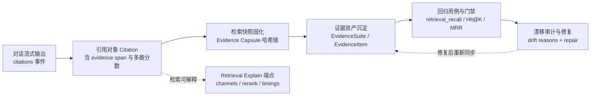
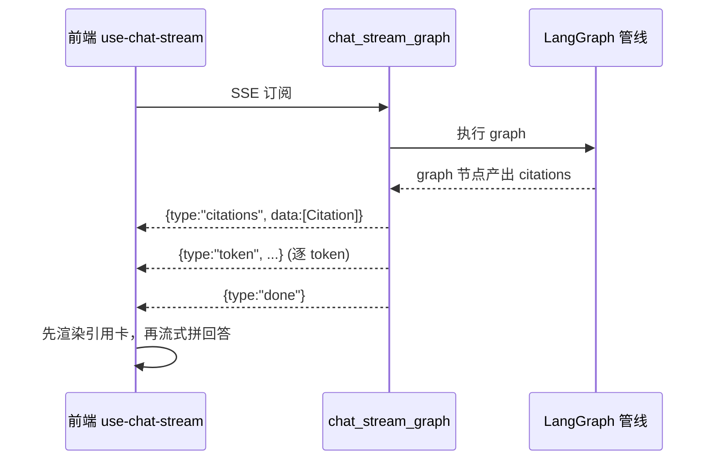
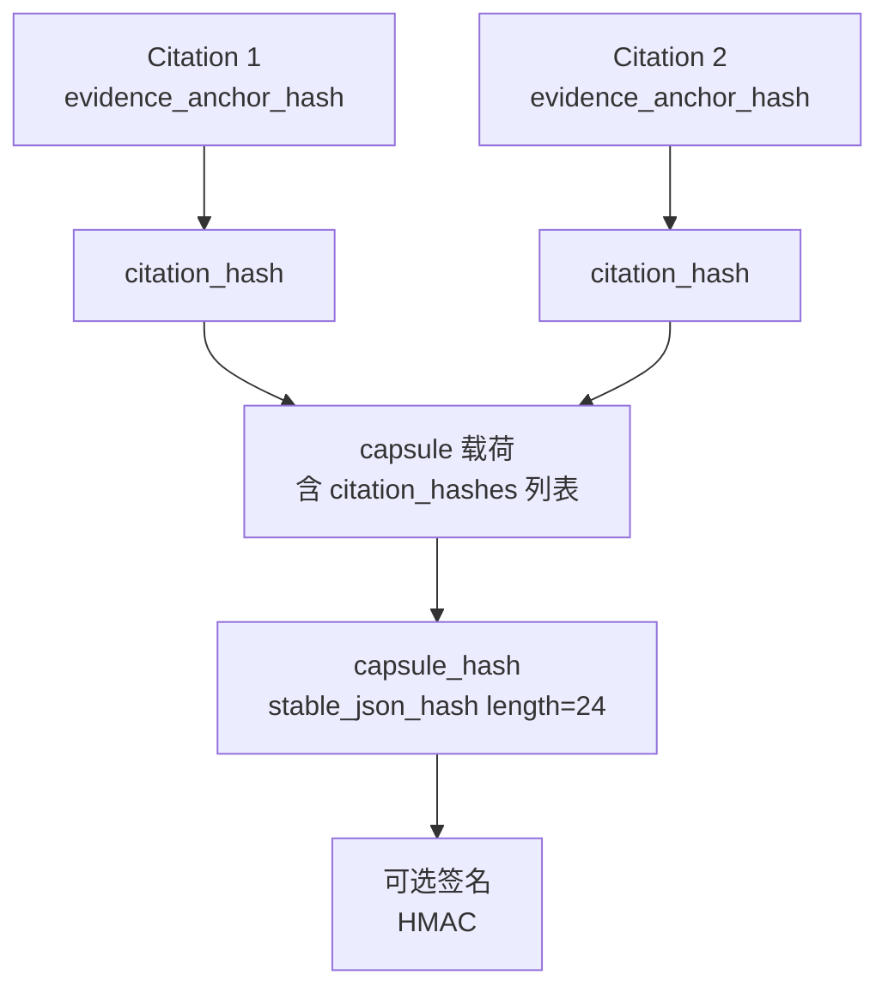

本文档深入剖析 MimirQ 的"证据链"设计：从 RAG 对话中**引用（Citation）**的生成与定位，到**证据资产（EvidenceSuite/EvidenceItem）**的沉淀与审批，再到**证据胶囊（Evidence Capsule）**的固化与回放，最后是**漂移审计、检索门禁与前端可视化**。核心目标是让"回答为什么引用这段文字"从口号变成可审计、可回归、可 CI 强制的工程能力。

## 一、体系总览：从引用到可回归证据的四层结构

整个机制可以拆解为四个相互衔接的层次，每一层解决一个具体问题：

阅读路径建议：先理解底层的 `Citation` 结构（第二节），再向上看检索可解释端点（第三节）与流式输出（第四节），随后进入证据资产与胶囊（第五、六节），最后是漂移治理与门禁（第七、八节）以及前端呈现（第九节）。

Sources: [evidence.py](app/models/evidence.py#L20-L95), [interfaces.py](app/rag/components/interfaces.py#L12-L59)

## 二、引用对象 Citation：可定位、可打分的证据单元

**引用是证据链的最小原子**。`Citation` 在前后端有两套定义：后端 RAG 组件的轻量 `TypedDict` 契约（`app/rag/components/interfaces.py`）与 API 层完整 Pydantic 模型（`app/api/schemas/chat.py`），两者字段基本对齐。

引用携带三类信息，分别回答"证据是什么、证据来自哪、证据多可信"：

| 类别 | 关键字段 | 用途 |
|---|---|---|
| 定位锚点 | `chunk_id`、`document_id`、`page_number`、`chunk_index`、`start_char`/`end_char`、`evidence_start_char`/`evidence_end_char`、`bbox` | 前端可深链到文档预览并高亮 |
| 来源与路径 | `retrieval_role`（main/alias/mq/kgq/kg…）、`hit_type`（vector/keyword/hybrid/mmr/tag…）、`hierarchy_family_key`、`family_collapse_key` | 解释"这条引用从哪条检索通道来" |
| 分数体系 | `relevance_score`、`vector_score`、`bm25_score`、`rerank_score`、`retrieval_score`（含 `rerank_score_calibrated`） | 调试排序、离线训练 |

其中 `evidence_start_char`/`evidence_end_char` 是**证据跨度（evidence span）**的关键：与 `start_char`/`end_char`（命中片段的裁剪窗口）不同，它指向查询词命中的精确子区间。前端在渲染内联引用时会优先使用 evidence span，其次回退到 start/end（见 `getCitationRange` 的优先级逻辑）。

Sources: [chat.py](app/api/schemas/chat.py#L138-L191), [interfaces.py](app/rag/components/interfaces.py#L12-L40), [message-item.tsx](web/components/chat/message-item.tsx#L84-L96)

### 2.1 证据跨度的生成算法

`app/rag/core/citations.py` 中的 `_build_snippet_and_span` 实现了"查询词命中 → 证据窗口"的确定性问题：先抽取查询词（最多 10 个），在原文中找首个命中位置，再围绕命中点扩展出受 `max_chars` 约束的窗口，最后按句子边界对齐并返回 `(snippet, matched_terms, start, end)`。若未命中任何查询词，仍会返回一个有界的回退窗口，保证 UI 可以深链高亮（best-effort）。

层级检索场景还有专门的 `_build_snippet_from_span`：父级 citation 可以锚定其子 citation 的同一证据跨度，而不是重新做一次查询词匹配，从而保证"父子引用高亮同一段原文"的视觉一致性。

Sources: [citations.py](app/rag/core/citations.py#L347-L424)

## 三、检索可解释端点：单查询的确定性"解剖"

`POST /api/v1/rag/explain` 是一个**纯检索、不生成回答**的确定性端点，用于回答"这次检索到底发生了什么"。它复用与对话相同的 `build_rag_state` + `run_retrieval` 管线（`retrieval_only` 强制为 true），因此结果与真实对话检索路径一致，但把内部状态完整暴露出来：

| 响应字段 | 内容 | 典型用途 |
|---|---|---|
| `channels` | 各检索通道的候选明细（vector/keyword/kg/tag…） | 判断哪个通道贡献了召回 |
| `hierarchy_recall` | 层级召回（父/子文档聚合）信息 | 排查层级折叠是否过度 |
| `top_citations` | 裁剪后的 Top-N 引用（仅保留 id 与分数） | 快速查看排序结果 |
| `rerank` | 重排器 provider、是否启用、候选数、pipeline 阶段、缓存命中/未命中 | 判断"为什么这个排序" |
| `stage_timings` | rewrite / multi_query / decompose / post_rerank 各阶段耗时 | 定位延迟瓶颈 |
| `retrieval_trace` | 稳定、带版本（`mimirq.retrieval_trace.v1`）的机器可解析轨迹 | 供下游做 provenance 解析 |
| `query_debug` | 最佳努力（best-effort）的查询改写/扩展明细 | 调参与诊断 |

注意 `retrieval_trace` 与 `metrics`、`query_debug` 的定位差异：前者是**稳定契约**，供机器解析"发生了什么"；后两者是**自由格式**，可能随版本演化，不应依赖其做业务逻辑。此外端点遵循与对话一致的 ACL：支持 `dataset_id` 或 `document_ids` 作用域，并通过 `filter_allowed_document_ids` 做权限裁剪。

Sources: [retrieval_explain.py](app/api/v1/retrieval_explain.py#L41-L70), [retrieval_explain.py](app/api/v1/retrieval_explain.py#L105-L254), [evidence_api.md](docs/guides/evidence_api.md#L103-L125)

## 四、流式对话中的引用推送

在 LangGraph 流式管线中，引用通过独立的 `citations` 事件先行推送，与 token 流分离：

后端在 `chat_stream_graph.py` 中：一旦某 chunk 携带 `citations` 字段即发送 `citations` 事件并标记 `citations_sent`；若整个流结束仍未发送，则在收尾时从 `graph_result` 补发一次，保证引用不会丢失。前端 `use-chat-stream` 收到 `citations` 事件后用 zod schema 校验并存入当前引用列表，供 `message-item.tsx` 渲染。

Sources: [chat_stream_graph.py](app/services/chat_stream_graph.py#L225-L272), [use-chat-stream.ts](web/hooks/use-chat-stream.ts#L222-L243)

## 五、证据资产：EvidenceSuite 与 EvidenceItem

如果说引用是"运行时"对象，那么证据资产就是**可持久化的 Ground Truth**。`EvidenceSuite` 是数据集作用域的证据集合（`dataset_id` 必填，天然租户/数据集隔离），`EvidenceItem` 是"一条 query + 人工确认的 reference_sources"。

### 5.1 多级审批生命周期

每个 `EvidenceItem` 有明确的状态机：`draft → reviewed → approved → archived`，每一步记录操作者（`created_by`/`reviewed_by`/`approved_by`/`archived_by`）与时间戳。归档采用软删除（`archived_at`）而非物理删除，保证可审计性。API 层通过 `_ensure_status` 强制合法状态迁移，例如只有 `reviewed` 状态才能进入 `approved`。

### 5.2 证据的"抗漂移指针"结构

`EvidenceItem.reference_sources` 是证据的核心指针，其 schema 与 RAGAS 回归用例的证据指针对齐：

| 字段 | 强度 | 说明 |
|---|---|---|
| `document_id` + `chunk_id` | 最强 | 理想情况下稳定，直接定位 |
| `doc_pipeline_key` / `pipeline_hash` / `chunk_index` | 中 | 文档重新解析后可回溯匹配 |
| `quote` | 回退 | chunk_id 失效时作为内容匹配的最后手段 |

每个 item 还会尽力保存 `retrieval_snapshot`（当时检索输出的 citations + 指标）与 `rag_config_snapshot`（当时的检索配置），形成可复现的"现场快照"——这正是"证据可解释"的根基：不仅知道该召回什么，还能回看当时系统实际召回了什么、用了什么配置。

### 5.3 导出与回流：训练数据与回归用例

Evidence API 支持将已审批的证据导出为统一训练格式 `mimirq.training_export_row.v1`，且会把 `MessageFeedback`（含评分与原因）转换为同构的 `source_type: "feedback"` 行，两类数据汇入同一条训练/回归流水线。审批通过的证据还可以同步为 RAGAS 回归用例（`regression_case_id` 关联），形成"人工确认的证据 → 自动化回归"的闭环。

Sources: [evidence.py](app/models/evidence.py#L20-L95), [evidence.py](app/api/v1/evidence.py#L94-L97), [evidence.py](app/api/v1/evidence.py#L131-L182), [evidence_pack_to_regression.md](docs/guides/evidence_pack_to_regression.md#L84-L95)

## 六、证据胶囊：一次检索的"固化与回放"

Evidence Capsule（`mimirq.evidence_capsule.v1`）把**一次检索结果固化为不可篡改的证据对象**，解决"事后如何验证当时确实召回了这些证据"的问题。

### 6.1 两级哈希链

胶囊内部构建了一条自下而上的哈希链，任何一层数据被改动都会导致校验失败：

- **citation 级**：`evidence_anchor_hash` 由 `document_id/chunk_id/page_number/chunk_index/start_char/end_char/table_id` 等锚点字段经 `stable_json_hash` 生成；`citation_hash` 再对整条净化后的 citation 求哈希。
- **capsule 级**：`capsule_hash` 对去除 hash/signature 字段后的完整载荷求哈希；`recompute_capsule_hash` 用于回放时重新计算比对。
- **净化规则**：写入胶囊的 citation 只保留白名单字段（锚点、分数、hit_type、reranker_provider 等），丢弃原始 chunk 全文，兼顾体积与 PII 安全。

### 6.2 摘要区：把"质量信号"一并固化

胶囊还包含三个摘要区：`must_recall`（must-recall 合同是否通过、缺失的 source key 列表）、`retrieval_contract`（模式/策略/hard-fallback 是否启用）、`quality`（解析风险等级、质量门禁是否阻断）。这意味着回放时不仅能核对"召回了什么"，还能核对"当时质量约束是否满足"。

### 6.3 持久化、隔离与回放

胶囊按租户目录隔离存储（`EVIDENCE_CAPSULE_STORE_DIR/<tenant_id>/<capsule_id>.json`），路径做了防穿越校验；写入时会绑定 `tenant_id` 与 `owner_account_id`，防止跨租户覆盖。回放通过 `scripts/replay_from_evidence_capsule.py` 校验 `capsule_hash` 并生成最小 replay request（query + rag_config + 期望 citation hashes），与 CI 门禁 `must_recall_provenance_gate.py` 联动（要求 `must_recall_pass_rate >= 1.0` 且 provenance 完整）。

Sources: [evidence_capsule_builder.py](app/rag/core/evidence_capsule_builder.py#L29-L87), [evidence_capsule_builder.py](app/rag/core/evidence_capsule_builder.py#L90-L151), [evidence_capsules.py](app/api/v1/evidence_capsules.py#L59-L120), [evidence_capsule.md](docs/guides/evidence_capsule.md#L5-L78)

## 七、证据漂移审计与修复：让"指针"保持新鲜

文档重解析、切块变更、索引重建都会让既有的 `reference_sources` 指针失效——这被称为**证据漂移（drift）**。MimirQ 提供一套 PII-safe 的审计与修复机制。

### 7.1 漂移原因分类

`classify_reference_source_drift` 对每条引用指针依次检查，返回第一个命中的漂移原因：

| 漂移原因 | 含义 |
|---|---|
| `document_missing` | 文档已被删除 |
| `document_dataset_mismatch` | 文档离开了证据套件所属数据集（含历史 NULL） |
| `chunk_missing` | chunk 已不存在 |
| `chunk_disabled` | chunk 被禁用 |
| `chunk_document_mismatch` | chunk 与指针声明的 document 不一致 |
| `chunk_index_mismatch` | chunk_index 已变化 |
| `pipeline_hash_mismatch` / `doc_pipeline_key_mismatch` | 解析管线版本变化导致内容不可信 |

审计模块刻意**不读取 chunk 内容**，只基于 id、索引与哈希操作，从源头规避 PII 泄漏；漂移统计还支持按 `file_type / language / quality_bucket / directory` 切片，便于定位漂移集中的文档子集。

### 7.2 修复服务

`evidence_reference_repair_service` 提供"试算 + 应用"两段式修复：先以 `apply=False` 产出修复计划（expected vs observed），确认后再 `apply=True` 落库。修复定位的 needle 从证据的 `quote` 中提取**最长连续字母/CJK 串**（≥12 字符）而非整句引用，同样是为了避免在 API 响应中泄露原文。修复有明确边界（默认最多 5000 items、每 item 50 refs、500 处变更），防止失控写库。

Sources: [evidence_drift_audit.py](app/services/evidence_drift_audit.py#L23-L130), [evidence_reference_repair_service.py](app/services/evidence_reference_repair_service.py#L34-L120)

## 八、证据检索门禁：把"召回质量"变成 SLO

证据机制的最终出口是**可量化的门禁**。`app/rag/evaluation/evidence_retrieve_gate.py` 提供 retrieval-only 的指标计算，核心思想：用回归用例的 `reference_sources`（ground truth chunk_id）与检索输出的 `citations[].chunk_id` 对比。

| 指标 | 定义 |
|---|---|
| `retrieval_recall` | 证据 chunk 被召回的比例 |
| `retrieval_hit_at_{k}` | Top-K 内是否至少命中一个证据 |
| `retrieval_mrr` | 证据首次出现的平均倒数排名 |
| `retrieval_ndcg_at_{k}` | 二值相关性下的排序质量 |
| `abstain_rate` | 拒答占比（启用了 visible-evidence-only 时） |
| `provenance_integrity` | 证据胶囊哈希链是否完整（strict 校验） |

门禁有三档运行方式：CI/本地 CLI（`scripts/regression_gate.py --metrics ""` 触发 retrieval-only）、离线 pytest（`test_evidence_api_offline_regression_gate.py`，in-memory BM25 确定性回归）、Nightly 消融（`run_nightly_ablations.py` 覆盖 profile/fusion/sparse 等 knob 组合）。配合 `app/rag/retrieval/contract.py` 的检索契约模式（`must_recall_strict` 强制 hard-fallback 与 evidence span 校验、`evidence_strict` 强制可见证据 + claim 校验），门禁可以直接在 retrieval 层拦截"证据丢失"类回归，无需依赖 LLM 与 RAGAS，天然适合 CI 高频迭代。

Sources: [evidence_retrieve_gate.py](app/rag/evaluation/evidence_retrieve_gate.py#L13-L128), [contract.py](app/rag/retrieval/contract.py#L20-L76), [evidence_retrieval_gate.md](docs/guides/evidence_retrieval_gate.md#L11-L59)

## 九、前端呈现：从引用卡到 Why-Missed 诊断台

前端把证据链的每一环都变成了可交互的界面能力。

### 9.1 对话内引用：内联锚点 + 引用卡

`message-item.tsx` 通过 `mimirq-citation://` 协议注入内联引用链接，点击后根据 citation 的 evidence span（回退到 start/end）计算高亮区间，配合 `document-preview-anchor` 深链到文档查看器。引用卡（CitationCard）展示文档名、页码、综合分与次级分数（重排/向量/关键词/召回），命中类型与分数通过 `buildCitationScoreTitle` 汇总为 tooltip。图片类引用经 `resolveSafeCitationImageUrl` 严格白名单校验（仅允许后端 `/documents/image/`、`/documents/image-url/` 路由且同源），防止 token 泄漏。

### 9.2 claim → evidence 映射

在严格可见证据模式下，消息会附带 `claim_evidence`（每条 claim → 支撑证据 span 列表）。前端将其渲染为逐条 claim 的"证据数"徽标，点击可跳转文档定位——这是"每一句话都有依据"的产品化落地。

### 9.3 Why-Missed 诊断对话框

证据工作台内置 `why-missed-dialog.tsx`：选择 retrieval profile（recall50/coverage80/recall20）重跑检索，将结果与 `reference_sources` 逐条比对，产出状态分类（`retrieved`/`missing`/`drifted`/`unknown`），并叠加 drift audit 结果，展示"命中排名、漂移原因、expected vs observed"。`evidence-why-missed.ts` 实现了纯前端的状态判定与漂移原因提取，让运营同学无需理解后端即可定位"为什么没召回"。

### 9.4 Evidence Workbench

`evidence-suite-workbench-shell.tsx` 聚合了套件列表、条目列表、条目详情、套件仪表盘（吞吐/前置时间 + 语言×文件类型覆盖热力图）、Hardcase 候选发现与反馈转证据等能力，形成完整的证据资产管理界面。

Sources: [message-item.tsx](web/components/chat/message-item.tsx#L84-L96), [message-item.tsx](web/components/chat/message-item.tsx#L1393-L1523), [citation-images.ts](web/lib/citation-images.ts#L12-L38), [evidence-why-missed.ts](web/lib/evidence-why-missed.ts#L3-L64), [why-missed-dialog.tsx](web/components/evidence/why-missed-dialog.tsx#L80-L120), [evidence-suite-workbench-shell.tsx](web/components/evidence/evidence-suite-workbench-shell.tsx#L22-L80), [evidence_dashboard.py](app/services/evidence_dashboard.py#L87-L154), [evidence_dashboard.py](app/services/evidence_dashboard.py#L202-L307)

## 十、排障工作流：把"为什么会这样"变成可复现路径

官方可解释性工作流把上述能力串成三条主线，这里重点介绍与证据直接相关的两条：

**Workflow A：检索 miss（"应该有证据但没召回"）**
1. 在 `/knowledge/evidence` 的 Evidence Workbench 复现：确认 `has_evidence`、`citations[]` 数量/分数分布、是否 `abstain_triggered`；
2. 打开 RAG Trace 看每个 channel 的候选数、融合结果与 rerank skip reason；
3. 把"应该召回的证据"导出为 Evidence Pack，再转换为回归用例固化到门禁。

**Workflow B：参数/方案对比**
在 `/evaluations/ablations` 用 retrieval-only 先比召回（`retrieval_mrr`/`retrieval_recall`），再按需开启 RAGAS 看回答侧；diff 出现回归时回到 Workflow A 定位原因段落。

这两条工作流与[评测体系](18-ping-ce-ti-xi-zhi-biao-ti-ji-yu-ragas)、[回归门禁](19-hui-gui-men-jin-yu-fa-bu-zhi-liang-qia-kou)页面共同构成完整的质量闭环。

Sources: [explainability_workflows.md](docs/guides/explainability_workflows.md#L29-L100), [evidence_pack_to_regression.md](docs/guides/evidence_pack_to_regression.md#L1-L30)

## 总结

MimirQ 的引用、证据与可解释性机制是一条**从运行时到持久化、再到门禁的完整证据链**：`Citation` 提供可定位、可打分的原子证据单元；`Retrieval Explain` 与 RAG Trace 提供确定性解剖视角；`EvidenceSuite/EvidenceItem` 把人工确认的 Ground Truth 沉淀为可审批、可导出的资产；`Evidence Capsule` 用两级哈希链固化每次检索现场；`Drift Audit + Repair` 保证证据指针随知识库演化保持新鲜；最后 `evidence_retrieve_gate` 把召回质量量化为 CI 可执行的 SLO。前端工作台则把这条链的每一环都变成运营可用的界面——这正是"有据可查、有据可审、有据可回放"的工程化落地。

继续阅读：[RAG 对话引擎与流式输出](16-rag-dui-hua-yin-qing-yu-liu-shi-shu-chu)、[评测体系：指标、题集与 RAGAS](18-ping-ce-ti-xi-zhi-biao-ti-ji-yu-ragas)、[回归门禁与发布质量卡口](19-hui-gui-men-jin-yu-fa-bu-zhi-liang-qia-kou)。