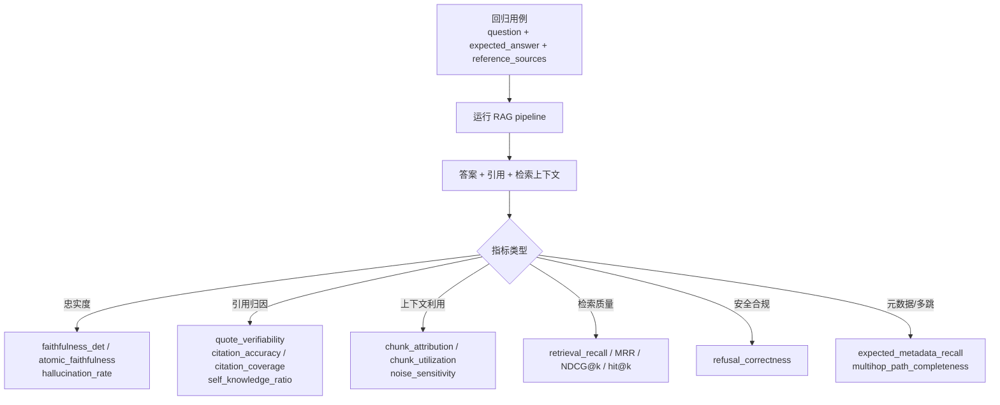
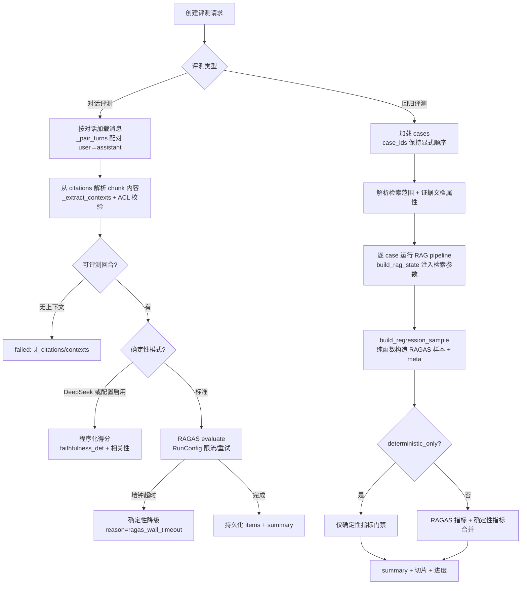

MimirQ 的评测体系以「**指标（Metrics）**、**题集（Question Sets）**、**RAGAS 运行时**」为三大支柱，将 RAG 质量从主观感受转化为可复现、可回归、可解释、可审计的工程事实。其核心设计原则（取自评测成熟度模型文档）包括：**CI 中尽量使用确定性指标**、**默认 PII-safe**、**切片优先（slice-first）**、**比较前先版本化一切**——数据集、pipeline 配置、检索配置、重排配置、judge 模型与阈值文件都在被版本化之列。
Sources: [evaluation_maturity_model.md](docs/guides/evaluation_maturity_model.md#L9-L25)

## 指标体系：LLM 判定与程序化指标的双轨结构

评测指标在代码层被显式划分为两个集合（`RAGAS_REGRESSION_METRICS` 与 `DETERMINISTIC_REGRESSION_METRICS`），并在每次回归运行开始时通过 `split_regression_metric_names` 拆分路由：RAGAS 指标交给 LLM 判定管线，确定性指标走本地程序化计算。
Sources: [ragas.py](app/rag/evaluation/ragas.py#L71-L116)、[ragas.py](app/rag/evaluation/ragas.py#L189-L197)

### RAGAS（LLM 判定）指标

`_resolve_metrics` 将用户友好的指标名映射为 ragas 库的 metric 对象，支持 10 种指标：

| 指标 | 类别 | 说明 |
|---|---|---|
| `faithfulness` | 忠实度 | 答案是否忠于检索上下文 |
| `response_relevancy` / `answer_relevancy` | 相关性 | 回答是否真正回应问题（同义别名） |
| `answer_similarity` | 语义相似 | 与参考答案的嵌入相似度 |
| `answer_correctness` | 正确性 | 结合事实正确性与语义相似度 |
| `context_recall` | 上下文召回 | 参考证据是否被检索到 |
| `context_precision` | 上下文精确 | 引用上下文是否足够精准 |
| `id_based_context_recall/precision` | ID 级上下文 | 基于 chunk id 匹配的召回/精确 |
| `llm_context_precision_without_reference` | 无参考精确 | 无参考答案时的 LLM 上下文判定 |

未指定指标时默认回退到 `faithfulness + response_relevancy` 组合。`response_relevancy` 的 strictness 参数按评测 LLM 自适应：DeepSeek 系模型使用 strictness=1（其指令遵循能力较弱），其余模型默认 3，也可通过 `RAGAS_RESPONSE_RELEVANCY_STRICTNESS` 显式配置。
Sources: [ragas.py](app/rag/evaluation/ragas.py#L1239-L1290)、[ragas.py](app/rag/evaluation/ragas.py#L1309-L1316)

### 程序化（确定性）指标

确定性地计算答案级、引用级、检索级与多跳级指标，**不依赖 judge LLM**，可低成本地用于 CI 门禁：

确定性指标的计算原理值得展开——它们构成了回归门禁的可靠底座：

- **`faithfulness_det`（确定性忠实度代理）**：将答案拆分为原子声明（最多 24 条），逐条检查声明是否被拼接后的证据文本支持，得分为支持声明数 / 总声明数；`hallucination_rate` 为其互补值（1 − faithfulness），`atomic_faithfulness` 在元数据缺失时回退取 `faithfulness_det` 的值。
- **`quote_verifiability`（引文可验证性）**：正则提取答案中 4–500 字符的引号片段，计算能在检索上下文中回查到的比例，是「回答是否凭空引用」的轻量探针。
- **`refusal_correctness`**：对 `is_unanswerable` 用例，判断系统是否给出了拒答表述（基于中文/英文拒答正则），布尔值转为 1.0/0.0 分。
- **检索指标**：`retrieval_recall`、`retrieval_hit_at_k` 等通过人工标注证据（reference_sources）与检索/引用 chunk 的多策略匹配计算——优先 chunk_id 精确匹配，其次 `doc_pipeline_key + chunk_index` 版本稳定匹配，最后退化为引文签名子串匹配（应对 id 漂移）。
- **元数据与多跳指标**：`expected_metadata_recall` 校验引用是否携带用例 `extra` 中声明的预期元数据（如 pipeline_hash、chunk_strategy、semantic_keys）；多跳指标（`multihop_path_completeness`、`multihop_order_consistency`、`multihop_chain_hit_rate`）校验推理链证据的完整性与顺序一致性。
Sources: [regression_sample_builder.py](app/rag/evaluation/regression_sample_builder.py#L450-L502)、[ragas.py](app/rag/evaluation/ragas.py#L200-L235)、[answer_det.py](app/rag/evaluation/metrics/answer_det.py#L17-L49)

此外，独立的 `metrics/` 模块提供评测运行时的辅助度量：`answer_det`（答案 EM/F1、明显幻觉标记）、`retrieval`（recall@k、citation_coverage）、`fusion`（多路融合质量）、`routing`（路由准确性）、`decomposition`（查询分解质量），并统一通过 `adapt_ragas_scores` 将 RAGAS 原始分数规范化为 `{"provider": "ragas", "scores": {...}}` 结构。
Sources: [metrics/__init__.py](app/rag/evaluation/metrics/__init__.py#L1-L15)、[ragas_adapter.py](app/rag/evaluation/metrics/ragas_adapter.py#L7-L15)

## 题集体系：从结构化样本到 Golden 回归用例

题集（评测数据集）在 MimirQ 中分为两条形态：**评测样本集**（用于路由/检索基准，仓库内种子数据）与 **Golden 回归用例**（数据库持久化的 `RagasRegressionCase`，面向持续回归）。

### 评测样本 Schema v1

`datasets/schema.py` 定义统一的样本结构 `mimirq.eval.dataset.sample.v1`，每个样本包含：`query_type`（factual / multi_hop / structured / unanswerable）、`source_type`（real_log / manual_seed / adversarial / synthetic）、`gold_answer`、`gold_chunk_ids`（标注证据）、`is_unanswerable`、`expected_route`（retrieval / kg / hybrid / agentic）、标注与评审状态（`annotation_status` / `review_status`）、`parent_sample_ids`（溯源）、`critique` 与 `tags`。这一 schema 同时是合成样本生成与仓库内数据集校验的规范基础。
Sources: [schema.py](app/rag/evaluation/datasets/schema.py#L4-L54)

仓库内置了两级种子集，均带 manifest 元数据（样本数、source/query 类型分布、版本号）：

| 数据集 | 定位 | 内容构成 |
|---|---|---|
| `stage1-seed` | 真实流量导向的首批种子（4 条） | real_log 2 + manual_seed 1 + adversarial 1；覆盖 factual/multi_hop/structured/unanswerable 四种查询类型；`expected_route` 标注了路由期望 |
| `stage3-adversarial` | 对抗与护栏（3 条） | 硬负例（hard_negative.jsonl）、PII 陷阱（pii_trap.jsonl）、提示注入（prompt_injection.jsonl） |
| `stage3-domain` | 领域题集（finance/legal/support） | 按业务领域组织的回归样本 |

`stage1/seed.jsonl` 示例揭示了样本的现实语义：`"485 怎么配置？"`（factual/retrieval）、`"根据报警日志和设备状态，为什么 485 会掉线？"`（multi_hop/hybrid）、`"X9 新型号怎么接线？"`（unanswerable，`is_unanswerable=true` 且 `gold_chunk_ids` 为空——用于测试拒答行为）。
Sources: [stage1/manifest.json](app/rag/evaluation/datasets/stage1/manifest.json#L1-L18)、[stage1/seed.jsonl](app/rag/evaluation/datasets/stage1/seed.jsonl#L1-L4)、[stage3_adversarial/manifest.json](app/rag/evaluation/datasets/stage3_adversarial/manifest.json#L1-L17)

### Golden 回归用例与检索范围解析

回归用例（`RagasRegressionCase`）是评测题集在数据库中的持久化形态，字段设计直接支撑评测语义：`question`（问题）、`expected_answer`（参考答案）、`reference_sources`（**人工验证过的证据指针**：document_id + chunk_id + 可选审计字段，这是检索质量指标的事实基准）、`document_ids`（限制检索范围）、`dataset_id`（数据集级范围）、`tags` 与 `extra`（承载预期元数据、答案要点、别名等扩展信息）。

检索范围按优先级解析：**case 级 document_ids → dataset_id 级范围 → 开放范围（租户 + ACL 裁剪）**。这一设计使同一个题集可以被文档级、数据集级或全库级三种粒度复用，同时每层都经过 `filter_allowed_document_ids` 的 ACL 防御性校验。
Sources: [evaluation.py](app/models/evaluation.py#L74-L95)、[ragas.py](app/rag/evaluation/ragas.py#L1214-L1236)

### 题集的规模化来源

题集不依赖手工录入，具备三条规模化路径：

1. **测试生成（LLM）**：`test_generator.py` 提供两类生成——从文档切块生成（factual/multi_hop/comparison/conditional/unanswerable 五种题型，prompt 中明确要求 unanswerable 题的 `expected_answer` 为空且 `expected_refusal=true`）与从对话历史提炼改写（优先保留高质量 assistant 回答作为参考答案）。生成结果可自动保存为回归用例。
2. **合成样本**：`synthetic/generator.py` 以种子行为父样本，通过 `parent_sample_ids` 保留血缘，`construction_method="llm_generate"` 标注来源，配合 `synthetic/critic.py` 做质量批判与过滤。
3. **硬负例挖掘**：`hard_negative_mining.py` 从回归 trace 中挖掘「排在第一正例之前的近失负例」用于 LTR 训练，输出**按构造即 PII-safe**——只保留 chunk_id、document_id、rank 与数值分数，绝不包含原始查询与文档文本；并做了每文档负例上限（默认 2）的聚类式治理，防止对单一文档过拟合。
Sources: [test_generator.py](app/rag/evaluation/test_generator.py#L84-L139)、[generator.py](app/rag/evaluation/synthetic/generator.py#L7-L19)、[hard_negative_mining.py](app/rag/evaluation/hard_negative_mining.py#L91-L200)

## RAGAS 运行时：对话评测与回归评测

评测执行以 FastAPI BackgroundTasks 方式异步运行，两条主流程共享底层 RAGAS 运行时（EvaluationDataset、SingleTurnSample、evaluate、LangchainLLMWrapper/LangchainEmbeddingsWrapper）。

### 对话评测（Conversation Evaluation）

`run_conversation_ragas_evaluation` 的流程：加载会话消息 → `_pair_turns` 按序配对 user→assistant（保留最新 user 消息）→ `_extract_contexts` 从存储的 citations 解析完整 chunk 内容（保持引用顺序，支持非 chunk 型引用的回退文本，并在文档级做 ACL 二次校验）→ 逐回合构造 `SingleTurnSample`。关键工程细节：

- **可评测性前置检查**：`skip_empty_contexts` 跳过无上下文的回合；`max_turns` 只取最近的 N 轮。
- **确定性降级策略**：当评测 LLM 为 DeepSeek 系（指令遵循兼容性考虑）或配置 `RAGAS_CONVERSATION_DETERMINISTIC_MODE_ENABLED` 时，直接走 `_build_conversation_deterministic_scores`（程序化 faithfulness + 基于 token 重合的相关性 + quote 可验证性）；**RAGAS 评测若超过墙钟超时（默认 90s）也会自动降级**，并在 summary 中记录 `reason=ragas_wall_timeout` 与 `ragas_attempted=true`，保证评测永不悬挂。
- **成本可观测**：通过 LangChain `get_openai_callback` 采集 eval LLM 的输入/输出 token 与估算成本（USD），写入 summary 的 `eval_llm_tokens_input_ragas` / `eval_estimated_cost_usd_ragas` 等字段。
Sources: [ragas.py](app/rag/evaluation/ragas.py#L1522-L1818)、[ragas.py](app/rag/evaluation/ragas.py#L296-L312)、[ragas.py](app/rag/evaluation/ragas.py#L1335-L1382)

### 回归评测（Regression Evaluation）

`run_regression_ragas_evaluation` 是评测体系的重量级路径：**逐用例驱动真实 RAG pipeline**（LangGraph 图或函数式 API），支持通过 `rag_params` 注入完整的检索/重排/提示词参数——retrieval_profile、query 扩展（多查询、HyDE、改写）、混合检索 alpha、MMR、重排器、prompt 模板与 A/B 实验键。每个用例的 `sample_kwargs` 由纯函数 `build_regression_sample` 构造（无 DB 访问、可单元测试），其中包含：

- **检索质量信号（非 LLM）**：基于 reference_sources 的 recall、hit@k，匹配策略为 chunk_id 精确 → doc_pipeline_key+chunk_index 稳定 → 引文签名子串。
- **元数据校验**：`expected_metadata_*` 系列校验引用的 pipeline 指纹、切块策略、语义键等。
- **切片信息**：从证据文档的属性（file_type、language、directory、pipeline_hash、quality_bucket、access_mode、parse_quality_bucket、chunk_quality_bucket）推导 `slice_*` 键，供报告做切片对比，避免全局均值掩盖回归。

`deterministic_only` 模式可完全脱离 RAGAS 依赖运行——只生成答案并计算确定性指标，用于 CI 门禁。正常模式则合并 RAGAS 分数与确定性分数到同一个 `RagasRegressionItem.scores`。显式传入的 `case_ids` 保持输入顺序、不重排、不截断，保证回归结果可复现。
Sources: [ragas.py](app/rag/evaluation/ragas.py#L1821-L1887)、[ragas.py](app/rag/evaluation/ragas.py#L2100-L2299)、[ragas.py](app/rag/evaluation/ragas.py#L2400-L2467)

### LLM-as-Judge 双通道

除 RAGAS 官方指标外，体系内置独立的 LLM judge（`_run_llm_judge`），以严格 JSON 输出评分：`retrieval` 通道只判上下文质量（1.0 高度相关充分 → 0.0 无关噪声），`generation` 通道判答案质量（含「部分支持/幻觉」的梯度）。judge 版本通过 `_llm_judge_version_hash` 对模型、temperature、评分规则与生成 prompt 内容做稳定哈希，**任何 judge 模型或 prompt 变更都会产生新版本号**——这是评测可比性的版本化基石。judge 的 evidence_quotes 被限制为从给定上下文逐字复制（≤160 字符、最多 3 条），杜绝幻觉引用。
Sources: [ragas.py](app/rag/evaluation/ragas.py#L868-L947)、[ragas.py](app/rag/evaluation/ragas.py#L1032-L1067)

## 结果、报告与成熟度演进

### 运行结果结构

对话评测与回归评测的结果分别持久化到 `RagasEvaluationItem` / `RagasRegressionItem`（逐回合/逐用例 scores），聚合 summary 包含：指标均值、进度（`progress.mode/processed_cases/percent`）、eval token 与成本、以及 `_merge_summary_with_regression_gate` 合并的回归门禁汇总（含确定性指标均值）。回归运行还支持 leaderboard（跨运行对比）、diff（基线 vs 候选的 summary 对比 + HTML 导出）与 ablation 网格批量。
Sources: [evaluation.py](app/models/evaluation.py#L98-L141)、[evaluations.py](app/api/v1/evaluations.py#L1375-L1430)

### 评测成熟度模型

`docs/guides/evaluation_maturity_model.md` 将评测演进定义为五级阶梯：L0 临时 QA → L1 可复现 Golden 题集 → L2 确定性检索门禁进 CI（merge-blocking）→ L3 答案级评测（定时、预算化、diff 优先）→ L4 持续评测与治理（硬负例挖掘、夜间消融、provider 对齐、fail-closed 策略）。**关键反模式提醒**：不要用非确定性 judge 评测做 merge 拦截——检索质量用确定性指标门禁，judge 评测作为定时信号。MimirQ 对每个级别都提供了对应构件（回归门禁、阈值文件、消融 runner 等）。
Sources: [evaluation_maturity_model.md](docs/guides/evaluation_maturity_model.md#L75-L156)

### 前端工作台与 API 面

评测页面（`web/app/evaluations/page.tsx`）以三 Tab 组织：**对话评测**（基于已有对话与引用上下文快速拉起 RAGAS 评测）、**Golden 评测集**（数据集级标准问答的持续回归）、**检索集健康度**（Queryset Health 趋势与退化标记）。指标选择器（`ragas-metric-selector.tsx`）对每个指标标注了类别徽章（忠实度/相关性/上下文/引用归因/鲁棒性/安全合规）与成本标签（LLM/低成本），并用「程序化」标签区分确定性指标——这直接映射了后端 `kind: 'RAGAS' | '程序化'` 的二元结构。API 层（`/api/v1/evaluations.py`）提供完整面：评测 run CRUD、回归用例 CRUD/导入导出/合成硬例生成、回归 run 创建/leaderboard/diff/purge、测试生成（from-documents / from-conversations）、对话可评测性预检（`/ragas/readiness`）以及 KG 检索诊断。
Sources: [page.tsx](web/app/evaluations/page.tsx#L106-L134)、[ragas-metric-selector.tsx](web/components/evaluation/ragas-metric-selector.tsx#L16-L30)、[evaluations.py](app/api/v1/evaluations.py#L551-L551)

### 在线评测采样

生产环境侧，`online_eval_service.py` 以默认 5% 的稳定采样率（基于 `tenant_id:request_id` 的 SHA-256 哈希判定，跨 worker 可预测、无 RNG 漂移）对线上 RAG 请求计算轻量确定性信号：`faithfulness_det`（与回归同构的声明支持率）与 `chunk_utilization`（被使用 chunk / 检索 chunk），写入 PII-minimal 的 JSONL 指标日志，并提供窗口化 dashboard summary（均值、时序桶、告警）。这形成了「离线题集评测（深）+ 在线采样评测（浅）」的双层质量观测。
Sources: [online_eval_service.py](app/services/online_eval_service.py#L1-L11)、[online_eval_service.py](app/services/online_eval_service.py#L103-L160)

### 下一步阅读

评测是持续质量体系的开端。建议继续阅读 [回归门禁与发布质量卡口](19-hui-gui-men-jin-yu-fa-bu-zhi-liang-qia-kou) 了解确定性指标如何转化为 CI 阈值门禁，以及 [反馈闭环与在线评测](20-fan-kui-bi-huan-yu-zai-xian-ping-ce) 了解在线采样信号如何回流到题集与模型迭代。若想深入评测的执行载体，可回看 [RAG 对话引擎与流式输出](16-rag-dui-hua-yin-qing-yu-liu-shi-shu-chu)（评测驱动的正是这条 pipeline）与 [重排器体系与 LTR 排序学习](15-zhong-pai-qi-ti-xi-yu-ltr-pai-xu-xue-xi)（硬负例挖掘的输出正是 LTR 的训练输入）。