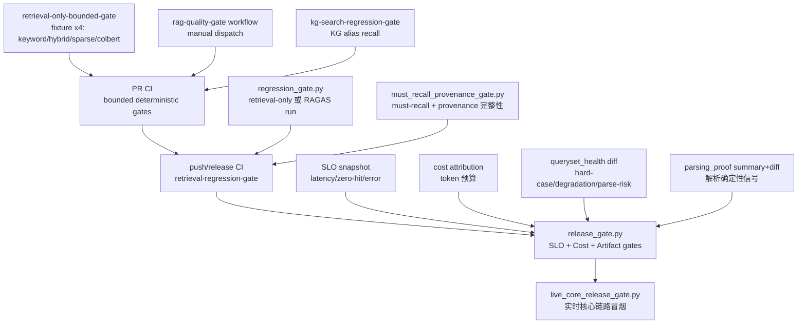
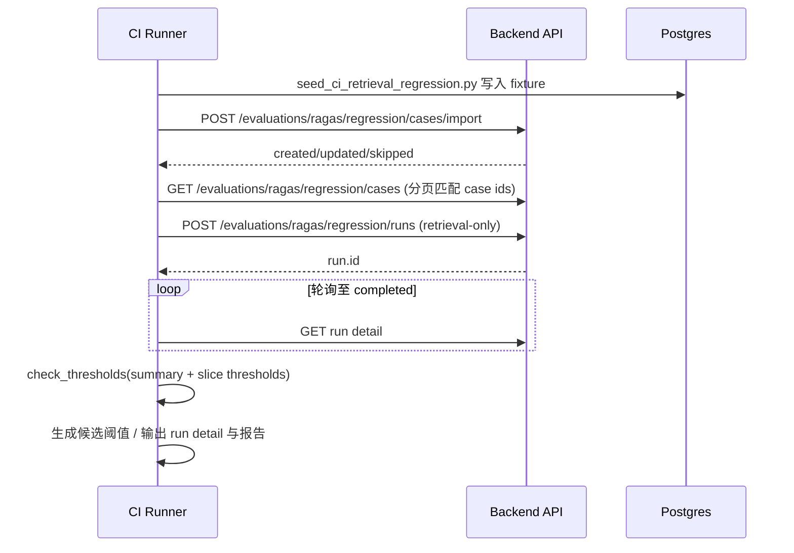
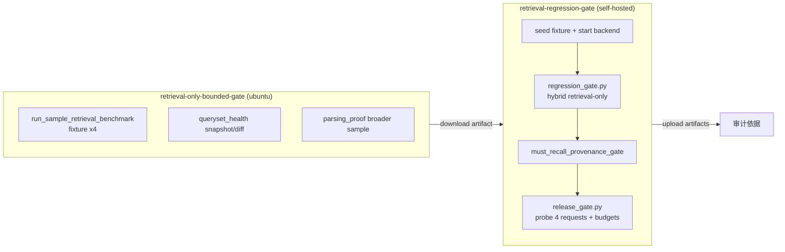

本章剖析 MimirQ 的离线质量防线：如何把"已有 RAGAS 回归能力"升级为企业级可复现、可 gate 的 CI 门禁，并将回归信号与 SLO、成本预算、查询集健康度、解析证明等多元信号汇聚为统一的发布质量卡口。核心命题是：**在"确定性、可复现、无外部依赖"与"贴近生产、覆盖多维度质量"之间取得平衡**——这也是本页所有设计的出发点。

## 门禁体系的分层架构

MimirQ 的质量门禁不是单一脚本，而是按执行成本与信号确定性递进的四层防线。越靠前的层越轻量、越确定，越靠后的层越接近生产语义、越综合。



各层职责边界清晰：bounded gate 用最小确定性 fixture 在 PR 阶段拦截"检索链路结构性破坏"；回归门禁在 push/release 阶段对完整 seed 数据集做阈值校验；发布卡口则把运行期 SLO、成本与离线工件 diff 聚合为单一 pass/fail 决策；实时核心门禁对正在运行的实例做端到端冒烟。四层共享同一套阈值语义（`min/max` 边界、`warn/fail` 策略），这是整个体系可组合的前提。

Sources: [docs/guides/regression_gate.md](../docs/guides/regression_gate.md#L1-L20), [docs/guides/release_gate.md](../docs/guides/release_gate.md#L1-L40), [.github/workflows/ci.yml](../.github/workflows/ci.yml#L1341-L1346)

## 回归门禁：regression_gate.py 的核心机制

`scripts/regression_gate.py` 是回归门禁的执行器，它通过纯 HTTP 调用后端 API 完成"导入用例 → 创建 run → 轮询 → 阈值判定"的完整闭环。脚本刻意保持 ops-friendly：不直接访问数据库，只消费 API 返回的数值型汇总，从构造上避免 PII 泄漏。

### 用例集导入与 bundle 归一化

脚本的输入用例集支持两种形态，`coerce_case_bundle` 负责归一化：

| 形态 | 结构 | 适用场景 |
|---|---|---|
| bundle v1 | `{"schema":"mimirq.regression_cases.v1","dataset_id":"...","items":[...]}` | UI 导出、Evidence Pack 工作流 |
| legacy 数组 | `[{"dataset_id":"...","question":"...","reference_sources":[...]}]` | 早期用例文件 |

bundle 中的 `items[]` 支持可选 multi-hop 字段（`reasoning_hops` 有序推理步骤、`evidence_chain` 有序证据链），为多跳评测提供结构化的 ground truth。导入时按 `question + dataset_id` 匹配做覆盖更新，脚本随后通过分页 list 接口解析出匹配的 case id 集合，用于创建回归 run。

Sources: [docs/guides/regression_gate.md](../docs/guides/regression_gate.md#L10-L40), [scripts/regression_gate.py](../scripts/regression_gate.py#L1378-L1450)

### retrieval-only 模式：不依赖 RAGAS/LLM 的确定性门禁

回归门禁最关键的工程决策是支持 **retrieval-only 模式**（`--metrics ""`）：只跑检索、不做生成、不导入/调用 ragas。这使得 CI 可以在完全离线的确定性环境（deterministic embedding + mock LLM + faiss 后端）中 gate 检索质量指标，消除了 LLM 非确定性与外部服务波动对门禁稳定性的干扰。其契约由 `is_empty_metrics_allowed` 强制：metrics 为空时必须提供 `--thresholds`（gating 模式）或 `--generate-thresholds-out`（baseline 生成模式），二者必居其一。



retrieval-only run 的 summary 中新增了一组检索质量指标：`retrieval_recall`（证据召回率）、`retrieval_hit_at_1/3/5/10/20`（命中率）、`retrieval_mrr`、`retrieval_ndcg_at_10/20`、`multihop_path_completeness`、`multihop_order_consistency`、`abstain_rate`（拒答率，用于严格可见证据模式的安全回归）以及 `must_recall_pass_rate`、`parse_quality_*` 系列解析质量信号。

Sources: [docs/guides/regression_gate.md](../docs/guides/regression_gate.md#L60-L120), [scripts/regression_gate.py](../scripts/regression_gate.py#L1460-L1490)

### 阈值文件 v2：全局 + 切片双重约束

阈值文件演进到 `mimirq.thresholds.v2` schema，支持按维度桶（bucket）细分约束。`metrics` 段定义 top-level 阈值，`slices` 段允许对特定维度（如 `file_type=pdf`、`quality=high`）单独收紧或放宽。bucket key 自动 lowercase 归一化，保证大小写差异不导致误判。

```json
{
  "schema": "mimirq.thresholds.v2",
  "dataset_id": "11111111-1111-1111-1111-111111111111",
  "metrics": {
    "retrieval_recall": { "min": 1.0 },
    "abstain_rate": { "max": 0.0 }
  },
  "slices": {
    "file_type": {
      "pdf": { "retrieval_recall": { "min": 1.0 } }
    },
    "language": {
      "en": { "retrieval_recall": { "min": 1.0 } }
    }
  }
}
```

阈值语义支持两种写法：简写 `"faithfulness": 0.7` 等价于 `{"min": 0.7}`；完整写法 `{"min": 0.3, "max": 0.9}` 可表达双向边界。`check_thresholds` 对缺失指标直接判失败（fail-closed），并对 slice bucket 缺失同样报失败，避免切片数据不完整时静默通过。

阈值文件还内置两道防串用 guardrail：`dataset_id` 一致性校验（防止把 A 数据集的阈值套到 B 数据集）与 `case_source` 溯源钉扎（`compare_threshold_case_source` 要求 run 的用例来源与阈值基线来源逐字段一致，plugin_golden 来源会 pin 住 plugin_ref/version/package_hash，防止基线被意外替换）。

Sources: [docs/guides/regression_gate.md](../docs/guides/regression_gate.md#L120-L160), [scripts/regression_gate.py](../scripts/regression_gate.py#L860-L960), [ci/retrieval_thresholds.v2.json](../ci/retrieval_thresholds.v2.json#L1-L82)

### 从基线 run 生成阈值

CI 中常需要"先跑出基线、再固化阈值"。`--generate-thresholds-out` 从一次成功 run 的 summary 直接生成 `mimirq.thresholds.v2`（含 top-level 与 per-slice），生成时支持相对松弛 `--gen-rel-drop` 与绝对松弛 `--gen-abs-slack`，并可通过 `--gen-min-slice-items` 跳过小样本桶，避免小样本误导阈值。安全设计上，若目标文件已存在，脚本先打印 unified diff 再拒绝覆盖，必须显式加 `--gen-force` 才允许覆写——这防止了 CI 意外静默改写基线。

Sources: [docs/guides/regression_gate.md](../docs/guides/regression_gate.md#L160-L200), [scripts/regression_gate.py](../scripts/regression_gate.py#L1670-L1720)

## must-recall 与 provenance 门禁

回归 run 完成后，CI 还串联一道互补门禁：`scripts/must_recall_provenance_gate.py` 同时检查 `must_recall_pass_rate`（含 partial-miss recovery 的合同通过率）与 provenance 完整性（evidence capsule 存在且包含 capsule/citation hash）。其输出 `mimirq.must_recall_provenance_gate.v1` 报告与回归门禁报告一同上传为 CI artifact，作为发版审计依据。配套的 `must_recall_proof_audit.py` 进一步审计 proof 对象内部一致性：schema 正确性、`passed` 与 `missing_source_keys`/`obligation_ledger.missing_total` 的账目自洽、`failed` 状态是否携带 fail reasons。这一层把"检索命中"从数值指标下沉为可审计的证据链契约。

Sources: [docs/guides/regression_gate.md](../docs/guides/regression_gate.md#L200-L240), [scripts/must_recall_provenance_gate.py](../scripts/must_recall_provenance_gate.py#L113-L296)

## 发布质量卡口：release_gate.py 的信号汇聚

`scripts/release_gate.py` 是发布卡口的汇聚层：把回归门禁（可选）、SLO 快照、成本归因、以及多种离线工件（检索 leaderboard、查询集健康 diff、解析证明）聚合成**单一 pass/fail 决策**。脚本设计约束与回归门禁一脉相承：只通过 HTTP 消费已脱敏的数值/分类汇总，PII-safe by construction。

### 预算文件与判定语义

所有阈值集中在 `ci/release_gate_budgets.v1.json`（schema `mimirq.release_gate_budgets.v1`），按信号域分组：

| 信号域 | 预算项 | 默认阈值 |
|---|---|---|
| SLO（60m/1440m 窗口） | `retrieval_p95_elapsed_sec` / `retrieval_p99_elapsed_sec` | max 5.0s / max 15.0s |
| SLO | `zero_hit_rate` | max 0.25 |
| SLO | `error_rate` | max 0.05 |
| Cost（60m 窗口） | `llm_total_tokens_avg` / `llm_prompt_tokens_avg` | max 1500 / max 1450 |
| Cost | `embed_query_tokens_avg` / `retrieval_query_count_avg` | max 80 / max 2.0 |
| queryset diff | `hard_case_added_count` / `degradation_flag_added_count` / `parse_risk_tail_added_count` | max 0（fail） |
| parsing_proof | `hit_at_k_mean` / `mrr_mean` / `failed_case_count` | min 1.0 / min 1.0 / max 0（warn） |

判定语义有两个关键维度：**策略（policy）** 与 **数据充分性（insufficient data）**。`policy` 支持 `warn`（打印告警并继续，适合渐进上线）与 `fail`（违规则退出非零）。`on_insufficient_data` 同样支持 `fail/warn`：SLO 快照缺窗口、`rag_trace_count` 低于 `min_rag_trace_count` 时，fail 策略直接产生 `GateViolation`，warn 策略降级为 note。成本侧的平均 token 由 `cost-attribution` 接口原始计数除以 `rag_trace_count` 现场计算，而非信任上游预聚合值。

Sources: [ci/release_gate_budgets.v1.json](../ci/release_gate_budgets.v1.json#L1-L77), [scripts/release_gate.py](../scripts/release_gate.py#L354-L500)

### 探测流量与报告

发布卡口支持两种运行方式：已有生产流量/指标日志时用 `--skip-regression --skip-probe` 直接消费既有汇总；CI/staging 无流量时用 `--probe-chat-requests N` 发送 N 个非流式 chat 请求生成 `rag_trace` 记录，并轮询 `rag-metrics/summary` 直到 `rag_trace_count` 达到预期增量。探测请求刻意稳定化（固定 retrieval_mode/top_k、关闭 multi_query 与 reranker），保证跨配置可比。最终产出 `mimirq.release_gate_report.v1` JSON 报告与 Markdown 摘要，包含各信号域的 `observed` 字段、`violations[]` 明细与 `passed` 布尔值；退出码语义为 0=pass、2=gate failed（预算违例/数据不足且 fail 策略）、1=意外错误。

Sources: [scripts/release_gate.py](../scripts/release_gate.py#L190-L350), [scripts/release_gate.py](../scripts/release_gate.py#L1400-L1488)

## CI 集成：任务编排与工件链

GitHub Actions 中，门禁按依赖关系编排为流水线：`retrieval-only-bounded-gate` 产出确定性工件（四路 fixture 基准 + 查询集健康快照 + 解析证明样本），`retrieval-regression-gate` job 依赖其产物，在独立 Postgres 服务中 seed fixture、启动离线后端（faiss + deterministic embedding + mock LLM + BM25）、执行回归门禁与 must-recall 门禁，最后用 `--probe-chat-requests 4 --probe-retrieval-mode hybrid` 生成指标流量并运行发布卡口。整个 job 还包含"基线 vs 生成阈值"的 diff 输出步骤，将 `ci/retrieval_thresholds.v2.json` 与 `artifacts/thresholds.generated.json` 的差异固化为 artifact，供人工审阅阈值漂移。



注意 `retrieval-regression-gate` 的 `if: github.event_name != 'pull_request'` 条件——PR 阶段只跑 bounded gate 与 live core gate，重型的回归/发布卡口保留给 push 与 release 事件，避免 PR 高频迭代被数十分钟的完整链路拖慢。另外 `rag-quality-gate.yml` 是独立可手动触发的 workflow（`workflow_dispatch`），用于对答案质量摘要与解析证明做按需深度检查，其关键路径（fixture/脚本/阈值）被 `tests/test_ci_workflow_contracts.py` 以契约测试方式钉扎，防止门禁输入输出失联。

Sources: [.github/workflows/ci.yml](../.github/workflows/ci.yml#L1341-L1620), [.github/workflows/rag-quality-gate.yml](../.github/workflows/rag-quality-gate.yml#L1-L93)

## 实时核心门禁：live_core_release_gate.py

与离线门禁互补，`scripts/live_core_release_gate.py` 对**正在运行的实例**做端到端冒烟，验证六类核心契约：ready 检查与主租户上传→证据检索、重复上传幂等（同字节+pipeline 得同 document id）、检索串行 vs 并发吞吐对比、跨租户检索隔离（403/404 预期拒绝）、dataset-analysis PNG 导出跨 API 实例共享状态、以及 abandoned PNG worker 最终到达 failed/worker_lost。该门禁在 PR CI（`scripts/run_ci_live_core_gate.sh`，双实例）与 docker CI 中均有接入，测试覆盖（`tests/test_live_core_release_gate.py`，12 个用例）验证了 happy path、幂等失败、跨租户拒绝、清理兜底等分支。这一层捕捉的是离线门禁无法覆盖的**部署拓扑与并发语义**问题。

Sources: [scripts/live_core_release_gate.py](../scripts/live_core_release_gate.py#L1-L60), [tests/test_live_core_release_gate.py](../tests/test_live_core_release_gate.py#L70-L634)

## 可扩展门禁家族

除核心四层外，仓库以相同阈值语义衍生出门禁家族，按关注点正交扩展：

| 门禁 | 脚本 | 阈值文件 | 定位 |
|---|---|---|---|
| KG Search Gate | `scripts/kg_search_regression_gate.py` | `ci/kg_search_thresholds.v1.json` | 基于 `/evaluations/kg/search/diagnostics` 的 baseline_hit_rate/mrr/recall，alias-driven recall，不需要 Milvus/embeddings |
| Answer Quality Gate | `scripts/answer_quality_gate.py` | `ci/answer_quality_thresholds.v1.json` | 对答案侧 summary 做 deterministic 检查，支持 `required:false` 的缺失容忍 |
| Parsing Proof Gate | `scripts/parsing_retrieval_proof_gate.py` | `ci/parsing_retrieval_proof_thresholds.v1.json` | `hit_at_k_mean`/`mrr_mean` 解析确定性证明 |
| Chunk Quality Gate | `scripts/deepdoc_quality_gate.py` | — | 入库前切块质量门禁（详见[数据治理画像与入库质量门禁](12-shu-ju-zhi-li-hua-xiang-yu-ru-ku-zhi-liang-men-jin)） |

KG Search Gate 同样支持 `--skip-import`、`--overwrite`、dataset_id guardrail 与阈值文件解析，与回归门禁共享 CLI 约定，降低使用心智负担。

Sources: [scripts/kg_search_regression_gate.py](../scripts/kg_search_regression_gate.py#L85-L274), [scripts/answer_quality_gate.py](../scripts/answer_quality_gate.py#L34-L129), [ci/answer_quality_thresholds.v1.json](../ci/answer_quality_thresholds.v1.json#L1-L22), [ci/parsing_retrieval_proof_thresholds.v1.json](../ci/parsing_retrieval_proof_thresholds.v1.json#L1-L14)

## 设计原则与最佳实践

从整体观察，这套门禁体系沉淀了四条可迁移的设计原则：

1. **确定性优先**：CI 路径刻意用 deterministic embedding、mock LLM、faiss、BM25 构建完全离线的可复现环境，把"检索链路是否破坏"与"模型质量波动"解耦——前者必须 100% 确定，后者交给 RAGAS 评测与在线反馈闭环（见[反馈闭环与在线评测](20-fan-kui-bi-huan-yu-zai-xian-ping-ce)）。
2. **信号按域隔离、决策统一汇聚**：回归、SLO、成本、查询集健康、解析证明各自独立成 gate 函数，统一由 `GateViolation` 数据结构与 `_check_threshold` 判定，最后聚合成单一 `passed` 布尔值——既保持扩展性，又保证决策口径一致。
3. **warn/fail 渐进策略**：新信号（如解析证明、查询集健康）默认 `warn` 模式进入报告，成熟后才切换 `fail`，避免一次引入多个硬门禁造成发布阻塞。
4. **防漂移的钉扎机制**：dataset_id 校验、case_source 溯源、阈值文件覆盖保护、基线 vs 生成阈值 diff，四重机制共同防止"门禁形同虚设"的隐性退化。

落地建议：新增质量信号时，先以 `warn` 策略接入 release gate 报告观察数周，同步用 `--generate-thresholds-out` 从真实基线固化阈值，再切换 `fail`；PR 阶段维持 bounded gate + live core gate 的轻量组合，重型回归卡口留给 push/release 事件。评测体系与指标定义可参考[评测体系：指标、题集与 RAGAS](18-ping-ce-ti-xi-zhi-biao-ti-ji-yu-ragas)，CI 全貌见[CI/CD 与测试体系](29-ci-cd-yu-ce-shi-ti-xi)。