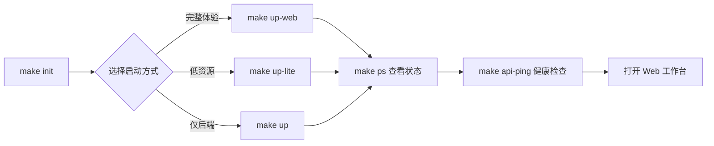
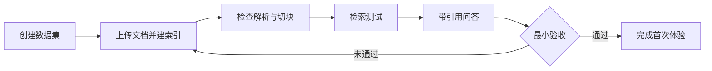

本页面向第一次接触 MimirQ 的开发者与运营人员，目标是**用最短路径把系统跑起来并完成一次完整的知识问答体验**。你将依次完成：克隆仓库、生成本地配置、填写模型密钥、启动服务、首次登录，最后跑通「建数据集 → 上传文档 → 建索引 → 检索 → 带引用问答」的完整闭环。更深入的部署方式差异、模型服务选型与架构原理，会通过文末的目录链接指向对应页面。

## 启动前的准备

MimirQ 的推荐体验方式是 Docker 一键启动：你只需要 Git、Docker 20.10+（含 Docker Compose 2.0+）和 GNU Make。官方建议机器配置为**至少 4 核 CPU、16 GB 内存和 50 GB 可用磁盘**，因为标准栈会同时运行 PostgreSQL、Milvus（含 Etcd 与 MinIO）、Redis、API、Worker 与 Web 共 8 个容器。如果机器资源紧张，可以改用轻量模式（见下文「选择启动方式」），用 Chroma 本地向量库替代 Milvus 与 MinIO。

```text
克隆仓库 → make init（生成 .env）→ 填写 LLM_API_KEY → make up-web → make api-ping → 打开 http://localhost:3000
```

Sources: [README.md](README.md#L168-L183)、[docs/quickstart.md](docs/quickstart.md#L3-L10)

## 第一步：克隆仓库并初始化本地配置

从仓库根目录执行两条命令：

```bash
git clone --depth 1 --single-branch https://github.com/xingranya/MimirQ.git
cd MimirQ
make init
```

`make init` 的核心作用是**非破坏性地创建本地环境文件**：它把 `.env.example` 复制为 `.env`、把 `web/.env.local.example` 复制为 `web/.env.local`，已存在的文件不会被覆盖。更重要的是，它会在 `.env` 中自动填充随机生成的 `SECRET_KEY`（JWT 签名密钥），并在两个环境文件中写入同一份 `MARKDOWN_IMAGE_PROXY_SECRET`（前端图片代理签名密钥）。这两把密钥是安全基线，**不要提交到版本库**；没有 GNU Make 的环境可以等价运行 `python scripts/init_env.py`。

Sources: [Makefile](Makefile#L177-L178)、[scripts/init_env.py](scripts/init_env.py#L45-L108)、[docs/guides/model_services.md](docs/guides/model_services.md#L7-L15)

## 第二步：填写最小模型配置

`.env` 有近两千行注释完整的配置项，但**快速体验只需要填写一个值**。默认配置指向硅基流动（SiliconFlow）的 OpenAI 兼容接口：对话模型为 `Qwen/Qwen3-32B`，Embedding 模型为 `BAAI/bge-m3`，Reranker 默认关闭。真实知识库闭环的最低要求是：

```dotenv
LLM_API_KEY=<your-siliconflow-api-key>
```

几个值得记住的规则：`EMBEDDING_API_KEY` 与 `EMBEDDING_API_BASE` 留空时会自动复用 `LLM_*` 的值；`ENABLE_RERANKER=true` 可以额外开启重排（默认关闭以省时延），此时 Reranker 地址必须是**完整的 rerank 请求端点**。如果你想在无人值守的情况下自动创建第一个管理员，可以顺带配置 `INITIAL_ADMIN_EMAIL`、`INITIAL_ADMIN_USERNAME` 与 `INITIAL_ADMIN_PASSWORD`（生产环境建议改用 `INITIAL_ADMIN_PASSWORD_FILE` 指向密码文件，两个密码来源二选一）。

| 变量 | 必填 | 作用 |
|:---|:---|:---|
| `LLM_API_KEY` | 是 | 默认对话与基础抽取的凭证，Embedding 默认复用 |
| `LLM_API_BASE` / `LLM_MODEL` | 否 | 默认值已适配硅基流动 |
| `EMBEDDING_API_KEY` / `EMBEDDING_API_BASE` | 否 | 留空时复用 `LLM_*` |
| `ENABLE_RERANKER` | 否 | 默认关闭；开启需完整 rerank 端点 |
| `INITIAL_ADMIN_*` | 否 | 可选但推荐，首次启动自动创建第一个 owner |

Sources: [docs/quickstart.md](docs/quickstart.md#L11-L43)、[docs/guides/model_services.md](docs/guides/model_services.md#L17-L31)、[.env.example](.env.example#L1-L9)

## 第三步：选择启动方式并验证服务

### 三种启动方式的定位



| 方式 | 命令 | 组件范围 | 适合场景 |
|:---|:---|:---|:---|
| **完整 Web 栈** | `make up-web` | Web + API + Worker + PostgreSQL + Milvus + Etcd + MinIO + Redis（8 容器） | 首次体验、团队试用、服务器部署 |
| **轻量模式** | `make up-lite` | Web 之外仅 PostgreSQL + Redis + API + Worker；向量库用 Chroma，无 MinIO | 笔记本、小内存机器、快速试跑 |
| **仅后端标准栈** | `make up` | 基础设施 + API + Worker，无 Web 容器 | API 调试、接自己的前端 |
| **检索实验栈** | `make up-retrieval-dev` | PostgreSQL + Redis + API，默认 LLM Mock、确定性 Embedding | 召回/排序离线对比，不依赖外部模型 |

> 三种启动命令内部都会先自动执行 `make init`，所以即使跳过第一步直接运行 `make up-web` 也不会出错。

### 启动与健康检查

```bash
make up-web        # 构建镜像并启动完整栈（首次构建约 3-8 分钟）
make ps            # 查看各容器状态
make api-ping      # 轮询后端健康端点
```

`make api-ping` 运行 `scripts/api_ping.py`，会依次探测后端公开健康端点并输出每个端点的状态码与耗时。后端就绪判断由 `/api/v1/health/ready` 承担：它逐一检查 PostgreSQL、向量库、Redis 与 MinIO 等运行依赖（空数据库首次建表可能耗时数分钟，Docker Compose 中 API 容器的健康检查为此预留了 240 秒启动窗口）。

启动完成后访问：

| 服务 | 地址 |
|:---|:---|
| **Web 工作台** | [http://localhost:3000](http://localhost:3000) |
| **API 交互文档（Swagger）** | [http://localhost:8000/docs](http://localhost:8000/docs) |
| **后端就绪探针** | [http://localhost:8000/api/v1/health/ready](http://localhost:8000/api/v1/health/ready) |

需要特别说明：`/api/v1/health/ready` 只验证基础设施依赖是否存活，**不代表外部模型已经连通**。模型调用是否可用，要到问答环节才能真正验证。

Sources: [Makefile](Makefile#L194-L204)、[Makefile](Makefile#L300-L303)、[Makefile](Makefile#L436-L440)、[docker/docker-compose.yml](docker/docker-compose.yml#L64-L263)、[docker/docker-compose.lite.yml](docker/docker-compose.lite.yml#L45-L134)、[docker/docker-compose.web.yml](docker/docker-compose.web.yml#L1-L47)、[app/api/v1/health.py](app/api/v1/health.py#L125-L200)、[docs/quickstart.md](docs/quickstart.md#L109-L120)、[docs/guides/model_services.md](docs/guides/model_services.md#L99-L122)

## 第四步：首次登录

首次登录有三种情况，取决于你启动前是否配置了 `INITIAL_ADMIN_*`：

| 情况 | 行为 | 登录方式 |
|:---|:---|:---|
| 已配置 `INITIAL_ADMIN_*` | API 启动阶段自动创建第一个 `owner`（幂等，重启不会重置密码） | 直接用该账号登录 |
| 未配置且数据库为空 | Web 页面显示「首次设置」，注册的第一个本地账户成为首个 owner | 在 `/auth` 页面完成注册 |
| 提示「首次初始化已关闭」 | 数据库中已存在租户或 owner，系统拒绝匿名注册 | 使用已有账号，或确认是可丢弃的本地环境后执行 `make docker-reset` 重建 |

自动创建 owner 的逻辑在 `bootstrap_initial_admin_if_configured`：它会校验邮箱、用户名与密码强度，检查身份是否与已有用户冲突，然后以 `owner` 角色把新用户挂到默认租户下。如果默认租户已存在其他成员，系统会**拒绝自动提权**，这是刻意为之的安全设计。

生产环境还有一个额外的注册门禁：当 `ENV=production` 时，首个 owner 的页面注册必须携带 `X-Bootstrap-Token` 请求头，令牌由 `INITIAL_REGISTRATION_TOKEN` 配置（支持明文或 `sha256:` 摘要形式）。开发环境默认不启用该门禁。

Sources: [app/services/initial_admin_service.py](app/services/initial_admin_service.py#L49-L100)、[app/services/initial_admin_service.py](app/services/initial_admin_service.py#L129-L190)、[app/main.py](app/main.py#L260-L270)、[app/api/v1/auth.py](app/api/v1/auth.py#L44-L98)、[web/app/auth/page.tsx](web/app/auth/page.tsx#L64-L76)、[docs/guides/model_services.md](docs/guides/model_services.md#L69-L97)

## 第五步：跑通第一个知识库闭环

登录之后，用一份小文档（建议无敏感信息、包含唯一测试短语的 PDF 或文本文件）走完下面的链路。这也是 `docs/user_guide.md` 定义的最小主流程：



1. **创建数据集**：打开 `/datasets`，点击「新建数据集」，填写名称与说明，选择访问范围（默认 `all_team_members` 允许租户成员读取；敏感资料应改用 `only_me`）。数据集是权限、索引与检索范围的边界。
2. **上传并建立索引**：打开 `/knowledge/ingestion`，执行阶段选择「解析 + 索引」，拖入文件并点击「解析并建索引」。等待文档状态从 `pending`、`processing` 进入 `completed`；`failed` 表示失败、`quarantined` 表示被治理规则隔离。
3. **检查解析与切块**：在 `/parsing` 查看解析任务，在 `/knowledge` 的文档列表查看生成的 Chunk；需要比较切块策略时可使用 `/chunk-preview`。
4. **验证检索**：在 `/knowledge` 中选择数据集，切换到「检索测试」，输入文档中可唯一命中的短语，检查返回的 Chunk、来源、分数与检索通道。
5. **验证带引用问答**：回到首页 `/`，选择刚创建的数据集，提问一个只能由测试文档回答的问题，展开「来源与证据」确认引用卡片指向正确文件与原文片段。

最小验收标准如下，五项全部满足才算真正跑通：

| 检查项 | 通过条件 |
|:---|:---|
| 服务 | `make api-ping` 通过 |
| 文档 | 状态为 `completed` |
| 检索 | 唯一短语能命中正确 Chunk |
| 问答 | 回答与文档一致，不凭空补充关键事实 |
| 引用 | 「来源与证据」能定位到正确文件和原文 |

想用脚本自动跑一遍入库链路，可以借助仓库自带的演示脚本：`BASE_URL="http://localhost:8000/api/v1" IDENTIFIER="you@example.com" PASSWORD="..." ./scripts/demo_ingestion_flow.sh`，它会以 `README.md` 为样本完成建数据集、上传、轮询解析状态的完整流程。

Sources: [docs/user_guide.md](docs/user_guide.md#L98-L176)、[docs/user_guide.md](docs/user_guide.md#L21-L31)、[scripts/demo_ingestion_flow.sh](scripts/demo_ingestion_flow.sh#L1-L30)

## 常见问题速查

| 现象 | 原因与处理 |
|:---|:---|
| `make api-ping` 长时间不通过 | 首次建库需要数分钟；用 `make ps` 观察 `mimirq-api` 是否 `healthy`，必要时 `make logs` 查看日志 |
| 服务启动成功但聊天报错 | `/api/v1/health/ready` 只检查基础设施，不检查模型；确认 `LLM_API_KEY` 有效、`LLM_MODEL` 与供应商实际模型名一致 |
| 页面提示「首次初始化已关闭」 | 数据库中已有租户或 owner；使用已有账号，或确认可丢弃后执行 `make docker-reset` 再 `make up-web` |
| 8000 端口被占用 | 修改 `.env` 中的 `BACKEND_PORT`，或在 `.env` 中调整 `WEB_PORT` 改变 3000 端口 |
| 更换 Embedding 模型后检索异常 | Embedding 维度/语义空间改变后必须重建已有索引，不能混用不同向量空间 |

## 接下来看什么

完成首次体验后，建议按目录顺序继续深入：

- 想了解三种部署方式在资源占用、数据持久化上的详细差异，见 [部署方式选择：完整栈、轻量与源码开发](3-bu-shu-fang-shi-xuan-ze-wan-zheng-zhan-qing-liang-yu-yuan-ma-kai-fa)
- 需要配置独立 LLM / Embedding / Reranker 服务或生产级管理员策略，见 [模型服务与首次管理员配置](4-mo-xing-fu-wu-yu-shou-ci-guan-li-yuan-pei-zhi)
- 想理解刚跑通的链路在架构上如何组织，见 [总体架构与技术栈](5-zong-ti-jia-gou-yu-ji-zhu-zhan)
- 深入理解数据集、切块与问答链路，见 [切块策略与索引构建](10-qie-kuai-ce-lue-yu-suo-yin-gou-jian)、[RAG 对话引擎与流式输出](16-rag-dui-hua-yin-qing-yu-liu-shi-shu-chu) 与 [引用、证据与可解释性机制](17-yin-yong-zheng-ju-yu-ke-jie-shi-xing-ji-zhi)