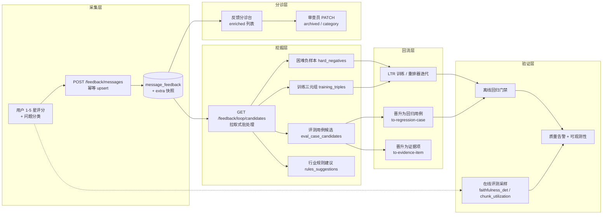

用户反馈与生产环境在线评测，是 MimirQ 评测体系中最贴近"真实使用"的两个环节：前者把终端用户对回答的评分沉淀为可分诊、可回流的数据资产；后者以极低成本持续监控生产 RAG 请求的质量信号。两者共同构成一个"采集 → 分诊 → 挖掘 → 回流 → 再验证"的闭环，与[评测体系：指标、题集与 RAGAS](18-ping-ce-ti-xi-zhi-biao-ti-ji-yu-ragas)的离线题集评测、[回归门禁与发布质量卡口](19-hui-gui-men-jin-yu-fa-bu-zhi-liang-qia-kou)的离线回归互为补充。

## 一、架构总览：从用户评分到模型迭代

整个反馈闭环可以抽象为五个阶段。注意其设计哲学是**"可审计、可追溯、低侵入"**：反馈写入时自动附带检索快照；候选挖掘是拉取式批处理而非实时监听；任何晋升动作都写审计日志。



核心数据模型 `MessageFeedback` 定义了反馈记录的最小完备集：评分（1-5）、原因、标签、期望答案、问题分类（`retrieval_miss`/`wrong_answer`/`out_of_scope`/`other`）、分类来源（`user`/`llm_auto`/`reviewer`），以及一条唯一约束 `(tenant_id, message_id, account_id)`——同一用户对同一消息的重复提交会更新而非新建。`extra` JSONB 字段承载服务端写入的检索快照与晋升状态。

Sources: [feedback.py](app/models/feedback.py#L18-L63)

## 二、用户反馈采集：评分、分类与快照增强

### 2.1 采集入口与幂等语义

前端在每条助手消息下渲染 5 星评分组件（`web/components/chat/message-item.tsx`），提交走 `POST /api/v1/feedback/messages`，由 `FeedbackService.upsert_message_feedback` 处理：

- **校验**：只允许对 `role == "assistant"` 的消息评分，且校验会话访问权限；分类字段仅对 1-2 分有效
- **幂等**：按 `(tenant_id, message_id, account_id)` 查重，存在则更新评分/原因/标签/期望答案，同时保留既有服务端字段
- **问题分类联动**：低分（≤2）时前端展示"没找到 / 答错了 / 超出范围"三个分类按钮，提交后写入 `category` 与 `category_source="user"`；若该条已被审查员打过分类（`category_source="reviewer"`），用户提交不会覆盖

Sources: [feedback_service.py](app/services/feedback_service.py#L232-L302) [message-item.tsx](web/components/chat/message-item.tsx#L598-L631)

### 2.2 检索上下文快照：让反馈"可复盘"

这是反馈闭环最有价值的设计：写入反馈时，服务端会尝试用 `request_id`（来自消息元数据）反查 RAG trace，并把以下内容自动附加到 `extra`：

- `dataset_id`（消息元数据优先，回退会话）
- `retrieval_trace_request_id` 与完整 `retrieval_trace`
- `rag_config_snapshot`（从 trace 的 retrieval 段提取的配置快照）

为了保护这些服务端写入的溯源字段，代码中定义了一组 `_SERVER_MANAGED_FEEDBACK_EXTRA_KEYS`，客户端提交的 `extra` 会被过滤，避免用户覆盖服务端血缘信息。同时 `query_hash`、`retrieval_trace_ref`、`profile`、`judge_score_ref` 等列直接由服务端计算或从消息元数据读取。

Sources: [feedback_service.py](app/services/feedback_service.py#L19-L36) [feedback_service.py](app/services/feedback_service.py#L100-L117) [feedback_service.py](app/services/feedback_service.py#L260-L315)

### 2.3 评分语义与分类语义

| 字段 | 取值 | 语义 |
|---|---|---|
| `rating` | 1-5（越高越好） | 1-2 视为负面，进入闭环候选；3 中性；4-5 正面 |
| `category` | `retrieval_miss` | 检索漏检：该引用的内容没被召回 |
| | `wrong_answer` | 生成错误：答案本身不正确（`generation_error` 归一化为此值） |
| | `out_of_scope` | 超出范围：问题不属于知识库范围 |
| | `other` | 其他（由数据库 CheckConstraint 兜底） |
| `category_source` | `user` / `llm_auto` / `reviewer` | 分类由谁标注，决定后续是否可被覆盖 |
| `expected_answer` | 自由文本 | 用户提供的期望答案，晋升回归用例时直接复用 |

Sources: [feedback.py](app/api/schemas/feedback.py#L12-L26) [feedback_service.py](app/services/feedback_service.py#L127-L135)

## 三、反馈分诊台：审查、归档与分类修正

### 3.1 分诊数据视图

`GET /api/v1/feedback/messages/enriched` 在基础列表上联查消息内容与会话标题（各截断至 4000 字符），专为分诊看板设计；基础列表 `GET /messages` 支持 `conversation_id`、`message_id`、`min_rating`、`max_rating` 过滤，按 `updated_at` 倒序分页，并默认按会话所有者隔离（`enforce_conversation_owner`）。前端看板（`web/app/knowledge/feedback/page-client.tsx`）围绕该接口构建了四个 Tab（全部 / 待分析 / 高优先级 / 已归档）、评分分布统计、正负中三类趋势与来源/时间范围过滤。

Sources: [feedback.py](app/api/v1/feedback.py#L214-L267) [feedback_service.py](app/services/feedback_service.py#L411-L471) [page-client.tsx](web/app/knowledge/feedback/page-client.tsx#L935-L945)

### 3.2 审查员操作与权限

`PATCH /api/v1/feedback/messages/{feedback_id}` 支持两类分诊操作，均需 `FEEDBACK_TRIAGE_WRITE`（`feedback_triage.write`，授予编辑角色）：

- **归档/恢复**：写入 `extra.archived`，归档时附带 `archived_at` 与 `archived_by`
- **分类修正**：审查员可为低分反馈重新指定根因分类，`category_source` 固定为 `reviewer`，此后用户提交不会覆盖

归档状态同时被闭环候选构建读取——已归档或已晋升（`eval_case_status` 为 `promoted`/`rejected`）的反馈会从候选集中排除。数据库迁移 `0019_add_feedback_triage_fields` 为分诊字段（category/category_source/query_hash/retrieval_trace_ref/profile/judge_score_ref）与 `(tenant_id, category)` 复合索引提供了 Schema 支撑。

Sources: [feedback.py](app/api/v1/feedback.py#L270-L295) [feedback_service.py](app/services/feedback_service.py#L474-L525) [rbac_service.py](app/services/rbac_service.py#L29) [0019_add_feedback_triage_fields.py](alembic/versions/0019_add_feedback_triage_fields.py#L13-L37)

## 四、反馈闭环候选挖掘：从负面反馈到训练资产

### 4.1 候选构建管线

`app/rag/feedback_loop/candidates.py` 的 `build_feedback_loop_candidates` 是闭环的核心引擎：输入负反馈行（`rating <= max_rating`，默认 2），输出四类候选资产。所有输出均为 **PII 安全**——不包含原始问题文本，只用 `query_hash` 关联。

| 候选类型 | Schema | 内容 | 用途 |
|---|---|---|---|
| `eval_case_candidates` | `mimirq.feedback_eval_case.v1` | 问题、期望答案、引用源（reference_sources）、分类、标签、血缘 ID，状态 `pending_review` | 待人工审查后晋升为回归用例 |
| `hard_negative_records` | `mimirq.hard_negatives.v1` | query_hash + 困难负样本 chunk_id 列表 | LTR 训练 / 重排器迭代 |
| `training_triples` | `mimirq.feedback_training_triple.v1` | 正样本 chunk_id + 负样本 chunk_id | 检索排序训练 |
| `rules_suggestions` | — | 术语表 / 模式 / 意图建议 | 行业规则包迭代 |

Sources: [candidates.py](app/rag/feedback_loop/candidates.py#L198-L267)

### 4.2 困难负样本挖掘算法

`mine_hard_negatives_for_case_from_trace` 定义了"困难负样本"的精确含义：**被检索召回、但不在引用源（reference_sources）中、且排名在首个正样本之前的 chunk**（即"近失" near-miss）。算法细节：

- 从 trace 的 citations 中按 rank 归一化去重（首现优先）
- 定位首个正样本的 rank，只取排在它之前的非正样本作为候选
- **治理约束**：每篇文档最多取 2 个负样本（`max_negatives_per_document`），避免对单文档过拟合
- 输出仅保留 chunk_id / document_id / rank 与数值分数，不含任何文本

该挖掘发生在**反馈提交时自动快照的检索 trace** 上，因此即使原始 trace 已过期，反馈记录的 `extra.retrieval_trace` 仍可作为挖掘输入。

Sources: [hard_negative_mining.py](app/rag/evaluation/hard_negative_mining.py#L91-L202)

### 4.3 拉取式调度器：刻意不做实时监听

`dispatcher.py` 的设计值得强调：**dispatcher 是纯 pull/batch 的**，不注册数据库插入监听器、不挂钩 webhook、不产生实时副作用。`dispatch_feedback_loop_batch` 接受 `rows` 或 `db + tenant_id + account_id` 两种输入，先构建候选，再将硬负样本写入 JSONL（默认 `./runs/feedback_loop/hard_negatives.jsonl`）。`dispatch_scheduled_feedback_loop_batch` 是给 cron/arq 调用方的便捷包装，仅修改 trigger 标记为 `scheduled`。

配套 API 遵循同样的审慎原则：`GET /feedback/loop/candidates` 只读预览；`POST /feedback/loop/hard-negatives/export` 默认 `dry_run=true`（只统计不写文件），且导出的 JSONL 带完整血缘 ID（source_feedback_ids / source_conversation_ids / source_message_ids）供审计复核。

Sources: [dispatcher.py](app/rag/feedback_loop/dispatcher.py#L12-L77) [hard_negative_promoter.py](app/rag/feedback_loop/hard_negative_promoter.py#L49-L86) [feedback.py](app/api/v1/feedback.py#L298-L382)

## 五、反馈晋升通道：进入离线评测与 LTR

### 5.1 反馈 → 回归用例

`POST /feedback/messages/{feedback_id}/to-regression-case` 把一条负反馈物化为 `RagasRegressionCase`（即[回归门禁与发布质量卡口](19-hui-gui-men-jin-yu-fa-bu-zhi-liang-qia-kou)的题集条目）。关键启发式：

- **问题推断**：取被评分助手消息之前最近的用户消息（回退占位符 `(missing user question)`）
- **数据集解析**：助手消息元数据的 `dataset_id` 优先，回退会话级 `dataset_id`；`include_document_scope=true` 时继承会话的 `document_ids` 作为检索范围
- **引用源**：优先取消息 citations，缺失时从检索 trace 的 citations 回填
- **状态回写**：成功后把反馈的 `extra.eval_case_status` 置为 `promoted` 并记录 `eval_case_id`、`eval_case_promoted_by`，重复晋升返回 409
- **审计**：写 `regression.case.create_from_feedback` 审计日志（同一事务提交）

Sources: [feedback.py](app/api/v1/feedback.py#L385-L572)

### 5.2 反馈 → 证据项

`POST /feedback/messages/{feedback_id}/to-evidence-item` 走另一条更审慎的路径：创建 `status="draft"` 的 `EvidenceItem` 挂入指定 `EvidenceSuite`，后续经审查/批准后再同步为回归用例（与[引用、证据与可解释性机制](17-yin-yong-zheng-ju-yu-ke-jie-shi-xing-ji-zhi)的证据工作流衔接）。该校验反馈的 `dataset_id` 与套件一致，引用源经 `_finalize_reference_sources` 归一化校验，并同样附带检索快照与审计日志。

### 5.3 反馈 → LTR 物化

`ltr_rollout_workflow.py` 的 `materialize_feedback_case` 把反馈规范化为 LTR 回滚捆绑包的输入结构（问题、期望答案、规范化引用源、标签与血缘 extra），使反馈可以直接参与[重排器体系与 LTR 排序学习](15-zhong-pai-qi-ti-xi-yu-ltr-pai-xu-xue-xi)的模型迭代数据准备。

Sources: [feedback.py](app/api/v1/feedback.py#L575-L768) [ltr_rollout_workflow.py](app/services/ltr_rollout_workflow.py#L159-L205)

## 六、在线评测：生产流量的低成本质量探针

### 6.1 设计目标与采样机制

在线评测的目标（代码 docstring 中的 P0）是：**对生产 RAG 请求按小比例采样（默认 5%），计算轻量、确定性的质量信号，输出 PII 最小化的指标记录**。采样使用 `_stable_sample`：对 `(tenant_id, request_id)` 做 SHA256 后取前 4 字节映射到 [0,1)，与采样率比较。这保证了**多 worker 环境下采样决策可复现**，不受进程内 RNG 漂移影响。

```mermaid
flowchart LR
    A[RAG 请求完成<br/>finalize_chat_response_sync] --> B{ONLINE_EVAL_ENABLED<br/>且指标日志开启?}
    B -->|否| Z[跳过]
    B -->|是| C{稳定采样<br/>SHA256(tenant, request_id) < 5%?}
    C -->|未命中| Z
    C -->|命中| D[入队有界队列<br/>queue max=500]
    D --> E[后台线程 worker]
    E --> F[计算 faithfulness_det<br/>claim 支持率代理]
    E --> G[计算 chunk_utilization<br/>used / retrieved]
    F & G --> H[写入 JSONL 指标日志<br/>event=online_eval]
    H --> I[summarize_online_quality<br/>窗口聚合 + 告警]
```

Sources: [online_eval_service.py](app/services/online_eval_service.py#L1-L11) [online_eval_service.py](app/services/online_eval_service.py#L103-L124)

### 6.2 两个确定性质量信号

- **`faithfulness_det`**：忠实度确定性代理。把答案拆分为原子 claim（上限 24 个），逐条在拼接的检索上下文（上限 24 个 chunk、总长 24000 字符）中做支持度检查，得分 = 受支持 claim 数 / 总 claim 数。与离线回归的 `faithfulness_det` 同构，保证线上线下口径一致
- **`chunk_utilization`**：块利用率 = 实际引用的 chunk 数 / 检索返回的 chunk 数，来自 `compute_chunk_diagnostics`，附带 chunk 归因统计（claims_total / claims_supported / chunks_total / chunks_used）

采集的上下文文本只在内存中参与计算，写入日志的 payload 不含问题原文——这是"PII 最小化"的落地方式。

Sources: [online_eval_service.py](app/services/online_eval_service.py#L127-L160) [online_eval_service.py](app/services/online_eval_service.py#L370-L398)

### 6.3 非阻塞入队与降级

`maybe_enqueue_online_eval` 严格遵循"不阻塞请求路径"原则：队列有界（默认 500），入队用 `put_nowait`，队列满时直接丢弃并写一条 `online_eval_drop` 指标（含 reason=queue_full），绝不等待。worker 是 daemon 线程，进程退出时通过 `atexit` 停止。所有异常在 worker 内捕获，只记 debug 日志。

Sources: [online_eval_service.py](app/services/online_eval_service.py#L333-L367) [online_eval_service.py](app/services/online_eval_service.py#L401-L459)

### 6.4 触发链路与配置

在线评测在对话最终化阶段触发：`chat_persistence.finalize_chat_response_sync` → `_maybe_enqueue_online_eval`，上下文从 citations 提取（chunk_content/quote/text，去重上限 24 条），检索模式从 metrics 或默认值解析。图谱模式（`use_graph=true`）在 `engine.py` 中另有直接调用点。相关配置集中在 `app/core/config.py`：

| 配置项 | 默认值 | 说明 |
|---|---|---|
| `ONLINE_EVAL_ENABLED` | `false` | 总开关（需同时开启 `ENABLE_METRICS_LOG`） |
| `ONLINE_EVAL_SAMPLE_RATE` | `0.05` | 采样率 |
| `ONLINE_EVAL_QUEUE_MAX` | `500` | 异步队列上限 |
| `ONLINE_EVAL_ALERT_MIN_SAMPLES_PER_BUCKET` | `10` | 触发告警的最小样本数 |
| `ONLINE_EVAL_ALERT_FAITHFULNESS_DET_MIN` | `0.6` | 忠实度告警阈值 |
| `ONLINE_EVAL_ALERT_CHUNK_UTILIZATION_MIN` | `0.12` | 块利用率告警阈值 |

Sources: [chat_persistence.py](app/services/chat_persistence.py#L140-L209) [chat_persistence.py](app/services/chat_persistence.py#L258-L279) [config.py](app/core/config.py#L1726-L1731)

### 6.5 聚合视图与告警

`summarize_online_quality` 从 JSONL 指标日志尾部读取（有界读取，默认 5MB，支持 `truncated` 标记），按时间窗口过滤 `event=="online_eval"` 记录，按 `bucket_minutes` 分桶聚合出时间序列（samples / faithfulness_det_avg / chunk_utilization_avg），并在**最新且样本足够的桶**上做阈值告警，产出 `quality_drop` 类告警（含指标、值、阈值、桶时间戳）。对外暴露为 `GET /api/v1/observability/online-quality/summary`（需管理员权限），前端在诊断页"在线质量"操作中展示。

Sources: [online_eval_service.py](app/services/online_eval_service.py#L178-L327) [observability.py](app/api/v1/observability.py#L521-L545) [observability.ts](web/types/observability.ts#L19-L34)

## 七、前端集成与端到端工作流

前端在三处集成反馈闭环：

1. **对话消息内评分**（`message-item.tsx`）：5 星评分 → 低分分类按钮 → 反馈记录生成后展示 `feedback_id` 并提供"送入证据库"（跳转 evidence workbench 并携带 feedback_id）与"转为回归用例"两个专家操作
2. **反馈分诊看板**（`web/app/knowledge/feedback/page-client.tsx`）：四 Tab 分诊、评分/类型/来源/时间过滤、正负中趋势统计、闭环候选指标卡（负反馈总数、硬负样本数、训练三元组数、规则建议数与转化率）
3. **诊断页在线质量**（`web/app/diagnostics/page-client.tsx`）：轮询在线质量摘要，展示采样数量与告警状态

另外，`scripts/import_dify_benchmark_feedback.py` 可以把 Dify 基准审计行导入反馈分诊台（以合成消息反馈形式），使外部基准评测结果也能进入同一套分诊/晋升管线——这与[Dify 集成与外部生态对接](30-dify-ji-cheng-yu-wai-bu-sheng-tai-dui-jie)的基准工作流衔接。

Sources: [message-item.tsx](web/components/chat/message-item.tsx#L640-L680) [page-client.tsx](web/app/knowledge/feedback/page-client.tsx#L407-L452) [page-client.tsx](web/app/knowledge/feedback/page-client.tsx#L970-L990) [import_dify_benchmark_feedback.py](scripts/import_dify_benchmark_feedback.py#L1-L6)

## 八、设计权衡与建议阅读路径

两个关键设计决策值得记住：**反馈闭环的"审慎批处理"**（无实时副作用、dry_run 默认、JSONL 文件可审计）与**在线评测的"零侵入采样"**（稳定采样、有界队列、PII 最小化、阈值告警）。前者保证数据资产可追溯可复核，后者保证生产路径零阻塞风险。

建议的阅读顺序：先通过[前端架构与核心页面组织](21-qian-duan-jia-gou-yu-he-xin-ye-mian-zu-zhi)了解看板与消息组件的集成位置；再回看[评测体系：指标、题集与 RAGAS](18-ping-ce-ti-xi-zhi-biao-ti-ji-yu-ragas)理解反馈晋升后的离线评测如何运行；随后在[回归门禁与发布质量卡口](19-hui-gui-men-jin-yu-fa-bu-zhi-liang-qia-kou)中看到这些用例如何参与发布门禁；最后通过[可观测性：指标、追踪与日志](26-ke-guan-ce-xing-zhi-biao-zhui-zong-yu-ri-zhi)理解 JSONL 指标日志与追踪的完整数据通路。