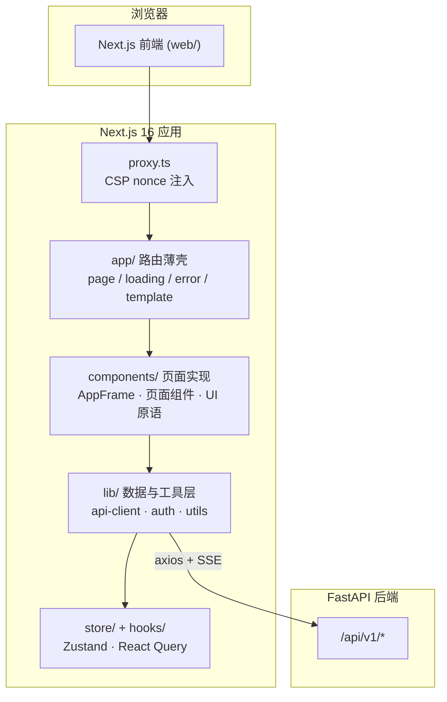
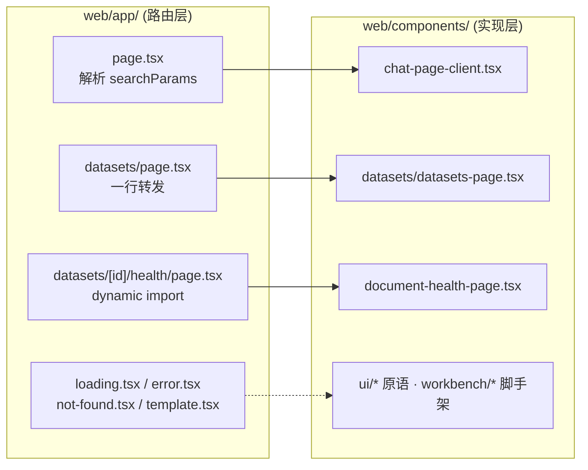
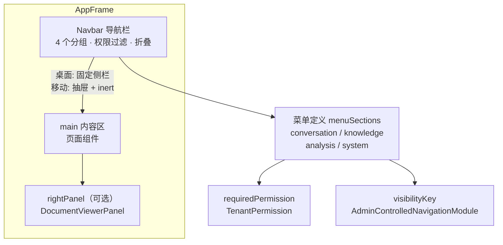
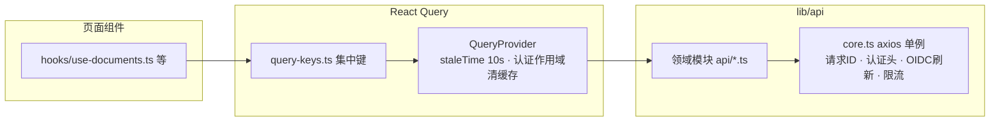
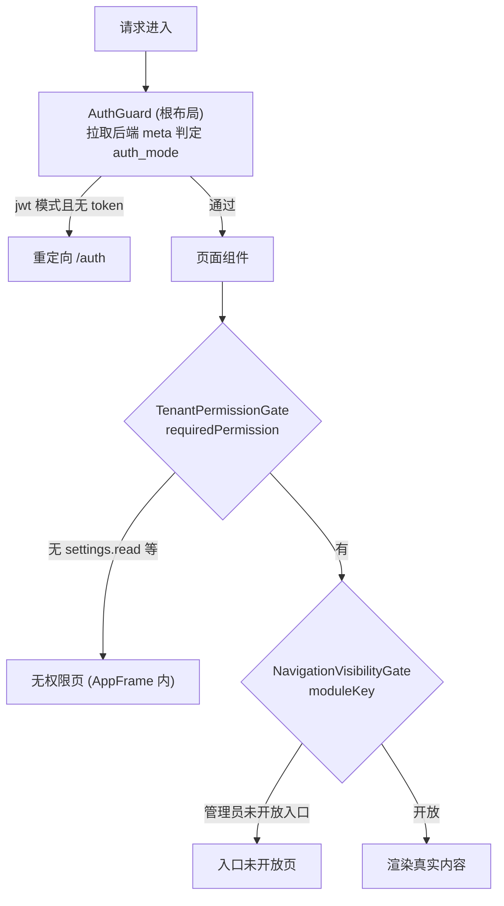

本页面向中级开发者介绍 MimirQ 前端工作台的整体架构：技术栈选型、目录分层、布局框架、核心页面组织模式、数据获取与状态管理策略，以及权限与导航的联动机制。阅读后你将能够快速定位任意页面的实现路径，理解「路由薄壳 + 组件实现」的组织范式，并掌握新增页面的标准做法。对话流式交互与前端状态管理的深度细节在[流式对话与前端状态管理](22-liu-shi-dui-hua-yu-qian-duan-zhuang-tai-guan-li)中展开，本页只覆盖架构骨架与页面组织本身。

## 技术栈与架构定位

前端位于仓库 `web/` 目录，是一个独立的 Next.js 16（App Router）+ React 19 + TypeScript 应用，通过 pnpm 管理依赖，与 FastAPI 后端完全解耦。核心依赖如下表所示：

| 关注点 | 选型 | 版本 | 说明 |
| --- | --- | --- | --- |
| 框架 | Next.js (App Router) | 16.2.11 | 服务端组件 + 客户端组件混合渲染 |
| UI 运行时 | React / React DOM | 19.2.5 | — |
| 样式 | Tailwind CSS | 4.2.2 | 语义 token 优先（`bg-background` 等） |
| 国际化 | next-intl | 4.13.2 | 当前仅 `zh-CN`，`localePrefix: 'never'` |
| 服务端状态 | TanStack React Query | 5.96.2 | staleTime 10s、按认证作用域清缓存 |
| 客户端状态 | Zustand | 5.0.12 | 文档查看器、命令菜单等跨页面状态 |
| HTTP | axios | 1.16.0 | 统一拦截器：请求 ID、认证头、OIDC 刷新 |
| UI 原语 | Radix UI + shadcn 风格 | — | `web/components/ui/*` 约 64 个基础组件 |
| 可视化 | ECharts / Recharts / react-force-graph / three.js / @xyflow | — | 图表、知识图谱 2D/3D、工作流编排 |
| 文档渲染 | pdfjs-dist / react-markdown / Monaco Editor | — | PDF 预览、Markdown、代码编辑 |
| 错误监控 | @sentry/nextjs | 10.66.0 | — |
| 测试 | Vitest + Playwright | 4.x / 1.59 | 单元/行为测试 + E2E |

Sources: [package.json](web/package.json#L1-L141)、[README.md](web/README.md#L1-L20)

前端与后端通过 `/api/v1/*` 通信。浏览器侧默认访问 `NEXT_PUBLIC_API_URL`（默认 `http://localhost:8000`），SSR 场景可改用 `API_INTERNAL_URL`（Docker 容器间 DNS）；`web/lib/env.ts` 还会在浏览器端对 `localhost/127.0.0.1/0.0.0.0` 等 loopback 主机做尽力修正，避免局域网访问时后端地址失效。`next.config.mjs` 将 `/api/v1/:path*` 统一 rewrite 到后端，开发模式下浏览器优先走同源路径。整体分层如下：

Sources: [env.ts](web/lib/env.ts#L1-L75)、[next.config.mjs](web/next.config.mjs#L130-L175)、[proxy.ts](web/proxy.ts#L1-L49)

## 目录组织：薄路由与组件实现分离

前端目录采用「路由薄壳 + 组件实现」的强约定：`app/` 下的每个 `page.tsx` 只负责接收路由参数（`searchParams`/`params`）并转发给 `components/` 中的页面组件，真正的 UI 逻辑全部下沉到 `components/` 对应目录。例如首页 `web/app/page.tsx` 只解析 `?conversation=`、`?prompt=`、`?doc=` 等查询参数，然后渲染 `ChatPageClient`；数据集列表页 `web/app/datasets/page.tsx` 直接 `export { default } from '@/components/datasets/datasets-page'`，知识库页同理。

这种分离带来三个直接收益：其一，路由文件保持可审计的极简性，`searchParams` 的解析集中在一处；其二，页面组件可以在 `components/` 内被测试文件直接引用（如 `datasets-page.source.test.ts`），无需经过路由；其三，`[locale]` 前缀路由可以零成本复用——`web/app/[locale]/datasets/page.tsx` 仅一行 `export { default } from '../../datasets/page'` 即可复用同一实现。

Sources: [page.tsx](web/app/page.tsx#L1-L37)、[datasets/page.tsx](web/app/datasets/page.tsx#L1-L3)、[knowledge/page.tsx](web/app/knowledge/page.tsx#L1-L2)、[locale/datasets/page.tsx](web/app/[locale]/datasets/page.tsx#L1-L2)

`components/` 内部按功能域划分目录（`chat/`、`datasets/`、`knowledge/`、`graph/`、`settings/`、`data-governance/`、`parsing/` 等），外加两个横切目录：`ui/` 存放与业务无关的基础原语（按钮、弹窗、分页脚手架等），`workbench/` 存放多面板工作台脚手架。与之配套的非 UI 逻辑分布在四个位置：

| 目录 | 职责 | 典型内容 |
| --- | --- | --- |
| `lib/` | 纯逻辑与数据访问 | `api/`（30+ 领域模块）、`auth-storage.ts`、`env.ts`、`query-keys.ts`、`security/csp.ts` |
| `hooks/` | React Query 封装与组合逻辑 | `use-documents.ts`（组合 4 个子 hook）、`use-chat.ts`、`use-tenant-access.ts` |
| `store/` | Zustand 客户端状态 | `document-view.ts`（带持久化与认证作用域隔离）、`command-menu.ts` |
| `contexts/` | React Context 偏好注入 | `pipeline-options-context.tsx`、`parser-backend-context.tsx`、`chunk-strategy-context.tsx` |

`hooks/use-documents.ts` 是组合模式的代表：它内部组合 `useDocumentList`（列表）、`useDocumentUpload`（上传）、`useDocumentPolling`（轮询）、`useDocumentActions`（删除/取消）四个子 hook，并向 `Sidebar`、知识库页等消费方暴露统一的 `{ documents, uploadDocuments, deleteDocument, ... }` 接口。`lib/query-keys.ts` 则集中定义所有 React Query 查询键，避免散落的字符串键造成缓存失效错误。

Sources: [use-documents.ts](web/hooks/use-documents.ts#L1-L81)、[query-keys.ts](web/lib/query-keys.ts#L1-L80)、[api-client.ts](web/lib/api-client.ts#L1-L133)

## 布局框架：AppFrame 与导航体系

除登录页（`FullScreenFrame`）外，所有工作台页面都包裹在 `AppFrame` 布局壳中。`AppFrame` 由三部分组成：左侧 `Navbar`（桌面端为可折叠侧栏，移动端为抽屉）、中部 `main` 内容区、以及可选的右侧 `rightPanel`（如 `DocumentViewerPanel` 文档查看器）。壳层还负责全局可访问性：提供「跳转到主内容」的 skip link，并在移动端侧栏展开时将主内容区设为 `inert` 防止焦点逃逸；侧栏开关状态持久化到 `localStorage`（`mimirq_app_sidebar_open_v1`）。

Sources: [app-frame.tsx](web/components/app-frame.tsx#L1-L164)

导航菜单以静态声明式数据定义：`menuSections` 将入口划分为四个分组——对话（首页、历史）、知识（数据集、知识库、入库、解析、数据治理）、分析（知识图谱、RAGAS 评测、报表）、系统（诊断、设置）。每个菜单项可选声明 `requiredPermission`（租户级权限）与 `visibilityKey`（管理员可控导航模块），`Navbar` 在渲染前用 `canAccessPermission` 与 `canShowNavigationModule` 过滤出 `visibleMenuSections`，无权限的分组整体隐藏。菜单还通过 `useBackendReady()` 在后端异常时于侧栏底部展示依赖状态徽标，并利用 `TaskCenter` 承载后台任务入口。

Sources: [navbar.tsx](web/components/navbar.tsx#L28-L120)、[navbar.tsx](web/components/navbar.tsx#L200-L300)

除导航栏外，`CommandMenu`（命令面板，即 Cmd+K 全局搜索）是另一条高频入口：它聚合了页面跳转（slash 命令）、文档/会话/数据集搜索（React Query 拉取）、主题切换与快捷键引导，且同样受 `visibilityKey` 过滤。一级导航只保留高频任务，低频入口由命令搜索承载，这是导航设计的明确取舍。

Sources: [command-menu.tsx](web/components/command-menu.tsx#L1-L100)

## 核心页面组织模式

工作台页面数量约 30 个路由（含动态段），核心页面可归纳为以下四类模式：

| 页面 | 路由 | 模式 | 关键实现 |
| --- | --- | --- | --- |
| 首页对话 | `/` | 服务端解析参数 → 客户端组件 | `app/page.tsx` → `ChatPageClient` → `ChatArea` |
| 数据集列表 | `/datasets` | 一行转发客户端页面 | `datasets-page.tsx`（含分类树、权限标签、批量操作） |
| 数据集详情 | `/datasets/[id]/*` | 动态段 + 9 个功能子路由 | health / kg / precheck / profile / tables / workflow / ingestion / evidence / db-catalog |
| 知识库工作台 | `/knowledge` | 多面板工作台 + URL 即状态 | `knowledge-page.tsx`（文档/检索/设置三 Tab，右侧查看器） |
| 知识图谱 | `/graph` | 重型可视化 + 状态拆分 | 8 个 `use-graph-*` hooks + `_components/` 局部组件 |
| 设置中心 | `/settings` | 分区注册表 + 权限门 | `settings-sections.ts` 驱动 15 个 `_sections/*` 分区 |
| 评测 | `/evaluations` | 多 Tab 客户端页面 | RAGAS / 回归测试 / Queryset Health |

数据集详情是动态路由的典型样本：`/datasets/[id]` 本身没有 `page.tsx`，而是以 9 个功能子路由组织（`health`、`kg`、`precheck`、`profile`、`tables`、`workflow`、`ingestion`、`evidence`、`db-catalog`），每个子路由配齐自己的 `loading.tsx` 与 `error.tsx`。其中健康页使用 `next/dynamic` 关闭 SSR（`ssr: false`），因为其客户端逻辑依赖浏览器 API 且加载成本高——这是「重客户端页面延迟挂载」的既定模式。

Sources: [datasets/[id] 目录](web/app/datasets/[id]/health/page.tsx#L1-L24)、[evaluations/page.tsx](web/app/evaluations/page.tsx#L1-L80)、[settings/page.tsx](web/app/settings/page.tsx#L1-L80)

页面级约定方面：根 `layout.tsx` 依次叠加 `ThemeProvider`（next-themes）、`QueryProvider`、`ServiceWorkerRegistrar`、`WebVitalsReporter`、`SonnerToaster`、`CommandMenu` 与 `AuthGuard`；`template.tsx` 在每个路由导航时重挂载，负责页面转场动画（`PageTransition`）与按路径条件注入 `PipelineProviders`（仅在 `/datasets`、`/knowledge`、`/parsing`、`/settings`、`/data-governance` 等解析/入库相关前缀下挂载切块策略、解析后端、流水线选项四个 Context，避免全局 Context 膨胀）。`proxy.ts`（Next.js 16 的 middleware 替代）为每次请求生成 CSP nonce 并注入 `x-nonce` 头，供内联脚本安全执行。

Sources: [layout.tsx](web/app/layout.tsx#L1-L103)、[template.tsx](web/app/template.tsx#L1-L19)、[pipeline-route-scope.ts](web/lib/pipeline-route-scope.ts#L1-L30)、[pipeline-providers.tsx](web/components/providers/pipeline-providers.tsx#L1-L19)

## 数据获取与状态管理

数据获取分为四层。最底层是 `lib/api/core.ts` 创建的 axios 单例：统一 `baseURL`（`/api/v1`）与超时（默认 60s，长任务 10min），请求拦截器注入 `X-Request-ID`、认证头与偏好语言头；响应层处理 401 时触发 OIDC token 刷新重试、解析限流 `Retry-After` 并格式化日志、识别 `AbortError` 取消异常。`lib/api-client.ts` 作为领域 API 的聚合出口，按业务域导出 `datasetApi`、`documentApi`、`chatApi`、`kgApi` 等 30+ 模块，页面与 hook 只从这一个入口引用。

Sources: [core.ts](web/lib/api/core.ts#L1-L150)、[query-provider.tsx](web/components/providers/query-provider.tsx#L1-L57)

之上是 React Query 的 hook 层：`hooks/` 下的查询 hook（如 `useBackendMeta`、`useTenantAccess`）用 `useQuery` 声明式拉取，并设置合理的 `staleTime`（meta 60s、tenant access 5min）；`QueryProvider` 全局配置 `retry` 策略（4xx 不重试、网络错误最多 2 次指数退避），并监听 `AUTH_SCOPE_CHANGED_EVENT` 事件在认证作用域切换时 `queryClient.clear()`，防止跨租户缓存泄漏。文档查看等跨页面客户端状态则落入 Zustand：`store/document-view.ts` 持久化到 `localStorage` 且按认证作用域加盐，保证不同租户/账号间的查看器状态互不可见。

Sources: [use-backend-meta.ts](web/hooks/use-backend-meta.ts#L1-L26)、[use-tenant-access.ts](web/hooks/use-tenant-access.ts#L1-L18)、[document-view.ts](web/store/document-view.ts#L1-L100)

值得注意的第三种状态源是「URL 即状态」：知识库工作台将当前 Tab、数据集范围、文档筛选、排序等完整查询状态序列化到 URL 查询串（`parseKnowledgeQueryState` / `serializeKnowledgeQueryState`），刷新或分享链接即可还原界面；首页对话则通过 `?conversation=`、`?doc=`、`?chunk=`、`?start/end=` 支持从历史页、引用卡片等外部入口深链定位到具体文档高亮区间。URL 状态与本地状态的分界原则是：可分享、可回退的界面状态进 URL，纯瞬时交互状态留本地。

Sources: [knowledge-page.tsx](web/components/knowledge/knowledge-page.tsx#L1-L120)、[chat-page-client.tsx](web/components/chat-page-client.tsx#L1-L92)

## 权限控制与导航可见性

前端权限体系由「认证守卫 → 租户权限 → 导航可见性」三级构成，与后端 RBAC/ACL 一一对应：

`AuthGuard` 位于根布局最外层：先通过 `useBackendMeta` 探测后端 `auth_mode`，在 `jwt` 模式且本地无 access token 时阻止渲染并重定向 `/auth`，同时监听 `AUTH_SCOPE_CHANGED_EVENT` 在登出/切换账号后立即重校验。页面级的 `TenantPermissionGate` 与 `NavigationVisibilityGate` 都在校验期间显示 `PageLoading`，拒绝时在 `AppFrame` 内渲染带「重新校验」按钮的说明页，保证未授权用户不会看到任何真实数据。

Sources: [auth-guard.tsx](web/components/auth-guard.tsx#L1-L45)、[tenant-permission-gate.tsx](web/components/auth/tenant-permission-gate.tsx#L1-L78)、[navigation-visibility-gate.tsx](web/components/auth/navigation-visibility-gate.tsx#L1-L86)

两层判断的语义差异值得注意：`TenantPermission`（如 `settings.read`、`observability.read`、`audit.read`）表达「角色是否有权执行某类操作」，由后端返回的 `permissions` 数组决定；`AdminControlledNavigationModule`（如 `knowledgeGraph`、`ragas`、`reports`、`prompts`）表达「管理员是否向该角色开放某前端入口」，来自后端返回的 `navigation_user_visible_modules`，且 owner/admin 角色恒可访问。两者共同作用于导航菜单过滤与页面守卫，形成「菜单隐藏 + 路由拦截」的双保险。

Sources: [tenant-permissions.ts](web/lib/tenant-permissions.ts#L1-L28)、[navigation-visibility.ts](web/lib/navigation-visibility.ts#L1-L46)

## UI 组件体系：原语、脚手架与设计令牌

UI 层遵循「token-first + 原语复用」的规范（`docs/guides/ui_standards.md` 有完整基线）：颜色一律使用语义 token（`bg-background`、`text-foreground`、`border-border` 等），基础交互组件一律基于 Radix primitives 封装，禁止 `window.confirm/prompt`（必须用 `ConfirmDialog` 二次确认破坏性操作），动画只动 `transform/opacity` 且尊重 `prefers-reduced-motion`。`web/app/globals.css` 定义了完整的设计令牌：主色蓝（`--primary` 及 50–900 色阶）、强调色紫罗兰（保留给检索/AI 语义）、语义状态色（success/warning/info/destructive）与 8 色图表调色板。

| 层级 | 代表组件 | 用途 |
| --- | --- | --- |
| 原语 | `ui/button.tsx`、`ui/dialog.tsx`、`ui/select.tsx`、`ui/alert-dialog.tsx`、`ui/command.tsx` 等约 64 个 | 无业务语义的基础控件 |
| 页面脚手架 | `ui/page-scaffold.tsx`（标题/描述/图标/工具条/正文）、`ui/page-header.tsx`、`ui/page-container.tsx` | 单栏页面的标准骨架 |
| 工作台脚手架 | `workbench/workbench-scaffold.tsx`（多面板 + pipeline rail）、`workbench-pane.tsx`、`workbench-panel-dialog.tsx` | 多面板管理界面的标准骨架 |
| 业务外壳 | `ui/knowledge-ops-hero.tsx`、`ui/analysis-page-shell.tsx`、`ui/page-title-icon.tsx` | 知识运营与数据分析页的视觉壳 |

`PageScaffold` 与 `WorkbenchScaffold` 是页面实现最常用的两个骨架：前者适合列表/表单类单栏页（数据集列表、报表、设置），后者适合左右多面板的密集型工作台（知识库、图谱、入库操作），二者都支持 `compact` 密度切换与 `system-dense` 系统密度。设计令牌的规范性由 `scripts/check-design-tokens.mjs` 等静态检查在 CI 中强制保证。

Sources: [ui_standards.md](docs/guides/ui_standards.md#L1-L58)、[globals.css](web/app/globals.css#L1-L80)、[page-scaffold.tsx](web/components/ui/page-scaffold.tsx#L1-L80)、[workbench-scaffold.tsx](web/components/workbench/workbench-scaffold.tsx#L1-L80)

## 国际化与多语言路由

国际化基于 next-intl：`i18n/routing.ts` 定义 `locales: ['zh-CN']` 且 `localePrefix: 'never'`，即 URL 不带语言前缀；`i18n/request.ts` 将请求 locale 归一化到消息包。根布局通过 `getLocale()`/`getMessages()` 注入 `NextIntlClientProvider`，`[locale]` 段仅做 locale 合法性校验（`notFound()` 拒绝非法值），具体页面复用根路由实现。消息按领域拆分模块（`chat.ts`、`documents.ts`、`graph.ts`、`ingestion.ts`、`parsing.ts`、`governance.ts` 等 13 个文件），根布局还会根据请求头解析文档语言/方向（`resolveRequestDocumentSettings`），支持 RTL 文档的阅读方向切换。

Sources: [routing.ts](web/i18n/routing.ts#L1-L10)、[request.ts](web/i18n/request.ts#L1-L19)、[locale/layout.tsx](web/app/[locale]/layout.tsx#L1-L21)

## 质量保障体系

前端质量由「验证命令 + 测试分层 + 契约检查」三支柱支撑。`pnpm run verify` 串行执行 lint、ui-check（设计令牌、原生对话框、主题对比度、内部路由、交互控件五项静态扫描）、typecheck、单测与 api-check（API 契约、覆盖度、类型漂移对比基线）。测试分三层：Vitest 单元/行为测试覆盖 hooks 与组件交互（如 `use-chat-stream.behavior.test.tsx`、`navbar.behavior.test.ts`）、`*.source.test.ts` 以源码静态断言守护架构约定（如页面必须薄壳、代表面必须使用指定脚手架）、Playwright E2E 覆盖真实浏览器链路（`live-stack.smoke.spec.ts`、`management-surfaces.smoke.spec.ts`）。构建后还会执行 `check-bundle-budget.mjs` 校验包体预算，防止可视化库体积失控。

Sources: [package.json](web/package.json#L11-L38)、[frontend_backend_integration.md](docs/guides/frontend_backend_integration.md#L1-L80)

## 延伸阅读

本文覆盖了前端架构骨架与页面组织，建议按以下顺序深入：对话页的流式输出与状态恢复详见[流式对话与前端状态管理](22-liu-shi-dui-hua-yu-qian-duan-zhuang-tai-guan-li)；文档查看器、知识图谱与治理可视化交互详见[文档查看、图谱与治理可视化](23-wen-dang-cha-kan-tu-pu-yu-zhi-li-ke-shi-hua)；与页面配套的 API 契约与联调方法可参考[API 分层设计与认证鉴权](6-api-fen-ceng-she-ji-yu-ren-zheng-jian-quan)；前端 CI 门禁的执行细节在[CI/CD 与测试体系](29-ci-cd-yu-ce-shi-ti-xi)中说明。