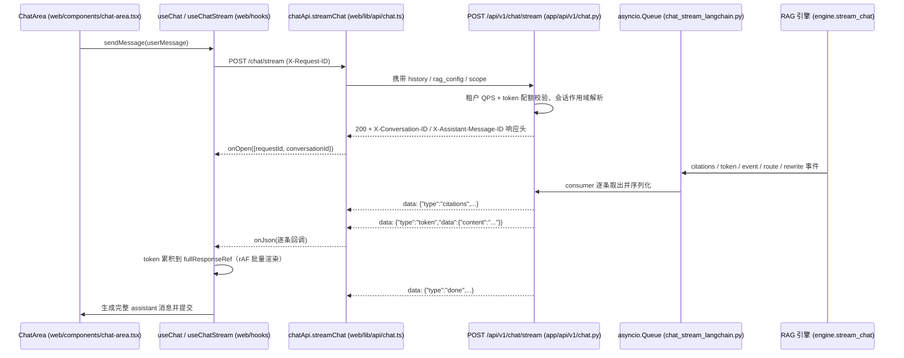
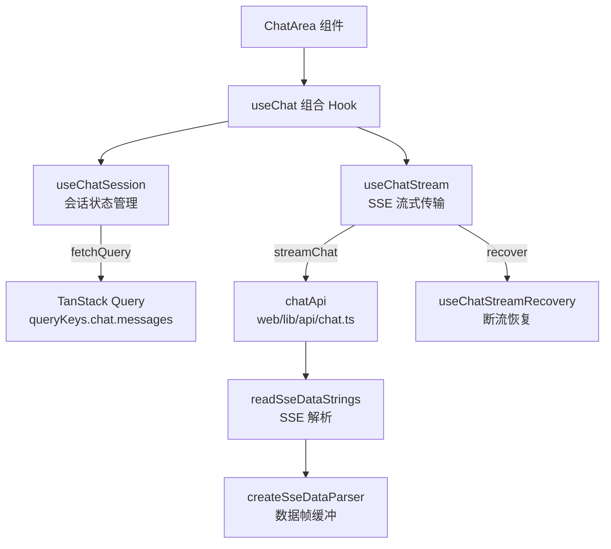
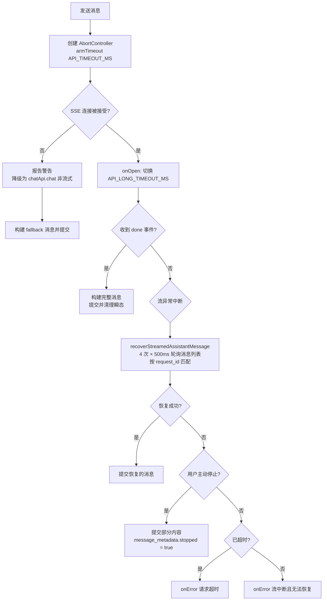

流式对话是 MimirQ 工作台的核心交互：用户发送问题后，后端以 SSE（Server-Sent Events）逐 token 推送回答、引用与过程状态，前端在毫秒级延迟下持续渲染增量文本，同时维护会话、消息、取消、超时与断流恢复等复杂状态。本文剖析这条链路的完整实现——从前端 hook 分层、SSE 协议、渲染性能策略到容错恢复机制，并说明它与后端流式服务的协作边界。

## 端到端架构：一次流式对话的完整旅程

理解 MimirQ 流式对话的最佳起点是一条完整的事件链路。前端以 `fetch` 发起 POST 请求，后端将 `StreamingResponse` 作为 `text/event-stream` 返回，随后双方以「`data: {json}\n\n`」分帧的消息持续交换。

链路中的关键设计决策是**请求标识贯穿全程**：前端生成 `X-Request-ID` 请求头，后端将其反射到每个 SSE 事件与响应头，最终写入持久化消息的 `message_metadata.request_id`，为后续的断流恢复提供关联锚点。前端在 `onOpen` 阶段即可拿到后端的 `requestId` 与 `conversationId`，无需等待首个数据事件。Sources: [chat.ts](web/lib/api/chat.ts#L100-L162)、[chat.py](app/api/v1/chat.py#L567-L648)、[chat_stream_langchain.py](app/services/chat_stream_langchain.py#L1-L60)

## 前端状态管理分层：组合式 Hook 架构

前端对话状态由三个 hook 组合而成，遵循「会话管理」与「流式传输」职责分离的原则。`useChat` 是面向组件的门面，`useChatSession` 管理会话级状态（conversationId、历史消息、加载），`useChatStream` 管理单次流式请求的瞬态（增量文本、引用、步骤、取消）。

**状态与引用（ref）的职责划分**是这套架构的精髓。以 `useChatStream` 为例：`useState` 仅保存驱动 UI 的最小状态（`isLoading`、`currentResponse`、`currentCitations`、`currentSteps`），而高频变更的数据全部落入 `useRef`——`fullResponseRef` 累积 token 全文，`currentStepsRef` / `currentCitationsRef` 保存步骤与引用快照，`abortControllerRef` 持有可取消的控制器。这样做有两个直接收益：其一，token 事件以每帧最多一次 `setState` 的频率刷新 UI，避免高吞吐下 React 渲染风暴；其二，`setMessages` 这类回调始终能通过 `messagesRef` 读到最新消息，规避闭包过期问题。Sources: [use-chat.ts](web/hooks/use-chat.ts#L1-L83)、[use-chat-stream.ts](web/hooks/use-chat-stream.ts#L60-L110)、[use-chat-session.ts](web/hooks/use-chat-session.ts#L1-L99)

会话加载侧同样有竞态防护：`useChatSession` 维护 `loadRequestIdRef` 自增计数器，每次 `loadConversation` 都会校验请求 ID 是否仍是最新，防止用户快速切换会话时旧响应覆盖新状态。卸载时计数器自增使在途请求的结果被静默丢弃。Sources: [use-chat-session.ts](web/hooks/use-chat-session.ts#L23-L71)

| 层级 | 职责 | 关键状态/引用 |
|---|---|---|
| `useChat` | 组合门面，暴露统一 API | `messages`、`isLoading`、`sendMessage`、`stopGeneration`、`loadConversation` |
| `useChatSession` | 会话生命周期与历史加载 | `conversationId`、`messages`、`loadRequestIdRef`（竞态防护） |
| `useChatStream` | 单次流式请求与瞬态渲染 | `currentResponse`、`fullResponseRef`、`abortControllerRef`、`rafIdRef` |
| `chatApi` | HTTP 传输与 SSE 解析 | `streamChat`（流式）、`chat`（降级）、`getMessages`（恢复） |

Sources: [use-chat.ts](web/hooks/use-chat.ts#L1-L83)、[use-chat-session.ts](web/hooks/use-chat-session.ts#L1-L99)、[use-chat-stream.ts](web/hooks/use-chat-stream.ts#L77-L168)

## SSE 流式协议：事件类型与双端解析

**协议帧格式**。后端每个事件序列化为一行 `data: {json}\n\n`，以空行分隔事件块；空闲期间发送 `: keepalive\n\n` 注释帧维持连接（消费端用 `heartbeat_sec` 控制检查频率）。前端解析器 `createSseDataParser` 采用缓冲策略：将收到的字节块按 `\n\n` 切分事件块，提取所有 `data:` 行并按换行拼接，天然支持跨块边界的事件帧。`readSseDataStrings` 则通过 `TextDecoder(..., { stream: true })` 处理多字节 UTF-8 字符在 chunk 边界的截断，并在流结束时 flush 解码器残余。Sources: [sse.ts](web/lib/sse.ts#L1-L36)、[sse-reader.ts](web/lib/sse-reader.ts#L1-L36)、[chat_stream_langchain.py](app/services/chat_stream_langchain.py#L60-L160)

**事件类型契约**。前后端通过一组固定事件类型协作，前端 `StreamEvent` 类型与后端产出的 dict 严格对应：

| 事件类型 | 触发时机 | 数据载荷 | 前端处理 |
|---|---|---|---|
| `event` | 流水线阶段提示（开始处理、缓存命中、TAG 尝试） | `{ message }` | 追加到步骤列表 |
| `citations` | 检索完成后 | 引用数组 | 更新 `currentCitations` |
| `token` | 生成过程中（按 120 字符分块） | `{ content }` | 累积到 `fullResponseRef`，rAF 渲染 |
| `done` | 回答完整生成 | `assistant_message_id`、metrics、结构化数据等 | 构建完整消息并提交 |
| `error` | 检索准入超时、模型异常等 | `{ message, status_code, error_code, retry_after_sec }` | 记录 `streamError` 并抛错 |
| `route` / `rewrite` / `graph` | 模型路由、查询改写、图工作流 | 各阶段元数据 | 格式化为可读步骤文本 |

后端 `done` 事件由 `build_chat_stream_done_event` 统一构造，携带 `total_tokens`、`total_chars`、`citations_count`、`model_used`、`route`、`retrieval_mode`、`vector_backend`、`structured_data` 等完整元数据，前端据此在 `buildDoneAssistantMessage` 中将这些字段折叠进 `message_metadata`。Sources: [chat_stream_common.py](app/services/chat_stream_common.py#L52-L100)、[use-chat-formatter.ts](web/hooks/use-chat-formatter.ts#L150-L250)、[chat.ts](web/types/chat.ts#L145-L155)

**后端生产模型**：LangChain 路径采用生产者-消费者队列。`produce_langchain_stream_events` 作为独立 task 消费 RAG 引擎的 `stream_chat` 异步迭代器，将事件 `queue.put`；主协程按 `heartbeat_sec` 超时轮询队列，无事件时发 keepalive，收到 `None` 哨兵即结束。深层的服务模块通过 `contextvars` 绑定的 `StreamEmitter` 发事件，`emit_stream_event` 是 best-effort 且永不抛错，`dedupe_keys` 机制避免检索多子查询时重复刷屏进度消息。图工作流路径则用 `stream_mode=["custom", "values"]` 双模式，custom 事件透传图节点执行状态，values 状态中的 `citations` 与 `answer` 再切成 120 字符 token 块。Sources: [chat_stream_langchain.py](app/services/chat_stream_langchain.py#L210-L291)、[stream_events.py](app/core/stream_events.py#L1-L104)、[chat_stream_graph.py](app/services/chat_stream_graph.py#L218-L290)

## 流式渲染策略：rAF 批量提交与滚动协同

逐 token 更新 React 状态的最大风险是渲染风暴。`useChatStream` 的处理方式是**双缓冲 + 请求动画帧**：token 事件只做 `fullResponseRef.current += content`（零成本字符串累积），随后调用 `scheduleCurrentResponseUpdate`——若当前帧尚无待执行的回调，则注册一个 `requestAnimationFrame`，在下一帧将全文一次性 `setCurrentResponse`。`flushCurrentResponseUpdate` 则立即清空待定帧并强制提交，用于 `done` 事件等需要即时收尾的场景。此外，`useEffect` 追踪 `currentResponse` 的增量长度，通过 `streamDiagnosticsRef.record('ui_render', ...)` 上报实际渲染字节数，与网络层事件形成完整诊断链路。Sources: [use-chat-stream.ts](web/hooks/use-chat-stream.ts#L115-L146)、[stream-diagnostics.ts](web/lib/stream-diagnostics.ts#L1-L68)

UI 层 `ChatArea` 的滚动管理同样以 rAF 节流：`autoScrollRef` 记录用户是否贴近底部（160px 阈值判定），流式渲染期间每帧仅调度一次 `scrollIntoView`；用户上翻浏览历史时自动暂停跟随，并通过「跳至最新」按钮恢复。消息列表采用分页渲染（默认 80 条、每次加载 40 条），加载更早消息时用 `pendingPrependScrollRef` 记录滚动位置差，在 `useLayoutEffect` 中补偿偏移，避免内容高度变化导致视口跳动。流式中的半成品回答以 `isStreaming` 标记的 `ChatMessageItem` 渲染——空内容时显示加载指示器，非空时显示光标脉冲动画。Sources: [chat-area.tsx](web/components/chat-area.tsx#L445-L500)、[chat-area.tsx](web/components/chat-area.tsx#L620-L670)、[message-item.tsx](web/components/chat/message-item.tsx#L570-L590)

## 容错与恢复：超时升级、断流恢复与非流式降级

流式对话的鲁棒性设计围绕一个核心决策树展开：**连接被接受前**失败走降级，**接受后**中断走恢复。`sendMessage` 的完整异常处理链如下：

各机制的职责与触发条件：

| 机制 | 触发条件 | 行为 |
|---|---|---|
| 超时升级 | 发送时 `API_TIMEOUT_MS`，收到首个事件或 `onOpen` 后切换 `API_LONG_TIMEOUT_MS` | 连接被接受后给予更充裕的生成时间，避免长回答误杀 |
| 断流恢复 | 流已接受但未收到 `done` | 按 `conversationId + request_id` 轮询消息接口（4 次、间隔 500ms），从持久化层找回完整回答 |
| 非流式降级 | 连接未接受（SSE 不可用） | 改用 `chatApi.chat` 非流式端点，以 `ChatResponse` 构建 fallback 消息 |
| 用户停止 | 点击停止按钮 | abort 请求，若已有部分内容则提交为 `stopped: true` 的半成品消息，保留已流式输出 |
| 请求超时 | 超时触发 abort | 统一报错「Request timed out」 |

超时升级设计的关键在于：一旦 `onOpen` 触发，说明后端已受理请求并进入生成阶段，此时改用长超时防止答案较长时被前端误杀；恢复机制则依赖「消息已持久化」这一后端保证——`done` 事件之后 `dispatch_chat_stream_persistence` 将完整回答落库，因此断流后轮询消息列表必然能找到与 `request_id` 匹配的记录。Sources: [use-chat-stream.ts](web/hooks/use-chat-stream.ts#L169-L432)、[use-chat-stream-recovery.ts](web/hooks/use-chat-stream-recovery.ts#L1-L60)、[chat_stream_common.py](app/services/chat_stream_common.py#L117-L213)

## 会话状态同步：URL 驱动的会话路由与持久化收尾

`ChatPageClient` 将会话 ID 与 URL 查询参数绑定：`onConversationId` 回调触发 `router.replace('/?conversation=...')`，页面刷新或分享链接后 `ChatArea` 通过 `initialConversationId` 感知变化并调用 `loadConversation` 恢复历史。`ChatArea` 内部用 `prevInitialConversationIdRef` 对比前后值，区分「URL 指定了新会话需加载」与「URL 清空需重置会话」两种场景。深链接还支持 `?prompt=`、`?autorun=` 参数实现预填问题并自动发送。Sources: [chat-page-client.tsx](web/components/chat-page-client.tsx#L1-L92)、[chat-area.tsx](web/components/chat-area.tsx#L400-L445)

消息的最终形态由 `done` 事件驱动：`buildDoneAssistantMessage` 将流式累积的 `fullResponseRef` 全文、`citations`、`steps` 与 `doneData` 中的指标合并为一条完整 `Message` 追加到消息列表，同时 `resetTransientState` 清空所有流式瞬态，为下一轮对话做准备。这里 `message_metadata` 不仅承载展示用指标（`model_used`、`route`、`retrieval_mode`），还写入 `request_id`——这正是断流恢复与诊断追踪的关联键。Sources: [use-chat-formatter.ts](web/hooks/use-chat-formatter.ts#L185-L235)、[chat.ts](web/types/chat.ts#L15-L25)

## 测试契约：行为级与传输级双重验证

流式链路有两层自动化测试守护。行为层 `use-chat-stream.behavior.test.tsx` 通过 mock `chatApi.streamChat` 与恢复函数，验证「流被接受后短超时不应杀连接」「中断后可恢复」「SSE 不可用时降级」等决策路径，并断言 `onError` 与恢复调用不被误触发。传输层 `api-client-chat-stream.test.ts` 用 `ReadableStream` 构造 SSE 响应体，验证 `onOpen` 能拿到响应头中的 `requestId` 与 `conversationId`，且诊断条目顺序符合 `request_start → headers → network_chunk → done` 的预期。Sources: [use-chat-stream.behavior.test.tsx](web/hooks/use-chat-stream.behavior.test.tsx#L1-L150)、[api-client-chat-stream.test.ts](web/lib/api-client-chat-stream.test.ts#L1-L65)

## 延伸阅读

流式对话仅是前端工作台的一部分。对话中引用的渲染与溯源机制见 [引用、证据与可解释性机制](17-yin-yong-zheng-ju-yu-ke-jie-shi-xing-ji-zhi)；对话引擎后端的完整链路（缓存、图工作流、LangChain 会话）见 [RAG 对话引擎与流式输出](16-rag-dui-hua-yin-qing-yu-liu-shi-shu-chu)；文档查看器与图谱可视化的状态管理见 [文档查看、图谱与治理可视化](23-wen-dang-cha-kan-tu-pu-yu-zhi-li-ke-shi-hua)。