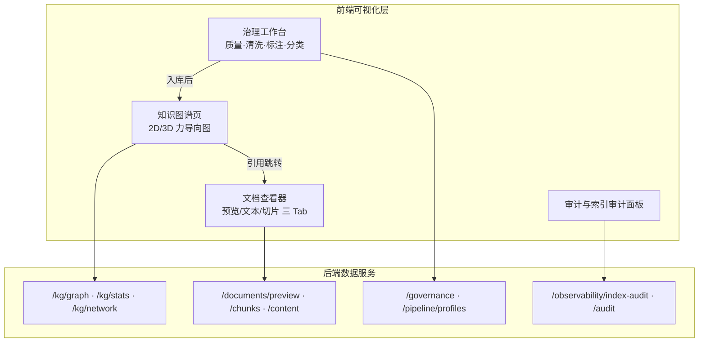
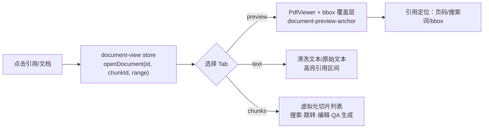
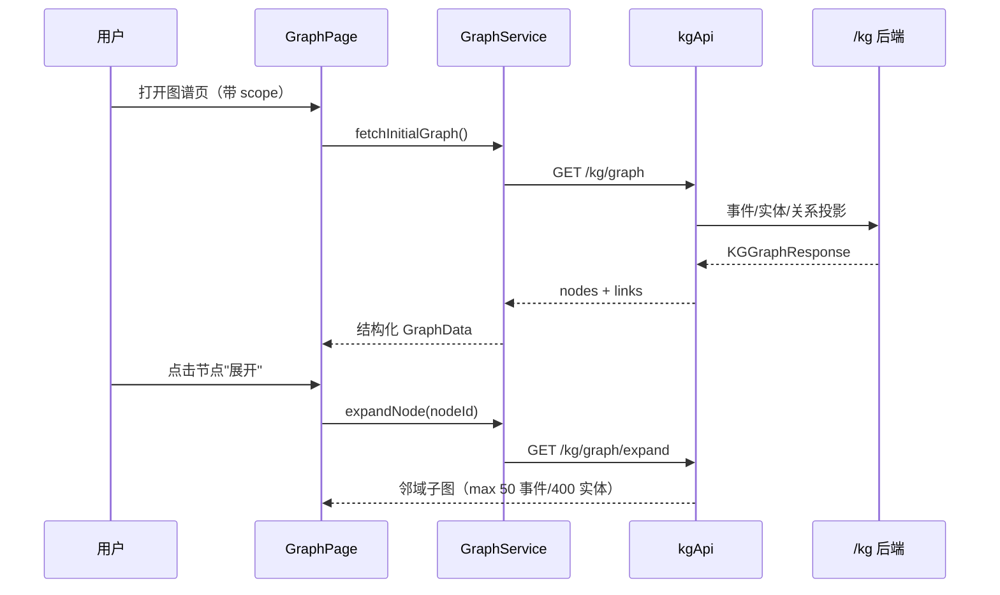

前端工作台是知识运营闭环的"眼睛"：文档查看负责把解析、切块结果以可读、可定位的方式呈现给用户；知识图谱可视化把实体与事件关系渲染成交互式网络，支撑检索溯源与人工纠错；治理可视化则将质量门禁、审计与索引一致性检测变成可操作的界面。三者共享同一套后端数据模型，但各自面向不同的任务——**查看**面向内容消费，**图谱**面向关系推理，**治理**面向质量管控。

Sources: [web/app/graph/page.tsx](web/app/graph/page.tsx#L1-L10)、[web/components/data-governance-panel.tsx](web/components/data-governance-panel.tsx#L1-L20)

## 文档查看：三栏式文档阅览器

文档查看器以右侧滑出面板的形式嵌入对话页与知识库页，通过 `DocumentViewerPanel`（薄封装）挂载到 `ChatPageClient` 和 `KnowledgePage` 的右栏区域。面板提供三个 Tab：**预览（PDF 内联渲染）**、**文本（清洗后/原始对照）**、**切片（可检索、可编辑的分块列表）**，覆盖从"看原文"到"看结构化产物"的完整链路。

面板本身是一个可拖拽调整宽度的容器：支持指针拖拽（`handleResizePointerDown/Move`）和键盘方向键步进（每步 24px，Shift 加倍），宽度被限制在最小 360px 与视口 86% 之间；展开态（isExpanded）则忽略宽度样式铺满全屏。整个面板的打开/关闭、Tab、宽度、滚动位置均持久化在 Zustand 的 `document-view` store 中，且按文档 ID 分别记忆布局——同一份文档再次打开时会恢复上次的阅读位置。Sources: [web/components/document-viewer/document-viewer-panel-shell.tsx](web/components/document-viewer/document-viewer-panel-shell.tsx#L1-L60)、[web/store/document-view.ts](web/store/document-view.ts#L1-L120)

### 引用定位机制：从对话引用到原文坐标

文档查看最核心的能力是"引用可回溯"。`useDocumentViewerPanelState` 从 store 读取 `previewAnchor`（页码、搜索文本、bbox 坐标），随后 `document-preview-anchor.ts` 负责把**引用锚点**翻译成**渲染坐标**：

- 对带 `bbox` 的引用，`buildDocumentPreviewBboxOverlay` 生成覆盖层，在 PDF 上直接框出命中区域；
- 对仅带页码的引用，跳转到对应 PDF 页并尝试执行搜索词高亮；
- 对带 `start_char/end_char` 的切片引用，先换算为块内相对区间，再在文本 Tab 中高亮。

当 PDF 无法内联预览时，面板自动降级为文本定位，并保留"已保留引用定位"提示条。切块 Tab 则通过 `highlightChunkId` 定位命中切片，支持 `loadAllChunks` 全量加载与虚拟化渲染（`@tanstack/react-virtual`）。切片卡片上可直接**编辑内容、删除、复制链接**，并支持基于切片的 QA 生成对话框。Sources: [web/lib/document-preview-anchor.ts](web/lib/document-preview-anchor.ts#L1-L200)、[web/components/document-viewer/preview-tab-panel.tsx](web/components/document-viewer/preview-tab-panel.tsx#L1-L100)、[web/components/document-viewer/chunks-tab-panel.tsx](web/components/document-viewer/chunks-tab-panel.tsx#L1-L120)

## 知识图谱可视化：交互式力导向网络

图谱页（`/graph`）是知识运营的可视化核心。页面通过 URL 参数（`document_ids`、`dataset_id`、`pipeline_hash`）声明**作用域**，`useGraphPageState` 解析后生成 `scopeParams` 传给数据加载层；后端 `/kg/graph` 按可访问文档投影事件-实体-关系三元组，前端 `GraphService` 负责拉取初始图、按需展开邻居与搜索节点。整个页面被拆成七个职责清晰的 hook：状态、数据加载、实体解析、显示过滤、节点操作、页面动作、交互模式。Sources: [web/app/graph/page.tsx](web/app/graph/page.tsx#L1-L211)、[web/app/graph/use-graph-page-state.ts](web/app/graph/use-graph-page-state.ts#L1-L120)、[web/app/graph/use-graph-data-loading.ts](web/app/graph/use-graph-data-loading.ts#L1-L200)

### 渲染管线：2D/3D 双引擎与性能分层

渲染层基于 `react-force-graph-2d` / `react-force-graph-3d`（均经 `next/dynamic` 动态加载以避免 SSR 冲突），由 `GraphViewer` 统一管理。为了支撑数千节点，前端实现了三层性能策略：

| 策略 | 实现 | 作用 |
|---|---|---|
| 视口 LOD | `graph-viewport-lod.ts` 四叉树空间索引 | 按缩放级别（overview/balanced/detail）裁剪不可见节点与边，600 节点以上启用，420 节点上限 + 18% overscan |
| 连通分量聚类 | `graph-clustering.ts` 并查集 + Web Worker（comlink） | 计算节点归属簇，`graph-cluster-palette` 分配色板，避免主线程阻塞 |
| 边标签按需渲染 | `graph-edge-display.ts` + 悬停 Tooltip | 边标签默认隐藏，悬停时通过 `graph-provenance.ts` 生成溯源 HTML（谓词、置信度、文档/切片/事件 ID） |

同时 `graph-canvas.tsx` 对聚类计算与调色耗时做前端埋点（`reportFrontendTrace`，>12ms 才上报），用于性能回归监控。Sources: [web/components/graph/graph-viewer.tsx](web/components/graph/graph-viewer.tsx#L1-L120)、[web/lib/graph-viewport-lod.ts](web/lib/graph-viewport-lod.ts#L1-L80)、[web/lib/graph-clustering.ts](web/lib/graph-clustering.ts#L1-L107)、[web/workers/graph-clustering.worker.ts](web/workers/graph-clustering.worker.ts#L1-L13)、[web/lib/graph-provenance.ts](web/lib/graph-provenance.ts#L1-L80)

### 交互模式：搜索、路径、连边与 RAG 可解释性

`useGraphInteractionModes` 定义了四种互斥的交互模式：

- **搜索**：`GraphService.searchNodes` 调 `/kg/graph/search`，结果节点高亮并聚焦；
- **路径模式**：点选起终点后，前端用 `graph-algorithms.ts` 的 BFS 求最短路径（视为无向图），高亮路径节点与边；
- **连边模式**：允许人工为两个节点补建关系（写回 `/kg` 关系接口），用于图谱纠错；
- **解释模式**：导入 RAG trace 文件后，`buildGraphFromTrace` 把检索链路还原成图上的步骤序列，`GraphExplainabilityPanel` 以时间轴卡片展示"节点 → 理由"，当前步骤高亮。Sources: [web/app/graph/use-graph-interaction-modes.ts](web/app/graph/use-graph-interaction-modes.ts#L1-L100)、[web/lib/graph-algorithms.ts](web/lib/graph-algorithms.ts#L1-L106)、[web/app/graph/_components/graph-explainability-panel.tsx](web/app/graph/_components/graph-explainability-panel.tsx#L1-L66)

### 图算法面板与实体治理

右侧 `KgNetworkAnalysisPanel` 把当前可视子图的边集提交给后端 `/kg/network/*` 接口执行图算法——**k 跳邻居、最短路径、路径枚举、度中心性/PageRank、社区发现**。后端在 `network_analysis.py` 中实现，并对客户端提交的边数设置 20,000 上限以防御 CPU/内存 DoS。节点详情面板则承载**实体治理**：查看实体别名、同义候选、合并/拆分实体，以及事件详情，这些操作直接调用 `/kg/entities/merge|split|aliases` 系列接口。Sources: [web/app/graph/_components/kg-network-analysis-panel.tsx](web/app/graph/_components/kg-network-analysis-panel.tsx#L1-L80)、[app/api/v1/network_analysis.py](app/api/v1/network_analysis.py#L1-L100)、[web/app/graph/_components/graph-node-detail-panel.tsx](web/app/graph/_components/graph-node-detail-panel.tsx#L1-L80)

### KG 快照：漂移治理的对比视图

图谱还提供快照工作台（`/graph/snapshots`）：可将某 `pipeline_hash` 的图谱导出为快照，随后对两个快照做 JSON 级 diff 与实体类型漂移（Type Drift）分析。`SnapshotDiffView` 用并排 diff 行展示结构变化，并用正负 delta 徽章标出类型增减——这是治理侧"图谱质量是否回退"的量化依据。Sources: [web/components/graph/kg-snapshots/components/snapshot-diff-view.tsx](web/components/graph/kg-snapshots/components/snapshot-diff-view.tsx#L1-L80)、[web/components/graph/kg-snapshots/snapshot-graph.tsx](web/components/graph/kg-snapshots/snapshot-graph.tsx#L1-L80)

## 治理可视化：从质量门禁到审计面板

治理可视化横跨三个入口：**数据治理工作台**（入库前）、**治理配置页**（规则管理）、**审计与索引审计**（运行后）。

### 数据治理工作台：解析 → 治理 → 切块 → 入库

`/data-governance` 页承载四步流水线的治理环节，四个 Tab 对应四个子组件：

| Tab | 组件 | 能力 |
|---|---|---|
| 质量检测 | `quality-checker` | 字符/编码/语言/格式/问题五类检查，本地规则（空段落、超长段落、特殊字符、重复句）实时打分 |
| 智能清洗 | `data-cleaner` | 调用治理规则清理文本并预览 diff |
| 数据标注 | `data-annotator` | 内容标注与归档 |
| 分类归档 | `data-classifier` | 文档分类与目录归档 |

面板从两个来源拉取文档——知识库文档（`documentApi.list`）与解析工作区文档（`parsingApi.listDocuments`），并统一映射为 `ParsedFileData`（含 parser backend 解析与 dataset 归属推断），通过 `useParsedFiles` store 管理治理状态（原始内容/清洗内容/标注/质量分）。Sources: [web/components/data-governance-panel.tsx](web/components/data-governance-panel.tsx#L1-L150)、[web/components/data-governance-panel.tsx](web/components/data-governance-panel.tsx#L150-L330)、[web/components/data-governance/quality-checker.tsx](web/components/data-governance/quality-checker.tsx#L1-L100)

### 治理配置：Profile 的创建、导入与导出

`/data-governance/profiles` 页以卡片列表展示治理 Profile，区分**内置（is_system）**与**自定义**两类，支持搜索、新建（基于已有 Profile 复制）、编辑（抽屉编辑器）、导入 JSON/导出、删除。Profile 引用 `pipelineApi.listGovernanceProfiles` 等接口，是治理规则（去目录行、去噪行、断行合并、公共行去除等）的版本化载体，可随流水线哈希被复用与审计。Sources: [web/components/governance-profiles/governance-profiles-page.tsx](web/components/governance-profiles/governance-profiles-page.tsx#L1-L150)、[web/app/data-governance/profiles/page.tsx](web/app/data-governance/profiles/page.tsx#L1-L39)

### 审计日志与索引审计

`/audit` 页提供审计日志的过滤、分页与导出，支持按操作者、动作、资源类型、资源 ID、请求 ID、时间窗口过滤；动作与资源类型均有中文标签映射（如 `observability.index_audit.daily` → 索引审计），并内置保留策略面板与清理操作。索引审计（Index Audit）则嵌入知识库检索面板：`useIndexAudit` 触发 `observabilityApi.getIndexAudit`，比对**关系库侧活动文档/切片**与**向量后端实际存在的向量 ID**，输出缺失、孤儿向量等一致性指标；后端 `index_audit_service.py` 还负责在索引操作失败时写入 `index_drift_marker` 漂移记录，为"索引与库不一致"提供可追溯的证据链。Sources: [web/app/audit/page.tsx](web/app/audit/page.tsx#L1-L200)、[web/components/audit/audit-retention-panel.tsx](web/components/audit/audit-retention-panel.tsx#L1-L80)、[web/hooks/use-index-audit.ts](web/hooks/use-index-audit.ts#L1-L63)、[web/components/knowledge/knowledge-retrieval-panel.tsx](web/components/knowledge/knowledge-retrieval-panel.tsx#L1-L120)、[app/services/index_audit_service.py](app/services/index_audit_service.py#L1-L80)

## 三者如何协同

三个可视化面在数据流上首尾相接：**文档查看器**消费解析与切块产物并支持人工编辑；**图谱页**消费入库后的 KG 投影并支持实体治理（合并/拆分/补边）；**治理工作台**在入库前拦截质量问题，**审计与索引审计**在运行后持续监督一致性。前端架构上，它们共享 `api-client`、`query-keys`、`NavigationVisibilityGate` 等基础设施，且每个模块都有对应的 a11y 与行为测试，保证高密度可视化界面的可用性。

建议按以下顺序继续阅读：[前端架构与核心页面组织](21-qian-duan-jia-gou-yu-he-xin-ye-mian-zu-zhi)（页面骨架与导航）、[知识图谱：抽取、检索与溯源](13-zhi-shi-tu-pu-chou-qu-jian-suo-yu-su-yuan)（图谱后端能力）、[数据治理画像与入库质量门禁](12-shu-ju-zhi-li-hua-xiang-yu-ru-ku-zhi-liang-men-jin)（治理规则后端）、[可观测性：指标、追踪与日志](26-ke-guan-ce-xing-zhi-biao-zhui-zong-yu-ri-zhi)（审计与追踪的延伸）。