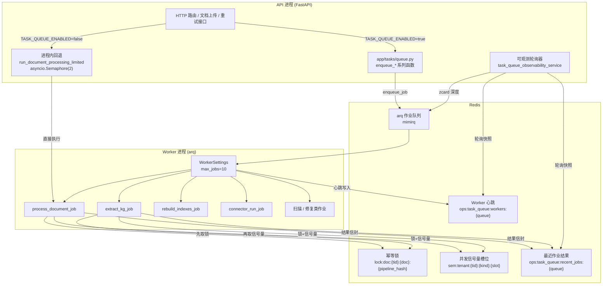
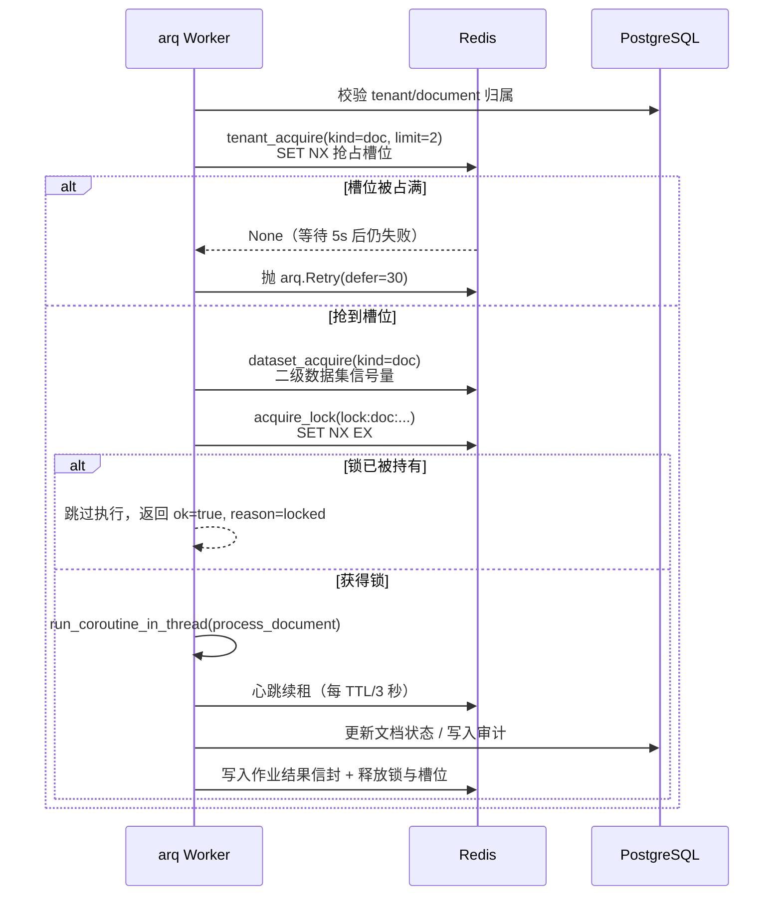

MimirQ 的后台作业体系采用「可选队列 + 进程内回退」的双模式设计：默认情况下（`TASK_QUEUE_ENABLED=false`）文档解析、切块、索引等重活由 API 进程内的有界后台任务完成，保证零额外依赖即可运行；当吞吐量要求提升时，可将 `TASK_QUEUE_ENABLED=true` 切换到基于 **arq 0.27** 的 Redis 异步队列，由独立 Worker 进程消费任务。两条路径共用同一套 `document_processor.process_document` 核心执行逻辑，差异仅在于调度与并发控制层。队列模式下，Worker 通过 **Redis 幂等锁**（防重复执行）与 **租户/数据集信号量**（防单租户独占资源）构建了两道并发防线，并将每次作业结果以标准化信封（`mimirq.task_job_result.v1`）回写 Redis 供管理端可观测。

## 总体架构与数据流

从请求到落库的完整链路可抽象为三层：**API 入队层**（`app/tasks/queue.py`）负责把业务事件转换为 arq 作业；**Worker 消费层**（`app/tasks/worker.py` + `app/tasks/jobs.py`）负责执行解析、索引、图谱抽取等任务；**Redis 协调层**（`app/tasks/locks.py`）提供幂等锁与并发信号量。API 进程与 Worker 进程共享同一个 Redis 与 PostgreSQL，通过 `TASK_QUEUE_NAME`（默认 `mimirq`）隔离队列命名空间。



队列的连接生命周期挂在 FastAPI 的 lifespan 上：启动时 `await init_queue()` 创建 arq 连接池（仅当 `TASK_QUEUE_ENABLED=true`），关闭时 `await close_queue()` 释放。若 Redis 暂不可达，启动不会失败，只会记录告警日志并让后续入队调用惰性重试。Sources: [queue.py](app/tasks/queue.py#L52-L87) [main.py](app/main.py#L274-L287)

## 双模式运行：队列与进程内回退

`TASK_QUEUE_ENABLED` 是整套体系的开关，两种模式面向不同的部署形态：

| 维度 | 队列模式（`true`） | 进程内回退（`false`，默认） |
|---|---|---|
| 执行位置 | 独立 arq Worker 进程（Docker 内 `mimirq-worker`） | API 进程内 asyncio 后台任务 |
| 并发上限 | `TASK_WORKER_MAX_JOBS=10`（Worker 侧） | `API_DOCUMENT_BACKGROUND_MAX_CONCURRENCY=2`（进程内信号量） |
| 幂等保障 | Redis 锁 + 租户/数据集信号量 | 无分布式锁（单进程天然串行于文档粒度） |
| 适用场景 | Docker Compose 完整栈、高吞吐生产 | 本地源码调试、轻量部署 |
| 启动命令 | `arq app.tasks.worker.WorkerSettings` | 无需额外进程 |

进程内回退模式的关键约束在 `app/api/v1/documents.py`：`_get_background_processing_semaphore()` 按事件循环缓存 `asyncio.Semaphore`，`run_document_processing_limited()` 用信号量包裹 `run_coroutine_in_thread(document_processor.process_document)`，把阻塞式解析放进线程池的同时限制并发，避免解析和 KG 抽取耗尽数据库连接池。Sources: [documents.py](app/api/v1/documents.py#L234-L261) [config.py](app/core/config.py#L229-L235)

这里存在一个值得注意的 fail-closed 分支：当 `TASK_QUEUE_ENABLED=true` 但队列实际不可用时（如 Redis 宕机），文档重试接口不会静默降级为进程内执行，而是通过 `_task_queue_required()` 判定后抛出"队列不可用"错误，防止用户以为作业已入队实则在等待一个不存在的 Worker。Sources: [document_processing.py](app/api/v1/document_processing.py#L352-L369)

## 作业类型与注册机制

Worker 通过 `WorkerSettings.functions` 声明可消费的作业清单，每个函数用 `func(job, max_tries=N)` 包装以覆盖全局重试预算。当前注册了 8 类作业，覆盖文档处理、知识图谱、连接器同步、数据集扫描与证据修复五个业务域：

| 作业函数 | 入队入口 | 业务动作 | 专用 max_tries |
|---|---|---|---|
| `process_document_job` | `enqueue_document_processing` | 解析 → 切块 → 嵌入 → 索引 | 80 |
| `extract_kg_job` | `enqueue_kg_extraction` | 从已完成块抽取事件/实体并索引 | 80 |
| `rebuild_indexes_job` | `enqueue_rebuild_indexes` | 重建租户或单文档的 BM25 块索引 | 80（全局） |
| `connector_run_job` | `enqueue_connector_run` | 按 connector_id 派发同步执行器 | 80（全局） |
| `dataset_profile_scan_job` | `enqueue_dataset_profile_scan` | 回填数据集文档指标并汇总 | 80（全局） |
| `dataset_precheck_scan_job` | `enqueue_dataset_precheck_scan` | 入库前质量预检扫描 | 80（全局） |
| `evidence_reference_sources_repair_job` | `enqueue_evidence_reference_sources_repair` | 有界修复证据套件引用漂移 | 80（全局） |
| `ping_job` | 内部 | E2E 基准的队列健康探针 | — |

Sources: [worker.py](app/tasks/worker.py#L144-L168) [queue.py](app/tasks/queue.py#L175-L383)

作业参数以位置参数传递，且**所有作业在 Worker 侧都会重新校验租户/文档归属**（如 `process_document_job` 先按 `tenant_id + document_id` 查库，文档不存在即返回 `document_not_found`），这是防跨租户访问的第一道闸门。Sources: [jobs.py](app/tasks/jobs.py#L535-L575)

## 幂等与并发控制：Redis 锁与信号量

队列模式下重复提交是常态——同一文档可能被重试接口、级联管道或用户多次触发。`app/tasks/locks.py` 提供了两层 Redis 原语：

**第一层：幂等锁（防重复执行）**。`acquire_lock` 使用 `SET key value EX ttl NX` 原子抢占，锁 TTL 取 `job_timeout + 60` 秒且下限 40 分钟，保证 Worker 崩溃时锁最终自动过期而不是永久卡死。锁键按业务域细分，同一文档不同管道版本互不阻塞：

```text
lock:doc:{tenant_id}:{document_id}:{pipeline_hash}
lock:kg:{tenant_id}:{document_id}:{pipeline_hash}:{options_key}
lock:connector:{tenant_id}:{run_id}
lock:rebuild:{tenant_id}:{document_id|tenant}
lock:dataset_profile_scan:{tenant_id}:{dataset_id}
lock:evidence_repair:{tenant_id}:{suite_id}
```

释放采用 **compare-and-delete Lua 脚本**（仅当存储值等于持有者 token 才删除），避免误删他人锁；若 Redis 不支持 EVAL，则退化为"先 GET 比对再 DEL"的弱一致路径。Sources: [locks.py](app/tasks/locks.py#L308-L363)

**第二层：租户/数据集信号量（防单租户独占）**。`tenant_acquire` 与 `dataset_acquire` 在 Redis 中创建 `limit` 个带 TTL 的槽位键（`sem:tenant:{tid}:{kind}:{slot}`），每个 Worker 用 `SET NX` 抢占一个槽位。槽位租约 TTL 默认 60 秒，但**活跃任务通过独立的 asyncio 心跳任务自动续租**（每 TTL/3 秒执行一次 compare-expire Lua，间隔上限 10 秒），从而解决"长任务被短 TTL 误杀"与"死 Worker 占槽不放"的矛盾：崩溃的 Worker 停止心跳，槽位 60 秒后自动释放；活着的任务则持续续租直至完成。Sources: [locks.py](app/tasks/locks.py#L100-L196) [config.py](app/core/config.py#L253-L259)

**抢不到怎么办**：作业先做最多 `TASK_SEMAPHORE_ACQUIRE_WAIT_SEC=5` 秒的进程内轮询等待，仍拿不到槽位就抛出 `arq.Retry(defer=30)` 退回队列，30 秒后再试。信号量忙与协调层不可用被区分编码（`task_concurrency_busy` vs `task_coordination_unavailable`），便于运维判断瓶颈在资源争用还是基础设施故障。Sources: [locks.py](app/tasks/locks.py#L78-L85) [jobs.py](app/tasks/jobs.py#L233-L234)



并发上限可通过配置独立调优：文档作业默认单租户 2 并发（`TASK_TENANT_MAX_CONCURRENCY_DOC=2`）、KG 抽取 1 并发、连接器同步 1 并发；数据集级信号量默认关闭（0 = 不限），可按需为热点数据集单独设限。Sources: [config.py](app/core/config.py#L266-L273)

## 重试、跳过与结果信封

所有作业共享统一的**重试预算**与**结果契约**。`max_tries=80` 允许作业在长任务（如大 PDF/OCR）背后排队等待而不至于在信号量竞争期间耗尽重试次数；`TASK_JOB_TIMEOUT_SEC=1800`（30 分钟）是单次执行的上限。每次执行结束，作业返回标准化信封：

```json
{
  "schema": "mimirq.task_job_result.v1",
  "job_name": "process_document_job",
  "ok": true,
  "reason": null,
  "elapsed_sec": 12.34,
  "finished_at": "2026-01-01T00:00:00Z",
  "progress": {"stage": "completed", "done": 1, "total": 1},
  "tenant_id": "...", "document_id": "...", "pipeline_hash": "..."
}
```

三种典型终态语义：**完成**（`ok=true`，含进度元数据）、**跳过**（`ok=true, reason="locked"`，幂等锁已持有，视为正常而非失败）、**失败**（`ok=false`，携带机器可读原因码如 `document_not_found`、`task_concurrency_busy`）。重试预算耗尽时，文档作业会写入终态 `failed` 并附错误信息，防止任务永远卡在"排队"状态；`extract_kg_job` 若发现文档尚未 `completed` 则主动 `Retry(defer=5)` 等待入库完成。Sources: [jobs.py](app/tasks/jobs.py#L83-L141) [jobs.py](app/tasks/jobs.py#L202-L225) [jobs.py](app/tasks/jobs.py#L1282-L1309)

**级联作业**是队列模式提升吞吐的关键：`process_document_job` 完成后，文档处理器内部检测到 `kg_enabled` 且队列开启时，会以 `requested_by="system"` 追加 `extract_kg_job`（锁键含管道哈希与选项指纹，避免同一文档重复抽取），实现"解析→图谱"的流水线化编排。Sources: [processor.py](app/parsing/processors/processor.py#L2446-L2496)

## 可观测性：心跳、深度与最近结果

`app/services/task_queue_observability_service.py` 为队列提供一套**尽力而为（best-effort）**的运维观测，设计原则是绝不让观测链路拖垮核心流程。三个数据源全部落在 Redis：

| 观测项 | Redis 结构 | 写入方 | 读取方 |
|---|---|---|---|
| Worker 存活 | ZSET `ops:task_queue:workers:{queue}`（score=心跳时间戳） | Worker 心跳循环，间隔 5s | API 轮询器按 TTL 30s 剪除陈旧成员 |
| 队列深度 | arq 队列本身 | — | API 轮询器 `ZCARD` |
| 最近作业结果 | LIST `ops:task_queue:recent_jobs:{queue}`（上限 20 条） | 每个作业结束写入 | API 轮询器 `LRANGE` |

API 进程内的轮询器（`PROMETHEUS_ENABLED=true` 时启动，间隔 10s）将这些数据汇总为快照，同时刷新 5 个 Prometheus gauge（`task_queue_broker_up`、`task_queue_depth`、`task_queue_workers_active` 等）。管理端通过管理员专用接口 `GET /api/v1/observability/task-queue/snapshot` 获取（支持 `force_refresh` 参数），快照经字段白名单过滤，携带 ID 与原因码但不含文档原文，满足 PII 安全要求。Sources: [task_queue_observability_service.py](app/services/task_queue_observability_service.py#L147-L200) [task_queue_observability_service.py](app/services/task_queue_observability_service.py#L225-L282) [observability.py](app/api/v1/observability.py#L894-L916)

Worker 启动时还会对 Redis 做一次 socket 级连通性探测（`_warn_if_redis_unreachable`），在 arq 日志系统就绪前就用 WARNING 级别输出明确的"Redis 未就绪"提示，配合 `TASK_WORKER_REDIS_CONN_RETRIES=60` 的冷启动重连策略，避免容器编排启动顺序问题导致 Worker 崩溃循环。Sources: [worker.py](app/tasks/worker.py#L37-L72)

## 关键配置速查

| 配置项 | 默认值 | 作用 |
|---|---|---|
| `TASK_QUEUE_ENABLED` | `false` | 主开关；`true` 时须运行 `make worker` 或 Docker 内的 `mimirq-worker` |
| `TASK_QUEUE_NAME` | `mimirq` | arq 队列名，多实例隔离用 |
| `TASK_WORKER_MAX_JOBS` | `10` | Worker 并发执行上限 |
| `TASK_JOB_TIMEOUT_SEC` | `1800` | 单次作业超时 |
| `TASK_JOB_MAX_TRIES` | `80` | 通用重试预算 |
| `TASK_DOCUMENT_RETRY_DEFER_SEC` | `30` | 文档作业锁竞争退避 |
| `TASK_KG_RETRY_DEFER_SEC` | `30` | KG 作业锁竞争退避 |
| `TASK_SEMAPHORE_LEASE_TTL_SEC` | `60` | 信号量槽位租约；心跳自动续租 |
| `TASK_SEMAPHORE_ACQUIRE_WAIT_SEC` | `5.0` | 槽位进程内等待上限 |
| `TASK_TENANT_MAX_CONCURRENCY_DOC` | `2` | 单租户文档并发上限 |
| `TASK_TENANT_MAX_CONCURRENCY_KG` | `1` | 单租户 KG 抽取并发上限 |
| `TASK_TENANT_MAX_CONCURRENCY_CONNECTOR` | `1` | 单租户连接器同步上限 |
| `API_DOCUMENT_BACKGROUND_MAX_CONCURRENCY` | `2` | 回退模式的进程内并发上限 |

Sources: [config.py](app/core/config.py#L229-L282) [.env.example](.env.example#L85-L103)

## 部署形态与运维要点

Docker 完整栈（`docker-compose.yml`）中 `mimirq-worker` 与 API 共享同一镜像，但以 `command: arq app.tasks.worker.WorkerSettings` 启动独立进程；健康检查用 `arq --check app.tasks.queue.WorkerHealthSettings`（轻量设置类，不导入作业函数），并依赖 Redis/Postgres/Milvus 三者的 healthy 状态。轻量栈（`docker-compose.lite.yml`）同样包含 Worker 服务。本地源码开发时 `make worker` 直接运行 `python -m arq app.tasks.worker.WorkerSettings`，`make worker-check` 验证 Worker 心跳哨兵。Sources: [docker-compose.yml](docker/docker-compose.yml#L211-L240) [Makefile](Makefile#L324-L327)

运维上最需要关注的三件事：**锁与槽位的 TTL 语义**（作业超时后锁自动过期，无需人工清理）；**信号量租约与心跳的关系**（崩溃 Worker 的槽位 60 秒内释放，而活跃任务不会因租约过期被误判）；**快照的有界性**（`recent_job_outcomes` 仅保留 20 条且非持久化，适合单节点排障而非审计存档）。Sources: [task_queue_ops.md](docs/guides/task_queue_ops.md#L36-L56)

## 阅读延伸

任务队列是文档处理与知识入库流水线的调度底座，建议结合以下页面理解完整链路：

- [解析后端与文档处理流水线](9-jie-xi-hou-duan-yu-wen-dang-chu-li-liu-shui-xian)——`process_document_job` 实际执行的解析→切块→索引流程
- [存储层：向量库、对象存储与关系库](24-cun-chu-ceng-xiang-liang-ku-dui-xiang-cun-chu-yu-guan-xi-ku)——队列依赖的 Redis 与作业写入的 PostgreSQL/Milvus
- [可观测性：指标、追踪与日志](26-ke-guan-ce-xing-zhi-biao-zhui-zong-yu-ri-zhi)——`/api/v1/observability/task-queue/snapshot` 在观测体系中的位置
- [部署运维：Docker Compose 与 Helm](28-bu-shu-yun-wei-docker-compose-yu-helm)——`mimirq-worker` 服务在完整栈与轻量栈中的编排方式