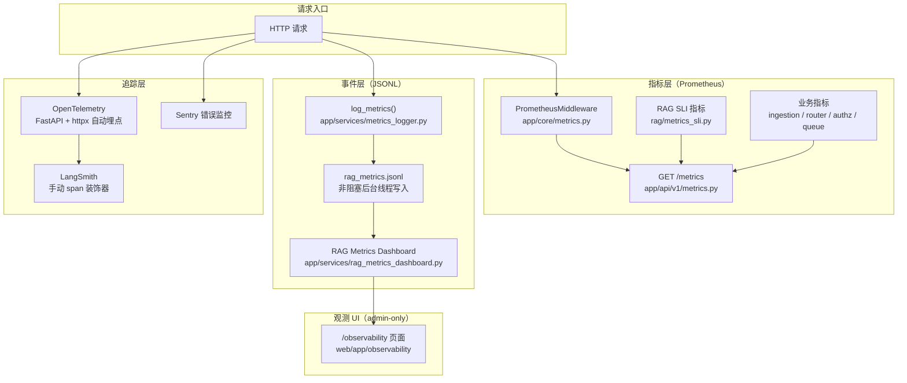

MimirQ 的可观测性设计遵循一个核心原则：**默认安全（PII-safe by default）与优雅降级（fail-open）并存**。系统在 Prometheus、OpenTelemetry、Sentry 三个外部生态之外，内置了一条不依赖任何外部服务的 JSONL 指标日志管道，使得即使是单机私有化部署也能获得可用的检索质量观测能力。本章从指标、追踪、日志三个维度展开，说明每一层的能力边界、启用方式与数据流向。

## 总览：三大支柱与统一关联

MimirQ 的可观测性由三条相对独立、又在 `request_id` 与 `trace_id` 上交叉关联的数据通路组成：**Prometheus 指标**提供实时聚合视图，**JSONL 指标日志**提供持久化的细粒度事件记录，**OpenTelemetry / LangSmith / Sentry** 提供外部生态的深度追踪与错误监控。所有通路都以环境变量开关控制，默认关闭，且缺失依赖时仅记录 warning 并降级，不影响主功能。

三条通路的分工可以概括为：Prometheus 回答"现在整体好不好"，JSONL 回答"某个请求内部发生了什么"，OTEL/LangSmith 回答"跨服务调用链路长什么样"。`request_id` 由最外层中间件生成并注入响应头，成为贯穿 HTTP 层、日志层与 JSONL 事件层的关联键；`trace_id`/`span_id` 则在启用 OTEL 时被日志工厂自动注入，实现日志与追踪的交叉检索。Sources: [app/core/metrics.py](app/core/metrics.py#L1-L90)、[app/core/otel.py](app/core/otel.py#L1-L101)、[app/core/logging_config.py](app/core/logging_config.py#L1-L205)、[app/api/middleware/request_id.py](app/api/middleware/request_id.py#L1-L64)

## 指标：Prometheus 实时度量

### HTTP 层通用指标

`PrometheusMiddleware` 是一个 ASGI 中间件，为每个 HTTP 请求维护三种指标：请求总数（Counter）、请求耗时分布（Histogram）与在途请求数（Gauge）。其设计有一个值得注意的细节——**路径标签有界化**：完成的请求使用路由模板（如 `/api/v1/rag/retrieve`）而非原始路径作为标签，未匹配路由统一归入 `__unmatched__`，在途请求统一使用 `__all__` 哨兵标签，从而避免高基数标签拖垮 Prometheus 存储。中间件通过 `exclude_paths` 排除 `/metrics`、`/health`、`/docs` 等自身监控端点，防止自采污染。Sources: [app/core/metrics.py](app/core/metrics.py#L1-L90)

### RAG 检索质量 SLI

在 RAG 引擎完成一次检索后，会调用 `observe_rag_sli()` 输出一组面向"检索质量"的 SLI 指标：零命中计数（`rag_zero_hit_total`）、检索错误计数（`rag_errors_total`）、引用数分布（`rag_citations_count`）、检索耗时（`rag_retrieval_elapsed_seconds`）与重排耗时（`rag_rerank_elapsed_seconds`）。这组指标默认**低基数**：`tenant_id` 与 `dataset_id` 标签只有在 `PROMETHEUS_RAG_LABEL_TENANT_ID=true` / `PROMETHEUS_RAG_LABEL_DATASET_ID=true` 时才启用，否则统一折叠为 `"all"`——这是多租户 SaaS 与私有化单租户两种部署形态之间的显式权衡。调用点位于 `engine.py` 的完成信号之前，并以 try/except 包裹，指标异常绝不会中断问答主流程。Sources: [app/rag/metrics_sli.py](app/rag/metrics_sli.py#L1-L102)、[app/rag/engine.py](app/rag/engine.py#L3620-L3660)

### 业务模块指标

除 RAG 主链路外，各业务模块各自维护独立的 Prometheus 指标，全部遵循"低基数标签 + PII-safe"的共同约定：

| 模块 | 指标名 | 标签维度 | 用途 |
|---|---|---|---|
| 文档入库 | `ingestion_runs_total` / `ingestion_run_duration_seconds` / `ingestion_processing_stage_total` | `status`、`kind`、`stage`（均有界） | 入库任务成败、耗时、各处理阶段在途文档数 |
| 自适应路由 | `rag_router_decision_total` | `level`（entity/intent/composite）、`decision`、`used` | 分层路由决策分布 |
| 组权限鉴权 | `authz_group_permission_total` | `resource`、`action`、`result`（枚举有界） | ACL 检查 allow/deny 分布 |
| 连接器 ACL | `connector_acl_apply_total` / `connector_acl_apply_errors_total` | `connector_id`、`mode`、`shape` | 连接器文档级 ACL 应用结果 |
| 任务队列 | `task_queue_broker_up` / `task_queue_depth` / `task_queue_workers_active` | `queue` | 队列健康度与积压水位（由后台轮询刷新） |

其中入库指标的状态机 gauge 维护值得注意：`adjust_processing_stage_gauge()` 只在数据库提交成功后调用，以"前一状态→新状态"的迁移方式增减各 stage 的在途计数，避免进程重启后 gauge 漂移。任务队列指标则由 API 进程内的后台 poller 周期性刷新，Redis 不可用时返回 `broker_up=0` 但保持 API 本身可用（fail-open）。Sources: [app/services/ingestion_prometheus_metrics.py](app/services/ingestion_prometheus_metrics.py#L1-L129)、[app/services/router_prometheus_metrics.py](app/services/router_prometheus_metrics.py#L1-L25)、[app/services/authz_prometheus_metrics.py](app/services/authz_prometheus_metrics.py#L1-L59)、[app/services/connector_acl_prometheus_metrics.py](app/services/connector_acl_prometheus_metrics.py#L1-L60)、[app/services/task_queue_observability_service.py](app/services/task_queue_observability_service.py#L1-L80)

### /metrics 端点与安全边界

`PROMETHEUS_ENABLED=true` 时，主应用装配 `/metrics` 路由并挂载 PrometheusMiddleware。需要明确的是：**`/metrics` 端点本身不做 RBAC**，运维手册明确建议通过网关或网络策略限制抓取来源，仅允许 Prometheus 实例访问。这与 `/api/v1/observability/*` 管理端点（需要 `OBSERVABILITY_READ` 权限）形成鲜明对照——前者面向监控系统，后者面向人工运维。Sources: [app/main.py](app/main.py#L500-L510)、[app/api/v1/metrics.py](app/api/v1/metrics.py#L1-L26)、[docs/deployment/runbook.md](docs/deployment/runbook.md#L149-L168)

## 指标：JSONL 事件日志与 SLO 快照

### 非阻塞事件管道

`metrics_logger.py` 实现了一条与 Prometheus 互补的持久化事件管道：`log_metrics()` 将事件记录放入有界队列（默认 2000 条），后台守护线程每 0.5 秒或累积 100 条时批量追加写入 `METRICS_LOG_PATH`（默认 `./logs/rag_metrics.jsonl`）。队列满时直接丢弃并递增丢弃计数（下次 flush 时写入一条 `metrics_dropped` 事件），保证热路径调用零阻塞。每条记录自动携带时间戳（毫秒 + ISO）、主机名、PID、线程号，并通过 contextvars 注入 `request_id` / `tenant_id` / `conversation_id` / `account_id`。事件类型包括 `rag_trace`（检索全过程）、`rag_done`（生成完成）、`frontend_web_vital`、`frontend_trace`、`online_eval` 等。Sources: [app/services/metrics_logger.py](app/services/metrics_logger.py#L1-L120)、[app/services/metrics_logger.py](app/services/metrics_logger.py#L320-L519)

### PII 安全：文本剥离与脱敏双层防护

JSONL 管道在写出前执行两道防护。第一道是**文本剥离**：当 `METRICS_LOG_INCLUDE_TEXT=false`（默认）时，`_strip_text_fields_for_metrics()` 将 `rag_trace` 事件中的原始 `question` / `query_for_retrieval` 替换为 SHA-256 前缀哈希（`question_hash` / `query_hash`）与字符数，引用数组只保留数值与标识符白名单字段（`_CITATION_SAFE_KEYS`），KG 路径溯源同样只保留标识符与低基数字段。第二道是**正则脱敏**：`PII_REDACTION_ENABLED=true` 时对剩余文本执行邮箱、中国大陆手机号、身份证号、OpenAI/AWS 密钥、KV 风格 secret、银行卡号（Luhn 校验）的脱敏。剥离是比脱敏更强的保证——内容根本不落盘，而非"尽力打码"。Sources: [app/services/metrics_logger.py](app/services/metrics_logger.py#L200-L320)、[app/core/pii_redaction.py](app/core/pii_redaction.py#L1-L80)

### SLO 快照：双数据源回退

`SLO` 快照构建器采用**双源回退**策略：优先通过 Prometheus HTTP API（`PROMETHEUS_QUERY_BASE_URL`）执行 PromQL 查询（如 `histogram_quantile(0.95, sum(rate(rag_retrieval_elapsed_seconds_bucket[60m])) by (le))` 计算 p95 延迟）；未配置时回退到 JSONL 聚合。输出为 `SloWindowSnapshot`，包含 `rag_trace_count`、`retrieval_p95/p99_elapsed_sec`、`zero_hit_rate`、`error_rate` 等字段。该快照通过 `/api/v1/observability/slo/snapshot` 提供给前端运维面板。Sources: [app/services/slo_snapshot_service.py](app/services/slo_snapshot_service.py#L1-L120)

## 追踪：OpenTelemetry、LangSmith 与 RAG Trace Schema

### OpenTelemetry：自动埋点

`OTEL_ENABLED=true` 时，`init_otel()` 初始化 TracerProvider 与 OTLP gRPC SpanExporter，随后自动完成两类埋点：`instrument_fastapi(app)` 捕获所有入站请求，`instrument_httpx()` 捕获所有出站 HTTP 调用。配置项包括 `OTEL_SERVICE_NAME`、`OTEL_EXPORTER_OTLP_ENDPOINT`、`OTEL_EXPORTER_OTLP_HEADERS`（自定义鉴权头）与导出超时。官方文档推荐以 Arize Phoenix 作为本地观测后端（Docker 暴露 6006 UI 与 4317 gRPC），并特别提醒：当前 exporter 为 gRPC 协议，若目标平台仅支持 HTTP/protobuf，需借助 OpenTelemetry Collector 做协议转换。OTEL 初始化全程 best-effort，依赖缺失时返回 `false` 并记录 warning。Sources: [app/core/otel.py](app/core/otel.py#L1-L101)、[docs/guides/otel_phoenix.md](docs/guides/otel_phoenix.md#L1-L62)

### LangSmith：手动精细埋点

对于需要精细控制 span 边界的场景（RAG 工作流），系统提供 LangSmith 集成：`trace_rag_query`、`trace_retrieval`、`trace_llm_call`、`trace_function`、`trace_async_function` 装饰器，以及 `add_feedback`（评测结果回写）与 `get_run_url`。`TracingClient` 内部以 `SpanContext`（dataclass）管理 run_id、父子关系、起止时间与 metadata，`LANGSMITH_TRACING_ENABLED=true` 时才导入 langsmith 依赖。这套手动埋点与 OTEL 自动埋点互补：OTEL 覆盖框架级调用，LangSmith 覆盖业务语义级阶段。Sources: [app/rag/tracing/langsmith.py](app/rag/tracing/langsmith.py#L1-L120)、[app/rag/tracing/__init__.py](app/rag/tracing/__init__.py#L1-L38)

### RAG Trace Schema：PII-safe 的结构化追踪

无论外部追踪系统是否启用，`rag_trace` 事件本身就是一个完整的结构化追踪记录。`trace_schema.py` 定义了稳定的 `RagTrace` 模型：顶层包含 `schema_version`、`request_id`、`conversation_id`、`retrieval`（模式、路由层、每查询明细、配置哈希）、`rerank`（provider、top_n、耗时）、`citations`（分数、位置、溯源标识）与 `steps`（阶段时间线）。其设计约束明确写入模块文档：**前端可视化依赖稳定形状，且绝不返回原始 question/query/chunk 文本**。`rag_trace_service.py` 负责从 JSONL 尾部读取并规范化这些记录，`normalize_rag_trace_record()` 对每个字段执行类型安全化与边界截断，构建供 History/Graph 页面渲染的步骤时间线。Sources: [app/rag/trace_schema.py](app/rag/trace_schema.py#L1-L146)、[app/services/rag_trace_service.py](app/services/rag_trace_service.py#L1-L200)、[app/services/rag_trace_service.py](app/services/rag_trace_service.py#L900-L1090)

### 前端 Trace 上报

前端通过 `POST /api/v1/observability/frontend-traces` 上报浏览器侧的性能事件：Web Vitals（LCP/CLS/FID/INP）走 `/frontend-vitals`，组件级 trace（如图谱渲染的节点/边数量、活动过滤器数）走 `/frontend-traces`，两者均以 202 异步接受并写入 JSONL。`web/lib/frontend-trace.ts` 封装了带认证头与 `keepalive` 选项的上报函数，用于页面卸载场景。这使观测面延伸到了浏览器端，与后端 RAG trace 在同一个事件流中统一存储。Sources: [app/api/v1/observability.py](app/api/v1/observability.py#L117-L200)、[web/lib/frontend-trace.ts](web/lib/frontend-trace.ts#L1-L51)

## 日志：结构化日志与关联上下文

### contextvars 请求上下文

`logging_config.py` 以 contextvars 维护每个请求的 `request_id` / `tenant_id` / `user_id` / `route` 四个上下文变量。`RequestIDMiddleware` 在最外层生成或规范化 `X-Request-ID`（拒绝换行与超长值，防止 header 注入），并调用 `bind_request_context()` 绑定上下文；`set_request_user_id()` / `set_request_tenant_id()` 供认证解析完成后修正身份来源（避免信任伪造的 `X-User-ID` 头）。`reset_request_context()` 在请求结束时恢复 token，且清理失败绝不中断请求处理。Sources: [app/api/middleware/request_id.py](app/api/middleware/request_id.py#L1-L64)、[app/core/logging_config.py](app/core/logging_config.py#L1-L100)

### JSON 格式化与日志-追踪关联

`LOG_FORMAT=json` 时，`JSONFormatter` 输出包含时间戳（UTC ISO）、级别、logger、消息、请求上下文、异常堆栈的 JSON 行，并强制重配 root handler 以覆盖 uvicorn 预置日志。关键在于 `_install_record_factory()`：自定义 record factory 在每个 LogRecord 创建时读取当前 OTEL span，将 `trace_id`（32 位十六进制）与 `span_id`（16 位）注入日志记录。由此实现**日志行可直接关联到追踪链**——一条 JSON 日志同时携带 `request_id`（HTTP 层关联）与 `trace_id`（追踪层关联），这是事故排查时从"日志报错"跳转到"链路定位"的关键桥接。Sources: [app/core/logging_config.py](app/core/logging_config.py#L100-L205)

### Sentry 错误监控

`SENTRY_DSN` 配置后，`init_sentry()` 启用 Sentry，集成 FastAPI 与 SQLAlchemy，采样率由 `SENTRY_TRACES_SAMPLE_RATE` 控制，且 `send_default_pii=False` 显式禁止默认 PII 上报。Sentry 与 OTEL 的定位差异在于：Sentry 聚焦异常聚合与告警，OTEL 聚焦链路拓扑；二者可以并存（`init_sentry()` 与 `init_otel()` 在 `main.py` 中顺序独立调用，均以开关控制）。Sources: [app/core/sentry.py](app/core/sentry.py#L1-L37)、[app/main.py](app/main.py#L162-L175)

## 统一查询：观测 API 与前端面板

### 观测 API（admin-only）

`/api/v1/observability/*` 是一组仅限 owner/admin（`OBSERVABILITY_READ` 权限）的只读管理端点，其数据全部来自 JSONL 事件日志的**有界尾部读取**（`max_bytes` 上限，避免 O(文件大小) 扫描），并保持"只返回数值与类别聚合、绝不返回原始文本"的构造性安全。核心端点如下：

| 端点 | 用途 |
|---|---|
| `GET /rag-metrics/summary?window_minutes=60` | 检索/重排/引用聚合摘要：均值与 p95 延迟、零命中率、错误分布、时序 |
| `GET /rag-metrics/query-analytics` | 零命中 / 慢检索 / 错误 top 查询（以 hash 标识，不暴露原文） |
| `GET /rag-metrics/tail` | 下载 JSONL 原始事件（供离线分析） |
| `GET /rag-metrics/trace-bundle?request_id=...` | 按 request_id 导出 PII-safe 诊断包 |
| `GET /config/snapshot` | 脱敏配置快照 + 指纹（对比环境差异） |
| `GET /periodic-jobs/freshness` / `GET /task-queue/snapshot` | 周期巡检新鲜度、队列水位 |
| `GET /slo/snapshot` | SLO 双源快照 |
| `GET /index-audit?dataset_id=...` | 数据库 chunk 与向量库一致性检查（best-effort + 抽样） |
| `GET /index-drift` / `POST /index-drift/{id}/resolve` | 未完成索引操作的持久化记录与人工结单 |
| `GET /online-quality/summary` | 在线评测质量聚合（采样、确定性、PII-minimal） |

这些端点构成了 [部署运维：Docker Compose 与 Helm](28-bu-shu-yun-wei-docker-compose-yu-helm) 中告警响应手册的查询基础——`runbook.md` 中的 `MimirQHighRagErrorRate` 与 `MimirQTaskQueueBrokerDown` 告警均指引到对应的 summary / query-analytics / task-queue 端点。Sources: [app/api/v1/observability.py](app/api/v1/observability.py#L490-L560)、[app/api/v1/observability.py](app/api/v1/observability.py#L695-L919)、[docs/deployment/runbook.md](docs/deployment/runbook.md#L42-L84)

### 前端观测面板

`/observability` 页面（仅 owner/admin）提供两个 Tab：**Summary** 展示 RAG trace 计数、重排器 API 调用数与检索平均耗时的时序折线，以及 top 错误分布；**Query Analytics** 以时间窗口预设（15 分钟/1 小时/4 小时/24 小时）与慢查询阈值（≥1s/2s/5s）展示请求量、零命中率、慢查询率与错误率的堆叠/分组图表。`observability-ops-panel.tsx` 则聚合了运维动作：在线质量摘要、成本归因、metrics tail 下载、依赖健康快照、定时任务新鲜度、任务队列快照、SLO 快照、数据集缓存失效、Index Drift 列表，以及高级参数区的 embedding drift、性能套件、手动前端 trace 上报。数据层通过 `keepPreviousData` 保持切换窗口时的图表连续性。Sources: [web/app/observability/page-client.tsx](web/app/observability/page-client.tsx#L1-L200)、[web/components/observability/observability-ops-panel.tsx](web/components/observability/observability-ops-panel.tsx#L1-L120)

## 安全设计：三层 PII 防护

贯穿指标、追踪、日志三层的共同底线是 PII 安全，共三层防护：**构造层**——trace schema 与 dashboard 聚合从模型定义上就不包含原始文本字段（`extra="ignore"` 丢弃未知字段）；**写入层**——JSONL 写出前执行文本剥离（hash 替代）与正则脱敏；**展示层**——观测 API 只返回数值/类别/哈希聚合，trace 读取端点同样剥离文本。生产环境建议同时开启 `PII_REDACTION_ENABLED=true` 与 `METRICS_LOG_INCLUDE_TEXT=false`，前者兜底、后者根治。Sources: [app/rag/trace_schema.py](app/rag/trace_schema.py#L1-L30)、[app/services/metrics_logger.py](app/services/metrics_logger.py#L200-L320)、[docs/guides/observability_dashboard.md](docs/guides/observability_dashboard.md#L73-L88)

## 下一步阅读

可观测性是运维闭环的"眼睛"，建议按以下路径继续深入：指标事件流（`rag_trace` / `online_eval`）与[反馈闭环与在线评测](20-fan-kui-bi-huan-yu-zai-xian-ping-ce)共享同一 JSONL 管道，理解在线质量聚合有助于解读观测面板；任务队列指标与[任务队列与后台作业](25-ren-wu-dui-lie-yu-hou-tai-zuo-ye)的 worker 心跳机制直接相关；PII 防护的完整策略（脱敏开关、JWT 身份可信来源、限流）见[安全加固：JWT、PII 与限流](27-an-quan-jia-gu-jwt-pii-yu-xian-liu)；告警规则与故障处理手册见[部署运维：Docker Compose 与 Helm](28-bu-shu-yun-wei-docker-compose-yu-helm)；而 [CI/CD 与测试体系](29-ci-cd-yu-ce-shi-ti-xi) 中的性能回归门禁与 `rag_trace_diff` 工具正是基于本页描述的 trace bundle 机制构建的。