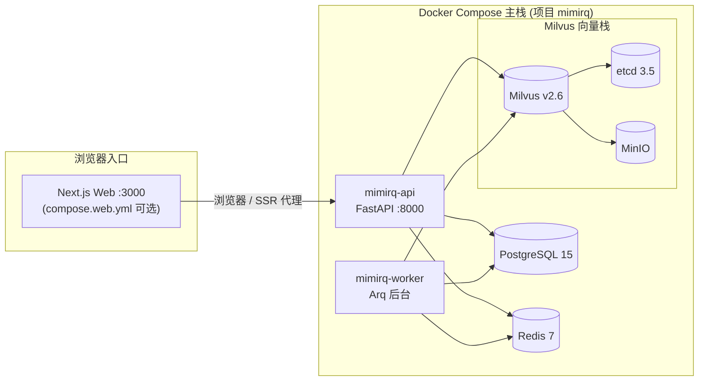
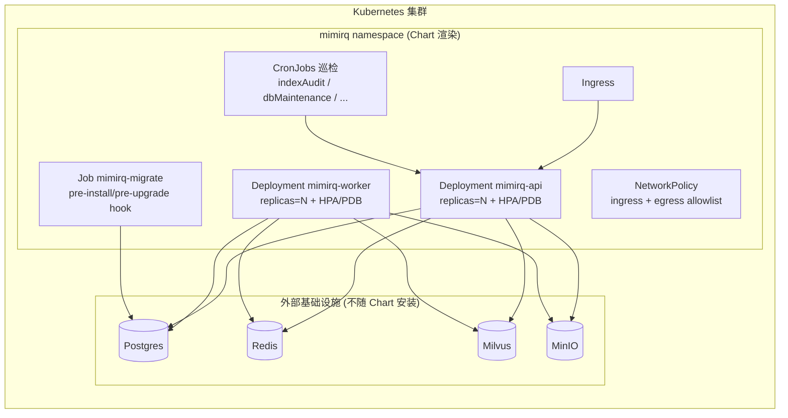
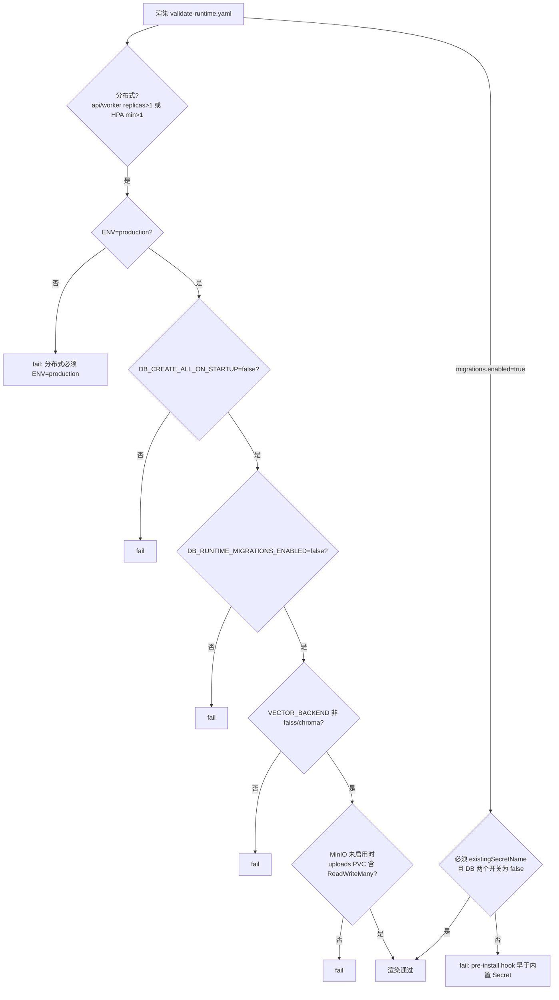

MimirQ 采用**双层部署策略**：Docker Compose 覆盖单机、低资源与本地开发场景，Helm Chart 面向 Kubernetes 生产环境。两者共享同一套后端镜像与 `_DOCKER` 容器内环境变量约定，差异集中在基础设施归属、副本规模与安全边界上。本文聚焦 Compose 五种变体的服务拓扑与生命周期管理、Helm Chart 的渲染期校验机制、生产 values 基线，以及迁移与排错路径。

## 部署拓扑总览

MimirQ 的部署拓扑围绕**两个无状态应用进程**展开：`mimirq-api`（FastAPI 服务）与 `mimirq-worker`（Arq 后台任务消费者）。两者共享同一镜像、同一组环境变量与同一数据卷，差异仅在于启动命令——API 运行 uvicorn，Worker 运行 `arq app.tasks.worker.WorkerSettings`。这种"同镜像、双命令"的设计使 Compose 与 Helm 的部署单元完全一致，迁移成本集中在基础设施配置而非应用形态。



Sources: [docker-compose.yml](docker/docker-compose.yml#L3-L54), [docker-compose.yml](docker/docker-compose.yml#L56-L241)

Helm 侧拓扑则把**基础设施完全外置**：Chart 只渲染 API/Worker 两个 Deployment 及配套的 Service、Ingress、HPA、PDB、NetworkPolicy 与巡检 CronJob，Postgres/Redis/Milvus/MinIO 由集群外部或独立 namespace 提供。API 与 Worker 的探针（readiness 走 `/api/v1/health/ready`，liveness 走 `/api/v1/health`）构成应用与依赖之间的契约边界——依赖不可达时 readiness 返回 503，Pod 不会接流量。



Sources: [helm.md](docs/deployment/helm.md#L18-L33), [deployment-api.yaml](deploy/helm/mimirq/templates/deployment-api.yaml#L54-L88), [Chart.yaml](deploy/helm/mimirq/Chart.yaml#L1-L7)

## Docker Compose：五种变体与部署矩阵

Compose 配置以**五个文件、按需叠加**的方式组织，Makefile 通过 `COMPOSE_CLI` 变量（固定 `--project-name mimirq --env-file .env`）统一调用。主栈 `docker-compose.yml` 定义了名为 `mimirq` 的独立 Compose 项目——这是资源隔离边界，同一台机器上其他 Compose 应用（如 Dify）即使放在同名目录也不会被 MimirQ 的清理命令误伤。

| Compose 文件 | 组成 | 向量库 | 对象存储 | 典型用途 |
|:---|:---|:---|:---|:---|
| `docker-compose.yml` | api + worker + Postgres + Redis + Milvus(etcd + MinIO) | Milvus | MinIO | 主栈默认，功能完整 |
| `docker-compose.lite.yml` | api + worker + Postgres + Redis | Chroma/FAISS | 无 | 小内存机器、快速试跑 |
| `docker-compose.infra.yml` | 仅基础设施（端口暴露到 `127.0.0.1`） | — | — | 宿主机运行后端的本地开发 |
| `docker-compose.parsers.yml` | 可选外部解析服务（Marker/olmOCR/MinerU/MagicPDF 等） | — | — | `--profile` 按需启用 |
| `docker-compose.web.yml` | Next.js 前端（生产构建） | — | — | 叠加到主栈 |

Sources: [docker_compose.md](docs/deployment/docker_compose.md#L1-L20), [Makefile](Makefile#L43-L49)

主栈使用 YAML 锚点（`x-backend-build`、`x-backend-env`、`x-docker-logging`）在 API 与 Worker 之间共享构建参数、环境变量与日志轮转配置。**`_DOCKER` 后缀变量是 Compose 环境的关键约定**：容器内端点强制指向服务名（如 `DATABASE_URL` 解析到 `mimirq-postgres:5432`、`REDIS_URL` 到 `mimirq-redis:6379/0`、`MINIO_ENDPOINT_DOCKER` 到 `mimirq-minio:9000`），避免依赖宿主机 `.env` 中的 localhost 默认值。`make init` 生成的根 `.env` 是唯一环境变量入口，Compose 通过 `env_file: ../.env` 加载。构建阶段还支持 `HTTP_PROXY`/`HTTPS_PROXY` 透传，解决受限网络下 Hugging Face 模型下载问题——DeepDoc 轻量模型在镜像构建时下载并校验（固定 commit `118452f3ea3ccd09a41b2d39ea82d7de535e2908`），运行时不再联网拉模型。

Sources: [docker-compose.yml](docker/docker-compose.yml#L17-L47), [docker_compose.md](docs/deployment/docker_compose.md#L22-L36), [.env.example](.env.example#L37-L106)

### 主栈服务生命周期

主栈共 7 个容器（含 `web` 时 8 个），健康检查构成严格的启动依赖链：`mimirq-api` 的 `start_period: 240s` 专门容忍空库首次建 schema 的耗时；Milvus 依赖 etcd 与 MinIO 先 healthy，API/Worker 依赖 Postgres、Milvus、Redis 全部 healthy。日志统一走 `json-file` driver 并轮转（默认单文件 10m、保留 3 个），避免长任务下日志无限增长。

| 服务 | 镜像 | 关键挂载 | 健康检查 |
|:---|:---|:---|:---|
| `mimirq-redis` | redis:7 | — | `redis-cli ping`，maxmemory 512mb + allkeys-lru |
| `mimirq-postgres` | postgres:15 | `postgres_data` | `pg_isready`；shared_buffers 256MB |
| `mimirq-etcd` | registry.k8s.io/etcd:3.5.5-0 | `etcd_data` | `etcdctl endpoint health` |
| `mimirq-minio` | minio/minio | `minio_data` | `/minio/health/live` |
| `mimirq-milvus` | milvusdb/milvus:v2.6.11 | `milvus_data` | `/healthz`，`start_period: 90s` |
| `mimirq-api` | 自建（docker/Dockerfile） | `upload_data`、`huggingface_cache`、`plugins`、`mineru_cache` | `/api/v1/health/ready` |
| `mimirq-worker` | 自建（同镜像） | 同上 | `arq --check app.tasks.queue.WorkerHealthSettings` |

Sources: [docker-compose.yml](docker/docker-compose.yml#L58-L103), [docker-compose.yml](docker/docker-compose.yml#L104-L172), [docker-compose.yml](docker/docker-compose.yml#L173-L241)

### 低资源与开发变体

`docker-compose.lite.yml` 是**资源敏感场景**的降级路径：去掉 Milvus/etcd/MinIO，`VECTOR_BACKEND` 默认 `chroma`（本地向量持久化到 `vector_data` 卷），MinIO 相关开关置 false。它保留了 Redis 支撑的 `UPLOAD_DEDUP_ENABLED` 与 `RAG_RETRIEVAL_DISTRIBUTED_ADMISSION_ENABLED` 默认值——但文档明确标注"lite 仍是单主机 profile"，因为本地 Chroma/FAISS 后端不是多节点基线。`docker-compose.infra.yml` 则反其道而行：只启动基础设施并把端口绑定到 `127.0.0.1`（不回环地址不暴露），配合 `make backend`/`make worker` 在宿主机跑热更新代码——这是推荐的本地后端开发模式。

Sources: [docker-compose.lite.yml](docker/docker-compose.lite.yml#L12-L46), [docker-compose.lite.yml](docker/docker-compose.lite.yml#L77-L129), [docker-compose.infra.yml](docker/docker-compose.infra.yml#L3-L102)

### 数据卷与清理语义

Compose 定义了 7 个命名卷：`postgres_data`、`etcd_data`、`minio_data`、`milvus_data`、`upload_data`、`mineru_cache`（共享解析模型缓存）、`huggingface_cache`（避免容器重建后重下 embedding 大模型）。清理操作按"破坏性递增"分三档，全部通过 Makefile 目标执行且只作用于 `mimirq` 项目：

| 目标 | 容器/网络 | 命名卷 | 镜像 | 适用 |
|:---|:---:|:---:|:---:|:---|
| `make down` | 删除 | 保留 | 保留 | 暂停并保留数据 |
| `make docker-reset` | 删除 | 删除 | 保留 | 首次管理员状态异常、数据污染 |
| `make docker-purge` | 删除 | 删除 | 删除（`--rmi all`） | 完全重建 |

Sources: [docker_compose.md](docs/deployment/docker_compose.md#L208-L225), [docker-compose.yml](docker/docker-compose.yml#L242-L263), [Makefile](Makefile#L279-L297)

### 生产模式 Compose 基线

生产部署仍复用 `docker-compose.yml`，核心是**把数据库所有权从应用移交到运维侧**：设置 `ENV=production`、`AUTH_MODE=jwt`、`MIMIRQ_DB_CREATE_ALL_ON_STARTUP=false`、`MIMIRQ_DB_RUNTIME_MIGRATIONS_ENABLED=false`，数据库迁移改由 `make db-upgrade`（Alembic）在启动前显式执行。`make up-prod` 前的 `prod-preflight` 目标会以 `ENV=production` 加载配置做验证。生产基线默认开启两项 Redis 支撑的守护：`UPLOAD_DEDUP_ENABLED`（上传幂等）与 `RAG_RETRIEVAL_DISTRIBUTED_ADMISSION_ENABLED`（检索分布式准入，保守并发 3）。首个管理员支持无人值守引导——`INITIAL_ADMIN_EMAIL`/`INITIAL_ADMIN_USERNAME` 配合明文密码或 `INITIAL_ADMIN_PASSWORD_FILE`（推荐挂载为 Docker secret），或保留 `INITIAL_REGISTRATION_TOKEN` 作为手工首登 fallback。生产核对清单强调：不使用默认 `postgres`/`minioadmin` 凭据、浏览器入口走 HTTPS 终止的反向代理、`FORWARDED_ALLOW_IPS` 只填可信代理（禁止 `*`）。

Sources: [docker_compose.md](docs/deployment/docker_compose.md#L141-L207), [Makefile](Makefile#L237-L244)

## Helm Chart：Kubernetes 部署与渲染期校验

Helm Chart 位于 `deploy/helm/mimirq`，版本 0.1.0，**设计哲学是"默认不安装数据库/向量库/Redis/MinIO"**——与云托管基础设施的企业常见做法对齐。Chart 渲染 13 类资源：API/Worker Deployment、Service、Ingress、HPA、PDB、NetworkPolicy、Secret、PVC、迁移 Job（hook）、ServiceMonitor/PrometheusRule、Grafana Dashboard ConfigMap 与 6 个可选 CronJob。镜像默认 `mimirq/mimirq:<tag>`，需替换为自有 registry 后 `docker build -f docker/Dockerfile` 推送。

| 模板文件 | 资源 | 关键行为 |
|:---|:---|:---|
| `deployment-api.yaml` | Deployment | readiness `/api/v1/health/ready`、liveness `/api/v1/health` |
| `deployment-worker.yaml` | Deployment | exec 探针 `arq --check`，命令 `arq app.tasks.worker.WorkerSettings` |
| `job-migrate.yaml` | Job (hook) | `pre-install,pre-upgrade`，权重 -5，跑 `alembic upgrade head` |
| `validate-runtime.yaml` | 渲染期校验 | fail-fast 规则（见下） |
| `networkpolicy.yaml` | NetworkPolicy | api 默认允许同 namespace，worker 拒绝 ingress |
| `secret.yaml` | Secret | 仅当 `existingSecretName` 为空时创建 |
| `hpa.yaml` / `pdb.yaml` | HPA / PDB | `autoscaling.enabled` / `pdb.enabled` 控制 |
| `cronjob-*.yaml` | CronJob | indexAudit / evidenceDriftAudit / accessReviewSummary / semanticCacheRetention / dbMaintenance / nightlyAblations |

Sources: [helm.md](docs/deployment/helm.md#L1-L17), [helm.md](docs/deployment/helm.md#L34-L44), [deployment-worker.yaml](deploy/helm/mimirq/templates/deployment-worker.yaml#L1-L112)

### 渲染期 fail-fast 校验

`validate-runtime.yaml` 是 Chart 最具防御性的设计：它在 **helm 渲染阶段**（而非运行期）计算 API/Worker 副本数、合并 `extraEnv` → `runtimeGuards` → `secretEnv` 三层的环境变量取值（`mimirq.envLookup` 辅助函数），然后按"是否分布式"（任一 replicas > 1 或 HPA minReplicas > 1）判定多实例安全边界。`runtimeGuards` 的存在是因为使用外部 Secret 时 Helm 无法读取其内容，必须靠 values 提示值完成校验。



Sources: [validate-runtime.yaml](deploy/helm/mimirq/templates/validate-runtime.yaml#L1-L54), [_helpers.tpl](deploy/helm/mimirq/templates/_helpers.tpl#L148)

这些规则的**业务动机**清晰：本地向量后端（FAISS/Chroma）按进程内状态设计，多副本会撕裂索引；`DB_CREATE_ALL_ON_STARTUP` 多实例并发建表存在竞态；迁移 hook 是 pre-install 阶段，早于 Chart 管理的 Secret 创建，因此必须引用外部 Secret。API 在 `DB_CREATE_ALL_ON_STARTUP=false` 且运行时迁移关闭时会校验 `alembic_version`——迁移 Job 未执行或落后时 readiness 保持 503，**从机制上杜绝 schema 不兼容的 Pod 接流量**。

Sources: [helm.md](docs/deployment/helm.md#L203-L237), [helm.md](docs/deployment/helm.md#L80-L202)

### Secret 管理：外部优先

Chart 的 Secret 策略是"**外部创建、Chart 引用**"：生产环境用 `existingSecretName` 指向 Vault/KMS/External Secrets Operator 管理的 Secret，Chart 内置的 `secret.yaml` 仅在 `existingSecretName` 为空时渲染 `secretEnv` 中的开发友好默认值。Secret 内容即应用环境变量（`ENV`、`DATABASE_URL`、`SECRET_KEY`、`LLM_API_KEY`、`MINIO_*` 等），通过 `envFrom.secretRef` 注入所有 Pod。`checksum/env` 注解（仅内置 Secret 时）驱动配置变更触发滚动更新。部署侧还默认 `automountServiceAccountToken: false`——应用不需要集群内 API 访问，不挂载 K8s token 是更安全默认。

Sources: [secret.yaml](deploy/helm/mimirq/templates/secret.yaml#L1-L15), [values.yaml](deploy/helm/mimirq/values.yaml#L21-L27), [values.yaml](deploy/helm/mimirq/values.yaml#L75-L95), [deployment-api.yaml](deploy/helm/mimirq/templates/deployment-api.yaml#L13-L16)

## 生产 Helm values：三层叠加策略

官方示例把生产配置组织为**三层叠加**：`values-prod.yaml`（可运行生产基线）→ `values-hardened.yaml`（安全加固覆盖）→ `values-periodic-audits.yaml`（巡检 CronJob）。Chart 默认值保留单机/开发便利，文档明确警示"不要直接把 chart 默认值当生产 values"。

```bash
helm upgrade --install mimirq deploy/helm/mimirq -n mimirq \
  -f deploy/helm/mimirq/examples/values-prod.yaml \
  -f deploy/helm/mimirq/examples/values-hardened.yaml
```

Sources: [values-prod.yaml](deploy/helm/mimirq/examples/values-prod.yaml#L1-L21), [values-hardened.yaml](deploy/helm/mimirq/examples/values-hardened.yaml#L1-L12), [helm.md](docs/deployment/helm.md#L220-L237)

### 多副本生产基线

`values-prod.yaml` 的关键决策：API/Worker 各 2 副本；`RATE_LIMIT_REDIS_ENABLED=true`（多副本限流状态必须共享）；`BM25_INDEX_ENABLED=false`（避免每 Pod 重建内存 BM25 索引，改用 Postgres 词法检索）；`SEMANTIC_CACHE_ENABLED=true`；显式 `runtimeGuards` 声明 production/milvus/MinIO 状态。NetworkPolicy 开启 egress allowlist 模式，规则逐一放行 Postgres(5432)、Redis(6379)、Milvus(19530)、MinIO(9000) 与外部 LLM 的 443。uploads PVC 设 50Gi。`migrations.enabled=true` 要求外部 Secret 且 DB 双开关关闭。

Sources: [values-prod.yaml](deploy/helm/mimirq/examples/values-prod.yaml#L23-L98), [values-prod.yaml](deploy/helm/mimirq/examples/values-prod.yaml#L100-L173)

### 安全基线、可观测与巡检自动化

`values-hardened.yaml` 叠加 `security.hardened=true`（官方非 root 镜像的 `securityContext`：drop ALL capabilities、`runAsNonRoot: true`、seccomp RuntimeDefault；`readOnlyRootFilesystem` 故意不默认开启，因为 Chroma/FAISS 等可选后端会在 /app 下写入）、`tmpEmptyDir`（配合只读根文件系统）、专用 ServiceAccount、ServiceMonitor + PrometheusRule + Grafana Dashboard。可观测前提是外部 Secret 中 `PROMETHEUS_ENABLED=true` 开启 `/metrics`。

Chart 内置 6 个可选 CronJob，把运维巡检做成可复用自动化：`indexAudit`（每日索引一致性汇总）、`evidenceDriftAudit`（evidence 引用漂移）、`accessReviewSummary`（访问审查汇总）、`semanticCacheRetention`（语义缓存保留）、`dbMaintenance`（VACUUM/审计日志保留）、`nightlyAblations`（夜间检索消融）。它们共享三条设计纪律——**默认 PII-safe**（只写计数/ID，不含文档内容与 query 原文）、**Bounded**（`maxDatasets`/`maxCheckIds`/`maxScan` 等上限参数）、**审计可追溯**（结果进 audit logs，可对接 SIEM）。推荐先用 `execute=false`（dry-run）验证，再切换执行模式。

Sources: [values-hardened.yaml](deploy/helm/mimirq/examples/values-hardened.yaml#L14-L40), [helm.md](docs/deployment/helm.md#L238-L263), [helm.md](docs/deployment/helm.md#L304-L356), [cronjob-index-audit.yaml](deploy/helm/mimirq/templates/cronjob-index-audit.yaml#L1-L110)

## 安装、迁移与验证流程

Helm 安装前先做渲染自检：`make helm-template`（渲染冒烟）与 `make helm-lint`。`migrations.enabled=true` 时渲染阶段额外校验外部 Secret 与 DB 双开关。迁移 Job 是 `pre-install,pre-upgrade` hook（权重 -5，`before-hook-creation,hook-succeeded` 清理策略），确保每次安装/升级先跑 `alembic upgrade head`，`activeDeadlineSeconds: 1800` 限制迁移时长，`backoffLimit: 1` 避免无限重试。

```bash
make helm-template
make helm-lint
helm upgrade --install mimirq deploy/helm/mimirq \
  -n mimirq --create-namespace -f values-prod.yaml

# 验证
kubectl -n mimirq get pods && kubectl -n mimirq get svc
kubectl -n mimirq logs deploy/mimirq-mimirq-api -f
# 无 Ingress 时端口转发验证就绪
kubectl -n mimirq port-forward svc/mimirq-mimirq 8000:8000
curl -fsS http://localhost:8000/api/v1/health/ready
```

Sources: [helm.md](docs/deployment/helm.md#L357-L391), [helm.md](docs/deployment/helm.md#L392-L408), [job-migrate.yaml](deploy/helm/mimirq/templates/job-migrate.yaml#L1-L81), [Makefile](Makefile#L590-L593)

## 排错要点与交叉引用

| 症状 | 定位路径 | 检查项 |
|:---|:---|:---|
| Compose 配置合并异常 | `docker compose config` | 是否叠加了全部 `-f` 文件、项目名是否 `mimirq` |
| API readiness 503 | `curl -fsS /api/v1/health/ready` | Postgres/Redis/向量库/MinIO 地址与网络策略 |
| 迁移后仍 503 | `kubectl logs job/mimirq-migrate` | `alembic_version` 是否落后于镜像 Alembic head |
| Worker 不消费任务 | `kubectl logs deploy/mimirq-mimirq-worker` | `TASK_QUEUE_ENABLED`、`REDIS_URL` 可达性 |
| 上传/解析报错 | 检查 PVC 写权限 | `UPLOAD_DIR=/data/uploads` 与挂载状态 |
| 多副本限流失效 | 检查 Secret | `RATE_LIMIT_REDIS_ENABLED=true` 是否注入 |

Sources: [docker_compose.md](docs/deployment/docker_compose.md#L383-L389), [helm.md](docs/deployment/helm.md#L392-L408)

本页与目录中其他章节的衔接关系：Compose/Helm 管理的存储依赖详见 [存储层：向量库、对象存储与关系库](24-cun-chu-ceng-xiang-liang-ku-dui-xiang-cun-chu-yu-guan-xi-ku)；Worker 队列语义与 arq 探针对应 [任务队列与后台作业](25-ren-wu-dui-lie-yu-hou-tai-zuo-ye)；Prometheus/OTel 接入细节见 [可观测性：指标、追踪与日志](26-ke-guan-ce-xing-zhi-biao-zhui-zong-yu-ri-zhi)；`FORWARDED_ALLOW_IPS`、JWT 与限流的安全边界展开于 [安全加固：JWT、PII 与限流](27-an-quan-jia-gu-jwt-pii-yu-xian-liu)；部署后的自动验证链路（`make api-smoke`、live-core-release-gate 等）属于 [CI/CD 与测试体系](29-ci-cd-yu-ce-shi-ti-xi)。若你尚未确定采用哪种部署形态，建议先读 [部署方式选择：完整栈、轻量与源码开发](3-bu-shu-fang-shi-xuan-ze-wan-zheng-zhan-qing-liang-yu-yuan-ma-kai-fa) 再回到本页执行。