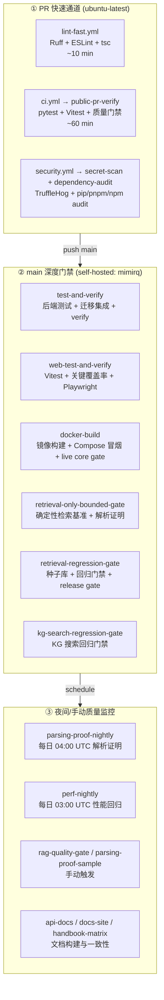
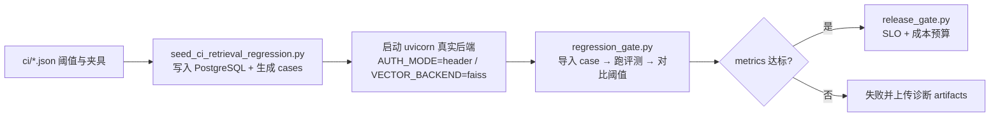

MimirQ 的持续集成体系不是单一的"跑测试"流水线，而是一套**按风险分级、按成本分层**的多级门禁系统：PR 阶段用轻量快速验证守住基础质量，`main` 分支合并后由自托管 Runner 执行深度回归门禁（检索、知识图谱、解析、性能、容器冒烟），夜间再由定时任务监控长期漂移。整个体系由 `.github/workflows/` 下 10 个工作流、`ci/` 目录下的声明式阈值 JSON、以及 `tests/`（214 个 Python 测试文件）与 `web/`（432 个前端单元测试 + 4 个 E2E 套件）构成。核心设计原则是：**可复现性优先**——所有门禁都依赖确定性夹具（deterministic fixtures）与 Mock LLM，保证 CI 结果不随外部模型服务波动。

## 工作流全景：三层流水线架构

从触发时机与运行成本来看，10 个工作流可以划分为三条层级分明的流水线：

各工作流的触发条件、运行环境与核心职责如下：

| 工作流 | 触发时机 | Runner | 核心职责 |
|---|---|---|---|
| `ci.yml` | PR / push main / 手动 | PR 用 ubuntu，main 用 self-hosted | 全栈测试 + 容器冒烟 + 检索/KG 回归门禁 |
| `lint-fast.yml` | PR / push main | ubuntu（PR）或 self-hosted | Ruff、ESLint、TypeScript 类型检查 |
| `security.yml` | PR / push main / 每周一 | 同上 | TruffleHog 密钥扫描 + 三方依赖审计 |
| `parsing-proof-nightly.yml` | 每日 04:00 UTC | ubuntu | 解析→检索端到端证明批跑 |
| `perf-nightly.yml` | 每日 03:00 UTC | ubuntu | retrieval-dev 栈性能基准对比 |
| `parsing-proof-sample.yml` | 手动 | ubuntu | 解析证明样本子集 |
| `rag-quality-gate.yml` | 手动 | ubuntu | 检索基准 + 答案质量门禁 + 解析证明 |
| `api-docs.yml` | PR / push main | 混合 | 构建并发布 API 文档到 GitHub Pages |
| `docs-site.yml` | 手动 | ubuntu | Docusaurus 手册构建与链接检查 |
| `handbook-matrix.yml` | 手动 | ubuntu | FE/BE 矩阵与 OpenAPI 一致性校验 |

所有工作流在文件头部统一声明 `permissions: contents: read` 最小权限、`concurrency` 组与 `cancel-in-progress: true`（同分支新提交自动取消旧任务），并共享一组以 `CI_` 前缀注入的环境变量（`CI_PIP_INDEX_URL`、`CI_HTTP_PROXY`、`CI_TORCH_WHEEL_DIR` 等）来适配自托管环境的镜像源与代理。Sources: [ci.yml](.github/workflows/ci.yml#L1-L28), [lint-fast.yml](.github/workflows/lint-fast.yml#L1-L26), [security.yml](.github/workflows/security.yml#L1-L28)

## PR 快速通道：轻量验证优先

PR 阶段刻意只跑"能快速给出确定性结论"的检查，把耗时 30 分钟以上的深度门禁留给 main 分支。`lint-fast` 是最轻的一层：仅安装 `ruff==0.15.9` 对 `app/tests/scripts/main.py` 做静态检查，随后用 `pnpm install --frozen-lockfile --ignore-scripts` 安装前端依赖并执行 ESLint 与 `tsc --noEmit`，全程控制在 10 分钟内。Sources: [lint-fast.yml](.github/workflows/lint-fast.yml#L27-L77)

`ci.yml` 的 `public-pr-verify` 是 PR 的主验证任务，启动 PostgreSQL 15 与 Redis 7 两个 service 容器后依次执行：

1. **OpenAPI 类型检查**（`make openapi-check`）与 web 端 API 类型漂移门禁（`check-api-types-drift.mjs --strict`），保证后端契约变更不会静默破坏前端类型；
2. **后端全量测试**（`make test`，pytest 并行），通过 `LLM_MOCK_ENABLED=true` 与 `LLM_API_KEY=sk-test` 注入 Mock LLM，实现零外部依赖的确定性测试；
3. **数据库迁移集成测试**（`make db-upgrade` 后针对 4 个迁移集成测试文件单独跑 pytest），验证 Alembic 从历史 revision 升级的兼容性；
4. **PR 级有界混合 RAG 质量门禁**：先跑 `run_sample_retrieval_benchmark.py` 生成基准，再用 `build_rag_quality_gate_artifacts.py` 构建答案质量摘要，最后以 `test_rag_quality_gate.py` 断言门禁接线正确；
5. **PR 托管 live core gate**（`run_ci_live_core_gate.sh`）：在 GitHub 托管 Runner 上启动轻量栈验证核心链路，产物上传为 artifact。

Sources: [ci.yml](.github/workflows/ci.yml#L28-L208)

## main 深度门禁：自托管 Runner 上的五道关卡

main 分支的合并触发 `test-and-verify`、`web-test-and-verify`、`docker-build`、`retrieval-only-bounded-gate`、`retrieval-regression-gate`、`kg-search-regression-gate` 六个任务，运行在标记为 `[self-hosted, Linux, X64, mimirq]` 的专用 Runner 上。自托管 Runner 的核心价值是**依赖缓存复用**：`scripts/prepare_self_hosted_ci.sh` 会预置 Python 3.11 虚拟环境、pip 缓存目录与 CPU 版 PyTorch wheel 目录（`--include-torch-wheel-dir`），随后 `ci/download_verified_wheels.py` 从缓存目录安装固定版本 `torch-2.13.0+cpu` 与 `torchvision-0.28.0+cpu` wheel，避免每次构建都从 PyPI 拉取数百 MB 依赖。Sources: [ci.yml](.github/workflows/ci.yml#L210-L232), [test_ci_workflow_contracts.py](tests/test_ci_workflow_contracts.py#L26-L42)

### 第一关：test-and-verify（后端全量）

该任务在 90 分钟超时内串起后端测试与仓储自检：`make test`（pytest 并行）→ `make db-upgrade` + 4 个迁移集成测试 → `make test-matrix`（生成全栈测试覆盖矩阵）→ `make verify`（聚合 lint、策略校验、文档链接检查与前端 typecheck，见下文"本地等价命令"）。最终把 `artifacts/test-coverage-matrix.json/.md` 作为 artifact 上传，形成可审计的测试覆盖快照。Sources: [ci.yml](.github/workflows/ci.yml#L210-L308), [Makefile](Makefile#L356-L358)

### 第二关：web-test-and-verify（前端全量）

前端任务单独运行以隔离 Node 工具链：先执行 `make test-web`（Vitest 全量单元测试），随后运行**关键文件覆盖率门禁** `pnpm run test:coverage:critical`——该配置只对 8 个安全与协议关键文件（`auth-headers.ts`、`client-storage.ts`、`sse.ts`、`tenant-permissions.ts` 等）统计覆盖率，要求 statements ≥ 55%、branches ≥ 35%、functions ≥ 50%，把有限预算集中在高风险代码上。最后安装 Playwright Chromium 并执行浏览器冒烟套件 `make test-web-e2e`。Sources: [ci.yml](.github/workflows/ci.yml#L310-L345), [vitest.critical.config.ts](web/vitest.critical.config.ts#L1-L30)

### 第三关：docker-build（容器与发布链路冒烟）

该任务验证的不是"能编译"，而是**用户手册描述的部署方式真的能跑**：校验 Helm chart → 构建后端与 web 镜像 → 依次拉起 README 的 Docker Compose 快速启动栈、lite 轻量栈并做健康冒烟 → 对构建产物镜像执行 JWT 浏览器冒烟（`run_ci_jwt_browser_smoke.sh`）→ 双 API 实例的 web-proxy 冒烟（`smoke_test.py` 同时探测主备 base URL）→ 最后在 `docker-compose.retrieval-dev.yml` 栈上执行 `live_core_release_gate.py`（真实容器内验证上传幂等、跨租户隔离、并发检索等 6 项发布核心能力）。每步结束都强制 `down -v` 清理，防止端口与卷污染。Sources: [ci.yml](.github/workflows/ci.yml#L350-L584), [live_core_release_gate.py](scripts/live_core_release_gate.py#L1-L25)

### 第四、五关：检索与知识图谱回归门禁

这两道是 MimirQ 质量体系中最具特色的**声明式阈值门禁**，采用"有界夹具 → 种子库 → 起真实后端 → 跑门禁脚本"的固定模式：

`retrieval-only-bounded-gate` 先行执行 4 种检索模式（keyword / hybrid / sparse / colbert）的确定性样本基准与解析证明批跑，产物由 `retrieval-regression-gate` 下载复用（`needs: retrieval-only-bounded-gate` 的依赖关系）。回归门禁使用 `ci/retrieval_thresholds.v2.json`：整体与按文件类型（md/pdf）、语言（en/zh）切片均要求 `retrieval_recall ≥ 1.0`、`hit_at_20 ≥ 1.0`，即**确定性夹具上不允许任何召回回退**。Sources: [ci.yml](.github/workflows/ci.yml#L584-L680), [ci.yml](.github/workflows/ci.yml#L1341-L1430), [retrieval_thresholds.v2.json](ci/retrieval_thresholds.v2.json#L1-L80)

KG 门禁在 `KG_ENABLED=true`、禁用 Milvus/embedding/BM25 的最小化环境启动后端，以 `ci/kg_search_regression_fixture.v1.json` 种子图谱数据后，用 `kg_search_regression_gate.py` 断言 `baseline_hit_rate / baseline_mrr / baseline_recall` 均 ≥ 1.0。门禁脚本动态分配宿主端口（`MIMIRQ_RETRIEVAL_API_PORT` / `MIMIRQ_KG_API_PORT`）避免并发任务冲突，并通过 `api_ping.py` 轮询就绪（120 次 × 1s），后端提前退出时输出完整日志辅助定位。Sources: [ci.yml](.github/workflows/ci.yml#L1627-L1758), [kg_search_thresholds.v1.json](ci/kg_search_thresholds.v1.json#L1-L20)

## 声明式阈值体系：`ci/` 目录是质量契约的单一事实源

`ci/` 下 19 个 JSON 文件构成一套可审计、可演进的质量契约，全部遵循 `schema: mimirq.*.vN` 版本化约定。每个门禁脚本（`regression_gate.py`、`parsing_retrieval_proof_gate.py`、`diff_perf_suite_reports.py` 等）只负责"执行与对比"，阈值本身不硬编码在代码里：

| 契约文件 | 作用域 | 关键阈值 |
|---|---|---|
| `retrieval_thresholds.v2.json` | 检索回归 | recall / hit@20 / MRR / NDCG ≥ 1.0，abstain_rate = 0 |
| `parsing_retrieval_proof_thresholds.v1.json` | 解析证明 | hit_at_k_mean、mrr_mean ≥ 1.0（required） |
| `perf_regression_policy.v1.json` | 性能回归 | p95 比值增幅 ≤ 0.5 且绝对值 ≤ 50ms；p99 ≤ 100ms |
| `release_gate_budgets.v1.json` | 发布卡口 | 60/1440 分钟窗口内 retrieval p95 ≤ 5s、p99 ≤ 15s、零命中率 ≤ 0.25、错误率 ≤ 0.05；LLM token 预算 |
| `queryset_health_policy.v1.json` | 查询集健康 | hit@k / MRR / NDCG 跌幅 ≤ 0.03，p95 延迟回归 ≤ 20ms |
| `answer_quality_thresholds.v1.json` | 答案质量 | RAG 答案质量门禁阈值 |
| `parser_benchmark_baseline.v1.json` + `parser_strict_profile.v1.json` | 解析基准 | 解析器严格门禁基线 |

策略校验本身也被纳入门禁链：`validate_queryset_health_policy.py`、`validate_parsing_retrieval_proof_governance.py`、`validate_parsing_retrieval_proof_rollout.py` 会在执行基准前先规范化并验证策略文件结构，并通过 `make verify` 中的 `check-*` 目标保证**策略文件自身的合法性与门禁脚本的接线一致性**。Sources: [perf_regression_policy.v1.json](ci/perf_regression_policy.v1.json#L1-L12), [release_gate_budgets.v1.json](ci/release_gate_budgets.v1.json#L1-L40), [queryset_health_policy.v1.json](ci/queryset_health_policy.v1.json#L1-L9), [Makefile](Makefile#L416-L430)

## 夜间监控：长期漂移的哨兵

两条定时工作流弥补了 PR/main 门禁"只看当前提交"的盲区，通过固定基线对比捕捉渐进式劣化：

**perf-nightly**（每日 03:00 UTC）在 ubuntu Runner 上启动 `docker-compose.retrieval-dev.yml` 全栈，用 `run_perf_suite.py --llm-mock --iterations 10` 采集当前性能快照，再以 `diff_perf_suite_reports.py --strict` 对比 `ci/perf_suite_baseline.v1.json` 基线——任何 p95/p99 超标的回归都会让任务失败并上传 `perf_suite.diff.md` 供人工审查。Sources: [perf-nightly.yml](.github/workflows/perf-nightly.yml#L14-L85)

**parsing-proof-nightly**（每日 04:00 UTC）跑更广的解析→检索证明批（`run_sample_parsing_retrieval_proof.py`），产出 batch spec、fixture、report、rollout、summary 等完整工件集，经 `parsing_retrieval_proof_gate.py` 判定后与 `ci/parsing_retrieval_proof_summary_baseline.v1.json` 做 diff，形成解析质量随时间变化的可追溯证据链。Sources: [parsing-proof-nightly.yml](.github/workflows/parsing-proof-nightly.yml#L14-L64)

## 安全扫描与依赖治理

`security.yml` 在 PR 与 main 双通道上执行两道防线：**secret-scan** 用 TruffleHog 容器对 `git file://. --branch HEAD` 做已确认（verified）密钥扫描并 `--fail` 阻断；**dependency-audit** 分别对 Python（`pip-audit`）、web（`pnpm audit` + `check_pnpm_audit.py` 结构化校验）、手册（`npm audit`）执行 high 级别以上的漏洞审计。Python 审计在 Makefile 中显式忽略 4 个无补丁的已知通告（`--ignore-vuln`），将例外集中管理而非散落各处。Sources: [security.yml](.github/workflows/security.yml#L29-L105), [Makefile](Makefile#L490-L507)

依赖更新由 `.github/dependabot.yml` 治理：pip、web npm、docs-site npm、github-actions 四个生态均按周调度，且全部配置 `cooldown: default-days: 7`（合并后 7 天冷却期）与分组（每组 10 个 PR 上限），避免依赖批量涌入冲击 CI 稳定性。Sources: [dependabot.yml](.github/dependabot.yml#L1-L44)

## 后端测试体系：pytest + 确定性夹具

`tests/` 目录含 219 个文件（其中 214 个 `test_*.py`），按领域垂直切片组织：文档生命周期（16 个）、数据集（10 个）、检索（9 个）、知识图谱（9 个）、对话（7 个）、评测（6 个）等。`pytest.ini` 通过 `filterwarnings` 精确屏蔽第三方库的已知弃用告警（torch pynvml、Milvus LangChain、Click 等），同时保留项目自身告警，保证测试日志可读性。Sources: [pytest.ini](pytest.ini#L1-L20)

测试体系有三大特征值得注意：

1. **契约自测**：`test_ci_workflow_contracts.py` 是"测试 CI 自身的测试"——它直接读取 `.github/workflows/ci.yml` 与 `scripts/prepare_self_hosted_ci.sh` 的文本，断言自托管引导脚本的每个环境变量输出、各 job 的 `timeout-minutes`、种子脚本在 `import app.models._all` 前完成路径引导等约定。任何破坏 CI 稳定性的重构都会先被测试拦截。Sources: [test_ci_workflow_contracts.py](tests/test_ci_workflow_contracts.py#L1-L80)
2. **集成测试显式开关**：`MIMIRQ_INTEGRATION_TESTS=1` 环境变量显式开启需要真实 PostgreSQL 的迁移/版本集成测试，与纯单元测试在 CI 中分段执行。
3. **确定性嵌入**：`test_deterministic_test_embedding.py` 等测试保证嵌入向量在测试环境可复现，这是检索类门禁阈值敢设 1.0 的前提。

## 前端测试体系：Vitest 单元 + Playwright E2E 双层

前端测试由三个独立配置的 Vitest 项目与一套 Playwright E2E 组成。`vitest.config.ts` 是全量单元测试（432 个 `*.test.{ts,tsx}`），覆盖 `components/app/hooks/lib` 四类源码，`testTimeout: 15000`；`vitest.critical.config.ts` 是上文所述的关键文件覆盖率门禁；`vitest.enterprise-telemetry.config.ts` 面向企业遥测链路。E2E 的 `playwright.config.ts` 展示了环境适配技巧：通过 `PLAYWRIGHT_USE_PROD_SERVER` / `PLAYWRIGHT_LIVE_STACK` / `PLAYWRIGHT_EXTERNAL_SERVER` 三个开关在"本地 dev server"与"生产构建产物"之间切换，并实现 `ensureLocalNoProxy` 确保本地探测流量永不经过全局代理。Sources: [vitest.config.ts](web/vitest.config.ts#L1-L30), [playwright.config.ts](web/playwright.config.ts#L1-L45)

四个 E2E 套件按发布风险分级：`document-chat.smoke.spec.ts` 与 `live-stack.smoke.spec.ts` 是核心冒烟（`test-core-browser-smoke`），`management-surfaces.smoke.spec.ts` 是管理面冒烟，`command-menu-document-view.spec.ts` 是命令菜单交互回归，另有 `visual-regression.spec.ts-snapshots` 目录承载视觉回归基线。Sources: [Makefile](Makefile#L349-L355)

## 测试覆盖矩阵：全栈可审计性

`make test-matrix`（CI 中为 `Generate full-stack test inventory` 步骤）调用 `scripts/generate_test_coverage_matrix.py`：解析 `web/openapi.json` 提取全部后端路由，扫描前端 `*.test.ts`/`*.spec.ts` 与 `app/` 目录路由，交叉生成"每个 API 端点是否被前端调用、每个页面是否有对应测试"的覆盖矩阵，输出 `artifacts/test-coverage-matrix.json` 与 `.md`。该矩阵作为 artifact 上传，让每次 main 构建都留下一份可审计的全栈覆盖快照，也为 `test_test_inventory_contract.py` 等契约测试提供输入。Sources: [Makefile](Makefile#L356-L358), [generate_test_coverage_matrix.py](scripts/generate_test_coverage_matrix.py#L1-L50)

## 本地开发等价命令

`Makefile` 将 CI 的每个环节都映射为本地可执行目标，保证"CI 能过的本地也能过"：

| CI 环节 | 本地命令 | 说明 |
|---|---|---|
| 后端测试 | `make test` | pytest 并行（`-n auto`），`make test-serial` 串行 |
| 前端单元测试 | `make test-web` | Vitest run |
| E2E | `make test-web-e2e` / `test-management-smoke` / `test-core-browser-smoke` | Playwright，生产 server 模式 |
| 全量 verify | `make verify` | lint + 策略校验 + OpenAPI + 文档链接 + 前端 lint/typecheck |
| 数据库迁移 | `make db-upgrade` | alembic upgrade head |
| 依赖审计 | `make audit`（`audit-py` / `audit-web` / `audit-docs`） | 与 CI security 对齐 |
| OpenAPI 检查 | `make openapi-check` | 导出 + 校验 |

Sources: [Makefile](Makefile#L333-L358), [Makefile](Makefile#L567-L610), [Makefile](Makefile#L521-L540)

## 文档生态的持续集成

三个工作流守护文档生态的一致性：`api-docs.yml` 在 push main 时构建 Redoc API 站点并发布 GitHub Pages（PR 阶段仅验证构建）；`docs-site.yml` 验证 Docusaurus 手册可构建且相对链接有效；`handbook-matrix.yml` 则执行更严格的**新鲜度门禁**——重新导出 OpenAPI 并重新生成 `fe-be-matrix.mdx` 后 `git diff --exit-code` 检查生成物是否已提交，防止 API 变更后手册矩阵过期。这套"生成物必须提交"的约定与 `scripts/docs/generate_fe_be_matrix.py`、`check_doc_links.mjs` 共同构成文档质量防线。Sources: [api-docs.yml](.github/workflows/api-docs.yml#L1-L40), [docs-site.yml](.github/workflows/docs-site.yml#L1-L29), [handbook-matrix.yml](.github/workflows/handbook-matrix.yml#L11-L34)

## 体系设计总结

回看整套 CI/CD，MimirQ 的核心设计权衡清晰可见：**用确定性换取可信度，用分层换取成本效率**。确定性体现在 Mock LLM、CPU 版固定 wheel、声明式阈值与有界夹具——这让"阈值 = 1.0"的严格门禁成为可能而非摆设；分层体现在 PR（10 分钟 lint → 60 分钟验证）→ main（90 分钟深度门禁 + 容器冒烟）→ nightly（跨日漂移监控）的成本阶梯，让每次提交只承担与风险匹配的验证代价。对 CI 自身的契约测试（`test_ci_workflow_contracts.py`）与策略校验（`check-*` 目标）则确保了这套体系在持续演进中不会悄然失效。

---

**继续阅读建议**：本页重点在"如何验证质量"，与之配套的 [评测体系：指标、题集与 RAGAS](18-ping-ce-ti-xi-zhi-biao-ti-ji-yu-ragas) 介绍评测指标的定义与题集组织，[回归门禁与发布质量卡口](19-hui-gui-men-jin-yu-fa-bu-zhi-liang-qia-kou) 从脚本视角深入 `regression_gate.py` 与 `release_gate.py` 的实现，[部署运维：Docker Compose 与 Helm](28-bu-shu-yun-wei-docker-compose-yu-helm) 则覆盖 CI 中 docker-build 阶段所冒烟的部署链路。