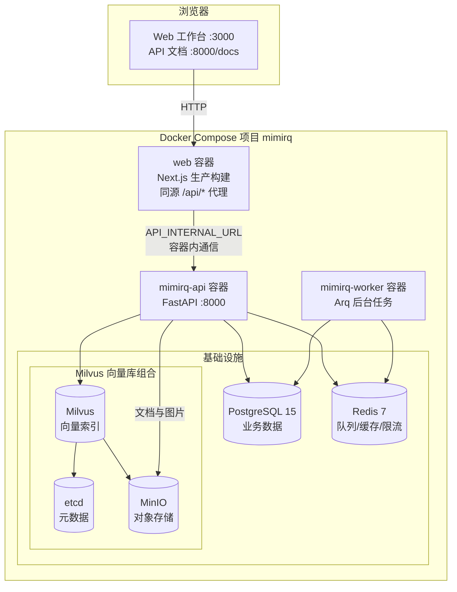
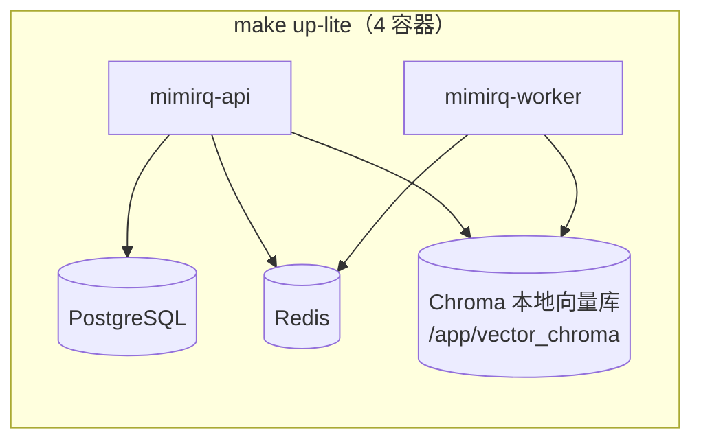
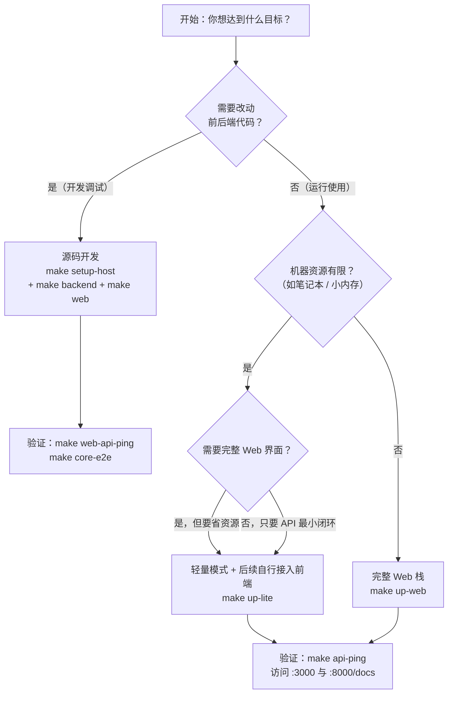

MimirQ（见外传媒知识库）提供多套部署方式，分别面向「快速体验、低资源试跑、源码开发调试」三种典型阶段。所有方式共用同一套代码库和同一份 `.env` 配置，区别只在于**哪些组件跑在 Docker 容器里、向量库与对象存储用什么实现、前端是否使用热更新**。本文帮助你在一张对比表和一张决策图中找到适合当前阶段的启动方式，并说明每种方式背后的服务组成与资源含义。

## 三种方式一张表看懂

仓库根目录的 [README.md](README.md#L204-L213) 给出了官方推荐的三条命令入口。把它们放在一起对比，差异立刻清晰：

| 对比维度 | 完整 Web 栈 | 轻量模式 | 源码开发 |
|:---|:---|:---|:---|
| **启动命令** | `make up-web` | `make up-lite` | `make setup-host` → `make backend` + `make web` |
| **前端** | Docker 生产构建（Next.js 容器） | 无前端（仅 API） | 本机 `pnpm dev` 热更新 |
| **向量库** | Milvus（含 etcd + MinIO） | Chroma 本地文件（默认） | 跟随基础设施：`infra-up` 起 Milvus，或本地 Chroma/FAISS |
| **对象存储** | MinIO（存图片与源文档） | 关闭（`MINIO_ENABLED_DOCKER=false`） | 跟随基础设施 MinIO |
| **数据库** | PostgreSQL 15 容器 | PostgreSQL 15 容器 | PostgreSQL 15 容器（`infra-up` 暴露本机端口） |
| **任务队列** | Redis + 独立 Arq Worker 容器 | Redis + 独立 Arq Worker 容器 | 默认 `TASK_QUEUE_ENABLED=false`，由 API 进程内有界处理 |
| **容器数量** | 默认 8 个 | 4 个 | 仅基础设施 5 个（应用跑在宿主机） |
| **热更新** | 无 | 无 | 有（后端 `--reload`，前端 `pnpm dev`） |
| **适合场景** | 首次体验、团队试用、服务器部署 | 低资源环境、API 最小闭环验证 | 前后端开发与热更新调试 |

三者共享同一套 PostgreSQL + Redis 底座，因此**切换方式不会改变业务数据模型**——向量库后端（Milvus 与 Chroma）是唯一需要留意的数据差异，因为更换 Embedding 或向量库后必须重建已有索引。README 的「选择部署方式」表同样标注了 Helm/Kubernetes 作为集群化生产的第四条路径，本文聚焦前三者的选型，集群部署细节见 [部署运维：Docker Compose 与 Helm](28-bu-shu-yun-wei-docker-compose-yu-helm)。

Sources: [README.md](README.md#L204-L213)、[README.md](README.md#L166-L172)

## 部署架构全景

三种方式并非三个互不相干的系统，而是**同一套主栈按需裁剪**。主栈 `docker/docker-compose.yml` 定义了完整的后端与基础设施；`docker-compose.web.yml` 叠加前端；`docker-compose.lite.yml` 用本地向量库替换 Milvus/MinIO 以降低资源占用；源码开发则把应用进程挪到宿主机，仅保留基础设施容器。下面用架构图展示完整 Web 栈的组件关系：



图中的 8 个容器（`mimirq-redis`、`mimirq-postgres`、`mimirq-etcd`、`mimirq-minio`、`mimirq-milvus`、`mimirq-api`、`mimirq-worker`、`web`）就是 `make up-web` 启动的完整栈。API 与 Worker 共用同一个后端镜像 `docker/Dockerfile` 构建，区别仅在于启动命令——API 执行 `uvicorn`，Worker 执行 `arq`。镜像构建阶段会下载并校验固定版本的解析模型，构建完成后运行时不再联网下载模型。

Sources: [docker/docker-compose.yml](docker/docker-compose.yml#L56-L241)、[docker/docker-compose.web.yml](docker/docker-compose.web.yml#L1-L46)、[docker/Dockerfile](docker/Dockerfile#L108-L116)、[docs/deployment/docker_compose.md](docs/deployment/docker_compose.md#L3-L17)

## 方式一：完整 Web 栈（推荐起步）

**命令：`make up-web`**，等价于 `docker compose -f docker/docker-compose.yml -f docker/docker-compose.web.yml up -d --build`。它是 README「快速体验」的主路径，也是「首次体验、团队试用、服务器部署」的统一入口。

启动前只需完成两步：先 `make init` 生成本地配置（详见下文「环境准备」），再在 `.env` 中填写 `LLM_API_KEY`——这是完成真实知识库闭环的**最低必填项**。然后执行 `make up-web` 与 `make api-ping`，即可访问 Web 工作台（`http://localhost:3000`）和 API 文档（`http://localhost:8000/docs`）。

这个模式包含全部能力：Milvus 支持大规模向量检索与知识图谱事件/实体向量，MinIO 保存源文档与解析产物，Redis Worker 处理文档解析与索引的异步任务。注意 `make up-web` 启动的是**完整的 Docker Web 栈**，不是"只起前端"——前端容器通过同源 `/api/*` 代理访问后端，浏览器不需要知道 Docker 内部主机名；浏览器地址由 `NEXT_PUBLIC_API_URL_DOCKER=/` 控制，SSR 容器内地址由 `API_INTERNAL_URL_DOCKER=http://mimirq-api:8000` 控制。

Sources: [README.md](README.md#L174-L202)、[Makefile](Makefile#L197-L198)、[docs/quickstart.md](docs/quickstart.md#L11-L45)、[docs/quickstart.md](docs/quickstart.md#L116)、[.env.example](.env.example#L474-L481)

## 方式二：轻量模式（低资源试跑）

**命令：`make up-lite`**，使用独立的 `docker/docker-compose.lite.yml`。它只启动 `mimirq-redis`、`mimirq-postgres`、`mimirq-api`、`mimirq-worker` 四个容器，**不启动 Milvus、etcd、MinIO**，向量检索改用本地文件型 Chroma（默认 `VECTOR_BACKEND=chroma`，持久化到 `vector_data` 卷），对象存储默认关闭。



轻量模式保留了与完整栈一致的 PostgreSQL 业务数据、Redis 队列/幂等锁/分布式准入控制，以及独立的 Arq Worker，因此**API 行为与完整栈基本一致**，只是向量库从分布式 Milvus 换成单机 Chroma。它适合笔记本、小内存机器或快速试跑：`docs/quickstart.md` 明确建议「低资源模式（lite：不启动 Milvus/MinIO，默认使用 Chroma 本地向量库）适合：笔记本 / 小内存机器 / 快速试跑（更省资源）」。需要注意，Chroma 是单主机实现，不是多节点生产基线，若后续要切换回 Milvus，需要重建向量索引。

Sources: [Makefile](Makefile#L200-L201)、[docker/docker-compose.lite.yml](docker/docker-compose.lite.yml#L20-L39)、[docker/docker-compose.lite.yml](docker/docker-compose.lite.yml#L47-L133)、[docs/quickstart.md](docs/quickstart.md#L56-L59)、[docs/deployment/docker_compose.md](docs/deployment/docker_compose.md#L112-L118)

## 方式三：源码开发（前后端热更新）

**命令：`make setup-host`**，它是 `make init` + `make install-host` + `make models` + `make infra-up` 的组合：在宿主机创建 Python 虚拟环境并安装后端依赖、用 pnpm 安装前端依赖、下载固定版本的解析模型、以 Docker 方式启动基础设施（PostgreSQL、Redis、Milvus、MinIO，端口暴露到 `127.0.0.1` 便于本机直连）。

随后在两个终端分别运行：

```bash
# 终端 1：FastAPI（热更新）
make backend

# 终端 2：Next.js（热更新）
make web
```

`make backend` 使用 `uvicorn --reload` 监听 `app/` 与 `scripts/` 目录，`make web` 使用 `pnpm dev`（默认绑定 `127.0.0.1:3000`，端口占用时自动顺延）。默认 `TASK_QUEUE_ENABLED=false`，后台文档任务由 API 进程内有界处理（`API_DOCUMENT_BACKGROUND_MAX_CONCURRENCY` 控制并发）；需要独立队列时，在 `.env` 设置 `TASK_QUEUE_ENABLED=true` 并重启 API，再于第三个终端运行 `make worker`，随后可用 `make worker-check` 验证 Redis 存活标记。若宿主机文件监听额度较低、`uploads/` 较大，可用 `make backend-no-reload` 关闭文件监听。

这套模式的价值在于**修改代码立即生效**：前端改动由 Vite/Next.js 热更新，后端改动由 Uvicorn reload 自动重载，适合功能开发与调试。代价是宿主机需要 Python 3.11+、Node.js 20+、pnpm 等完整工具链，且 `make setup-host` 首次安装依赖耗时较长。`web/README.md` 还提供了 `pnpm dev -- --port 3001`、`pnpm dev:public`（局域网访问）等前端变体。

Sources: [Makefile](Makefile#L180-L192)、[Makefile](Makefile#L318-L331)、[docs/quickstart.md](docs/quickstart.md#L75-L99)、[.env.example](.env.example#L88-L93)、[web/README.md](web/README.md#L5-L27)

## 其他相关启动方式（按需使用）

除了三种主方式，仓库还提供两条补充路径，理解它们有助于在「选型」时避免混淆：

**最小检索实验栈 `make up-retrieval-dev`**：只启动 postgres + redis + api（无 Worker、无解析服务），默认 `LLM_MOCK_ENABLED=true`、`EMBEDDING_PROVIDER=deterministic_test`，用于召回/排序的离线对比实验，不依赖外部模型 API。官方经验值：推荐 4 vCPU / 8 GB RAM，热启动约 20-60 秒可达 `api-ping` 全绿，但不适合高并发生产压测。

**生产模式 `make up-prod` / `make up-prod-web`**：在完整栈基础上以 `ENV=production` 运行配置预检，要求 `MIMIRQ_DB_CREATE_ALL_ON_STARTUP=false`、`MIMIRQ_DB_RUNTIME_MIGRATIONS_ENABLED=false`，并先执行 `make db-upgrade`；同时强制 `AUTH_MODE=jwt`、强 `SECRET_KEY`、非默认数据库/MinIO 凭据。生产清单的完整说明见 [部署运维：Docker Compose 与 Helm](28-bu-shu-yun-wei-docker-compose-yu-helm)，本页不展开。

Sources: [Makefile](Makefile#L203-L204)、[Makefile](Makefile#L240-L244)、[docker/docker-compose.retrieval-dev.yml](docker/docker-compose.retrieval-dev.yml#L11-L42)、[docs/quickstart.md](docs/quickstart.md#L61-L66)、[docs/quickstart.md](docs/quickstart.md#L109-L114)、[docs/deployment/docker_compose.md](docs/deployment/docker_compose.md#L141-L168)

## 如何选择：决策流程

把上面的对比收敛成一张决策图。核心判断依据是三个问题：**是否有前端需求？资源是否紧张？是否需要改代码？**



补充三条经验法则：**第一**，只想"跑起来看效果"就选 `make up-web`，一条命令覆盖全部组件，官方推荐硬件为 4 核 CPU、16 GB 内存、50 GB 磁盘；**第二**，机器资源紧张且只验证 API 链路就选 `make up-lite`，省掉 Milvus/MinIO 两个最重的组件；**第三**，要写代码就选源码开发——不要在 Docker 栈里改代码，因为镜像内没有热更新。若目标是检索质量实验（不关心外部模型），`make up-retrieval-dev` 是最轻的选项。

Sources: [README.md](README.md#L170-L172)、[README.md](README.md#L206-L211)、[docs/quickstart.md](docs/quickstart.md#L75-L99)

## 环境准备与通用前置

无论选择哪种方式，第一步都是 `make init`（无 GNU Make 时运行 `python scripts/init_env.py`）。该脚本**非破坏性**地创建缺失的 `.env` 与 `web/.env.local`，并自动填充随机 `SECRET_KEY` 与 `MARKDOWN_IMAGE_PROXY_SECRET`，不会覆盖已有值，也不会把密钥写入仓库。

生成 `.env` 后，真实模型闭环**最低只需填写 `LLM_API_KEY`**——默认配置为硅基流动 OpenAI 兼容接口：LLM 使用 `Qwen/Qwen3-32B`，Embedding 使用 `BAAI/bge-m3` 且复用 LLM 的 Key 与 Base URL，Reranker 默认关闭。LLM、Embedding、Reranker 使用独立服务时，需分别填写对应地址、Key 与模型名；其中 Reranker 的 `RERANKER_API_BASE` 必须是**完整 rerank 请求端点**，不是普通 `/v1` Base URL。

| 配置项 | 完整栈 / 轻量模式（Docker） | 源码开发（宿主机） |
|:---|:---|:---|
| 访问本机模型服务 | Docker Desktop 用 `http://host.docker.internal:<port>`；Linux 用宿主机局域网 IP | 直接用 `http://127.0.0.1:<port>` |
| 访问公网/局域网模型 | 相同地址 | 相同地址 |
| 数据库连接 | 容器内用 `_DOCKER` 变量（如 `DATABASE_URL` 指向 `mimirq-postgres`） | `.env` 默认 `localhost:5432` |

另一个容易踩坑的点：**Docker 容器内不要使用宿主机视角的 `localhost` 地址**。Compose 配置里已通过 `_DOCKER` 后缀变量固定容器间端点（`MILVUS_HOST_DOCKER=mimirq-milvus`、`REDIS_URL_DOCKER=redis://mimirq-redis:6379/0` 等），源码开发模式则直接使用宿主机 `localhost` 端口。模型服务地址差异与管理员首次配置的完整规则，见下一页 [模型服务与首次管理员配置](4-mo-xing-fu-wu-yu-shou-ci-guan-li-yuan-pei-zhi)。

Sources: [scripts/init_env.py](scripts/init_env.py#L45-L113)、[.env.example](.env.example#L1-L10)、[docs/guides/model_services.md](docs/guides/model_services.md#L7-L67)、[.env.example](.env.example#L18-L19)、[.env.example](.env.example#L82-L86)

## 下一步

选定部署方式并成功启动后，按以下顺序继续：

1. 完成模型服务配置与首个管理员创建——阅读 [模型服务与首次管理员配置](4-mo-xing-fu-wu-yu-shou-ci-guan-li-yuan-pei-zhi)，这是从"服务能启动"走向"知识库能闭环"的必经步骤；
2. 理解系统整体结构——阅读 [总体架构与技术栈](5-zong-ti-jia-gou-yu-ji-zhu-zhan)，了解前后端、任务队列与存储层如何协作；
3. 进入正式使用——[快速启动与首次体验](2-kuai-su-qi-dong-yu-shou-ci-ti-yan) 提供了从登录到首次问答的完整操作路径。

若启动过程中遇到问题，先运行 `make doctor`（环境自检）、`make api-ping`（后端可达性）与 `make compose-diagnostics`（容器状态汇总）三条诊断命令，绝大多数"起不来"的问题都能在输出中找到线索。