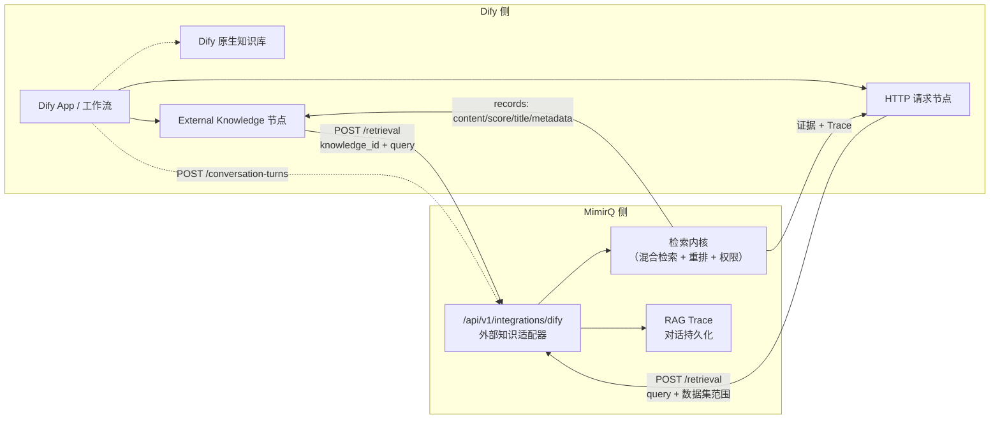
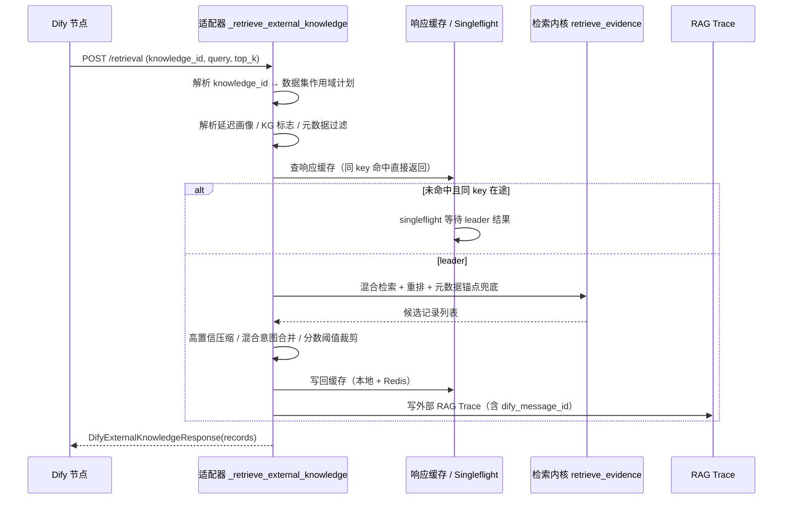

MimirQ 与 Dify 的对接遵循一个清晰的分工原则：**Dify 负责应用编排、对话流程与答案生成，MimirQ 负责知识治理、检索、重排、权限过滤与证据产出**。本页讲解两种接入方式（External Knowledge API 与 Workflow HTTP 节点）、外部知识适配器的内部机制、配置安全模型，以及基于常州政务场景的实测对照结果。

## 集成定位：检索与生成的分工边界

MimirQ 把"找到证据"和"生成答案"分开验收——检索测试判断召回与重排是否正确，问答判断 LLM 是否基于证据作答。当检索正确而答案错误时，应检查 Prompt、上下文裁剪和 LLM，而不是为单题增加业务特判。这个原则直接塑造了 Dify 集成的形态：Dify 的 App 与工作流负责生成链路，而 MimirQ 以外部知识源的身份向 Dify 提供真实检索结果。官方文档明确列出两种接入方式：**External Knowledge API**（`POST /api/v1/integrations/dify/retrieval`）与 **Workflow HTTP 节点**（Dify 传查询、数据集范围和过滤参数，MimirQ 返回证据和 Trace），请求字段与调用顺序以 OpenAPI 为准。Sources: [docs-site/docs/guide/welcome.md](docs-site/docs/guide/welcome.md#L124-L137), [README.md](README.md#L148-L154)

两种方式的核心差异在于 Dify 侧如何消费 MimirQ 的结果。External Knowledge API 是 Dify 平台原生的外部知识库协议，Dify 内置检索节点以 `knowledge_id` 标识知识源；Workflow HTTP 节点则是在 Dify 工作流中手工添加 HTTP 请求节点，直接调用 MimirQ 的检索端点并自行解析返回的 JSON。两条链路最终都回到 MimirQ 同一套检索内核，因此召回质量一致，差异主要体现在请求协议、延迟特征和生成环节的 Prompt 约束上——这也正是常州实测中"证据覆盖高、答案条款覆盖低"这一现象的分析基础。



Sources: [docs-site/docs/guide/welcome.md](docs-site/docs/guide/welcome.md#L124-L137), [app/api/v1/integrations_dify.py](app/api/v1/integrations_dify.py#L1-L7)

## 外部知识适配器：请求处理流水线

`app/api/v1/integrations_dify.py` 是实现外部知识适配器的核心模块（约 8000 行），模块文档自述其定位：**将 MimirQ 数据集暴露为 Dify External Knowledge API 的知识源**——Dify 以 `knowledge_id` 调用端点，MimirQ 将其映射到一个或多个数据集 ID，运行既有的仅检索流水线，并以 Dify records 格式返回。该路由在 `app/api/v1/__init__.py` 中以 `/integrations/dify` 前缀注册，与主 API 路由并列。Sources: [app/api/v1/integrations_dify.py](app/api/v1/integrations_dify.py#L1-L7), [app/api/v1/__init__.py](app/api/v1/__init__.py#L37)

适配器对外只暴露两个端点，职责边界非常收敛：

| 端点 | 方法 | 作用 | 关键字段 |
|:---|:---|:---|:---|
| `/integrations/dify/retrieval` | POST | Dify 外部知识检索主入口，返回 `{records: [{content, score, title, metadata}]}` | `knowledge_id`、`query`、`retrieval_setting`、`metadata_condition`、`dify_message_id` |
| `/integrations/dify/conversation-turns` | POST | 将 Dify 对话轮次（问题、答案、引用）持久化到 MimirQ，接入既有 RAG Trace 与反馈体系 | `query`、`answer`、`citations`、`dify_conversation_id`、`source_run_id` |

Sources: [app/api/v1/integrations_dify.py](app/api/v1/integrations_dify.py#L6911-L6947), [app/api/v1/integrations_dify.py](app/api/v1/integrations_dify.py#L1032-L1057)

请求处理流水线在 `_retrieve_external_knowledge` 中按固定顺序展开：先解析 `knowledge_id` 得到数据集作用域计划（含主范围与扩展范围），再按延迟画像决定内部候选窗口与响应窗口，随后解析策略插件引用、元数据过滤条件与 KG 辅助开关，最后进入既有的 `retrieve_evidence` 检索内核执行混合检索。适配器在此之上叠加了多层次的可靠性机制——短时响应缓存、singleflight 请求合并、分布式租约与预热——这些机制专门针对 Dify 场景的高重复请求与冷启动延迟问题设计。Sources: [app/api/v1/integrations_dify.py](app/api/v1/integrations_dify.py#L6950-L7034), [app/api/v1/integrations_dify.py](app/api/v1/integrations_dify.py#L6439-L6490)



Sources: [app/api/v1/integrations_dify.py](app/api/v1/integrations_dify.py#L6950-L7050), [app/api/v1/integrations_dify.py](app/api/v1/integrations_dify.py#L7800-L7889)

## knowledge_id 映射与数据集作用域

`knowledge_id` 是 Dify 侧唯一的知识源标识，MimirQ 通过 `DIFY_EXTERNAL_KNOWLEDGE_MAP_JSON` 环境变量维护从 `knowledge_id` 到数据集 ID 的映射。解析逻辑 `_resolve_knowledge_dataset_scope` 优先查映射表；若未命中，则依据解析模式决定是否允许将 `knowledge_id` 直接按数据集 UUID 处理——生产环境强制 `mapped_only`，`allow_dataset_uuid` 仅限本地兼容场景。Sources: [app/api/v1/integrations_dify.py](app/api/v1/integrations_dify.py#L2476-L2507), [.env.example](.env.example#L1871-L1879)

映射值支持三种形态：单个 `dataset_id`、数组 `dataset_ids`、或带高级选项的对象（`plugin_refs` 声明检索策略插件，`query_routes` 声明查询路由，`inherit_query_routes_from` 复用其他映射的路由）。查询路由是召回提示而非硬过滤：未匹配路由的数据集默认不进入范围，避免聚合知识库的宽泛噪声；`strict_query_routes` 才作为硬范围。主范围检索的语义同样如此——非 strict route 只作为召回 hint。Sources: [app/api/v1/integrations_dify.py](app/api/v1/integrations_dify.py#L2173-L2248), [.env.example](.env.example#L1894-L1897)

```json
{
  "shared": { "dataset_id": "dataset-uuid-a", "query_routes": [] },
  "faq": {
    "dataset_id": "dataset-uuid-c",
    "plugin_refs": ["plugin:domain-knowledge-demo@1.0.0:chunk"],
    "inherit_query_routes_from": ["shared"]
  }
}
```

前端设置页提供了可视化的绑定管理：管理员选择一个或多个数据集，系统自动生成 `kb_<名称>` 形式的 `knowledge_id` 并写入映射 JSON；"当前绑定"面板展示所有映射条目，支持逐条删除。Sources: [web/app/settings/_sections/dify-integration-section.tsx](web/app/settings/_sections/dify-integration-section.tsx#L73-L77), [web/app/settings/_sections/dify-integration-section.tsx](web/app/settings/_sections/dify-integration-section.tsx#L148-L163)

## 认证、租户与安全模型

外部知识端点使用独立于主 API 的 Bearer Token 认证。`_require_dify_actor` 的校验顺序为：先检查功能开关 `DIFY_EXTERNAL_KNOWLEDGE_ENABLED`，未开启直接返回 404；再校验 `Authorization` 头中的 Bearer Token 是否匹配 `DIFY_EXTERNAL_KNOWLEDGE_API_KEYS`（支持逗号分隔多值，生产建议使用 `sha256:<hex>` 摘要存储）；随后解析租户 ID 与服务账号。租户 ID 在请求未携带租户头时取自 `DIFY_EXTERNAL_KNOWLEDGE_TENANT_ID`，生产环境强制要求显式配置；服务账号默认 `system:dify`，必须具备目标数据集的读取权限。Sources: [app/api/v1/integrations_dify.py](app/api/v1/integrations_dify.py#L1930-L1960), [.env.example](.env.example#L1859-L1869)

配置校验在启动期强制执行安全底线：启用适配器时 `DIFY_EXTERNAL_KNOWLEDGE_API_KEYS` 必填；`sha256:` 前缀的令牌必须是 64 位十六进制摘要；生产环境 `DIFY_EXTERNAL_KNOWLEDGE_TENANT_ID` 必填且必须是合法 UUID；`allow_dataset_uuid` 解析模式在生产环境直接拒绝。此外，适配器使用独立的 `_DifyErrorRoute` 路由类统一格式化 HTTP 异常响应，避免内部错误细节泄露到 Dify 侧。Sources: [app/core/config_validation.py](app/core/config_validation.py#L291-L314), [app/api/v1/integrations_dify.py](app/api/v1/integrations_dify.py#L607-L620)

## 检索增强特性：为 Dify 场景定制

外部知识检索不是简单透传，而是围绕 Dify 场景的短问题、实体型提问和低延迟要求做了多层定制。`dify_support` 包中的五个模块（`common`、`scoring`、`anchor_strength`、`compaction`、`records`）从主模块机械提取，负责共享常量、锚点评分、精确锚点匹配、快速响应压缩与记录去重。Sources: [app/api/v1/dify_support/common.py](app/api/v1/dify_support/common.py#L1-L5), [app/api/v1/dify_support/anchor_strength.py](app/api/v1/dify_support/anchor_strength.py#L1-L5)

**延迟画像（latency_profile）** 是请求级开关：`quality`（默认）走完整质量路径，启用重排器、KG 辅助与策略回退；`fast` 则关闭昂贵分支——候选窗口压缩到最多 3 条、响应最多 2 条、内容截断到 1400 字符，并禁用重排与 KG，专为在线对话的低延迟预算设计。该字段是 MimirQ 扩展，Dify 标准载荷可省略。Sources: [app/api/v1/integrations_dify.py](app/api/v1/integrations_dify.py#L956-L969), [app/api/v1/integrations_dify.py](app/api/v1/integrations_dify.py#L1060-L1066), [app/core/config.py](app/core/config.py#L999-L1006)

**候选窗口放大** 是召回质量的基石：外部返回 `top_k` 最大 5 条，但内部候选窗口按 `INTERNAL_TOP_K_MIN=20`、`MULTIPLIER=4`、`MAX=50` 放大，多取候选以提升正确内容召回，最后再裁剪对外返回。Sources: [app/api/v1/integrations_dify.py](app/api/v1/integrations_dify.py#L588-L594), [.env.example](.env.example#L1886-L1892)

**元数据锚点（metadata anchor）** 针对 Dify 短问题场景的 DB 兜底：当 RAG 向量召回不足时，按 `question`、`service_name`、`aliases`、`case_title` 等结构化元数据字段做精确/模糊锚点匹配。该兜底受累计时间预算约束（默认 1500ms），逐条 SQL 设置 `statement_timeout`，超出预算立即中止，防止慢查询拖垮延迟敏感路径。配套迁移 `0017_add_dify_metadata_anchor_indexes` 为这些字段建立了 PostgreSQL GIN trigram 索引，避免 JSONB 全表扫描。Sources: [app/api/v1/integrations_dify.py](app/api/v1/integrations_dify.py#L5940-L5978), [alembic/versions/0017_add_dify_metadata_anchor_indexes.py](alembic/versions/0017_add_dify_metadata_anchor_indexes.py#L1-L20), [app/core/config.py](app/core/config.py#L1013-L1030)

**高置信压缩（compaction）** 处理 Top-1 明显强、后续候选分数断崖式下降的场景——当 TOP1 分数 ≥ 0.7 且后续相对分数低于 0.65 时，减少返回低相关噪声块，避免 Dify 生成被无关内容干扰。**混合意图（mixed intent）** 识别"另外""分别""一并回答"等复合提问标记，拆分子查询多路召回后统一重排，避免每个子查询重复调用重排器。**KG 辅助策略**则定位为"KG 不直接回答"：查询扩展、KG 关联 chunk 注入与 KG 命中提升只影响召回与排序，前提是 `KG_ENABLED` 与 `KG_CHAT_ENABLED` 同时开启。Sources: [.env.example](.env.example#L1910-1929), [app/core/config.py](app/core/config.py#L995-L998)

## 性能与可靠性：缓存、单飞与预热

Dify 工作流在同一轮对话中可能对相同问题发起重复请求，适配器为此设计了三级防护：

| 机制 | 作用 | 关键配置 |
|:---|:---|:---|
| 响应缓存 | 同 key 在 TTL 内直接返回序列化 records；key 含数据集语料指纹（`updated_at` 哈希），数据集变更自动失效 | `RESPONSE_CACHE_TTL_SEC=30`、`MAX_ENTRIES=512` |
| Singleflight | 合并尚未完成的同键并发/重试请求，follower 等待 leader 结果；超时返回带 `Retry-After` 的 503 | `SINGLEFLIGHT_WAIT_TIMEOUT_SEC=60` |
| 分布式租约 | Redis 租约保证多实例下同一知识库只由一个实例执行检索/预热，其余实例等待 | 租约 TTL 按知识库数量动态计算 |

Sources: [app/api/v1/integrations_dify.py](app/api/v1/integrations_dify.py#L653-L697), [.env.example](.env.example#L1899-L1905), [app/api/v1/integrations_dify.py](app/api/v1/integrations_dify.py#L901-L934)

预热机制解决冷启动问题：进程启动后按知识映射表逐库执行一次探测检索（默认查询 "warmup probe"），避免首个真实请求承担 BM25 惰性构建与向量初始化延迟。预热状态通过健康检查暴露——`/health/ready` 可配置为等待预热完成（`WARMUP_REQUIRED_FOR_READY=true`），防止负载均衡器在进程冷态时切入流量；多实例部署时预热通过 Redis 租约互斥，避免重复预热。预热还受 RAG 检索槽位并发限制保护，不会抢占真实请求。Sources: [app/api/v1/integrations_dify.py](app/api/v1/integrations_dify.py#L901-L955), [app/api/v1/health.py](app/api/v1/health.py#L182-L217), [app/core/config.py](app/core/config.py#L958-L970)

## 可观测性与反馈闭环

外部检索的每次调用都会写入 RAG Trace，与站内对话共用同一套可观测面板。Trace 记录客户端 IP 哈希、knowledge_id 哈希、查询哈希（避免原文落日志）、检索路径、候选/响应记录数、阶段耗时与策略诊断；Dify 侧消息 ID（`dify_message_id`、`dify_workflow_run_id`）被写入 Trace 元数据，便于从 Dify 工作流反查 MimirQ 侧检索明细。`conversation-turns` 端点进一步把 Dify 生成的问答轮次持久化为 MimirQ 会话（支持按 `source_conversation_id` 幂等复用），使 Dify 对话可进入历史会话、反馈与评测体系。Sources: [app/api/v1/integrations_dify.py](app/api/v1/integrations_dify.py#L1138-L1150), [app/api/v1/integrations_dify.py](app/api/v1/integrations_dify.py#L1654-L1729), [app/services/rag_trace_service.py](app/services/rag_trace_service.py#L865-L927)

## 实测对照：四路 800 题基准

常州政务场景建立了固定 800 题、真实自托管模型（`bge-m3` + `bge-reranker-large` + `Qwen3-30B-A3B-Instruct-2507-FP16`）的四路对照评测，使用确定性证据条款匹配评分（不使用 LLM judge，无地区/事项/题号特判）。2026-07-27 最新结果为：Sources: [docs/benchmarks/changzhou_dify.md](docs/benchmarks/changzhou_dify.md#L7-L23)

| 链路 | 准确 / 部分 / 不足 | 准确率 / 可用率 | 证据 / 回答条款覆盖 | 错误证据率 |
|:---|---:|---:|---:|---:|
| **MimirQ 检索核心（无 LLM 生成）** | **791 / 9 / 0** | **98.9% / 100%** | **99.5% / 99.5%** | 4.3% |
| **MimirQ RAG 生成全链路** | **727 / 73 / 0** | **90.9% / 100%** | **99.7% / 96.6%** | 3.0% |
| **Dify HTTP → MimirQ** | 514 / 223 / 63 | 64.3% / 92.1% | 96.3% / 83.6% | 4.1% |
| **Dify External → MimirQ** | 502 / 232 / 66 | 62.7% / 91.7% | **99.7% / 83.8%** | **2.7%** |
| **Dify 原生知识库** | 309 / 287 / 204 | 38.6% / 74.5% | 83.8% / 66.1% | 79.3% |

这份数据揭示了三个关键结论：其一，MimirQ 检索核心本身达到 98.9% 准确率，证据覆盖 99.5%；其二，两条 Dify 接入链路的证据覆盖高达 96.3%–99.7%，说明**接入 MimirQ 后检索质量几乎没有损失**，准确率下降的主因在 Dify 生成环节——证据已召回但答案未按必答条款完整输出（回答条款覆盖仅约 84%）；其三，Dify 原生知识库同时存在召回不足与 79.3% 高噪声证据率，印证了外部知识接入的价值。并发探测还发现 External 链路的 Nginx 504 与入口协议转发 400 问题，以及单飞合并后 6 个并发请求仅触发 1 次实际检索的效果。Sources: [docs/benchmarks/changzhou_dify.md](docs/benchmarks/changzhou_dify.md#L11-L23), [docs/benchmarks/changzhou_dify.md](docs/benchmarks/changzhou_dify.md#L132-L134)

## 运维脚本与工作流治理

仓库内置一整套常州政务 Dify 运维脚本，覆盖从工作流编辑到全量门禁的完整生命周期。核心脚本按职责划分如下：

| 脚本 | 职责 | 模式 |
|:---|:---|:---|
| `dify_console_login.py` | 刷新 Dify Console 登录态（storage_state），不输出任何密钥 | 只读 |
| `changzhou_gov_dify_workflow_lint.py` | 检查工作流 JSON 中"标记可选但后续节点仍引用"的隐藏必填 Start 变量（会导致 App API 在到达 MimirQ 前返回 400） | 只读 |
| `changzhou_gov_dify_workflow_sync.py` | 安全暂存/应用净化后的 Dify 草稿工作流；默认 dry-run，远端写入需显式 `--apply` | 写需显式 |
| `changzhou_gov_dify_external_knowledge_probe.py` | 边界诊断：定位 External 返回空结果发生在 Dify 侧还是 MimirQ 侧 | 只读 |
| `changzhou_gov_dify_full_gate.py` | 组合门禁：用例预检 → 答案采集 → 直连评测 → Trace 校验 | 组合 |
| `dify_3way_benchmark.py` | 三路基准：从既有黄金题集生成用例，调用 Dify App，确定性证据条款评分 | 评测 |

Sources: [scripts/dify_console_login.py](scripts/dify_console_login.py#L1-L15), [scripts/changzhou_gov_dify_workflow_lint.py](scripts/changzhou_gov_dify_workflow_lint.py#L1-L15), [scripts/changzhou_gov_dify_workflow_sync.py](scripts/changzhou_gov_dify_workflow_sync.py#L1-L10), [scripts/dify_3way_benchmark.py](scripts/dify_3way_benchmark.py#L1-L15)

工作流 lint 的独特价值在于它捕获了一类 Dify 平台陷阱：Dify 可以将 Start 变量标记为可选，但后续节点仍直接引用它，此时公共 App API 会在请求到达 MimirQ 之前就以运行时 400 拒绝。lint 同时检查 Prompt 模板中的禁止短语（如"必须按顺序包含以下标题"）并给出替换建议——这正是实测中"答案条款覆盖低"的直接归因方向。Sources: [scripts/changzhou_gov_dify_workflow_lint.py](scripts/changzhou_gov_dify_workflow_lint.py#L1-L22)

## 配置总览

Dify 外部知识适配器的全部配置集中在 `app/core/config.py` 的 Dify 段（约 85 个开关），生产环境最小启用集如下：

| 配置项 | 默认值 | 说明 |
|:---|:---|:---|
| `DIFY_EXTERNAL_KNOWLEDGE_ENABLED` | `false` | 总开关；关闭时端点返回 404 |
| `DIFY_EXTERNAL_KNOWLEDGE_API_KEYS` | 空 | Bearer Token，支持多值逗号分隔，生产用 `sha256:<hex>` |
| `DIFY_EXTERNAL_KNOWLEDGE_TENANT_ID` | 空 | 请求未带租户头时的租户；生产必填 |
| `DIFY_EXTERNAL_KNOWLEDGE_MAP_JSON` | 空 | knowledge_id → 数据集映射 |
| `DIFY_EXTERNAL_KNOWLEDGE_RESOLUTION_MODE` | `mapped_only` | 生产仅允许映射命中 |
| `DIFY_EXTERNAL_KNOWLEDGE_TOP_K_MAX` | `5` | 对外最大返回条数 |
| `DIFY_EXTERNAL_KNOWLEDGE_WARMUP_REQUIRED_FOR_READY` | `false` | readiness 是否等待预热完成 |

Sources: [app/core/config.py](app/core/config.py#L946-L1030), [.env.example](.env.example#L1859-L1929)

设置 API 以 `DifyExternalKnowledgeConfig` 模型向前端暴露可编辑子集（`enabled`、`api_keys`、`tenant_id`、`account_id`、`knowledge_map_json`、`top_k_max`、`endpoint_path`），前端通过 `web/lib/api/dify.ts` 的类型化客户端调用检索端点。Sources: [app/api/v1/settings.py](app/api/v1/settings.py#L528-L537), [web/lib/api/dify.ts](web/lib/api/dify.ts#L1-L17)

## 下一步阅读

- 理解 MimirQ 侧检索内核如何支撑外部知识召回，见 [混合检索与多路融合排序](14-hun-he-jian-suo-yu-duo-lu-rong-he-pai-xu) 与 [重排器体系与 LTR 排序学习](15-zhong-pai-qi-ti-xi-yu-ltr-pai-xu-xue-xi)
- 了解 Trace 与反馈如何承接 Dify 对话轮次，见 [引用、证据与可解释性机制](17-yin-yong-zheng-ju-yu-ke-jie-shi-xing-ji-zhi) 与 [反馈闭环与在线评测](20-fan-kui-bi-huan-yu-zai-xian-ping-ce)
- 若关注评测方法论与门禁体系，见 [评测体系：指标、题集与 RAGAS](18-ping-ce-ti-xi-zhi-biao-ti-ji-yu-ragas) 与 [回归门禁与发布质量卡口](19-hui-gui-men-jin-yu-fa-bu-zhi-liang-qia-kou)
- 部署层面的适配器开关与健康检查集成，见 [部署运维：Docker Compose 与 Helm](28-bu-shu-yun-wei-docker-compose-yu-helm)